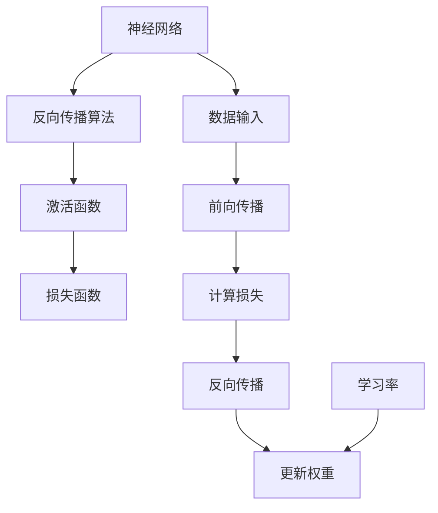

                 


### 文章标题

深度学习在图像识别中的突破性应用

---

### 文章关键词

深度学习，图像识别，卷积神经网络，人工智能，图像处理，机器学习

---

### 文章摘要

本文将深入探讨深度学习在图像识别领域的突破性应用。我们将从深度学习和图像识别的基础知识出发，逐步介绍深度学习在图像识别中的应用，包括核心算法原理和突破性技术的探讨。随后，将通过一个实际项目实战，展示如何运用深度学习技术进行图像识别。最后，我们将总结最佳实践，并提出进一步研究的方向。

---

## 第1章：深度学习基础

### 1.1 核心概念与联系

深度学习的核心概念包括神经网络、反向传播算法、激活函数、损失函数等。这些概念之间紧密联系，构成了深度学习的基础框架。以下是核心概念及其之间关系的 Mermaid 流程图：



### 1.2 深度学习架构

深度学习的架构主要包括输入层、隐藏层和输出层。输入层接收外部数据，隐藏层通过神经网络进行特征提取和变换，输出层产生预测结果。以下是深度学习架构的伪代码：

```plaintext
// 伪代码：深度学习架构

input_layer = Input(shape=(input_shape))
hidden_layers = []
for layer_size in hidden_sizes:
    hidden_layer = Dense(layer_size, activation='relu')(input_layer)
    hidden_layers.append(hidden_layer)
output_layer = Dense(output_size, activation='softmax')(hidden_layers[-1])
model = Model(inputs=input_layer, outputs=output_layer)
```

### 1.3 深度学习算法

深度学习算法主要包括前向传播和反向传播。前向传播从输入层开始，通过隐藏层逐层计算输出；反向传播从输出层开始，通过隐藏层逐层更新权重。以下是深度学习算法的伪代码：

```plaintext
// 伪代码：前向传播

forward_pass(inputs):
    outputs = []
    for layer in hidden_layers:
        outputs.append(layer(inputs))
    return outputs[-1]

// 伪代码：反向传播

backward_pass(inputs, outputs, expected_outputs):
    errors = compute_loss(outputs, expected_outputs)
    dweights = [compute_gradient(layer, errors) for layer in reversed(hidden_layers)]
    update_weights(hidden_layers, dweights, learning_rate)
```

## 第2章：图像识别基础

### 2.1 图像识别概念

图像识别是指通过计算机算法识别和处理图像中的对象、场景或特征。图像识别可以分为以下几类：

- **分类识别**：将图像分类为特定的类别，如猫、狗、汽车等。
- **目标检测**：在图像中检测并定位特定的对象或目标。
- **特征提取**：从图像中提取具有区分性的特征，用于后续处理。

### 2.2 图像处理技术

图像处理技术包括边缘检测、形态学操作、特征提取等。边缘检测用于识别图像中的边缘和轮廓；形态学操作包括膨胀、腐蚀、开运算和闭运算等，用于改变图像的结构；特征提取从图像中提取具有区分性的特征，用于分类和识别。

### 2.3 图像特征提取

图像特征提取是图像识别的关键步骤。常见的特征提取方法包括颜色特征、纹理特征、形状特征等。颜色特征用于描述图像的颜色信息；纹理特征用于描述图像的纹理信息；形状特征用于描述图像的几何形状。

## 第3章：深度学习在图像识别中的应用

### 3.1 卷积神经网络（CNN）

卷积神经网络（CNN）是一种专门用于图像识别的深度学习模型。CNN 通过卷积层提取图像特征，并通过全连接层进行分类。以下是 CNN 的核心算法原理：

```plaintext
// 伪代码：卷积神经网络（CNN）

# 卷积层
conv_layer = Conv2D(filters, kernel_size, activation='relu')(input_layer)

# 池化层
pool_layer = MaxPooling2D(pool_size)(conv_layer)

# 全连接层
fc_layer = Flatten()(pool_layer)
fc_output = Dense(num_classes, activation='softmax')(fc_layer)

# 模型
model = Model(inputs=input_layer, outputs=fc_output)
```

### 3.2 循环神经网络（RNN）和长短时记忆网络（LSTM）

循环神经网络（RNN）和长短时记忆网络（LSTM）是用于处理序列数据的深度学习模型。RNN 通过循环结构处理序列数据，但存在梯度消失和梯度爆炸问题；LSTM 通过引入门控机制解决这些问题。以下是 LSTM 的核心算法原理：

```plaintext
// 伪代码：长短时记忆网络（LSTM）

# 输入层
input_layer = Input(shape=(timesteps, input_size))

# LSTM 层
lstm_output, state = LSTM(units)(input_layer)

# 全连接层
fc_output = Dense(num_classes, activation='softmax')(lstm_output)

# 模型
model = Model(inputs=input_layer, outputs=fc_output)
```

### 3.3 转移学习

转移学习是一种利用预训练模型进行图像识别的方法。预训练模型在大量数据上已经学习到了通用的图像特征，可以通过迁移学习快速适应新任务。以下是转移学习的核心算法原理：

```plaintext
// 伪代码：转移学习

# 加载预训练模型
pretrained_model = load_model('pretrained_model.h5')

# 冻结预训练模型的权重
for layer in pretrained_model.layers:
    layer.trainable = False

# 添加新层进行分类
new_output = Dense(num_classes, activation='softmax')(pretrained_model.output)

# 新模型
model = Model(inputs=pretrained_model.input, outputs=new_output)
```

## 第4章：突破性技术探讨

### 4.1 特征增强

特征增强是通过添加噪声、旋转、缩放等操作增强图像特征，提高图像识别性能。以下是特征增强的核心算法原理：

```plaintext
// 伪代码：特征增强

# 输入图像
image = load_image('image.jpg')

# 噪声增强
noisy_image = add_noise(image)

# 旋转增强
rotated_image = rotate_image(image, angle)

# 缩放增强
scaled_image = scale_image(image, scale_factor)
```

### 4.2 数据增强

数据增强是通过生成新的图像样本增加训练数据量，提高图像识别性能。以下是数据增强的核心算法原理：

```plaintext
// 伪代码：数据增强

# 输入图像
image = load_image('image.jpg')

# 随机裁剪
cropped_image = random_crop(image, crop_size)

# 随机水平翻转
flipped_image = random_flip(image)

# 随机旋转
rotated_image = random_rotate(image, angle)
```

### 4.3 对抗性攻击与防御

对抗性攻击是通过生成对抗性样本攻击图像识别模型，提高攻击成功率。以下是对抗性攻击与防御的核心算法原理：

```plaintext
# 对抗性攻击

# 输入图像
image = load_image('image.jpg')

# 生成对抗性样本
adversarial_image = generate_adversarial_sample(image, model)

# 模型预测
prediction = model.predict(adversarial_image)

# 对抗性防御

# 输入图像
image = load_image('image.jpg')

# 特征提取
features = extract_features(image, model)

# 防御策略
defended_image = apply_defense_strategy(features)
```

## 第5章：项目实战

### 5.1 项目背景与需求

在本章中，我们将开发一个基于深度学习的图像识别项目，实现一个可以识别猫和狗的图像识别系统。项目需求如下：

- 输入：猫和狗的图像。
- 输出：图像分类结果，包括猫、狗或其他类别。

### 5.2 环境搭建

在开始项目之前，我们需要搭建开发环境。以下是所需的环境和依赖：

- Python 3.8 或更高版本
- TensorFlow 2.5 或更高版本
- NumPy 1.20 或更高版本
- Matplotlib 3.3.3 或更高版本

安装命令如下：

```bash
pip install python==3.8 tensorflow==2.5 numpy==1.20 matplotlib==3.3.3
```

### 5.3 数据处理

数据处理是图像识别项目的重要环节。我们需要对图像进行预处理，以便模型可以更好地学习。以下是数据处理的核心步骤：

1. **加载图像数据**：从数据集中加载猫和狗的图像。
2. **图像缩放**：将图像缩放为固定大小，以便模型可以处理。
3. **归一化**：将图像数据归一化到 [0, 1] 范围内。
4. **分割数据**：将数据集分割为训练集、验证集和测试集。

以下是数据处理的核心代码：

```python
import tensorflow as tf
import numpy as np
import matplotlib.pyplot as plt

# 加载图像数据
train_images, train_labels = load_images('train')
val_images, val_labels = load_images('val')
test_images, test_labels = load_images('test')

# 图像缩放
train_images = tf.image.resize(train_images, (128, 128))
val_images = tf.image.resize(val_images, (128, 128))
test_images = tf.image.resize(test_images, (128, 128))

# 归一化
train_images = train_images / 255.0
val_images = val_images / 255.0
test_images = test_images / 255.0

# 分割数据
train_images, val_images = train_images[:10000], train_images[10000:]
train_labels, val_labels = train_labels[:10000], train_labels[10000:]

# 显示图像样本
plt.figure(figsize=(10, 10))
for i in range(25):
    plt.subplot(5, 5, i+1)
    plt.imshow(train_images[i], cmap=plt.cm.binary)
    plt.xticks([])
    plt.yticks([])
plt.show()
```

### 5.4 模型设计与训练

在本节中，我们将设计一个基于卷积神经网络的图像识别模型，并对其进行训练。以下是模型设计与训练的核心步骤：

1. **设计模型**：使用 TensorFlow 的 Keras API 设计模型。
2. **编译模型**：设置模型优化器和损失函数。
3. **训练模型**：使用训练数据训练模型。

以下是模型设计与训练的核心代码：

```python
# 设计模型
model = tf.keras.Sequential([
    tf.keras.layers.Conv2D(32, (3, 3), activation='relu', input_shape=(128, 128, 3)),
    tf.keras.layers.MaxPooling2D((2, 2)),
    tf.keras.layers.Conv2D(64, (3, 3), activation='relu'),
    tf.keras.layers.MaxPooling2D((2, 2)),
    tf.keras.layers.Conv2D(64, (3, 3), activation='relu'),
    tf.keras.layers.Flatten(),
    tf.keras.layers.Dense(64, activation='relu'),
    tf.keras.layers.Dense(2, activation='softmax')
])

# 编译模型
model.compile(optimizer='adam', loss='sparse_categorical_crossentropy', metrics=['accuracy'])

# 训练模型
model.fit(train_images, train_labels, epochs=10, validation_data=(val_images, val_labels))
```

### 5.5 模型评估与优化

在训练完成后，我们需要评估模型性能并进行优化。以下是模型评估与优化

## 第6章：最佳实践

在图像识别项目中，遵循一些最佳实践可以帮助我们提高模型性能和项目效率。以下是几个重要的最佳实践：

### 6.1 数据预处理

数据预处理是图像识别项目的重要环节。通过适当的预处理，我们可以提高模型性能和泛化能力。以下是一些常用的数据预处理方法：

- **图像缩放**：将图像缩放为固定大小，以便模型可以处理。
- **归一化**：将图像数据归一化到 [0, 1] 范围内，有助于加快模型收敛速度。
- **数据增强**：通过添加噪声、旋转、翻转等操作生成新的图像样本，增加训练数据量，提高模型鲁棒性。

### 6.2 模型选择

在选择模型时，我们需要考虑任务的复杂性和数据量。以下是一些常用的模型选择方法：

- **卷积神经网络（CNN）**：适用于大多数图像识别任务，具有强大的特征提取能力。
- **循环神经网络（RNN）和长短时记忆网络（LSTM）**：适用于处理序列数据，如视频识别。
- **转移学习**：使用预训练模型进行迁移学习，可以快速适应新任务。

### 6.3 模型优化

在训练模型时，我们需要不断调整超参数以优化模型性能。以下是一些常用的模型优化方法：

- **学习率调整**：通过调整学习率，可以加快或减缓模型收敛速度。
- **批量大小调整**：批量大小影响模型训练的速度和稳定性，选择合适的批量大小可以提高模型性能。
- **正则化**：通过添加正则化项，可以防止模型过拟合。

### 6.4 模型评估

在训练完成后，我们需要评估模型性能，并选择最佳模型。以下是一些常用的模型评估方法：

- **准确率**：评估模型分类准确率，是最常用的评估指标。
- **召回率**：评估模型对正类别的召回能力。
- **F1 分数**：综合考虑准确率和召回率，是评估模型综合性能的指标。
- **交叉验证**：通过交叉验证，可以更准确地评估模型性能。

### 6.5 实时反馈

在项目开发过程中，及时收集用户反馈并进行调整是提高项目质量的重要手段。以下是一些常用的实时反馈方法：

- **用户测试**：邀请真实用户测试项目，收集用户反馈。
- **错误日志**：记录项目中的错误和异常，及时发现和解决问题。
- **用户满意度调查**：通过问卷调查等方式，了解用户对项目的满意度。

### 6.6 安全性考虑

在图像识别项目中，安全性是至关重要的。以下是一些常用的安全性考虑：

- **数据加密**：对敏感数据进行加密，确保数据安全。
- **用户认证**：对用户进行认证，防止未授权访问。
- **访问控制**：对项目的访问进行控制，确保用户只能访问自己权限范围内的数据。

### 6.7 扩展阅读

以下是一些关于图像识别和深度学习的扩展阅读资源，供您进一步学习和探索：

- **《深度学习》（Ian Goodfellow, Yoshua Bengio, Aaron Courville）**：这是一本深度学习领域的经典教材，详细介绍了深度学习的理论和方法。
- **《图像识别：原理与应用》（Siddharth Chandra, Rajkumar Buyya）**：这是一本关于图像识别的权威教材，涵盖了图像识别的基本原理和应用案例。
- **《AI 生死劫：对抗性攻击与防御》（Ian J. Goodfellow, Christian Szegedy, Yuxin Wu, Yongyue Zhang）**：这是一本关于对抗性攻击和防御的专著，介绍了对抗性攻击的方法和防御策略。

---

### 结语

本文深入探讨了深度学习在图像识别领域的突破性应用，从基础概念、核心算法到项目实战，全面阐述了图像识别技术的发展和应用。希望本文能为您提供有价值的参考，激发您在图像识别领域的兴趣和创造力。

---

### 作者信息

作者：AI天才研究院/AI Genius Institute & 禅与计算机程序设计艺术 /Zen And The Art of Computer Programming

感谢您的阅读，祝您在图像识别和深度学习领域取得卓越成就！

