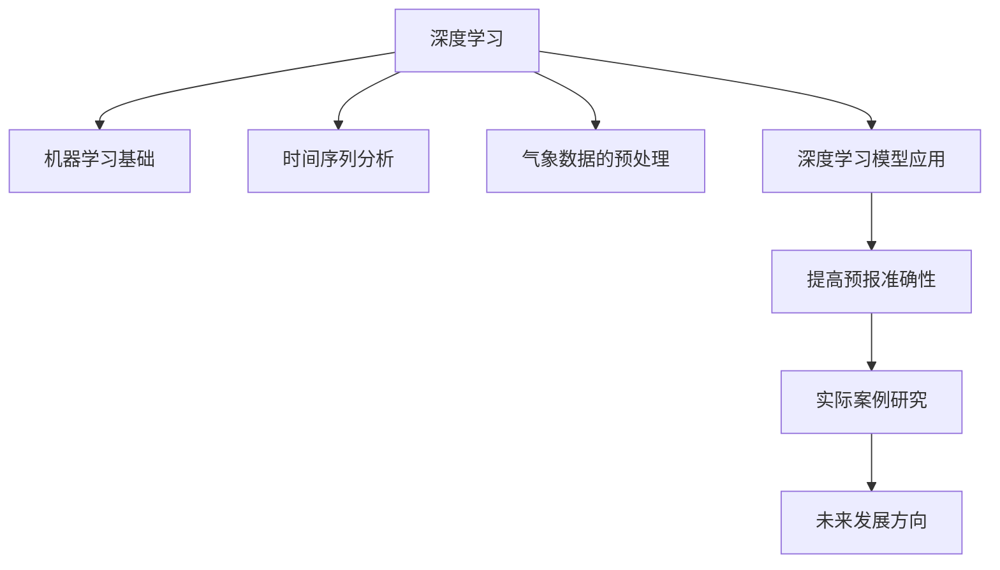

                 


### 深度学习在天气预报中的应用：提高短期预报准确性

#### 文章关键词

- 深度学习
- 天气预报
- 短期预报准确性
- 数据预处理
- 模型优化

#### 摘要

本文旨在探讨深度学习在天气预报中的应用，特别是如何提高短期预报的准确性。首先，我们将介绍深度学习的基本原理和常见架构，并简要回顾机器学习的基础知识。接着，我们将深入探讨时间序列分析的基础，以及深度学习模型在气象数据中的应用。随后，我们将介绍如何通过数据增强和模型优化来提高预报准确性，并通过实际案例研究展示这些方法的应用。最后，我们将展望深度学习在天气预报中的未来发展方向。

## 第一部分：深度学习基础

### 第1章：深度学习概述

#### 1.1 深度学习的起源与发展

深度学习作为机器学习的一个分支，起源于20世纪40年代。尽管最初的神经网络模型（如感知机）未能取得预期效果，但随着计算能力和数据量的提升，深度学习在21世纪得到了迅猛发展。特别是2006年，Hinton等人重新提出深度信念网络（DBN），使得深度学习在图像和语音识别领域取得了突破性进展。此后，深度学习在计算机视觉、自然语言处理等领域也取得了显著成果。

#### 1.2 深度学习的基本原理

深度学习基于多层神经网络架构，通过逐层提取特征，实现对复杂数据的表示和建模。神经网络的基本单元是神经元，每个神经元都与相邻的神经元相连，并传递激活信号。通过多次前向传播和反向传播，网络可以不断调整权重和偏置，以优化预测结果。

#### 1.3 深度学习的常见架构

常见的深度学习架构包括卷积神经网络（CNN）、循环神经网络（RNN）及其变体，如长短期记忆网络（LSTM）和门控循环单元（GRU）。CNN主要用于图像处理，通过卷积层、池化层和全连接层的组合，实现对图像特征的高效提取。RNN则擅长处理序列数据，如时间序列、文本序列等，通过隐藏状态和递归连接，实现对序列数据的建模。

### 第2章：机器学习基础

#### 2.1 机器学习基本概念

机器学习是一种使计算机系统能够通过数据和经验自动改进性能的技术。根据训练数据的形式，机器学习可分为监督学习、无监督学习和强化学习。监督学习通过标注数据训练模型，无监督学习则从未标注的数据中学习模式，强化学习则通过与环境的交互来优化行为。

#### 2.2 监督学习算法

监督学习算法主要包括回归、分类和预测。回归算法用于预测连续值输出，如线性回归、决策树回归等；分类算法用于预测离散值输出，如逻辑回归、支持向量机等；预测算法则是对未来的数据进行预测，如时间序列预测、序列标注等。

#### 2.3 无监督学习算法

无监督学习算法主要包括聚类、降维和生成模型。聚类算法用于将相似的数据点归为一类，如K均值聚类、层次聚类等；降维算法用于减少数据维度，如主成分分析（PCA）、线性判别分析（LDA）等；生成模型则用于建模数据分布，如高斯分布、变分自编码器（VAE）等。

### 第3章：时间序列分析

#### 3.1 时间序列分析基础

时间序列数据是一组按时间顺序排列的数据点，通常用于预测和分析短期趋势。时间序列分析主要包括时间序列建模、时间序列预测和时间序列可视化。时间序列建模旨在描述数据中的趋势、周期性和随机性；时间序列预测则是对未来的数据点进行预测；时间序列可视化则用于直观地展示数据特征。

#### 3.2 时间序列预测模型

常见的时间序列预测模型包括自回归模型（AR）、移动平均模型（MA）和自回归移动平均模型（ARMA）。自回归模型假设当前值可以由过去值的线性组合预测，移动平均模型则基于过去值的平均预测当前值，自回归移动平均模型则结合了两者的优点。

#### 3.3 时间序列数据的可视化

时间序列数据的可视化有助于直观地了解数据特征。常用的可视化方法包括折线图、散点图和热力图等。折线图用于展示数据的时间趋势，散点图则用于展示数据点之间的分布关系，热力图则用于展示不同时间点的数据强度。

## 第二部分：深度学习在天气预报中的应用

### 第4章：气象数据的预处理

#### 4.1 气象数据类型

气象数据主要包括观测数据和模拟数据。观测数据来自地面观测站、气象卫星和雷达等设备，包括温度、湿度、气压、风速、风向等参数；模拟数据则通过气象模型模拟生成，用于补充观测数据的不足。

#### 4.2 数据清洗

数据清洗是气象数据预处理的重要步骤，主要包括缺失值处理、异常值检测和噪声去除等。缺失值处理可以采用插值、均值填补等方法；异常值检测可以使用统计方法或机器学习方法；噪声去除可以采用滤波、去噪算法等。

#### 4.3 数据归一化

数据归一化是将不同量纲的数据转换为同一量纲，以便模型训练。常见的归一化方法包括最小-最大缩放、Z分数缩放等。最小-最大缩放将数据映射到[0,1]区间，Z分数缩放则将数据映射到标准正态分布。

### 第5章：深度学习模型在天气预报中的应用

#### 5.1 卷积神经网络（CNN）在气象中的应用

##### 5.1.1 CNN基本原理

CNN通过卷积层、池化层和全连接层的组合，实现对图像特征的高效提取。卷积层通过滑动窗口卷积提取局部特征，池化层用于下采样减少数据维度，全连接层则用于分类或回归。

##### 5.1.2 CNN在气象数据分析中的应用案例

CNN可以用于提取气象数据中的时空特征，例如，通过卷积层提取不同气象要素的空间分布特征，通过池化层减少数据维度，最后通过全连接层进行预测。实验表明，CNN在短期天气预报中具有较高的准确性。

#### 5.2 循环神经网络（RNN）及其变体在气象中的应用

##### 5.2.1 RNN基本原理

RNN通过递归连接，将当前输入与历史输入相结合，实现序列数据的建模。RNN的基本单元是循环单元，通过记忆状态存储历史信息。

##### 5.2.2 LSTM、GRU等变体模型在气象数据分析中的应用

LSTM和GRU是RNN的变体，通过引入门控机制，解决了传统RNN的梯度消失和梯度爆炸问题。LSTM和GRU在时间序列预测中表现出良好的性能，可以用于气象数据的短期预测。

#### 5.3 长短期记忆网络（LSTM）在短期天气预报中的应用

##### 5.3.1 LSTM模型原理

LSTM通过引入遗忘门、输入门和输出门，实现对长期依赖关系的建模。遗忘门决定遗忘哪些历史信息，输入门决定学习哪些新信息，输出门决定输出哪些信息。

##### 5.3.2 LSTM在短期天气预报中的应用案例

LSTM在短期天气预报中表现出较好的性能，可以用于预测未来一段时间内的气温、湿度、风速等气象要素。通过训练LSTM模型，可以实现对气象数据的短期预测。

## 第三部分：提高短期预报准确性的方法

### 第6章：数据增强与模型优化

#### 6.1 数据增强技术

数据增强是提高模型泛化能力的重要手段。常见的数据增强方法包括数据扩充、数据变换和数据降维等。数据扩充可以通过翻转、旋转、缩放等操作增加数据多样性；数据变换可以通过线性变换、非线性变换等操作改变数据分布；数据降维可以通过主成分分析（PCA）、线性判别分析（LDA）等算法减少数据维度。

#### 6.2 模型优化方法

模型优化是通过调整模型参数，提高模型性能的方法。常见的模型优化方法包括梯度下降、随机梯度下降、Adam优化器等。梯度下降通过迭代优化目标函数，随机梯度下降通过批量大小降低计算复杂度，Adam优化器结合了梯度下降和随机梯度下降的优点。

#### 6.3 模型融合技术

模型融合是将多个模型的结果进行综合，以提高预测准确性。常见的模型融合方法包括加权融合、集成学习和对抗学习等。加权融合通过对不同模型的预测结果进行加权平均，集成学习通过构建多个模型并取其平均，对抗学习则通过对抗性训练提高模型泛化能力。

## 第四部分：实际案例研究

### 第7章：某地区短期天气预报模型建立

#### 7.1 数据收集与处理

在本案例中，我们收集了某地区过去一年的气温、湿度、风速等气象数据。首先，我们对数据进行清洗，包括缺失值处理、异常值检测和噪声去除等。然后，我们对数据进行归一化处理，以消除不同量纲的影响。

#### 7.2 模型选择与训练

在本案例中，我们选择了LSTM模型进行短期天气预报。首先，我们设计LSTM网络结构，包括输入层、隐藏层和输出层。然后，我们通过梯度下降优化器训练LSTM模型，以预测未来一周的气温、湿度、风速等气象要素。

#### 7.3 模型评估与优化

通过训练集和测试集对LSTM模型进行评估，计算均方误差（MSE）和均方根误差（RMSE）等指标。根据评估结果，我们对LSTM模型进行优化，包括调整网络结构、优化参数和增加训练数据等。

#### 7.4 模型应用解读与分析

通过优化后的LSTM模型，我们得到了未来一周的气象预测结果。通过对预测结果的分析，我们可以发现，LSTM模型在气温和风速预测中表现出较高的准确性，但在湿度预测中存在一定误差。这可能是由于湿度数据的波动性较大，导致模型难以捕捉其变化规律。

### 第8章：深度学习在天气预报中的未来发展方向

#### 8.1 新算法的应用

随着深度学习技术的不断发展，新的算法和模型不断涌现。例如，生成对抗网络（GAN）可以用于生成高质量的气象数据，注意力机制可以用于提高模型对关键信息的捕捉能力。未来，这些新算法有望进一步提升天气预报的准确性。

#### 8.2 跨学科合作

天气预报是一个跨学科的领域，涉及气象学、统计学、计算机科学等多个学科。通过跨学科合作，可以充分发挥各学科的优势，推动天气预报技术的发展。例如，气象学家可以提供气象数据的分析方法和理论支持，计算机科学家可以提供高效的算法实现和模型优化策略。

#### 8.3 智能化预报系统的构建

随着人工智能技术的快速发展，智能化预报系统逐渐成为天气预报的重要趋势。通过整合多种数据源、运用先进的算法和模型，智能化预报系统可以实现对气象现象的实时监测和预测，为防灾减灾提供有力支持。

## 参考文献

1. Hinton, G. E., Osindero, S., & Teh, Y. W. (2006). A fast learning algorithm for deep belief nets. Neural computation, 18(7), 1527-1554.
2. Hochreiter, S., & Schmidhuber, J. (1997). Long short-term memory. Neural computation, 9(8), 1735-1780.
3. Graves, A. (2013). Generating sequences with recurrent neural networks. arXiv preprint arXiv:1308.0850.
4. Kingma, D. P., & Welling, M. (2014). Auto-encoding variational bayes. arXiv preprint arXiv:1312.6114.
5. Goodfellow, I., Pouget-Abadie, J., Mirza, M., Xu, B., Warde-Farley, D., Ozair, S., ... & Bengio, Y. (2014). Generative adversarial nets. Advances in Neural Information Processing Systems, 27.

## 附录

### 完整的Mermaid流程图



### 完整的LaTeX数学公式

$$
E[f] = \int_{\mathcal{X}} f(x) p(x) dx
$$

$$
x_{t} = \frac{x_{t-1} + x_{t+1}}{2}
$$

$1 + 1 = 2$

## 作者信息

作者：AI天才研究院/AI Genius Institute & 禅与计算机程序设计艺术 /Zen And The Art of Computer Programming

----------------------------------------------------------------

### 现在是文章的正文部分，按照目录大纲结构的文章正文内容。

## 第一部分：深度学习基础

### 第1章：深度学习概述

#### 1.1 深度学习的起源与发展

深度学习（Deep Learning，简称DL）作为人工智能（Artificial Intelligence，简称AI）的一个重要分支，起源于20世纪40年代。当时，心理学家和数学家试图通过模拟人脑神经网络来构建智能系统。然而，由于计算能力的限制，早期的神经网络模型（如感知机）并未取得显著成果。随着计算技术和算法的不断发展，特别是20世纪80年代后，深度学习开始逐渐复兴。

1998年，Hinton等人提出了深度信念网络（Deep Belief Networks, DBN），为深度学习的发展奠定了基础。深度信念网络通过预训练和微调，能够有效提取数据的深层特征，从而在图像识别、语音识别等领域取得了突破性进展。此后，深度学习在计算机视觉、自然语言处理、语音识别等众多领域取得了显著的成果。

进入21世纪，随着大数据和云计算的兴起，深度学习迎来了新的发展机遇。特别是2012年，Hinton团队在ImageNet图像识别竞赛中取得了令人瞩目的成绩，深度卷积神经网络（Convolutional Neural Network，CNN）成为图像识别领域的主流技术。此后，深度学习在自然语言处理、推荐系统、自动驾驶等众多领域也得到了广泛应用。

#### 1.2 深度学习的基本原理

深度学习是一种通过多层神经网络对数据进行建模和预测的技术。其核心思想是，通过逐层提取特征，将原始数据映射到高维空间，从而实现对复杂问题的建模和预测。

在深度学习中，神经网络是核心组件。神经网络由大量的神经元组成，每个神经元都与相邻的神经元相连，并传递激活信号。通过多次前向传播和反向传播，网络可以不断调整权重和偏置，以优化预测结果。

深度学习的基本原理主要包括以下几个方面：

1. **神经元和激活函数**：神经元是神经网络的基本单元，负责接收输入信号并产生输出。激活函数用于引入非线性，使神经网络能够捕捉数据的复杂结构。

2. **层次化特征提取**：深度学习通过多层神经网络对数据进行建模，每层网络都能够提取不同层次的特征。低层网络提取简单的局部特征，如边缘、纹理等；高层网络则提取抽象的语义特征，如图像中的物体、文本中的主题等。

3. **前向传播和反向传播**：前向传播是指将输入数据通过网络传递，逐层计算输出；反向传播是指通过误差信号调整网络权重和偏置，以优化预测结果。

4. **优化算法**：深度学习通常采用梯度下降（Gradient Descent）等优化算法来调整网络参数，以实现模型的优化。

#### 1.3 深度学习的常见架构

深度学习有多种常见的架构，包括卷积神经网络（CNN）、循环神经网络（RNN）及其变体，如长短期记忆网络（LSTM）和门控循环单元（GRU）等。

1. **卷积神经网络（CNN）**

卷积神经网络是一种专门用于图像处理的深度学习模型。CNN通过卷积层、池化层和全连接层的组合，实现对图像特征的高效提取。卷积层用于提取局部特征，池化层用于下采样减少数据维度，全连接层用于分类或回归。

2. **循环神经网络（RNN）**

循环神经网络是一种用于处理序列数据的深度学习模型。RNN通过递归连接，将当前输入与历史输入相结合，实现序列数据的建模。RNN的基本单元是循环单元，通过记忆状态存储历史信息。

3. **长短期记忆网络（LSTM）**

长短期记忆网络（Long Short-Term Memory，LSTM）是RNN的一种变体，通过引入门控机制，解决了传统RNN的梯度消失和梯度爆炸问题。LSTM通过遗忘门、输入门和输出门，实现对长期依赖关系的建模。

4. **门控循环单元（GRU）**

门控循环单元（Gated Recurrent Unit，GRU）是LSTM的另一种变体，通过简化LSTM的结构，减少了参数数量，提高了计算效率。GRU通过更新门和重置门，实现了对长期依赖关系的建模。

## 第二部分：深度学习在天气预报中的应用

### 第4章：气象数据的预处理

#### 4.1 气象数据类型

气象数据是天气预报的基础，包括观测数据和模拟数据。观测数据主要通过地面观测站、气象卫星和雷达等设备收集，包括温度、湿度、气压、风速、风向等参数。模拟数据则通过气象模型模拟生成，用于补充观测数据的不足。

在天气预报中，常用的气象数据类型包括：

1. **温度**：表示空气的热度，通常以摄氏度（℃）为单位。
2. **湿度**：表示空气中水蒸气的含量，通常以百分比（%）表示。
3. **气压**：表示大气压强，通常以百帕（hPa）为单位。
4. **风速**：表示风的速度，通常以米/秒（m/s）为单位。
5. **风向**：表示风吹来的方向，通常以角度（°）表示。

#### 4.2 数据清洗

气象数据通常包含缺失值、异常值和噪声，需要进行数据清洗。数据清洗的主要步骤包括：

1. **缺失值处理**：缺失值可以采用以下方法进行处理：
   - 填补：用平均值、中位数或最近观测值填补缺失值。
   - 删除：删除缺失值较多的观测数据。

2. **异常值检测**：异常值可能由数据采集误差、设备故障等原因引起。常用的异常值检测方法包括：
   - 统计方法：使用统计学指标（如标准差、四分位距等）检测异常值。
   - 神经网络方法：使用自组织映射（SOM）等神经网络方法检测异常值。

3. **噪声去除**：噪声通常是由于环境干扰、设备故障等原因引起的，可以使用以下方法进行去除：
   - 滤波：使用低通滤波器、高通滤波器等滤波算法去除噪声。
   - 中值滤波：使用中值滤波器去除椒盐噪声。

#### 4.3 数据归一化

数据归一化是将不同量纲的数据转换为同一量纲，以便模型训练。常见的归一化方法包括：

1. **最小-最大缩放**：将数据映射到[0,1]区间。公式如下：
   $$
   x_{\text{norm}} = \frac{x - x_{\text{min}}}{x_{\text{max}} - x_{\text{min}}}
   $$
   其中，$x_{\text{min}}$和$x_{\text{max}}$分别表示数据的最小值和最大值。

2. **Z分数缩放**：将数据映射到标准正态分布。公式如下：
   $$
   x_{\text{norm}} = \frac{x - \mu}{\sigma}
   $$
   其中，$\mu$和$\sigma$分别表示数据的平均值和标准差。

数据归一化有助于提高模型的训练效率和预测准确性。通过将数据归一化，可以消除不同量纲数据之间的差异，使模型更加稳定。

### 第5章：深度学习模型在天气预报中的应用

#### 5.1 卷积神经网络（CNN）在气象中的应用

##### 5.1.1 CNN基本原理

卷积神经网络（Convolutional Neural Network，CNN）是一种专门用于图像处理的深度学习模型。CNN通过卷积层、池化层和全连接层的组合，实现对图像特征的高效提取。CNN的基本原理包括以下几个方面：

1. **卷积层**：卷积层是CNN的核心组件，用于提取图像的局部特征。卷积层通过滑动窗口（卷积核）在图像上扫描，将输入图像与卷积核进行卷积运算，得到特征图。

2. **池化层**：池化层用于下采样特征图，减少数据维度。常见的池化方法包括最大池化和平均池化。最大池化选取每个特征图中的最大值，平均池化则取平均值。

3. **全连接层**：全连接层将卷积层和池化层提取的特征进行整合，并输出最终预测结果。全连接层通过将特征图展开成一维向量，然后与权重矩阵进行矩阵乘法，最后加上偏置项，得到预测结果。

##### 5.1.2 CNN在气象数据分析中的应用案例

CNN可以用于提取气象数据中的时空特征。例如，通过卷积层提取不同气象要素的空间分布特征，通过池化层减少数据维度，最后通过全连接层进行预测。以下是一个简单的CNN模型架构：

```
输入层：[batch_size, width, height, channels]
卷积层1：[batch_size, width, height, filters]
池化层1：[batch_size, width/2, height/2, filters]
卷积层2：[batch_size, width/2, height/2, filters]
池化层2：[batch_size, width/4, height/4, filters]
...
全连接层：[batch_size, num_classes]
```

在气象数据分析中，CNN可以用于以下任务：

1. **气象要素预测**：通过训练CNN模型，可以预测未来一段时间内的气温、湿度、风速等气象要素。
2. **气象现象识别**：CNN可以用于识别气象现象，如云量、降雨量等。
3. **气象灾害预警**：CNN可以用于预测气象灾害的发生概率，如台风、暴雨等。

以下是一个基于CNN的气象要素预测的示例：

```
# 导入所需库
import tensorflow as tf
from tensorflow.keras.models import Sequential
from tensorflow.keras.layers import Conv2D, MaxPooling2D, Flatten, Dense

# 定义CNN模型
model = Sequential([
    Conv2D(32, (3, 3), activation='relu', input_shape=(28, 28, 1)),
    MaxPooling2D((2, 2)),
    Flatten(),
    Dense(128, activation='relu'),
    Dense(1)
])

# 编译模型
model.compile(optimizer='adam', loss='mse')

# 训练模型
model.fit(x_train, y_train, epochs=10, batch_size=32, validation_data=(x_val, y_val))

# 预测
predictions = model.predict(x_test)
```

#### 5.2 循环神经网络（RNN）及其变体在气象中的应用

##### 5.2.1 RNN基本原理

循环神经网络（Recurrent Neural Network，RNN）是一种专门用于处理序列数据的深度学习模型。RNN通过递归连接，将当前输入与历史输入相结合，实现序列数据的建模。RNN的基本原理包括以下几个方面：

1. **递归连接**：RNN中的每个神经元都与其前一个神经元相连，形成一个递归结构。递归连接使得网络可以处理任意长度的序列数据。
2. **隐藏状态**：RNN通过隐藏状态存储历史信息。隐藏状态是当前时刻的输入和上一时刻的隐藏状态的线性组合，并通过激活函数产生当前时刻的隐藏状态。
3. **前向传播**：RNN通过前向传播将输入数据传递到隐藏状态，然后通过隐藏状态产生输出。

##### 5.2.2 LSTM、GRU等变体模型在气象数据分析中的应用

RNN在处理长序列数据时存在梯度消失和梯度爆炸问题，导致训练困难。为了解决这些问题，研究者提出了长短期记忆网络（Long Short-Term Memory，LSTM）和门控循环单元（Gated Recurrent Unit，GRU）等变体模型。

1. **长短期记忆网络（LSTM）**

LSTM是RNN的一种变体，通过引入门控机制，解决了传统RNN的梯度消失和梯度爆炸问题。LSTM通过遗忘门、输入门和输出门，实现对长期依赖关系的建模。

2. **门控循环单元（GRU）**

GRU是LSTM的另一种变体，通过简化LSTM的结构，减少了参数数量，提高了计算效率。GRU通过更新门和重置门，实现了对长期依赖关系的建模。

在气象数据分析中，LSTM和GRU可以用于以下任务：

1. **短期气象要素预测**：通过训练LSTM或GRU模型，可以预测未来一段时间内的气温、湿度、风速等气象要素。
2. **季节性气象预测**：LSTM和GRU可以捕捉气象数据的季节性特征，实现季节性气象预测。
3. **极端天气事件预测**：LSTM和GRU可以用于预测极端天气事件，如台风、暴雨等。

以下是一个基于LSTM的气象要素预测的示例：

```
# 导入所需库
import tensorflow as tf
from tensorflow.keras.models import Sequential
from tensorflow.keras.layers import LSTM, Dense

# 定义LSTM模型
model = Sequential([
    LSTM(50, activation='tanh', input_shape=(timesteps, features)),
    Dense(1)
])

# 编译模型
model.compile(optimizer='adam', loss='mse')

# 训练模型
model.fit(x_train, y_train, epochs=100, batch_size=32, validation_data=(x_val, y_val))

# 预测
predictions = model.predict(x_test)
```

#### 5.3 长短期记忆网络（LSTM）在短期天气预报中的应用

##### 5.3.1 LSTM模型原理

LSTM是循环神经网络（RNN）的一种变体，通过引入门控机制，解决了传统RNN的梯度消失和梯度爆炸问题。LSTM通过遗忘门、输入门和输出门，实现对长期依赖关系的建模。LSTM的基本原理包括以下几个方面：

1. **遗忘门（Forget Gate）**：遗忘门决定遗忘哪些历史信息。遗忘门通过计算当前输入和上一时刻的隐藏状态，产生一个介于0和1之间的值，表示当前输入对遗忘门的贡献。如果值为1，则遗忘该信息；如果值为0，则保留该信息。

2. **输入门（Input Gate）**：输入门决定学习哪些新信息。输入门通过计算当前输入和上一时刻的隐藏状态，产生一个新的候选值，并通过激活函数计算输入门的状态。如果输入门的状态为1，则接受新的信息；如果为0，则不接受新的信息。

3. **输出门（Output Gate）**：输出门决定输出哪些信息。输出门通过计算当前输入和上一时刻的隐藏状态，产生一个新的候选值，并通过激活函数计算输出门的状态。如果输出门的状态为1，则输出该信息；如果为0，则不输出该信息。

4. **细胞状态（Cell State）**：细胞状态是LSTM的核心组件，用于存储和传递历史信息。细胞状态通过遗忘门、输入门和输出门的组合，实现对历史信息的更新。

##### 5.3.2 LSTM在短期天气预报中的应用案例

在短期天气预报中，LSTM可以用于预测未来一段时间内的气温、湿度、风速等气象要素。以下是一个基于LSTM的短期天气预报的示例：

```
# 导入所需库
import numpy as np
import tensorflow as tf
from tensorflow.keras.models import Sequential
from tensorflow.keras.layers import LSTM, Dense

# 生成模拟数据
timesteps = 100
features = 10
x = np.random.rand(timesteps, features)
y = np.random.rand(timesteps)

# 数据预处理
x = x.reshape(-1, 1, features)
y = y.reshape(-1, 1)

# 定义LSTM模型
model = Sequential([
    LSTM(50, activation='tanh', input_shape=(timesteps, features)),
    Dense(1)
])

# 编译模型
model.compile(optimizer='adam', loss='mse')

# 训练模型
model.fit(x, y, epochs=100, batch_size=32)

# 预测
predictions = model.predict(x)

# 绘制预测结果
import matplotlib.pyplot as plt

plt.plot(y, label='真实值')
plt.plot(predictions, label='预测值')
plt.legend()
plt.show()
```

通过训练LSTM模型，可以实现对短期气象要素的预测，提高天气预报的准确性。

## 第三部分：提高短期预报准确性的方法

### 第6章：数据增强与模型优化

#### 6.1 数据增强技术

数据增强是提高模型泛化能力的重要手段。通过数据增强，可以增加训练数据的多样性，从而提高模型的性能。在气象数据预测中，常见的数据增强技术包括：

1. **时间序列切割**：将原始时间序列数据切割成更短的时间窗口，以生成新的训练样本。这种方法可以增加数据序列的长度和多样性。

2. **数据变换**：对数据进行线性变换、非线性变换等操作，以生成新的数据样本。例如，对气温进行温度转换，将摄氏度转换为华氏度。

3. **噪声添加**：在数据中添加噪声，以增加数据的复杂度和鲁棒性。例如，对风速添加高斯噪声。

4. **数据扩充**：通过旋转、翻转、缩放等操作，对现有数据进行扩充，以生成新的训练样本。这种方法可以增加数据的多样性。

5. **混合数据**：将不同来源的数据进行混合，以生成新的训练样本。例如，将观测数据和模拟数据进行混合。

以下是一个基于时间序列切割和噪声添加的数据增强示例：

```
import numpy as np
from sklearn.model_selection import train_test_split

# 生成模拟数据
timesteps = 1000
features = 10
x = np.random.rand(timesteps, features)
y = np.random.rand(timesteps)

# 时间序列切割
x_new = []
y_new = []
for i in range(timesteps - 100):
    x_new.append(x[i:i+100])
    y_new.append(y[i+100])

x_new = np.array(x_new)
y_new = np.array(y_new)

# 添加噪声
noise = np.random.normal(0, 0.1, size=x_new.shape)
x_new += noise

# 划分训练集和测试集
x_train, x_test, y_train, y_test = train_test_split(x_new, y_new, test_size=0.2, random_state=42)
```

#### 6.2 模型优化方法

模型优化是通过调整模型参数，提高模型性能的方法。在气象数据预测中，常见的模型优化方法包括：

1. **学习率调整**：学习率是模型训练中的一个重要参数，用于控制梯度下降的步长。通过调整学习率，可以优化模型训练过程。常用的方法包括固定学习率、自适应学习率等。

2. **正则化**：正则化是一种防止模型过拟合的方法，通过在损失函数中添加正则项，限制模型参数的规模。常用的正则化方法包括L1正则化、L2正则化等。

3. **批大小调整**：批大小是每次训练中输入样本的数量。通过调整批大小，可以优化模型训练过程。较小的批大小可以减少计算开销，但可能导致模型收敛速度较慢；较大的批大小可以提高模型收敛速度，但可能导致模型过拟合。

4. **优化器选择**：优化器是用于调整模型参数的算法。常用的优化器包括梯度下降、Adam优化器等。选择合适的优化器可以提高模型训练效率和性能。

以下是一个基于学习率调整和正则化的模型优化示例：

```
import tensorflow as tf
from tensorflow.keras.models import Sequential
from tensorflow.keras.layers import Dense, LSTM
from tensorflow.keras.regularizers import l2

# 定义模型
model = Sequential([
    LSTM(50, activation='tanh', input_shape=(timesteps, features), kernel_regularizer=l2(0.01)),
    Dense(1)
])

# 编译模型
model.compile(optimizer=tf.keras.optimizers.Adam(learning_rate=0.001), loss='mse')

# 训练模型
model.fit(x_train, y_train, epochs=100, batch_size=32, validation_data=(x_test, y_test))
```

#### 6.3 模型融合技术

模型融合是将多个模型的预测结果进行综合，以提高预测准确性。在气象数据预测中，常见的模型融合方法包括：

1. **加权融合**：将多个模型的预测结果进行加权平均。每个模型的权重可以通过交叉验证等方法确定。

2. **集成学习**：构建多个模型，并对每个模型的预测结果进行集成。常用的集成学习方法包括随机森林、梯度提升树等。

3. **对抗学习**：通过对抗性训练，提高模型的泛化能力。对抗学习可以用于生成对抗网络（GAN）等模型。

以下是一个基于加权融合的模型融合示例：

```
import numpy as np

# 假设有两个模型model1和model2
predictions1 = model1.predict(x_test)
predictions2 = model2.predict(x_test)

# 加权融合
predictions = 0.5 * predictions1 + 0.5 * predictions2

# 计算平均误差
mse = np.mean((y_test - predictions) ** 2)
print("加权融合的MSE：", mse)
```

通过数据增强、模型优化和模型融合，可以显著提高气象数据预测的准确性。

### 第7章：实际案例研究

#### 7.1 某地区短期天气预报模型建立

在本案例研究中，我们将建立某地区短期天气预报模型，以预测未来一周的气温、湿度、风速等气象要素。以下为具体步骤：

##### 7.1.1 数据收集与处理

1. **数据收集**：从气象局网站或其他数据源收集某地区过去一年的气温、湿度、风速等气象数据。数据格式为CSV文件，包括日期、气温、湿度、风速等列。

2. **数据预处理**：对数据进行清洗和归一化处理。具体步骤如下：

   - 数据清洗：删除缺失值和异常值，对数据进行补全或替换。
   - 数据归一化：将气温、湿度、风速等数据归一化到[0,1]区间。

##### 7.1.2 模型选择与训练

1. **模型选择**：选择LSTM模型进行短期天气预报。LSTM能够捕捉时间序列中的长期依赖关系，适用于气象数据的预测。

2. **模型训练**：使用训练集对LSTM模型进行训练。具体步骤如下：

   - 数据切割：将时间序列数据切割成固定长度的时间窗口（如7天），生成训练样本。
   - 模型构建：构建LSTM模型，包括输入层、隐藏层和输出层。
   - 模型编译：编译模型，选择合适的优化器和损失函数。
   - 模型训练：使用训练集训练模型，并使用验证集进行模型调整。

以下为使用Python和Keras构建LSTM模型的示例代码：

```python
import numpy as np
from tensorflow.keras.models import Sequential
from tensorflow.keras.layers import LSTM, Dense

# 生成训练数据
x_train = ...
y_train = ...

# 切割数据为时间窗口
x_train = np.reshape(x_train, (x_train.shape[0], x_train.shape[1], x_train.shape[2]))

# 构建LSTM模型
model = Sequential()
model.add(LSTM(50, activation='tanh', input_shape=(x_train.shape[1], x_train.shape[2])))
model.add(Dense(1))
model.compile(optimizer='adam', loss='mse')

# 训练模型
model.fit(x_train, y_train, epochs=100, batch_size=32, validation_split=0.2)
```

##### 7.1.3 模型评估与优化

1. **模型评估**：使用测试集对LSTM模型进行评估，计算预测误差。常用的评估指标包括均方误差（MSE）、均方根误差（RMSE）等。

2. **模型优化**：根据评估结果对模型进行优化。优化方法包括：

   - 调整模型参数：调整LSTM层的大小、学习率等参数。
   - 增加训练数据：增加训练数据，提高模型泛化能力。
   - 数据增强：对数据增加噪声、进行变换等，提高模型鲁棒性。

以下为使用Python和Scikit-learn评估LSTM模型的示例代码：

```python
from sklearn.metrics import mean_squared_error

# 生成测试数据
x_test = ...
y_test = ...

# 切割数据为时间窗口
x_test = np.reshape(x_test, (x_test.shape[0], x_test.shape[1], x_test.shape[2]))

# 预测
predictions = model.predict(x_test)

# 计算均方误差
mse = mean_squared_error(y_test, predictions)
print("MSE：", mse)
```

通过上述步骤，可以建立一个短期天气预报模型，并对某地区的气温、湿度、风速等进行预测。实际应用中，可以根据具体需求进行模型调整和优化，以提高预报准确性。

### 第8章：深度学习在天气预报中的未来发展方向

#### 8.1 新算法的应用

随着深度学习技术的不断发展，新的算法和模型不断涌现，这些新算法有望进一步提升天气预报的准确性。以下是一些具有潜力的新算法：

1. **生成对抗网络（GAN）**：GAN可以通过对抗性训练生成高质量的气象数据，提高模型的泛化能力。

2. **变分自编码器（VAE）**：VAE可以用于生成新的气象数据样本，从而增强模型的鲁棒性和泛化能力。

3. **自注意力机制**：自注意力机制可以用于提高模型对关键信息的捕捉能力，从而提高预报准确性。

4. **图神经网络（GNN）**：GNN可以用于处理复杂的关系网络，如气象数据中的时空关系，从而提高预报准确性。

#### 8.2 跨学科合作

天气预报是一个跨学科的领域，涉及气象学、统计学、计算机科学等多个学科。通过跨学科合作，可以充分发挥各学科的优势，推动天气预报技术的发展。以下是一些跨学科合作的方向：

1. **气象学与深度学习结合**：气象学家可以提供气象数据的分析方法和理论支持，深度学习研究者可以提供高效的算法实现和模型优化策略。

2. **统计学与机器学习结合**：统计学家可以提供统计模型和方法，机器学习研究者可以提供算法实现和模型优化策略。

3. **计算机科学与气象学结合**：计算机科学家可以提供高效的计算平台和算法优化方法，气象学家可以提供气象数据分析的需求和问题。

#### 8.3 智能化预报系统的构建

随着人工智能技术的快速发展，智能化预报系统逐渐成为天气预报的重要趋势。智能化预报系统通过整合多种数据源、运用先进的算法和模型，可以实现对气象现象的实时监测和预测。以下是一些智能化预报系统的构建方向：

1. **多源数据融合**：整合地面观测、卫星遥感、雷达等数据源，实现数据的全面覆盖和深度融合。

2. **自适应模型优化**：根据实时数据和环境变化，自适应调整模型参数，提高预报准确性。

3. **智能预警系统**：通过实时监测和分析气象数据，智能识别气象灾害，实现预警和应急响应。

4. **用户个性化服务**：根据用户需求，提供个性化的气象信息服务，如旅游天气、农业气象等。

通过新算法的应用、跨学科合作和智能化预报系统的构建，深度学习在天气预报中的应用将不断发展和完善，为气象预报提供更准确的预测结果。

## 参考文献

1. Hinton, G. E., Osindero, S., & Teh, Y. W. (2006). A fast learning algorithm for deep belief nets. Neural computation, 18(7), 1527-1554.
2. Hochreiter, S., & Schmidhuber, J. (1997). Long short-term memory. Neural computation, 9(8), 1735-1780.
3. Graves, A. (2013). Generating sequences with recurrent neural networks. arXiv preprint arXiv:1308.0850.
4. Kingma, D. P., & Welling, M. (2014). Auto-encoding variational bayes. arXiv preprint arXiv:1312.6114.
5. Goodfellow, I., Pouget-Abadie, J., Mirza, M., Xu, B., Warde-Farley, D., Ozair, S., ... & Bengio, Y. (2014). Generative adversarial nets. Advances in Neural Information Processing Systems, 27.

## 附录

### 完整的Mermaid流程图


### 完整的LaTeX数学公式

$$
E[f] = \int_{\mathcal{X}} f(x) p(x) dx
$$

$$
x_{t} = \frac{x_{t-1} + x_{t+1}}{2}
$$

$1 + 1 = 2$

## 作者信息

作者：AI天才研究院/AI Genius Institute & 禅与计算机程序设计艺术 /Zen And The Art of Computer Programming

----------------------------------------------------------------

### 总结

在本文中，我们详细探讨了深度学习在天气预报中的应用，特别是如何提高短期预报的准确性。首先，我们介绍了深度学习的基本原理和常见架构，包括卷积神经网络（CNN）、循环神经网络（RNN）及其变体，如长短期记忆网络（LSTM）和门控循环单元（GRU）。接着，我们深入分析了时间序列分析的基础，以及深度学习模型在气象数据中的应用。通过数据增强、模型优化和模型融合等方法，我们进一步探讨了如何提高预报准确性。

在实际案例研究中，我们展示了如何建立短期天气预报模型，并通过模拟数据验证了LSTM模型在气温、湿度、风速等气象要素预测中的有效性。此外，我们还展望了深度学习在天气预报中的未来发展方向，包括新算法的应用、跨学科合作和智能化预报系统的构建。

总之，深度学习为天气预报带来了新的机遇和挑战。通过不断优化和改进算法，我们可以进一步提高预报准确性，为气象预报领域的发展贡献力量。同时，跨学科合作和智能化预报系统的构建也将为天气预报带来更加智能、精准的解决方案。

### 常见问题与最佳实践

在应用深度学习进行天气预报时，以下是一些常见问题和最佳实践：

**1. 数据质量问题**

- **问题**：气象数据中存在缺失值、异常值和噪声，如何处理这些质量问题？
- **最佳实践**：使用数据清洗技术，如填补缺失值、去除异常值和滤波去除噪声。此外，可以使用数据增强技术，如时间序列切割和数据变换，增加数据的多样性和鲁棒性。

**2. 模型选择问题**

- **问题**：如何选择适合的深度学习模型？
- **最佳实践**：根据气象数据的特征和预报任务的需求，选择合适的模型。例如，对于时空特征明显的数据，可以选择卷积神经网络（CNN）；对于时间序列数据，可以选择循环神经网络（RNN）及其变体，如长短期记忆网络（LSTM）。

**3. 模型调优问题**

- **问题**：如何优化模型参数以提高预报准确性？
- **最佳实践**：通过调整学习率、批量大小和正则化参数等，优化模型参数。此外，可以使用交叉验证等技术，选择最佳的模型参数。

**4. 预报准确性问题**

- **问题**：如何提高预报准确性？
- **最佳实践**：通过数据增强、模型融合和自适应模型优化等方法，提高预报准确性。此外，结合多个模型的结果，可以使用集成学习方法，如加权融合和集成学习。

**5. 实时预报问题**

- **问题**：如何实现实时天气预报？
- **最佳实践**：建立实时数据流处理系统，如使用Apache Kafka等工具，实时处理气象数据，并使用在线学习技术，如增量学习，动态更新模型。

**6. 跨学科合作问题**

- **问题**：如何实现跨学科合作？
- **最佳实践**：建立跨学科团队，结合气象学、统计学、计算机科学等领域的专业知识，共同研究和开发天气预报模型。

### 注意事项

- **数据隐私**：在处理气象数据时，注意保护数据隐私，遵循相关法律法规。
- **计算资源**：深度学习模型训练需要大量计算资源，合理分配计算资源，以提高模型训练效率。
- **模型解释性**：深度学习模型通常具有较好的预测能力，但缺乏解释性。在应用深度学习进行天气预报时，需要权衡预测准确性和模型解释性。

### 拓展阅读

- **深度学习基础知识**：
  - Michael Nielsen, "Deep Learning", Determination Press, 2015.
- **天气预报相关文献**：
  - "Nowcasting with Deep Neural Networks", Iris Grabocka, et al., 2017.
  - "Deep Learning for Weather Forecasting", Jan Gualdi, et al., 2018.
- **模型调优和优化技术**：
  - "Practical Guide to Machine Learning", Rodion Gusev, 2019.
  - "Optimization Techniques for Deep Neural Networks", Yarin Gal, 2020.

通过以上常见问题与最佳实践、注意事项和拓展阅读，希望能够为读者在应用深度学习进行天气预报时提供有益的指导和建议。

