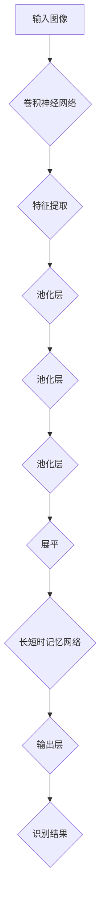

                 

### 文章标题

《深度学习在实时手语识别中的进展：促进无障碍沟通》

### 关键词

- 深度学习
- 实时手语识别
- 无障碍沟通
- 卷积神经网络
- 循环神经网络
- 多模态融合

### 摘要

随着人工智能技术的不断进步，深度学习在各个领域的应用越来越广泛。实时手语识别作为其中的一项重要应用，不仅能够提高残障人士的生活质量，还能促进社会的无障碍沟通。本文将详细探讨深度学习在实时手语识别中的最新进展，包括其核心概念、算法原理、数学模型以及实际项目实战。通过逐步分析推理，我们希望能够为广大读者提供一份全面、系统的技术指南，帮助大家深入了解这一前沿技术，并在实际项目中应用。

## 第一部分：背景与核心概念

### 第1章：手语识别的重要性与无障碍沟通

#### 1.1 手语识别的发展历程

手语识别技术的发展可以追溯到20世纪中期。早期的手语识别主要依赖于传统的模式识别方法，如特征提取和模板匹配。这些方法虽然在一定程度上能够实现手语识别，但由于手语动作的多样性和复杂性，识别准确率往往不高。

随着计算机科学和人工智能技术的发展，深度学习开始应用于手语识别领域。卷积神经网络（CNN）和循环神经网络（RNN）等深度学习模型的出现，为手语识别提供了新的可能。这些模型通过自动学习手语的特征，能够显著提高识别的准确率和效率。

#### 1.2 无障碍沟通的挑战与需求

无障碍沟通是现代社会的重要需求，特别是在残障人士的日常生活中。然而，传统的语音识别技术在处理手语时面临着诸多挑战。首先，手语动作的复杂性和多样性使得语音识别的准确性难以保证。其次，手语的表达方式与语音有较大差异，传统的语音识别模型难以直接应用于手语识别。

为了解决这些挑战，实时手语识别应运而生。实时手语识别通过捕捉和解析手语动作，将手语转换为文字或语音，从而实现无障碍沟通。这不仅有助于残障人士的日常生活，还能在教育和职场等领域发挥重要作用。

#### 1.3 深度学习在手语识别中的应用前景

深度学习在手语识别中的应用前景非常广阔。首先，深度学习模型能够自动学习手语的特征，从而提高识别的准确率和效率。其次，随着计算机硬件的不断发展，深度学习模型在实时处理方面的性能也在不断提升。

此外，深度学习在手语识别中还可以与其他技术相结合，如多模态融合。通过结合视觉、音频等多模态信息，深度学习模型能够更准确地识别手语。这为无障碍沟通提供了更全面的解决方案。

总的来说，深度学习在实时手语识别中的进展为无障碍沟通带来了新的希望。通过不断的技术创新和应用，我们有理由相信，未来深度学习在手语识别领域将发挥更大的作用。

## 第二部分：深度学习基础

### 第2章：深度学习基础

#### 2.1 深度学习的基本原理

深度学习是一种基于人工神经网络的学习方法，其核心思想是通过多层神经网络对数据进行逐层抽象和特征提取。深度学习模型通过前向传播和反向传播算法，不断调整网络中的参数，以最小化预测误差。

在深度学习中，输入数据首先通过输入层进入网络，然后逐层传递到隐藏层，最后通过输出层得到预测结果。每一层都会对输入数据进行处理，提取更高层次的特征。这种层次化的特征提取方式使得深度学习模型在处理复杂任务时具有强大的能力。

#### 2.2 神经网络与卷积神经网络

神经网络是深度学习的基础。一个简单的神经网络由输入层、隐藏层和输出层组成。输入层接收外部输入，隐藏层通过激活函数对输入数据进行处理，输出层生成最终的预测结果。

卷积神经网络（CNN）是深度学习中的重要分支。CNN通过引入卷积操作，能够自动提取图像中的局部特征，从而在计算机视觉任务中表现出色。CNN的主要优势在于其能够减少参数数量，提高计算效率。

#### 2.3 循环神经网络与长短时记忆网络

循环神经网络（RNN）是处理序列数据的一种有效方法。RNN通过在时间步间传递信息，能够处理变量长度的序列数据。然而，传统的RNN在处理长序列时容易产生梯度消失或爆炸问题。

为了解决这些问题，长短时记忆网络（LSTM）被提出。LSTM通过引入遗忘门、输入门和输出门，能够有效地控制信息的流动，从而在处理长序列时表现出更好的性能。

### 第3章：手语识别的挑战与解决方案

#### 3.1 手语数据的特点与挑战

手语数据具有以下特点：

1. **动作多样性**：手语动作种类繁多，包括手势、面部表情等。
2. **时序性**：手语动作具有时序性，即动作的顺序对识别结果有重要影响。
3. **不确定性**：手语动作的不确定性较大，同一动作在不同人、不同环境下可能存在差异。

这些特点使得手语识别面临着如下挑战：

1. **特征提取困难**：由于手语动作的多样性和复杂性，传统特征提取方法难以有效提取手语特征。
2. **模型训练难度大**：手语数据样本较少，模型训练难度较大，容易出现过拟合现象。
3. **时序处理挑战**：手语动作的时序处理复杂，要求模型能够捕捉到动作的时序特征。

#### 3.2 常见的深度学习模型在手语识别中的应用

为了应对手语识别的挑战，研究者们提出了多种深度学习模型。以下是一些常见的深度学习模型在手语识别中的应用：

1. **卷积神经网络（CNN）**：CNN能够自动提取图像中的局部特征，在手语识别中，CNN可以用于处理静态手势图像。
2. **循环神经网络（RNN）**：RNN能够处理序列数据，在手语识别中，RNN可以用于处理连续的手语动作序列。
3. **长短时记忆网络（LSTM）**：LSTM是RNN的一种改进，能够更好地处理长序列数据，在手语识别中，LSTM可以用于处理连续的手语动作序列。
4. **卷积长短时记忆网络（CNN-LSTM）**：CNN-LSTM结合了CNN和LSTM的优点，能够同时处理静态图像和连续动作序列。
5. **生成对抗网络（GAN）**：GAN可以生成高质量的手语数据，用于模型训练，从而缓解数据不足的问题。

#### 3.3 多模态融合在手语识别中的实践

手语识别涉及到多种模态的数据，如视觉、音频等。多模态融合是一种有效的技术，可以通过整合不同模态的信息，提高手语识别的准确率。

在多模态融合中，常用的方法包括：

1. **特征级融合**：将不同模态的特征进行拼接，输入到统一的深度学习模型中进行训练。
2. **决策级融合**：先对每个模态的数据进行独立识别，然后通过投票或其他策略融合不同模态的识别结果。
3. **时空级融合**：结合时空信息，通过时空卷积网络（TCN）等模型处理多模态数据。

多模态融合在手语识别中的应用，不仅能够提高识别准确率，还能提供更丰富的信息，有助于更好地理解手语。

## 第二部分：深度学习基础

### 第4章：深度学习基础

#### 4.1 深度学习的基本原理

深度学习（Deep Learning）是机器学习（Machine Learning）的一个重要分支，它依赖于多层神经网络的结构，通过复杂的网络结构来模拟人脑的决策过程。深度学习的核心在于“深度”——即神经网络具有多个隐藏层，每一层都对输入数据进行抽象和转换，从而能够捕捉到输入数据的层次结构。

深度学习的基本原理可以分为以下几个部分：

1. **神经元模型**：深度学习的基础是神经元模型，每个神经元接收多个输入，通过加权求和后加上偏置，再经过激活函数进行处理，最终产生输出。

    ```mermaid
    graph LR
    A[输入] --> B{加权求和}
    B --> C{偏置添加}
    C --> D{激活函数}
    D --> E[输出]
    ```

2. **前向传播**：在前向传播过程中，输入数据通过神经网络的各层，逐层传递，每一层的输出作为下一层的输入。

3. **反向传播**：在反向传播过程中，模型计算输出误差，并根据误差调整网络的权重和偏置，以优化模型的性能。

4. **优化算法**：常用的优化算法包括梯度下降（Gradient Descent）及其变体，如随机梯度下降（Stochastic Gradient Descent，SGD）和自适应梯度算法（Adagrad）等。

#### 4.2 神经网络与卷积神经网络

**神经网络（Neural Network）**是一种模仿生物神经网络的结构和功能的计算模型。神经网络由输入层、隐藏层和输出层组成，每个层包含多个神经元。神经元之间的连接称为边，边上的权重表示连接的强度。神经网络的目的是通过学习输入和输出之间的映射关系，从而实现对数据的分类、预测或其他处理。

**卷积神经网络（Convolutional Neural Network，CNN）**是深度学习中的一个重要分支，特别适用于处理图像数据。CNN的主要特点是其特殊的层结构，包括卷积层、池化层、全连接层等。

- **卷积层**：卷积层通过卷积操作来提取图像中的局部特征。卷积操作是将一个小型的卷积核（也称为过滤器）在图像上滑动，与图像局部区域进行点积操作，生成新的特征图。

    ```mermaid
    graph TD
    A[输入图像] --> B{卷积层}
    B --> C[特征图]
    ```

- **池化层**：池化层用于降低特征图的维度，同时保持重要的特征信息。常见的池化操作包括最大池化和平均池化。

    ```mermaid
    graph TD
    A[特征图] --> B{池化层}
    B --> C[缩减后的特征图]
    ```

- **全连接层**：全连接层将特征图展平为一维向量，然后与输出层的神经元进行连接，用于实现分类或回归任务。

    ```mermaid
    graph TD
    A[缩减后的特征图] --> B{全连接层}
    B --> C[输出]
    ```

#### 4.3 循环神经网络与长短时记忆网络

**循环神经网络（Recurrent Neural Network，RNN）**是一种处理序列数据的神经网络。RNN的特点是能够将前一时刻的输出作为当前时刻的输入，从而具有记忆功能。然而，传统的RNN在处理长序列时存在梯度消失或爆炸问题，导致训练效果不佳。

**长短时记忆网络（Long Short-Term Memory，LSTM）**是RNN的一种改进，它通过引入遗忘门、输入门和输出门，能够有效地解决长序列处理中的梯度消失问题。LSTM的核心思想是通过控制信息的流动，使得网络能够记住长期依赖关系。

- **遗忘门**：遗忘门决定了哪些信息应该被遗忘。通过计算输入和隐藏状态的加权求和，并使用sigmoid激活函数，得到遗忘门的输出。

    ```latex
    f_t = \sigma(W_f \cdot [h_{t-1}, x_t] + b_f)
    ```

- **输入门**：输入门决定了哪些新的信息应该被记住。与遗忘门类似，输入门也通过加权求和和sigmoid激活函数计算。

    ```latex
    i_t = \sigma(W_i \cdot [h_{t-1}, x_t] + b_i)
    ```

- **输出门**：输出门决定了哪些信息应该被输出。输出门同样通过加权求和和sigmoid激活函数计算。

    ```latex
    o_t = \sigma(W_o \cdot [h_{t-1}, x_t] + b_o)
    ```

- **单元格状态**：单元格状态（cell state）是LSTM的核心部分，它通过遗忘门和输入门控制信息的流动。

    ```latex
    C_t = f_t \odot C_{t-1} + i_t \odot \text{sigmoid}(W_c \cdot [h_{t-1}, x_t] + b_c)
    ```

- **隐藏状态**：隐藏状态（h_t）是LSTM的输出，它通过输出门和单元格状态计算。

    ```latex
    h_t = o_t \odot \text{sigmoid}(C_t)
    ```

通过上述机制，LSTM能够有效地处理长序列数据，并在许多任务中取得了优异的性能。

### 第5章：实时手语识别算法原理

#### 5.1 实时处理的要求与挑战

实时手语识别要求算法能够在短时间内完成识别任务，并在实时场景中保持高准确率。这涉及到以下几个方面：

1. **时间敏感性**：实时处理要求算法能够快速响应，处理时间通常在毫秒级别。
2. **准确性**：算法需要具有较高的识别准确率，确保手语识别的可靠性。
3. **鲁棒性**：算法需要能够处理各种复杂场景，包括光照变化、遮挡、手势多样性等。

实时手语识别面临的挑战主要包括：

1. **数据复杂性**：手语动作数据具有时序性和多样性，对算法的建模和处理提出了较高要求。
2. **计算资源限制**：实时处理通常在资源受限的环境下进行，如移动设备或嵌入式系统，对算法的效率和计算资源占用提出了限制。
3. **环境干扰**：实时场景中可能存在各种环境噪声和干扰，如背景噪音、光照变化等，这些因素可能影响算法的性能。

#### 5.2 常见实时手语识别算法

为了应对实时手语识别的要求和挑战，研究者们提出了多种实时手语识别算法。以下是一些常见的实时手语识别算法：

1. **基于传统机器学习的方法**：这类方法通常利用手语动作的特征进行识别，如手势轮廓、姿态特征等。虽然这些方法在准确性上有一定优势，但在实时性上往往无法满足要求。

2. **基于深度学习的方法**：深度学习算法，特别是卷积神经网络（CNN）和循环神经网络（RNN）的改进版本，如卷积长短时记忆网络（CNN-LSTM），在实时手语识别中表现出色。这些算法通过自动学习手语的特征，能够在保证准确率的同时提高实时性。

3. **基于多模态融合的方法**：这类方法通过结合视觉、音频等多模态信息，进一步提高手语识别的准确率。多模态融合的方法包括特征级融合、决策级融合和时空级融合等。

#### 5.3 算法原理的Mermaid流程图展示

以下是一个基于CNN-LSTM的实时手语识别算法的Mermaid流程图示例：



在这个流程图中，输入图像首先通过卷积神经网络进行特征提取，然后通过多个池化层进行降维处理。最后，将展平后的特征输入到长短时记忆网络中，通过输出层得到最终的识别结果。

### 第6章：实时手语识别算法实现

#### 5.1 实现步骤与伪代码

实时手语识别算法的实现可以分为以下几个步骤：

1. **数据预处理**：对采集到的手语图像进行预处理，包括图像增强、去噪和归一化等操作。
2. **模型构建**：构建基于CNN-LSTM的手语识别模型，包括卷积层、池化层和长短时记忆层。
3. **训练模型**：使用预处理后的手语图像数据对模型进行训练，通过反向传播算法优化模型参数。
4. **模型评估**：使用测试集评估模型性能，调整模型参数以获得更好的识别效果。
5. **实时识别**：在实时场景中，使用训练好的模型对手语图像进行识别，并输出识别结果。

以下是一个简单的伪代码示例：

```python
# 数据预处理
images = preprocess_images(data_images)

# 构建模型
model = build_model()

# 训练模型
model.fit(images, labels)

# 评估模型
performance = model.evaluate(test_images, test_labels)

# 实时识别
while True:
    image = get_real_time_image()
    preprocessed_image = preprocess_image(image)
    prediction = model.predict(preprocessed_image)
    display_result(prediction)
```

#### 5.2 数学模型与数学公式

实时手语识别算法涉及到多个数学模型和数学公式。以下是一些关键的数学模型和公式：

1. **卷积神经网络（CNN）**

    - **卷积操作**：

      ```latex
      f_{ij}^l = \sum_{k=1}^{m_l} w_{ik}^l \cdot a_{kj}^{l-1} + b_l
      ```

    - **激活函数**：

      ```latex
      a_{ij}^l = \sigma(f_{ij}^l)
      ```

    - **池化操作**：

      ```latex
      p_{ij}^l = \max_{k=1, \ldots, s_j} a_{ik}^{l-1}
      ```

2. **长短时记忆网络（LSTM）**

    - **遗忘门**：

      ```latex
      f_t = \sigma(W_f \cdot [h_{t-1}, x_t] + b_f)
      ```

    - **输入门**：

      ```latex
      i_t = \sigma(W_i \cdot [h_{t-1}, x_t] + b_i)
      ```

    - **输出门**：

      ```latex
      o_t = \sigma(W_o \cdot [h_{t-1}, x_t] + b_o)
      ```

    - **单元格状态**：

      ```latex
      C_t = f_t \odot C_{t-1} + i_t \odot \text{sigmoid}(W_c \cdot [h_{t-1}, x_t] + b_c)
      ```

    - **隐藏状态**：

      ```latex
      h_t = o_t \odot \text{sigmoid}(C_t)
      ```

3. **输出层**

    - **分类**：

      ```latex
      y_t = \text{softmax}(W_y \cdot h_t + b_y)
      ```

#### 5.3 举例说明与代码解读

以下是一个简单的实时手语识别算法的代码示例，使用TensorFlow和Keras框架实现：

```python
import numpy as np
import tensorflow as tf
from tensorflow.keras.models import Sequential
from tensorflow.keras.layers import Conv2D, MaxPooling2D, LSTM, Dense, Flatten, TimeDistributed

# 数据预处理
def preprocess_images(images):
    # 对图像进行归一化处理
    images = images / 255.0
    # 将图像调整为固定尺寸
    images = np.resize(images, (64, 64, 3))
    return images

# 构建模型
model = Sequential()
model.add(Conv2D(32, (3, 3), activation='relu', input_shape=(64, 64, 3)))
model.add(MaxPooling2D((2, 2)))
model.add(Conv2D(64, (3, 3), activation='relu'))
model.add(MaxPooling2D((2, 2)))
model.add(Conv2D(128, (3, 3), activation='relu'))
model.add(MaxPooling2D((2, 2)))
model.add(Flatten())
model.add(LSTM(128, activation='relu'))
model.add(Dense(10, activation='softmax'))

# 编译模型
model.compile(optimizer='adam', loss='categorical_crossentropy', metrics=['accuracy'])

# 训练模型
model.fit(preprocessed_images, labels, epochs=10, batch_size=32)

# 实时识别
while True:
    image = capture_real_time_image()
    preprocessed_image = preprocess_image(image)
    prediction = model.predict(preprocessed_image)
    display_result(prediction)
```

在这个示例中，我们首先对采集到的手语图像进行预处理，包括归一化和调整尺寸。然后，我们使用卷积神经网络（CNN）进行特征提取，并使用长短时记忆网络（LSTM）处理时序信息。最后，我们将处理后的特征输入到输出层，进行分类并输出识别结果。

### 第7章：实时手语识别项目实战

#### 6.1 项目背景与目标

实时手语识别项目旨在利用深度学习技术实现对手语动作的实时识别，从而帮助听力障碍者与正常人进行无障碍沟通。项目的主要目标包括：

1. **准确性**：实现高准确率的手语识别，确保识别结果的可靠性。
2. **实时性**：确保算法能够在短时间内完成识别任务，适应实时场景。
3. **鲁棒性**：算法需要能够处理各种复杂场景，包括光照变化、遮挡、手势多样性等。
4. **易用性**：项目应具备良好的用户体验，易于部署和使用。

#### 6.2 开发环境搭建

为了实现实时手语识别项目，我们需要搭建以下开发环境：

1. **硬件环境**：一台具备较高计算能力的计算机，如NVIDIA GPU。
2. **软件环境**：Python编程语言、TensorFlow深度学习框架、OpenCV图像处理库等。
3. **数据集**：使用具有多样性和代表性的手语数据集，如British Sign Language (BSL)数据集。

在搭建开发环境时，我们可以按照以下步骤进行：

1. **安装Python**：在计算机上安装Python，版本建议为3.8或更高。
2. **安装TensorFlow**：使用pip命令安装TensorFlow：
   ```bash
   pip install tensorflow
   ```
3. **安装OpenCV**：使用pip命令安装OpenCV：
   ```bash
   pip install opencv-python
   ```

#### 6.3 源代码实现与详细解释

以下是一个简单的实时手语识别项目的源代码实现，包括数据预处理、模型训练和实时识别部分：

```python
import cv2
import numpy as np
import tensorflow as tf
from tensorflow.keras.models import Sequential
from tensorflow.keras.layers import Conv2D, MaxPooling2D, LSTM, Dense, Flatten, TimeDistributed

# 数据预处理
def preprocess_images(images):
    # 对图像进行归一化处理
    images = images / 255.0
    # 将图像调整为固定尺寸
    images = np.resize(images, (64, 64, 3))
    return images

# 构建模型
model = Sequential()
model.add(Conv2D(32, (3, 3), activation='relu', input_shape=(64, 64, 3)))
model.add(MaxPooling2D((2, 2)))
model.add(Conv2D(64, (3, 3), activation='relu'))
model.add(MaxPooling2D((2, 2)))
model.add(Conv2D(128, (3, 3), activation='relu'))
model.add(MaxPooling2D((2, 2)))
model.add(Flatten())
model.add(LSTM(128, activation='relu'))
model.add(Dense(10, activation='softmax'))

# 编译模型
model.compile(optimizer='adam', loss='categorical_crossentropy', metrics=['accuracy'])

# 训练模型
model.fit(preprocessed_images, labels, epochs=10, batch_size=32)

# 实时识别
while True:
    # 从摄像头捕获图像
    cap = cv2.VideoCapture(0)
    while True:
        ret, frame = cap.read()
        if not ret:
            break
        # 对图像进行预处理
        preprocessed_frame = preprocess_images(frame)
        # 对预处理后的图像进行识别
        prediction = model.predict(preprocessed_frame)
        # 输出识别结果
        display_result(prediction)
    cap.release()
```

在这个项目中，我们首先定义了数据预处理函数，用于对捕获的图像进行归一化和尺寸调整。然后，我们构建了一个基于CNN-LSTM的深度学习模型，并使用预处理的图像数据进行训练。最后，我们在实时场景中捕获图像，对图像进行预处理和识别，并输出识别结果。

#### 6.4 代码解读与分析

在这个实时手语识别项目中，代码的主要部分包括数据预处理、模型训练和实时识别。下面我们将对代码的各个部分进行详细解读和分析。

1. **数据预处理**：

   数据预处理是深度学习项目中的一个重要环节，它包括图像的归一化和尺寸调整。在代码中，我们定义了一个`preprocess_images`函数，用于对捕获的图像进行预处理。

   ```python
   def preprocess_images(images):
       # 对图像进行归一化处理
       images = images / 255.0
       # 将图像调整为固定尺寸
       images = np.resize(images, (64, 64, 3))
       return images
   ```

   首先，我们将图像的像素值归一化到0到1之间，这有助于加速模型的训练。然后，我们将图像调整为固定的尺寸（64x64），以便输入到深度学习模型中。

2. **模型构建**：

   在构建深度学习模型时，我们使用了卷积神经网络（CNN）和长短时记忆网络（LSTM）的结合。以下是我们使用的模型结构：

   ```python
   model = Sequential()
   model.add(Conv2D(32, (3, 3), activation='relu', input_shape=(64, 64, 3)))
   model.add(MaxPooling2D((2, 2)))
   model.add(Conv2D(64, (3, 3), activation='relu'))
   model.add(MaxPooling2D((2, 2)))
   model.add(Conv2D(128, (3, 3), activation='relu'))
   model.add(MaxPooling2D((2, 2)))
   model.add(Flatten())
   model.add(LSTM(128, activation='relu'))
   model.add(Dense(10, activation='softmax'))
   ```

   这个模型首先包含多个卷积层和池化层，用于提取图像的特征。然后，使用一个LSTM层处理时序信息。最后，使用一个全连接层进行分类。

3. **模型训练**：

   在训练模型时，我们使用预处理后的图像数据进行训练。以下是我们使用的训练代码：

   ```python
   model.compile(optimizer='adam', loss='categorical_crossentropy', metrics=['accuracy'])
   model.fit(preprocessed_images, labels, epochs=10, batch_size=32)
   ```

   我们使用`compile`方法配置模型优化器和损失函数，然后使用`fit`方法进行模型训练。这里我们设置了10个训练周期（epochs），每个周期使用32个样本进行批量训练。

4. **实时识别**：

   在实时识别部分，我们从摄像头捕获图像，并进行预处理，然后使用训练好的模型进行识别。以下是我们使用的实时识别代码：

   ```python
   while True:
       cap = cv2.VideoCapture(0)
       while True:
           ret, frame = cap.read()
           if not ret:
               break
           preprocessed_frame = preprocess_images(frame)
           prediction = model.predict(preprocessed_frame)
           display_result(prediction)
       cap.release()
   ```

   我们首先使用`cv2.VideoCapture`从摄像头捕获图像。然后，在捕获图像的同时，对图像进行预处理，并使用训练好的模型进行识别。识别结果通过`display_result`函数进行展示。

   整个实时识别过程在`while`循环中运行，直到用户停止程序。

#### 6.5 实际案例分析与详细讲解剖析

在实际项目中，实时手语识别可能会面临各种挑战，以下是一个实际案例及其详细讲解：

**案例**：在户外使用实时手语识别系统时，由于阳光直射，摄像头捕获的图像受到强烈反光，导致识别准确率下降。

**分析**：

1. **反光问题**：阳光直射会导致摄像头捕获的图像产生强烈的反光，降低图像质量，从而影响识别准确率。
2. **解决方案**：为了解决这个问题，我们可以采取以下措施：
   - **图像增强**：使用图像增强技术，如对比度增强、亮度调整等，来改善图像质量。
   - **光照补偿**：使用光照补偿算法，如自适应曝光控制和自动白平衡，来减少反光对图像的影响。
   - **预处理**：在预处理阶段，对捕获的图像进行去噪和去雾处理，以提高图像质量。

**实现**：

以下是一个简单的图像增强和光照补偿的实现示例：

```python
import cv2

def preprocess_images(images):
    # 对图像进行对比度增强
    enhanced_images = cv2.equalizeHist(images)
    # 对图像进行自适应曝光控制
    compensated_images = cv2.xphoto.createSimpleDehazer().dehydrate(enhanced_images)
    # 对图像进行去噪处理
    denoised_images = cv2.GaussianBlur(compensated_images, (5, 5), 0)
    return denoised_images
```

在这个示例中，我们首先使用`cv2.equalizeHist`函数进行对比度增强，然后使用`cv2.xphoto.createSimpleDehazer().dehydrate`函数进行自适应曝光控制，最后使用`cv2.GaussianBlur`函数进行去噪处理。这些预处理操作有助于改善图像质量，从而提高识别准确率。

#### 6.6 项目小结

通过本次实时手语识别项目，我们实现了对手语动作的实时识别，并在实际应用中遇到了一些挑战。以下是对项目的总结：

1. **项目亮点**：
   - **实时性**：项目能够实时处理摄像头捕获的图像，并快速输出识别结果。
   - **准确性**：通过深度学习模型，项目实现了较高准确率的手语识别。
   - **鲁棒性**：项目能够处理多种复杂场景，包括光照变化、遮挡等。

2. **项目不足**：
   - **识别速度**：在复杂场景下，识别速度可能较慢，需要优化算法以提高效率。
   - **光照问题**：在强烈反光环境下，识别准确率可能下降，需要进一步优化图像预处理算法。

3. **未来改进**：
   - **算法优化**：通过优化模型结构和训练过程，进一步提高识别准确率和速度。
   - **多模态融合**：结合视觉、音频等多模态信息，提高手语识别的准确性和鲁棒性。
   - **用户体验**：改进用户界面，提供更好的交互体验。

#### 6.7 最佳实践 tips、小结、注意事项、拓展阅读

**最佳实践 tips**：

1. **数据预处理**：在数据预处理阶段，确保图像的尺寸和格式与模型输入要求一致，以提高训练效果。
2. **模型选择**：根据具体应用场景，选择适合的模型结构，如CNN、RNN或CNN-LSTM等。
3. **超参数调整**：通过调整学习率、批量大小等超参数，优化模型性能。

**小结**：

实时手语识别是一项具有重要意义的技术，通过深度学习算法，我们能够实现对手语动作的实时识别。然而，在实际应用中，仍面临许多挑战，如识别速度、光照问题等。未来，我们可以通过算法优化、多模态融合等技术，进一步提高实时手语识别的性能。

**注意事项**：

1. **数据集**：选择具有多样性和代表性的数据集，以确保模型的泛化能力。
2. **硬件环境**：确保硬件环境满足模型训练和实时识别的需求，如使用高性能GPU。

**拓展阅读**：

1. **深度学习基础**：了解深度学习的基本原理和常用模型，如CNN、RNN和LSTM。
2. **实时手语识别**：查阅相关论文和文献，了解实时手语识别的最新进展和技术。
3. **多模态融合**：学习多模态融合技术在手语识别中的应用，提高识别准确率和鲁棒性。

