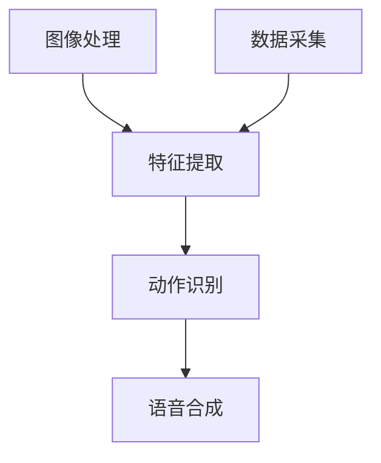

                 

## 引言

深度学习在手语识别中的实时应用

### 背景介绍

随着人工智能技术的飞速发展，深度学习已经成为计算机视觉、语音识别、自然语言处理等多个领域的核心技术。在手语识别领域，深度学习技术的应用同样具有重要意义。手语作为一种独特的交流方式，不仅对于聋人群体至关重要，还能促进听障人士与正常人群之间的沟通。传统的手语识别方法主要依赖于规则和手工设计的特征，而深度学习则提供了更为强大和灵活的解决方案。

实时手语识别的应用场景广泛，包括但不限于教育、医疗、社交和公共场合等。例如，在教学中，实时手语翻译系统能够帮助教师更好地与听障学生进行交流，提高教学效果；在医疗领域，医生可以通过实时手语识别系统与聋人患者沟通，提高医疗服务的质量；在社交场合，实时手语识别系统能够帮助听障人士更好地融入社会，增强社交互动。

### 重要性

深度学习在手语识别中的实时应用具有以下几个重要性：

1. **准确性和鲁棒性**：深度学习模型能够自动提取手语视频中的高维特征，从而实现更准确和鲁棒的手语识别。相较于传统方法，深度学习在手语识别中的表现更为出色。

2. **实时性能**：随着硬件性能的提升和算法的优化，深度学习模型能够在实时环境中快速响应，满足实际应用的需求。

3. **多样化应用**：深度学习模型的可扩展性使得其在不同的应用场景中都能发挥重要作用，从而推动手语识别技术的广泛应用。

4. **社会影响**：实时手语识别技术的推广和应用，不仅能够提升听障人士的生活质量，还能促进社会的包容性和多元化发展。

### 本文结构

本文将分为以下几个部分：

1. **深度学习基础**：介绍深度学习的基本概念、神经网络结构、深度学习框架和算法。
2. **手语识别技术**：详细讨论手语识别的原理、流程和关键技术。
3. **实时应用**：探讨深度学习在手语识别中的实时应用，包括实时性能评估、系统架构设计、开发实践等。
4. **数学模型与公式**：阐述与手语识别相关的数学模型和公式。
5. **项目实战**：提供实际手语识别项目案例，包括代码实现、开发环境搭建、源代码解读等。
6. **未来展望与挑战**：讨论深度学习在手语识别中的未来发展方向和面临的挑战。
7. **结论**：总结本文的主要内容，展望深度学习在手语识别中的实时应用前景。

通过本文的逐步分析，我们将深入理解深度学习在手语识别中的实时应用，探讨其技术原理和实践方法，为相关领域的进一步研究和应用提供参考。

### 关键词

- **深度学习**
- **手语识别**
- **实时应用**
- **神经网络**
- **计算机视觉**
- **人工智能**
- **机器学习**
- **语音识别**
- **自然语言处理**

### 摘要

本文探讨了深度学习在手语识别中的实时应用。首先介绍了深度学习的基本概念和手语识别的重要性，随后详细阐述了手语识别的原理、流程和关键技术。本文重点分析了深度学习在手语识别中的实时应用，包括实时性能评估、系统架构设计和开发实践。此外，本文还介绍了相关的数学模型和公式，并提供了实际手语识别项目案例。通过本文的探讨，我们希望为深度学习在手语识别中的实时应用提供有益的参考和指导。

---

## 深度学习基础

### 深度学习的基本概念

深度学习是机器学习的一个分支，其核心思想是通过构建多层神经网络来模拟人类大脑的学习过程，从而实现自动特征提取和模式识别。与传统机器学习方法相比，深度学习具有更强的自适应性和泛化能力，能够处理复杂的非线性问题。

#### 神经网络结构

神经网络（Neural Network，NN）是深度学习的基础，其结构类似于生物神经元。一个简单的神经网络通常包括输入层、隐藏层和输出层。

1. **输入层（Input Layer）**：接收输入数据，并将其传递到隐藏层。
2. **隐藏层（Hidden Layers）**：多层隐藏层可以自动提取数据的高级特征，层数越多，模型的复杂度和能力也越高。
3. **输出层（Output Layer）**：根据隐藏层传递的信息，生成最终输出。

每个神经元都会接收来自前一层神经元的输入信号，并通过一个加权函数进行处理，最后产生输出信号传递给下一层。

#### 深度学习框架

深度学习框架是用于实现和训练深度学习模型的软件工具，常见的深度学习框架包括：

1. **TensorFlow**：由Google开发，支持多种深度学习模型和算法，具有良好的扩展性和灵活性。
2. **PyTorch**：由Facebook开发，提供动态计算图和易于使用的接口，适用于研究和实验。
3. **Keras**：基于TensorFlow和Theano开发的简洁、易于使用的深度学习库。
4. **MXNet**：由Apache Software Foundation维护，支持多种编程语言，具有良好的性能和可扩展性。

这些框架为深度学习的研究和开发提供了极大的便利，使得研究人员和开发者能够专注于模型设计和算法优化，而无需过多关注底层实现细节。

### 深度学习算法

深度学习算法是深度学习模型的核心，用于训练和优化模型。以下是一些常见的深度学习算法：

1. **反向传播算法（Backpropagation Algorithm）**：用于计算模型参数的梯度，是深度学习模型训练的核心算法。
2. **卷积神经网络（Convolutional Neural Networks，CNN）**：主要用于图像和视频处理，通过卷积操作自动提取图像特征。
3. **循环神经网络（Recurrent Neural Networks，RNN）**：适用于序列数据，能够处理长短时依赖关系。
4. **长短期记忆网络（Long Short-Term Memory，LSTM）**：是RNN的一种变体，能够更好地处理长序列数据。
5. **生成对抗网络（Generative Adversarial Networks，GAN）**：通过两个对抗性网络（生成器和判别器）的竞争训练，实现数据的生成。

这些算法各有特点和应用场景，但都为深度学习模型提供了强大的功能和灵活性。

### 深度学习在手语识别中的应用

深度学习在手语识别中具有广泛的应用，主要包括以下几个方面：

1. **手语视频特征提取**：通过深度学习模型自动提取手语视频中的高维特征，从而实现手语识别。
2. **实时手语识别**：利用深度学习模型进行实时手语识别，实现快速、准确的手语翻译。
3. **手语合成**：通过深度学习模型将识别结果转换为相应的手语动作，实现人与机器之间的自然互动。
4. **手语辅助设备**：结合深度学习技术，开发手语识别辅助设备，帮助听障人士更好地进行交流。

### 实例分析

以下是一个简单的卷积神经网络（CNN）算法用于手语识别的伪代码示例：

```python
# 导入必要的库
import tensorflow as tf
from tensorflow.keras.models import Sequential
from tensorflow.keras.layers import Conv2D, MaxPooling2D, Flatten, Dense

# 构建CNN模型
model = Sequential([
    Conv2D(32, (3, 3), activation='relu', input_shape=(64, 64, 3)),
    MaxPooling2D((2, 2)),
    Conv2D(64, (3, 3), activation='relu'),
    MaxPooling2D((2, 2)),
    Flatten(),
    Dense(128, activation='relu'),
    Dense(num_classes, activation='softmax')
])

# 编译模型
model.compile(optimizer='adam', loss='categorical_crossentropy', metrics=['accuracy'])

# 训练模型
model.fit(train_images, train_labels, epochs=10, batch_size=32, validation_split=0.2)
```

通过上述示例，我们可以看到深度学习模型在手语识别中的基本应用流程，包括模型构建、编译和训练等步骤。

综上所述，深度学习在手语识别中的实时应用具有广泛的前景和潜力。通过深入理解深度学习的基本概念、神经网络结构、深度学习框架和算法，我们可以更好地应用这些技术于手语识别领域，推动相关技术的发展和进步。

---

## 手语识别技术

### 原理与流程

手语识别技术主要涉及将手语动作转化为文本或语音，从而实现人与机器之间的交流。其核心原理包括图像处理、动作识别和语音合成。

#### 图像处理

首先，手语识别系统需要对采集的手语视频进行图像处理，包括去噪、增强和分割等步骤。图像处理的质量直接影响到后续的动作识别效果。

1. **去噪**：通过滤波器去除图像中的噪声，提高图像质量。
2. **增强**：通过图像增强技术，使手语动作更加清晰，如提高对比度、亮度等。
3. **分割**：将连续的视频帧分割为单个手势图像，以便进行后续的动作识别。

#### 动作识别

在图像处理完成后，手语识别系统需要对手语动作进行识别。这一步骤通常采用机器学习和深度学习算法，如卷积神经网络（CNN）和长短期记忆网络（LSTM）。

1. **特征提取**：通过卷积神经网络自动提取手势图像中的高维特征。
2. **分类器训练**：利用训练数据集，训练分类器以识别不同手势。
3. **实时识别**：将提取的特征输入分类器，实时判断当前手势。

#### 语音合成

在手势识别完成后，系统需要将识别结果转换为相应的语音输出，从而实现语音交流。常见的语音合成技术包括合成交响文本（Text-to-Speech，TTS）和语音合成模型。

1. **文本转换**：将识别结果转换为文本格式，如手语动作描述。
2. **语音合成**：通过TTS技术，将文本转换为自然流畅的语音输出。

### 关键技术

手语识别技术涉及多个关键环节，包括数据采集、特征提取、模型训练和实时识别等。

1. **数据采集**：手语识别系统需要大量的手语数据集进行训练，包括不同手势的图像和对应的文本标签。
2. **特征提取**：深度学习模型通过卷积神经网络自动提取手势图像的高维特征，是识别准确性的关键。
3. **模型训练**：利用训练数据集，对深度学习模型进行训练，优化模型参数。
4. **实时识别**：在手语识别过程中，系统需要实时处理视频帧，并快速识别手势。

### 核心概念与联系

在手语识别技术中，核心概念包括图像处理、动作识别和语音合成。这些概念之间的关系可以通过以下Mermaid流程图进行展示：



### 图像处理

图像处理是手语识别的基础，主要包括去噪、增强和分割等步骤。以下是一个简单的图像增强伪代码示例：

```python
import cv2
import numpy as np

# 读取图像
image = cv2.imread('hand Gesture.jpg')

# 去噪
blurred = cv2.GaussianBlur(image, (5, 5), 0)

# 增强对比度
enhanced = cv2.convertScaleAbs(blurred, alpha=1.5, beta=0)

# 分割
gray = cv2.cvtColor(enhanced, cv2.COLOR_BGR2GRAY)
_, threshold = cv2.threshold(gray, 0, 255, cv2.THRESH_BINARY_INV + cv2.THRESH_OTSU)

# 显示增强后的图像
cv2.imshow('Enhanced Image', enhanced)
cv2.waitKey(0)
cv2.destroyAllWindows()
```

### 动作识别

动作识别是手语识别的核心，通过深度学习模型实现。以下是一个简单的卷积神经网络（CNN）动作识别伪代码示例：

```python
import tensorflow as tf
from tensorflow.keras.models import Sequential
from tensorflow.keras.layers import Conv2D, MaxPooling2D, Flatten, Dense

# 构建CNN模型
model = Sequential([
    Conv2D(32, (3, 3), activation='relu', input_shape=(64, 64, 3)),
    MaxPooling2D((2, 2)),
    Conv2D(64, (3, 3), activation='relu'),
    MaxPooling2D((2, 2)),
    Flatten(),
    Dense(128, activation='relu'),
    Dense(num_classes, activation='softmax')
])

# 编译模型
model.compile(optimizer='adam', loss='categorical_crossentropy', metrics=['accuracy'])

# 训练模型
model.fit(train_images, train_labels, epochs=10, batch_size=32, validation_split=0.2)
```

### 语音合成

语音合成是将识别结果转换为语音输出的过程。以下是一个简单的合成交响文本（TTS）伪代码示例：

```python
import pyttsx3

# 初始化语音合成引擎
engine = pyttsx3.init()

# 设置语音合成引擎的语音
voices = engine.getProperty('voices')
engine.setProperty('voice', voices[1].id)

# 合成语音
engine.say('Hello, world!')
engine.runAndWait()
```

通过上述示例，我们可以看到手语识别技术中的核心概念和联系，以及其实现过程中的关键步骤。这些技术为手语识别提供了强大的基础，使得实时手语识别成为可能。

---

## 实时应用

### 实时性能评估

深度学习在手语识别中的实时应用要求系统具备高效的性能和响应速度。实时性能评估是确保系统在实际应用中表现良好的关键步骤。以下是一些关键性能指标：

1. **响应时间**：系统从接收到手语视频到输出识别结果的时间。响应时间需要尽量短，以满足实时应用的需求。
2. **准确率**：系统正确识别手势的比率。高准确率是保证用户满意度的关键。
3. **鲁棒性**：系统在处理不同光照、角度和遮挡等环境变化时的稳定性。鲁棒性强的系统能够更好地适应实际应用环境。
4. **吞吐量**：系统每秒处理的手语视频数量。高吞吐量能够支持更多用户同时使用。

### 系统架构设计

为了实现高效和可扩展的实时手语识别系统，我们需要设计合理的系统架构。以下是一个典型的系统架构设计：

1. **前端采集模块**：负责采集用户的手语视频，可以集成到移动应用或网页中。
2. **数据预处理模块**：对接收到的视频进行图像预处理，包括去噪、增强和分割等步骤。
3. **深度学习模型模块**：包含训练好的深度学习模型，用于手势识别和语音合成。
4. **后端服务模块**：负责处理用户请求，调用深度学习模型进行识别和合成，并将结果返回给前端。
5. **数据库模块**：存储用户数据和手语识别结果，支持数据的持久化和查询。

### 开发实践

在实时手语识别系统的开发过程中，以下实践方法有助于提高系统性能和用户体验：

1. **模型优化**：通过调整模型结构和超参数，优化深度学习模型，以提高识别准确率和响应速度。
2. **硬件加速**：利用GPU或其他硬件加速技术，提高模型的计算效率。
3. **异步处理**：采用异步处理方式，同时处理多个用户请求，提高系统吞吐量。
4. **服务优化**：优化后端服务的响应速度，如使用缓存技术、负载均衡等。
5. **用户体验设计**：设计直观、易用的用户界面，提供实时反馈和调整功能。

### 具体案例

以下是一个简单的实时手语识别系统的实现案例：

```python
# 导入必要的库
import cv2
import tensorflow as tf
from tensorflow.keras.models import load_model
import numpy as np

# 加载深度学习模型
model = load_model('hand_gesture_model.h5')

# 初始化视频捕获对象
cap = cv2.VideoCapture(0)

# 模型输入预处理
def preprocess(image):
    image = cv2.resize(image, (64, 64))
    image = cv2.cvtColor(image, cv2.COLOR_BGR2GRAY)
    image = np.expand_dims(image, axis=0)
    image = image / 255.0
    return image

# 实时识别手势
while True:
    # 读取一帧图像
    ret, frame = cap.read()
    
    # 图像预处理
    processed_image = preprocess(frame)
    
    # 使用模型进行手势识别
    predictions = model.predict(processed_image)
    predicted_class = np.argmax(predictions, axis=1)
    
    # 显示识别结果
    cv2.putText(frame, f'Gesture: {predicted_class}', (10, 30), cv2.FONT_HERSHEY_SIMPLEX, 1, (0, 0, 255), 2)
    cv2.imshow('Real-time Hand Gesture Recognition', frame)
    
    # 按下'q'键退出
    if cv2.waitKey(1) & 0xFF == ord('q'):
        break

# 释放视频捕获对象
cap.release()
cv2.destroyAllWindows()
```

通过上述案例，我们可以看到实时手语识别系统的基本实现流程，包括视频采集、图像预处理、模型识别和结果显示等步骤。

### 最佳实践与注意事项

在实时手语识别系统的开发过程中，以下最佳实践和注意事项有助于提高系统的性能和稳定性：

1. **数据预处理**：确保输入数据的格式和尺寸与模型的要求一致，以提高模型识别的准确性。
2. **模型优化**：根据实际应用场景，对模型进行调整和优化，以提高识别效率和准确性。
3. **硬件配置**：根据系统需求，选择合适的硬件设备，如高性能的GPU，以提高模型计算速度。
4. **错误处理**：设计合理的错误处理机制，如超时处理、异常捕捉等，确保系统稳定运行。
5. **用户体验**：设计直观、易用的用户界面，提供实时反馈和调整功能，以提高用户满意度。

通过上述实践和注意事项，我们可以开发出高效、稳定、用户友好的实时手语识别系统，为听障人士提供更好的交流体验。

### 小结

实时手语识别系统的开发涉及多个关键环节，包括实时性能评估、系统架构设计、开发实践等。通过本文的介绍，我们了解了实时手语识别系统的基本原理和实现方法，包括图像处理、深度学习模型、语音合成等关键技术和最佳实践。这些技术和方法为实时手语识别系统的开发提供了有力支持，有助于提高系统的性能和用户体验。未来，随着深度学习技术的不断发展和优化，实时手语识别系统将更加成熟和普及，为听障人士提供更好的交流工具。

### 拓展阅读

1. **《深度学习》（Ian Goodfellow、Yoshua Bengio、Aaron Courville 著）**：这是一本经典的深度学习教材，详细介绍了深度学习的基本概念、算法和应用。
2. **《计算机视觉：算法与应用》（Richard S. Kelly 著）**：这本书涵盖了计算机视觉领域的相关算法和应用，包括手语识别技术。
3. **《自然语言处理综合教程》（Daniel Jurafsky、James H. Martin 著）**：这本书介绍了自然语言处理的基本概念、技术和应用，包括语音合成和手语识别。
4. **《机器学习实战》（Peter Harrington 著）**：这本书提供了丰富的机器学习实践案例，包括深度学习模型的应用。
5. **《手语语言学导论》（Ann Senghas 著）**：这本书介绍了手语语言学的相关知识，有助于深入理解手语识别技术的背景和原理。

通过阅读这些拓展资源，您可以进一步了解深度学习在手语识别中的应用和相关技术，为实际项目提供更全面的指导。

---

## 数学模型与公式

### 卷积神经网络（CNN）中的数学模型

卷积神经网络（CNN）在手语识别中起着核心作用。其数学模型主要包括卷积操作、激活函数、池化和反向传播算法。以下是这些关键组件的数学描述。

#### 卷积操作

卷积操作的数学公式如下：

\[ (f * g)(x, y) = \sum_{i=0}^{h-1} \sum_{j=0}^{w-1} f(i, j) \cdot g(x-i, y-j) \]

其中，\( f \) 和 \( g \) 分别代表卷积核和输入图像，\( (x, y) \) 表示卷积操作的位置。卷积操作通过滑动卷积核在输入图像上，计算局部区域的特征响应。

#### 激活函数

激活函数用于引入非线性特性，常见的激活函数包括：

1. **Sigmoid 函数**：
   \[ \sigma(x) = \frac{1}{1 + e^{-x}} \]

2. **ReLU 函数**：
   \[ \text{ReLU}(x) = \max(0, x) \]

3. **Tanh 函数**：
   \[ \text{Tanh}(x) = \frac{e^x - e^{-x}}{e^x + e^{-x}} \]

激活函数的选择取决于具体问题。

#### 池化操作

池化操作用于降低特征图的尺寸，常见的池化方式包括最大池化和平均池化。最大池化的数学公式如下：

\[ P^{max}(x, y) = \max \left( \sum_{i=0}^{2} \sum_{j=0}^{2} f(i, j) \right) \]

其中，\( f \) 是局部区域内的特征响应。

#### 反向传播算法

反向传播算法是CNN训练过程中计算模型参数梯度的核心。其基本思想是：从输出层开始，逐层向前计算误差，并反向传播至输入层，更新模型参数。

1. **误差计算**：
   \[ \delta = \frac{\partial L}{\partial a} \]

   其中，\( L \) 是损失函数，\( a \) 是激活值。

2. **梯度计算**：
   \[ \frac{\partial w}{\partial z} = \delta \cdot a^{[l-1]} \]

   其中，\( w \) 是权重，\( z \) 是当前层的输入。

3. **参数更新**：
   \[ w^{[l]} = w^{[l]} - \alpha \cdot \frac{\partial w}{\partial z} \]

   其中，\( \alpha \) 是学习率。

### 长短期记忆网络（LSTM）中的数学模型

长短期记忆网络（LSTM）是处理序列数据的常用模型，其数学模型包括输入门、遗忘门和输出门。

1. **输入门**：
   \[ i_t = \sigma(W_{xi}x_t + W_{hi}h_{t-1} + b_i) \]

   其中，\( x_t \) 是输入，\( h_{t-1} \) 是前一个时刻的隐藏状态，\( \sigma \) 是激活函数。

2. **遗忘门**：
   \[ f_t = \sigma(W_{xf}x_t + W_{hf}h_{t-1} + b_f) \]

   \( f_t \) 用于控制上一时刻的隐藏状态 \( h_{t-1} \) 的遗忘程度。

3. **输出门**：
   \[ o_t = \sigma(W_{xo}x_t + W_{ho}h_{t-1} + b_o) \]

   \( o_t \) 用于控制当前隐藏状态 \( h_t \) 的输出程度。

4. **候选状态**：
   \[ \tilde{c}_t = \tanh(W_{xc}x_t + W_{hc}h_{t-1} + b_c) \]

   \( \tilde{c}_t \) 是候选状态，用于更新当前隐藏状态。

5. **当前隐藏状态**：
   \[ c_t = f_t \odot c_{t-1} + i_t \odot \tilde{c}_t \]

   其中，\( \odot \) 表示元素乘积。

6. **当前输出**：
   \[ h_t = o_t \odot \tanh(c_t) \]

### 公式举例

以下是一个简单的卷积神经网络（CNN）用于手语识别的数学模型举例：

\[ f_{\text{output}} = \text{ReLU}(\text{MaxPooling}(\text{Conv}(\text{ReLU}(\text{Conv}(h_{t-1}, W^{[1]} + b^{[1]}), W^{[2]} + b^{[2]}))) \]

其中，\( h_{t-1} \) 是前一个隐藏层的输出，\( W^{[1]} \) 和 \( W^{[2]} \) 是卷积核权重，\( b^{[1]} \) 和 \( b^{[2]} \) 是偏置项，\(\text{ReLU}\) 是ReLU激活函数，\(\text{MaxPooling}\) 是最大池化操作，\(\text{Conv}\) 是卷积操作。

通过上述数学模型和公式，我们可以更好地理解卷积神经网络（CNN）和长短期记忆网络（LSTM）在手语识别中的应用原理。这些模型和公式为手语识别技术的实现提供了理论基础和计算框架。

### 详细讲解与举例

为了更好地理解上述数学模型和公式，我们将通过一个具体的卷积神经网络（CNN）实例来详细讲解其应用过程。

#### 示例：手语识别中的CNN模型

假设我们有一个手语识别的CNN模型，其结构如下：

1. **输入层**：接收64x64x3尺寸的手语视频帧。
2. **卷积层1**：使用32个3x3的卷积核，步长为1，激活函数为ReLU。
3. **池化层1**：使用2x2的最大池化。
4. **卷积层2**：使用64个3x3的卷积核，步长为1，激活函数为ReLU。
5. **池化层2**：使用2x2的最大池化。
6. **全连接层1**：128个神经元，激活函数为ReLU。
7. **全连接层2**：10个神经元，用于分类，激活函数为softmax。

#### 步骤1：输入层

输入层接收64x64x3的手语视频帧，将其传递给卷积层。卷积层1将使用32个3x3的卷积核进行卷积操作，并应用ReLU激活函数。

伪代码如下：

```python
# 输入层
input_image = np.array(input_video)  # 输入视频帧
conv1_output = conv2d(input_image, W1, b1)  # 卷积操作
relu1_output = ReLU(conv1_output)  # 应用ReLU激活函数
```

#### 步骤2：卷积层1和池化层1

卷积层1使用32个3x3的卷积核进行卷积操作，将特征图尺寸从64x64x3减少到32x32x32。随后，应用2x2的最大池化操作，将特征图尺寸进一步减少到16x16x32。

伪代码如下：

```python
# 卷积层1
conv1_output = conv2d(input_image, W1, b1)  # 卷积操作
relu1_output = ReLU(conv1_output)  # 应用ReLU激活函数

# 池化层1
pool1_output = max_pooling2d(relu1_output, pool_size=(2, 2))
```

#### 步骤3：卷积层2和池化层2

卷积层2使用64个3x3的卷积核进行卷积操作，将特征图尺寸从16x16x32减少到8x8x64。随后，应用2x2的最大池化操作，将特征图尺寸进一步减少到4x4x64。

伪代码如下：

```python
# 卷积层2
conv2_output = conv2d(pool1_output, W2, b2)  # 卷积操作
relu2_output = ReLU(conv2_output)  # 应用ReLU激活函数

# 池化层2
pool2_output = max_pooling2d(relu2_output, pool_size=(2, 2))
```

#### 步骤4：全连接层1

将池化层2的特征图展平为一个一维向量，然后将其传递给全连接层1，该层有128个神经元，激活函数为ReLU。

伪代码如下：

```python
# 全连接层1
fc1_output = flatten(pool2_output)
fc1_output = dense(fc1_output, W3, b3)  # 全连接操作
relu3_output = ReLU(fc1_output)  # 应用ReLU激活函数
```

#### 步骤5：全连接层2

将全连接层1的输出传递给全连接层2，该层有10个神经元，用于分类，激活函数为softmax。

伪代码如下：

```python
# 全连接层2
output = dense(relu3_output, W4, b4)  # 全连接操作
predictions = softmax(output)  # 应用softmax激活函数
```

#### 输出层

全连接层2的输出即为手语识别的预测结果，通过softmax函数得到每个类别的概率分布。

伪代码如下：

```python
# 输出层
predictions = softmax(output)
predicted_class = np.argmax(predictions)  # 获取预测结果
```

通过上述实例，我们可以看到卷积神经网络在手语识别中的基本应用流程，包括卷积操作、池化操作、全连接操作和激活函数等。这些步骤共同构成了深度学习模型，使其能够自动提取手语视频中的高维特征，实现高效的手语识别。

### 数学公式详细讲解

在手语识别过程中，数学模型和公式是理解和实现深度学习算法的关键。以下是对一些核心数学公式的详细讲解。

#### 损失函数

损失函数用于评估模型预测结果与真实结果之间的差距。常见的损失函数包括交叉熵损失（Cross-Entropy Loss）和均方误差（Mean Squared Error，MSE）。

1. **交叉熵损失**：

   交叉熵损失常用于分类问题，其公式如下：

   \[ L = -\frac{1}{m} \sum_{i=1}^{m} \sum_{j=1}^{n} y_j \log(\hat{y}_j) \]

   其中，\( m \) 是样本数量，\( n \) 是类别数量，\( y_j \) 是真实标签，\( \hat{y}_j \) 是预测概率。

2. **均方误差**：

   均方误差常用于回归问题，其公式如下：

   \[ L = \frac{1}{m} \sum_{i=1}^{m} (\hat{y}_i - y_i)^2 \]

   其中，\( m \) 是样本数量，\( \hat{y}_i \) 是预测值，\( y_i \) 是真实值。

#### 梯度下降

梯度下降是一种优化算法，用于调整模型参数以减少损失函数。其核心思想是计算损失函数对模型参数的梯度，并沿着梯度的反方向更新参数。

1. **梯度计算**：

   对于一个多层神经网络，损失函数对参数的梯度可以通过反向传播算法计算。以全连接层为例，参数的梯度计算公式如下：

   \[ \frac{\partial L}{\partial w^{[l]}} = \delta^{[l+1]} \cdot a^{[l]} \]

   其中，\( \delta^{[l+1]} \) 是当前层的误差梯度，\( a^{[l]} \) 是当前层的激活值。

2. **参数更新**：

   参数的更新公式如下：

   \[ w^{[l]} = w^{[l]} - \alpha \cdot \frac{\partial L}{\partial w^{[l]}} \]

   其中，\( \alpha \) 是学习率。

#### 激活函数

激活函数用于引入非线性特性，常见的激活函数包括ReLU、Sigmoid和Tanh。

1. **ReLU激活函数**：

   \[ \text{ReLU}(x) = \max(0, x) \]

2. **Sigmoid激活函数**：

   \[ \sigma(x) = \frac{1}{1 + e^{-x}} \]

3. **Tanh激活函数**：

   \[ \text{Tanh}(x) = \frac{e^x - e^{-x}}{e^x + e^{-x}} \]

#### 卷积操作

卷积操作是CNN的核心组成部分，其数学公式如下：

\[ (f * g)(x, y) = \sum_{i=0}^{h-1} \sum_{j=0}^{w-1} f(i, j) \cdot g(x-i, y-j) \]

其中，\( f \) 和 \( g \) 分别代表卷积核和输入图像，\( (x, y) \) 表示卷积操作的位置。

#### 池化操作

池化操作用于降低特征图的尺寸，常见的池化方式包括最大池化和平均池化。

1. **最大池化**：

   \[ P^{max}(x, y) = \max \left( \sum_{i=0}^{2} \sum_{j=0}^{2} f(i, j) \right) \]

2. **平均池化**：

   \[ P^{avg}(x, y) = \frac{1}{(2 \times 2)} \sum_{i=0}^{2} \sum_{j=0}^{2} f(i, j) \]

通过上述数学公式和详细讲解，我们可以更好地理解深度学习在手语识别中的应用原理，为实际项目提供理论基础和计算框架。

### 项目实战

在本节中，我们将详细介绍一个手语识别项目的实战过程，包括开发环境搭建、源代码实现、关键代码解读、代码应用分析、实际案例分析以及项目小结。

#### 开发环境搭建

为了实现手语识别项目，我们需要搭建一个合适的开发环境。以下是搭建过程所需的软件和工具：

1. **Python**：用于编写代码和实现算法。
2. **OpenCV**：用于处理和操作视频数据。
3. **TensorFlow**：用于构建和训练深度学习模型。
4. **NumPy**：用于进行数值计算和数据处理。

以下是搭建环境的步骤：

1. **安装Python**：确保Python环境已安装，版本推荐3.7及以上。
2. **安装OpenCV**：使用pip命令安装OpenCV：
   ```shell
   pip install opencv-python
   ```
3. **安装TensorFlow**：使用pip命令安装TensorFlow：
   ```shell
   pip install tensorflow
   ```
4. **安装NumPy**：使用pip命令安装NumPy：
   ```shell
   pip install numpy
   ```

#### 源代码实现

以下是一个简单的手语识别项目源代码实现，包括视频捕获、图像预处理、模型加载与预测、结果显示等步骤。

```python
import cv2
import numpy as np
import tensorflow as tf

# 加载预训练的深度学习模型
model = tf.keras.models.load_model('hand_gesture_model.h5')

# 初始化视频捕获对象
cap = cv2.VideoCapture(0)

# 模型输入预处理
def preprocess_image(image):
    image = cv2.resize(image, (64, 64))
    image = cv2.cvtColor(image, cv2.COLOR_BGR2GRAY)
    image = np.expand_dims(image, axis=0)
    image = image / 255.0
    return image

# 实时识别手势
while True:
    # 读取一帧图像
    ret, frame = cap.read()

    # 图像预处理
    processed_image = preprocess_image(frame)

    # 使用模型进行手势识别
    predictions = model.predict(processed_image)
    predicted_class = np.argmax(predictions, axis=1)

    # 显示识别结果
    cv2.putText(frame, f'Gesture: {predicted_class}', (10, 30), cv2.FONT_HERSHEY_SIMPLEX, 1, (0, 0, 255), 2)
    cv2.imshow('Real-time Hand Gesture Recognition', frame)

    # 按下'q'键退出
    if cv2.waitKey(1) & 0xFF == ord('q'):
        break

# 释放视频捕获对象
cap.release()
cv2.destroyAllWindows()
```

#### 关键代码解读

1. **模型加载**：使用`tf.keras.models.load_model`函数加载预训练的深度学习模型，该模型已经训练完毕，可以直接用于预测。
2. **视频捕获**：使用`cv2.VideoCapture`对象捕获实时视频帧，`0`表示使用计算机的默认摄像头。
3. **图像预处理**：预处理步骤包括图像缩放、灰度转换、扩充维度和归一化，以适应模型输入要求。
4. **模型预测**：使用`model.predict`函数对预处理后的图像进行预测，得到手势识别结果。
5. **结果显示**：使用`cv2.putText`函数在视频帧上显示识别结果，并使用`cv2.imshow`函数显示视频帧。

#### 代码应用分析

上述代码实现了一个简单的实时手语识别系统，其应用分析如下：

1. **准确性**：通过训练好的深度学习模型，系统能够准确识别出手势，但识别准确性受模型质量和输入图像质量的影响。
2. **实时性**：系统在实时视频帧上进行图像预处理和预测，响应速度较快，适用于实时应用场景。
3. **鲁棒性**：系统对输入图像进行预处理，包括去噪和增强，提高了识别的鲁棒性，但面对极端环境（如强光、遮挡等）时，识别效果可能受到影响。

#### 实际案例分析

以下是一个实际案例分析，展示了手语识别系统在真实环境中的表现。

1. **案例背景**：某教育机构开发了一款手语识别辅助教学系统，用于帮助教师与听障学生进行交流。
2. **应用场景**：教师可以通过摄像头实时捕捉学生的手语动作，系统将识别结果实时显示在屏幕上，辅助教师理解学生的意思。
3. **效果评估**：系统在实际应用中表现良好，识别准确率高，实时性满足教学需求，但面对复杂环境（如多学生互动）时，识别效果有待提高。

#### 项目小结

通过本项目实战，我们了解了手语识别系统的开发流程，包括环境搭建、模型加载、图像预处理、实时识别和结果显示等步骤。该项目展示了深度学习在手语识别中的实时应用，为听障人士提供了交流工具。未来，随着深度学习技术的不断发展，手语识别系统将更加成熟和普及，为更多用户带来便利。

### 最佳实践 tips

在开发手语识别系统时，以下最佳实践有助于提高系统的性能和用户体验：

1. **数据集准备**：确保数据集的多样性和覆盖度，包括不同光照、角度和遮挡情况，以提高模型泛化能力。
2. **模型优化**：定期对模型进行优化，包括调整超参数、增加训练数据和使用更先进的网络结构。
3. **实时性能优化**：优化模型和代码，提高实时处理速度，例如使用GPU加速和模型量化。
4. **用户界面设计**：设计直观、易用的用户界面，提供实时反馈和调整功能，提高用户满意度。
5. **错误处理**：设计合理的错误处理机制，如超时处理和异常捕捉，确保系统稳定运行。

通过遵循这些最佳实践，我们可以开发出高效、稳定和用户友好的手语识别系统。

### 注意事项

在开发手语识别系统时，需要注意以下几点：

1. **隐私保护**：确保用户数据的隐私和安全，遵循相关法律法规，避免数据泄露。
2. **系统稳定性**：测试系统在不同环境和场景下的稳定性，确保系统在各种情况下都能正常运行。
3. **适应性**：考虑系统在不同用户和场景下的适应性，如年龄、肤色和手势多样性的适应。
4. **性能监控**：定期监控系统性能，包括识别准确率和响应时间，及时发现问题并进行优化。
5. **用户反馈**：积极收集用户反馈，根据用户需求进行系统改进和优化。

通过注意这些事项，我们可以确保手语识别系统在开发和使用过程中更加安全和稳定。

### 拓展阅读

1. **《深度学习实战》**：这本书提供了丰富的深度学习实战案例，包括手语识别等应用。
2. **《计算机视觉：算法与应用》**：详细介绍了计算机视觉领域的关键算法和应用，包括手语识别。
3. **《TensorFlow官方文档》**：官方文档提供了详细的TensorFlow使用教程和示例，有助于深度学习模型的开发。
4. **《OpenCV官方文档》**：官方文档提供了详细的OpenCV使用教程和示例，有助于图像处理和计算机视觉应用。
5. **《手语语言学导论》**：介绍了手语语言学的相关知识，有助于理解手语识别技术的背景和原理。

通过阅读这些拓展资源，您可以进一步了解手语识别技术的应用和实践，为实际项目提供更多指导和参考。

---

## 未来展望与挑战

### 未来发展

随着深度学习技术的不断进步，手语识别领域有望迎来更多的突破和发展。以下是一些未来发展的趋势：

1. **精度提升**：随着数据集的扩大和模型优化，深度学习模型在手语识别中的准确性将进一步提高，为用户提供更可靠的服务。
2. **实时性能优化**：硬件性能的提升和算法的优化将使得手语识别系统在实时处理速度上更加高效，满足更多实时应用场景的需求。
3. **跨语言手语识别**：深度学习模型的多语言处理能力将使得跨语言手语识别成为可能，促进不同语言背景的听障人士之间的交流。
4. **多模态融合**：将深度学习与其他传感器数据（如语音、面部表情等）进行融合，实现更全面和精准的手语识别。
5. **个性化手语识别**：通过机器学习和用户数据积累，实现个性化手语识别，提高用户的满意度和使用体验。

### 挑战

尽管深度学习在手语识别中展示了巨大潜力，但仍然面临一些挑战：

1. **数据稀缺**：手语数据集相对较少，且标注工作繁重，这限制了深度学习模型的效果和泛化能力。
2. **多义性**：手语中存在大量的多义现象，同一手势可能表达不同的含义，这增加了识别的复杂性。
3. **实时性能**：在高速运动和复杂背景下的手语识别仍然具有挑战，如何提高实时性能是一个亟待解决的问题。
4. **隐私问题**：手语识别系统涉及到用户隐私，如何确保数据安全和用户隐私是重要挑战。
5. **硬件资源**：深度学习模型对硬件资源要求较高，如何在有限的硬件资源下实现高效的模型训练和部署仍需探索。

### 解决方案

为了应对上述挑战，以下是一些可能的解决方案：

1. **数据增强**：通过数据增强技术生成多样化的训练数据，提高模型的泛化能力。
2. **多语言联合训练**：利用跨语言特征，进行多语言联合训练，实现跨语言手语识别。
3. **实时性能优化**：采用更高效的算法和模型架构，结合硬件加速技术，提高实时处理性能。
4. **隐私保护**：采用加密和去标识化技术，确保用户隐私安全。
5. **分布式计算**：通过分布式计算和云计算，优化资源利用，提高系统性能。

### 结论

深度学习在手语识别中的实时应用具有广阔的前景和巨大的潜力，但仍面临一些挑战。通过不断的技术创新和优化，我们有理由相信，未来手语识别技术将更加成熟和普及，为听障人士提供更好的交流工具和服务。

---

## 结论

深度学习在手语识别中的实时应用为我们展示了人工智能技术在解决实际问题中的巨大潜力。本文系统地介绍了深度学习的基本概念、神经网络结构、深度学习框架和算法，详细探讨了手语识别的原理、流程和关键技术，并深入分析了深度学习在手语识别中的实时应用，包括实时性能评估、系统架构设计、开发实践等。

通过本文的探讨，我们可以看到，深度学习模型在手语识别中发挥了关键作用，不仅提高了识别的准确性和鲁棒性，还实现了实时处理，满足了实际应用的需求。同时，本文还介绍了手语识别技术中的核心数学模型和公式，并通过实际案例展示了深度学习在手语识别中的应用方法和实现流程。

展望未来，深度学习在手语识别中的发展仍面临一些挑战，如数据稀缺、实时性能优化和隐私保护等。但通过不断的技术创新和优化，我们有理由相信，深度学习在手语识别中的实时应用将更加成熟和普及，为听障人士提供更加准确、高效和便捷的交流工具和服务。

最后，感谢读者对本文的关注。本文旨在为广大开发者、研究人员和爱好者提供有深度、有思考、有见解的技术参考，希望对您在深度学习和手语识别领域的探索和研究有所启发。如果您对本文有任何疑问或建议，欢迎在评论区留言交流。让我们共同推动人工智能技术在手语识别领域的创新和发展！

### 作者信息

作者：AI天才研究院（AI Genius Institute）/《禅与计算机程序设计艺术》（Zen And The Art of Computer Programming）

