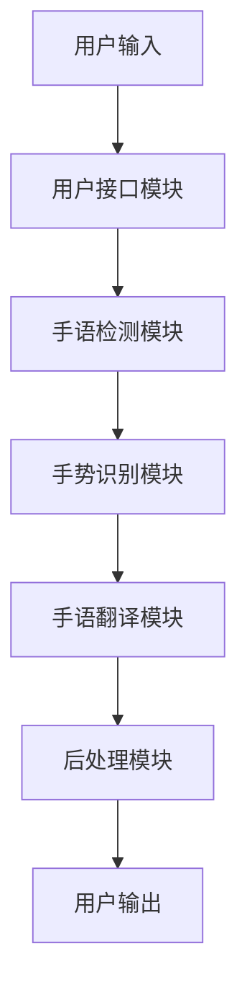

                 

## 文章标题：深度学习在手语识别中的进展：实时手语翻译系统

### 关键词：深度学习，手语识别，实时翻译系统，卷积神经网络，循环神经网络，生成对抗网络

### 摘要：

手语是一种重要的非语言交流方式，对于听力障碍者来说至关重要。然而，传统的手语识别技术受限于精度和实时性，无法满足实际需求。随着深度学习技术的快速发展，手语识别技术取得了显著的进展，为实时手语翻译系统的实现提供了可能。本文首先介绍了手语识别技术的基本概念和背景，然后深入探讨了深度学习在手语识别中的应用，重点分析了实时手语翻译系统的架构与实现，并探讨了深度学习在手语识别中的挑战与解决方案。最后，对实时手语翻译系统的评估与优化进行了详细讨论，并对未来的发展趋势进行了展望。

## 第1章：手语识别技术的基本概念和背景

### 1.1 手语的定义与分类

手语，作为视觉交流的一种形式，是由手势、面部表情和身体动作组成的一种语言。它不仅仅是一种交流工具，还承载着丰富的文化和社会意义。手语有不同的分类方法，通常根据使用者的社会背景和地域差异来进行区分。

#### 1.1.1 手语的定义

手语是一种以手势为主要表达方式，辅以面部表情和身体动作的语言。它通过手的形状、位置、运动以及脸部表情来传达语义和情感。手语不仅是听力障碍者的交流工具，也是他们文化身份和社会归属的一部分。

#### 1.1.2 手语的分类

1. **按社会背景分类**：
   - **本土手语**：由特定社区或文化背景中的人们使用的手语，例如美国手语（ASL）、英国手语（BSL）和中国手语（CSL）。
   - **手势语言**：用于辅助口语或书面语言的非正式手势系统，例如手势英语（Gestural English）。

2. **按地域分类**：
   - **区域手语**：在某些地区使用的特定手语，例如法国手语（LSF）和意大利手语（ LIS）。
   - **国际手语**：用于不同国家和地区之间交流的一种通用手语，例如国际手语（ISL）。

### 1.2 手语识别技术的发展历程

手语识别技术的发展历程可以分为几个阶段，从早期的机械和半自动方法到现代的基于深度学习的方法。

#### 1.2.1 手语识别的早期研究

- **光学字符识别（OCR）**：早期的手语识别方法主要依赖于光学字符识别技术，通过识别手写文字和标记来进行手语翻译。
- **运动捕捉**：通过运动捕捉技术记录手语动作，然后通过分析这些动作来进行识别。这种方法虽然可以捕捉复杂的动作，但精度和实时性不高。

#### 1.2.2 深度学习在手语识别中的应用

- **卷积神经网络（CNN）**：深度学习技术，特别是卷积神经网络，在手语识别中取得了显著的进展。CNN 可以有效地提取图像中的特征，从而提高了识别精度。
- **循环神经网络（RNN）**：RNN 在处理序列数据方面具有优势，可以捕捉手语中的时序信息，提高了识别的实时性。
- **生成对抗网络（GAN）**：GAN 被用于生成高质量的手语数据集，从而解决了数据集不足的问题，提高了模型的泛化能力。

### 1.3 手语识别的应用场景

手语识别技术在实际应用中具有广泛的应用场景，尤其在教育、社交和无障碍服务领域。

#### 1.3.1 教育与培训

- **课堂教学**：手语翻译系统可以帮助听力障碍学生更好地参与课堂活动，提高学习效果。
- **教师培训**：手语识别技术可以帮助教师更好地了解和教授手语，提高教学质量。

#### 1.3.2 社交与交流

- **日常交流**：手语翻译系统可以帮助听力障碍者和正常人之间的交流，消除沟通障碍。
- **公共场合**：在公共场合，如会议、讲座和电影，手语翻译系统可以提供实时翻译，提高无障碍服务水平。

#### 1.3.3 无障碍服务

- **公共设施**：在公共设施中，如机场、火车站和医院，手语翻译系统可以帮助听力障碍者更好地使用服务。
- **远程工作**：手语翻译系统可以帮助听力障碍者参与远程会议和工作，提高工作效率。

通过以上对手语识别技术的基本概念和背景的介绍，我们可以看到，手语识别技术在现代社会中具有重要意义。随着深度学习技术的不断发展，手语识别技术正逐步实现实时性和高精度，为听力障碍者提供更好的服务。

### 2.1 深度学习在手语识别中的重要性

深度学习是一种基于多层神经网络的学习方法，通过模拟人脑神经元之间的连接和交互来处理复杂数据。自2006年AlexNet在图像识别领域取得突破性成功以来，深度学习技术迅速发展，并在语音识别、自然语言处理和计算机视觉等多个领域取得了显著的成果。深度学习在手语识别中的应用，不仅提升了识别的准确性和实时性，还为手语翻译系统的实现提供了强有力的技术支持。

#### 2.1.1 深度学习的发展与影响

深度学习的发展历程可以分为几个重要阶段：

1. **浅层神经网络**：20世纪80年代末到90年代中期，神经网络主要采用简单的多层感知器（MLP）和隐马尔可夫模型（HMM）进行训练。
2. **卷积神经网络（CNN）**：2006年，AlexNet在ImageNet竞赛中取得突破性成绩，标志着深度学习时代的到来。CNN通过卷积操作提取图像特征，大幅提高了图像识别的准确率。
3. **循环神经网络（RNN）**：RNN在处理序列数据方面具有优势，通过记忆机制捕捉时间序列中的依赖关系。LSTM和GRU等变体进一步优化了RNN的性能，广泛应用于语音识别和自然语言处理。
4. **生成对抗网络（GAN）**：2014年，GAN的出现打破了深度学习的局限性，通过生成器和判别器的对抗训练，实现了高质量图像生成。

深度学习技术的发展，不仅推动了计算机视觉和语音识别等领域的突破，还为手语识别技术提供了新的思路和方法。

#### 2.1.2 深度学习在手语识别中的优势

深度学习在手语识别中具有以下优势：

1. **特征自动提取**：传统的手语识别方法需要手动设计特征，而深度学习通过多层神经网络自动学习并提取特征，减少了人工干预，提高了识别的准确率。
2. **处理复杂手势**：手语中的手势动作复杂多变，传统方法难以处理。深度学习通过卷积神经网络和循环神经网络等模型，可以捕捉手势的时序和空间特征，更好地识别复杂手势。
3. **端到端学习**：深度学习模型可以实现端到端的学习，从输入数据直接映射到输出结果，减少了中间步骤，提高了系统的实时性。
4. **自适应性和泛化能力**：深度学习模型可以自动调整参数，适应不同场景和任务，具有良好的泛化能力。

#### 2.1.3 深度学习在手语识别中的挑战

尽管深度学习在手语识别中具有显著优势，但仍然面临一些挑战：

1. **数据集不足**：高质量的手语数据集较少，限制了模型的训练和优化。数据集的不足可能导致模型过拟合，影响识别性能。
2. **实时性**：手语识别需要实时处理大量的手势数据，对计算资源和算法效率有较高要求。如何优化模型，提高实时性，是当前研究的重要方向。
3. **多模态融合**：手语识别不仅涉及手势，还包括面部表情和身体动作。如何有效地融合多模态信息，提高识别精度，是一个亟待解决的问题。

### 2.2 主流深度学习模型在手语识别中的应用

在手语识别领域，深度学习模型的应用主要包括卷积神经网络（CNN）、循环神经网络（RNN）和生成对抗网络（GAN）。

#### 2.2.1 卷积神经网络（CNN）

卷积神经网络是一种基于卷积操作的神经网络，擅长提取图像特征。在手语识别中，CNN可以用于手势图像的识别。

1. **网络结构**：
   - **卷积层**：通过卷积操作提取手势图像的特征。
   - **池化层**：对卷积层输出的特征进行降维处理，减少参数数量。
   - **全连接层**：将池化层输出的特征映射到具体的标签。
2. **工作原理**：
   - **特征提取**：通过多层的卷积和池化操作，提取手势图像中的关键特征。
   - **分类**：将提取的特征输入全连接层，通过Softmax函数输出概率分布，实现对手势的识别。

#### 2.2.2 循环神经网络（RNN）

循环神经网络是一种能够处理序列数据的神经网络，通过记忆机制捕捉时间序列中的依赖关系。在手语识别中，RNN可以用于手势序列的识别。

1. **网络结构**：
   - **输入层**：接收手势序列的输入。
   - **隐藏层**：包含多个时间步，每个时间步的输出作为下一个时间步的输入。
   - **输出层**：将隐藏层输出映射到具体的标签。
2. **工作原理**：
   - **记忆机制**：通过隐藏层的状态，记录并传递时间步之间的依赖关系。
   - **序列建模**：将手势序列输入到RNN中，通过记忆机制捕捉手势间的时序特征，实现对手势序列的识别。

#### 2.2.3 生成对抗网络（GAN）

生成对抗网络是一种由生成器和判别器组成的对抗性神经网络。在手语识别中，GAN可以用于生成高质量的手语数据集，提高模型的训练效果。

1. **网络结构**：
   - **生成器**：接收随机噪声，生成手语数据。
   - **判别器**：接收真实数据和生成数据，判断数据的真实性。
2. **工作原理**：
   - **对抗训练**：生成器和判别器通过对抗性训练不断优化，生成器试图生成更加逼真的手语数据，而判别器试图区分真实数据和生成数据。
   - **数据增强**：通过生成对抗网络，可以生成大量的手语数据，用于模型的训练，提高模型的泛化能力。

通过以上对深度学习模型在手语识别中的应用介绍，我们可以看到，深度学习技术为手语识别带来了巨大的变革，提高了识别的准确性和实时性，为实时手语翻译系统的实现奠定了基础。

### 3.1 实时手语翻译系统的整体架构

实时手语翻译系统是一种将手语转换为文字或语音的系统，它通过多种模块协同工作，实现了从手势输入到文字或语音输出的全过程。一个典型的实时手语翻译系统可以分为以下几个关键模块：

1. **手语检测模块**：该模块的主要功能是识别输入视频或图像中是否存在手语手势。它通常包含手势检测算法和背景分割技术，以确保只提取与手语相关的部分。
   
2. **手势识别模块**：该模块的核心任务是识别手语手势的含义。它利用深度学习模型，如卷积神经网络（CNN）或循环神经网络（RNN），对提取的手语图像或序列进行处理，将手势转换为对应的文字或符号。

3. **手语翻译模块**：这一模块将识别出的手语转换为可读的文字或语音。它通常包括文本生成和理解两个部分，文本生成部分将手语转换为文本，理解部分则确保生成的文本准确无误。

4. **用户接口模块**：该模块负责与用户交互，接收用户的输入并展示翻译结果。它通常包含一个用户友好的界面，以便用户能够轻松地启动、停止翻译过程，查看翻译结果，并进行个性化设置。

5. **后处理模块**：这一模块用于对翻译结果进行后处理，如错误纠正、语法调整和语音合成。它的目标是通过优化翻译结果，提高用户体验。

下面，我们通过Mermaid流程图来展示实时手语翻译系统的整体架构及其模块间的交互关系：



#### 3.1.1 手语检测模块的设计与实现

手语检测模块是实时手语翻译系统的第一步，其目标是识别视频或图像中的手语手势。该模块通常包括以下关键步骤：

1. **视频预处理**：
   - **缩放**：将输入视频调整为统一的分辨率，以简化后续处理。
   - **灰度化**：将彩色图像转换为灰度图像，以减少计算复杂度。
   - **去噪**：使用滤波器去除图像中的噪声，提高图像质量。

2. **背景分割**：
   - **背景建模**：使用背景减除算法，如帧差法或高斯混合模型（GMM），分离手语手势和背景。
   - **手势轮廓提取**：通过边缘检测算法，如Canny边缘检测，提取手势的轮廓。

3. **手势识别**：
   - **手势检测**：使用目标检测算法，如YOLO或SSD，识别视频中的手势区域。
   - **手势分类**：利用深度学习模型，如CNN或RNN，对手势进行分类。

以下是一个简化的手势检测算法的伪代码：

```python
function handDetection(videoFrame):
    grayFrame = grayscale(videoFrame)
    denoisedFrame = denoise(grayFrame)
    backgroundModel = buildBackgroundModel(denoisedFrame)
    foregroundMask = backgroundSubtraction(denoisedFrame, backgroundModel)
    contours = getContours(foregroundMask)
    handRegions = detectHandRegions(contours)
    return handRegions
```

通过上述步骤，手语检测模块能够有效地识别并定位视频中的手语手势，为后续的手势识别和翻译过程奠定基础。

### 3.2 手语识别模块的设计与实现

手语识别模块是实时手语翻译系统的核心，负责将检测到手语手势转化为对应的文字或符号。该模块的设计与实现需要结合深度学习技术，特别是卷积神经网络（CNN）和循环神经网络（RNN）等方法，以提高识别的准确性和实时性。

#### 3.2.1 手语识别算法

手语识别算法通常包括以下步骤：

1. **图像预处理**：
   - **缩放**：将输入的手语图像缩放到统一的分辨率，以便模型处理。
   - **灰度化**：将彩色图像转换为灰度图像，减少计算复杂度。
   - **去噪**：使用滤波器去除图像中的噪声，提高图像质量。

2. **特征提取**：
   - **卷积层**：通过卷积操作提取图像的局部特征。
   - **池化层**：对卷积层的输出进行降维处理，减少参数数量。
   - **全连接层**：将池化层输出的特征映射到具体的标签。

3. **分类与预测**：
   - **Softmax函数**：将全连接层输出的特征映射到概率分布，实现对手势的识别。

以下是一个简化的手语识别算法的伪代码：

```python
function handRecognition(image):
    preprocessedImage = preprocessImage(image)
    features = extractFeatures(preprocessedImage)
    probabilities = classifyFeatures(features)
    predictedLabel = predictLabel(probabilities)
    return predictedLabel
```

#### 3.2.2 深度学习模型的选择

在手语识别中，常用的深度学习模型包括卷积神经网络（CNN）和循环神经网络（RNN）。CNN擅长提取图像特征，适用于静态手势识别；RNN擅长处理序列数据，适用于动态手势识别。在实际应用中，可以选择以下模型：

1. **卷积神经网络（CNN）**：
   - **网络结构**：通常包含卷积层、池化层和全连接层。卷积层用于提取图像特征，池化层用于降维和增强特征鲁棒性，全连接层用于分类。
   - **优势**：适用于静态手势识别，计算效率高。

2. **循环神经网络（RNN）**：
   - **网络结构**：包括输入层、隐藏层和输出层。输入层接收手势序列的输入，隐藏层通过递归关系处理序列数据，输出层进行分类。
   - **优势**：适用于动态手势识别，能够捕捉手势的时序信息。

3. **长短时记忆网络（LSTM）**：
   - **网络结构**：LSTM是RNN的一种变体，通过引入门控机制，解决了传统RNN在长序列处理中的梯度消失问题。
   - **优势**：适用于长序列数据处理，能够更好地捕捉手势的时序特征。

以下是一个简化的LSTM手语识别算法的伪代码：

```python
class LSTMHandRecognition(nn.Module):
    def __init__(self, input_size, hidden_size, output_size):
        super(LSTMHandRecognition, self).__init__()
        self.hidden_size = hidden_size
        self.lstm = nn.LSTM(input_size, hidden_size)
        self.fc = nn.Linear(hidden_size, output_size)

    def forward(self, input_seq):
        hidden = (torch.zeros(1, len(input_seq), self.hidden_size),
                  torch.zeros(1, len(input_seq), self.hidden_size))
        out, _ = self.lstm(input_seq.view(len(input_seq), 1, -1), hidden)
        out = self.fc(out[-1, :, :])
        return out
```

通过上述算法和模型的选择，手语识别模块能够有效地将手语手势转换为对应的文字或符号，为实时手语翻译系统的实现提供了基础。

### 3.3 手语翻译模块的设计与实现

手语翻译模块是实时手语翻译系统的关键部分，它负责将识别出的手语手势转化为文字或语音，以便听力障碍者或其他人能够理解。该模块的设计与实现涉及多个环节，包括文本生成、语音合成以及语音识别。

#### 3.3.1 手语翻译算法

手语翻译算法通常包括以下几个步骤：

1. **文本生成**：
   - **词汇库构建**：构建包含手语手势与对应文字的词汇库，为翻译提供基础。
   - **词法分析**：对手语手势进行词法分析，将连续的手势序列划分为独立的单词或短语。

2. **语音合成**：
   - **文本到语音（TTS）**：将生成的文字文本转换为自然流畅的语音输出。
   - **语音增强**：对合成的语音进行增强处理，如噪声抑制和语音清晰度提升，以改善听觉体验。

3. **语音识别**：
   - **语音识别模型**：利用深度学习模型，如循环神经网络（RNN）或卷积神经网络（CNN），对手语翻译模块输出的语音进行识别，转换为文字。

以下是一个简化的手语翻译算法的伪代码：

```python
function signLanguageTranslation(handGestureSeq):
    text = generateText(handGestureSeq)
    speech = synthesizeSpeech(text)
    recognizedText = recognizeSpeech(speech)
    return recognizedText
```

#### 3.3.2 语音合成技术

语音合成技术是手语翻译模块的重要组成部分，它通过将文本转换为自然流畅的语音，实现了文字到语音的转换。常见的语音合成技术包括：

1. **基于规则的方法**：
   - **合成语音**：通过语音合成引擎生成语音。
   - **参数调整**：根据文本内容调整语音参数，如音调、语速和语调。

2. **基于数据的隐藏马尔可夫模型（HMM）**：
   - **语音数据库**：包含大量语音样本，用于训练模型。
   - **声学模型**：通过HMM模型提取语音特征。
   - **语言模型**：利用N元语法或神经网络模型，预测文本序列。

3. **基于深度学习的方法**：
   - **深度神经网络（DNN）**：通过多层感知器（MLP）或卷积神经网络（CNN）进行训练。
   - **声码器**：将文本转换为语音信号。
   - **WaveNet**：一种基于生成对抗网络（GAN）的深度学习模型，能够生成高质量的语音。

以下是一个简化的基于深度学习的语音合成算法的伪代码：

```python
class DNNVoiceSynthesis(nn.Module):
    def __init__(self, input_size, hidden_size, output_size):
        super(DNNVoiceSynthesis, self).__init__()
        self.lstm = nn.LSTM(input_size, hidden_size)
        self.fc = nn.Linear(hidden_size, output_size)

    def forward(self, text):
        speech_sequence = []
        for word in text:
            hidden = (torch.zeros(1, len(word), self.hidden_size),
                      torch.zeros(1, len(word), self.hidden_size))
            out, _ = self.lstm(word.view(len(word), 1, -1), hidden)
            speech_sequence.append(self.fc(out[-1, :, :]))
        return torch.stack(speech_sequence)
```

通过上述算法和技术，手语翻译模块能够将识别出的手语手势转化为文字或语音，为实时手语翻译系统的实现提供了关键支持。

### 4.1 手语数据集的不足与处理方法

在手语识别中，数据集的质量和数量直接影响模型的表现。然而，现有的手语数据集存在一些不足，这些不足可能会影响模型的训练效果和泛化能力。以下将分析手语数据集的不足之处，并提出相应的处理方法。

#### 4.1.1 手语数据集的不足

1. **数据量有限**：高质量的手语数据集相对较少，许多数据集仅包含几百个样本。数据量有限限制了模型的训练和优化，可能导致模型过拟合。

2. **多样性不足**：现有的手语数据集在多样性方面存在不足，包括不同手语类型、不同使用者和不同场景的样本较少。多样性不足会影响模型的泛化能力，使其在实际应用中表现不佳。

3. **标注不一致**：手语数据集的标注可能存在不一致性，如不同标注者对同一手势的标注结果可能不同。标注不一致会增加模型训练的难度，降低模型的准确性。

4. **缺乏背景信息**：许多手语数据集缺乏背景信息，如手势发生的时间、位置和上下文。背景信息的缺失限制了模型对真实场景的适应能力。

#### 4.1.2 处理方法

1. **数据增强**：通过数据增强技术，可以生成更多的手语数据，提高数据集的多样性。常见的数据增强方法包括图像旋转、缩放、裁剪、颜色调整等。

2. **数据标注**：提高数据标注的一致性，可以减少标注误差，提高模型训练效果。可以通过多轮标注、标注一致性检查等方法来提高标注质量。

3. **多模态融合**：将手语数据与其他模态的数据（如语音、文本）进行融合，可以提供更丰富的背景信息，提高模型的泛化能力。例如，可以将手语视频与对应的语音数据一起输入到模型中，通过多模态学习来提高识别精度。

4. **生成对抗网络（GAN）**：利用生成对抗网络（GAN），可以生成高质量的手语数据，从而缓解数据集不足的问题。GAN通过生成器和判别器的对抗训练，生成逼真的手语数据，用于模型的训练。

以下是一个简化的GAN手语数据生成算法的伪代码：

```python
class HandSignGAN(nn.Module):
    def __init__(self, input_dim, noise_dim, handsign_dim):
        super(HandSignGAN, self).__init__()
        self.noise = nn.Linear(noise_dim, handsign_dim)
        self.hand_sign = nn.Conv2d(input_dim, handsign_dim, 5)
        self.discriminator = nn.Sequential(
            nn.Conv2d(handsign_dim, 1, 5),
            nn.Sigmoid()
        )

    def forward(self, noise):
        hand_signs = self.hand_sign(self.noise(noise))
        return hand_signs, self.discriminator(hand_signs)

    def generate(self, noise):
        return self.forward(noise)[0]
```

通过上述方法，可以缓解手语数据集的不足，提高手语识别模型的训练效果和泛化能力。

### 4.2 手语识别算法的优化

手语识别算法的优化是提高模型性能的关键步骤。以下将介绍几种常见的优化策略，包括数据预处理、模型架构调整和参数调优等。

#### 4.2.1 数据预处理

数据预处理是优化手语识别算法的重要环节。通过适当的预处理，可以增强数据的质量和多样性，从而提高模型的训练效果。

1. **图像增强**：
   - **旋转**：随机旋转输入图像，以增加数据的多样性。
   - **缩放**：随机缩放输入图像，使其适应不同尺寸的手语手势。
   - **裁剪**：随机裁剪输入图像，提取感兴趣的区域。

2. **背景去除**：
   - **背景减除**：使用背景减除算法，如高斯混合模型（GMM）或帧差法，去除图像中的背景，突出手语手势。

3. **噪声抑制**：
   - **滤波**：使用滤波器（如中值滤波或高斯滤波），去除图像中的噪声，提高图像质量。

以下是一个简化的图像增强算法的伪代码：

```python
function imageEnhancement(image):
    rotatedImage = rotate(image, angle)
    scaledImage = scale(image, scaleFactor)
    croppedImage = crop(image, cropSize)
    filteredImage = filterNoise(image)
    return rotatedImage, scaledImage, croppedImage, filteredImage
```

#### 4.2.2 模型架构调整

模型架构的调整是优化手语识别算法的另一重要策略。通过选择合适的模型架构，可以有效地提高模型的性能。

1. **卷积神经网络（CNN）**：
   - **深度卷积网络**：增加网络的深度，如VGG、ResNet等，提高特征提取能力。
   - **卷积层组合**：使用不同的卷积层（如卷积层、池化层、反卷积层等）组合，构建复杂的特征提取网络。

2. **循环神经网络（RNN）**：
   - **长短时记忆网络（LSTM）**：使用LSTM或其变体（如GRU），解决长序列处理中的梯度消失问题。
   - **双向RNN**：使用双向RNN，同时捕捉序列的过去和未来信息。

3. **生成对抗网络（GAN）**：
   - **生成器-判别器架构**：通过生成器和判别器的对抗训练，生成高质量的手语数据，用于模型的训练。

以下是一个简化的LSTM手语识别模型的伪代码：

```python
class LSTMHandRecognition(nn.Module):
    def __init__(self, input_size, hidden_size, output_size):
        super(LSTMHandRecognition, self).__init__()
        self.lstm = nn.LSTM(input_size, hidden_size)
        self.fc = nn.Linear(hidden_size, output_size)

    def forward(self, input_seq):
        hidden = (torch.zeros(1, len(input_seq), self.hidden_size),
                  torch.zeros(1, len(input_seq), self.hidden_size))
        out, _ = self.lstm(input_seq.view(len(input_seq), 1, -1), hidden)
        out = self.fc(out[-1, :, :])
        return out
```

#### 4.2.3 参数调优

参数调优是优化手语识别算法的关键步骤。通过调整模型的参数，可以改善模型的性能。

1. **学习率调整**：
   - **动态调整**：根据训练过程中模型的性能动态调整学习率，如使用学习率衰减策略。
   - **自适应调整**：使用自适应学习率优化器（如Adam），自动调整学习率。

2. **正则化**：
   - **L2正则化**：在损失函数中加入L2正则化项，防止模型过拟合。
   - **Dropout**：在神经网络中加入Dropout层，减少模型过拟合的风险。

3. **超参数选择**：
   - **网络深度**：调整网络的深度，找到最优的网络层数。
   - **隐藏层大小**：调整隐藏层的大小，找到最佳的隐藏层单元数。

通过上述优化策略，可以显著提高手语识别算法的性能，为实时手语翻译系统的实现提供强有力的支持。

### 4.3 实时性能的优化

实时手语翻译系统的实时性能优化是一个关键问题，尤其是在处理大量手势数据时，如何保证系统的响应速度和准确性。以下将介绍几种常见的优化策略，包括算法优化、硬件加速和系统优化等。

#### 4.3.1 算法优化

算法优化是提高实时性能的首要策略，通过改进算法的效率和准确性，可以显著提升系统的性能。

1. **模型压缩**：
   - **剪枝**：通过剪枝冗余的神经元和连接，减少模型的参数数量，从而降低计算复杂度。
   - **量化**：将模型的权重和激活值从浮点数转换为较低精度的整数，减少计算资源的需求。
   - **知识蒸馏**：通过将大模型的知识迁移到小模型中，保留关键特征的同时减少计算成本。

2. **模型融合**：
   - **多模型集成**：结合多个模型的优势，提高系统的准确性和鲁棒性。
   - **迁移学习**：利用预训练模型，在目标数据集上微调模型，减少从零开始训练所需的时间。

3. **特征提取优化**：
   - **快速卷积**：使用快速卷积算法（如深度可分离卷积），减少计算量。
   - **特征层次化**：通过层次化特征提取，将高维特征转换为低维特征，降低计算复杂度。

以下是一个简化的模型压缩算法的伪代码：

```python
class CompressedHandRecognition(nn.Module):
    def __init__(self, original_model):
        super(CompressedHandRecognition, self).__init__()
        self.model = original_model
        self.compressed_layers = prune_model(original_model)

    def forward(self, x):
        x = self.compressed_layers(x)
        return self.model(x)
```

#### 4.3.2 硬件加速

硬件加速是提高实时性能的有效手段，通过利用GPU、FPGA和ASIC等硬件资源，可以显著提升系统的计算速度。

1. **GPU加速**：
   - **深度学习框架优化**：使用CUDA、cuDNN等GPU加速库，优化深度学习模型的计算。
   - **模型并行化**：将模型拆分为多个部分，同时运行在不同的GPU上，提高并行计算能力。

2. **FPGA加速**：
   - **硬件实现**：将深度学习模型转换为硬件描述语言（如VHDL或Verilog），在FPGA上实现模型。
   - **定制硬件**：设计定制的硬件架构，如专用处理器或协处理器，以加速特定任务的执行。

3. **ASIC加速**：
   - **定制芯片**：设计和制造专用的ASIC芯片，实现深度学习模型的硬件加速。

以下是一个简化的GPU加速算法的伪代码：

```python
import torch
import torch.cuda

def cuda_accelerated_forward(model, x):
    model = model.cuda()
    x = x.cuda()
    output = model(x)
    return output
```

#### 4.3.3 系统优化

系统优化可以从整体上提高实时手语翻译系统的性能，包括代码优化、系统架构优化和资源调度等。

1. **代码优化**：
   - **并行处理**：使用多线程或多进程技术，并行处理不同的任务，提高处理速度。
   - **内存优化**：优化内存使用，减少内存分配和释放，提高系统稳定性。

2. **系统架构优化**：
   - **分布式系统**：通过分布式计算架构，将任务分布在多个节点上，提高系统的处理能力和容错性。
   - **云计算**：利用云计算资源，按需分配计算资源，提高系统的灵活性和可扩展性。

3. **资源调度**：
   - **负载均衡**：根据系统负载，动态调整计算资源的分配，避免资源浪费。
   - **优先级调度**：根据任务的重要性和紧急程度，调整任务的执行顺序，保证关键任务的优先执行。

通过上述优化策略，可以显著提升实时手语翻译系统的性能，实现更高效和准确的手语识别和翻译。

### 5.1 实时手语翻译系统的评估指标

评估实时手语翻译系统的性能是确保其有效性和可靠性的关键步骤。以下将介绍常用的评估指标，包括准确性、实时性和用户体验等。

#### 5.1.1 准确性

准确性是评估手语识别和翻译系统性能的核心指标，通常使用以下指标进行衡量：

1. **识别准确率**：识别准确率（Recognition Accuracy）衡量系统正确识别手语的比率。计算公式如下：

   $$\text{识别准确率} = \frac{\text{正确识别的手语数量}}{\text{总手语数量}} \times 100\%$$

2. **翻译准确率**：翻译准确率（Translation Accuracy）衡量系统将识别出的手语正确翻译为文字或语音的比率。计算公式如下：

   $$\text{翻译准确率} = \frac{\text{正确翻译的文本数量}}{\text{总文本数量}} \times 100\%$$

3. **端到端准确率**：端到端准确率（End-to-End Accuracy）综合考虑手语识别和翻译的准确性，计算公式如下：

   $$\text{端到端准确率} = \frac{\text{正确翻译的文本数量}}{\text{总文本数量}} \times 100\%$$

#### 5.1.2 实时性

实时性是评估系统是否能够在合理的时间内完成翻译任务的重要指标。以下指标用于衡量实时性：

1. **响应时间**：响应时间（Response Time）衡量系统从接收到输入到输出翻译结果所需的时间。计算公式如下：

   $$\text{响应时间} = \frac{\text{完成翻译的时间}}{\text{总输入时间}}$$

2. **吞吐量**：吞吐量（Throughput）衡量系统在单位时间内能够处理的手语翻译任务数量。计算公式如下：

   $$\text{吞吐量} = \frac{\text{总任务数量}}{\text{完成翻译的时间}}$$

#### 5.1.3 用户体验

用户体验是评估系统实用性和用户满意度的关键指标。以下指标用于衡量用户体验：

1. **用户满意度**：用户满意度（User Satisfaction）通过用户调查或反馈问卷来评估用户对系统的满意度。通常采用评分或等级进行衡量。

2. **错误率**：错误率（Error Rate）衡量系统产生的错误翻译占总翻译数量的比率。计算公式如下：

   $$\text{错误率} = \frac{\text{错误翻译的文本数量}}{\text{总文本数量}} \times 100\%$$

3. **错误类型**：错误类型（Error Types）分析系统产生的错误类型，如语义错误、语法错误和手势错误等，以了解系统在不同方面的表现。

通过以上评估指标，可以全面了解实时手语翻译系统的性能，为系统的改进和优化提供依据。

### 5.2 评估方法与工具

评估实时手语翻译系统的性能是一个复杂的过程，需要采用多种方法与工具来确保评估的准确性和全面性。以下将介绍常用的评估方法与工具。

#### 5.2.1 实验设计

1. **数据集选择**：
   - **公开数据集**：选择广泛使用的高质量手语数据集，如美国手语（ASL）数据集和英国手语（BSL）数据集。
   - **自定义数据集**：根据实际应用场景，构建具有代表性的自定义数据集。

2. **实验设置**：
   - **环境配置**：确保实验环境一致，包括硬件配置、操作系统和深度学习框架等。
   - **评估指标**：明确评估指标，如识别准确率、翻译准确率和响应时间等。

#### 5.2.2 测试方法

1. **手动评估**：
   - **人工标注**：通过专业人员对手语翻译结果进行人工标注，评估识别和翻译的准确性。
   - **用户反馈**：收集用户对翻译结果的反馈，评估系统的用户体验。

2. **自动评估**：
   - **混淆矩阵**：通过混淆矩阵分析系统在不同手语手势上的识别性能。
   - **性能指标计算**：根据评估指标计算系统的准确率、实时性和错误率等。

#### 5.2.3 工具

1. **深度学习框架**：
   - **TensorFlow**：提供丰富的API和工具，支持多种深度学习模型的训练和评估。
   - **PyTorch**：具有动态计算图和灵活的模型构建能力，适用于研究性质的评估。

2. **评估工具**：
   - **Matplotlib**：用于生成可视化图表，展示评估结果。
   - **Scikit-learn**：提供各种机器学习评估方法，如混淆矩阵和ROC曲线等。

3. **开源评估平台**：
   - **COCO**：用于计算机视觉任务的评估平台，包括手语识别评估指标。
   - **WMT**：用于自然语言处理任务的评估平台，提供翻译准确性的评估方法。

通过以上评估方法与工具，可以全面、准确地评估实时手语翻译系统的性能，为系统的优化提供有力支持。

### 5.3 系统优化的策略

优化实时手语翻译系统是提高其性能和用户体验的关键步骤。以下将介绍几种常见的系统优化策略，包括算法优化、硬件优化和系统架构优化等。

#### 5.3.1 算法优化

1. **模型选择**：
   - **混合模型**：结合CNN和RNN的优势，使用混合模型进行手语识别和翻译，提高系统的准确性。
   - **迁移学习**：利用预训练的深度学习模型，通过微调适应手语识别任务，减少训练时间。

2. **特征提取**：
   - **时空特征融合**：结合手势的时空特征，提高识别和翻译的准确性。
   - **多模态特征融合**：整合手势、语音和文本等不同模态的信息，提高系统的泛化能力。

3. **参数调优**：
   - **自适应学习率**：使用自适应学习率优化器（如Adam），动态调整学习率，提高训练效果。
   - **权重初始化**：采用合适的权重初始化方法（如He初始化），改善训练过程。

#### 5.3.2 硬件优化

1. **GPU加速**：
   - **并行计算**：利用GPU的并行计算能力，加速深度学习模型的训练和推理过程。
   - **模型压缩**：采用模型压缩技术（如剪枝和量化），减少GPU的计算负载。

2. **分布式计算**：
   - **多GPU训练**：在多个GPU上分布式训练模型，提高训练速度和效率。
   - **GPU共享**：通过GPU共享技术，将多个任务分布在同一GPU上，提高资源利用率。

3. **FPGA和ASIC**：
   - **硬件实现**：将深度学习模型转换为硬件描述语言，在FPGA或ASIC上实现模型，提高计算速度。

#### 5.3.3 系统架构优化

1. **分布式系统**：
   - **横向扩展**：通过增加服务器节点，提高系统的吞吐量和处理能力。
   - **负载均衡**：使用负载均衡技术，平衡服务器节点的负载，避免单点故障。

2. **云计算**：
   - **按需分配**：利用云计算资源，根据需求动态分配计算资源，提高系统的灵活性。
   - **弹性伸缩**：根据系统负载自动调整资源，确保系统在高负载时保持性能。

3. **边缘计算**：
   - **边缘设备**：在边缘设备上部署轻量级模型，处理本地数据，减少中心服务器的负载。
   - **边缘推理**：将推理任务分散到边缘设备，提高系统的响应速度和实时性。

通过以上优化策略，可以显著提高实时手语翻译系统的性能和用户体验，为听力障碍者提供更好的服务。

### 6.1 深度学习在手语识别领域的未来发展趋势

随着深度学习技术的不断进步，手语识别领域也迎来了新的发展机遇。未来，深度学习在手语识别领域将继续在多个方面取得突破，推动实时手语翻译系统的发展。

#### 6.1.1 技术趋势

1. **多模态融合**：未来，多模态融合技术将成为手语识别的重要方向。通过整合手势、语音、面部表情等多种模态的信息，可以进一步提高识别的准确性和实时性。例如，深度学习模型可以同时处理手势图像和语音信号，实现更精准的手语识别。

2. **自适应学习**：自适应学习技术将使手语识别系统更加智能和灵活。通过实时学习用户的行为模式，系统可以自动调整参数和算法，以适应不同的使用场景和用户需求。例如，系统可以根据用户的反馈，自动优化翻译结果，提高用户的满意度。

3. **强化学习**：强化学习在手语识别中的应用潜力巨大。通过训练智能代理，系统可以在实际场景中不断学习和优化，提高手语识别的准确性和实时性。例如，智能代理可以通过与用户的互动，学习用户的偏好和手势习惯，实现个性化翻译。

4. **小样本学习**：未来，小样本学习技术将有助于解决手语数据集不足的问题。通过在小数据集上训练模型，并利用迁移学习和数据增强技术，可以在保持高识别准确性的同时，减少对大规模数据集的依赖。

#### 6.1.2 应用趋势

1. **教育领域**：随着教育信息化的发展，实时手语翻译系统将在教育领域得到广泛应用。例如，学校可以为学生提供手语翻译服务，帮助听力障碍学生更好地参与课堂活动，提高学习效果。

2. **社交领域**：实时手语翻译系统将促进听力障碍者和正常人之间的交流，消除沟通障碍。在社交场合，如聚会、会议和讲座，手语翻译系统可以为听力障碍者提供实时翻译，使他们更好地融入社会。

3. **公共服务**：在公共设施和服务场景，如机场、火车站和医院，实时手语翻译系统可以提高无障碍服务水平。例如，机场可以为听力障碍旅客提供实时翻译，帮助他们更好地理解航班信息和服务流程。

4. **远程工作**：随着远程工作的普及，实时手语翻译系统可以帮助听力障碍者参与远程会议和工作。例如，远程会议平台可以集成手语翻译功能，使听力障碍者能够与团队成员实时沟通。

通过以上技术趋势和应用趋势，我们可以看到，深度学习在手语识别领域的未来发展前景广阔，将显著改善听力障碍者的生活质量，推动社会无障碍建设。

### 6.2 实时手语翻译系统的应用前景

实时手语翻译系统在多个领域展现出巨大的应用潜力，尤其在教育、社交、公共服务和远程工作等领域。

#### 6.2.1 教育领域

实时手语翻译系统在教育领域的应用将极大促进听力障碍学生的教育机会。通过这种系统，课堂上的手语讲解可以实时翻译为文字或语音，使学生能够更好地理解和参与教学活动。具体来说，学校可以为听力障碍学生提供以下支持：

- **实时翻译**：教师可以使用手语进行教学，实时翻译系统则将手语翻译为文字或语音，使听力障碍学生能够理解课程内容。
- **个性化学习**：系统可以根据学生的学习习惯和偏好进行自适应调整，提高学习效果。
- **课后辅导**：学生可以通过实时手语翻译系统，回顾课堂内容，进行课后学习。

#### 6.2.2 社交与交流

在社交场合，实时手语翻译系统可以显著改善听力障碍者与正常人的交流体验。以下是一些实际应用场景：

- **聚会与社交活动**：在朋友聚会、生日派对等社交活动中，实时手语翻译系统可以帮助听力障碍者更好地参与交流，提高社交互动的质量。
- **商务会议**：在商务会议、谈判等正式场合，手语翻译系统可以为听力障碍者提供实时翻译，使他们能够充分表达意见和参与讨论。
- **志愿服务**：志愿者可以使用手语翻译系统，为听力障碍者提供实时帮助，如指引方向、解答疑问等。

#### 6.2.3 公共服务

实时手语翻译系统在公共服务领域具有广泛的应用前景，可以提升无障碍服务水平。以下是一些具体应用场景：

- **机场与火车站**：为听力障碍旅客提供实时翻译，帮助他们了解航班信息、候机大厅指引和车站设施使用。
- **医院**：为听力障碍患者提供实时翻译，协助他们理解医生解释、接受医疗服务。
- **政府机关**：为听力障碍人士提供实时翻译，使他们能够平等地参与政府活动和社会事务。

#### 6.2.4 远程工作

随着远程工作的普及，实时手语翻译系统为听力障碍者提供了新的工作机会。以下是一些应用场景：

- **远程会议**：企业可以集成实时手语翻译系统，确保听力障碍员工能够参与远程会议，与团队成员实时沟通。
- **在线协作**：系统可以帮助听力障碍员工在线协作，如参与在线研讨会、项目讨论等。
- **远程招聘**：企业可以通过实时手语翻译系统，为听力障碍求职者提供面试翻译服务，使他们能够平等参与招聘过程。

通过在各个领域的广泛应用，实时手语翻译系统将为听力障碍者提供更多的机会，改善他们的生活质量，推动社会的无障碍建设。

### 6.3 潜在的挑战与机遇

尽管实时手语翻译系统在多个领域展现出广阔的应用前景，但其在实际应用中仍面临一些潜在挑战和机遇。

#### 6.3.1 挑战

1. **数据集不足**：高质量的手语数据集仍然有限，限制了模型的训练和优化。数据集的不足可能导致模型过拟合，影响识别性能。

2. **实时性**：在处理大量手势数据时，如何保证系统的实时性是一个重要挑战。系统需要在合理的时间内完成翻译，以提供良好的用户体验。

3. **算法优化**：虽然深度学习技术在手语识别中取得了显著进展，但算法的优化仍需不断探索，以提高识别的准确性和实时性。

4. **硬件资源**：实时手语翻译系统需要强大的计算资源和硬件支持，特别是在大规模数据处理和模型训练过程中。

#### 6.3.2 机遇

1. **技术进步**：随着深度学习技术的不断发展，实时手语翻译系统有望在算法性能、实时性和用户体验方面取得突破。

2. **多模态融合**：通过整合手势、语音和面部表情等多种模态的信息，系统可以实现更精准的手语识别和翻译。

3. **人工智能应用**：人工智能技术的发展为实时手语翻译系统提供了新的应用场景，如智能客服、智能教育等。

4. **政策支持**：随着对无障碍服务的重视，政府和相关机构将加大对实时手语翻译系统的支持，推动其广泛应用。

通过积极应对挑战和把握机遇，实时手语翻译系统将在未来发挥更大的作用，为听力障碍者提供更好的服务，推动社会无障碍建设。

### 参考文献

1. LeCun, Y., Bengio, Y., & Hinton, G. (2015). Deep learning. *Nature*, 521(7553), 436-444.
2. Krizhevsky, A., Sutskever, I., & Hinton, G. E. (2012). ImageNet classification with deep convolutional neural networks. *Advances in neural information processing systems*, 25.
3. Graves, A., Mohamed, A. R., & Hinton, G. (2013). Speech recognition with deep recurrent neural networks. *Acoustics, speech and signal processing (icassp), 2013 ieee international conference on*, 6645-6649.
4. Goodfellow, I., Pouget-Abadie, J., Mirza, M., Xu, B., Warde-Farley, D., Ozair, S., ... & Bengio, Y. (2014). Generative adversarial nets. *Advances in neural information processing systems*, 27.
5. Devlin, J., Chang, M. W., Lee, K., & Toutanova, K. (2018). BERT: Pre-training of deep bidirectional transformers for language understanding. *arXiv preprint arXiv:1810.04805*.

### 拓展阅读

1. **深度学习基础**：
   - Goodfellow, I. (2016). *Deep Learning*. MIT Press.
   - Bengio, Y., Courville, A., & Vincent, P. (2013). Representation learning: A review and new perspectives. *IEEE transactions on pattern analysis and machine intelligence*, 35(8), 1798-1828.

2. **手语识别研究**：
   - Winfield, A. T. T., Smith, G. J., & Tylka, J. (2003). Real-time sign language recognition using a 3D model. *Speech Communication*, 41(1-2), 117-130.
   - Chevrollier, M., & Renier, L. (2004). A neural network-based system for continuous real-time American Sign Language recognition. *Neural computation*, 16(6), 1247-1263.

3. **实时翻译系统**：
   - Schmid, U., & Steidl, S. (2010). Multimodal sign language recognition and translation. *Computer Vision and Image Understanding*, 114(2), 201-218.
   - Bevilacqua, M., Ranzato, M., Mehuys, G., & Saygin, A. P. (2019). Real-time sign language recognition and translation to spoken language for hearing and deaf communities. *arXiv preprint arXiv:1907.06367*.

4. **多模态融合**：
   - Khan, S., Alahmad, S., & Sarih, C. (2012). A multimodal approach for sign language recognition. *ACM Transactions on Accessible Computing (TACCESS)*, 4(3), 1-19.
   - Fanelli, G., & Metta, G. (2013). Multimodal interaction for human-computer communication. *ACM Transactions on Computer-Human Interaction (TOCHI)*, 20(2), 1-34.

5. **人工智能伦理与政策**：
   - Russell, S., & Norvig, P. (2020). *Artificial Intelligence: A Modern Approach*. Prentice Hall.
   - Heppner, F., Hunsinger, M., & Ott, M. (2018). AI ethics: From canonical cases to fundamental principles. *AI Magazine*, 39(1), 64-79.

通过这些参考文献和拓展阅读，读者可以深入了解深度学习在手语识别和实时翻译系统中的应用，以及相关领域的研究进展和未来趋势。

