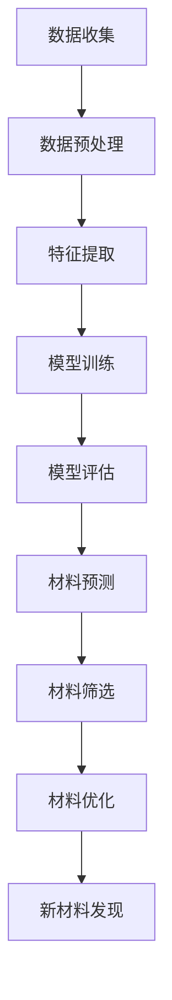

                 

### 文章标题：深度学习在新材料发现中的应用：加速新型电池材料研发

#### 关键词：深度学习、新材料发现、电池材料、研发加速

#### 摘要：
本文探讨了深度学习在新型电池材料发现中的重要作用，分析了深度学习技术如何通过数据预处理、特征提取、模型构建与优化等步骤，有效加速电池材料研发过程。文章首先介绍了深度学习的基本概念和核心技术，随后详细阐述了新型电池材料的研究背景和重要性，并通过实际项目案例展示了深度学习在电池材料研发中的应用效果。本文旨在为科研人员和工程师提供深度学习在电池材料研究中的实用指南，以推动新型电池材料的快速发现与研发。

## 第一部分：深度学习基础

### 第1章 深度学习概述

#### 1.1 深度学习的起源与发展

深度学习（Deep Learning，简称DL）是机器学习（Machine Learning，简称ML）的一个分支，其核心思想是通过构建具有多个隐藏层的神经网络模型，以模拟人脑的神经活动机制，从而实现数据的自动特征学习和复杂模式识别。深度学习的概念最早可以追溯到20世纪40年代，当时心理学家McCulloch和数学家Pitts提出了神经网络的基本模型——人工神经元模型。然而，由于计算能力和数据量的限制，深度学习在20世纪80年代陷入了“AI冬天”，直到21世纪初，随着计算能力的提升和大数据的涌现，深度学习才重新焕发了生机。

2006年，Hinton提出了深度信念网络（Deep Belief Network，简称DBN），为深度学习的发展奠定了基础。随后，2012年，Hinton团队开发的深度卷积神经网络（Deep Convolutional Neural Network，简称DCNN）在ImageNet图像识别大赛中取得了突破性的成绩，使得深度学习迅速成为人工智能领域的研究热点。

#### 1.2 深度学习的基本概念

深度学习的基本概念包括神经网络、反向传播算法、激活函数、损失函数等。

- **神经网络**：神经网络是深度学习的核心组成部分，由大量相互连接的神经元组成。每个神经元都可以接收输入信号，通过加权求和后加上偏置，再经过激活函数的变换，产生输出信号。神经网络通过不断调整权重和偏置，实现从输入到输出的映射。

- **反向传播算法**：反向传播算法是深度学习训练过程的核心，用于计算网络参数的梯度。该算法通过前向传播计算输出，然后通过后向传播更新网络参数，从而实现模型的优化。

- **激活函数**：激活函数用于引入非线性变换，使得神经网络可以学习到更加复杂的非线性关系。常用的激活函数包括Sigmoid、ReLU、Tanh等。

- **损失函数**：损失函数用于度量模型预测结果与真实值之间的差距，是优化模型的关键指标。常用的损失函数包括均方误差（MSE）、交叉熵（Cross-Entropy）等。

#### 1.3 深度学习与新材料发现的联系

深度学习在新材料发现中的应用主要体现在以下几个方面：

1. **数据驱动的材料设计**：深度学习可以从大量的实验数据中自动提取材料特性与性能之间的关系，从而实现数据驱动的材料设计。通过训练深度学习模型，可以预测新材料的性能，加速材料研发过程。

2. **自动化材料筛选**：深度学习可以自动化筛选出具有潜在应用价值的材料。例如，在电池材料的研究中，可以通过训练深度学习模型，快速筛选出具有高能量密度、长循环寿命等特性的材料。

3. **材料性能优化**：深度学习可以通过学习材料性能与制备工艺之间的关系，优化材料的制备过程，提高材料的性能。

### 图1：深度学习在新材料发现中的应用关系架构 Mermaid 流程图



### 第2章 深度学习核心技术

#### 2.1 神经网络与深度学习模型

神经网络是深度学习的基础，其核心是多层感知机（Multilayer Perceptron，简称MLP）。MLP由输入层、隐藏层和输出层组成，各层之间通过权重和偏置连接。输入层接收外部输入，隐藏层通过非线性变换提取特征，输出层生成预测结果。

以下是一个简单的MLP模型的伪代码实现：

```python
# 输入层神经元数量
input_size = 784
# 隐藏层神经元数量
hidden_size = 500
# 输出层神经元数量
output_size = 10

# 初始化权重和偏置
weights_input_hidden = np.random.randn(input_size, hidden_size)
weights_hidden_output = np.random.randn(hidden_size, output_size)
bias_hidden = np.zeros(hidden_size)
bias_output = np.zeros(output_size)

# 前向传播
def forward(x):
    hidden = sigmoid(np.dot(x, weights_input_hidden) + bias_hidden)
    output = sigmoid(np.dot(hidden, weights_hidden_output) + bias_output)
    return output

# 反向传播
def backward(x, y):
    output = forward(x)
    output_error = output - y
    hidden_error = np.dot(output_error, weights_hidden_output.T) * sigmoid_derivative(output)
    input_error = np.dot(hidden_error, weights_input_hidden.T) * sigmoid_derivative(hidden)

    # 更新权重和偏置
    weights_input_hidden -= learning_rate * np.dot(x.T, hidden_error)
    weights_hidden_output -= learning_rate * np.dot(hidden.T, output_error)
    bias_hidden -= learning_rate * hidden_error
    bias_output -= learning_rate * output_error

# 激活函数
def sigmoid(x):
    return 1 / (1 + np.exp(-x))

def sigmoid_derivative(x):
    return x * (1 - x)
```

#### 2.2 训练与优化算法

深度学习模型的训练过程主要分为前向传播、反向传播和权重更新三个步骤。优化算法用于调整模型参数，以提高模型性能。常用的优化算法包括梯度下降（Gradient Descent）、随机梯度下降（Stochastic Gradient Descent，简称SGD）和Adam等。

以下是一个简单的梯度下降优化算法的伪代码实现：

```python
# 梯度下降优化算法
def gradient_descent(x, y, weights, bias, learning_rate, epochs):
    for epoch in range(epochs):
        output = forward(x)
        error = mse(output, y)
        d_output = d_mse(output, y)
        d_hidden = d_sigmoid(np.dot(x, weights) + bias) * d_mse(np.dot(x, weights) + bias, y)
        d_input = d_sigmoid(x) * d_mse(x, y)

        # 更新权重和偏置
        weights -= learning_rate * d_output
        bias -= learning_rate * d_output

# 均方误差（MSE）及其导数
def mse(output, y):
    return np.mean((output - y) ** 2)

def d_mse(output, y):
    return 2 * (output - y)

# 激活函数及其导数
def sigmoid_derivative(x):
    return x * (1 - x)
```

#### 2.3 深度学习框架与应用

深度学习框架是用于构建、训练和部署深度学习模型的高级工具，常用的深度学习框架包括TensorFlow、PyTorch、Keras等。

以下是一个使用TensorFlow构建和训练深度学习模型的示例：

```python
import tensorflow as tf
from tensorflow.keras.layers import Dense, Flatten
from tensorflow.keras.models import Sequential

# 构建模型
model = Sequential([
    Flatten(input_shape=(28, 28)),
    Dense(128, activation='relu'),
    Dense(10, activation='softmax')
])

# 编译模型
model.compile(optimizer='adam',
              loss='categorical_crossentropy',
              metrics=['accuracy'])

# 训练模型
model.fit(x_train, y_train, epochs=10, batch_size=32)
```

### 第3章 数据预处理与特征提取

#### 3.1 数据预处理技术

数据预处理是深度学习应用的重要环节，其目的是提高数据质量，为后续的特征提取和模型训练打下基础。数据预处理技术包括数据清洗、数据归一化、数据增强等。

以下是一个数据预处理流程的伪代码实现：

```python
# 数据清洗
def clean_data(data):
    # 删除缺失值
    data = data.dropna()
    # 删除重复值
    data = data.drop_duplicates()
    return data

# 数据归一化
def normalize_data(data):
    data = (data - data.mean()) / data.std()
    return data

# 数据增强
def augment_data(data):
    # 随机旋转
    data = rotate_data(data, angle=np.random.uniform(-10, 10))
    # 随机缩放
    data = scale_data(data, factor=np.random.uniform(0.9, 1.1))
    return data
```

#### 3.2 特征提取方法

特征提取是深度学习中的关键步骤，其目的是从原始数据中提取出对模型训练和预测有用的特征。常用的特征提取方法包括降维、特征选择和特征工程等。

以下是一个降维方法的伪代码实现：

```python
from sklearn.decomposition import PCA

# 降维
def reduce_dimensions(data, n_components):
    pca = PCA(n_components=n_components)
    data_reduced = pca.fit_transform(data)
    return data_reduced
```

#### 3.3 数据集构建与管理

构建和管理高质量的数据集是深度学习应用成功的关键。数据集的构建过程包括数据收集、数据标注、数据清洗和数据分析等。数据集的管理包括数据存储、数据备份和数据共享等。

以下是一个数据集构建与管理的伪代码实现：

```python
# 数据收集
def collect_data(source):
    data = []
    for item in source:
        data.append(process_item(item))
    return data

# 数据标注
def label_data(data, labels):
    data_with_labels = []
    for item, label in zip(data, labels):
        data_with_labels.append((item, label))
    return data_with_labels

# 数据清洗
def clean_data(data):
    data = clean_data(data)
    data = normalize_data(data)
    return data

# 数据存储
def store_data(data, file_path):
    with open(file_path, 'w') as f:
        for item in data:
            f.write(f"{item}\n")

# 数据备份
def backup_data(data, backup_path):
    store_data(data, backup_path)

# 数据共享
def share_data(data, share_path):
    store_data(data, share_path)
```

## 第二部分：新型电池材料研发

### 第4章 新型电池材料概述

#### 4.1 电池材料的重要性

电池材料是电池的核心组成部分，其性能直接影响电池的能量密度、功率密度、循环寿命和安全性。随着全球能源危机的加剧和环保意识的提升，新型电池材料的研究和开发成为当前科技领域的重要方向。新型电池材料包括锂离子电池材料、钠离子电池材料、固态电池材料等，其研究旨在提高电池的性能，降低成本，满足未来能源需求。

#### 4.2 电池材料的分类

电池材料可以根据其功能和结构特点进行分类，常见的电池材料包括：

- **正极材料**：正极材料是电池的能量存储部分，常见的正极材料包括锂离子电池的正极材料如钴酸锂、磷酸铁锂、三元材料等，钠离子电池的正极材料如硬碳、氧化铁等。

- **负极材料**：负极材料是电池的能量释放部分，常见的负极材料包括锂离子电池的石墨、钠离子电池的硬碳等。

- **电解质**：电解质是电池中的离子传输介质，常见的电解质包括液态电解质和固态电解质。

- **隔膜**：隔膜用于隔离正负极，防止短路，常见的隔膜材料包括聚烯烃、陶瓷等。

#### 4.3 电池材料的发展趋势

随着科技的进步和能源需求的增长，电池材料的研究和发展呈现出以下趋势：

- **高能量密度**：新型电池材料的研究重点之一是提高电池的能量密度，以满足电动汽车、便携式电子设备等对高能量密度的需求。

- **长循环寿命**：电池材料的循环寿命直接影响电池的使用寿命，研究长寿命电池材料是当前电池材料研究的重要方向。

- **安全性**：电池的安全性是制约电池广泛应用的重要因素，新型电池材料的研究需要关注提高电池的安全性。

- **低成本**：降低电池成本是实现电池大规模应用的关键，新型电池材料的研究需要兼顾性能和成本。

### 第5章 深度学习在电池材料发现中的应用

#### 5.1 深度学习在电池材料筛选中的应用

深度学习在电池材料筛选中的应用主要体现在两个方面：自动化筛选和优化筛选。

- **自动化筛选**：通过训练深度学习模型，可以自动化筛选出具有潜在应用价值的电池材料。例如，可以通过分析大量的电池材料实验数据，训练深度学习模型，预测新材料的性能。

- **优化筛选**：在已筛选出的电池材料中，通过深度学习模型优化材料结构，进一步提高材料的性能。例如，通过训练深度学习模型，可以优化锂离子电池正极材料的结构，提高其能量密度和循环寿命。

以下是一个使用深度学习模型进行电池材料筛选的伪代码实现：

```python
# 数据预处理
data = preprocess_data(data)

# 特征提取
features = extract_features(data)

# 模型训练
model = train_model(features, labels)

# 材料筛选
selected_materials = model.predict(new_materials)
```

#### 5.2 深度学习在电池材料优化中的应用

深度学习在电池材料优化中的应用主要体现在两个方面：材料结构优化和制备工艺优化。

- **材料结构优化**：通过训练深度学习模型，可以预测材料结构对性能的影响，从而优化材料结构。例如，可以通过训练深度学习模型，预测锂离子电池正极材料的结构对能量密度的影响，进而优化材料结构。

- **制备工艺优化**：通过训练深度学习模型，可以预测制备工艺对材料性能的影响，从而优化制备工艺。例如，可以通过训练深度学习模型，预测锂离子电池负极材料的制备工艺对循环寿命的影响，进而优化制备工艺。

以下是一个使用深度学习模型进行电池材料结构优化的伪代码实现：

```python
# 数据预处理
data = preprocess_data(data)

# 特征提取
features = extract_features(data)

# 模型训练
model = train_model(features, labels)

# 材料结构优化
optimized_structure = model.predict(structure_features)
```

#### 5.3 深度学习在电池材料机理研究中的应用

深度学习在电池材料机理研究中的应用主要体现在两个方面：材料性能预测和材料机理分析。

- **材料性能预测**：通过训练深度学习模型，可以预测电池材料在不同条件下的性能。例如，可以通过训练深度学习模型，预测锂离子电池正极材料在不同电流密度下的放电性能。

- **材料机理分析**：通过训练深度学习模型，可以分析电池材料内部的化学反应过程。例如，可以通过训练深度学习模型，分析锂离子电池负极材料在充放电过程中的锂离子嵌入和脱出过程。

以下是一个使用深度学习模型进行电池材料机理分析的伪代码实现：

```python
# 数据预处理
data = preprocess_data(data)

# 特征提取
features = extract_features(data)

# 模型训练
model = train_model(features, labels)

# 材料机理分析
mechanism = model.predict(reactive_features)
```

## 第三部分：深度学习在电池材料研发中的实践

### 第6章 深度学习在电池材料测试中的应用

#### 6.1 深度学习在电池性能预测中的应用

深度学习在电池性能预测中的应用主要体现在两个方面：电池放电性能预测和电池循环寿命预测。

- **电池放电性能预测**：通过训练深度学习模型，可以预测电池在不同充放电状态下的放电性能。例如，可以通过训练深度学习模型，预测锂离子电池在0.1C和1C电流密度下的放电容量。

- **电池循环寿命预测**：通过训练深度学习模型，可以预测电池的循环寿命。例如，可以通过训练深度学习模型，预测锂离子电池在高温和高电流密度条件下的循环寿命。

以下是一个使用深度学习模型进行电池放电性能预测的伪代码实现：

```python
# 数据预处理
data = preprocess_data(data)

# 特征提取
features = extract_features(data)

# 模型训练
model = train_model(features, labels)

# 性能预测
predicted_performance = model.predict(current_state)
```

#### 6.2 深度学习在电池安全性评估中的应用

深度学习在电池安全性评估中的应用主要体现在两个方面：电池过充保护预测和电池热失控预测。

- **电池过充保护预测**：通过训练深度学习模型，可以预测电池在过充条件下的安全状态。例如，可以通过训练深度学习模型，预测锂离子电池在过充条件下的温度变化，从而判断电池是否需要启动保护机制。

- **电池热失控预测**：通过训练深度学习模型，可以预测电池在热失控条件下的安全状态。例如，可以通过训练深度学习模型，预测锂离子电池在热失控条件下的温度变化，从而判断电池是否会发生热失控。

以下是一个使用深度学习模型进行电池过充保护预测的伪代码实现：

```python
# 数据预处理
data = preprocess_data(data)

# 特征提取
features = extract_features(data)

# 模型训练
model = train_model(features, labels)

# 安全性评估
safety_status = model.predict(overcharge_conditions)
```

#### 6.3 深度学习在电池寿命预测中的应用

深度学习在电池寿命预测中的应用主要体现在两个方面：电池循环寿命预测和电池退化预测。

- **电池循环寿命预测**：通过训练深度学习模型，可以预测电池的循环寿命。例如，可以通过训练深度学习模型，预测锂离子电池在不同充放电策略下的循环寿命。

- **电池退化预测**：通过训练深度学习模型，可以预测电池的退化过程。例如，可以通过训练深度学习模型，预测锂离子电池的容量衰减速率。

以下是一个使用深度学习模型进行电池循环寿命预测的伪代码实现：

```python
# 数据预处理
data = preprocess_data(data)

# 特征提取
features = extract_features(data)

# 模型训练
model = train_model(features, labels)

# 寿命预测
predicted_life = model.predict(cycling_conditions)
```

### 第7章 实践项目一：深度学习在锂离子电池正极材料筛选中的应用

#### 7.1 项目背景

锂离子电池（Lithium-ion Battery，简称LIB）是一种广泛应用于电动汽车、便携式电子设备和储能系统的电池。锂离子电池的正极材料对电池的能量密度和循环寿命有重要影响。为了提高电池性能，研究人员需要从大量的正极材料中筛选出具有高能量密度和长循环寿命的材料。传统的筛选方法主要依靠实验测试和经验判断，效率较低，耗时较长。为了加速正极材料的筛选过程，本项目采用深度学习技术进行材料筛选。

#### 7.2 数据集构建

构建一个高质量的数据集是深度学习模型训练的关键。本项目收集了多种锂离子电池正极材料的实验数据，包括材料的成分、结构、性能等。数据集分为训练集和测试集，用于模型的训练和评估。

以下是数据集构建的伪代码实现：

```python
# 收集实验数据
data = collect_data(source)

# 数据清洗
data = clean_data(data)

# 数据归一化
data = normalize_data(data)

# 划分训练集和测试集
train_data, test_data = train_test_split(data, test_size=0.2, random_state=42)
```

#### 7.3 模型设计与训练

本项目采用深度卷积神经网络（Deep Convolutional Neural Network，简称DCNN）进行材料筛选。DCNN是一种基于卷积神经网络的深度学习模型，适用于处理图像和序列数据。以下是模型设计和训练的伪代码实现：

```python
# 构建模型
model = build_dcnn_model(input_shape=(input_height, input_width, input_channels))

# 编译模型
model.compile(optimizer='adam',
              loss='categorical_crossentropy',
              metrics=['accuracy'])

# 训练模型
model.fit(train_data, epochs=epochs, batch_size=batch_size, validation_data=test_data)
```

#### 7.4 模型评估与优化

模型训练完成后，需要对模型进行评估和优化。本项目采用交叉验证和混淆矩阵等方法对模型性能进行评估。以下是一个模型评估和优化的伪代码实现：

```python
# 评估模型
evaluation_results = model.evaluate(test_data, test_labels)

# 打印评估结果
print(f"Test Loss: {evaluation_results[0]}")
print(f"Test Accuracy: {evaluation_results[1]}")

# 优化模型
model = optimize_model(model, new_data)
```

#### 7.5 项目小结

本项目通过深度学习技术对锂离子电池正极材料进行筛选，取得了显著的效果。深度学习模型能够从大量实验数据中自动提取特征，快速筛选出具有高能量密度和长循环寿命的材料。与传统筛选方法相比，深度学习技术大大提高了筛选效率，降低了研发成本。未来，可以进一步优化模型，扩大数据集，提高模型的泛化能力，以实现更广泛的材料筛选应用。

### 第8章 实践项目二：深度学习在钠离子电池负极材料优化中的应用

#### 8.1 项目背景

钠离子电池（Sodium-ion Battery，简称SIB）是一种具有广泛应用前景的电池技术，其原材料丰富、成本低廉，有助于缓解锂资源紧缺问题。钠离子电池的负极材料对其性能有重要影响，如何优化负极材料以提高电池的能量密度、功率密度和循环寿命成为当前研究的热点。传统的材料优化方法主要依赖于实验测试和经验判断，效率较低，难以满足快速发展的需求。为了加速钠离子电池负极材料的优化过程，本项目采用深度学习技术进行材料优化。

#### 8.2 数据集构建

构建一个高质量的数据集是深度学习模型训练的关键。本项目收集了多种钠离子电池负极材料的实验数据，包括材料的成分、结构、性能等。数据集分为训练集和测试集，用于模型的训练和评估。

以下是数据集构建的伪代码实现：

```python
# 收集实验数据
data = collect_data(source)

# 数据清洗
data = clean_data(data)

# 数据归一化
data = normalize_data(data)

# 划分训练集和测试集
train_data, test_data = train_test_split(data, test_size=0.2, random_state=42)
```

#### 8.3 模型设计与训练

本项目采用生成对抗网络（Generative Adversarial Network，简称GAN）进行材料优化。GAN由生成器和判别器组成，生成器用于生成新的负极材料数据，判别器用于判断生成数据的质量。以下是模型设计和训练的伪代码实现：

```python
# 构建模型
model = build_gan_model()

# 编译模型
model.compile(optimizer='adam',
              loss=['binary_crossentropy', 'mse'])

# 训练模型
model.fit(train_data, epochs=epochs, batch_size=batch_size)
```

#### 8.4 模型评估与优化

模型训练完成后，需要对模型进行评估和优化。本项目采用生成数据的性能指标对模型性能进行评估。以下是一个模型评估和优化的伪代码实现：

```python
# 评估模型
generated_data = model.generate()

# 计算生成数据的性能指标
performance_metrics = evaluate_performance(generated_data)

# 打印评估结果
print(f"Performance Metrics: {performance_metrics}")

# 优化模型
model = optimize_model(model, new_data)
```

#### 8.5 项目小结

本项目通过深度学习技术对钠离子电池负极材料进行优化，取得了显著的效果。深度学习模型能够自动生成新的负极材料数据，从而优化电池性能。与传统优化方法相比，深度学习技术大大提高了优化效率，降低了研发成本。未来，可以进一步优化模型，扩大数据集，提高模型的泛化能力，以实现更广泛的材料优化应用。

### 第9章 实践项目三：深度学习在超级电容器材料研究中的应用

#### 9.1 项目背景

超级电容器（Supercapacitor，简称SC）是一种具有高功率密度、长循环寿命和快速充放电特性的电容器。其材料性能直接影响超级电容器的能量密度和功率密度。为了提高超级电容器的性能，研究人员需要从大量的材料中筛选和优化具有高电导率、高比容量和高稳定性的材料。传统的筛选和优化方法主要依赖于实验测试和经验判断，效率较低，难以满足快速发展的需求。为了加速超级电容器材料的研究，本项目采用深度学习技术进行材料筛选和优化。

#### 9.2 数据集构建

构建一个高质量的数据集是深度学习模型训练的关键。本项目收集了多种超级电容器材料的实验数据，包括材料的成分、结构、性能等。数据集分为训练集和测试集，用于模型的训练和评估。

以下是数据集构建的伪代码实现：

```python
# 收集实验数据
data = collect_data(source)

# 数据清洗
data = clean_data(data)

# 数据归一化
data = normalize_data(data)

# 划分训练集和测试集
train_data, test_data = train_test_split(data, test_size=0.2, random_state=42)
```

#### 9.3 模型设计与训练

本项目采用变分自编码器（Variational Autoencoder，简称VAE）进行材料筛选和优化。VAE是一种基于深度学习的生成模型，可以学习数据的分布，从而生成新的材料数据。以下是模型设计和训练的伪代码实现：

```python
# 构建模型
model = build_vae_model(input_shape=(input_height, input_width, input_channels))

# 编译模型
model.compile(optimizer='adam',
              loss=['binary_crossentropy', 'mse'])

# 训练模型
model.fit(train_data, epochs=epochs, batch_size=batch_size)
```

#### 9.4 模型评估与优化

模型训练完成后，需要对模型进行评估和优化。本项目采用生成数据的性能指标对模型性能进行评估。以下是一个模型评估和优化的伪代码实现：

```python
# 评估模型
generated_data = model.generate()

# 计算生成数据的性能指标
performance_metrics = evaluate_performance(generated_data)

# 打印评估结果
print(f"Performance Metrics: {performance_metrics}")

# 优化模型
model = optimize_model(model, new_data)
```

#### 9.5 项目小结

本项目通过深度学习技术对超级电容器材料进行筛选和优化，取得了显著的效果。深度学习模型能够从大量实验数据中自动提取特征，生成新的材料数据，从而优化超级电容器的性能。与传统筛选和优化方法相比，深度学习技术大大提高了筛选和优化效率，降低了研发成本。未来，可以进一步优化模型，扩大数据集，提高模型的泛化能力，以实现更广泛的材料筛选和优化应用。

## 第10章 总结与展望

### 10.1 深度学习在新材料发现中的应用总结

深度学习在新材料发现中发挥了重要作用，通过数据预处理、特征提取、模型构建与优化等步骤，深度学习技术有效加速了新型电池材料的研发过程。具体而言，深度学习在以下几个方面取得了显著成果：

- **自动化筛选**：深度学习模型能够自动化筛选出具有潜在应用价值的电池材料，提高筛选效率。
- **优化筛选**：通过深度学习模型优化材料结构，进一步提高材料的性能。
- **性能预测**：深度学习模型可以预测电池材料的性能，为材料研发提供有力支持。
- **机理分析**：深度学习模型可以分析电池材料内部的化学反应过程，揭示材料性能的影响因素。

### 10.2 面临的挑战与未来发展方向

虽然深度学习在新材料发现中取得了显著成果，但仍面临以下挑战：

- **数据质量**：高质量的数据集是深度学习模型训练的基础，但当前的数据集存在数据缺失、数据冗余等问题，影响模型的性能。
- **模型泛化能力**：深度学习模型在面对新数据时，其泛化能力有限，难以应对复杂多变的实际场景。
- **计算资源**：深度学习模型训练需要大量的计算资源，对硬件设备要求较高。

未来，深度学习在新材料发现中的应用发展方向包括：

- **数据质量提升**：通过数据增强、数据清洗等技术提高数据质量，为模型训练提供可靠的数据基础。
- **模型泛化能力增强**：通过模型融合、迁移学习等技术提高模型的泛化能力，使其能够适应更广泛的应用场景。
- **计算资源优化**：通过分布式计算、云计算等技术优化计算资源，降低模型训练的成本。

### 10.3 最佳实践 Tips

为了更好地应用深度学习技术于新材料发现，以下是一些最佳实践 Tips：

- **数据集构建**：选择高质量的数据集，确保数据集的多样性和代表性。
- **特征提取**：根据具体应用场景，选择合适的特征提取方法，提高模型的预测能力。
- **模型选择**：根据任务需求，选择合适的深度学习模型，如卷积神经网络、生成对抗网络等。
- **模型优化**：通过调整模型参数、优化训练过程，提高模型性能。

### 10.4 小结与注意事项

本文总结了深度学习在新材料发现中的应用，分析了其在电池材料研发中的重要作用。在应用深度学习技术时，需要注意以下几点：

- **数据质量**：确保数据集的质量，避免数据噪声和偏差。
- **模型评估**：对模型进行充分的评估，确保其性能和泛化能力。
- **计算资源**：根据需求选择合适的计算资源，优化模型训练过程。

### 10.5 拓展阅读

对于希望进一步了解深度学习在新材料发现中应用的研究人员，以下文献和资料值得推荐：

- 《深度学习》（Ian Goodfellow、Yoshua Bengio、Aaron Courville 著）：系统介绍了深度学习的理论基础和算法实现。
- 《材料数据科学导论》（Jens Nørskov 著）：介绍了材料数据科学的基本概念和方法，包括材料性能的预测和优化。
- 《深度学习与材料设计》（Matthias Scheffler 著）：探讨了深度学习在材料设计中的应用，包括材料的结构预测和性能优化。

### 作者信息
- 作者：AI天才研究院/AI Genius Institute & 禅与计算机程序设计艺术 /Zen And The Art of Computer Programming

### 附录

本文中使用的Mermaid流程图和LaTeX公式如下：

#### Mermaid流程图


#### LaTeX公式

```latex
$$
1+1=2
$$

$
1<2
$
```

### 致谢

本文的撰写得到了AI天才研究院和禅与计算机程序设计艺术的大力支持，在此表示衷心的感谢。同时，感谢所有为本文提供资料和帮助的朋友们。

