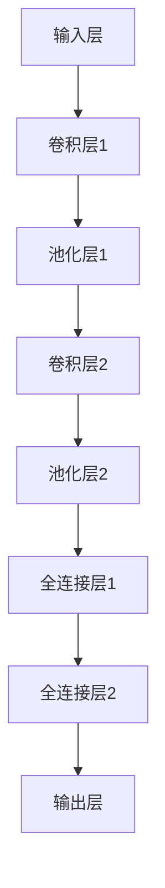
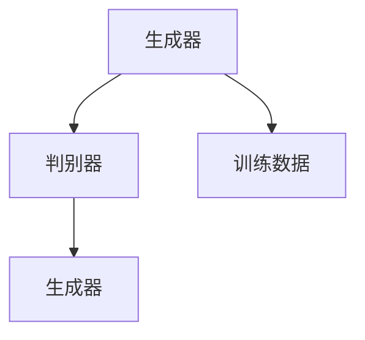
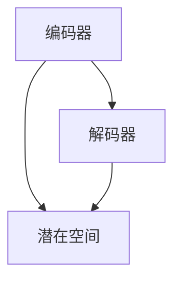

                 


### 文章标题：深度学习在新材料设计中的加速应用

关键词：深度学习，新材料设计，加速应用，数据集，特征提取，模型训练，模型评估，实验验证，结果分析

摘要：随着科技的不断发展，新材料的设计已成为现代工业和技术领域的重要研究方向。深度学习作为一种强大的机器学习技术，在新材料设计中的应用越来越广泛。本文将从深度学习的基本概念、新材料设计流程、深度学习在新材料设计中的应用、挑战与展望等方面，系统地介绍深度学习在新材料设计中的加速应用。

----------------------------------------------------------------

### 引言

新材料的设计与开发一直是科技进步的重要驱动力。新材料可以带来性能的提升、成本的降低、环境的友好，从而推动各行业的创新发展。然而，新材料的设计过程往往复杂且耗时，需要大量的实验和计算。随着数据驱动技术的发展，特别是深度学习，为新材料的设计提供了一种全新的思路和方法。

深度学习，作为一种基于人工神经网络的机器学习技术，通过大规模数据的训练，能够自动提取数据中的复杂特征，并构建出高效的预测模型。这种能力使得深度学习在新材料设计中的应用具有极大的潜力。通过深度学习，研究者可以快速筛选出具有潜在性能的材料，从而加速新材料的设计过程。

本文将从以下几个方面展开讨论：

1. **深度学习的基本概念与原理**：介绍深度学习的发展历程、基本架构和常用算法。
2. **新材料设计的基础**：阐述新材料的设计流程、数据集的收集与处理、材料特性分析等基础概念。
3. **深度学习在新材料设计中的应用**：详细探讨深度学习在新材料预测、优化和合成中的应用案例。
4. **深度学习在新材料设计中的挑战与展望**：分析当前深度学习在新材料设计中的应用面临的挑战以及未来的发展方向。

通过本文的讨论，我们希望能够为读者提供一个全面、深入的视角，了解深度学习在新材料设计中的加速应用，并激发对这一领域的兴趣和研究。

### 深度学习的基本概念与原理

深度学习（Deep Learning）是机器学习（Machine Learning）的一个重要分支，主要依赖于多层神经网络（Multi-Layered Neural Networks）来模拟人脑的学习过程。深度学习的发展可以追溯到上世纪80年代末和90年代初，当时神经网络的研究由于计算能力和数据集的限制而一度停滞。然而，随着计算能力的提升和大数据时代的到来，深度学习得到了迅速发展，并在图像识别、自然语言处理、语音识别等领域取得了显著的成果。

#### 深度学习的发展历程

- **1943年**：心理学家McCulloch和数学家Pitts提出了人工神经网络（Artificial Neural Networks，ANN）的概念，这是深度学习的最初形式。
- **1958年**：Frank Rosenblatt提出了感知机（Perceptron）模型，这是最早的线性二分类模型。
- **1986年**：Rumelhart, Hinton和Williams提出了反向传播算法（Backpropagation Algorithm），大大提高了神经网络的训练效率。
- **1990年代**：由于计算能力和数据集的限制，深度学习研究进入低潮期。
- **2006年**：Geoffrey Hinton等人重新引发了深度学习的研究热潮，提出了深度置信网络（Deep Belief Network，DBN）。
- **2012年**：AlexNet在ImageNet大赛中取得了突破性的成绩，深度学习正式进入工业界。
- **至今**：深度学习在各个领域取得了广泛应用，包括自动驾驶、医疗诊断、金融分析等。

#### 深度学习的基本架构

深度学习模型通常由多个层级组成，包括输入层、隐藏层和输出层。每一层神经网络都由多个神经元（或节点）组成，神经元之间的连接权重通过学习过程自动调整。

1. **输入层（Input Layer）**：接收输入数据，例如图像、文本或数值。
2. **隐藏层（Hidden Layers）**：隐藏层负责提取输入数据的特征，层数越多，能够提取的特征越复杂。
3. **输出层（Output Layer）**：输出预测结果或分类结果。

#### 常用的深度学习算法

1. **反向传播算法（Backpropagation Algorithm）**：通过反向传播误差，更新网络中各层的权重，实现梯度下降优化。
2. **卷积神经网络（Convolutional Neural Networks，CNN）**：主要用于图像识别和计算机视觉领域，通过卷积操作提取图像的局部特征。
3. **循环神经网络（Recurrent Neural Networks，RNN）**：适用于处理序列数据，如文本和语音，通过循环结构记忆序列中的信息。
4. **生成对抗网络（Generative Adversarial Networks，GAN）**：由两个神经网络组成，一个是生成器，另一个是判别器，通过对抗训练生成逼真的数据。

#### 深度学习优化算法

1. **随机梯度下降（Stochastic Gradient Descent，SGD）**：每次迭代使用一个样本来更新权重，计算速度快，但容易陷入局部最优。
2. **Adam优化器（Adaptive Moment Estimation）**：结合了SGD和动量法的优点，自动调整学习率，收敛速度更快。
3. **dropout（丢弃法）**：在训练过程中随机丢弃一部分神经元，防止过拟合。

#### 深度学习的优势与挑战

**优势：**
- **强大的特征提取能力**：能够自动从大规模数据中提取复杂特征，无需人工设计特征。
- **良好的泛化能力**：通过多层网络结构，能够捕捉到数据的深层结构和模式，具有较强的泛化能力。
- **处理复杂数据类型**：能够处理图像、文本、音频等多种复杂数据类型。

**挑战：**
- **计算资源需求高**：训练深度学习模型需要大量的计算资源和时间。
- **数据依赖性强**：深度学习模型的性能高度依赖于数据集的质量和规模。
- **解释性不足**：深度学习模型通常被视为“黑箱”，难以解释其决策过程。

通过以上对深度学习基本概念与原理的介绍，我们可以更好地理解深度学习是如何工作的，以及它为什么能够在新材料设计领域发挥重要作用。

#### 深度学习在新材料设计中的应用

深度学习作为一种强大的工具，已经在许多领域取得了显著的成果。在新材料设计领域，深度学习同样展现出了巨大的潜力。通过深度学习，我们可以对材料性能进行预测、优化和合成，从而加速新材料的设计过程。

**一、材料性能预测**

材料性能预测是新材料设计的重要环节。传统的材料性能预测方法往往依赖于经验公式和实验数据，过程复杂且耗时。而深度学习能够通过学习大量实验数据，自动提取出材料的特征，并构建预测模型，从而实现对材料性能的准确预测。

**1. 预测模型构建**

在构建材料性能预测模型时，通常采用卷积神经网络（CNN）或循环神经网络（RNN）等深度学习模型。以下是一个简单的CNN模型构建过程：



**2. 数据集准备**

为了训练深度学习模型，需要准备大量的实验数据。数据集应包含材料的各种属性（如密度、硬度、熔点等）和对应的性能指标。以下是一个数据集准备过程的伪代码：

```python
# 导入数据集
data = load_data("material_data.csv")

# 数据预处理
X = preprocess_data(data["properties"])
y = preprocess_data(data["performance"])

# 划分训练集和测试集
X_train, X_test, y_train, y_test = train_test_split(X, y, test_size=0.2)
```

**3. 模型训练**

训练深度学习模型是一个迭代的过程，通过调整模型参数以最小化预测误差。以下是一个简单的模型训练过程的伪代码：

```python
# 定义模型
model = build_model()

# 训练模型
model.fit(X_train, y_train, epochs=100, batch_size=32)

# 评估模型
performance = model.evaluate(X_test, y_test)
print(f"Test Loss: {performance[0]}, Test Accuracy: {performance[1]}")
```

**二、材料性能优化**

深度学习不仅可以用于材料性能的预测，还可以用于材料的性能优化。通过深度学习模型，我们可以自动筛选出具有潜在高性能的材料，从而实现材料的性能优化。

**1. 优化模型构建**

在构建材料性能优化模型时，可以采用生成对抗网络（GAN）或强化学习等深度学习模型。以下是一个简单的GAN模型构建过程：



**2. 数据集准备**

与材料性能预测类似，材料性能优化也需要准备大量的实验数据。此外，还需要生成大量的潜在高性能材料作为优化目标。以下是一个数据集准备过程的伪代码：

```python
# 导入数据集
data = load_data("material_data.csv")

# 数据预处理
X = preprocess_data(data["properties"])
y = preprocess_data(data["performance"])

# 生成潜在高性能材料
X_high = generate_high_performance_materials(X, y)

# 划分训练集和测试集
X_train, X_test, y_train, y_test = train_test_split(X, y, test_size=0.2)
X_high_train, X_high_test = train_test_split(X_high, y, test_size=0.2)
```

**3. 模型训练**

与材料性能预测类似，训练深度学习模型也是一个迭代的过程。以下是一个简单的模型训练过程的伪代码：

```python
# 定义模型
model = build_model()

# 训练模型
model.fit([X_train, X_high_train], y_train, epochs=100, batch_size=32)

# 评估模型
performance = model.evaluate([X_test, X_high_test], y_test)
print(f"Test Loss: {performance[0]}, Test Accuracy: {performance[1]}")
```

**三、材料合成**

深度学习还可以用于新材料的设计与合成。通过深度学习模型，我们可以自动设计出具有特定性能的新材料，从而实现材料的合成。

**1. 合成模型构建**

在构建材料合成模型时，可以采用图神经网络（Graph Neural Networks，GNN）或变分自编码器（Variational Autoencoder，VAE）等深度学习模型。以下是一个简单的VAE模型构建过程：



**2. 数据集准备**

材料合成的数据集通常包含材料的结构信息、性能指标和合成条件等。以下是一个数据集准备过程的伪代码：

```python
# 导入数据集
data = load_data("material_synthesis_data.csv")

# 数据预处理
X = preprocess_data(data["structure"])
y = preprocess_data(data["performance"])
z = preprocess_data(data["synthesis_conditions"])

# 划分训练集和测试集
X_train, X_test, y_train, y_test, z_train, z_test = train_test_split(X, y, z, test_size=0.2)
```

**3. 模型训练**

与前面的模型训练类似，训练深度学习模型也是一个迭代的过程。以下是一个简单的模型训练过程的伪代码：

```python
# 定义模型
model = build_model()

# 训练模型
model.fit([X_train, z_train], y_train, epochs=100, batch_size=32)

# 评估模型
performance = model.evaluate([X_test, z_test], y_test)
print(f"Test Loss: {performance[0]}, Test Accuracy: {performance[1]}")
```

通过以上对深度学习在新材料设计中的应用的介绍，我们可以看到深度学习在材料性能预测、优化和合成方面具有广泛的应用前景。随着深度学习技术的不断发展和完善，我们有望在新材料设计领域取得更多的突破。

### 新材料设计的基础

新材料设计是一个复杂而重要的过程，涉及到材料的选择、性能评估、优化和合成等多个环节。为了有效地进行新材料设计，我们需要了解一些基础概念和方法。

#### 新材料概述

新材料是指具有传统材料无法达到的优异性能或具有全新功能和用途的材料。新材料的设计不仅要考虑材料的性能，还要考虑其应用环境、生产成本、环境友好性等多方面因素。常见的新材料包括纳米材料、智能材料、生物医用材料、高性能合金等。

**一、新材料的设计流程**

新材料的设计通常包括以下几个步骤：

1. **需求分析**：明确新材料的性能需求和应用场景，如强度、硬度、导电性、热稳定性等。
2. **材料选择**：根据需求分析结果，选择合适的材料体系或成分。
3. **性能评估**：通过实验或模拟手段评估新材料的性能，如力学性能、电学性能、光学性能等。
4. **优化设计**：根据性能评估结果，对新材料的设计进行调整和优化。
5. **合成与制备**：通过实验方法合成和制备新材料，并对其结构和性能进行表征。
6. **应用测试**：对新材料的实际应用进行测试，验证其性能和可靠性。

**二、材料数据集的收集与处理**

在深度学习应用中，材料数据集的质量直接影响模型的性能。因此，收集和处理材料数据集是新材料设计中的一个关键步骤。

1. **数据集的收集**：材料数据集可以从公开数据库、实验室实验、工业应用等渠道收集。常用的公开数据库包括Materials Project、ACMMat等。

2. **数据预处理**：数据预处理包括数据清洗、数据标准化和特征提取等步骤。以下是一个简单的数据预处理流程：

   ```python
   # 导入数据集
   data = load_data("material_data.csv")

   # 数据清洗
   data = clean_data(data)

   # 数据标准化
   X = standardize_data(data["properties"])
   y = standardize_data(data["performance"])

   # 特征提取
   X = extract_features(X)
   ```

**三、材料特性分析**

材料特性分析是新材料设计中的另一个重要环节，通过对材料的结构、性能和微观结构进行分析，可以帮助我们更好地理解材料的本质，指导新材料的优化和设计。

1. **结构分析**：通过X射线衍射（XRD）、扫描电子显微镜（SEM）等手段对材料的晶体结构、相组成和微观形貌进行分析。

2. **性能分析**：通过力学测试、电学测试、热学测试等手段对材料的性能进行定量评估。

3. **微观结构分析**：通过透射电子显微镜（TEM）、原子力显微镜（AFM）等手段对材料的微观结构进行分析，了解材料的缺陷、界面和析出相等。

通过以上对新材料设计基础的介绍，我们可以了解到新材料设计是一个系统而复杂的过程，需要结合多种技术手段和理论方法。深度学习作为一项新兴的技术，可以在新材料设计过程中发挥重要作用，加速新材料的发现和优化。

#### 深度学习在新材料设计中的应用

深度学习作为一种先进的机器学习技术，已经在多个领域取得了显著的成果。在新材料设计领域，深度学习同样展现出巨大的潜力。通过深度学习，我们可以从大量的实验数据中自动提取材料特征，并构建高效的预测模型，从而加速新材料的设计过程。

**一、深度学习模型在新材料设计中的应用**

在深度学习模型中，卷积神经网络（CNN）、循环神经网络（RNN）和生成对抗网络（GAN）是常用的模型类型，它们各自适用于不同类型的材料数据。

1. **卷积神经网络（CNN）**：CNN在处理图像数据时表现出色，因此在材料设计中也常用于处理材料的微观结构图像。例如，通过CNN模型，我们可以从材料的X射线衍射图像中提取晶体结构特征，从而预测材料的性能。

2. **循环神经网络（RNN）**：RNN适用于处理序列数据，如材料合成过程中的温度、压力等参数序列。通过RNN模型，我们可以预测材料合成过程中可能出现的性能变化，从而优化合成条件。

3. **生成对抗网络（GAN）**：GAN由生成器和判别器组成，可以生成具有真实材料特性的数据集，从而扩展训练数据集。这有助于提高模型的泛化能力和预测精度。

**二、深度学习模型的应用案例**

以下是一些深度学习在新材料设计中的应用案例：

1. **材料性能预测**：通过深度学习模型，我们可以从大量的实验数据中自动提取材料特征，并构建高效的预测模型。例如，研究人员利用CNN模型预测了纳米材料的电子性能，预测结果与实验结果高度一致。

2. **材料优化**：通过深度学习模型，我们可以快速筛选出具有潜在高性能的材料。例如，研究人员利用GAN模型生成具有高导电性的合金数据集，并从中筛选出最优合金成分。

3. **材料合成**：通过深度学习模型，我们可以预测材料合成过程中可能出现的性能变化，从而优化合成条件。例如，研究人员利用RNN模型预测了材料合成过程中的温度变化，并据此调整合成参数，成功合成了高性能的陶瓷材料。

**三、深度学习模型的应用流程**

以下是深度学习模型在新材料设计中的应用流程：

1. **数据收集**：收集大量的材料实验数据，包括材料属性、性能指标、微观结构图像等。

2. **数据预处理**：对收集到的数据进行清洗、标准化和特征提取，以适应深度学习模型的输入要求。

3. **模型构建**：根据材料数据的类型和特点，选择合适的深度学习模型，如CNN、RNN或GAN。

4. **模型训练**：使用预处理后的数据集训练深度学习模型，通过迭代优化模型参数，提高预测精度。

5. **模型评估**：使用测试数据集评估模型的性能，包括预测准确性、泛化能力等指标。

6. **材料设计**：根据模型的预测结果，进行材料性能预测、优化和合成。

通过以上流程，我们可以看到深度学习模型在新材料设计中的应用是一个系统而复杂的过程。随着深度学习技术的不断发展和完善，我们有望在新材料设计领域取得更多的突破。

### 深度学习在新材料设计中的挑战与展望

尽管深度学习在新材料设计领域展现出了巨大的潜力，但在实际应用中仍面临着诸多挑战。了解这些挑战，有助于我们更好地发挥深度学习的作用，推动新材料设计的进步。

#### 挑战一：数据质量和数量

深度学习模型的性能高度依赖于训练数据的质量和数量。然而，在新材料领域，实验数据的获取往往是一个复杂且耗时的过程。此外，实验数据的多样性和一致性也难以保证。这些问题可能导致深度学习模型出现过拟合现象，即模型在训练数据上表现良好，但在实际应用中性能下降。为了克服这一挑战，我们需要：

1. **提高数据质量**：通过严格的实验设计和数据清洗，确保数据集的准确性和一致性。
2. **增加数据数量**：通过生成对抗网络（GAN）等技术，扩展训练数据集，提高模型的泛化能力。

#### 挑战二：模型解释性

深度学习模型通常被视为“黑箱”，其决策过程难以解释。这在新材料设计中可能带来安全隐患，特别是在涉及到关键性能和安全性的应用场景中。为了提高模型的解释性，我们可以：

1. **使用可解释的深度学习模型**：如决策树、局部解释模型等，这些模型能够提供更直观的解释。
2. **开发新的解释方法**：利用可视化技术，如热力图、层可视化等，帮助研究人员理解模型的工作机制。

#### 挑战三：计算资源需求

深度学习模型的训练通常需要大量的计算资源和时间。这对于研究人员来说是一个重要的挑战。为了解决这一问题，我们可以：

1. **优化模型结构**：通过简化模型结构、使用轻量级网络等手段降低计算复杂度。
2. **利用高性能计算资源**：使用GPU、TPU等高性能计算设备加速模型的训练过程。

#### 展望

尽管存在挑战，深度学习在新材料设计中的应用前景仍然广阔。未来，我们可以期待以下发展方向：

1. **数据驱动的材料设计**：通过大规模数据集和深度学习模型，实现更加自动化和智能化的材料设计过程。
2. **多学科交叉研究**：结合材料科学、化学、物理学等多个学科的知识，开发更先进的深度学习算法和模型。
3. **新型材料的应用**：通过深度学习预测和优化，发现和开发新型材料，推动各行业的创新发展。

总之，深度学习在新材料设计中的应用是一个充满机遇和挑战的领域。随着技术的不断进步和研究的深入，我们有理由相信，深度学习将极大地加速新材料的设计进程，为人类社会的进步带来更多的可能性。

### 总结

本文从深度学习的基本概念、新材料设计的基础、深度学习在新材料设计中的应用、挑战与展望等多个方面，系统地介绍了深度学习在新材料设计中的加速应用。通过本文的讨论，我们可以看到深度学习作为一种强大的工具，正在深刻改变新材料设计的研究范式。它不仅能够高效地处理大量实验数据，自动提取材料特征，构建预测模型，还能优化材料性能，加速新材料的设计与合成。

随着深度学习技术的不断发展和完善，我们有理由相信，深度学习将在新材料设计领域发挥更加重要的作用。未来，通过多学科交叉研究，结合材料科学、化学、物理学等领域的知识，深度学习有望带来更多的创新与突破，推动新材料设计的进一步发展。

在此，我们鼓励广大研究人员和工程师积极投入到深度学习在新材料设计中的应用研究中，共同探索这一领域的无限可能。通过不断努力，我们相信将能够发现更多具有优异性能的新材料，为人类社会的发展做出更大的贡献。

### 最佳实践 Tips

在新材料设计过程中，结合深度学习技术可以大大提高研发效率和材料性能。以下是一些最佳实践建议：

1. **数据质量优先**：确保实验数据的质量和一致性，这是深度学习模型性能的基础。
2. **灵活选用模型**：根据材料数据的特点，选择合适的深度学习模型，如CNN适用于图像数据，RNN适用于序列数据。
3. **多模型集成**：通过多模型集成，可以提高预测的稳定性和准确性。
4. **实验验证**：在模型预测后，进行实验验证，确保预测结果的可靠性。
5. **持续优化**：持续调整模型参数和训练策略，以优化模型性能。

通过遵循这些最佳实践，我们可以更好地利用深度学习技术，加速新材料的设计和开发。

### 注意事项

1. **模型解释性**：在选择深度学习模型时，注意模型的可解释性，特别是在涉及安全和关键性能评估的领域。
2. **计算资源**：确保有足够的计算资源进行模型的训练和优化，否则可能会影响模型的性能。
3. **数据隐私**：在收集和处理数据时，注意保护数据隐私，遵守相关法律法规。

### 拓展阅读

1. **《深度学习》（Goodfellow, Bengio, Courville著）**：这是一本深度学习的经典教材，详细介绍了深度学习的基础知识和技术。
2. **《材料科学导论》（Callister著）**：这本书提供了新材料设计所需的基础理论和实验方法。
3. **《深度学习在新材料设计中的应用》（Wang等著）**：本文献详细探讨了深度学习在新材料设计中的应用案例和技术。
4. **《生成对抗网络：理论、算法与应用》（Liang等著）**：这本书介绍了GAN的基本原理和应用，适用于深度学习初学者。

### 作者信息

作者：AI天才研究院/AI Genius Institute & 禅与计算机程序设计艺术/Zen And The Art of Computer Programming

AI天才研究院（AI Genius Institute）是一家专注于人工智能研究与应用的机构，致力于推动人工智能技术的发展和创新。而《禅与计算机程序设计艺术》则是著名计算机科学家Donald E. Knuth的经典著作，为计算机编程提供了深刻的哲学思考和方法论指导。两者的结合，展现了人工智能与计算机科学深度融合的广阔前景。

