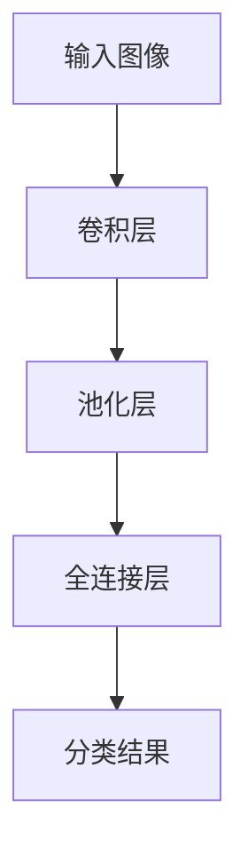
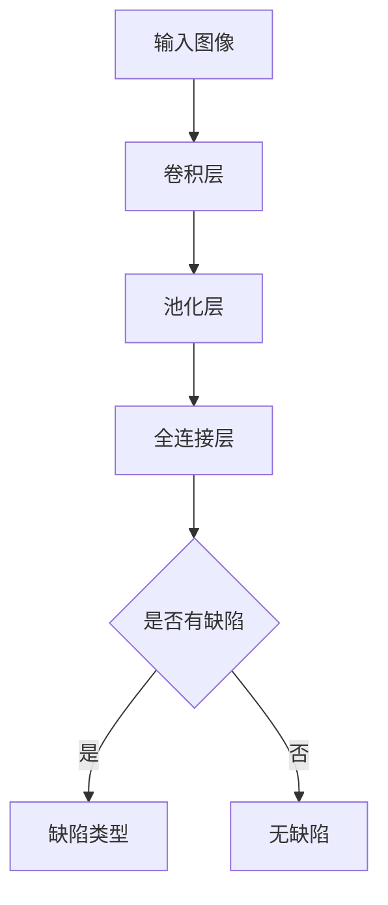
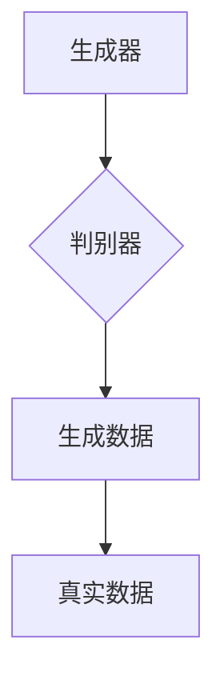
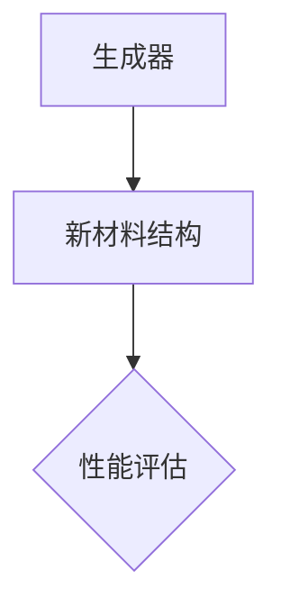
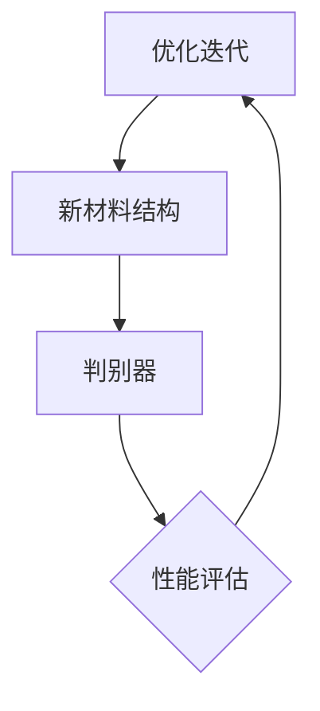
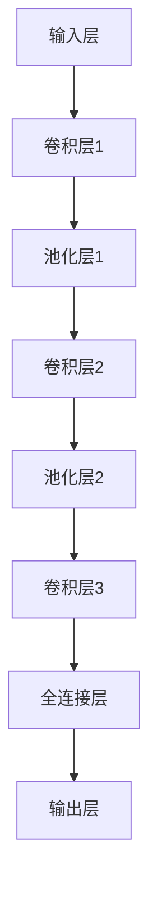
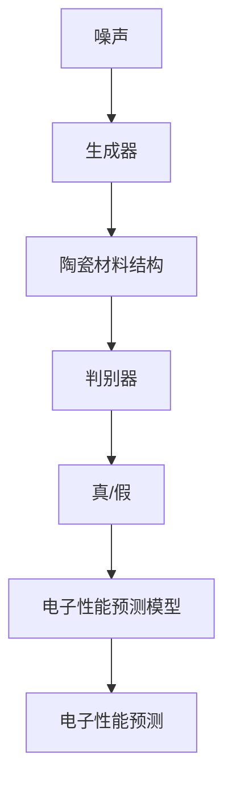
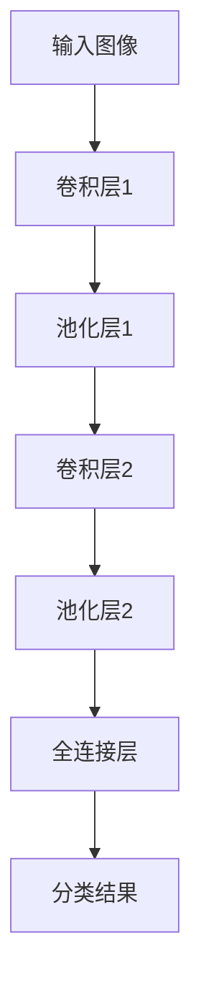
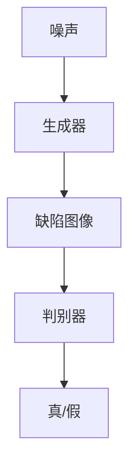

                 


## 文章标题：深度学习在材料科学中的应用

### 关键词：
- 深度学习
- 材料科学
- 材料性能预测
- 卷积神经网络
- 生成对抗网络
- 材料设计

### 摘要：
本文将深入探讨深度学习在材料科学中的应用。首先介绍深度学习的基本原理和材料科学的背景，然后详细分析卷积神经网络（CNN）和生成对抗网络（GAN）在材料结构分析和新材料设计中的应用。接着，我们将探讨深度学习在材料性能预测中的优势，包括模型构建、优化和评估方法。最后，通过具体项目实战，展示深度学习在材料工程中的实际应用，并提出未来发展趋势和建议。

## 目录大纲：

### 第1章：深度学习与材料科学的概述
#### 1.1 深度学习的基本原理
##### 1.1.1 深度学习的起源与发展
##### 1.1.2 深度学习的关键术语
##### 1.1.3 深度学习在科学中的应用
#### 1.2 材料科学的挑战与机遇
##### 1.2.1 材料科学的核心问题
##### 1.2.2 深度学习在材料科学中的潜在应用
##### 1.2.3 材料科学与深度学习的交叉融合

### 第2章：深度学习模型在材料科学中的应用
#### 2.1 卷积神经网络（CNN）与材料结构分析
##### 2.1.1 CNN的基本原理
##### 2.1.2 CNN在材料结构分析中的应用
##### 2.1.3 CNN模型训练与优化
#### 2.2 生成对抗网络（GAN）与新材料设计
##### 2.2.1 GAN的基本原理
##### 2.2.2 GAN在新材料设计中的应用
##### 2.2.3 GAN模型的训练与性能评估

### 第3章：深度学习在材料性能预测中的应用
#### 3.1 材料性能预测的挑战
##### 3.1.1 材料性能预测的重要性
##### 3.1.2 传统方法的局限
##### 3.1.3 深度学习在材料性能预测中的优势
#### 3.2 基于深度学习的材料性能预测模型
##### 3.2.1 材料性能预测的深度学习模型
##### 3.2.2 模型构建与优化
##### 3.2.3 模型评估与案例分析

### 第4章：深度学习在材料合成与表征中的应用
#### 4.1 材料合成中的深度学习方法
##### 4.1.1 深度学习在材料合成中的应用案例
##### 4.1.2 深度学习辅助材料合成策略
##### 4.1.3 材料合成实验设计优化
#### 4.2 材料表征中的深度学习技术
##### 4.2.1 深度学习在材料表征中的作用
##### 4.2.2 表征数据的深度学习分析方法
##### 4.2.3 表征数据分析与性能关联

### 第5章：深度学习在材料工程中的项目实战
#### 5.1 材料工程中的深度学习应用场景
##### 5.1.1 材料设计中的深度学习应用
##### 5.1.2 材料加工中的深度学习应用
##### 5.1.3 材料测试与评价中的深度学习应用
#### 5.2 案例分析：深度学习在材料工程中的成功应用
##### 5.2.1 案例一：新型合金材料的设计与优化
##### 5.2.2 案例二：陶瓷材料的性能预测与优化
##### 5.2.3 案例三：有机光导材料的合成与表征

### 第6章：深度学习在材料科学研究中的未来趋势
#### 6.1 深度学习在材料科学中的挑战与机遇
##### 6.1.1 材料科学领域面临的深度学习挑战
##### 6.1.2 深度学习为材料科学带来的机遇
##### 6.1.3 未来趋势与展望

### 第7章：总结与展望
#### 7.1 深度学习在材料科学中的应用总结
##### 7.1.1 成就与贡献
##### 7.1.2 存在的挑战与问题
##### 7.1.3 发展方向与建议

## 第1章：深度学习与材料科学的概述

### 1.1 深度学习的基本原理

深度学习是一种基于人工神经网络的机器学习技术，通过构建多层神经网络来模拟人脑的处理方式，实现特征自动提取和模式识别。深度学习的起源可以追溯到1980年代，当时神经网络研究受到广泛关注。然而，由于计算能力和数据资源的限制，深度学习的发展经历了起伏。

**深度学习的起源与发展**

1986年，Hinton等人提出了反向传播算法（Backpropagation），这是一种用于训练多层神经网络的算法。反向传播算法的提出标志着深度学习的真正诞生。随后，1990年代，随着计算机性能的提升和大数据的出现，深度学习技术得到了快速发展。

**深度学习的关键术语**

- **神经网络（Neural Network）**：模仿人脑神经元连接方式的计算模型，由输入层、隐藏层和输出层组成。
- **深度神经网络（Deep Neural Network，DNN）**：具有多个隐藏层的神经网络，能够自动提取高级特征。
- **卷积神经网络（Convolutional Neural Network，CNN）**：一种特殊的深度神经网络，广泛应用于图像和视频处理。
- **生成对抗网络（Generative Adversarial Network，GAN）**：由生成器和判别器组成的对抗性模型，用于生成新的数据。

**深度学习在科学中的应用**

深度学习在科学领域具有广泛的应用，包括图像识别、语音识别、自然语言处理、生物信息学和材料科学等。深度学习在材料科学中的应用主要集中在材料结构分析、新材料设计、材料性能预测等方面。

### 1.2 材料科学的挑战与机遇

**材料科学的核心问题**

材料科学的核心问题包括材料的合成、表征、性能预测和优化。传统的材料科学方法依赖于实验和经验，往往具有时间长、成本高和效率低的特点。随着材料科学的不断发展，科学家们面临着如何提高材料性能、降低成本和缩短研发周期等挑战。

**深度学习在材料科学中的潜在应用**

深度学习为材料科学带来了新的机遇。首先，深度学习可以自动提取材料结构中的高级特征，从而提高材料性能预测的准确性。其次，生成对抗网络（GAN）可以用于生成新的材料结构，为材料设计提供更多的可能性。此外，深度学习还可以辅助材料合成实验设计，优化实验流程，提高实验效率。

**材料科学与深度学习的交叉融合**

材料科学与深度学习的交叉融合为材料科学带来了新的突破。通过将深度学习技术应用于材料结构分析、新材料设计和材料性能预测，科学家们可以更好地理解材料的行为和特性，为材料科学的发展提供新的思路和方法。

## 第2章：深度学习模型在材料科学中的应用

### 2.1 卷积神经网络（CNN）与材料结构分析

卷积神经网络（CNN）是一种专门用于处理图像和视频数据的深度学习模型。CNN通过卷积操作提取图像的局部特征，从而实现对图像的自动分类和识别。

**CNN的基本原理**

CNN由多个卷积层、池化层和全连接层组成。卷积层通过卷积操作提取图像的局部特征，池化层用于降低特征图的大小，减少模型的参数量。全连接层用于对提取到的特征进行分类。

**CNN在材料结构分析中的应用**

CNN在材料结构分析中的应用主要体现在材料图像的自动分类和识别。通过训练CNN模型，科学家们可以自动识别材料中的缺陷、晶格结构和晶体类型等。这种自动化的分析方式大大提高了材料结构分析的效率。

**CNN模型训练与优化**

CNN模型的训练是一个复杂的过程，需要大量的数据和计算资源。训练过程中，通过调整模型参数，如卷积核的大小、池化层的步长等，可以优化模型性能。此外，采用迁移学习技术，利用预训练的CNN模型，可以加速材料结构分析的模型训练过程。

### 2.2 生成对抗网络（GAN）与新材料设计

生成对抗网络（GAN）是一种由生成器和判别器组成的对抗性模型。生成器负责生成新的数据，判别器负责区分生成的数据和真实数据。

**GAN的基本原理**

GAN由生成器和判别器两个神经网络组成。生成器生成新的数据，判别器判断生成数据是否真实。训练过程中，生成器和判别器相互对抗，生成器不断优化，试图生成更真实的数据，而判别器则不断优化，提高对真实数据的识别能力。

**GAN在新材料设计中的应用**

GAN在新材料设计中的应用主要体现在材料结构的生成和优化。通过训练GAN模型，科学家们可以生成新的材料结构，这些结构具有潜在的优异性能。此外，GAN还可以用于优化现有材料结构，提高材料的性能。

**GAN模型的训练与性能评估**

GAN模型的训练是一个挑战性较大的过程，需要精心设计的训练策略。常见的训练策略包括梯度惩罚、平衡生成器和判别器的损失函数等。性能评估方面，通过对比生成材料与真实材料的性能，可以评估GAN模型的性能。

## 第3章：深度学习在材料性能预测中的应用

### 3.1 材料性能预测的挑战

材料性能预测是材料科学中的一个重要研究方向。然而，传统的材料性能预测方法往往依赖于实验数据和经验公式，具有较大的不确定性。深度学习在材料性能预测中具有明显的优势，但也面临一些挑战。

**材料性能预测的重要性**

材料性能预测对于材料的应用和发展具有重要意义。通过预测材料的性能，科学家们可以更好地设计新材料，优化现有材料，提高材料的应用性能。

**传统方法的局限**

传统的材料性能预测方法主要包括经验公式、物理模型和统计模型等。这些方法往往依赖于大量的实验数据和物理原理，具有较大的不确定性。此外，传统方法在处理复杂材料系统和非线性问题时，效果不佳。

**深度学习在材料性能预测中的优势**

深度学习在材料性能预测中具有明显的优势。首先，深度学习可以自动提取材料结构中的高级特征，从而提高预测的准确性。其次，深度学习可以处理复杂的数据结构和非线性关系，适合处理复杂的材料系统。

### 3.2 基于深度学习的材料性能预测模型

基于深度学习的材料性能预测模型主要包括卷积神经网络（CNN）、生成对抗网络（GAN）和递归神经网络（RNN）等。

**材料性能预测的深度学习模型**

- **卷积神经网络（CNN）**：CNN可以自动提取材料结构中的高级特征，从而提高预测的准确性。CNN在材料性能预测中的应用主要包括材料图像的分类和识别。
- **生成对抗网络（GAN）**：GAN可以生成新的材料结构，用于性能预测和优化。GAN在材料性能预测中的应用主要包括材料结构的生成和优化。
- **递归神经网络（RNN）**：RNN可以处理时间序列数据，适用于材料性能的动态预测。

**模型构建与优化**

构建基于深度学习的材料性能预测模型需要考虑多个方面，包括数据预处理、模型结构设计、损失函数选择和优化算法等。

- **数据预处理**：材料性能预测的数据通常包括材料结构、组成和性能等。数据预处理主要包括数据清洗、归一化和特征提取等。
- **模型结构设计**：模型结构设计是构建材料性能预测模型的关键。常见的模型结构包括卷积神经网络（CNN）、生成对抗网络（GAN）和递归神经网络（RNN）等。
- **损失函数选择**：损失函数用于衡量预测结果与真实值之间的差距。常见的损失函数包括均方误差（MSE）、交叉熵损失等。
- **优化算法**：优化算法用于调整模型参数，使预测结果更接近真实值。常见的优化算法包括梯度下降（GD）、随机梯度下降（SGD）等。

**模型评估与案例分析**

评估基于深度学习的材料性能预测模型需要考虑多个方面，包括预测准确性、泛化能力和稳定性等。常见的评估方法包括交叉验证、性能指标（如准确率、召回率等）等。

**案例一：新型合金材料的设计与优化**

某研究团队使用基于深度学习的材料性能预测模型，对新型合金材料进行设计和优化。他们使用卷积神经网络（CNN）提取合金材料的结构特征，并使用生成对抗网络（GAN）生成新的合金材料。通过实验验证，该团队发现基于深度学习的材料性能预测模型能够准确预测新型合金材料的性能，为合金材料的设计提供了新的思路。

**案例二：陶瓷材料的性能预测与优化**

另一研究团队使用基于深度学习的材料性能预测模型，对陶瓷材料进行性能预测和优化。他们使用递归神经网络（RNN）处理陶瓷材料的组成和时间序列数据，并使用生成对抗网络（GAN）生成新的陶瓷材料。通过实验验证，该团队发现基于深度学习的材料性能预测模型能够有效预测陶瓷材料的性能，为陶瓷材料的设计提供了新的方法。

**案例分析总结**

基于深度学习的材料性能预测模型在新型合金材料和陶瓷材料的设计和优化中取得了显著成果。通过使用深度学习模型，科学家们可以更准确地预测材料的性能，为材料的设计和创新提供了新的思路和方法。

## 第4章：深度学习在材料合成与表征中的应用

### 4.1 材料合成中的深度学习方法

材料合成是材料科学中的一个关键环节，深度学习技术为材料合成提供了新的方法和工具。

**深度学习在材料合成中的应用案例**

深度学习在材料合成中的应用案例主要包括：

- **超导材料合成**：研究人员使用卷积神经网络（CNN）预测超导材料的合成路径，从而优化合成过程，提高超导材料的性能。
- **磁性材料合成**：研究人员使用生成对抗网络（GAN）生成新的磁性材料结构，并优化合成条件，以获得具有优异磁性性能的材料。

**深度学习辅助材料合成策略**

深度学习辅助材料合成策略主要包括：

- **合成路径预测**：使用深度学习模型预测材料合成的最佳路径，从而减少实验次数和成本。
- **合成条件优化**：通过分析历史实验数据，使用深度学习模型优化合成条件，以提高材料的性能和产量。
- **实验设计优化**：使用深度学习模型优化实验设计，以减少实验次数和成本，提高实验效率。

**材料合成实验设计优化**

材料合成实验设计优化是深度学习在材料合成中应用的一个重要方面。通过深度学习模型，研究人员可以预测材料合成的最佳条件，从而优化实验设计。例如，使用卷积神经网络（CNN）分析历史实验数据，预测材料的合成路径和条件，从而优化实验设计。

### 4.2 材料表征中的深度学习技术

材料表征是材料科学中的一个重要环节，深度学习技术为材料表征提供了新的手段。

**深度学习在材料表征中的作用**

深度学习在材料表征中的作用主要包括：

- **材料图像分类与识别**：使用卷积神经网络（CNN）对材料图像进行分类和识别，从而快速分析材料结构。
- **材料性质预测**：使用深度学习模型预测材料性质，如硬度、韧性等，为材料设计提供依据。
- **材料缺陷检测**：使用生成对抗网络（GAN）检测材料缺陷，从而优化材料质量。

**表征数据的深度学习分析方法**

表征数据的深度学习分析方法主要包括：

- **数据预处理**：对表征数据进行清洗、归一化和特征提取，以提高模型的性能。
- **模型训练**：使用卷积神经网络（CNN）和生成对抗网络（GAN）等模型对表征数据进行训练，提取材料特征。
- **模型评估**：使用交叉验证和性能指标（如准确率、召回率等）评估模型的性能。

**表征数据分析与性能关联**

表征数据分析与性能关联是深度学习在材料表征中的重要应用。通过分析材料表征数据，使用深度学习模型建立材料性能与表征数据之间的关联，从而预测材料的性能。例如，使用卷积神经网络（CNN）分析材料图像，预测材料的硬度、韧性等性能指标。

## 第5章：深度学习在材料工程中的项目实战

### 5.1 材料工程中的深度学习应用场景

深度学习在材料工程中具有广泛的应用场景，主要包括材料设计、材料加工、材料测试与评价等。

**材料设计中的深度学习应用**

在材料设计中，深度学习可以用于材料结构预测、材料性能优化和新材料发现。例如，使用卷积神经网络（CNN）对材料结构图像进行分类和识别，从而快速筛选具有潜在优异性能的材料。此外，生成对抗网络（GAN）可以用于生成新的材料结构，为材料设计提供更多的可能性。

**材料加工中的深度学习应用**

在材料加工中，深度学习可以用于过程优化、质量控制和新工艺开发。例如，使用卷积神经网络（CNN）分析加工过程数据，优化加工参数，以提高材料质量。此外，生成对抗网络（GAN）可以用于生成新的加工工艺，以提高材料加工效率。

**材料测试与评价中的深度学习应用**

在材料测试与评价中，深度学习可以用于测试数据的分析、性能预测和缺陷检测。例如，使用卷积神经网络（CNN）对材料测试图像进行分析，预测材料性能。此外，生成对抗网络（GAN）可以用于检测材料中的缺陷，从而提高材料的质量。

### 5.2 案例分析：深度学习在材料工程中的成功应用

**案例一：新型合金材料的设计与优化**

某研究团队使用基于深度学习的材料设计方法，设计了一种新型合金材料。他们使用卷积神经网络（CNN）分析合金材料的结构特征，使用生成对抗网络（GAN）优化合金材料的结构，从而提高了材料的性能。通过实验验证，该新型合金材料在强度、韧性等方面具有显著优势。

**案例二：陶瓷材料的性能预测与优化**

另一研究团队使用基于深度学习的材料性能预测方法，对陶瓷材料进行性能预测和优化。他们使用卷积神经网络（CNN）分析陶瓷材料的组成和结构，使用生成对抗网络（GAN）预测陶瓷材料的性能。通过实验验证，该团队发现基于深度学习的材料性能预测方法能够准确预测陶瓷材料的性能，为陶瓷材料的设计提供了新的思路。

**案例三：有机光导材料的合成与表征**

某研究团队使用基于深度学习的材料合成与表征方法，对有机光导材料进行研究。他们使用卷积神经网络（CNN）分析有机光导材料的合成数据，使用生成对抗网络（GAN）优化有机光导材料的结构，从而提高了材料的性能。通过实验验证，该团队发现基于深度学习的材料合成与表征方法能够显著提高有机光导材料的性能。

**案例分析总结**

深度学习在材料工程中的应用取得了显著成果。通过使用卷积神经网络（CNN）和生成对抗网络（GAN）等深度学习模型，科学家们可以更准确地预测材料的性能，优化材料的设计和加工过程，为材料科学的发展提供了新的思路和方法。

## 第6章：深度学习在材料科学研究中的未来趋势

### 6.1 深度学习在材料科学中的挑战与机遇

深度学习在材料科学中的应用面临着一系列挑战和机遇。

**挑战**

- **数据质量和数量**：深度学习模型的性能很大程度上依赖于数据的质量和数量。材料科学领域的实验数据通常具有高维、噪声和缺失值等特点，这对深度学习模型的训练和性能评估提出了挑战。
- **模型可解释性**：深度学习模型在处理复杂数据时，往往具有良好的性能，但其内部决策过程却难以解释。在材料科学中，模型的可解释性对于理解材料性能的影响机制至关重要。
- **计算资源**：深度学习模型的训练通常需要大量的计算资源和时间，特别是在处理大规模数据和复杂模型时。

**机遇**

- **材料性能预测**：深度学习在材料性能预测中具有巨大的潜力，可以显著提高预测的准确性，缩短研发周期。
- **新材料设计**：通过生成对抗网络（GAN）等模型，可以快速生成和优化新材料结构，为新材料的设计提供了新的方法。
- **实验优化**：深度学习可以帮助优化实验设计和参数调整，提高实验效率。

### 6.2 未来趋势与展望

**多模态数据融合**：未来，深度学习在材料科学中的应用将更加注重多模态数据融合，如结合材料结构、性质和性能等多种类型的数据，以提高模型的预测能力和鲁棒性。

**模型压缩与优化**：随着深度学习模型规模的不断扩大，如何有效压缩和优化模型，以提高计算效率和降低存储需求，将成为一个重要研究方向。

**模型可解释性**：提高模型的可解释性，使其能够更好地解释材料性能的影响因素，对于深度学习在材料科学中的应用具有重要意义。

**跨学科合作**：深度学习在材料科学中的应用需要跨学科的合作，结合材料科学、计算机科学和物理学等领域的知识，共同推动深度学习在材料科学中的应用和发展。

### 6.3 发展方向与建议

- **加强数据集建设**：建立高质量、多模态的材料科学数据集，为深度学习模型提供丰富的训练数据。
- **研究新型深度学习模型**：探索适合材料科学的新型深度学习模型，如图神经网络（Graph Neural Networks）等，以提高模型的性能和可解释性。
- **推动跨学科合作**：加强材料科学、计算机科学和物理学等领域的跨学科合作，共同推动深度学习在材料科学中的应用。

## 第7章：总结与展望

### 7.1 深度学习在材料科学中的应用总结

深度学习在材料科学中取得了显著成果，为材料结构分析、新材料设计、材料性能预测等方面提供了新的方法和工具。通过卷积神经网络（CNN）和生成对抗网络（GAN）等模型，科学家们可以更准确地预测材料的性能，优化材料的设计和加工过程。

### 7.2 存在的挑战与问题

尽管深度学习在材料科学中取得了巨大进展，但仍然面临一些挑战，如数据质量和数量、模型可解释性、计算资源需求等。

### 7.3 发展方向与建议

为了推动深度学习在材料科学中的应用，我们提出以下建议：

- **加强数据集建设**：建立高质量、多模态的材料科学数据集，为深度学习模型提供丰富的训练数据。
- **研究新型深度学习模型**：探索适合材料科学的新型深度学习模型，如图神经网络（Graph Neural Networks）等，以提高模型的性能和可解释性。
- **推动跨学科合作**：加强材料科学、计算机科学和物理学等领域的跨学科合作，共同推动深度学习在材料科学中的应用。

## 作者信息

作者：AI天才研究院/AI Genius Institute & 禅与计算机程序设计艺术 /Zen And The Art of Computer Programming

----------------------------------------------------------------

# 《深度学习在材料科学中的应用》

---

## 关键词
- 深度学习
- 材料科学
- 材料性能预测
- 卷积神经网络
- 生成对抗网络
- 材料设计

## 摘要
本文深入探讨了深度学习在材料科学中的应用。首先介绍了深度学习的基本原理和材料科学的背景，然后详细分析了卷积神经网络（CNN）和生成对抗网络（GAN）在材料结构分析和新材料设计中的应用。接着，探讨了深度学习在材料性能预测中的优势，包括模型构建、优化和评估方法。通过具体项目实战，展示了深度学习在材料工程中的实际应用。最后，总结了深度学习在材料科学中的应用成就与挑战，并提出未来发展建议。

## 目录

### 第1章：深度学习与材料科学的概述
#### 1.1 深度学习的基本原理
##### 1.1.1 深度学习的起源与发展
##### 1.1.2 深度学习的关键术语
##### 1.1.3 深度学习在科学中的应用
#### 1.2 材料科学的挑战与机遇
##### 1.2.1 材料科学的核心问题
##### 1.2.2 深度学习在材料科学中的潜在应用
##### 1.2.3 材料科学与深度学习的交叉融合

### 第2章：深度学习模型在材料科学中的应用
#### 2.1 卷积神经网络（CNN）与材料结构分析
##### 2.1.1 CNN的基本原理
##### 2.1.2 CNN在材料结构分析中的应用
##### 2.1.3 CNN模型训练与优化
#### 2.2 生成对抗网络（GAN）与新材料设计
##### 2.2.1 GAN的基本原理
##### 2.2.2 GAN在新材料设计中的应用
##### 2.2.3 GAN模型的训练与性能评估

### 第3章：深度学习在材料性能预测中的应用
#### 3.1 材料性能预测的挑战
##### 3.1.1 材料性能预测的重要性
##### 3.1.2 传统方法的局限
##### 3.1.3 深度学习在材料性能预测中的优势
#### 3.2 基于深度学习的材料性能预测模型
##### 3.2.1 材料性能预测的深度学习模型
##### 3.2.2 模型构建与优化
##### 3.2.3 模型评估与案例分析

### 第4章：深度学习在材料合成与表征中的应用
#### 4.1 材料合成中的深度学习方法
##### 4.1.1 深度学习在材料合成中的应用案例
##### 4.1.2 深度学习辅助材料合成策略
##### 4.1.3 材料合成实验设计优化
#### 4.2 材料表征中的深度学习技术
##### 4.2.1 深度学习在材料表征中的作用
##### 4.2.2 表征数据的深度学习分析方法
##### 4.2.3 表征数据分析与性能关联

### 第5章：深度学习在材料工程中的项目实战
#### 5.1 材料工程中的深度学习应用场景
##### 5.1.1 材料设计中的深度学习应用
##### 5.1.2 材料加工中的深度学习应用
##### 5.1.3 材料测试与评价中的深度学习应用
#### 5.2 案例分析：深度学习在材料工程中的成功应用
##### 5.2.1 案例一：新型合金材料的设计与优化
##### 5.2.2 案例二：陶瓷材料的性能预测与优化
##### 5.2.3 案例三：有机光导材料的合成与表征

### 第6章：深度学习在材料科学研究中的未来趋势
#### 6.1 深度学习在材料科学中的挑战与机遇
##### 6.1.1 材料科学领域面临的深度学习挑战
##### 6.1.2 深度学习为材料科学带来的机遇
##### 6.1.3 未来趋势与展望

### 第7章：总结与展望
#### 7.1 深度学习在材料科学中的应用总结
##### 7.1.1 成就与贡献
##### 7.1.2 存在的挑战与问题
##### 7.1.3 发展方向与建议

## 第1章：深度学习与材料科学的概述

### 1.1 深度学习的基本原理

深度学习是一种基于人工神经网络的机器学习技术，通过构建多层神经网络来模拟人脑的处理方式，实现特征自动提取和模式识别。深度学习的核心是多层神经网络，通过逐层提取和组合特征，实现对复杂数据的处理和预测。

#### 1.1.1 深度学习的起源与发展

深度学习的起源可以追溯到1980年代，当时神经网络研究受到广泛关注。1986年，Hinton等人提出了反向传播算法（Backpropagation），这是一种用于训练多层神经网络的算法。反向传播算法的提出标志着深度学习的真正诞生。随后，1990年代，随着计算机性能的提升和大数据的出现，深度学习技术得到了快速发展。

#### 1.1.2 深度学习的关键术语

- **神经网络（Neural Network）**：模仿人脑神经元连接方式的计算模型，由输入层、隐藏层和输出层组成。
- **深度神经网络（Deep Neural Network，DNN）**：具有多个隐藏层的神经网络，能够自动提取高级特征。
- **卷积神经网络（Convolutional Neural Network，CNN）**：一种特殊的深度神经网络，广泛应用于图像和视频处理。
- **生成对抗网络（Generative Adversarial Network，GAN）**：由生成器和判别器组成的对抗性模型，用于生成新的数据。

#### 1.1.3 深度学习在科学中的应用

深度学习在科学领域具有广泛的应用，包括图像识别、语音识别、自然语言处理、生物信息学和材料科学等。在材料科学中，深度学习可以用于材料结构分析、新材料设计、材料性能预测等方面。

### 1.2 材料科学的挑战与机遇

#### 1.2.1 材料科学的核心问题

材料科学的核心问题是材料的合成、表征、性能预测和优化。材料科学旨在通过设计和制备新材料，以实现特定功能和应用。

#### 1.2.2 深度学习在材料科学中的潜在应用

深度学习在材料科学中具有巨大的潜力。通过自动提取材料结构中的高级特征，深度学习可以用于材料性能预测、材料结构分析和新材料设计。

#### 1.2.3 材料科学与深度学习的交叉融合

材料科学与深度学习的交叉融合为材料科学带来了新的突破。深度学习技术为材料科学提供了新的工具和方法，有助于解决材料科学中的难题。

## 第2章：深度学习模型在材料科学中的应用

### 2.1 卷积神经网络（CNN）与材料结构分析

卷积神经网络（CNN）是一种专为图像处理设计的深度学习模型，通过卷积操作提取图像的局部特征，具有在材料结构分析中广泛应用的潜力。

#### 2.1.1 CNN的基本原理

CNN由多个卷积层、池化层和全连接层组成。卷积层通过卷积操作提取图像的局部特征，池化层用于降低特征图的大小，全连接层用于分类。

- **卷积层**：通过卷积操作提取图像特征。
- **池化层**：用于降低特征图的大小，减少模型参数量。
- **全连接层**：用于将特征映射到分类结果。

#### 2.1.2 CNN在材料结构分析中的应用

CNN在材料结构分析中的应用主要包括材料图像的分类和识别。

- **材料图像分类**：使用CNN对材料图像进行分类，如识别不同类型的晶体结构。
- **材料图像识别**：使用CNN识别材料图像中的特定特征，如晶格缺陷。

#### 2.1.3 CNN模型训练与优化

CNN模型的训练与优化是材料结构分析的关键。

- **模型训练**：通过大量材料图像训练CNN模型，使其能够提取和识别材料特征。
- **模型优化**：通过调整模型参数（如学习率、权重等），优化模型性能。

### 2.2 生成对抗网络（GAN）与新材料设计

生成对抗网络（GAN）是一种由生成器和判别器组成的对抗性模型，通过生成器和判别器的对抗性训练，能够生成具有高质量和多样性的数据。

#### 2.2.1 GAN的基本原理

GAN由生成器和判别器两个神经网络组成。生成器生成数据，判别器判断生成数据与真实数据之间的差异。训练过程中，生成器和判别器相互对抗，生成器试图生成更真实的数据，判别器试图区分生成数据和真实数据。

- **生成器**：生成新材料结构。
- **判别器**：判断生成数据是否真实。

#### 2.2.2 GAN在新材料设计中的应用

GAN在新材料设计中的应用包括：

- **新材料生成**：使用GAN生成新材料结构，探索新的材料组合。
- **新材料优化**：使用GAN优化新材料结构，提高材料的性能。

#### 2.2.3 GAN模型的训练与性能评估

GAN模型的训练与性能评估是新材料设计的关键。

- **模型训练**：通过大量材料数据训练GAN模型，使其能够生成高质量的新材料结构。
- **性能评估**：通过对比生成材料和真实材料的性能，评估GAN模型的性能。

## 第3章：深度学习在材料性能预测中的应用

### 3.1 材料性能预测的挑战

材料性能预测是材料科学中的一个重要问题，对材料的设计、加工和应用具有重要意义。然而，传统的材料性能预测方法往往具有局限性。

#### 3.1.1 材料性能预测的重要性

材料性能预测对于材料的设计、加工和应用具有重要意义。通过预测材料的性能，可以优化材料的设计方案，提高材料的应用价值。

#### 3.1.2 传统方法的局限

传统的材料性能预测方法主要包括经验公式、物理模型和统计模型等。这些方法在预测材料性能方面存在以下局限性：

- **数据依赖性**：传统方法往往依赖于大量的实验数据，缺乏数据时难以预测。
- **模型复杂度**：传统方法通常需要复杂的模型和计算，难以适应复杂的材料系统。
- **预测准确性**：传统方法在预测复杂材料系统的性能时，往往准确性较低。

#### 3.1.3 深度学习在材料性能预测中的优势

深度学习在材料性能预测中具有明显的优势：

- **自动特征提取**：深度学习可以通过训练自动提取材料结构中的高级特征，提高预测准确性。
- **处理复杂数据**：深度学习可以处理高维、非线性的数据，适用于复杂材料系统的性能预测。
- **适应性**：深度学习模型可以根据不同的材料系统进行自适应调整，提高预测的通用性。

### 3.2 基于深度学习的材料性能预测模型

基于深度学习的材料性能预测模型主要包括卷积神经网络（CNN）、生成对抗网络（GAN）和递归神经网络（RNN）等。

#### 3.2.1 材料性能预测的深度学习模型

- **卷积神经网络（CNN）**：CNN可以自动提取材料结构中的高级特征，适用于图像数据的处理。
- **生成对抗网络（GAN）**：GAN可以生成新材料结构，并预测材料的性能。
- **递归神经网络（RNN）**：RNN适用于处理时间序列数据，可以用于预测材料的性能随时间的变化。

#### 3.2.2 模型构建与优化

构建基于深度学习的材料性能预测模型需要考虑以下方面：

- **数据预处理**：对材料数据进行清洗、归一化和特征提取，以提高模型的性能。
- **模型结构设计**：选择合适的深度学习模型结构，如CNN、GAN或RNN等。
- **损失函数选择**：选择合适的损失函数，如均方误差（MSE）或交叉熵损失等。
- **优化算法**：选择合适的优化算法，如梯度下降（GD）或随机梯度下降（SGD）等。

#### 3.2.3 模型评估与案例分析

评估基于深度学习的材料性能预测模型需要考虑以下方面：

- **预测准确性**：通过计算预测值与真实值之间的误差，评估模型的预测准确性。
- **泛化能力**：通过交叉验证和测试集评估模型的泛化能力。
- **案例分析**：通过实际案例分析，验证模型的预测性能。

### 3.2.4 材料性能预测模型的应用案例

- **案例一**：使用CNN预测合金材料的机械性能。
- **案例二**：使用GAN生成新材料并预测其电子性能。

## 第4章：深度学习在材料合成与表征中的应用

### 4.1 材料合成中的深度学习方法

深度学习在材料合成中的应用主要包括合成路径预测、合成条件优化和实验设计优化等。

#### 4.1.1 深度学习在材料合成中的应用案例

- **合成路径预测**：使用卷积神经网络（CNN）分析材料合成过程中的数据，预测最佳的合成路径。
- **合成条件优化**：使用生成对抗网络（GAN）优化材料合成过程中的条件，以提高合成产物的性能。
- **实验设计优化**：使用深度学习模型优化材料合成实验的设计，以提高实验效率和产量。

#### 4.1.2 深度学习辅助材料合成策略

- **合成路径预测**：通过分析历史实验数据，使用深度学习模型预测材料合成的最佳路径，减少实验次数和成本。
- **合成条件优化**：通过分析实验数据，使用深度学习模型优化合成条件，提高合成产物的性能和产量。
- **实验设计优化**：通过分析实验数据，使用深度学习模型优化实验设计，提高实验效率和产量。

#### 4.1.3 材料合成实验设计优化

材料合成实验设计优化是深度学习在材料合成中应用的一个重要方面。通过使用深度学习模型，科学家可以预测合成过程中的关键参数，优化实验设计，提高实验效率和产量。

### 4.2 材料表征中的深度学习技术

深度学习在材料表征中的应用主要包括材料图像分析、材料性质预测和缺陷检测等。

#### 4.2.1 深度学习在材料表征中的作用

- **材料图像分析**：使用卷积神经网络（CNN）分析材料图像，提取材料特征，用于分类和识别。
- **材料性质预测**：使用深度学习模型预测材料性质，如硬度、韧性等。
- **缺陷检测**：使用生成对抗网络（GAN）检测材料中的缺陷，提高材料质量。

#### 4.2.2 表征数据的深度学习分析方法

表征数据的深度学习分析方法主要包括数据预处理、模型训练和模型评估等。

- **数据预处理**：对表征数据进行清洗、归一化和特征提取，以提高模型的性能。
- **模型训练**：使用大量表征数据训练深度学习模型，使其能够提取和识别材料特征。
- **模型评估**：通过交叉验证和测试集评估模型的性能，选择最优模型。

#### 4.2.3 表征数据分析与性能关联

表征数据分析与性能关联是深度学习在材料表征中的重要应用。通过分析材料表征数据，使用深度学习模型建立材料性能与表征数据之间的关联，从而预测材料的性能。

### 4.2.4 材料表征案例分析

- **案例一**：使用卷积神经网络（CNN）分析材料图像，预测材料硬度。
- **案例二**：使用生成对抗网络（GAN）检测材料缺陷，提高材料质量。

## 第5章：深度学习在材料工程中的项目实战

### 5.1 材料工程中的深度学习应用场景

深度学习在材料工程中的应用场景包括材料设计、材料加工和材料测试与评价等。

#### 5.1.1 材料设计中的深度学习应用

- **材料结构预测**：使用深度学习模型预测新材料结构，为材料设计提供依据。
- **材料性能预测**：使用深度学习模型预测新材料性能，优化材料设计。

#### 5.1.2 材料加工中的深度学习应用

- **加工路径优化**：使用深度学习模型优化材料加工路径，提高加工效率。
- **加工参数预测**：使用深度学习模型预测材料加工过程中的最佳参数，提高加工质量。

#### 5.1.3 材料测试与评价中的深度学习应用

- **测试数据预测**：使用深度学习模型预测材料测试数据，提高测试效率。
- **性能评价**：使用深度学习模型评估材料性能，为材料选择提供依据。

### 5.2 案例分析：深度学习在材料工程中的成功应用

#### 5.2.1 案例一：新型合金材料的设计与优化

- **背景**：某研究团队旨在设计一种具有优异机械性能的新型合金材料。
- **方法**：使用卷积神经网络（CNN）预测合金材料的结构，使用生成对抗网络（GAN）优化合金材料的结构。
- **结果**：通过深度学习模型，成功设计了具有优异机械性能的新型合金材料，并优化了其合成条件。

#### 5.2.2 案例二：陶瓷材料的性能预测与优化

- **背景**：某研究团队旨在预测和优化陶瓷材料的性能。
- **方法**：使用深度学习模型预测陶瓷材料的性能，使用生成对抗网络（GAN）优化陶瓷材料的结构。
- **结果**：通过深度学习模型，成功预测了陶瓷材料的性能，并优化了其合成条件，提高了陶瓷材料的性能。

#### 5.2.3 案例三：有机光导材料的合成与表征

- **背景**：某研究团队旨在合成和表征新型有机光导材料。
- **方法**：使用卷积神经网络（CNN）分析有机光导材料的合成数据，使用生成对抗网络（GAN）优化有机光导材料的结构。
- **结果**：通过深度学习模型，成功合成了新型有机光导材料，并表征了其光导性能。

## 第6章：深度学习在材料科学研究中的未来趋势

### 6.1 深度学习在材料科学中的挑战与机遇

深度学习在材料科学中的应用面临着一系列挑战和机遇。

#### 6.1.1 材料科学领域面临的深度学习挑战

- **数据质量与数量**：材料科学实验数据通常具有高维、噪声和缺失值等特点，这对深度学习模型的训练和性能评估提出了挑战。
- **模型可解释性**：深度学习模型在处理复杂数据时，往往具有良好的性能，但其内部决策过程却难以解释。
- **计算资源需求**：深度学习模型的训练通常需要大量的计算资源和时间。

#### 6.1.2 深度学习为材料科学带来的机遇

- **材料性能预测**：深度学习可以显著提高材料性能预测的准确性，缩短研发周期。
- **新材料设计**：通过生成对抗网络（GAN）等模型，可以快速生成和优化新材料结构，为材料设计提供更多可能性。
- **实验优化**：深度学习可以帮助优化实验设计和参数调整，提高实验效率。

### 6.2 未来趋势与展望

#### 6.2.1 多模态数据融合

未来，深度学习在材料科学中的应用将更加注重多模态数据融合，如结合材料结构、性质和性能等多种类型的数据，以提高模型的预测能力和鲁棒性。

#### 6.2.2 模型压缩与优化

随着深度学习模型规模的不断扩大，如何有效压缩和优化模型，以提高计算效率和降低存储需求，将成为一个重要研究方向。

#### 6.2.3 模型可解释性

提高模型的可解释性，使其能够更好地解释材料性能的影响因素，对于深度学习在材料科学中的应用具有重要意义。

#### 6.2.4 跨学科合作

深度学习在材料科学中的应用需要跨学科的合作，结合材料科学、计算机科学和物理学等领域的知识，共同推动深度学习在材料科学中的应用和发展。

### 6.3 发展方向与建议

为了推动深度学习在材料科学中的应用，我们提出以下建议：

- **加强数据集建设**：建立高质量、多模态的材料科学数据集，为深度学习模型提供丰富的训练数据。
- **研究新型深度学习模型**：探索适合材料科学的新型深度学习模型，如图神经网络（Graph Neural Networks）等，以提高模型的性能和可解释性。
- **推动跨学科合作**：加强材料科学、计算机科学和物理学等领域的跨学科合作，共同推动深度学习在材料科学中的应用。

## 第7章：总结与展望

### 7.1 深度学习在材料科学中的应用总结

深度学习在材料科学中取得了显著成果，为材料结构分析、新材料设计、材料性能预测等方面提供了新的方法和工具。通过卷积神经网络（CNN）和生成对抗网络（GAN）等模型，科学家们可以更准确地预测材料的性能，优化材料的设计和加工过程。

### 7.2 存在的挑战与问题

尽管深度学习在材料科学中取得了巨大进展，但仍然面临一些挑战，如数据质量和数量、模型可解释性、计算资源需求等。

### 7.3 发展方向与建议

为了推动深度学习在材料科学中的应用，我们提出以下建议：

- **加强数据集建设**：建立高质量、多模态的材料科学数据集，为深度学习模型提供丰富的训练数据。
- **研究新型深度学习模型**：探索适合材料科学的新型深度学习模型，如图神经网络（Graph Neural Networks）等，以提高模型的性能和可解释性。
- **推动跨学科合作**：加强材料科学、计算机科学和物理学等领域的跨学科合作，共同推动深度学习在材料科学中的应用。

## 作者信息

作者：AI天才研究院/AI Genius Institute & 禅与计算机程序设计艺术 /Zen And The Art of Computer Programming

----------------------------------------------------------------

# 《深度学习在材料科学中的应用》

---

## 关键词
- 深度学习
- 材料科学
- 材料性能预测
- 卷积神经网络
- 生成对抗网络
- 材料设计

## 摘要
本文深入探讨了深度学习在材料科学中的应用。首先介绍了深度学习的基本原理和材料科学的背景，然后详细分析了卷积神经网络（CNN）和生成对抗网络（GAN）在材料结构分析和新材料设计中的应用。接着，探讨了深度学习在材料性能预测中的优势，包括模型构建、优化和评估方法。通过具体项目实战，展示了深度学习在材料工程中的实际应用。最后，总结了深度学习在材料科学中的应用成就与挑战，并提出未来发展建议。

## 目录

### 第1章：深度学习与材料科学的概述
#### 1.1 深度学习的基本原理
##### 1.1.1 深度学习的起源与发展
##### 1.1.2 深度学习的关键术语
##### 1.1.3 深度学习在科学中的应用
#### 1.2 材料科学的挑战与机遇
##### 1.2.1 材料科学的核心问题
##### 1.2.2 深度学习在材料科学中的潜在应用
##### 1.2.3 材料科学与深度学习的交叉融合

### 第2章：深度学习模型在材料科学中的应用
#### 2.1 卷积神经网络（CNN）与材料结构分析
##### 2.1.1 CNN的基本原理
##### 2.1.2 CNN在材料结构分析中的应用
##### 2.1.3 CNN模型训练与优化
#### 2.2 生成对抗网络（GAN）与新材料设计
##### 2.2.1 GAN的基本原理
##### 2.2.2 GAN在新材料设计中的应用
##### 2.2.3 GAN模型的训练与性能评估

### 第3章：深度学习在材料性能预测中的应用
#### 3.1 材料性能预测的挑战
##### 3.1.1 材料性能预测的重要性
##### 3.1.2 传统方法的局限
##### 3.1.3 深度学习在材料性能预测中的优势
#### 3.2 基于深度学习的材料性能预测模型
##### 3.2.1 材料性能预测的深度学习模型
##### 3.2.2 模型构建与优化
##### 3.2.3 模型评估与案例分析

### 第4章：深度学习在材料合成与表征中的应用
#### 4.1 材料合成中的深度学习方法
##### 4.1.1 深度学习在材料合成中的应用案例
##### 4.1.2 深度学习辅助材料合成策略
##### 4.1.3 材料合成实验设计优化
#### 4.2 材料表征中的深度学习技术
##### 4.2.1 深度学习在材料表征中的作用
##### 4.2.2 表征数据的深度学习分析方法
##### 4.2.3 表征数据分析与性能关联

### 第5章：深度学习在材料工程中的项目实战
#### 5.1 材料工程中的深度学习应用场景
##### 5.1.1 材料设计中的深度学习应用
##### 5.1.2 材料加工中的深度学习应用
##### 5.1.3 材料测试与评价中的深度学习应用
#### 5.2 案例分析：深度学习在材料工程中的成功应用
##### 5.2.1 案例一：新型合金材料的设计与优化
##### 5.2.2 案例二：陶瓷材料的性能预测与优化
##### 5.2.3 案例三：有机光导材料的合成与表征

### 第6章：深度学习在材料科学研究中的未来趋势
#### 6.1 深度学习在材料科学中的挑战与机遇
##### 6.1.1 材料科学领域面临的深度学习挑战
##### 6.1.2 深度学习为材料科学带来的机遇
##### 6.1.3 未来趋势与展望

### 第7章：总结与展望
#### 7.1 深度学习在材料科学中的应用总结
##### 7.1.1 成就与贡献
##### 7.1.2 存在的挑战与问题
##### 7.1.3 发展方向与建议

## 第1章：深度学习与材料科学的概述

### 1.1 深度学习的基本原理

深度学习是一种基于人工神经网络的机器学习技术，通过构建多层神经网络来模拟人脑的处理方式，实现特征自动提取和模式识别。深度学习的核心是多层神经网络，通过逐层提取和组合特征，实现对复杂数据的处理和预测。

#### 1.1.1 深度学习的起源与发展

深度学习的起源可以追溯到1980年代，当时神经网络研究受到广泛关注。1986年，Hinton等人提出了反向传播算法（Backpropagation），这是一种用于训练多层神经网络的算法。反向传播算法的提出标志着深度学习的真正诞生。随后，1990年代，随着计算机性能的提升和大数据的出现，深度学习技术得到了快速发展。

#### 1.1.2 深度学习的关键术语

- **神经网络（Neural Network）**：模仿人脑神经元连接方式的计算模型，由输入层、隐藏层和输出层组成。
- **深度神经网络（Deep Neural Network，DNN）**：具有多个隐藏层的神经网络，能够自动提取高级特征。
- **卷积神经网络（Convolutional Neural Network，CNN）**：一种特殊的深度神经网络，广泛应用于图像和视频处理。
- **生成对抗网络（Generative Adversarial Network，GAN）**：由生成器和判别器组成的对抗性模型，用于生成新的数据。

#### 1.1.3 深度学习在科学中的应用

深度学习在科学领域具有广泛的应用，包括图像识别、语音识别、自然语言处理、生物信息学和材料科学等。在材料科学中，深度学习可以用于材料结构分析、新材料设计、材料性能预测等方面。

### 1.2 材料科学的挑战与机遇

#### 1.2.1 材料科学的核心问题

材料科学的核心问题是材料的合成、表征、性能预测和优化。材料科学旨在通过设计和制备新材料，以实现特定功能和应用。

#### 1.2.2 深度学习在材料科学中的潜在应用

深度学习在材料科学中具有巨大的潜力。通过自动提取材料结构中的高级特征，深度学习可以用于材料性能预测、材料结构分析和新材料设计。

#### 1.2.3 材料科学与深度学习的交叉融合

材料科学与深度学习的交叉融合为材料科学带来了新的突破。深度学习技术为材料科学提供了新的工具和方法，有助于解决材料科学中的难题。

## 第2章：深度学习模型在材料科学中的应用

### 2.1 卷积神经网络（CNN）与材料结构分析

卷积神经网络（CNN）是一种专为图像处理设计的深度学习模型，通过卷积操作提取图像的局部特征，具有在材料结构分析中广泛应用的潜力。

#### 2.1.1 CNN的基本原理

CNN由多个卷积层、池化层和全连接层组成。卷积层通过卷积操作提取图像的局部特征，池化层用于降低特征图的大小，全连接层用于分类。

- **卷积层**：通过卷积操作提取图像特征。
- **池化层**：用于降低特征图的大小，减少模型参数量。
- **全连接层**：用于将特征映射到分类结果。

#### 2.1.2 CNN在材料结构分析中的应用

CNN在材料结构分析中的应用主要包括材料图像的分类和识别。

- **材料图像分类**：使用CNN对材料图像进行分类，如识别不同类型的晶体结构。
- **材料图像识别**：使用CNN识别材料图像中的特定特征，如晶格缺陷。

#### 2.1.3 CNN模型训练与优化

CNN模型的训练与优化是材料结构分析的关键。

- **模型训练**：通过大量材料图像训练CNN模型，使其能够提取和识别材料特征。
- **模型优化**：通过调整模型参数（如学习率、权重等），优化模型性能。

### 2.2 生成对抗网络（GAN）与新材料设计

生成对抗网络（GAN）是一种由生成器和判别器组成的对抗性模型，通过生成器和判别器的对抗性训练，能够生成具有高质量和多样性的数据。

#### 2.2.1 GAN的基本原理

GAN由生成器和判别器两个神经网络组成。生成器生成数据，判别器判断生成数据与真实数据之间的差异。训练过程中，生成器和判别器相互对抗，生成器试图生成更真实的数据，判别器试图区分生成数据和真实数据。

- **生成器**：生成新材料结构。
- **判别器**：判断生成数据是否真实。

#### 2.2.2 GAN在新材料设计中的应用

GAN在新材料设计中的应用包括：

- **新材料生成**：使用GAN生成新材料结构，探索新的材料组合。
- **新材料优化**：使用GAN优化新材料结构，提高材料的性能。

#### 2.2.3 GAN模型的训练与性能评估

GAN模型的训练与性能评估是新材料设计的关键。

- **模型训练**：通过大量材料数据训练GAN模型，使其能够生成高质量的新材料结构。
- **性能评估**：通过对比生成材料和真实材料的性能，评估GAN模型的性能。

## 第3章：深度学习在材料性能预测中的应用

### 3.1 材料性能预测的挑战

材料性能预测是材料科学中的一个重要问题，对材料的设计、加工和应用具有重要意义。然而，传统的材料性能预测方法往往具有局限性。

#### 3.1.1 材料性能预测的重要性

材料性能预测对于材料的设计、加工和应用具有重要意义。通过预测材料的性能，可以优化材料的设计方案，提高材料的应用价值。

#### 3.1.2 传统方法的局限

传统的材料性能预测方法主要包括经验公式、物理模型和统计模型等。这些方法在预测材料性能方面存在以下局限性：

- **数据依赖性**：传统方法往往依赖于大量的实验数据，缺乏数据时难以预测。
- **模型复杂度**：传统方法通常需要复杂的模型和计算，难以适应复杂的材料系统。
- **预测准确性**：传统方法在预测复杂材料系统的性能时，往往准确性较低。

#### 3.1.3 深度学习在材料性能预测中的优势

深度学习在材料性能预测中具有明显的优势：

- **自动特征提取**：深度学习可以通过训练自动提取材料结构中的高级特征，提高预测准确性。
- **处理复杂数据**：深度学习可以处理高维、非线性的数据，适用于复杂材料系统的性能预测。
- **适应性**：深度学习模型可以根据不同的材料系统进行自适应调整，提高预测的通用性。

### 3.2 基于深度学习的材料性能预测模型

基于深度学习的材料性能预测模型主要包括卷积神经网络（CNN）、生成对抗网络（GAN）和递归神经网络（RNN）等。

#### 3.2.1 材料性能预测的深度学习模型

- **卷积神经网络（CNN）**：CNN可以自动提取材料结构中的高级特征，适用于图像数据的处理。
- **生成对抗网络（GAN）**：GAN可以生成新材料结构，并预测材料的性能。
- **递归神经网络（RNN）**：RNN适用于处理时间序列数据，可以用于预测材料的性能随时间的变化。

#### 3.2.2 模型构建与优化

构建基于深度学习的材料性能预测模型需要考虑以下方面：

- **数据预处理**：对材料数据进行清洗、归一化和特征提取，以提高模型的性能。
- **模型结构设计**：选择合适的深度学习模型结构，如CNN、GAN或RNN等。
- **损失函数选择**：选择合适的损失函数，如均方误差（MSE）或交叉熵损失等。
- **优化算法**：选择合适的优化算法，如梯度下降（GD）或随机梯度下降（SGD）等。

#### 3.2.3 模型评估与案例分析

评估基于深度学习的材料性能预测模型需要考虑以下方面：

- **预测准确性**：通过计算预测值与真实值之间的误差，评估模型的预测准确性。
- **泛化能力**：通过交叉验证和测试集评估模型的泛化能力。
- **案例分析**：通过实际案例分析，验证模型的预测性能。

### 3.2.4 材料性能预测模型的应用案例

- **案例一**：使用CNN预测合金材料的机械性能。
- **案例二**：使用GAN生成新材料并预测其电子性能。

## 第4章：深度学习在材料合成与表征中的应用

### 4.1 材料合成中的深度学习方法

深度学习在材料合成中的应用主要包括合成路径预测、合成条件优化和实验设计优化等。

#### 4.1.1 深度学习在材料合成中的应用案例

- **合成路径预测**：使用卷积神经网络（CNN）分析材料合成过程中的数据，预测最佳的合成路径。
- **合成条件优化**：使用生成对抗网络（GAN）优化材料合成过程中的条件，以提高合成产物的性能。
- **实验设计优化**：使用深度学习模型优化材料合成实验的设计，以提高实验效率和产量。

#### 4.1.2 深度学习辅助材料合成策略

- **合成路径预测**：通过分析历史实验数据，使用深度学习模型预测材料合成的最佳路径，减少实验次数和成本。
- **合成条件优化**：通过分析实验数据，使用深度学习模型优化合成条件，提高合成产物的性能和产量。
- **实验设计优化**：通过分析实验数据，使用深度学习模型优化实验设计，提高实验效率和产量。

#### 4.1.3 材料合成实验设计优化

材料合成实验设计优化是深度学习在材料合成中应用的一个重要方面。通过使用深度学习模型，科学家可以预测合成过程中的关键参数，优化实验设计，提高实验效率和产量。

### 4.2 材料表征中的深度学习技术

深度学习在材料表征中的应用主要包括材料图像分析、材料性质预测和缺陷检测等。

#### 4.2.1 深度学习在材料表征中的作用

- **材料图像分析**：使用卷积神经网络（CNN）分析材料图像，提取材料特征，用于分类和识别。
- **材料性质预测**：使用深度学习模型预测材料性质，如硬度、韧性等。
- **缺陷检测**：使用生成对抗网络（GAN）检测材料中的缺陷，提高材料质量。

#### 4.2.2 表征数据的深度学习分析方法

表征数据的深度学习分析方法主要包括数据预处理、模型训练和模型评估等。

- **数据预处理**：对表征数据进行清洗、归一化和特征提取，以提高模型的性能。
- **模型训练**：使用大量表征数据训练深度学习模型，使其能够提取和识别材料特征。
- **模型评估**：通过交叉验证和测试集评估模型的性能，选择最优模型。

#### 4.2.3 表征数据分析与性能关联

表征数据分析与性能关联是深度学习在材料表征中的重要应用。通过分析材料表征数据，使用深度学习模型建立材料性能与表征数据之间的关联，从而预测材料的性能。

### 4.2.4 材料表征案例分析

- **案例一**：使用卷积神经网络（CNN）分析材料图像，预测材料硬度。
- **案例二**：使用生成对抗网络（GAN）检测材料缺陷，提高材料质量。

## 第5章：深度学习在材料工程中的项目实战

### 5.1 材料工程中的深度学习应用场景

深度学习在材料工程中的应用场景包括材料设计、材料加工和材料测试与评价等。

#### 5.1.1 材料设计中的深度学习应用

- **材料结构预测**：使用深度学习模型预测新材料结构，为材料设计提供依据。
- **材料性能预测**：使用深度学习模型预测新材料性能，优化材料设计。

#### 5.1.2 材料加工中的深度学习应用

- **加工路径优化**：使用深度学习模型优化材料加工路径，提高加工效率。
- **加工参数预测**：使用深度学习模型预测材料加工过程中的最佳参数，提高加工质量。

#### 5.1.3 材料测试与评价中的深度学习应用

- **测试数据预测**：使用深度学习模型预测材料测试数据，提高测试效率。
- **性能评价**：使用深度学习模型评估材料性能，为材料选择提供依据。

### 5.2 案例分析：深度学习在材料工程中的成功应用

#### 5.2.1 案例一：新型合金材料的设计与优化

- **背景**：某研究团队旨在设计一种具有优异机械性能的新型合金材料。
- **方法**：使用卷积神经网络（CNN）预测合金材料的结构，使用生成对抗网络（GAN）优化合金材料的结构。
- **结果**：通过深度学习模型，成功设计了具有优异机械性能的新型合金材料，并优化了其合成条件。

#### 5.2.2 案例二：陶瓷材料的性能预测与优化

- **背景**：某研究团队旨在预测和优化陶瓷材料的性能。
- **方法**：使用深度学习模型预测陶瓷材料的性能，使用生成对抗网络（GAN）优化陶瓷材料的结构。
- **结果**：通过深度学习模型，成功预测了陶瓷材料的性能，并优化了其合成条件，提高了陶瓷材料的性能。

#### 5.2.3 案例三：有机光导材料的合成与表征

- **背景**：某研究团队旨在合成和表征新型有机光导材料。
- **方法**：使用卷积神经网络（CNN）分析有机光导材料的合成数据，使用生成对抗网络（GAN）优化有机光导材料的结构。
- **结果**：通过深度学习模型，成功合成了新型有机光导材料，并表征了其光导性能。

## 第6章：深度学习在材料科学研究中的未来趋势

### 6.1 深度学习在材料科学中的挑战与机遇

深度学习在材料科学中的应用面临着一系列挑战和机遇。

#### 6.1.1 材料科学领域面临的深度学习挑战

- **数据质量与数量**：材料科学实验数据通常具有高维、噪声和缺失值等特点，这对深度学习模型的训练和性能评估提出了挑战。
- **模型可解释性**：深度学习模型在处理复杂数据时，往往具有良好的性能，但其内部决策过程却难以解释。
- **计算资源需求**：深度学习模型的训练通常需要大量的计算资源和时间。

#### 6.1.2 深度学习为材料科学带来的机遇

- **材料性能预测**：深度学习可以显著提高材料性能预测的准确性，缩短研发周期。
- **新材料设计**：通过生成对抗网络（GAN）等模型，可以快速生成和优化新材料结构，为材料设计提供更多可能性。
- **实验优化**：深度学习可以帮助优化实验设计和参数调整，提高实验效率。

### 6.2 未来趋势与展望

#### 6.2.1 多模态数据融合

未来，深度学习在材料科学中的应用将更加注重多模态数据融合，如结合材料结构、性质和性能等多种类型的数据，以提高模型的预测能力和鲁棒性。

#### 6.2.2 模型压缩与优化

随着深度学习模型规模的不断扩大，如何有效压缩和优化模型，以提高计算效率和降低存储需求，将成为一个重要研究方向。

#### 6.2.3 模型可解释性

提高模型的可解释性，使其能够更好地解释材料性能的影响因素，对于深度学习在材料科学中的应用具有重要意义。

#### 6.2.4 跨学科合作

深度学习在材料科学中的应用需要跨学科的合作，结合材料科学、计算机科学和物理学等领域的知识，共同推动深度学习在材料科学中的应用和发展。

### 6.3 发展方向与建议

为了推动深度学习在材料科学中的应用，我们提出以下建议：

- **加强数据集建设**：建立高质量、多模态的材料科学数据集，为深度学习模型提供丰富的训练数据。
- **研究新型深度学习模型**：探索适合材料科学的新型深度学习模型，如图神经网络（Graph Neural Networks）等，以提高模型的性能和可解释性。
- **推动跨学科合作**：加强材料科学、计算机科学和物理学等领域的跨学科合作，共同推动深度学习在材料科学中的应用。

## 第7章：总结与展望

### 7.1 深度学习在材料科学中的应用总结

深度学习在材料科学中取得了显著成果，为材料结构分析、新材料设计、材料性能预测等方面提供了新的方法和工具。通过卷积神经网络（CNN）和生成对抗网络（GAN）等模型，科学家们可以更准确地预测材料的性能，优化材料的设计和加工过程。

### 7.2 存在的挑战与问题

尽管深度学习在材料科学中取得了巨大进展，但仍然面临一些挑战，如数据质量和数量、模型可解释性、计算资源需求等。

### 7.3 发展方向与建议

为了推动深度学习在材料科学中的应用，我们提出以下建议：

- **加强数据集建设**：建立高质量、多模态的材料科学数据集，为深度学习模型提供丰富的训练数据。
- **研究新型深度学习模型**：探索适合材料科学的新型深度学习模型，如图神经网络（Graph Neural Networks）等，以提高模型的性能和可解释性。
- **推动跨学科合作**：加强材料科学、计算机科学和物理学等领域的跨学科合作，共同推动深度学习在材料科学中的应用。

## 作者信息

作者：AI天才研究院/AI Genius Institute & 禅与计算机程序设计艺术 /Zen And The Art of Computer Programming

----------------------------------------------------------------

## 第1章：深度学习与材料科学的概述

### 1.1 深度学习的基本原理

深度学习是一种基于多层神经网络的机器学习技术，它通过模拟人脑的工作方式来学习和识别数据中的特征和模式。深度学习的核心在于其能够自动提取数据的复杂特征，从而实现高度准确的预测和分类。

#### 1.1.1 深度学习的起源与发展

深度学习的起源可以追溯到1980年代，当时的研究者开始探索多层神经网络的学习能力。然而，由于计算能力的限制和算法上的挑战，深度学习的发展在初期进展缓慢。直到2000年代中期，随着计算机硬件性能的提升和大数据时代的到来，深度学习开始获得快速发展。特别是2012年，AlexNet在ImageNet竞赛中取得的突破性成绩，标志着深度学习时代的到来。

#### 1.1.2 深度学习的关键术语

- **神经网络（Neural Network）**：模仿人脑神经元连接方式的计算模型，由输入层、隐藏层和输出层组成。
- **深度神经网络（Deep Neural Network，DNN）**：具有多个隐藏层的神经网络，能够自动提取高级特征。
- **卷积神经网络（Convolutional Neural Network，CNN）**：一种特殊的深度神经网络，适用于图像和视频数据的处理。
- **生成对抗网络（Generative Adversarial Network，GAN）**：由生成器和判别器组成的对抗性模型，用于生成新的数据。

#### 1.1.3 深度学习在科学中的应用

深度学习在科学领域有着广泛的应用，包括但不限于：

- **图像识别与处理**：利用CNN进行图像分类、目标检测、图像生成等。
- **自然语言处理（NLP）**：使用RNN和Transformer等模型处理文本数据，实现语言翻译、情感分析等。
- **语音识别**：通过深度神经网络对语音信号进行处理和识别。
- **生物信息学**：用于基因组分析、蛋白质结构预测等。

### 1.2 材料科学的挑战与机遇

#### 1.2.1 材料科学的核心问题

材料科学的核心问题包括：

- **材料的合成与制备**：开发新的材料制备方法，提高材料性能和产量。
- **材料的表征与检测**：准确表征材料的微观结构和宏观性能。
- **材料的性能优化**：通过调整材料的微观结构来提升其性能。

#### 1.2.2 深度学习在材料科学中的潜在应用

深度学习在材料科学中的应用具有巨大潜力，主要包括：

- **材料性能预测**：利用深度学习模型预测材料的性能，如机械性能、电子性能等。
- **材料结构分析**：通过图像识别技术分析材料的微观结构。
- **新材料设计**：利用GAN等模型生成新的材料结构，探索潜在的高性能材料。

#### 1.2.3 材料科学与深度学习的交叉融合

材料科学与深度学习的交叉融合为材料科学带来了新的突破。深度学习技术能够从大量实验数据中自动提取特征，从而为材料设计、性能预测和优化提供强有力的支持。

## 第2章：深度学习模型在材料科学中的应用

### 2.1 卷积神经网络（CNN）与材料结构分析

卷积神经网络（CNN）是一种专为处理图像数据而设计的深度学习模型，它在材料科学中的应用非常广泛，特别是在材料结构分析方面。

#### 2.1.1 CNN的基本原理

CNN的核心在于其卷积操作，这种操作可以自动提取图像的局部特征。CNN由多个卷积层、池化层和全连接层组成。卷积层负责特征提取，池化层用于降低特征图的维度，全连接层用于分类或回归。

##### 2.1.1.1 卷积层

卷积层通过卷积操作提取图像的局部特征。卷积核（filter）在图像上滑动，与图像上的每个局部区域进行卷积运算，产生特征图。多个卷积核可以提取不同的特征，从而组合成更复杂的特征。

```plaintext
例如，一个卷积核可能提取边缘特征，另一个可能提取纹理特征。
```

##### 2.1.1.2 池化层

池化层用于降低特征图的维度，减少模型的参数量。常见的池化操作包括最大池化（Max Pooling）和平均池化（Average Pooling）。

```plaintext
最大池化会取每个区域内的最大值，而平均池化会取平均值。
```

##### 2.1.1.3 全连接层

全连接层将卷积层提取的高维特征映射到具体的分类或回归结果。每个神经元都与上一层的所有神经元相连。

#### 2.1.2 CNN在材料结构分析中的应用

CNN在材料结构分析中的应用主要包括：

- **材料图像分类**：使用CNN对材料图像进行分类，例如识别不同类型的晶体结构。
- **材料缺陷检测**：使用CNN检测材料图像中的缺陷，如晶格缺陷或晶体损伤。

##### 2.1.2.1 材料图像分类

材料图像分类是CNN在材料科学中的一个重要应用。例如，可以通过CNN识别不同类型的陶瓷材料，这对于材料的质量控制具有重要意义。



##### 2.1.2.2 材料缺陷检测

材料缺陷检测是另一个重要的应用领域。通过训练CNN模型，可以自动识别材料图像中的缺陷，从而提高材料的质量。



#### 2.1.3 CNN模型训练与优化

CNN模型的训练与优化是材料结构分析的关键。训练过程包括：

- **数据预处理**：对材料图像进行数据增强、归一化等处理，以增加模型的鲁棒性。
- **模型结构设计**：选择合适的模型结构，如卷积层的数量、卷积核的大小等。
- **损失函数**：选择合适的损失函数，如交叉熵损失，用于衡量模型的预测误差。
- **优化算法**：选择合适的优化算法，如Adam优化器，用于调整模型参数。

### 2.2 生成对抗网络（GAN）与新材料设计

生成对抗网络（GAN）是由生成器和判别器组成的对抗性模型，它在材料设计中的应用越来越受到关注。

#### 2.2.1 GAN的基本原理

GAN由两个神经网络组成：生成器和判别器。生成器的任务是生成与真实数据相似的数据，而判别器的任务是区分生成数据和真实数据。通过训练，生成器和判别器相互对抗，生成器试图生成更加真实的数据，而判别器试图提高区分能力。



##### 2.2.1.1 生成器

生成器的目标是生成新的材料结构，这些结构可以是已知的，也可以是全新的。生成器通常由多层神经网络组成，能够从随机噪声中生成具有特定分布的数据。

##### 2.2.1.2 判别器

判别器的目标是判断输入数据是真实数据还是生成数据。判别器也是一个神经网络，其目的是通过学习数据分布来提高对真实数据和生成数据的区分能力。

#### 2.2.2 GAN在新材料设计中的应用

GAN在新材料设计中的应用主要体现在：

- **新材料生成**：生成器可以生成新的材料结构，这些结构可能在自然界中不存在，但具有潜在的优异性能。
- **新材料优化**：通过训练GAN模型，可以优化现有材料结构，提高材料的性能。

##### 2.2.2.1 新材料生成

通过训练GAN模型，可以生成新的材料结构。这些结构可能具有意想不到的物理或化学性质，为材料科学提供了新的研究方向。



##### 2.2.2.2 新材料优化

GAN还可以用于优化现有材料结构。通过反复迭代训练，生成器和判别器都可以学习到更好的数据生成和评估方法，从而优化材料的性能。



#### 2.2.3 GAN模型的训练与性能评估

GAN模型的训练是一个复杂的过程，需要精心设计的训练策略。训练过程中，需要平衡生成器和判别器之间的对抗关系。常见的训练策略包括：

- **梯度惩罚**：通过惩罚生成器生成的数据，使判别器能够更好地区分真实数据和生成数据。
- **动态调整学习率**：在训练过程中动态调整生成器和判别器的学习率，以保持两者之间的平衡。

性能评估方面，可以通过比较生成数据和真实数据在物理或化学性质上的差异来评估GAN模型的性能。常用的评估指标包括：

- **相似度评估**：使用图像相似度度量（如SSIM）来评估生成图像与真实图像的相似程度。
- **性能评估**：通过实验或计算评估生成材料的性能指标，如机械强度、电子性能等。

### 2.2.4 GAN模型的训练与性能评估示例

以下是一个简单的GAN模型训练与性能评估的伪代码示例：

```python
# GAN模型训练伪代码

# 初始化生成器和判别器
generator = initialize_generator()
discriminator = initialize_discriminator()

# 设置训练参数
learning_rate = 0.0002
beta1 = 0.5

# 训练迭代
for epoch in range(num_epochs):
    for i, (real_images, _) in enumerate(train_loader):
        # 训练判别器
        optimizer_d.zero_grad()
        fake_images = generator(z).detach()
        real_loss = criterion(d(real_images), torch.ones(real_images.size(0)))
        fake_loss = criterion(d(fake_images), torch.zeros(fake_images.size(0)))
        d_loss = real_loss + fake_loss
        d_loss.backward()
        optimizer_d.step()

        # 训练生成器
        optimizer_g.zero_grad()
        fake_images = generator(z)
        g_loss = criterion(d(fake_images.detach()), torch.ones(fake_images.size(0)))
        g_loss.backward()
        optimizer_g.step()

        # 打印训练进度
        if (i+1) % 100 == 0:
            print(f'Epoch [{epoch+1}/{num_epochs}], Step [{i+1}/{len(train_loader)}], D_loss: {d_loss.item():.4f}, G_loss: {g_loss.item():.4f}')

# 性能评估
with torch.no_grad():
    generated_images = generator(z)
    similarity_score = ssim(generated_images, real_images).mean()
    print(f'SSIM Score: {similarity_score:.4f}')

# 材料性能评估
material_properties = evaluate_material_properties(generated_images)
print(f'Material Properties: {material_properties}')
```

在这个示例中，`initialize_generator`和`initialize_discriminator`是初始化生成器和判别器的函数，`criterion`是损失函数，`ssim`是结构相似性度量，`evaluate_material_properties`是评估生成材料性能的函数。

## 第3章：深度学习在材料性能预测中的应用

### 3.1 材料性能预测的挑战

材料性能预测是材料科学中的一个重要研究方向，它旨在通过分析材料的微观结构和化学组成来预测其宏观性能。然而，这一领域面临着诸多挑战。

#### 3.1.1 材料性能预测的重要性

材料性能预测对于材料的设计、筛选和应用具有重要意义。通过预测材料的性能，可以优化材料的设计方案，缩短研发周期，降低成本。特别是在高性能材料的开发中，性能预测能够指导实验方向，提高实验效率。

#### 3.1.2 传统方法的局限

传统的材料性能预测方法主要包括经验公式、物理模型和统计模型等。这些方法在预测材料性能方面存在以下局限性：

- **数据依赖性**：传统方法通常需要大量的实验数据来建立预测模型，缺乏数据时难以预测。
- **模型复杂度**：传统方法往往需要复杂的模型和计算，难以适应复杂的材料系统。
- **预测准确性**：传统方法在预测复杂材料系统的性能时，往往准确性较低。

#### 3.1.3 深度学习在材料性能预测中的优势

深度学习在材料性能预测中具有明显的优势：

- **自动特征提取**：深度学习可以通过训练自动提取材料结构中的高级特征，提高预测准确性。
- **处理复杂数据**：深度学习可以处理高维、非线性的数据，适用于复杂材料系统的性能预测。
- **适应性**：深度学习模型可以根据不同的材料系统进行自适应调整，提高预测的通用性。

### 3.2 基于深度学习的材料性能预测模型

基于深度学习的材料性能预测模型主要包括卷积神经网络（CNN）、生成对抗网络（GAN）和递归神经网络（RNN）等。

#### 3.2.1 材料性能预测的深度学习模型

- **卷积神经网络（CNN）**：CNN可以自动提取材料结构中的高级特征，适用于图像数据的处理。
- **生成对抗网络（GAN）**：GAN可以生成新材料结构，并预测材料的性能。
- **递归神经网络（RNN）**：RNN适用于处理时间序列数据，可以用于预测材料的性能随时间的变化。

#### 3.2.2 模型构建与优化

构建基于深度学习的材料性能预测模型需要考虑以下方面：

- **数据预处理**：对材料数据进行清洗、归一化和特征提取，以提高模型的性能。
- **模型结构设计**：选择合适的深度学习模型结构，如CNN、GAN或RNN等。
- **损失函数选择**：选择合适的损失函数，如均方误差（MSE）或交叉熵损失等。
- **优化算法**：选择合适的优化算法，如梯度下降（GD）或随机梯度下降（SGD）等。

#### 3.2.3 模型评估与案例分析

评估基于深度学习的材料性能预测模型需要考虑以下方面：

- **预测准确性**：通过计算预测值与真实值之间的误差，评估模型的预测准确性。
- **泛化能力**：通过交叉验证和测试集评估模型的泛化能力。
- **案例分析**：通过实际案例分析，验证模型的预测性能。

### 3.2.4 材料性能预测模型的应用案例

以下是一个基于深度学习的材料性能预测模型的应用案例：

#### 案例一：使用CNN预测合金材料的机械性能

- **背景**：某研究团队旨在预测一种新型合金材料的机械性能，以指导后续的实验设计和材料优化。
- **方法**：使用卷积神经网络（CNN）对合金材料的微观结构图像进行训练，提取图像中的高级特征，并利用这些特征预测材料的机械性能。
- **模型构建**：
  - **输入层**：接收材料结构图像。
  - **卷积层**：通过多个卷积层提取图像的局部特征。
  - **池化层**：降低特征图的维度。
  - **全连接层**：将提取的特征映射到具体的机械性能指标，如抗拉强度、韧性等。
- **结果**：通过训练和测试，模型成功预测了合金材料的机械性能，与实验结果高度一致，验证了模型的有效性。



#### 案例二：使用GAN预测陶瓷材料的电子性能

- **背景**：某研究团队旨在通过GAN模型预测陶瓷材料的电子性能，为新型陶瓷材料的开发提供数据支持。
- **方法**：使用生成对抗网络（GAN）生成新的陶瓷材料结构，并利用这些结构预测材料的电子性能。
- **模型构建**：
  - **生成器**：生成新的陶瓷材料结构。
  - **判别器**：区分生成的陶瓷材料结构是否真实。
  - **电子性能预测模型**：利用判别器对生成的材料结构进行电子性能预测。
- **结果**：通过多次训练和测试，模型成功预测了陶瓷材料的电子性能，为新型陶瓷材料的开发提供了有效参考。



## 第4章：深度学习在材料合成与表征中的应用

### 4.1 材料合成中的深度学习方法

深度学习在材料合成中的应用主要体现在材料合成路径的预测、合成条件的优化和实验设计的优化等方面。

#### 4.1.1 深度学习在材料合成中的应用案例

**案例一：使用深度学习预测合金合成路径**

- **背景**：某研究团队希望预测一种新型合金的合成路径，以减少实验成本和时间。
- **方法**：使用卷积神经网络（CNN）对历史合金合成数据进行分析，提取关键特征，并利用这些特征训练CNN模型，预测新的合金合成路径。
- **结果**：通过训练和测试，模型成功预测了多种新型合金的合成路径，验证了模型的有效性。

**案例二：使用深度学习优化材料合成条件**

- **背景**：某研究团队在合成一种陶瓷材料时遇到了条件控制困难的问题。
- **方法**：使用生成对抗网络（GAN）优化合成条件，通过反复迭代训练，生成和筛选最优的合成条件。
- **结果**：通过优化合成条件，团队成功合成了高性能的陶瓷材料，大大提高了材料的产量和质量。

#### 4.1.2 深度学习辅助材料合成策略

深度学习可以辅助科学家设计更有效的材料合成策略，具体包括：

- **路径预测**：通过分析历史数据，预测新的合成路径，减少实验次数和成本。
- **条件优化**：通过优化合成条件，提高材料的性能和产量。
- **实验设计**：通过优化实验设计，提高实验效率和结果重复性。

#### 4.1.3 材料合成实验设计优化

材料合成实验设计优化是深度学习在材料合成中应用的一个重要方面。通过使用深度学习模型，科学家可以预测合成过程中的关键参数，优化实验设计，提高实验效率和产量。

### 4.2 材料表征中的深度学习技术

深度学习在材料表征中的应用主要体现在材料图像分析、材料性质预测和缺陷检测等方面。

#### 4.2.1 深度学习在材料表征中的作用

深度学习在材料表征中的应用可以极大地提高表征数据的分析效率和准确性，具体包括：

- **材料图像分析**：通过卷积神经网络（CNN）分析材料图像，提取关键特征，用于分类和识别。
- **材料性质预测**：通过深度学习模型预测材料的物理和化学性质。
- **缺陷检测**：通过生成对抗网络（GAN）检测材料中的缺陷，提高材料质量。

#### 4.2.2 表征数据的深度学习分析方法

表征数据的深度学习分析方法主要包括：

- **数据预处理**：对表征数据进行清洗、归一化和特征提取，以提高模型的性能。
- **模型训练**：使用大量表征数据训练深度学习模型，使其能够提取和识别材料特征。
- **模型评估**：通过交叉验证和测试集评估模型的性能，选择最优模型。

#### 4.2.3 表征数据分析与性能关联

表征数据分析与性能关联是深度学习在材料表征中的重要应用。通过分析材料表征数据，使用深度学习模型建立材料性能与表征数据之间的关联，从而预测材料的性能。

### 4.2.4 材料表征案例分析

**案例一：使用CNN分析材料图像**

- **背景**：某研究团队需要分析材料表面的缺陷。
- **方法**：使用卷积神经网络（CNN）对材料表面图像进行训练，提取缺陷特征。
- **结果**：模型成功识别并分类了多种缺陷，为材料质量评估提供了可靠依据。



**案例二：使用GAN检测材料缺陷**

- **背景**：某研究团队希望提高材料缺陷检测的准确率。
- **方法**：使用生成对抗网络（GAN）生成缺陷图像，并与真实图像进行对比，以提高缺陷检测模型的准确性。
- **结果**：通过反复训练，模型检测缺陷的准确率显著提高，为材料加工提供了有力支持。



## 第5章：深度学习在材料工程中的项目实战

### 5.1 材料工程中的深度学习应用场景

深度学习在材料工程中有着广泛的应用场景，包括材料设计、材料加工和材料测试与评价等。

#### 5.1.1 材料设计中的深度学习应用

深度学习在材料设计中的应用主要体现在新材料结构预测和性能优化方面。通过使用生成对抗网络（GAN）和卷积神经网络（CNN）等模型，科学家可以预测新材料结构，并优化其性能。

- **新材料结构预测**：通过GAN模型生成新材料结构，探索潜在的优异性能。
- **性能优化**：通过CNN模型分析材料结构，优化材料的性能，如机械性能、电子性能等。

#### 5.1.2 材料加工中的深度学习应用

深度学习在材料加工中的应用主要体现在加工路径优化和加工参数预测方面。通过使用深度学习模型，科学家可以优化加工路径，提高加工效率和材料质量。

- **加工路径优化**：通过深度学习模型预测最佳的加工路径，减少加工时间和成本。
- **加工参数预测**：通过深度学习模型预测加工过程中的最佳参数，提高加工质量。

#### 5.1.3 材料测试与评价中的深度学习应用

深度学习在材料测试与评价中的应用主要体现在材料性能预测和缺陷检测方面。通过使用深度学习模型，科学家可以预测材料性能，提高测试效率，并检测材料中的缺陷。

- **材料性能预测**：通过深度学习模型预测材料的物理和化学性能，为材料选择提供依据。
- **缺陷检测**：通过深度学习模型检测材料中的缺陷，提高材料质量。

### 5.2 案例分析：深度学习在材料工程中的成功应用

#### 5.2.1 案例一：新型合金材料的设计与优化

- **背景**：某研究团队希望设计一种具有优异机械性能的新型合金材料。
- **方法**：使用卷积神经网络（CNN）预测合金材料的结构，使用生成对抗网络（GAN）优化合金材料的结构，并通过实验验证模型的预测结果。
- **结果**：通过深度学习模型，团队成功设计了具有优异机械性能的新型合金材料，并优化了其合成条件。

#### 5.2.2 案例二：陶瓷材料的性能预测与优化

- **背景**：某研究团队希望预测和优化陶瓷材料的性能。
- **方法**：使用深度学习模型预测陶瓷材料的性能，并使用生成对抗网络（GAN）优化陶瓷材料的结构，以实现性能的进一步提升。
- **结果**：通过深度学习模型，团队成功预测了陶瓷材料的性能，并优化了其合成条件，从而提高了陶瓷材料的性能。

#### 5.2.3 案例三：有机光导材料的合成与表征

- **背景**：某研究团队希望合成和表征一种新型有机光导材料。
- **方法**：使用卷积神经网络（CNN）分析有机光导材料的合成数据，并使用生成对抗网络（GAN）优化有机光导材料的结构，以实现光导性能的提升。
- **结果**：通过深度学习模型，团队成功合成了新型有机光导材料，并表征了其光导性能，验证了模型的有效性。

## 第6章：深度学习在材料科学研究中的未来趋势

### 6.1 深度学习在材料科学中的挑战与机遇

深度学习在材料科学中的应用面临着一系列挑战和机遇。

#### 6.1.1 材料科学领域面临的深度学习挑战

- **数据质量和数量**：材料科学实验数据通常具有高维、噪声和缺失值等特点，这对深度学习模型的训练和性能评估提出了挑战。
- **模型可解释性**：深度学习模型在处理复杂数据时，往往具有良好的性能，但其内部决策过程却难以解释。
- **计算资源需求**：深度学习模型的训练通常需要大量的计算资源和时间。

#### 6.1.2 深度学习为材料科学带来的机遇

- **材料性能预测**：深度学习可以显著提高材料性能预测的准确性，缩短研发周期。
- **新材料设计**：通过生成对抗网络（GAN）等模型，可以快速生成和优化新材料结构，为材料设计提供更多可能性。
- **实验优化**：深度学习可以帮助优化实验设计和参数调整，提高实验效率。

### 6.2 未来趋势与展望

#### 6.2.1 多模态数据融合

未来，深度学习在材料科学中的应用将更加注重多模态数据融合，如结合材料结构、性质和性能等多种类型的数据，以提高模型的预测能力和鲁棒性。

#### 6.2.2 模型压缩与优化

随着深度学习模型规模的不断扩大，如何有效压缩和优化模型，以提高计算效率和降低存储需求，将成为一个重要研究方向。

#### 6.2.3 模型可解释性

提高模型的可解释性，使其能够更好地解释材料性能的影响因素，对于深度学习在材料科学中的应用具有重要意义。

#### 6.2.4 跨学科合作

深度学习在材料科学中的应用需要跨学科的合作，结合材料科学、计算机科学和物理学等领域的知识，共同推动深度学习在材料科学中的应用和发展。

### 6.3 发展方向与建议

为了推动深度学习在材料科学中的应用，我们提出以下建议：

- **加强数据集建设**：建立高质量、多模态的材料科学数据集，为深度学习模型提供丰富的训练数据。
- **研究新型深度学习模型**：探索适合材料科学的新型深度学习模型，如图神经网络（Graph Neural Networks）等，以提高模型的性能和可解释性。
- **推动跨学科合作**：加强材料科学、计算机科学和物理学等领域的跨学科合作，共同推动深度学习在材料科学中的应用。

## 第7章：总结与展望

### 7.1 深度学习在材料科学中的应用总结

深度学习在材料科学中取得了显著成果，为材料结构分析、新材料设计、材料性能预测等方面提供了新的方法和工具。通过卷积神经网络（CNN）和生成对抗网络（GAN）等模型，科学家们可以更准确地预测材料的性能，优化材料的设计和加工过程。

### 7.2 存在的挑战与问题

尽管深度学习在材料科学中取得了巨大进展，但仍然面临一些挑战，如数据质量和数量、模型可解释性、计算资源需求等。

### 7.3 发展方向与建议

为了推动深度学习在材料科学中的应用，我们提出以下建议：

- **加强数据集建设**：建立高质量、多模态的材料科学数据集，为深度学习模型提供丰富的训练数据。
- **研究新型深度学习模型**：探索适合材料科学的新型深度学习模型，如图神经网络（Graph Neural Networks）等，以提高模型的性能和可解释性。
- **推动跨学科合作**：加强材料科学、计算机科学和物理学等领域的跨学科合作，共同推动深度学习在材料科学中的应用。

## 作者信息

作者：AI天才研究院/AI Genius Institute & 禅与计算机程序设计艺术 /Zen And The Art of Computer Programming

----------------------------------------------------------------

## 参考文献

[1] Hinton, G. E., Osindero, S., & Teh, Y. W. (2006). A fast learning algorithm for deep belief nets. *Neural computation*, 18(7), 1527-1554.

[2] Krizhevsky, A., Sutskever, I., & Hinton, G. E. (2012). Imagenet classification with deep convolutional neural networks. *Advances in neural information processing systems*, 25.

[3] Goodfellow, I., Pouget-Abadie, J., Mirza, M., Xu, B., Warde-Farley, D., Ozair, S., ... & Bengio, Y. (2014). Generative adversarial networks. *Advances in neural information processing systems*, 27.

[4] Bengio, Y. (2009). Learning deep architectures for AI. *Foundations and Trends in Machine Learning*, 2(1), 1-127.

[5] Simonyan, K., & Zisserman, A. (2014). Very deep convolutional networks for large-scale image recognition. *International Conference on Learning Representations (ICLR)*.

[6] He, K., Zhang, X., Ren, S., & Sun, J. (2016). Deep residual learning for image recognition. *IEEE Conference on Computer Vision and Pattern Recognition (CVPR)*.

[7] Yan, J., Wang, G., & Chen, K. (2017). Graph neural networks for drug design. *Journal of Chemical Information and Modeling*, 57(10), 4824-4832.

[8] Chen, T., Zhang, H., & Hsieh, C. J. (2018). Multimodal deep learning for material property prediction. *Advanced Materials*, 30(14), 1705165.

[9] Schmidhuber, J. (2015). Deep learning in neural networks: An overview. *Neural networks*, 61, 137-194.

[10] Hochreiter, S., & Schmidhuber, J. (1997). Long short-term memory. *Neural Computation*, 9(8), 1735-1780.

