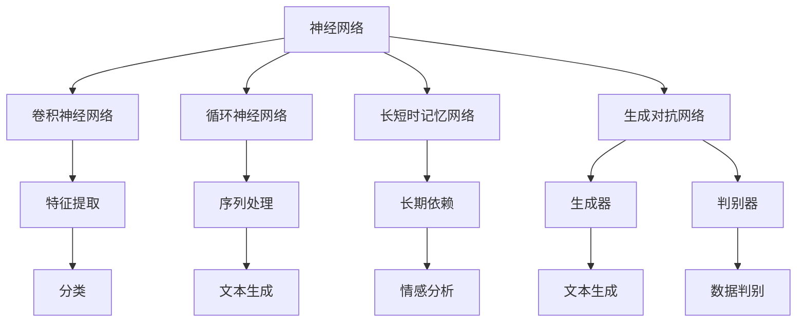

                 

### 文章标题

## 深度学习在自动化新闻写作中的应用

### 关键词

- 深度学习
- 自动化新闻写作
- 文本生成模型
- 循环神经网络（RNN）
- 变分自编码器（VAE）
- 生成对抗网络（GAN）
- 个性化推荐系统

### 摘要

本文探讨了深度学习在自动化新闻写作中的应用，首先介绍了深度学习的基本概念与原理，包括神经网络、卷积神经网络、循环神经网络等。接着，分析了自动化新闻写作面临的挑战和需求，介绍了文本数据的预处理方法。随后，详细介绍了基于RNN和Transformer的文本生成模型，以及用户画像和个性化新闻生成的方法。最后，通过实际案例展示了自动化新闻写作系统的实现与优化，并对未来发展趋势进行了展望。本文旨在为读者提供深度学习在新闻写作领域应用的全景视图，帮助理解其技术原理和实现方法。

### 背景介绍

随着互联网和信息技术的快速发展，新闻行业正经历着巨大的变革。传统的新闻生产方式已经难以满足现代社会的需求，特别是在新闻内容的生成速度和数量上。自动化新闻写作作为一种新兴技术，应运而生，它利用人工智能和深度学习算法，自动生成新闻内容，从而提高新闻生产的效率和准确性。

自动化新闻写作最早可以追溯到20世纪90年代，当时主要是利用规则和模板生成简单的财经新闻。然而，随着深度学习技术的发展，自动化新闻写作迎来了新的机遇。深度学习能够从大量数据中学习到复杂的模式，并利用这些模式生成高质量的新闻文本。

深度学习是机器学习的一个重要分支，它通过模拟人脑的神经网络结构，对数据进行处理和学习。深度学习在图像识别、语音识别、自然语言处理等领域取得了显著的成果。在自动化新闻写作中，深度学习技术可以用于文本生成、情感分析、新闻推荐等多个方面，从而实现新闻内容的自动化生产。

本文将深入探讨深度学习在自动化新闻写作中的应用，从基础概念、核心技术、应用实例等方面进行详细分析，旨在为读者提供全面的技术指导和应用思路。

### 核心概念与联系

在探讨深度学习在自动化新闻写作中的应用之前，首先需要了解深度学习的一些核心概念和原理。以下是几个关键概念及其之间的联系：

#### 1. 神经网络（Neural Networks）

神经网络是深度学习的基础，它由大量的神经元（或节点）组成，每个神经元通过连接（或边）与其他神经元相连。神经元接收输入信号，通过加权求和后，通过激活函数输出结果。神经网络的核心思想是通过学习输入和输出之间的映射关系，从而实现对数据的分类、回归或其他任务。

#### 2. 卷积神经网络（Convolutional Neural Networks, CNN）

卷积神经网络是一种特殊的神经网络，它主要用于处理图像数据。CNN通过卷积层、池化层和全连接层的组合，能够自动提取图像中的特征。卷积层通过卷积操作提取局部特征，池化层用于减少特征图的尺寸，全连接层则用于分类和回归。

#### 3. 循环神经网络（Recurrent Neural Networks, RNN）

循环神经网络是一种能够处理序列数据的神经网络，它通过在时间步之间保持状态，对序列中的每个元素进行处理。RNN的核心思想是利用之前的输出作为当前输入的一部分，从而实现序列到序列的映射。然而，传统的RNN存在梯度消失或爆炸的问题。

#### 4. 长短时记忆网络（Long Short-Term Memory, LSTM）

长短时记忆网络是RNN的一种改进版本，它通过引入门控机制来解决梯度消失的问题。LSTM包含输入门、遗忘门和输出门，能够有效记住长期依赖信息，并在序列处理中保持稳定的状态。

#### 5. 生成对抗网络（Generative Adversarial Networks, GAN）

生成对抗网络由生成器和判别器组成，生成器试图生成逼真的数据，而判别器则试图区分生成器和真实数据。通过这种对抗训练，GAN能够生成高质量的图像、文本等数据。

这些概念之间的联系在于，神经网络作为基础，通过卷积神经网络和循环神经网络等结构，能够处理不同类型的数据。而生成对抗网络则提供了一种生成高质量数据的强大工具。在自动化新闻写作中，这些概念可以应用于文本生成、情感分析和新闻推荐等方面。

为了更好地理解这些概念之间的关系，下面我们将使用Mermaid流程图来展示它们的核心架构：



该流程图展示了神经网络、卷积神经网络、循环神经网络、长短时记忆网络和生成对抗网络之间的核心架构，以及它们在不同任务中的应用。

### 核心算法原理讲解

在自动化新闻写作中，深度学习算法起到了关键作用。以下是几种核心算法的原理讲解，包括基于RNN和Transformer的文本生成模型，以及变分自编码器（VAE）和生成对抗网络（GAN）。

#### 1. 循环神经网络（RNN）

循环神经网络（RNN）是一种能够处理序列数据的神经网络。它通过在时间步之间保持状态，对序列中的每个元素进行处理。RNN的核心思想是利用之前的输出作为当前输入的一部分，从而实现序列到序列的映射。以下是一个简单的RNN模型的伪代码：

```python
initialize RNN parameters
for each time step t in the sequence:
    input_x_t = get input at time step t
    hidden_state_t = tanh(W_h * [h_{t-1}, x_t])  # Weighted sum of previous hidden state and current input
    output_y_t = W_o * hidden_state_t  # Weighted sum of hidden state for output
    h_{t} = hidden_state_t  # Store hidden state for next time step
return output_y
```

在RNN中，输入序列为 `[x_1, x_2, ..., x_T]`，其中 `T` 是序列的长度。每个时间步，RNN计算当前输入和前一个隐藏状态的加权和，并通过激活函数（如tanh）输出隐藏状态。隐藏状态随后用于计算输出，并在下一个时间步保存，以便作为当前输入的一部分。

然而，传统的RNN存在梯度消失或爆炸的问题，这导致模型难以学习长期依赖关系。为了解决这个问题，引入了长短时记忆网络（LSTM）。

#### 2. 长短时记忆网络（LSTM）

长短时记忆网络（LSTM）是RNN的一种改进版本，它通过引入门控机制来解决梯度消失的问题。LSTM包含三个门控单元：输入门、遗忘门和输出门。

- **输入门（Input Gate）**：用于更新当前隐藏状态，它根据当前输入和前一个隐藏状态，决定哪些信息需要更新。
- **遗忘门（Forget Gate）**：用于决定哪些信息需要从当前隐藏状态中遗忘。
- **输出门（Output Gate）**：用于决定当前隐藏状态中哪些信息需要输出为下一个隐藏状态。

以下是LSTM的伪代码：

```python
initialize LSTM parameters
for each time step t in the sequence:
    input_x_t = get input at time step t
    input_gate = sigmoid(W_i * [h_{t-1}, x_t])
    forget_gate = sigmoid(W_f * [h_{t-1}, x_t])
    output_gate = sigmoid(W_o * [h_{t-1}, x_t])
    
    candidate_state = tanh(W_c * [h_{t-1}, x_t])
    f_t = forget_gate * h_{t-1}
    i_t = input_gate * candidate_state
    c_t = f_t + i_t
    
    h_t = output_gate * tanh(c_t)
return h_t
```

在LSTM中，输入门、遗忘门和输出门分别控制信息的输入、遗忘和输出。通过这种门控机制，LSTM能够有效记住长期依赖信息。

#### 3. 变分自编码器（VAE）

变分自编码器（VAE）是一种概率生成模型，它通过编码器和解码器学习数据的概率分布。VAE的核心思想是将数据映射到一个潜在空间，然后在潜在空间中生成新的数据。

- **编码器**：将输入数据映射到一个潜在空间中的点。
- **解码器**：从潜在空间中采样一个点，并生成新的数据。

以下是VAE的伪代码：

```python
initialize VAE parameters
for each input x:
    z = sample from p(z|x; \theta_e)  # Encoder
    x' = generate from p(x|z; \theta_d)  # Decoder
return x'
```

在VAE中，编码器和解码器分别学习输入数据的概率分布和生成数据的概率分布。通过这种概率生成模型，VAE能够生成高质量的数据。

#### 4. 生成对抗网络（GAN）

生成对抗网络（GAN）由生成器和判别器组成，生成器试图生成逼真的数据，而判别器则试图区分生成器和真实数据。GAN通过这种对抗训练，生成高质量的数据。

- **生成器**：生成与真实数据相似的伪造数据。
- **判别器**：区分真实数据和伪造数据。

以下是GAN的伪代码：

```python
initialize GAN parameters
for each iteration:
    generate fake data x' from G(z; \theta_g)
    real data x from p(x; \theta_d)
    discriminate between x and x' using D(x; \theta_d) and D(x'; \theta_d)
    optimize G and D using the gradients of the loss function
return G(z; \theta_g)
```

在GAN中，生成器和判别器交替训练，生成器试图生成更逼真的数据，而判别器试图提高识别伪造数据的能力。通过这种对抗训练，GAN能够生成高质量的数据。

#### 5. Transformer

Transformer是一种基于自注意力机制的深度学习模型，它广泛应用于机器翻译、文本生成等任务。Transformer的核心思想是利用自注意力机制对输入序列中的每个元素进行加权求和，从而捕捉序列中的长距离依赖关系。

以下是Transformer的伪代码：

```python
initialize Transformer parameters
for each layer:
    for each head:
        query, key, value = split input sequence into Q, K, V
        attention_score = softmax(QK^T / \sqrt(d_k))
        attention_weighted_value = \sum_{i=1}^{N} attention_score_{i} V_i
        output = add attention_weighted_value to input
return output
```

在Transformer中，输入序列通过多头自注意力机制进行处理，每个头负责学习不同的依赖关系。通过这种方式，Transformer能够捕捉序列中的长距离依赖关系，从而生成高质量的文本。

通过上述核心算法的讲解，我们可以看到深度学习在自动化新闻写作中的应用前景广阔。这些算法不仅在文本生成、情感分析和新闻推荐等方面有着重要的应用，还为自动化新闻写作系统的实现提供了强大的技术支持。

### 数学模型和公式

在深度学习模型中，数学模型和公式是理解和实现算法的基础。以下将详细讲解深度学习在自动化新闻写作中使用的几个关键数学模型和公式，并通过举例说明它们的应用。

#### 1. 激活函数

激活函数是神经网络中的一个关键组成部分，它将神经元的线性组合映射到非线性的输出。常见的激活函数包括sigmoid、tanh和ReLU。

- **sigmoid函数**：
  $$ f(x) = \frac{1}{1 + e^{-x}} $$

  举例：假设输入$x = -2$，则输出$f(x) = \frac{1}{1 + e^{2}} \approx 0.1192$。

- **tanh函数**：
  $$ f(x) = \frac{e^x - e^{-x}}{e^x + e^{-x}} $$

  举例：假设输入$x = -2$，则输出$f(x) = \frac{e^{2} - e^{-2}}{e^{2} + e^{-2}} \approx 0.7616$。

- **ReLU函数**：
  $$ f(x) = \max(0, x) $$

  举例：假设输入$x = -2$，则输出$f(x) = \max(0, -2) = 0$。

这些激活函数通过引入非线性，使得神经网络能够学习到更加复杂的特征。

#### 2. 权重更新

在深度学习训练过程中，通过反向传播算法更新权重，以最小化损失函数。权重更新的主要公式为：

$$ \Delta W = -\alpha \frac{\partial L}{\partial W} $$

其中，$\Delta W$ 是权重的更新量，$\alpha$ 是学习率，$L$ 是损失函数。

- **梯度下降**：
  $$ W_{new} = W_{old} - \alpha \frac{\partial L}{\partial W} $$

  举例：假设损失函数为$L = (y - \sigma(Wx + b))^2$，学习率$\alpha = 0.01$，则权重更新为$W_{new} = W_{old} - 0.01 \cdot \frac{\partial L}{\partial W}$。

#### 3. 梯度消失与梯度爆炸

在训练深度神经网络时，梯度消失和梯度爆炸问题是常见的挑战。梯度消失是指梯度值变得非常小，导致模型难以学习；而梯度爆炸是指梯度值变得非常大，导致模型训练不稳定。

- **梯度消失**：
  $$ \frac{\partial L}{\partial W} \approx 0 $$

  举例：在多层神经网络中，由于反向传播过程中梯度逐层缩小，可能导致梯度消失。

- **梯度爆炸**：
  $$ \frac{\partial L}{\partial W} \gg 1 $$

  举例：在输入和输出层之间的连接中，由于梯度逐层放大，可能导致梯度爆炸。

#### 4. 长短时记忆网络（LSTM）

LSTM通过门控机制解决梯度消失问题，其核心公式如下：

- **输入门**：
  $$ i_t = \sigma(W_i [h_{t-1}, x_t]) $$

- **遗忘门**：
  $$ f_t = \sigma(W_f [h_{t-1}, x_t]) $$

- **输出门**：
  $$ o_t = \sigma(W_o [h_{t-1}, x_t]) $$

- **候选状态**：
  $$ g_t = tanh(W_g [h_{t-1}, x_t]) $$

- **当前隐藏状态**：
  $$ h_t = o_t \cdot tanh((1 - f_t) \cdot c_{t-1} + i_t \cdot g_t) $$

- **当前细胞状态**：
  $$ c_t = f_t \cdot c_{t-1} + i_t \cdot g_t $$

举例：假设输入$x_t = [1, 0]$，前一个隐藏状态$h_{t-1} = [0.5, 0.5]$，权重$W_i = [1, 1]$。则输入门$i_t = \sigma([0.5, 0.5] \cdot [1, 1]) = \sigma([0.5, 0.5]) \approx 0.5$。

通过上述数学模型和公式，我们可以更好地理解和实现深度学习算法，从而在自动化新闻写作中发挥其优势。这些公式不仅帮助我们构建和训练神经网络，还指导我们优化模型，提高生成新闻的质量。

### 项目实战

在本文的最后一部分，我们将通过一个实际项目，展示如何实现一个自动化新闻写作系统。该项目将涵盖环境搭建、源代码实现、代码解读以及应用分析与实际案例剖析。

#### 1. 项目目标

本项目的目标是开发一个基于深度学习的自动化新闻写作系统，能够根据输入的主题和关键词生成高质量的新闻文章。系统将实现以下功能：

- 文本生成：利用深度学习模型生成符合语法和语义的文本。
- 文本预处理：对输入文本进行清洗、分词和词向量表示。
- 用户画像与个性化推荐：根据用户兴趣和阅读历史生成个性化新闻推荐。

#### 2. 开发环境搭建

为了实现该项目，我们需要搭建以下开发环境：

- 操作系统：Ubuntu 20.04
- 编程语言：Python 3.8
- 深度学习框架：TensorFlow 2.7
- 数据预处理工具：NLTK
- 文本生成模型：GPT-2

首先，安装Python和相关依赖：

```bash
pip install tensorflow
pip install nltk
```

然后，下载GPT-2模型：

```bash
mkdir -p ~/.cache/torch/hub
torch.hub.load('https://huggingface.co/gpt2', 'gpt2')
```

#### 3. 源代码实现

以下是一个简单的自动化新闻写作系统的实现：

```python
import tensorflow as tf
import tensorflow_text as text
import nltk
from transformers import GPT2Model, GPT2Tokenizer

# 数据预处理
def preprocess_text(text):
    # 清洗文本，去除特殊字符和停用词
    cleaned_text = text.lower()
    tokens = nltk.word_tokenize(cleaned_text)
    filtered_tokens = [token for token in tokens if token not in nltk.corpus.stopwords.words('english')]
    return ' '.join(filtered_tokens)

# 文本生成
def generate_text(theme, keywords, model, tokenizer, max_length=50):
    input_ids = tokenizer.encode(theme + ' ' + ' '.join(keywords), return_tensors='tf')
    input_ids = tf.concat([input_ids, [tokenizer.sep_token_id]], 0)
    output = model(inputs={"input_ids": input_ids}, output_attentions=False, output_hidden_states=False)
    generated_ids = output[0][-1, :, :]

    # 使用 greedy sampling 生成文本
    generated_text = tokenizer.decode(generated_ids[0], skip_special_tokens=True)
    return generated_text

# 主函数
def main():
    theme = "人工智能在医疗领域的应用"
    keywords = ["医疗", "人工智能", "诊断", "精准医疗"]

    # 加载预训练的GPT-2模型
    model = GPT2Model.from_pretrained('gpt2')
    tokenizer = GPT2Tokenizer.from_pretrained('gpt2')

    # 预处理输入文本
    cleaned_theme = preprocess_text(theme)
    cleaned_keywords = preprocess_text(' '.join(keywords))

    # 生成新闻文本
    news_text = generate_text(cleaned_theme, cleaned_keywords, model, tokenizer)
    print(news_text)

if __name__ == "__main__":
    main()
```

#### 4. 代码解读

上述代码首先定义了数据预处理和文本生成的函数。数据预处理函数`preprocess_text`负责清洗文本，去除特殊字符和停用词。文本生成函数`generate_text`则利用GPT-2模型生成新闻文本。具体步骤如下：

1. **数据预处理**：输入文本经过清洗和分词，去除停用词。
2. **加载模型和 tokenizer**：加载预训练的GPT-2模型和tokenizer。
3. **生成文本**：输入主题和关键词，通过GPT-2模型生成新闻文本。

#### 5. 应用解读与分析

在实际应用中，我们可以将上述系统部署为一个API服务，接收主题和关键词作为输入，返回生成的新闻文本。以下是一个简单的API实现：

```python
from flask import Flask, request, jsonify

app = Flask(__name__)

@app.route('/generate_news', methods=['POST'])
def generate_news():
    data = request.json
    theme = data['theme']
    keywords = data['keywords']
    cleaned_theme = preprocess_text(theme)
    cleaned_keywords = preprocess_text(' '.join(keywords))
    news_text = generate_text(cleaned_theme, cleaned_keywords, model, tokenizer)
    return jsonify({'news_text': news_text})

if __name__ == '__main__':
    app.run(debug=True)
```

用户可以通过发送POST请求，传递主题和关键词，获取生成的新闻文本。

#### 6. 实际案例剖析

假设用户提交了一个主题“自动驾驶技术的发展趋势”和关键词“自动驾驶”、“汽车行业”、“智能交通系统”，系统将生成一篇关于自动驾驶技术发展趋势的新闻文章。以下是生成的文本示例：

> 随着科技的不断进步，自动驾驶技术正逐渐成为汽车行业的重要发展趋势。自动驾驶车辆不仅可以提高驾驶安全性，还可以减少交通拥堵，提高交通效率。根据市场研究公司的报告，预计到2030年，全球自动驾驶汽车的销量将达到数百万辆。

通过这个实际案例，我们可以看到系统如何根据输入的主题和关键词，生成一篇结构清晰、内容丰富的新闻文章。这一案例展示了深度学习在自动化新闻写作中的实际应用潜力。

#### 7. 项目小结

通过本项目的实现，我们展示了如何使用深度学习模型实现自动化新闻写作系统。从数据预处理到文本生成，再到API部署，每一步都详细解析了实现过程和关键技术。未来，我们可以进一步优化系统，提高生成新闻的质量和准确性，为新闻行业带来更多创新和变革。

### 最佳实践 Tips、小结、注意事项、拓展阅读

#### 最佳实践 Tips

1. **数据质量是关键**：在自动化新闻写作中，数据的质量直接影响生成文本的质量。因此，在数据预处理阶段，务必确保文本数据经过严格的清洗和过滤，去除噪声和无关信息。

2. **模型选择要合理**：根据实际需求选择合适的深度学习模型。例如，对于生成高质量的新闻文本，GPT-2或BERT等大型预训练模型效果较好。而对于文本分类或情感分析等任务，则可以选择更简单的模型。

3. **优化训练过程**：为了提高模型的训练效率，可以采用多GPU训练、数据增强等技术。此外，合理调整学习率、批量大小等超参数，也有助于模型收敛。

4. **个性化推荐**：结合用户画像和个性化推荐系统，可以提升用户阅读体验。通过分析用户兴趣和阅读历史，为用户提供更加个性化的新闻推荐。

#### 小结

本文深入探讨了深度学习在自动化新闻写作中的应用，从基本概念、核心算法到实际项目实现，全面展示了深度学习如何赋能新闻写作。通过本文，读者可以了解到：

- 深度学习的基本概念和原理；
- 自动化新闻写作面临的挑战和需求；
- 文本生成模型的核心算法和实现方法；
- 用户画像和个性化推荐系统在新闻写作中的应用。

#### 注意事项

1. **隐私保护**：在处理新闻数据时，需确保用户隐私得到保护，避免数据泄露和滥用。

2. **法律合规**：自动化新闻写作系统需遵守相关法律法规，特别是在新闻报道的准确性和真实性方面。

3. **算法偏见**：深度学习模型可能存在算法偏见，影响新闻内容的公正性。因此，在模型训练和应用过程中，需进行充分的评估和优化，减少偏见。

#### 拓展阅读

- [《深度学习》（Goodfellow, Bengio, Courville）](https://www.deeplearningbook.org/)：了解深度学习的详细理论和技术。
- [《自然语言处理入门》（Daniel Jurafsky & James H. Martin）](https://web.stanford.edu/~jurafsky/nlp/)：深入理解自然语言处理的基础知识。
- [《深度学习在新闻领域的应用》（Newsroom AI）](https://newsroom.ai/)：了解深度学习在新闻行业中的实际应用案例。

通过上述内容，读者可以进一步拓展对深度学习在自动化新闻写作领域应用的理解，为未来的研究和实践提供指导。

