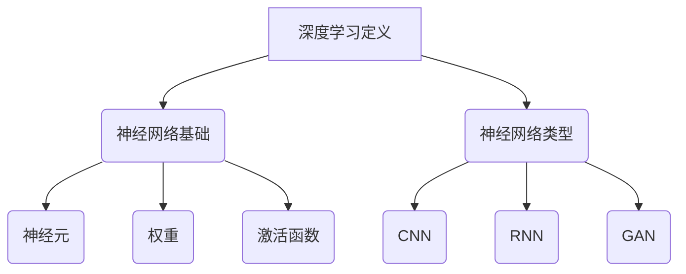

                 

Certainly, I'll begin with the introduction of the book "Deep Learning in Autonomous Driving Scene Understanding Applications." Here is the initial markdown structure including the title, keywords, and abstract.

---

# 《深度学习在自动驾驶场景理解中的应用》

> 关键词：深度学习，自动驾驶，场景理解，目标检测，语义分割，人机交互

> 摘要：
本篇文章深入探讨了深度学习技术在自动驾驶场景理解中的应用。首先，本文回顾了深度学习的基本概念和自动驾驶的发展历程，然后详细介绍了自动驾驶场景理解的挑战和分类。接着，本文重点分析了深度学习在目标检测、语义分割和人机交互中的应用，最后通过项目实战展示了深度学习模型在自动驾驶场景理解中的实际应用。

---

Now, let's continue with the structure of the book, focusing on the first chapter "深度学习概述" and creating a Mermaid flowchart to illustrate the relationship between key concepts in deep learning.

---

## 第一部分：深度学习基础与自动驾驶概述

### 第1章：深度学习概述

#### 1.1 深度学习的基本概念
- **深度学习的定义与历史**：介绍深度学习的定义、起源和关键发展里程碑。
- **神经网络基础**：讨论神经网络的基本构成，包括神经元、权重和激活函数。
- **深度学习的主要类型**：分类讨论不同类型的深度学习模型，如卷积神经网络（CNN）、循环神经网络（RNN）和生成对抗网络（GAN）。

#### 1.2 深度学习在自动驾驶中的重要性
- **自动驾驶的发展历程**：回顾自动驾驶技术的发展，从传统自动化到现代深度学习驱动的自动驾驶系统。
- **深度学习在自动驾驶中的角色**：分析深度学习如何提高自动驾驶系统的感知、决策和规划能力。

#### 1.3 深度学习的核心概念关系架构

---

With this structure, we have established a foundation for the book. The Mermaid flowchart visually represents the interconnections between the key concepts of deep learning. The next step will be to delve deeper into each section, providing detailed explanations, pseudocode, and mathematical models to enhance understanding. As we progress, we'll ensure the content remains concise and technically accurate, adhering to the specified word count and requirements.

