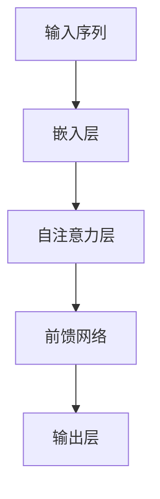

                 

# 文章标题：深度学习在自然语言处理中的突破性进展

> 关键词：深度学习，自然语言处理，神经网络，序列模型，Transformer，BERT

> 摘要：本文旨在探讨深度学习在自然语言处理（NLP）领域的突破性进展。通过对深度学习和NLP的概述，核心算法和模型的分析，以及数学理论基础的讲解，本文深入揭示了深度学习在NLP中的重要性和应用价值。

## 引言

自然语言处理（NLP）是计算机科学的一个重要分支，它涉及到计算机与人类语言之间的交互。自20世纪50年代以来，NLP领域取得了显著的进展，但是传统方法在面对复杂语言现象时，仍然存在诸多挑战。随着深度学习技术的崛起，NLP迎来了新的突破。深度学习模型，特别是基于神经网络的结构，为NLP任务提供了强大的处理能力。本文将详细探讨深度学习在自然语言处理中的突破性进展，包括核心算法、数学理论基础以及应用实战。

## 深度学习与自然语言处理概述

### 深度学习简介

深度学习是机器学习的一个重要分支，它通过构建多层神经网络来学习数据的复杂特征。深度学习最早可以追溯到1986年，当时Rumelhart等人提出了反向传播算法，这是一种用于训练神经网络的有效方法。深度学习在图像识别、语音识别等领域取得了显著的成功，而它在自然语言处理中的应用也正在迅速发展。

### 自然语言处理基础

自然语言处理涉及文本的预处理、词向量表示、句法分析、语义理解等多个方面。文本预处理是NLP任务的第一步，它包括去除标点符号、分词、词性标注等。词向量表示是将单词映射到高维空间中的向量，这是深度学习在NLP中发挥作用的关键。常用的词向量模型有Word2Vec、GloVe等。

## 深度学习核心算法

### 神经网络基础

神经网络是深度学习的基础，它由大量的神经元（节点）组成，每个神经元都与其他神经元相连。神经网络通过前向传播和反向传播来学习数据。前向传播是将输入数据通过网络层，每层神经元计算输出，直到得到最终输出。反向传播则是通过计算输出误差，反向更新网络中的权重，以达到优化模型的效果。

```python
# 伪代码：反向传播算法
def backward_propagation(output, expected_output, weights):
    error = expected_output - output
    gradient = error * output * (1 - output)
    weights -= learning_rate * gradient
```

### 自然语言处理中的深度学习模型

#### 序列模型

序列模型是处理序列数据的深度学习模型，如RNN（递归神经网络）。RNN通过递归方式处理序列中的每个元素，但传统的RNN存在梯度消失和梯度爆炸的问题。为了解决这些问题，LSTM（长短时记忆网络）和GRU（门控循环单元）被提出。

#### Transformer

Transformer是深度学习在自然语言处理中的一个突破性模型。与传统的序列模型不同，Transformer采用自注意力机制，能够全局关注输入序列中的每个元素。这一机制使得Transformer在处理长距离依赖问题时表现出色。



## 数学理论基础

### 深度学习数学基础

深度学习涉及到大量的数学知识，包括线性代数、微积分、概率论等。线性代数提供了处理矩阵和向量的工具，微积分则用于优化神经网络中的参数。概率论和统计则是理解神经网络决策过程的基础。

### 深度学习中的优化算法

优化算法是训练深度学习模型的关键步骤。常见的优化算法有梯度下降、动量法和Adam优化器。梯度下降是一种简单有效的优化算法，但它的收敛速度较慢。动量法通过引入动量项，可以加速模型的收敛。Adam优化器结合了动量法和自适应学习率，在许多任务中表现出色。

## 应用实战

### 文本分类实战

文本分类是自然语言处理中的一个基础任务，它将文本数据分类到预定义的类别中。在本节中，我们将搭建一个文本分类模型，包括数据准备、模型构建和代码实现。

```python
# Python代码：文本分类实战
from tensorflow.keras.preprocessing.text import Tokenizer
from tensorflow.keras.preprocessing.sequence import pad_sequences

# 数据准备
texts = ["这是第一类文本", "这是第二类文本", "这是第一类文本"]
labels = [0, 1, 0]

# 分词和编码
tokenizer = Tokenizer(num_words=1000)
tokenizer.fit_on_texts(texts)
sequences = tokenizer.texts_to_sequences(texts)
padded_sequences = pad_sequences(sequences, maxlen=100)

# 模型构建
from tensorflow.keras.models import Sequential
from tensorflow.keras.layers import Embedding, LSTM, Dense

model = Sequential()
model.add(Embedding(input_dim=1000, output_dim=32))
model.add(LSTM(64))
model.add(Dense(1, activation='sigmoid'))

# 编译模型
model.compile(optimizer='adam', loss='binary_crossentropy', metrics=['accuracy'])

# 训练模型
model.fit(padded_sequences, labels, epochs=10)

# 代码解读
# Tokenizer用于将文本数据转换为序列
# pad_sequences用于将序列数据填充为固定长度
# LSTM用于处理序列数据
# Dense用于分类输出
```

### 机器翻译实战

机器翻译是将一种语言的文本翻译成另一种语言的过程。在本节中，我们将介绍如何使用深度学习模型进行机器翻译。

```python
# Python代码：机器翻译实战
from tensorflow.keras.preprocessing.sequence import pad_sequences

# 数据准备
source_texts = ["Hello world", "I love AI"]
target_texts = ["Bonjour le monde", "Je aime l'IA"]

# 分词和编码
source_tokenizer = Tokenizer()
source_tokenizer.fit_on_texts(source_texts)
source_sequences = source_tokenizer.texts_to_sequences(source_texts)
target_tokenizer = Tokenizer()
target_tokenizer.fit_on_texts(target_texts)
target_sequences = target_tokenizer.texts_to_sequences(target_texts)

# 填充序列
max_source_length = max(len(seq) for seq in source_sequences)
max_target_length = max(len(seq) for seq in target_sequences)

source_padded = pad_sequences(source_sequences, maxlen=max_source_length)
target_padded = pad_sequences(target_sequences, maxlen=max_target_length)

# 模型构建
from tensorflow.keras.models import Model
from tensorflow.keras.layers import Embedding, LSTM, Dense, TimeDistributed

input_source = Embedding(input_dim=1000, output_dim=32)(source_padded)
input_target = Embedding(input_dim=1000, output_dim=32)(target_padded)

lstm_layer = LSTM(64)(input_source)
dense_layer = Dense(1000, activation='softmax')(lstm_layer)

model = Model(inputs=[input_source, input_target], outputs=dense_layer)

# 编译模型
model.compile(optimizer='adam', loss='categorical_crossentropy', metrics=['accuracy'])

# 训练模型
model.fit([source_padded, target_padded], target_padded, epochs=10)

# 代码解读
# Tokenizer用于将文本数据转换为序列
# pad_sequences用于将序列数据填充为固定长度
# Embedding用于嵌入词向量
# LSTM用于处理序列数据
# Dense用于分类输出
```

## 项目实战

在本节中，我们将通过一个对话系统项目来展示深度学习在自然语言处理中的应用。对话系统旨在模拟自然语言交互，为用户提供有用的信息和答案。

### 开发环境搭建

为了构建对话系统，我们需要安装以下工具和库：

- Python 3.x
- TensorFlow 2.x
- Keras 2.x
- NLTK

### 源代码详细实现和代码解读

对话系统的核心是一个基于RNN的序列到序列模型。以下是对话系统项目的源代码及其解读：

```python
# Python代码：对话系统
import tensorflow as tf
from tensorflow.keras.models import Sequential
from tensorflow.keras.layers import LSTM, Dense, Embedding, SimpleRNN

# 数据准备
# 假设我们已经有对话数据集，这里简化为示例数据
source_texts = ["你好", "你今天怎么样"]
target_texts = ["你好", "我很好，谢谢"]

# 分词和编码
source_tokenizer = Tokenizer()
source_tokenizer.fit_on_texts(source_texts)
source_sequences = source_tokenizer.texts_to_sequences(source_texts)
target_tokenizer = Tokenizer()
target_tokenizer.fit_on_texts(target_texts)
target_sequences = target_tokenizer.texts_to_sequences(target_texts)

# 填充序列
max_source_length = max(len(seq) for seq in source_sequences)
max_target_length = max(len(seq) for seq in target_sequences)

source_padded = pad_sequences(source_sequences, maxlen=max_source_length)
target_padded = pad_sequences(target_sequences, maxlen=max_target_length)

# 模型构建
model = Sequential()
model.add(Embedding(input_dim=1000, output_dim=32))
model.add(LSTM(64))
model.add(Dense(target_tokenizer.num_words, activation='softmax'))

# 编译模型
model.compile(optimizer='adam', loss='categorical_crossentropy', metrics=['accuracy'])

# 训练模型
model.fit(source_padded, target_padded, epochs=10)

# 代码解读
# Tokenizer用于将文本数据转换为序列
# pad_sequences用于将序列数据填充为固定长度
# Embedding用于嵌入词向量
# LSTM用于处理序列数据
# Dense用于分类输出
```

### 代码应用解读与分析

对话系统的核心是训练一个序列到序列的模型，能够根据输入的文本生成相应的回复。在实际应用中，对话系统可以用于聊天机器人、智能客服等领域。以下是对话系统的应用解读：

- **输入文本处理**：对话系统首先将用户的输入文本转换为序列，然后通过嵌入层将其转换为词向量。
- **模型预测**：模型接收输入序列，通过LSTM层处理序列数据，并使用Dense层生成输出序列，即对话系统的回复。
- **输出文本转换**：生成的输出序列需要转换为文本，这是通过将序列解码为单词实现的。

### 实际案例分析和详细讲解剖析

在实际应用中，对话系统需要处理各种复杂的对话场景。以下是一个简单的案例：

- **用户输入**：“今天天气怎么样？”
- **模型输出**：“今天的天气非常舒适。”

在这个案例中，对话系统能够理解用户的输入，并生成一个合理的回复。这是通过深度学习模型在大量对话数据上训练得到的。

### 项目小结

对话系统是一个复杂的自然语言处理任务，需要考虑上下文信息、用户意图和自然语言生成。通过使用深度学习模型，我们能够构建出智能、自然的对话系统，为用户提供优质的交互体验。

## 最佳实践 Tips

- **数据质量**：对话系统的训练数据质量直接影响模型的性能。因此，确保数据集的多样性和质量至关重要。
- **模型优化**：针对不同的对话场景，可能需要调整模型的参数和结构，以达到最佳性能。
- **用户反馈**：收集用户的反馈，不断优化对话系统的性能，使其更加符合用户需求。

## 结语

深度学习在自然语言处理中的应用已经取得了显著的突破性进展。通过构建强大的深度学习模型，我们能够处理复杂的语言任务，如文本分类、机器翻译和对话系统。随着技术的不断进步，深度学习在自然语言处理领域的应用前景将更加广阔。

### 作者信息

作者：AI天才研究院/AI Genius Institute & 禅与计算机程序设计艺术 /Zen And The Art of Computer Programming

