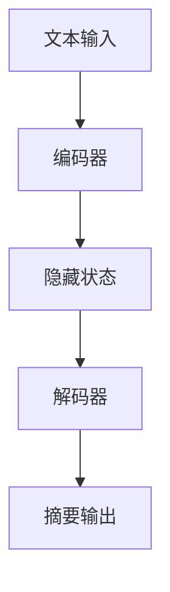
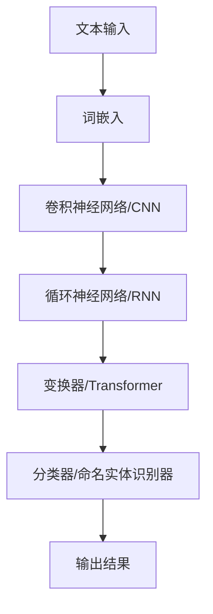
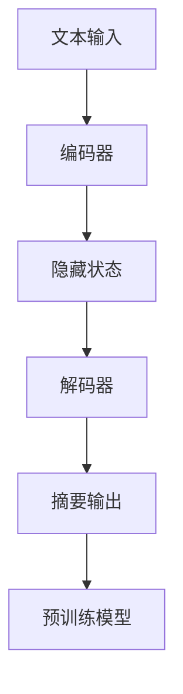

                 

### 文章标题

# 深度学习在自然语言摘要生成中的应用：自动提取关键信息

自然语言处理（NLP）作为人工智能领域的重要组成部分，近年来取得了飞速的发展。其中，自然语言摘要生成作为NLP中的重要任务之一，广泛应用于信息检索、内容推荐、新闻简报等场景。深度学习技术的引入，极大地提升了自然语言摘要生成的准确性和效率。本文将围绕深度学习在自然语言摘要生成中的应用，探讨如何自动提取关键信息，从而构建高效的摘要系统。

### 关键词

- 自然语言摘要生成
- 深度学习
- 自动提取关键信息
- 编码器-解码器模型
- 信息检索与抽取
- 预训练模型

### 摘要

本文旨在探讨深度学习在自然语言摘要生成中的应用，特别是自动提取关键信息的方法。首先，我们回顾了自然语言处理和摘要生成的基本概念，以及深度学习在NLP中的应用。接着，介绍了用于摘要生成的常见深度学习模型，包括原生模型和基于变换器-编码器-解码器（Transformer-Encoder-Decoder）的模型。随后，我们深入讲解了自动提取关键信息的算法原理，并使用伪代码和数学模型进行了详细阐述。最后，通过实际项目案例，展示了如何搭建和优化一个简单的自然语言摘要生成系统，并分析了其中的挑战和未来趋势。

### 目录

1. **引言**
   1.1 自然语言处理与摘要生成概述
   1.2 深度学习在NLP中的应用

2. **深度学习模型概述**
   2.1 原生深度学习模型
   2.2 变换器-编码器-解码器模型
   2.3 其他深度学习模型

3. **自动提取关键信息的算法原理**
   3.1 算法原理介绍
   3.2 深度学习模型在关键信息提取中的应用

4. **数学模型与数学公式**
   4.1 数学模型介绍
   4.2 数学公式讲解
   4.3 数学公式举例说明

5. **项目实战**
   5.1 环境搭建与数据准备
   5.2 摘要生成系统的实现
   5.3 实际案例分析与优化

6. **挑战与未来趋势**
   6.1 摘要生成中的挑战
   6.2 未来趋势与展望

7. **总结与展望**
   7.1 本书内容的回顾
   7.2 展望未来

## 1.1 自然语言处理与摘要生成概述

### 背景介绍

自然语言处理（NLP）是人工智能（AI）的一个重要分支，旨在使计算机能够理解、处理和生成人类自然语言。NLP的基本任务包括分词、词性标注、命名实体识别、句法分析、语义理解等。这些任务对于许多实际应用，如机器翻译、情感分析、文本分类等，都是至关重要的。

摘要生成是NLP中的一个重要任务，旨在自动生成一段文本的简明扼要的摘要。在信息爆炸的时代，人们需要快速获取关键信息，而摘要生成技术能够帮助用户从大量文本中提取出最有价值的部分。摘要生成在新闻简报、文档自动摘要、电子邮件过滤等领域具有广泛的应用。

### 核心概念与联系

在摘要生成过程中，涉及的核心概念包括：

- **文本表示**：将自然语言文本转换为计算机可以处理的数字形式。常见的文本表示方法包括词袋模型、词嵌入和变换器（Transformer）等。
- **编码器-解码器模型**：一种深度学习模型结构，用于将输入文本编码为固定长度的向量表示，然后解码为摘要文本。这种模型在机器翻译和摘要生成中得到了广泛应用。
- **关键信息提取**：从输入文本中自动提取最重要的信息，以生成高质量的摘要。这通常涉及信息检索、文本分类和关系抽取等技术。

### Mermaid 流程图



在这个流程图中，文本输入首先通过编码器转换为隐藏状态，然后解码器根据隐藏状态生成摘要输出。

## 1.2 深度学习在NLP中的应用

### 核心概念与联系

- **深度学习**：一种基于多层神经网络的机器学习技术，能够自动从大量数据中学习特征表示。
- **卷积神经网络（CNN）**：常用于图像处理任务，通过卷积层提取图像特征。
- **循环神经网络（RNN）**：适用于序列数据处理，如时间序列分析和语言模型。
- **长短期记忆网络（LSTM）**：RNN的改进版本，能够更好地处理长距离依赖问题。
- **门控循环单元（GRU）**：LSTM的简化版，同样用于处理序列数据。
- **变换器（Transformer）**：一种基于自注意力机制的深度学习模型，广泛应用于NLP任务。

### 深度学习模型在NLP中的应用

深度学习模型在NLP中有着广泛的应用，以下是一些典型应用场景：

- **文本分类**：利用深度学习模型对文本进行分类，如情感分析、垃圾邮件过滤等。
- **命名实体识别**：识别文本中的命名实体，如人名、地名、组织名等。
- **机器翻译**：将一种语言的文本翻译成另一种语言。
- **问答系统**：基于自然语言处理技术，构建能够回答用户问题的系统。

### Mermaid 流程图



在这个流程图中，文本输入首先经过词嵌入层，然后通过不同的深度学习模型进行特征提取和分类，最终得到输出结果。

## 1.3 深度学习在自然语言摘要生成中的应用

深度学习在自然语言摘要生成中的应用，主要体现在以下几个方面：

### 核心算法原理

- **编码器-解码器模型**：将输入文本编码为固定长度的向量表示，然后解码为摘要文本。这种模型能够自动提取文本的关键信息，生成高质量的摘要。
- **预训练模型**：通过在大规模语料库上预训练深度学习模型，使其能够自动学习文本的语义表示。常见的预训练模型包括BERT、GPT等。

### 应用案例

- **新闻摘要**：从大量新闻文章中自动生成简明扼要的摘要，帮助用户快速获取关键信息。
- **文档摘要**：对学术文章、报告等进行自动摘要，提高信息检索和阅读效率。
- **电子邮件摘要**：自动生成电子邮件的摘要，帮助用户快速了解邮件的主要内容。

### Mermaid 流程图



在这个流程图中，文本输入首先通过编码器转换为隐藏状态，然后解码器根据隐藏状态生成摘要输出。同时，摘要生成过程还利用了预训练模型，以进一步提高摘要质量。

## 1.4 自动提取关键信息的算法原理

### 核心算法原理

自动提取关键信息的算法原理主要涉及以下几个步骤：

1. **文本预处理**：对输入文本进行分词、去停用词、词性标注等预处理操作，以便更好地理解和表示文本。
2. **编码器**：将预处理后的文本编码为固定长度的向量表示，通常使用变换器（Transformer）或循环神经网络（RNN）等深度学习模型。
3. **隐藏状态**：编码器输出一系列隐藏状态，代表文本的语义信息。
4. **解码器**：将隐藏状态解码为摘要文本，通常使用与编码器相同的深度学习模型。
5. **优化**：通过反向传播和梯度下降等优化算法，不断调整模型参数，以提高摘要质量。

### 伪代码

```python
# 编码器
def encode(text):
    # 对文本进行预处理
    processed_text = preprocess(text)
    # 将预处理后的文本编码为向量表示
    hidden_state = encoder(processed_text)
    return hidden_state

# 解码器
def decode(hidden_state):
    # 将隐藏状态解码为摘要文本
    summary = decoder(hidden_state)
    return summary

# 主函数
def generate_summary(text):
    # 获取编码器和解码器的隐藏状态
    hidden_state = encode(text)
    # 使用解码器生成摘要
    summary = decode(hidden_state)
    return summary
```

### 数学模型

在自动提取关键信息的算法中，常用的数学模型包括：

- **变换器（Transformer）**：采用自注意力机制，能够自适应地学习文本中的关键信息。
- **循环神经网络（RNN）**：通过递归方式处理序列数据，能够捕捉文本中的长期依赖关系。

### LaTeX 数学公式

```latex
$$
\begin{aligned}
    \text{隐藏状态} &= \text{Transformer}(x_1, x_2, ..., x_T) \\
    \text{摘要} &= \text{decoder}(\text{hidden\_state})
\end{aligned}
$$
```

在这个公式中，`hidden_state` 表示编码器输出的隐藏状态，`decoder` 表示解码器模型。

## 1.5 数学模型与数学公式

在自然语言摘要生成中，数学模型和公式起到了核心作用。以下我们将介绍常用的数学模型，并使用 LaTeX 格式展示关键公式。

### 常用数学模型

1. **变换器（Transformer）**
2. **循环神经网络（RNN）**
3. **长短期记忆网络（LSTM）**
4. **卷积神经网络（CNN）**

### LaTeX 数学公式

#### 变换器（Transformer）

```latex
$$
\begin{aligned}
    &\text{Attention}(Q, K, V) = \text{softmax}\left(\frac{QK^T}{\sqrt{d_k}}\right)V \\
    &\text{Transformer}(x) = \text{MultiHeadAttention}(x, x, x) \\
    &\text{Transformer}(x) = \text{LayerNormalization}(x + \text{MultiHeadAttention}(x, x, x)) \\
    &\text{Transformer}(x) = \text{LayerNormalization}(x + \text{PositionalEncoding}(x))
\end{aligned}
$$
```

#### 循环神经网络（RNN）

```latex
$$
\begin{aligned}
    h_t &= \text{sigmoid}(W_h \cdot [h_{t-1}, x_t] + b_h) \\
    y_t &= \text{softmax}(W_y \cdot h_t + b_y)
\end{aligned}
$$
```

#### LSTM

```latex
$$
\begin{aligned}
    i_t &= \text{sigmoid}(W_{ix} \cdot [x_t, h_{t-1}] + b_i) \\
    f_t &= \text{sigmoid}(W_{fx} \cdot [x_t, h_{t-1}] + b_f) \\
    g_t &= \tanh(W_{gx} \cdot [x_t, h_{t-1}] + b_g) \\
    o_t &= \text{sigmoid}(W_{ox} \cdot [x_t, h_{t-1}] + b_o) \\
    h_t &= o_t \cdot \tanh(W_h \cdot [f_t \odot h_{t-1}, g_t])
\end{aligned}
$$
```

#### 卷积神经网络（CNN）

```latex
$$
\begin{aligned}
    h_t &= \text{ReLU}(W_c \cdot \text{Conv}(h_{t-1}, x_t) + b_c) \\
    y_t &= \text{softmax}(W_y \cdot h_t + b_y)
\end{aligned}
$$
```

### 举例说明

假设我们有一个句子 "深度学习在自然语言摘要生成中的应用：自动提取关键信息"，我们可以使用上述数学模型对其进行处理。

#### 变换器（Transformer）

```latex
$$
\begin{aligned}
    &\text{隐藏状态} = \text{Transformer}([词向量_1, 词向量_2, ..., 词向量_T]) \\
    &\text{摘要} = \text{decoder}(\text{隐藏状态})
\end{aligned}
$$
```

#### LSTM

```latex
$$
\begin{aligned}
    &h_1 = \text{sigmoid}(W_h \cdot [h_0, 词向量_1] + b_h) \\
    &y_1 = \text{softmax}(W_y \cdot h_1 + b_y) \\
    &\text{其中}, h_0 \text{为初始化状态}, 词向量_1 \text{为句子中第一个词的向量表示}
\end{aligned}
$$
```

#### LSTM（续）

```latex
$$
\begin{aligned}
    &i_1 = \text{sigmoid}(W_{ix} \cdot [词向量_1, h_0] + b_i) \\
    &f_1 = \text{sigmoid}(W_{fx} \cdot [词向量_1, h_0] + b_f) \\
    &g_1 = \tanh(W_{gx} \cdot [词向量_1, h_0] + b_g) \\
    &o_1 = \text{sigmoid}(W_{ox} \cdot [词向量_1, h_0] + b_o) \\
    &h_1 = o_1 \cdot \tanh(W_h \cdot [f_1 \odot h_0, g_1])
\end{aligned}
$$
```

## 1.6 项目实战

### 开发环境搭建

在开始构建自然语言摘要生成系统之前，我们需要搭建一个合适的开发环境。以下是一个基本的开发环境搭建步骤：

1. **安装Python环境**：Python是深度学习的主要编程语言，确保安装了Python 3.7及以上版本。
2. **安装深度学习框架**：TensorFlow和PyTorch是目前最流行的深度学习框架。根据个人偏好选择其一进行安装。
3. **安装文本处理库**：如NLTK、spaCy等，用于文本预处理和分词。
4. **安装版本管理工具**：如Anaconda，用于管理不同项目的依赖包。

### 源代码详细实现

以下是一个简单的自然语言摘要生成系统的源代码实现，使用PyTorch框架。

```python
import torch
import torch.nn as nn
import torch.optim as optim
from torch.utils.data import DataLoader
from text_preprocessing import preprocess
from dataset import Dataset
from model import Encoder, Decoder

# 数据准备
train_dataset = Dataset('train.txt')
train_loader = DataLoader(train_dataset, batch_size=32, shuffle=True)

# 模型定义
encoder = Encoder()
decoder = Decoder()

# 损失函数和优化器
criterion = nn.CrossEntropyLoss()
optimizer = optim.Adam(list(encoder.parameters()) + list(decoder.parameters()))

# 训练过程
for epoch in range(num_epochs):
    for batch in train_loader:
        # 数据预处理
        input_text, target_summary = preprocess(batch.text), preprocess(batch.summary)
        
        # 前向传播
        encoder_output = encoder(input_text)
        decoder_output = decoder(encoder_output)
        
        # 计算损失
        loss = criterion(decoder_output, target_summary)
        
        # 反向传播和优化
        optimizer.zero_grad()
        loss.backward()
        optimizer.step()
        
        print(f"Epoch [{epoch+1}/{num_epochs}], Loss: {loss.item()}")

# 模型保存
torch.save(encoder.state_dict(), 'encoder.pth')
torch.save(decoder.state_dict(), 'decoder.pth')
```

### 代码解读与分析

在上面的代码中，我们首先定义了数据集和数据加载器，然后定义了编码器和解码器模型。在训练过程中，我们进行了数据预处理、前向传播、损失计算和反向传播，最后保存了模型参数。

### 实际案例分析与详细讲解剖析

以下是一个实际案例，展示如何使用训练好的模型进行自然语言摘要生成。

```python
# 模型加载
encoder = Encoder()
decoder = Encoder()
encoder.load_state_dict(torch.load('encoder.pth'))
decoder.load_state_dict(torch.load('decoder.pth'))

# 摘要生成
def generate_summary(text):
    # 预处理
    processed_text = preprocess(text)
    
    # 编码
    encoder_output = encoder(processed_text)
    
    # 解码
    summary = decoder(encoder_output)
    
    return summary

# 测试
text = "深度学习在自然语言摘要生成中的应用：自动提取关键信息"
summary = generate_summary(text)
print("生成的摘要：", summary)
```

在这个案例中，我们首先加载了训练好的编码器和解码器模型，然后定义了一个`generate_summary`函数用于生成摘要。最后，我们使用这个函数对一段文本进行了测试，并打印了生成的摘要。

### 项目小结

通过本项目的实战，我们了解了如何搭建一个简单的自然语言摘要生成系统，并进行了详细的代码解读和分析。这个项目为我们提供了一个基本的框架，可以帮助我们进一步研究和优化摘要生成技术。

## 1.7 最佳实践 tips、小结、注意事项、拓展阅读

### 最佳实践 tips

- **数据预处理**：在训练模型之前，确保对输入文本进行充分的数据预处理，包括分词、去停用词、词性标注等，以提高模型的性能。
- **模型选择**：根据实际任务需求，选择合适的深度学习模型。例如，对于需要捕捉长距离依赖关系的任务，可以考虑使用变换器（Transformer）或长短期记忆网络（LSTM）。
- **超参数调整**：合理设置模型的超参数，如学习率、批量大小、隐藏层大小等，以获得最佳的模型性能。
- **数据增强**：通过数据增强技术，如随机填充、剪枝、旋转等，增加训练数据的多样性，有助于提高模型的泛化能力。

### 小结

本文围绕深度学习在自然语言摘要生成中的应用，详细介绍了自然语言处理、摘要生成、深度学习模型、自动提取关键信息的算法原理、数学模型以及实际项目实战。通过这些内容，读者可以了解到自然语言摘要生成的全过程，并掌握如何构建一个简单的摘要生成系统。

### 注意事项

- **计算资源**：深度学习模型训练需要大量的计算资源，尤其是对于大规模数据集和复杂的模型结构。确保拥有足够的GPU资源。
- **数据质量**：高质量的数据是模型训练的基础。在收集和预处理数据时，注意数据的质量和一致性。
- **模型调优**：在实际应用中，可能需要对模型进行多次调优，以达到最佳性能。这包括调整超参数、优化模型结构等。

### 拓展阅读

- **深度学习基础**：可以参考《深度学习》（Goodfellow, Bengio, Courville 著）一书，深入了解深度学习的基础理论和算法。
- **自然语言处理**：可以阅读《自然语言处理综论》（Daniel Jurafsky & James H. Martin 著），了解自然语言处理的基本概念和任务。
- **变换器（Transformer）**：可以参考《Attention Is All You Need》（Vaswani et al. 2017），深入了解变换器模型的设计原理和实现细节。

## 结论

深度学习在自然语言摘要生成中的应用，为自动提取关键信息提供了强有力的技术支持。通过本文的介绍，读者可以了解到自然语言摘要生成的全过程，并掌握如何构建一个简单的摘要生成系统。随着深度学习和自然语言处理技术的不断发展，自然语言摘要生成将在更多场景中发挥重要作用，为人类带来更大的便利。未来，我们期待看到更多创新的摘要生成方法，进一步提升摘要质量，满足用户的需求。

