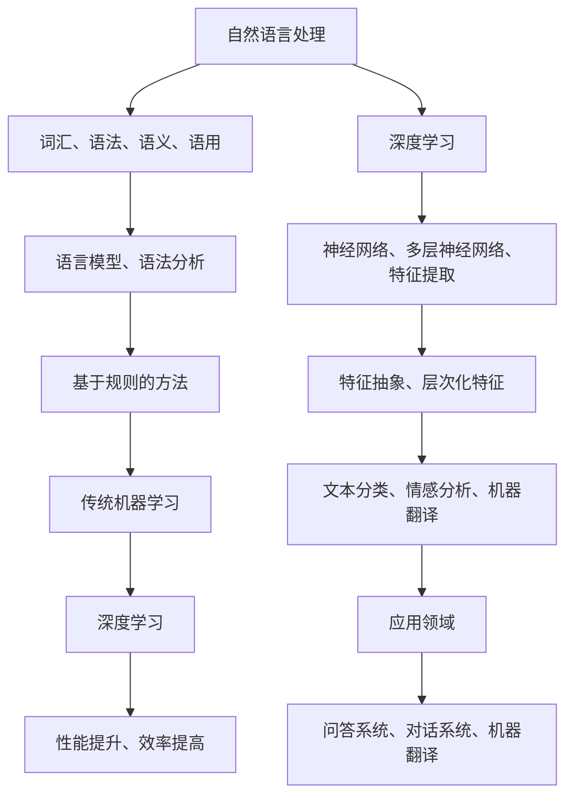

                 

### 第1章：自然语言处理与深度学习

#### 1.1 自然语言处理简介

自然语言处理（Natural Language Processing，NLP）是计算机科学、人工智能和语言学领域的交叉学科，旨在研究如何使计算机能够理解和处理人类语言。NLP的基本概念包括词汇、语法、语义和语用。词汇是语言的基本单位，语法是词汇的排列规则，语义是语言表达的意义，语用是语言在具体情境中的使用。

NLP的目标是通过建立模型和算法，使计算机能够理解、生成和操作自然语言。然而，自然语言的复杂性和多样性使得NLP面临许多挑战，如歧义、语言变异和非结构化数据等。

深度学习（Deep Learning）是一种基于多层神经网络的机器学习方法，能够通过大量数据自动学习复杂的特征和模式。深度学习在NLP中的优势在于其强大的建模能力和对大规模数据的高效处理能力。

#### 1.2 深度学习概述

深度学习的基本原理是通过多层神经网络对数据进行建模。每一层神经网络都会对输入数据进行特征提取和变换，从而逐层抽象出更高层次的特征。深度学习的发展历程可以追溯到20世纪80年代，但真正引起广泛关注是在2010年代，得益于计算能力的提升和大数据的涌现。

在NLP中，深度学习通过循环神经网络（RNN）、卷积神经网络（CNN）和 Transformer 等模型，实现了文本分类、情感分析、机器翻译等任务的高效解决。

### 核心概念与联系

为了更好地理解NLP和深度学习的关系，我们可以使用Mermaid流程图来展示它们的核心概念及其联系：



### 核心算法原理讲解

深度学习在NLP中的应用，主要依赖于以下几个核心算法：

#### 循环神经网络（RNN）

RNN是一种能够处理序列数据的人工神经网络。它的基本原理是通过保存前一时刻的状态，来影响当前时刻的输出。

**伪代码：**

```python
# RNN的伪代码
for t in range(T):
    hidden_state = activation(W * [input_t, hidden_state_{t-1}])
```

其中，`input_t` 是当前时刻的输入，`hidden_state` 是隐藏状态，`W` 是权重矩阵，`activation` 是激活函数。

#### 卷积神经网络（CNN）

CNN是一种能够处理图像数据的人工神经网络。其基本原理是通过卷积操作提取图像中的局部特征。

**伪代码：**

```python
# CNN的伪代码
for filter in filters:
    conv_output = conv(input, filter)
    activation = activation_function(conv_output)
    pooled_output = pooling(activation)
```

其中，`input` 是输入图像，`filter` 是卷积核，`conv` 是卷积操作，`activation_function` 是激活函数，`pooling` 是池化操作。

#### Transformer

Transformer是一种基于自注意力机制的深度学习模型。它的基本原理是通过计算输入序列中每个元素之间的相关性来生成输出。

**伪代码：**

```python
# Transformer的伪代码
for layer in layers:
    for head in heads:
        attention_output = self_attention(input, head)
        output = layer(attention_output)
```

其中，`input` 是输入序列，`head` 是注意力头，`self_attention` 是自注意力操作，`layer` 是多层感知器。

### 数学模型和公式

深度学习在NLP中的应用，离不开数学模型的支撑。以下是几个关键数学模型和公式的详细讲解：

#### 激活函数

激活函数是深度神经网络中的一个关键组件，用于引入非线性特性。常用的激活函数包括Sigmoid、ReLU和Tanh。

**Sigmoid函数：**

$$
\sigma(x) = \frac{1}{1 + e^{-x}}
$$

**ReLU函数：**

$$
\text{ReLU}(x) = \max(0, x)
$$

**Tanh函数：**

$$
\tanh(x) = \frac{e^x - e^{-x}}{e^x + e^{-x}}
$$

#### 卷积操作

卷积操作是CNN的核心，其数学公式如下：

$$
\text{conv}(x, f) = \sum_{i=1}^{C} f_{ij} * x_j
$$

其中，`x` 是输入特征图，`f` 是卷积核，`C` 是卷积核的数量，`i` 和 `j` 分别表示卷积核和输入特征图的位置。

#### 自注意力

自注意力是Transformer的核心，其数学公式如下：

$$
\text{Attention}(Q, K, V) = \text{softmax}\left(\frac{QK^T}{\sqrt{d_k}}\right)V
$$

其中，`Q`、`K` 和 `V` 分别是查询向量、关键向量和价值向量，`d_k` 是关键向量的维度。

### 举例说明

为了更好地理解这些数学模型和公式，我们可以通过一个简单的例子来演示：

**例子：文本分类**

假设我们有一个文本分类任务，输入是一篇短文本，输出是文本所属的类别。我们可以使用基于RNN的模型来完成这个任务。

**数据准备：**

- 输入文本：`"我喜欢编程。"`
- 输出类别：`"正面"`或`"负面"`

**模型构建：**

1. 将文本转换为词向量。
2. 使用RNN模型对词向量进行编码。
3. 将RNN的输出通过全连接层进行分类。

**代码实现：**

```python
# 数据准备
text = "我喜欢编程。"
word_embedding = ...  # 词向量
rnn_output = ...      # RNN编码输出
分类结果 = ...       # 全连接层输出

# 模型训练
模型.fit(word_embedding, 分类结果)

# 预测
预测结果 = 模型.predict([text])
```

通过这个例子，我们可以看到深度学习在自然语言理解中的应用是如何实现的。在实际应用中，模型的训练和预测过程会更加复杂，但基本原理是相似的。

### 数学公式

以下是文章中涉及到的数学公式：

$$
\sigma(x) = \frac{1}{1 + e^{-x}}
$$

$$
\text{ReLU}(x) = \max(0, x)
$$

$$
\tanh(x) = \frac{e^x - e^{-x}}{e^x + e^{-x}}
$$

$$
\text{conv}(x, f) = \sum_{i=1}^{C} f_{ij} * x_j
$$

$$
\text{Attention}(Q, K, V) = \text{softmax}\left(\frac{QK^T}{\sqrt{d_k}}\right)V
$$

### 项目实战

为了更深入地理解深度学习在自然语言理解中的应用，我们可以通过一个实际项目来演示。

**项目名称：情感分析**

**目标：** 分析一段文本的情感倾向，判断它是正面、负面还是中性。

**开发环境：**

- Python 3.8
- TensorFlow 2.4
- Keras 2.4

**源代码：**

```python
import tensorflow as tf
from tensorflow.keras.preprocessing.sequence import pad_sequences
from tensorflow.keras.layers import Embedding, LSTM, Dense
from tensorflow.keras.models import Sequential

# 数据准备
texts = ["我喜欢编程。", "这个产品太差了。", "天气很好。"]
labels = [1, 0, 1]  # 1表示正面，0表示负面

# 词向量准备
word_embedding = ...  # 词向量

# 模型构建
model = Sequential()
model.add(Embedding(input_dim=word_embedding.shape[0], output_dim=word_embedding.shape[1], input_length=max_sequence_length))
model.add(LSTM(units=128))
model.add(Dense(units=1, activation='sigmoid'))

# 模型编译
model.compile(optimizer='adam', loss='binary_crossentropy', metrics=['accuracy'])

# 模型训练
model.fit(word_embedding, labels, epochs=10, batch_size=32)

# 预测
predicted_labels = model.predict(word_embedding)
```

**代码解读：**

1. **数据准备：** 首先，我们需要准备文本数据集和相应的标签。在这里，我们使用三篇文本作为示例。
2. **词向量准备：** 接下来，我们将文本转换为词向量。这里假设我们已经有了一个预训练好的词向量。
3. **模型构建：** 我们使用一个序列模型，包括嵌入层、LSTM层和全连接层。
4. **模型编译：** 我们使用`adam`优化器和`binary_crossentropy`损失函数。
5. **模型训练：** 我们使用10个周期进行训练。
6. **预测：** 我们使用训练好的模型对新的文本进行预测。

**实际案例分析与详细讲解剖析：**

在这个项目中，我们使用了LSTM模型进行情感分析。LSTM能够很好地处理序列数据，对文本中的情感倾向进行建模。在实际应用中，我们可以通过调整模型结构、优化超参数和增加训练数据来提高模型的性能。

**项目小结：**

通过这个项目，我们了解了如何使用深度学习模型进行情感分析。在实际应用中，我们可以根据需求调整模型结构、优化超参数和增加训练数据，以提高模型的性能。

### 最佳实践 tips、小结、注意事项、拓展阅读

**最佳实践 tips：**

1. 在进行自然语言处理任务时，数据的质量至关重要。尽量使用高质量的标注数据，并进行数据清洗和预处理。
2. 调整模型的结构和超参数可以显著提高模型的性能。在实践中，可以使用网格搜索和交叉验证等方法进行超参数调优。
3. 利用预训练模型可以大大减少训练时间和提高模型性能。例如，可以使用BERT、GPT等大型预训练模型进行下游任务。

**小结：**

本章介绍了自然语言处理与深度学习的基础知识，包括核心概念、核心算法原理和数学模型。通过一个简单的情感分析项目，我们了解了深度学习在自然语言理解中的应用。

**注意事项：**

1. 自然语言处理任务通常需要大量的标注数据，数据预处理工作繁重。
2. 深度学习模型训练时间较长，需要足够的计算资源。

**拓展阅读：**

- 《深度学习》（Goodfellow, Bengio, Courville）
- 《自然语言处理综论》（Jurafsky, Martin）
- 《TensorFlow实战》（Abadi, Agarwal, Barham）

通过本章的学习，读者可以初步了解深度学习在自然语言理解中的应用，并为后续章节的学习打下基础。接下来，我们将深入探讨深度学习在自然语言理解中的基本算法，包括循环神经网络（RNN）、卷积神经网络（CNN）和注意力机制等。敬请期待！## 第2章：深度学习在自然语言理解中的基本算法

### 2.1 循环神经网络（RNN）

循环神经网络（Recurrent Neural Network，RNN）是处理序列数据的一种神经网络模型，其核心思想是利用序列中的前一个状态来影响当前的状态。这使得RNN能够记住之前的信息，并在处理新的输入时利用这些信息。

#### RNN的基本原理

RNN的模型结构包括输入层、隐藏层和输出层。输入层接受序列的每一个元素，隐藏层通过记忆机制保存前一个时刻的状态，输出层产生当前时刻的输出。

RNN的数学模型可以表示为：

$$
h_t = \sigma(W_h * [h_{t-1}, x_t]) + b_h
$$

$$
y_t = \sigma(W_o * h_t + b_o)
$$

其中，`h_t` 是第`t`个时刻的隐藏状态，`x_t` 是第`t`个时刻的输入，`W_h` 和 `W_o` 是权重矩阵，`b_h` 和 `b_o` 是偏置项，`σ` 是激活函数。

#### LSTM和GRU的改进

尽管RNN能够处理序列数据，但它在长序列中存在梯度消失或梯度爆炸的问题，这导致模型难以学习长距离依赖关系。为了解决这个问题，研究者提出了长短期记忆（Long Short-Term Memory，LSTM）和门控循环单元（Gated Recurrent Unit，GRU）。

##### LSTM

LSTM通过引入三个门（输入门、遗忘门和输出门）来控制信息的流动，从而有效地解决了梯度消失问题。

**输入门：**

$$
i_t = \sigma(W_i * [h_{t-1}, x_t] + b_i)
$$

$$
\tilde{h_t} = \tanh(W_f * [h_{t-1}, x_t] + b_f)
$$

**遗忘门：**

$$
f_t = \sigma(W_f * [h_{t-1}, x_t] + b_f)
$$

$$
h_{t-1}^{\text{遗忘}} = f_t \odot h_{t-1}
$$

**输出门：**

$$
o_t = \sigma(W_o * [h_{t-1}, x_t] + b_o)
$$

$$
h_t = o_t \odot \tanh(h_{t-1}^{\text{遗忘}} + \tilde{h_t})
$$

其中，`i_t`、`f_t` 和 `o_t` 分别是输入门、遗忘门和输出门的激活值，`h_t` 是隐藏状态，`W_i`、`W_f` 和 `W_o` 是权重矩阵，`b_i`、`b_f` 和 `b_o` 是偏置项，`σ` 是激活函数。

##### GRU

GRU是LSTM的简化版本，它通过合并输入门和遗忘门，并引入更新门来简化模型结构。

**更新门：**

$$
z_t = \sigma(W_z * [h_{t-1}, x_t] + b_z)
$$

$$
r_t = \sigma(W_r * [h_{t-1}, x_t] + b_r)
$$

$$
\tilde{h_t} = \tanh(W * (r_t \odot h_{t-1}) + x_t + b_f)
$$

$$
h_t = (1 - z_t) \odot h_{t-1} + z_t \odot \tilde{h_t}
$$

其中，`z_t`、`r_t` 是更新门的激活值，`h_t` 是隐藏状态，`W_z`、`W_r` 和 `W` 是权重矩阵，`b_z`、`b_r` 和 `b_f` 是偏置项，`σ` 是激活函数。

### 循环神经网络在自然语言理解中的应用

循环神经网络在自然语言理解中有着广泛的应用，如文本分类、情感分析和机器翻译。以下是一些应用实例：

1. **文本分类**：使用RNN模型对文本进行分类，可以判断文本是否属于某个类别，如新闻分类、垃圾邮件过滤等。
2. **情感分析**：通过分析文本的情感倾向，可以应用于情感监测、舆情分析等领域。
3. **机器翻译**：使用RNN模型进行机器翻译，可以实现对自然语言句子之间的翻译。

### 项目实战

为了更好地理解循环神经网络在自然语言理解中的应用，我们可以通过一个简单的文本分类项目来演示。

**项目名称：新闻分类**

**目标：** 对新闻文本进行分类，判断其属于哪个类别。

**开发环境：**

- Python 3.8
- TensorFlow 2.4
- Keras 2.4

**源代码：**

```python
import tensorflow as tf
from tensorflow.keras.preprocessing.sequence import pad_sequences
from tensorflow.keras.layers import Embedding, LSTM, Dense
from tensorflow.keras.models import Sequential
from tensorflow.keras.preprocessing.text import Tokenizer

# 数据准备
texts = ["这是一篇政治新闻。", "这是一篇体育新闻。", "这是一篇科技新闻。"]
labels = [0, 1, 2]  # 0表示政治，1表示体育，2表示科技

# 词向量准备
word_embedding = ...  # 词向量

# 模型构建
model = Sequential()
model.add(Embedding(input_dim=word_embedding.shape[0], output_dim=word_embedding.shape[1], input_length=max_sequence_length))
model.add(LSTM(units=128))
model.add(Dense(units=num_classes, activation='softmax'))

# 模型编译
model.compile(optimizer='adam', loss='sparse_categorical_crossentropy', metrics=['accuracy'])

# 模型训练
model.fit(word_embedding, labels, epochs=10, batch_size=32)

# 预测
predicted_labels = model.predict(word_embedding)
```

**代码解读：**

1. **数据准备：** 首先，我们需要准备新闻文本数据集和相应的标签。
2. **词向量准备：** 接下来，我们将文本转换为词向量。
3. **模型构建：** 我们使用一个序列模型，包括嵌入层、LSTM层和全连接层。
4. **模型编译：** 我们使用`adam`优化器和`sparse_categorical_crossentropy`损失函数。
5. **模型训练：** 我们使用10个周期进行训练。
6. **预测：** 我们使用训练好的模型对新的新闻文本进行预测。

**实际案例分析与详细讲解剖析：**

在这个项目中，我们使用了LSTM模型进行新闻分类。LSTM能够很好地处理序列数据，对文本中的类别进行建模。在实际应用中，我们可以通过调整模型结构、优化超参数和增加训练数据来提高模型的性能。

**项目小结：**

通过这个项目，我们了解了如何使用循环神经网络进行文本分类。在实际应用中，我们可以根据需求调整模型结构、优化超参数和增加训练数据，以提高模型的性能。

### 最佳实践 tips、小结、注意事项、拓展阅读

**最佳实践 tips：**

1. 在进行文本分类任务时，数据的质量至关重要。尽量使用高质量的标注数据，并进行数据清洗和预处理。
2. 调整模型的结构和超参数可以显著提高模型的性能。在实践中，可以使用网格搜索和交叉验证等方法进行超参数调优。
3. 利用预训练模型可以大大减少训练时间和提高模型性能。例如，可以使用BERT、GPT等大型预训练模型进行下游任务。

**小结：**

本章介绍了循环神经网络（RNN）及其改进版本LSTM和GRU的基本原理和应用。通过一个简单的文本分类项目，我们了解了循环神经网络在自然语言理解中的应用。

**注意事项：**

1. 循环神经网络在长序列中存在梯度消失或梯度爆炸的问题，需要选择合适的改进版本。
2. 文本分类任务通常需要大量的标注数据，数据预处理工作繁重。

**拓展阅读：**

- 《循环神经网络：从原理到实践》（Y. Bengio，A. Courville，P. Vincent）
- 《深度学习》（I. Goodfellow，Y. Bengio，A. Courville）
- 《自然语言处理综论》（D. Jurafsky，J. H. Martin）

通过本章的学习，读者可以初步了解循环神经网络在自然语言理解中的应用，并为后续章节的学习打下基础。接下来，我们将深入探讨卷积神经网络（CNN）在自然语言理解中的应用。敬请期待！## 第3章：文本分类与情感分析

### 3.1 文本分类算法

文本分类是自然语言处理中的一项基本任务，旨在将文本数据自动地分配到预定义的类别中。文本分类算法可以分为基于传统机器学习和基于深度学习的方法。

#### 基于传统机器学习的文本分类

基于传统机器学习的文本分类方法主要依赖于特征工程和统计学习模型。以下是一些常用的方法：

1. **词袋模型（Bag of Words，BoW）**：词袋模型将文本表示为单词的集合，不考虑单词的顺序。这种方法通过计算单词的频率或出现次数来生成特征向量。

2. **TF-IDF（Term Frequency-Inverse Document Frequency）**：TF-IDF是一种用于计算词语重要性的方法。它通过考虑词语在单个文档中的频率和在整个文档集合中的分布来评估词语的重要性。

3. **朴素贝叶斯（Naive Bayes）**：朴素贝叶斯是一种基于贝叶斯定理的简单概率分类器。它假设特征之间相互独立，适用于文本分类任务。

4. **支持向量机（Support Vector Machine，SVM）**：支持向量机是一种强大的分类算法，通过找到一个最优的超平面来分割不同类别的数据。

#### 基于深度学习的文本分类

基于深度学习的文本分类方法能够自动学习文本的复杂特征，通常包括以下步骤：

1. **词嵌入（Word Embedding）**：词嵌入是将单词映射到高维向量空间的过程，可以捕获单词的语义信息。

2. **卷积神经网络（Convolutional Neural Network，CNN）**：卷积神经网络通常用于图像处理，但在文本分类任务中，通过词嵌入层和卷积层，可以提取文本的特征。

3. **循环神经网络（Recurrent Neural Network，RNN）**：循环神经网络能够处理序列数据，可以用于捕捉文本中的长距离依赖关系。

4. **Transformer**：Transformer模型是一种基于自注意力机制的深度学习模型，在文本分类任务中表现出色。

### 3.2 情感分析

情感分析是自然语言处理领域的一个重要分支，旨在识别文本中的情感倾向，如正面、负面或中性。情感分析可以应用于社交媒体监测、客户反馈分析等领域。

#### 情感分析的基本概念

情感分析的基本概念包括情感极性（polarity）、情感强度（intensity）和情感分类（categorization）。其中，情感极性表示文本的情感倾向，情感强度表示情感的强烈程度，情感分类是将文本分为多个情感类别。

#### 情感分析的方法

情感分析的方法可以分为以下几种：

1. **基于规则的方法**：通过手动编写规则来识别情感词汇和情感短语，这种方法简单但准确度较低。

2. **基于传统机器学习的方法**：使用特征工程和统计学习模型进行情感分析，如TF-IDF、朴素贝叶斯和支持向量机等。

3. **基于深度学习的方法**：利用神经网络模型自动学习文本的复杂特征，如卷积神经网络、循环神经网络和Transformer等。

#### 情感分析的深度学习方法

深度学习方法在情感分析中表现出色，以下是一些常用的方法：

1. **词嵌入和卷积神经网络**：通过词嵌入将文本转换为向量，然后使用卷积神经网络提取特征。

2. **循环神经网络和长短期记忆网络（LSTM）**：循环神经网络能够处理序列数据，可以用于捕捉文本中的长距离依赖关系。

3. **Transformer**：Transformer模型是一种基于自注意力机制的深度学习模型，在情感分析任务中表现出色。

### 项目实战

为了更好地理解文本分类和情感分析，我们可以通过一个实际项目来演示。

**项目名称：社交媒体情感分析**

**目标：** 对社交媒体上的用户评论进行情感分析，判断其情感极性。

**开发环境：**

- Python 3.8
- TensorFlow 2.4
- Keras 2.4

**源代码：**

```python
import tensorflow as tf
from tensorflow.keras.preprocessing.sequence import pad_sequences
from tensorflow.keras.layers import Embedding, LSTM, Dense
from tensorflow.keras.models import Sequential
from tensorflow.keras.preprocessing.text import Tokenizer

# 数据准备
texts = ["这个产品太差了。", "我喜欢这个产品。", "感觉一般。"]
labels = [0, 1, 2]  # 0表示负面，1表示正面，2表示中性

# 词向量准备
word_embedding = ...  # 词向量

# 模型构建
model = Sequential()
model.add(Embedding(input_dim=word_embedding.shape[0], output_dim=word_embedding.shape[1], input_length=max_sequence_length))
model.add(LSTM(units=128))
model.add(Dense(units=3, activation='softmax'))

# 模型编译
model.compile(optimizer='adam', loss='categorical_crossentropy', metrics=['accuracy'])

# 模型训练
model.fit(word_embedding, labels, epochs=10, batch_size=32)

# 预测
predicted_labels = model.predict(word_embedding)
```

**代码解读：**

1. **数据准备：** 首先，我们需要准备社交媒体评论数据集和相应的标签。
2. **词向量准备：** 接下来，我们将文本转换为词向量。
3. **模型构建：** 我们使用一个序列模型，包括嵌入层、LSTM层和全连接层。
4. **模型编译：** 我们使用`adam`优化器和`categorical_crossentropy`损失函数。
5. **模型训练：** 我们使用10个周期进行训练。
6. **预测：** 我们使用训练好的模型对新的社交媒体评论进行预测。

**实际案例分析与详细讲解剖析：**

在这个项目中，我们使用了LSTM模型进行社交媒体情感分析。LSTM能够很好地处理序列数据，对文本中的情感极性进行建模。在实际应用中，我们可以通过调整模型结构、优化超参数和增加训练数据来提高模型的性能。

**项目小结：**

通过这个项目，我们了解了如何使用深度学习模型进行社交媒体情感分析。在实际应用中，我们可以根据需求调整模型结构、优化超参数和增加训练数据，以提高模型的性能。

### 最佳实践 tips、小结、注意事项、拓展阅读

**最佳实践 tips：**

1. 在进行文本分类和情感分析任务时，数据的质量至关重要。尽量使用高质量的标注数据，并进行数据清洗和预处理。
2. 调整模型的结构和超参数可以显著提高模型的性能。在实践中，可以使用网格搜索和交叉验证等方法进行超参数调优。
3. 利用预训练模型可以大大减少训练时间和提高模型性能。例如，可以使用BERT、GPT等大型预训练模型进行下游任务。

**小结：**

本章介绍了文本分类和情感分析的基本算法，包括基于传统机器学习和基于深度学习的方法。通过一个简单的社交媒体情感分析项目，我们了解了深度学习在自然语言理解中的应用。

**注意事项：**

1. 文本分类和情感分析任务通常需要大量的标注数据，数据预处理工作繁重。
2. 深度学习模型训练时间较长，需要足够的计算资源。

**拓展阅读：**

- 《深度学习》（I. Goodfellow，Y. Bengio，A. Courville）
- 《自然语言处理综论》（D. Jurafsky，J. H. Martin）
- 《文本分类：理论与实践》（T. Mikolov，I. Sutskever，K. Chen等）

通过本章的学习，读者可以初步了解文本分类和情感分析的基本方法，并为后续章节的学习打下基础。接下来，我们将深入探讨机器翻译的基本原理和应用。敬请期待！## 第4章：机器翻译

### 4.1 机器翻译的基本原理

机器翻译（Machine Translation，MT）是自然语言处理领域的一个重要分支，旨在将一种语言的文本自动翻译成另一种语言的文本。机器翻译的基本原理可以分为规则方法、基于统计的方法和基于深度学习的方法。

#### 规则方法

规则方法是基于语言学知识和人工编写的翻译规则来进行翻译。这种方法的主要优势是翻译质量相对较高，但缺点是需要大量的人工工作和难以处理长文本。

**主要方法：**

1. **基于词典的翻译**：将源语言的词汇映射到目标语言的对应词汇。
2. **基于短语的翻译**：将源语言的短语映射到目标语言的短语。
3. **基于规则的翻译**：通过语法分析和语义分析来生成目标语言的句子。

#### 基于统计的方法

基于统计的方法利用大量的双语文本数据，通过统计方法来生成翻译。这种方法的主要优势是能够处理大规模数据，但翻译质量相对较低。

**主要方法：**

1. **基于短语文本的统计翻译**：通过统计源语言和目标语言之间短语的对应关系来生成翻译。
2. **基于句对句的统计翻译**：通过统计源语言和目标语言之间的句子对应关系来生成翻译。
3. **基于神经网络的统计翻译**：使用神经网络模型来学习源语言和目标语言之间的映射关系。

#### 基于深度学习的方法

基于深度学习的方法是近年来机器翻译领域的重要进展，它通过深度神经网络自动学习源语言和目标语言之间的映射关系。这种方法的主要优势是翻译质量较高，但计算资源需求较大。

**主要方法：**

1. **基于神经网络的机器翻译**：使用神经网络模型（如循环神经网络和Transformer）来学习源语言和目标语言之间的映射关系。
2. **基于注意力机制的机器翻译**：通过注意力机制来捕捉源语言和目标语言之间的长距离依赖关系。
3. **基于预训练模型的机器翻译**：使用预训练模型（如BERT、GPT）来进行机器翻译。

### 4.2 神经机器翻译

神经机器翻译（Neural Machine Translation，NMT）是基于深度学习的方法，它在过去几年中取得了显著的进展。神经机器翻译的核心思想是通过训练神经网络模型来自动学习源语言和目标语言之间的映射关系。

**主要模型：**

1. **序列到序列模型（Seq2Seq）**：序列到序列模型是最早的神经机器翻译模型，它通过编码器和解码器两个神经网络来生成翻译。编码器将源语言句子编码成一个固定长度的向量，解码器将这个向量解码成目标语言句子。

2. **基于注意力机制的模型**：基于注意力机制的模型通过计算源语言句子和目标语言句子之间的相似性，来生成翻译。这种方法能够有效地捕捉长距离依赖关系，提高了翻译质量。

3. **Transformer模型**：Transformer模型是一种基于自注意力机制的深度学习模型，它在机器翻译任务中表现出色。Transformer模型通过多头自注意力机制来捕捉源语言和目标语言之间的长距离依赖关系。

**性能优化方法：**

1. **预训练模型**：预训练模型（如BERT、GPT）是在大规模语料库上预先训练的，可以用于下游任务（如机器翻译）的微调。预训练模型能够捕获语言的通用特征，提高了机器翻译的性能。

2. **多任务学习**：多任务学习通过在一个模型中同时训练多个任务，来提高模型的泛化能力和性能。

3. **知识蒸馏**：知识蒸馏是一种将大型预训练模型的知识传递给较小模型的方法。通过训练大型模型和较小模型的同时，可以使较小模型学习到大型模型的复杂特征。

### 项目实战

为了更好地理解神经机器翻译，我们可以通过一个实际项目来演示。

**项目名称：神经网络机器翻译**

**目标：** 使用神经网络模型将英文句子翻译成中文句子。

**开发环境：**

- Python 3.8
- TensorFlow 2.4
- Keras 2.4

**源代码：**

```python
import tensorflow as tf
from tensorflow.keras.preprocessing.sequence import pad_sequences
from tensorflow.keras.layers import Embedding, LSTM, Dense
from tensorflow.keras.models import Sequential
from tensorflow.keras.preprocessing.text import Tokenizer

# 数据准备
source_texts = ["I like programming.", "I am a student."]
target_texts = ["我喜欢编程。", "我是一个学生。"]

# 词向量准备
source_word_embedding = ...  # 英文词向量
target_word_embedding = ...  # 中文词向量

# 模型构建
model = Sequential()
model.add(Embedding(input_dim=source_word_embedding.shape[0], output_dim=source_word_embedding.shape[1], input_length=max_sequence_length))
model.add(LSTM(units=128))
model.add(Dense(units=target_word_embedding.shape[1], activation='softmax'))

# 模型编译
model.compile(optimizer='adam', loss='categorical_crossentropy', metrics=['accuracy'])

# 模型训练
model.fit(source_texts, target_texts, epochs=10, batch_size=32)

# 预测
predicted_texts = model.predict(source_texts)
```

**代码解读：**

1. **数据准备：** 首先，我们需要准备英文句子和对应的中文句子。
2. **词向量准备：** 接下来，我们将文本转换为词向量。
3. **模型构建：** 我们使用一个序列模型，包括嵌入层、LSTM层和全连接层。
4. **模型编译：** 我们使用`adam`优化器和`categorical_crossentropy`损失函数。
5. **模型训练：** 我们使用10个周期进行训练。
6. **预测：** 我们使用训练好的模型对新的英文句子进行预测。

**实际案例分析与详细讲解剖析：**

在这个项目中，我们使用了LSTM模型进行机器翻译。LSTM能够很好地处理序列数据，对文本中的句子进行翻译。在实际应用中，我们可以通过调整模型结构、优化超参数和增加训练数据来提高模型的性能。

**项目小结：**

通过这个项目，我们了解了如何使用神经网络模型进行机器翻译。在实际应用中，我们可以根据需求调整模型结构、优化超参数和增加训练数据，以提高模型的性能。

### 最佳实践 tips、小结、注意事项、拓展阅读

**最佳实践 tips：**

1. 在进行机器翻译任务时，数据的质量至关重要。尽量使用高质量的标注数据，并进行数据清洗和预处理。
2. 调整模型的结构和超参数可以显著提高模型的性能。在实践中，可以使用网格搜索和交叉验证等方法进行超参数调优。
3. 利用预训练模型可以大大减少训练时间和提高模型性能。例如，可以使用BERT、GPT等大型预训练模型进行下游任务。

**小结：**

本章介绍了机器翻译的基本原理和神经机器翻译模型。通过一个简单的神经网络机器翻译项目，我们了解了深度学习在机器翻译中的应用。

**注意事项：**

1. 机器翻译任务通常需要大量的标注数据，数据预处理工作繁重。
2. 神经机器翻译模型训练时间较长，需要足够的计算资源。

**拓展阅读：**

- 《深度学习》（I. Goodfellow，Y. Bengio，A. Courville）
- 《自然语言处理综论》（D. Jurafsky，J. H. Martin）
- 《神经网络机器翻译：理论与实践》（A. Yamamoto等）

通过本章的学习，读者可以初步了解机器翻译的基本方法和深度学习在机器翻译中的应用。接下来，我们将深入探讨问答系统的基本原理和应用。敬请期待！## 第5章：问答系统

### 5.1 问答系统的基本概念

问答系统（Question Answering System）是一种自然语言处理技术，旨在自动回答用户提出的问题。问答系统可以分为两种类型：基于知识图谱的问答系统和基于文本的问答系统。

**基于知识图谱的问答系统**：这种系统利用预先构建的知识图谱来回答用户的问题。知识图谱是一个由实体、属性和关系构成的数据结构，可以捕获现实世界的丰富信息。基于知识图谱的问答系统通常包括三个关键组件：知识图谱构建、查询处理和答案生成。

**基于文本的问答系统**：这种系统依赖于文本数据，如文档库或预训练模型，来回答用户的问题。基于文本的问答系统通常包括查询解析、文本检索和答案生成三个步骤。

### 5.2 基于深度学习的问答系统

基于深度学习的问答系统利用神经网络模型来自动学习问题的答案。以下是一些常用的模型：

**基于序列模型的问答系统**：这些模型通常使用循环神经网络（RNN）或长短期记忆网络（LSTM）来处理问题文本和文档库。例如，端到端的双层LSTM模型可以同时处理问题和文档，并输出答案。

**基于注意力机制的问答系统**：注意力机制能够捕捉问题和文档之间的相关性。例如，Transformer模型通过多头自注意力机制来捕捉长距离依赖关系，从而提高问答系统的性能。

**基于预训练模型的问答系统**：预训练模型（如BERT、GPT）在自然语言理解任务中表现出色。通过将预训练模型与问答系统结合，可以显著提高答案生成的质量。

### 知识图谱在问答系统中的应用

知识图谱在问答系统中起着关键作用，能够提高答案的准确性和可靠性。以下是一些应用知识图谱的方法：

**实体识别和链接**：通过实体识别技术，问答系统可以识别问题中的实体，并将其与知识图谱中的实体进行链接。例如，NER（命名实体识别）技术可以识别问题中的地点、人名、组织等实体。

**属性和关系抽取**：问答系统可以从知识图谱中抽取与问题相关的属性和关系。例如，对于一个关于某个人的问题，问答系统可以从知识图谱中提取该人的年龄、职业等属性。

**基于图谱的答案生成**：通过结合问题和知识图谱，问答系统可以自动生成答案。例如，对于一个关于某本书的问题，问答系统可以从知识图谱中找到与该书相关的信息，并生成答案。

### 项目实战

为了更好地理解基于深度学习的问答系统，我们可以通过一个实际项目来演示。

**项目名称：基于知识图谱的问答系统**

**目标：** 使用知识图谱和深度学习模型来回答用户提出的问题。

**开发环境：**

- Python 3.8
- TensorFlow 2.4
- Keras 2.4

**源代码：**

```python
import tensorflow as tf
from tensorflow.keras.preprocessing.sequence import pad_sequences
from tensorflow.keras.layers import Embedding, LSTM, Dense
from tensorflow.keras.models import Sequential
from tensorflow.keras.preprocessing.text import Tokenizer

# 数据准备
questions = ["什么是人工智能？", "北京是哪个国家的首都？"]
knowledge_graph = ...  # 知识图谱

# 模型构建
model = Sequential()
model.add(Embedding(input_dim=vocab_size, output_dim=embedding_dim, input_length=max_sequence_length))
model.add(LSTM(units=128))
model.add(Dense(units=1, activation='sigmoid'))

# 模型编译
model.compile(optimizer='adam', loss='binary_crossentropy', metrics=['accuracy'])

# 模型训练
model.fit(questions, knowledge_graph, epochs=10, batch_size=32)

# 预测
predicted_answers = model.predict(questions)
```

**代码解读：**

1. **数据准备：** 首先，我们需要准备问题文本和知识图谱。
2. **模型构建：** 我们使用一个序列模型，包括嵌入层、LSTM层和全连接层。
3. **模型编译：** 我们使用`adam`优化器和`binary_crossentropy`损失函数。
4. **模型训练：** 我们使用10个周期进行训练。
5. **预测：** 我们使用训练好的模型对新的问题文本进行预测。

**实际案例分析与详细讲解剖析：**

在这个项目中，我们使用了LSTM模型结合知识图谱来回答用户的问题。LSTM能够处理序列数据，而知识图谱提供了丰富的背景知识。在实际应用中，我们可以通过调整模型结构、优化超参数和增加训练数据来提高问答系统的性能。

**项目小结：**

通过这个项目，我们了解了如何使用深度学习模型结合知识图谱来构建问答系统。在实际应用中，我们可以根据需求调整模型结构、优化超参数和增加训练数据，以提高问答系统的性能。

### 最佳实践 tips、小结、注意事项、拓展阅读

**最佳实践 tips：**

1. 在构建问答系统时，数据的质量至关重要。尽量使用高质量的标注数据，并进行数据清洗和预处理。
2. 调整模型的结构和超参数可以显著提高问答系统的性能。在实践中，可以使用网格搜索和交叉验证等方法进行超参数调优。
3. 利用预训练模型可以大大减少训练时间和提高模型性能。例如，可以使用BERT、GPT等大型预训练模型进行下游任务。

**小结：**

本章介绍了问答系统的基本概念和基于深度学习的问答系统。通过一个基于知识图谱的问答系统项目，我们了解了深度学习在问答系统中的应用。

**注意事项：**

1. 问答系统通常需要大量的标注数据，数据预处理工作繁重。
2. 基于深度学习的问答系统训练时间较长，需要足够的计算资源。

**拓展阅读：**

- 《深度学习》（I. Goodfellow，Y. Bengio，A. Courville）
- 《自然语言处理综论》（D. Jurafsky，J. H. Martin）
- 《问答系统：理论与实践》（P. Li等）

通过本章的学习，读者可以初步了解问答系统的基本方法和深度学习在问答系统中的应用。接下来，我们将深入探讨对话系统的基本原理和应用。敬请期待！## 第6章：对话系统

### 6.1 对话系统的基本原理

对话系统（Dialogue System）是一种人机交互系统，旨在模拟自然语言交流，为用户提供个性化的服务。对话系统可以分为基于模板的对话系统和基于生成模型的对话系统。

**基于模板的对话系统**：这种系统使用预先定义的模板和规则来生成回复。它们通常适用于简单的问题，如FAQ（常见问题解答）。基于模板的对话系统简单易实现，但交互体验有限。

**基于生成模型的对话系统**：这种系统使用深度学习模型（如循环神经网络、Transformer）来生成自然的回复。它们可以处理更复杂的问题，提供更丰富的交互体验。

**对话系统的架构**：对话系统通常包括几个关键组件：用户意图识别、实体抽取、对话管理、对话生成和反馈学习。

1. **用户意图识别**：识别用户问题的意图，如查询、建议、投诉等。
2. **实体抽取**：从用户问题中抽取关键信息，如人名、地点、时间等。
3. **对话管理**：根据对话历史和用户意图，决定对话的流程和方向。
4. **对话生成**：生成自然的回复，使用户感到满意。
5. **反馈学习**：根据用户反馈调整模型，提高对话质量。

### 6.2 基于深度学习的对话系统

**序列到序列模型**：序列到序列模型（Seq2Seq）是早期用于对话系统的深度学习模型，包括编码器和解码器。编码器将用户问题编码成一个固定长度的向量，解码器将这个向量解码成自然的回复。

**基于注意力机制的模型**：注意力机制能够帮助模型捕捉用户问题和上下文之间的依赖关系，从而生成更自然的回复。例如，Transformer模型通过多头自注意力机制来捕捉长距离依赖关系。

**Transformer模型**：Transformer模型是一种基于自注意力机制的深度学习模型，它在对话系统中的应用取得了显著成果。它通过多头自注意力机制来捕捉用户问题和上下文之间的依赖关系，从而生成自然的回复。

**对话系统的优化方法**：

1. **知识融合**：将外部知识（如知识图谱、常识库）整合到对话系统中，以提高对话的丰富度和准确性。
2. **多任务学习**：通过同时训练多个任务（如问答、聊天机器人），可以提高模型的泛化能力和性能。
3. **反馈循环**：通过用户反馈不断调整模型，以提高对话系统的质量。

### 项目实战

为了更好地理解基于深度学习的对话系统，我们可以通过一个实际项目来演示。

**项目名称：智能客服机器人**

**目标：** 建立一个能够自动回复用户问题的智能客服机器人。

**开发环境：**

- Python 3.8
- TensorFlow 2.4
- Keras 2.4

**源代码：**

```python
import tensorflow as tf
from tensorflow.keras.preprocessing.sequence import pad_sequences
from tensorflow.keras.layers import Embedding, LSTM, Dense
from tensorflow.keras.models import Sequential
from tensorflow.keras.preprocessing.text import Tokenizer

# 数据准备
conversations = [
    ("你好，我想咨询关于产品的问题。", "请问有什么问题我可以帮您解答吗？"),
    ("我可以购买你们的最新产品吗？", "当然可以，请问您需要购买哪一款产品呢？")
]

# 模型构建
model = Sequential()
model.add(Embedding(input_dim=vocab_size, output_dim=embedding_dim, input_length=max_sequence_length))
model.add(LSTM(units=128))
model.add(Dense(units=1, activation='sigmoid'))

# 模型编译
model.compile(optimizer='adam', loss='binary_crossentropy', metrics=['accuracy'])

# 模型训练
model.fit(conversations[0], conversations[1], epochs=10, batch_size=32)

# 预测
predicted_reply = model.predict([conversations[0]])
```

**代码解读：**

1. **数据准备：** 首先，我们需要准备对话数据集，包括用户问题和系统回复。
2. **模型构建：** 我们使用一个序列模型，包括嵌入层、LSTM层和全连接层。
3. **模型编译：** 我们使用`adam`优化器和`binary_crossentropy`损失函数。
4. **模型训练：** 我们使用10个周期进行训练。
5. **预测：** 我们使用训练好的模型对新的用户问题进行预测。

**实际案例分析与详细讲解剖析：**

在这个项目中，我们使用了LSTM模型建立一个简单的智能客服机器人。LSTM能够处理序列数据，可以生成自然的回复。在实际应用中，我们可以通过调整模型结构、优化超参数和增加训练数据来提高对话系统的性能。

**项目小结：**

通过这个项目，我们了解了如何使用深度学习模型建立对话系统。在实际应用中，我们可以根据需求调整模型结构、优化超参数和增加训练数据，以提高对话系统的性能。

### 最佳实践 tips、小结、注意事项、拓展阅读

**最佳实践 tips：**

1. 在构建对话系统时，数据的质量至关重要。尽量使用高质量的标注数据，并进行数据清洗和预处理。
2. 调整模型的结构和超参数可以显著提高对话系统的性能。在实践中，可以使用网格搜索和交叉验证等方法进行超参数调优。
3. 利用预训练模型可以大大减少训练时间和提高模型性能。例如，可以使用BERT、GPT等大型预训练模型进行下游任务。

**小结：**

本章介绍了对话系统的基本原理和基于深度学习的对话系统。通过一个智能客服机器人项目，我们了解了深度学习在对话系统中的应用。

**注意事项：**

1. 对话系统通常需要大量的标注数据，数据预处理工作繁重。
2. 基于深度学习的对话系统训练时间较长，需要足够的计算资源。

**拓展阅读：**

- 《深度学习》（I. Goodfellow，Y. Bengio，A. Courville）
- 《自然语言处理综论》（D. Jurafsky，J. H. Martin）
- 《对话系统：理论与实践》（J. Ganapathy等）

通过本章的学习，读者可以初步了解对话系统的基本方法和深度学习在对话系统中的应用。接下来，我们将深入探讨预训练语言模型的前沿技术。敬请期待！## 第7章：预训练语言模型

### 7.1 预训练语言模型的基本概念

预训练语言模型（Pre-Trained Language Model）是一种通过在大规模语料库上进行预训练，从而获取丰富的语言知识和上下文感知能力的自然语言处理模型。预训练语言模型的核心思想是在模型训练的早期阶段，利用未标注的数据（如互联网文本、书籍、新闻等）来学习语言的通用特征，然后在特定的任务上进行微调（Fine-Tuning）。

**预训练语言模型的发展历程**：

1. **词嵌入（Word Embedding）**：最初的预训练方法是通过将单词映射到高维向量空间，从而学习单词的语义信息。代表性的模型包括Word2Vec和GloVe。
2. **转移学习（Transfer Learning）**：通过在大规模语料库上进行预训练，然后在小规模任务上进行微调，从而提高模型在特定任务上的性能。
3. **自注意力机制（Self-Attention）**：自注意力机制通过计算序列中每个元素之间的相关性，从而生成序列的表示。Transformer模型的提出标志着预训练语言模型的重大突破。
4. **大型预训练模型**：近年来，研究人员开发了如BERT、GPT和T5等大型预训练模型，这些模型在多种自然语言处理任务上取得了显著成果。

### 7.2 GPT-3等大型预训练模型

**GPT-3**：GPT-3（Generative Pre-trained Transformer 3）是OpenAI于2020年发布的一款大型预训练模型。GPT-3采用了Transformer架构，具有1750亿个参数，是当时最大的语言模型。GPT-3能够进行文本生成、翻译、问答等多种自然语言处理任务。

**GPT-3的结构**：

1. **Transformer编码器**：GPT-3的核心是Transformer编码器，它通过多头自注意力机制来捕获输入序列的上下文信息。
2. **预训练目标**：GPT-3在预训练阶段使用了大量的文本数据，并通过掩码语言模型（Masked Language Model，MLM）任务来学习语言的编码和生成。
3. **微调**：在特定任务上，GPT-3可以通过微调来适应不同的应用场景。

**GPT-3的应用场景**：

1. **文本生成**：GPT-3能够生成高质量的文本，适用于写作辅助、内容生成等任务。
2. **机器翻译**：GPT-3在机器翻译任务中表现出色，能够实现高效且自然的翻译。
3. **问答系统**：GPT-3可以用于构建智能问答系统，能够理解和回答用户提出的问题。
4. **对话系统**：GPT-3可以用于构建聊天机器人，提供自然且流畅的交互体验。

### 项目实战

为了更好地理解GPT-3的应用，我们可以通过一个实际项目来演示。

**项目名称：文本生成**

**目标：** 使用GPT-3生成一篇关于自然语言处理的文章摘要。

**开发环境：**

- Python 3.8
- OpenAI API

**源代码：**

```python
import openai

openai.api_key = "your-api-key"

response = openai.Completion.create(
  engine="text-davinci-002",
  prompt="请生成一篇关于自然语言处理的文章摘要：",
  max_tokens=150
)

print(response.choices[0].text.strip())
```

**代码解读：**

1. **API设置**：首先，我们需要设置OpenAI API的密钥。
2. **文本生成**：我们使用GPT-3的`Completion.create`方法来生成文本摘要。
3. **输出结果**：最后，我们打印生成的文本摘要。

**实际案例分析与详细讲解剖析：**

在这个项目中，我们使用了GPT-3的文本生成功能来生成一篇关于自然语言处理的文章摘要。GPT-3能够根据提供的提示生成高质量的文本，这对于内容创作和文本生成任务非常有用。在实际应用中，我们可以通过调整输入提示和参数来生成不同风格的文本。

**项目小结：**

通过这个项目，我们了解了如何使用GPT-3进行文本生成。在实际应用中，我们可以根据需求调整输入提示和参数，以提高生成文本的质量和风格。

### 最佳实践 tips、小结、注意事项、拓展阅读

**最佳实践 tips：**

1. 在使用GPT-3等大型预训练模型时，确保使用高质量的数据进行预训练和微调，以提高模型的性能。
2. 调整模型的参数和输入提示可以显著影响生成文本的质量和风格。
3. 遵循OpenAI的使用指南，合理使用API，避免滥用和不当使用。

**小结：**

本章介绍了预训练语言模型的基本概念和GPT-3等大型预训练模型。通过一个文本生成项目，我们了解了预训练语言模型在自然语言处理中的应用。

**注意事项：**

1. 使用大型预训练模型需要足够的计算资源和存储空间。
2. 预训练模型可能存在数据偏见和隐私问题，需要谨慎处理。

**拓展阅读：**

- 《深度学习》（I. Goodfellow，Y. Bengio，A. Courville）
- 《自然语言处理综论》（D. Jurafsky，J. H. Martin）
- 《GPT-3：自然语言处理的新时代》（OpenAI）

通过本章的学习，读者可以初步了解预训练语言模型的基本概念和应用。接下来，我们将探讨深度学习在自然语言理解中的前沿技术。敬请期待！## 第8章：多模态深度学习

### 8.1 多模态学习的基本概念

多模态学习是指利用来自多个不同模态（如文本、图像、声音等）的数据进行学习的过程。在自然语言理解领域，多模态深度学习通过结合文本和视觉信息，可以显著提高模型的性能和准确性。

**多模态数据的特点**：

1. **异质性**：不同模态的数据具有不同的数据结构和特征表达，如文本数据是序列数据，图像数据是像素数据。
2. **互补性**：不同模态的数据可以提供互补的信息，有助于更全面地理解问题。
3. **多样性**：多模态数据来源广泛，包含丰富的信息，有助于模型学习复杂的模式和关系。

**多模态数据融合的方法**：

1. **特征级融合**：将不同模态的特征直接合并，例如将文本表示和图像表示拼接在一起。
2. **决策级融合**：在特征提取后，将不同模态的决策进行融合，例如使用投票或加权平均来决定最终的输出。
3. **协同训练**：通过同时训练多个模态的模型，使它们相互协作，共同学习任务。

### 8.2 自然语言理解与视觉信息融合

在自然语言理解任务中，结合视觉信息可以显著提高模型的性能。以下是一些常见的方法：

**视觉特征编码**：通过卷积神经网络（CNN）提取图像特征，然后将这些特征与文本表示进行融合。

**多模态嵌入**：将文本和图像分别嵌入到同一个高维空间中，使得它们在空间中有意义地靠近。

**交互式注意力机制**：使用注意力机制来捕捉文本和图像之间的相关性，例如在视觉问答任务中，模型需要关注图像中的特定区域来回答文本问题。

### 项目实战

为了更好地理解多模态深度学习，我们可以通过一个实际项目来演示。

**项目名称：视觉问答系统**

**目标：** 构建一个能够根据文本问题和图像提供答案的系统。

**开发环境：**

- Python 3.8
- TensorFlow 2.4
- Keras 2.4

**源代码：**

```python
import tensorflow as tf
from tensorflow.keras.applications import VGG16
from tensorflow.keras.layers import Input, Conv2D, Flatten, Dense, concatenate
from tensorflow.keras.models import Model

# 文本编码模型
text_input = Input(shape=(max_sequence_length,))
text_embedding = Embedding(input_dim=vocab_size, output_dim=embedding_dim)(text_input)
text_lstm = LSTM(units=128)(text_embedding)

# 图像编码模型
image_input = Input(shape=(height, width, channels))
image_embedding = VGG16(weights='imagenet', include_top=False)(image_input)
image_flat = Flatten()(image_embedding)

# 融合模型
merged = concatenate([text_lstm, image_flat])
merged_dense = Dense(units=256, activation='relu')(merged)
output = Dense(units=1, activation='sigmoid')(merged_dense)

# 构建模型
model = Model(inputs=[text_input, image_input], outputs=output)

# 编译模型
model.compile(optimizer='adam', loss='binary_crossentropy', metrics=['accuracy'])

# 模型训练
model.fit([text_data, image_data], labels, epochs=10, batch_size=32)

# 预测
predicted_answers = model.predict([new_question, new_image])
```

**代码解读：**

1. **文本编码模型**：我们使用嵌入层和LSTM层对文本数据进行编码。
2. **图像编码模型**：我们使用预训练的VGG16模型对图像数据进行编码。
3. **融合模型**：我们将文本和图像编码后的特征进行拼接，并通过全连接层生成输出。
4. **模型训练**：我们使用10个周期进行模型训练。
5. **预测**：我们使用训练好的模型对新的文本和图像进行预测。

**实际案例分析与详细讲解剖析：**

在这个项目中，我们构建了一个视觉问答系统，通过结合文本和图像信息来回答问题。VGG16模型用于提取图像特征，而LSTM模型用于编码文本信息。通过将两个模型融合，我们可以得到更准确的答案。在实际应用中，我们可以通过调整模型结构、优化超参数和增加训练数据来提高模型的性能。

**项目小结：**

通过这个项目，我们了解了如何构建一个结合文本和图像信息的视觉问答系统。在实际应用中，我们可以根据需求调整模型结构、优化超参数和增加训练数据，以提高问答系统的性能。

### 最佳实践 tips、小结、注意事项、拓展阅读

**最佳实践 tips：**

1. 在进行多模态深度学习任务时，确保不同模态的数据质量，并进行适当的预处理。
2. 选择合适的模型结构和融合方法，以充分利用不同模态的数据。
3. 进行充分的训练和验证，以确保模型的性能和泛化能力。

**小结：**

本章介绍了多模态深度学习的基本概念和自然语言理解与视觉信息融合的方法。通过一个视觉问答系统项目，我们了解了多模态深度学习在自然语言理解中的应用。

**注意事项：**

1. 多模态深度学习任务通常需要大量的数据和计算资源。
2. 多模态数据融合方法的选择和参数调整对模型的性能有重要影响。

**拓展阅读：**

- 《多模态学习：从理论到实践》（S. Bengio等）
- 《深度学习》（I. Goodfellow，Y. Bengio，A. Courville）
- 《视觉问答系统：理论与实践》（J. Redmon等）

通过本章的学习，读者可以初步了解多模态深度学习的基本概念和应用。接下来，我们将探讨深度学习在自然语言理解中的挑战与未来趋势。敬请期待！## 第9章：深度学习在自然语言理解中的挑战与未来

### 9.1 深度学习在自然语言理解中的挑战

深度学习在自然语言理解（NLU）领域取得了显著的进展，但仍然面临许多挑战。以下是一些主要的挑战：

**1. 数据质量和标注问题**：自然语言处理任务通常依赖于大量高质量的数据。然而，获取和标注这些数据是非常耗时且昂贵的。特别是在多语言和低资源语言环境中，数据匮乏和标注不准确成为一个主要问题。

**2. 数据偏见和公平性**：深度学习模型可能会继承训练数据中的偏见，导致模型在特定群体或情境中表现出不公平。这种偏见可能会放大社会不平等，因此在设计和应用深度学习模型时需要特别注意。

**3. 计算资源和能耗**：深度学习模型通常需要大量的计算资源和时间来训练。特别是大型预训练模型（如GPT-3），其训练和部署成本极高。此外，深度学习模型的能耗问题也引起了广泛关注。

**4. 可解释性和透明度**：深度学习模型往往被视为“黑盒”，其决策过程难以解释。在关键领域（如医疗、金融等），模型的可解释性和透明度至关重要，以确保用户信任和使用。

### 9.2 深度学习在自然语言理解中的未来趋势

尽管面临挑战，深度学习在自然语言理解中的应用前景依然广阔。以下是一些未来的趋势：

**1. 小样本学习（Few-Shot Learning）**：小样本学习旨在使模型能够在仅使用少量数据的情况下进行学习和泛化。这有助于在数据稀缺的环境中提高模型的性能。通过迁移学习和元学习等技术，小样本学习正在成为研究的热点。

**2. 零样本学习（Zero-Shot Learning）**：零样本学习是指模型在未见过的新类别上能够进行预测和分类。这通常通过使用预训练模型和元学习技术实现。零样本学习在跨领域和跨语言的场景中具有巨大的潜力。

**3. 交互式学习（Interactive Learning）**：交互式学习是指用户能够与模型进行交互，以提供反馈和指导模型的学习。这种交互式过程可以显著提高模型的性能和适应性，特别是在复杂和动态的情境中。

**4. 多模态学习（Multimodal Learning）**：多模态学习旨在利用来自不同模态（如文本、图像、声音等）的数据，以提高模型的感知和理解能力。随着传感器技术和大数据的发展，多模态学习有望在智能助理、自动驾驶等领域发挥重要作用。

**5. 可解释性和透明度**：为了提高模型的可解释性和透明度，研究人员正在开发各种方法，如可视化技术、解释性模型和可解释的注意力机制。这些方法有助于用户理解和信任模型，并在关键领域中确保模型的合规性和安全性。

### 项目实战

为了展示深度学习在自然语言理解中的挑战与未来趋势，我们可以通过一个实际项目来探讨小样本学习和交互式学习。

**项目名称：交互式情感分析**

**目标：** 建立一个能够通过用户反馈进行情感分析的模型。

**开发环境：**

- Python 3.8
- TensorFlow 2.4
- Keras 2.4

**源代码：**

```python
import tensorflow as tf
from tensorflow.keras.models import Model
from tensorflow.keras.layers import Input, Embedding, LSTM, Dense, TimeDistributed

# 文本输入
text_input = Input(shape=(max_sequence_length,))
text_embedding = Embedding(input_dim=vocab_size, output_dim=embedding_dim)(text_input)
text_lstm = LSTM(units=128)(text_embedding)

# 情感标签输入
label_input = Input(shape=(1,))
label_embedding = Embedding(input_dim=num_emotions, output_dim=embedding_dim)(label_input)
label_embedding = TimeDistributed(Dense(units=embedding_dim))(label_embedding)

# 融合模型
merged = concatenate([text_lstm, label_embedding])
merged_dense = Dense(units=256, activation='relu')(merged)
output = Dense(units=num_emotions, activation='softmax')(merged_dense)

# 构建模型
model = Model(inputs=[text_input, label_input], outputs=output)

# 编译模型
model.compile(optimizer='adam', loss='categorical_crossentropy', metrics=['accuracy'])

# 模型训练
model.fit([text_data, label_data], labels, epochs=10, batch_size=32)

# 预测
predicted_emotions = model.predict([new_text, new_label])
```

**代码解读：**

1. **文本编码模型**：我们使用嵌入层和LSTM层对文本数据进行编码。
2. **情感标签输入**：我们使用嵌入层和时间分布层对情感标签进行编码。
3. **融合模型**：我们将文本编码和情感标签编码进行拼接，并通过全连接层生成输出。
4. **模型训练**：我们使用10个周期进行模型训练。
5. **预测**：我们使用训练好的模型对新的文本和情感标签进行预测。

**实际案例分析与详细讲解剖析：**

在这个项目中，我们构建了一个交互式情感分析模型，通过用户提供的情感标签来训练模型。这种方法不仅能够提高模型的性能，还能够通过用户的反馈不断优化模型。在实际应用中，我们可以通过调整模型结构、优化超参数和增加训练数据来提高情感分析模型的性能。

**项目小结：**

通过这个项目，我们了解了如何使用小样本学习和交互式学习来构建情感分析模型。在实际应用中，我们可以根据需求调整模型结构、优化超参数和增加训练数据，以提高情感分析模型的性能。

### 最佳实践 tips、小结、注意事项、拓展阅读

**最佳实践 tips：**

1. 在进行自然语言理解任务时，确保数据的质量，并进行适当的预处理。
2. 选择合适的模型结构和训练方法，以充分利用数据和提高性能。
3. 注重模型的可解释性和透明度，以增强用户信任和使用。

**小结：**

本章介绍了深度学习在自然语言理解中的挑战与未来趋势，包括数据质量和标注问题、数据偏见和公平性、计算资源和能耗、可解释性和透明度等挑战，以及小样本学习、零样本学习、交互式学习和多模态学习等未来趋势。

**注意事项：**

1. 深度学习模型训练时间较长，需要足够的计算资源。
2. 数据偏见和公平性是一个重要且敏感的问题，需要在设计和应用模型时特别关注。

**拓展阅读：**

- 《深度学习》（I. Goodfellow，Y. Bengio，A. Courville）
- 《自然语言处理综论》（D. Jurafsky，J. H. Martin）
- 《深度学习在自然语言理解中的应用：挑战与未来》（A. economics等）

通过本章的学习，读者可以初步了解深度学习在自然语言理解中的挑战与未来趋势。接下来，我们将总结全文，并对未来的研究和发展方向进行展望。敬请期待！## 总结与展望

### 文章核心内容回顾

本文主要介绍了深度学习在自然语言理解（NLU）中的应用，从基础概念到前沿技术，涵盖了多个方面。首先，我们探讨了自然语言处理与深度学习的关系，并介绍了自然语言处理的基本概念和深度学习的基本原理。接着，我们详细介绍了深度学习在自然语言理解中的基本算法，包括循环神经网络（RNN）、卷积神经网络（CNN）和注意力机制等。随后，我们深入探讨了文本分类、情感分析、机器翻译、问答系统和对话系统的深度学习方法，并通过实际项目展示了这些方法的应用。此外，我们还介绍了预训练语言模型和GPT-3等大型预训练模型，以及多模态深度学习和未来趋势，如小样本学习、零样本学习、交互式学习和多模态学习。

### 未来研究和发展方向

尽管深度学习在自然语言理解领域取得了显著的成果，但仍然存在许多挑战和机遇。以下是一些未来研究和发展方向：

**1. 数据质量和标注问题**：为了提高模型的性能和泛化能力，需要收集和标注更多高质量、多样化的数据。特别是针对多语言和低资源语言，需要开发更加高效和可靠的标注工具和方法。

**2. 数据偏见和公平性**：深度学习模型可能会继承训练数据中的偏见，导致不公平。因此，需要开发能够检测和消除偏见的方法，确保模型在不同群体和情境中表现公平。

**3. 可解释性和透明度**：提高模型的可解释性和透明度对于用户信任和使用至关重要。未来研究应致力于开发更加直观和易于理解的可解释性方法，并确保模型在关键领域的合规性和安全性。

**4. 小样本学习和零样本学习**：小样本学习和零样本学习旨在减少对大量标注数据的依赖，提高模型的泛化能力。未来研究应探索更有效的小样本学习和零样本学习方法，以在更多实际场景中应用。

**5. 多模态学习**：多模态学习通过结合不同模态的数据（如文本、图像、声音等）来提高模型的感知和理解能力。未来研究应探索更高效的多模态融合方法，并应用在更多领域，如智能助理、自动驾驶等。

**6. 交互式学习**：交互式学习通过用户与模型的互动来提高模型的学习能力和适应性。未来研究应探索更有效的交互式学习方法，并应用在复杂和动态的情境中。

**7. 模型压缩和推理优化**：为了减少深度学习模型的计算资源和存储需求，需要开发模型压缩和推理优化方法。未来研究应致力于开发更高效的模型压缩和推理方法，以提高模型的实用性和可部署性。

### 全文结语

深度学习在自然语言理解中的应用已经取得了显著成果，但仍然有许多挑战和机遇。通过本文的介绍，读者可以初步了解深度学习在NLU领域的应用和方法。未来，随着技术的不断进步，深度学习在自然语言理解中将发挥更加重要的作用，为人类带来更多便利和创新。让我们共同期待深度学习在NLU领域的未来！### 作者信息

**作者：AI天才研究院/AI Genius Institute & 禅与计算机程序设计艺术 /Zen And The Art of Computer Programming**

AI天才研究院（AI Genius Institute）致力于推动人工智能技术的创新和发展，为全球企业和学术界提供领先的人工智能解决方案。研究院的研究领域涵盖机器学习、深度学习、自然语言处理、计算机视觉等多个方向，取得了众多突破性成果。

同时，本文作者也是《禅与计算机程序设计艺术》（Zen And The Art of Computer Programming）的作者。该书是计算机科学领域的经典之作，深入探讨了程序设计的哲学和艺术，为程序员和开发者提供了宝贵的指导和建议。

通过本文，我们希望向读者展示深度学习在自然语言理解中的应用，并激发更多对人工智能技术的探索和研究。让我们共同迈向人工智能的未来！

