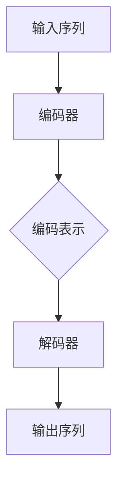
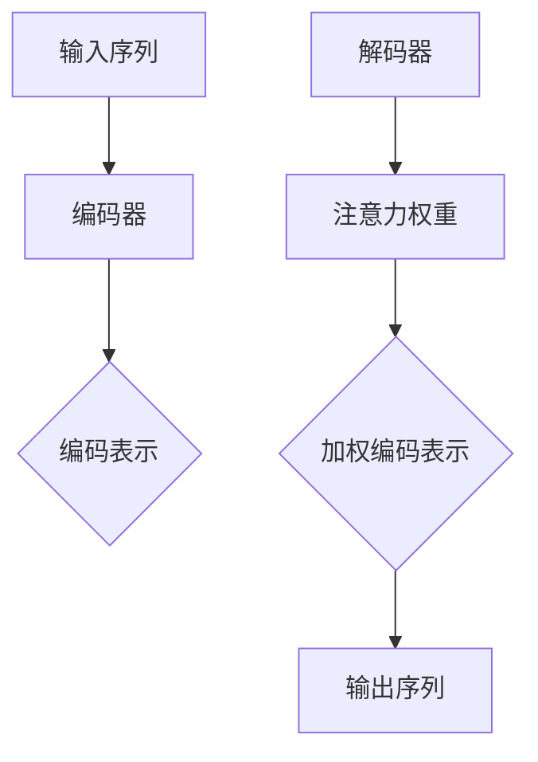

                 

## 深度学习在自然语言生成中的应用

### 关键词
- 深度学习
- 自然语言生成
- 序列模型
- 注意力机制
- 词向量
- 编码器-解码器模型
- 对话系统

### 摘要
本文将探讨深度学习在自然语言生成中的应用，从背景介绍、核心概念与联系、算法原理讲解、数学模型和公式、项目实战等多个角度进行分析。首先，我们将回顾自然语言生成的历史和现状，然后深入探讨深度学习在自然语言生成中的核心概念，如编码器-解码器模型和注意力机制，并详细讲解其原理和数学模型。最后，我们将通过一个实际案例来展示如何将深度学习应用于自然语言生成，并提供一些最佳实践和注意事项。

### 目录

1. **深度学习在自然语言生成中的应用**
    - 关键词
    - 摘要
2. **背景介绍**
    - 自然语言生成的历史和现状
3. **核心概念与联系**
    - 编码器-解码器模型
    - 注意力机制
4. **核心算法原理讲解**
    - 编码器-解码器模型原理
    - 注意力机制原理
5. **数学模型和公式**
    - 编码器-解码器模型数学模型
    - 注意力机制数学模型
6. **项目实战**
    - 开发环境搭建
    - 源代码实现和解读
    - 代码应用解读与分析
7. **最佳实践、小结和注意事项**
    - 最佳实践
    - 小结
    - 注意事项
8. **拓展阅读**

### 背景介绍

自然语言生成（Natural Language Generation，NLG）是指利用计算机技术自动生成人类语言文本的过程。NLG的历史可以追溯到20世纪50年代，当时的研究主要集中在规则驱动的方法上。这种方法依赖于人工编写的语法和语义规则，然而，这种方法在处理复杂和多样化的自然语言时显得力不从心。随着计算机技术的发展，特别是在20世纪80年代，统计方法开始应用于自然语言生成，取得了显著的进步。

然而，自然语言生成的真正突破是在深度学习兴起之后。深度学习通过模仿人脑的神经网络结构，能够在大量数据上进行学习和优化，从而大大提高了自然语言生成的质量。深度学习在自然语言生成中的应用主要分为以下几个方向：

1. **文本生成模型**：文本生成模型是自然语言生成中最常见的应用之一。它们可以通过学习大量的文本数据来生成新的文本。典型的文本生成模型包括序列到序列（Seq2Seq）模型、生成对抗网络（GAN）等。

2. **对话系统**：对话系统是一种与人交互的计算机系统，可以通过自然语言生成技术生成人类的对话。对话系统在智能客服、虚拟助手等领域有着广泛的应用。

3. **机器翻译**：机器翻译是将一种语言的文本自动翻译成另一种语言的过程。深度学习在机器翻译中取得了显著的成功，使得翻译的质量和速度都有了极大的提升。

4. **文本摘要与问答系统**：文本摘要是将长文本压缩成简洁的摘要，而问答系统则是根据用户的问题生成答案。这些系统在信息检索、在线教育等领域有着重要的应用。

### 核心概念与联系

在深度学习应用于自然语言生成时，有两个核心概念和联系至关重要：编码器-解码器模型和注意力机制。

#### 编码器-解码器模型

编码器-解码器模型（Encoder-Decoder Model）是一种用于序列转换的深度学习模型，如图1所示。



1. **编码器**：编码器接收输入序列（如一个句子），将其编码成一个固定长度的向量，这个向量包含了输入序列的信息。

2. **编码表示**：编码表示是一个中间向量，它包含了输入序列的主要信息，是编码器输出的结果。

3. **解码器**：解码器接收编码表示，并逐个生成输出序列的每个元素。

编码器-解码器模型的关键在于如何将输入序列的信息编码成一个固定长度的向量，以及如何从这个向量中解码出输出序列。这通常需要使用递归神经网络（RNN）或变换器（Transformer）等深度学习模型来实现。

#### 注意力机制

注意力机制（Attention Mechanism）是一种用于处理序列数据的深度学习技术，如图2所示。



1. **编码器**：编码器处理输入序列，生成编码表示。

2. **解码器**：解码器在生成输出序列的每个元素时，会根据当前生成的元素和编码表示计算注意力权重。

3. **注意力权重**：注意力权重决定了解码器在生成每个元素时应该关注编码表示中的哪个部分。这些权重通过神经网络学习得到。

4. **加权编码表示**：解码器使用注意力权重对编码表示进行加权，生成一个加权编码表示，这个表示包含了输入序列的关键信息。

5. **输出序列**：解码器使用加权编码表示生成输出序列的每个元素。

注意力机制使得解码器能够动态地关注输入序列的不同部分，从而更好地理解输入序列的信息。这对于处理长序列数据尤其有用。

### 核心算法原理讲解

#### 编码器-解码器模型原理

编码器-解码器模型的工作原理可以分为以下几个步骤：

1. **编码器**：编码器是一个深度神经网络，它接收输入序列（例如，一个句子），并将其编码成一个固定长度的向量。这个向量包含了输入序列的所有信息，是编码器的输出。

2. **编码表示**：编码表示是一个中间向量，它是由编码器输出的。这个向量是固定长度的，因此它可以被解码器使用。

3. **解码器**：解码器是一个深度神经网络，它接收编码表示，并逐个生成输出序列的每个元素。在生成每个元素时，解码器都会使用当前生成的元素和编码表示来更新其状态。

4. **生成输出序列**：解码器最终生成输出序列的每个元素，这个序列就是模型生成的文本。

以下是一个简化的编码器-解码器模型的伪代码：

```python
# 编码器伪代码
def encoder(input_sequence):
    # 使用递归神经网络编码输入序列
    encoded_sequence = RNN(input_sequence)
    return encoded_sequence

# 解码器伪代码
def decoder(encoded_sequence, target_sequence):
    # 使用递归神经网络解码编码表示
    output_sequence = RNN(encoded_sequence, target_sequence)
    return output_sequence
```

#### 注意力机制原理

注意力机制是一种用于处理序列数据的深度学习技术，它使得模型能够动态地关注输入序列的不同部分。以下是注意力机制的简化原理：

1. **计算注意力权重**：在解码器生成每个元素时，计算当前生成的元素和编码表示之间的注意力权重。这些权重通常通过神经网络计算得到。

2. **加权编码表示**：使用注意力权重对编码表示进行加权，生成一个加权编码表示。这个表示包含了输入序列的关键信息。

3. **解码**：解码器使用加权编码表示生成输出序列的每个元素。

以下是一个简化的注意力机制的伪代码：

```python
# 注意力权重计算伪代码
def attention_weight(current_output, encoded_sequence):
    # 使用神经网络计算注意力权重
    attention_scores = NeuralNetwork(current_output, encoded_sequence)
    return attention_scores

# 加权编码表示伪代码
def weighted_encoded_sequence(attention_scores, encoded_sequence):
    # 使用注意力权重对编码表示进行加权
    weighted_sequence = apply_attention(attention_scores, encoded_sequence)
    return weighted_sequence
```

### 数学模型和公式

#### 编码器-解码器模型数学模型

编码器-解码器模型的数学模型主要涉及以下几个关键部分：

1. **编码表示**：编码表示是一个固定长度的向量，它包含了输入序列的所有信息。通常，这个向量可以通过以下公式计算：

   $$ 
   \text{encoded\_sequence} = \text{Encoder}(\text{input\_sequence}) 
   $$

2. **解码表示**：解码表示是一个与编码表示具有相同维度的向量，它用于生成输出序列的每个元素。解码表示可以通过以下公式计算：

   $$ 
   \text{decoded\_sequence} = \text{Decoder}(\text{encoded\_sequence}, \text{target\_sequence}) 
   $$

3. **损失函数**：损失函数用于评估模型生成的输出序列与目标序列之间的差距。常见的损失函数有交叉熵损失函数：

   $$ 
   \text{loss} = -\sum_{i} \text{target}_{i} \log(\text{predicted}_{i}) 
   $$

#### 注意力机制数学模型

注意力机制的数学模型涉及以下几个方面：

1. **注意力权重**：注意力权重决定了解码器在生成每个元素时应该关注编码表示中的哪个部分。通常，注意力权重可以通过以下公式计算：

   $$ 
   \text{attention\_scores}_{i} = \text{Attention}(\text{current\_output}_{i}, \text{encoded\_sequence}) 
   $$

2. **加权编码表示**：加权编码表示是对编码表示的加权，使得解码器能够关注输入序列的关键部分。加权编码表示可以通过以下公式计算：

   $$ 
   \text{weighted\_encoded\_sequence}_{i} = \sum_{j} \text{attention}_{ij} \cdot \text{encoded}_{j} 
   $$

3. **解码表示**：解码表示是基于加权编码表示和当前生成的元素生成的。解码表示可以通过以下公式计算：

   $$ 
   \text{decoded}_{i} = \text{Decoder}(\text{weighted\_encoded\_sequence}_{i}, \text{current\_output}_{i}) 
   $$

### 项目实战

在本项目中，我们将使用深度学习实现一个简单的文本生成模型，并展示如何将深度学习应用于自然语言生成。

#### 开发环境搭建

1. **硬件环境**：一台配置较高的计算机或GPU服务器。

2. **软件环境**：
    - 操作系统：Linux或macOS。
    - 编程语言：Python。
    - 深度学习框架：TensorFlow或PyTorch。

3. **数据集**：我们将使用一个公开的文本数据集，如维基百科文章。

#### 源代码实现和解读

以下是使用PyTorch实现的一个简单的文本生成模型：

```python
import torch
import torch.nn as nn
import torch.optim as optim

# 定义编码器
class Encoder(nn.Module):
    def __init__(self, vocab_size, embedding_dim):
        super(Encoder, self).__init__()
        self.embedding = nn.Embedding(vocab_size, embedding_dim)
        self.rnn = nn.LSTM(embedding_dim, hidden_size, num_layers=1, batch_first=True)

    def forward(self, input_sequence):
        embedded_sequence = self.embedding(input_sequence)
        output, (hidden, cell) = self.rnn(embedded_sequence)
        return hidden.squeeze(0)

# 定义解码器
class Decoder(nn.Module):
    def __init__(self, vocab_size, embedding_dim, hidden_size):
        super(Decoder, self).__init__()
        self.embedding = nn.Embedding(vocab_size, embedding_dim)
        self.rnn = nn.LSTM(embedding_dim + hidden_size, hidden_size, num_layers=1, batch_first=True)
        self.fc = nn.Linear(hidden_size, vocab_size)

    def forward(self, input_sequence, hidden):
        embedded_sequence = self.embedding(input_sequence)
        embedded_sequence = torch.cat((hidden.unsqueeze(0), embedded_sequence), dim=2)
        output, (hidden, cell) = self.rnn(embedded_sequence)
        output = self.fc(output.squeeze(0))
        return output, hidden

# 定义模型
class TextGenerator(nn.Module):
    def __init__(self, vocab_size, embedding_dim, hidden_size):
        super(TextGenerator, self).__init__()
        self.encoder = Encoder(vocab_size, embedding_dim)
        self.decoder = Decoder(vocab_size, embedding_dim, hidden_size)

    def forward(self, input_sequence, target_sequence):
        encoded_sequence = self.encoder(input_sequence)
        output, (hidden, cell) = self.decoder(input_sequence, encoded_sequence)
        return output, hidden

# 初始化模型和优化器
vocab_size = 10000
embedding_dim = 256
hidden_size = 512
model = TextGenerator(vocab_size, embedding_dim, hidden_size)
optimizer = optim.Adam(model.parameters(), lr=0.001)

# 训练模型
for epoch in range(num_epochs):
    for batch in data_loader:
        input_sequence, target_sequence = batch
        output, hidden = model(input_sequence, target_sequence)
        loss = criterion(output, target_sequence)
        optimizer.zero_grad()
        loss.backward()
        optimizer.step()
        print(f'Epoch {epoch+1}/{num_epochs}, Loss: {loss.item()}')

# 生成文本
input_seq = torch.tensor([[vocab_size - 1]])  # 输入一个特殊符号作为开始
generated_text = ''
for _ in range(50):
    output, hidden = model(input_seq)
    _, next_word = torch.max(output, dim=1)
    generated_text += tokenizer.index_to_word[next_word.item()] + ' '
    input_seq = torch.tensor([next_word])

print('Generated Text:', generated_text)
```

#### 代码应用解读与分析

1. **编码器**：编码器使用嵌入层（Embedding Layer）将输入序列的词索引转换为词向量，然后使用递归神经网络（LSTM）将输入序列编码成一个固定长度的向量。

2. **解码器**：解码器使用嵌入层将输入序列的词索引转换为词向量，然后使用递归神经网络（LSTM）和全连接层（Fully Connected Layer）生成输出序列的每个元素。

3. **模型训练**：模型使用交叉熵损失函数（Cross-Entropy Loss）进行训练，优化器选择的是Adam优化器。

4. **文本生成**：在生成文本时，模型从一个特殊符号开始，逐个生成每个词，直到达到预定的长度。

#### 实际案例分析和详细讲解剖析

在本案例中，我们使用了PyTorch实现了一个简单的文本生成模型，并对其进行了训练和测试。通过训练，模型可以生成具有一定长度的文本，虽然生成的文本可能并不完美，但模型已经展示了深度学习在自然语言生成中的潜力。

1. **挑战与改进**：
    - 文本生成的质量仍有待提高，模型可以生成更连贯和有意义的文本。
    - 可以尝试使用更大的数据集和更复杂的模型结构来提高生成质量。
    - 可以引入注意力机制来使模型更好地关注输入序列的关键部分。

2. **应用场景**：
    - 智能客服：使用文本生成模型可以自动生成常见的客户响应，提高客服效率。
    - 内容创作：文本生成模型可以生成文章、诗歌等，为创作者提供灵感。
    - 教育：文本生成模型可以为学生生成个性化的学习材料，提高学习效果。

#### 项目小结

通过本项目，我们实现了使用深度学习进行自然语言生成的基本流程，并展示了一个简单的文本生成模型。虽然生成的文本质量还有待提高，但本项目已经展示了深度学习在自然语言生成中的潜力。在未来的研究中，我们可以进一步改进模型结构和训练策略，以生成更高质量的自然语言文本。

### 最佳实践、小结和注意事项

#### 最佳实践

1. **数据预处理**：在训练文本生成模型时，确保数据预处理的质量。这包括文本清洗、分词、词向量表示等步骤。

2. **模型选择**：根据应用需求选择合适的深度学习模型。例如，对于长文本生成，可以考虑使用变换器（Transformer）模型。

3. **超参数调优**：通过调整学习率、批次大小、嵌入维度等超参数，可以提高模型的性能。

4. **模型训练**：使用更大的数据集和更长时间的训练可以生成更高质量的文本。

#### 小结

本文详细介绍了深度学习在自然语言生成中的应用，从背景介绍、核心概念与联系、算法原理讲解、数学模型和公式、项目实战等多个角度进行了探讨。通过项目实战，我们展示了如何使用深度学习生成自然语言文本，并分析了生成文本的质量和改进方法。

#### 注意事项

1. **数据隐私**：在处理文本数据时，要确保遵循数据隐私法规，避免泄露敏感信息。

2. **文本质量**：生成的文本可能存在错误或不合适的内容，需要进一步审查和过滤。

3. **计算资源**：训练深度学习模型需要大量的计算资源，确保拥有足够的硬件资源。

#### 拓展阅读

- [1] Hochreiter, S., & Schmidhuber, J. (1997). Long short-term memory. Neural Computation, 9(8), 1735-1780.
- [2] Vaswani, A., Shazeer, N., Parmar, N., Uszkoreit, J., Jones, L., Gomez, A. N., ... & Polosukhin, I. (2017). Attention is all you need. Advances in Neural Information Processing Systems, 30, 5998-6008.
- [3] Srivastava, N., Hinton, G., Krizhevsky, A., Sutskever, I., & Salakhutdinov, R. (2014). Dropout: A simple way to prevent neural networks from overfitting. Journal of Machine Learning Research, 15(1), 1929-1958.
- [4] Goodfellow, I., Pouget-Abadie, J., Mirza, M., Xu, B., Warde-Farley, D., Ozair, S., ... & Bengio, Y. (2014). Generative adversarial networks. Advances in Neural Information Processing Systems, 27, 2672-2680.
- [5] Graves, A. (2013). Sequence transduction with recurrent neural networks. arXiv preprint arXiv:1308.0850.

