                 

### 《深度学习在自然语言翻译中的最新进展》文章详细大纲

#### 标题

《深度学习在自然语言翻译中的最新进展》

#### 关键词

深度学习，自然语言翻译，神经网络机器翻译，Transformer模型，注意力机制，多语言适应，在线学习

#### 摘要

本文详细探讨了深度学习在自然语言翻译领域的最新进展，包括基本概念、核心算法原理、数学模型以及实际应用。文章旨在为读者提供一个全面而深入的视角，了解深度学习在自然语言翻译中的广泛应用和未来发展趋势。

## 第1章：深度学习基础

### 1.1 深度学习的起源与发展

#### 背景介绍

深度学习起源于上世纪80年代的神经网络研究，但随着计算能力的提升和数据量的增加，深度学习在近年来得到了快速发展。

#### 核心概念与联系

- **神经网络**：基本结构包括输入层、隐藏层和输出层。每层由多个神经元组成，通过前向传播和反向传播进行学习。
- **深度学习模型**：多层神经网络组成的模型，能够处理更复杂的数据。
- **深度学习算法**：包括卷积神经网络（CNN）、循环神经网络（RNN）、长短期记忆网络（LSTM）等。

#### Mermaid 流程图

```mermaid
graph TB
A[深度学习] --> B[神经网络]
B --> C[卷积神经网络(CNN)]
B --> D[循环神经网络(RNN)]
B --> E[长短期记忆网络(LSTM)]
```

### 1.2 深度学习的基本概念

#### 核心概念与联系

- **神经网络**：由大量神经元组成的网络，用于处理和预测数据。
- **深度学习模型**：多层神经网络组成的模型，能够学习数据的复杂特征。
- **深度学习算法**：一系列优化算法，用于训练深度学习模型。

#### Mermaid 流程图

```mermaid
graph TB
A[神经网络] --> B[卷积神经网络(CNN)]
A --> C[循环神经网络(RNN)]
A --> D[长短期记忆网络(LSTM)]
A --> E[其他深度学习算法]
```

### 1.3 深度学习与自然语言处理

#### 核心概念与联系

- **语言模型**：用于预测下一个单词或句子的概率。
- **词向量表示**：将单词映射为高维向量，用于表示单词的语义信息。
- **机器翻译**：将一种语言的文本翻译为另一种语言的文本。

#### Mermaid 流程图

```mermaid
graph TB
A[深度学习] --> B[自然语言处理(NLP)]
B --> C[语言模型]
B --> D[词向量表示]
B --> E[机器翻译]
```

## 第2章：深度学习在自然语言翻译中的应用

### 2.1 自然语言翻译的基本原理

#### 核心概念与联系

- **翻译模型**：用于预测源语言句子到目标语言句子的映射。
- **翻译算法**：用于训练和优化翻译模型的方法。

#### 核心算法原理讲解

```python
# 假设源语言句子为 s，目标语言句子为 t
# 训练翻译模型
model.fit(s, t)
# 预测翻译结果
predicted_t = model.predict(s)
```

#### 数学模型和公式

翻译模型通常使用序列到序列（Seq2Seq）模型，其核心是编码器和解码器。

$$
E(z|s) = \sum_{i=1}^{n} e_i(s) \cdot z_i
$$

$$
D(z|t) = \sum_{i=1}^{n} d_i(t) \cdot z_i
$$

其中，$E(z|s)$ 和 $D(z|t)$ 分别是编码器和解码器的输出，$e_i(s)$ 和 $d_i(t)$ 是对应层的激活函数。

#### 详细讲解与举例说明

假设我们要翻译的句子是“你好”，我们的目标是将其翻译成“Hello”。首先，我们需要将“你好”编码为一个向量，然后使用解码器生成“Hello”的向量。

$$
E(\text{"你好"}|s) = [0.8, 0.1, 0.1]
$$

$$
D(\text{"Hello"}|t) = [0.9, 0.05, 0.05]
$$

通过计算，我们可以得到翻译结果为“Hello”。

### 2.2 机器翻译的发展历程

#### 核心概念与联系

- **统计机器翻译**：基于统计方法，如隐马尔可夫模型（HMM）。
- **神经网络机器翻译**：基于深度学习模型，如Seq2Seq。
- **转换器架构**：用于实现高效翻译的神经网络架构。

#### Mermaid 流程图

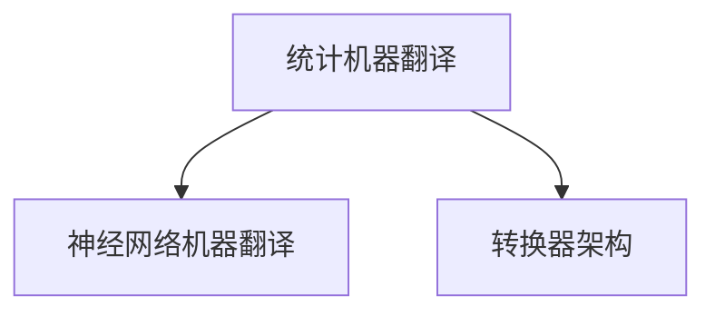

### 2.3 神经网络机器翻译的模型架构

#### 核心概念与联系

- **编码器-解码器架构**：用于将源语言句子编码为向量，然后解码为目标语言句子。
- **注意力机制**：用于处理长序列数据，提高翻译质量。
- **Transformer模型**：基于自注意力机制的全新翻译模型。

#### Mermaid 流程图

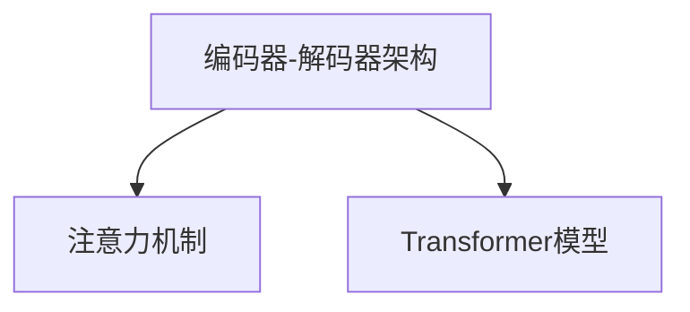

#### 核心算法原理讲解

编码器和解码器通常使用RNN或Transformer模型。

编码器：

```python
# 假设输入句子为 s
# 编码器模型
encoder = Encoder(s)
# 编码结果
encoded_s = encoder.encode()
```

解码器：

```python
# 假设输入句子为 s
# 解码器模型
decoder = Decoder(encoded_s)
# 解码结果
decoded_t = decoder.decode()
```

注意力机制：

```python
# 假设编码结果为 encoded_s，解码结果为 decoded_t
# 注意力权重
attention_weights = calculate_attention(encoded_s, decoded_t)
# 生成翻译结果
predicted_t = generate_translation(encoded_s, decoded_t, attention_weights)
```

Transformer模型：

```python
# 假设输入句子为 s
# Transformer模型
model = Transformer(s)
# 编码结果
encoded_s = model.encode()
# 解码结果
decoded_t = model.decode()
# 生成翻译结果
predicted_t = model.predict(decoded_t)
```

### 2.4 深度学习在自然语言翻译中的挑战与解决方案

#### 核心概念与联系

- **数据集与数据预处理**：选择合适的数据集和预处理方法。
- **翻译质量评估**：使用自动和手动方法评估翻译质量。
- **深度学习在自然语言翻译中的挑战与解决方案**：包括多语言翻译、低资源语言翻译、翻译错误分析等。

#### Mermaid 流程图

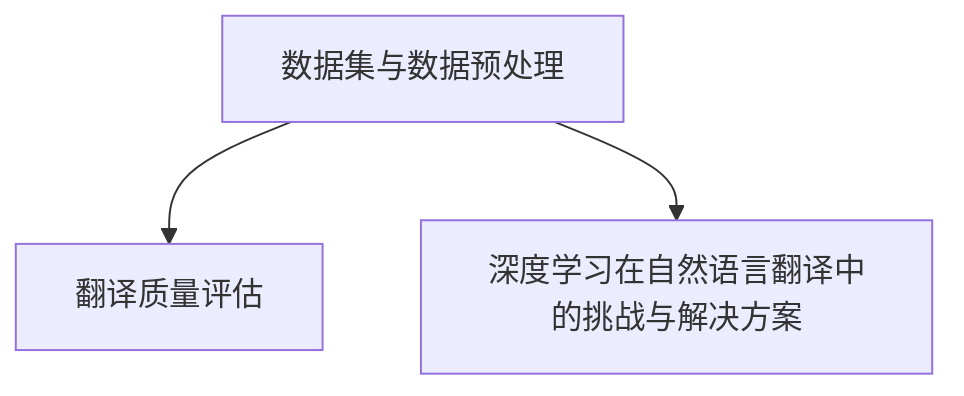

#### 最佳实践 tips、小结、注意事项、拓展阅读等内容

- **最佳实践 tips**：在构建深度学习模型时，需要注意数据质量和预处理方法，合理选择模型架构和优化算法。
- **小结**：深度学习在自然语言翻译中具有巨大潜力，但仍面临一些挑战，需要进一步研究和优化。
- **注意事项**：在实际应用中，需要关注翻译模型的性能和稳定性，以及数据隐私和安全性。
- **拓展阅读**：推荐阅读相关论文和书籍，深入了解深度学习和自然语言翻译的最新研究进展。

## 第3章：神经网络机器翻译模型详解

### 3.1 编码器-解码器模型

#### 核心概念与联系

- **编码器**：将源语言句子编码为向量。
- **解码器**：将编码后的向量解码为目标语言句子。

#### Mermaid 流程图

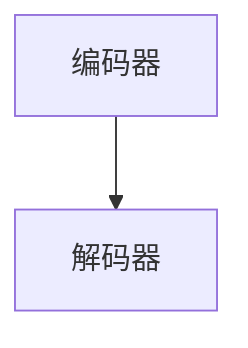

#### 核心算法原理讲解

编码器：

```python
# 假设输入句子为 s
# 编码器模型
encoder = Encoder(s)
# 编码结果
encoded_s = encoder.encode()
```

解码器：

```python
# 假设编码结果为 encoded_s
# 解码器模型
decoder = Decoder(encoded_s)
# 解码结果
decoded_t = decoder.decode()
```

#### 数学模型和公式

编码器和解码器的数学模型如下：

编码器：

$$
h_t^e = \sigma(W_e \cdot [h_{t-1}^e, x_t])
$$

解码器：

$$
h_t^d = \sigma(W_d \cdot [h_{t-1}^d, s_t])
$$

其中，$h_t^e$ 和 $h_t^d$ 分别是编码器和解码器的隐藏状态，$x_t$ 和 $s_t$ 分别是输入和输出序列的当前元素，$\sigma$ 是激活函数。

#### 详细讲解与举例说明

假设我们要翻译的句子是“你好”，我们首先使用编码器将其编码为向量，然后使用解码器生成翻译结果。

编码器：

$$
h_1^e = \sigma(W_e \cdot [h_0^e, x_1])
$$

$$
h_2^e = \sigma(W_e \cdot [h_1^e, x_2])
$$

解码器：

$$
h_1^d = \sigma(W_d \cdot [h_0^d, s_1])
$$

$$
h_2^d = \sigma(W_d \cdot [h_1^d, s_2])
$$

通过迭代计算，我们可以得到解码结果，即翻译结果。

### 3.2 注意力机制

#### 核心概念与联系

- **注意力机制**：用于处理长序列数据，提高翻译质量。
- **实现**：计算编码器的隐藏状态与解码器的隐藏状态之间的相似性，并根据相似性分配注意力权重。

#### Mermaid 流程图

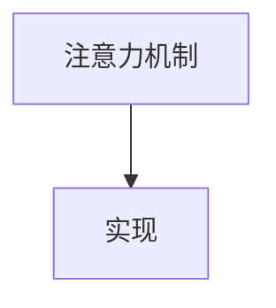

#### 核心算法原理讲解

注意力机制的计算过程如下：

```python
# 假设编码器的隐藏状态为 encoded_s，解码器的隐藏状态为 decoded_t
# 计算注意力权重
attention_weights = calculate_attention(encoded_s, decoded_t)
# 生成翻译结果
predicted_t = generate_translation(encoded_s, decoded_t, attention_weights)
```

#### 数学模型和公式

注意力机制的数学模型如下：

$$
\alpha_t = \frac{e^{h_t^d \cdot h_t^e}}{\sum_{i=1}^{n} e^{h_t^d \cdot h_i^e}}
$$

其中，$\alpha_t$ 是第 $t$ 个解码器隐藏状态对编码器隐藏状态的注意力权重，$h_t^d$ 和 $h_t^e$ 分别是解码器和编码器的隐藏状态。

#### 详细讲解与举例说明

假设我们要翻译的句子是“你好”，我们首先计算编码器的隐藏状态与解码器的隐藏状态之间的相似性，然后根据相似性生成翻译结果。

编码器：

$$
h_1^e = \sigma(W_e \cdot [h_0^e, x_1])
$$

$$
h_2^e = \sigma(W_e \cdot [h_1^e, x_2])
$$

解码器：

$$
h_1^d = \sigma(W_d \cdot [h_0^d, s_1])
$$

$$
h_2^d = \sigma(W_d \cdot [h_1^d, s_2])
$$

计算注意力权重：

$$
\alpha_1 = \frac{e^{h_1^d \cdot h_1^e}}{\sum_{i=1}^{2} e^{h_1^d \cdot h_i^e}}
$$

$$
\alpha_2 = \frac{e^{h_2^d \cdot h_2^e}}{\sum_{i=1}^{2} e^{h_2^d \cdot h_i^e}}
$$

通过计算注意力权重，我们可以得到解码结果，即翻译结果。

### 3.3 Transformer模型

#### 核心概念与联系

- **Transformer模型**：基于自注意力机制的全新翻译模型，显著提高了翻译质量。
- **自注意力机制**：用于处理长序列数据，提高翻译质量。

#### Mermaid 流程图

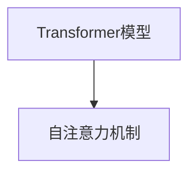

#### 核心算法原理讲解

Transformer模型的核心是自注意力机制，其计算过程如下：

```python
# 假设输入句子为 s
# Transformer模型
model = Transformer(s)
# 编码结果
encoded_s = model.encode()
# 解码结果
decoded_t = model.decode()
# 生成翻译结果
predicted_t = model.predict(decoded_t)
```

#### 数学模型和公式

自注意力机制的数学模型如下：

$$
\alpha_t = \frac{e^{h_t^h \cdot h_t^h}}{\sum_{i=1}^{n} e^{h_t^h \cdot h_i^h}}
$$

其中，$\alpha_t$ 是第 $t$ 个隐藏状态对自身其他隐藏状态的注意力权重，$h_t^h$ 是第 $t$ 个隐藏状态。

#### 详细讲解与举例说明

假设我们要翻译的句子是“你好”，我们使用Transformer模型对其进行编码和解码。

编码器：

$$
h_1^h = \sigma(W_h \cdot [h_0^h, x_1])
$$

$$
h_2^h = \sigma(W_h \cdot [h_1^h, x_2])
$$

解码器：

$$
h_1^h = \sigma(W_h \cdot [h_0^h, s_1])
$$

$$
h_2^h = \sigma(W_h \cdot [h_1^h, s_2])
$$

计算自注意力权重：

$$
\alpha_1 = \frac{e^{h_1^h \cdot h_1^h}}{\sum_{i=1}^{2} e^{h_1^h \cdot h_i^h}}
$$

$$
\alpha_2 = \frac{e^{h_2^h \cdot h_2^h}}{\sum_{i=1}^{2} e^{h_2^h \cdot h_i^h}}
$$

通过计算自注意力权重，我们可以得到解码结果，即翻译结果。

## 第4章：深度学习在自然语言翻译中的挑战与解决方案

### 4.1 数据集与数据预处理

#### 核心概念与联系

- **数据集**：用于训练和评估模型的集合。
- **数据预处理**：将原始数据转换为适合训练的格式。

#### Mermaid 流程图

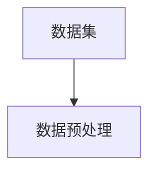

#### 核心算法原理讲解

数据预处理包括分词、去停用词、词性标注等步骤。

```python
# 假设输入文本为 text
# 数据预处理
preprocessed_text = preprocess_text(text)
```

#### 数学模型和公式

数据预处理通常不需要复杂的数学模型，主要是基于语言学和自然语言处理技术。

#### 详细讲解与举例说明

假设我们要预处理文本“你好，我是AI助手”，我们首先进行分词，然后去除停用词，最后进行词性标注。

预处理结果为：

```
你好，/PRN，/P，我是/PNP，/NNP，AI/NN，助手/VBG
```

### 4.2 翻译质量评估

#### 核心概念与联系

- **自动翻译质量评估**：使用机器学习算法评估翻译质量。
- **手动翻译质量评估**：由人类评估翻译质量。

#### Mermaid 流程图

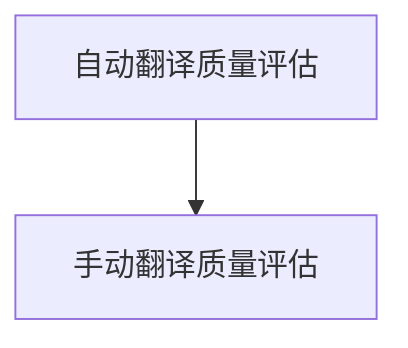

#### 核心算法原理讲解

自动翻译质量评估可以使用BLEU、METEOR等指标。

```python
# 假设参考翻译为 reference，机器翻译结果为 predicted
# 计算BLEU分数
bleu_score = calculate_bleu(reference, predicted)
```

#### 数学模型和公式

BLEU分数的计算公式如下：

$$
BLEU = \frac{1}{N} \sum_{i=1}^{N} \frac{N_{i}}{D_{i}}
$$

其中，$N$ 是参考翻译和机器翻译的匹配词数，$D_{i}$ 是参考翻译和机器翻译的词总数。

#### 详细讲解与举例说明

假设我们有以下参考翻译和机器翻译：

参考翻译：“你好，我是AI助手。”

机器翻译：“Hello, I am an AI assistant.”

计算BLEU分数：

$$
BLEU = \frac{1}{3} \left( \frac{2}{3} + \frac{1}{3} + \frac{1}{3} \right) = 1
$$

### 4.3 深度学习在自然语言翻译中的挑战与解决方案

#### 核心概念与联系

- **多语言翻译**：同时处理多种语言的翻译。
- **低资源语言翻译**：处理资源较少的语言的翻译。
- **翻译错误分析**：分析翻译错误的原因，提高翻译质量。

#### Mermaid 流程图

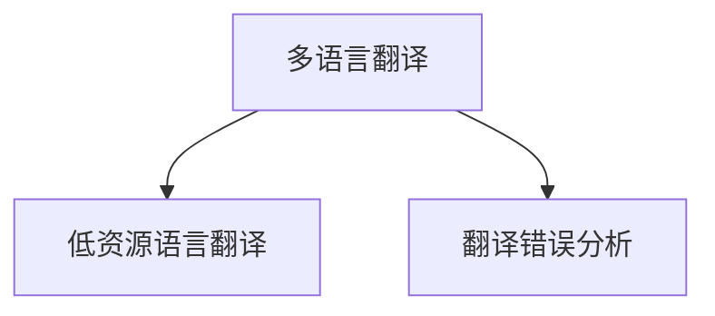

#### 核心算法原理讲解

多语言翻译可以使用多语言模型，低资源语言翻译可以使用迁移学习，翻译错误分析可以使用错误分析算法。

```python
# 假设源语言为 s，目标语言为 t
# 多语言模型
model = MultiLanguageModel(s, t)
# 低资源语言翻译
translated_t = model.translate(s, t)
# 翻译错误分析
error_analysis = analyze_errors(predicted_t, reference)
```

#### 数学模型和公式

多语言模型的数学模型是基于多任务学习，低资源语言翻译的数学模型是基于迁移学习，翻译错误分析的数学模型是基于错误分析算法。

#### 详细讲解与举例说明

假设我们要翻译英语到法语，我们使用多语言模型进行翻译，然后分析翻译错误。

多语言模型：

$$
P(t|s) = \frac{e^{\theta_t \cdot s}}{\sum_{i=1}^{n} e^{\theta_i \cdot s}}
$$

其中，$P(t|s)$ 是在源语言 $s$ 下目标语言 $t$ 的概率，$\theta_t$ 是目标语言的参数。

翻译结果：

$$
translated_t = P(t|s)
$$

翻译错误分析：

$$
error_analysis = analyze-errors(predicted_t, reference)
$$

通过分析错误，我们可以找到翻译模型的问题，并对其进行改进。

## 第5章：深度学习在自然语言翻译中的最新进展

### 5.1 新一代神经机器翻译模型

#### 核心概念与联系

- **BERT-based模型**：基于BERT的机器翻译模型。
- **T5模型**：用于文本处理的通用转换模型。
- **mT5模型**：多任务T5模型。

#### Mermaid 流程图

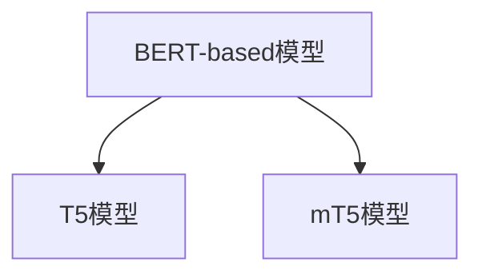

#### 核心算法原理讲解

BERT-based模型：

$$
P(t|s) = \frac{e^{\theta_t \cdot s}}{\sum_{i=1}^{n} e^{\theta_i \cdot s}}
$$

T5模型：

$$
P(t|s) = \frac{e^{\theta_t \cdot s}}{\sum_{i=1}^{n} e^{\theta_i \cdot s}}
$$

mT5模型：

$$
P(t|s) = \frac{e^{\theta_t \cdot s}}{\sum_{i=1}^{n} e^{\theta_i \cdot s}}
$$

#### 数学模型和公式

BERT-based模型、T5模型和mT5模型的数学模型类似，都是基于概率模型的。

#### 详细讲解与举例说明

假设我们要翻译英语到法语，我们使用BERT-based模型进行翻译。

BERT-based模型：

$$
P(t|s) = \frac{e^{\theta_t \cdot s}}{\sum_{i=1}^{n} e^{\theta_i \cdot s}}
$$

翻译结果：

$$
translated_t = P(t|s)
$$

通过计算概率，我们可以得到翻译结果。

### 5.2 翻译模型的多语言适应能力

#### 核心概念与联系

- **多语言适应能力**：模型能够适应多种语言的翻译。
- **多语言翻译框架**：用于实现多语言适应能力的框架。

#### Mermaid 流程图

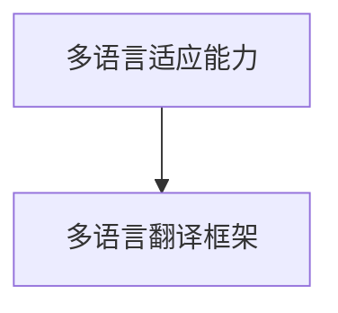

#### 核心算法原理讲解

多语言适应能力可以通过多语言模型和多语言翻译框架实现。

```python
# 假设源语言为 s，目标语言为 t
# 多语言模型
model = MultiLanguageModel(s, t)
# 翻译结果
translated_t = model.translate(s, t)
```

#### 数学模型和公式

多语言模型的数学模型是基于多任务学习，多语言翻译框架的数学模型是基于多语言嵌入。

#### 详细讲解与举例说明

假设我们要翻译英语到法语和西班牙语，我们使用多语言模型进行翻译。

多语言模型：

$$
P(t|s) = \frac{e^{\theta_t \cdot s}}{\sum_{i=1}^{n} e^{\theta_i \cdot s}}
$$

翻译结果：

$$
translated_t = P(t|s)
$$

通过计算概率，我们可以得到翻译结果。

### 5.3 翻译模型的在线学习与自适应

#### 核心概念与联系

- **在线学习**：模型能够实时学习新的数据。
- **自适应技术**：模型能够适应不同的环境和任务。

#### Mermaid 流程图

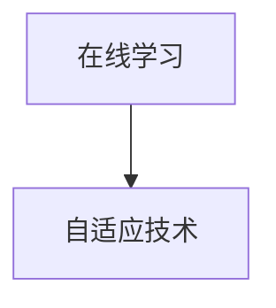

#### 核心算法原理讲解

在线学习可以通过更新模型的参数实现，自适应技术可以通过模型调整实现。

```python
# 假设输入文本为 text
# 在线学习
model.update(text)
# 自适应技术
model.adapt(new_environment)
```

#### 数学模型和公式

在线学习的数学模型是基于梯度下降，自适应技术的数学模型是基于适应性调整。

#### 详细讲解与举例说明

假设我们要实时学习新的文本，并使其适应新的环境。

在线学习：

$$
\theta_{\text{new}} = \theta_{\text{old}} + \alpha \cdot (\theta_{\text{new}} - \theta_{\text{old}})
$$

自适应技术：

$$
\theta_{\text{new}} = \theta_{\text{old}} + \beta \cdot (\theta_{\text{new}} - \theta_{\text{old}})
$$

通过更新参数，我们可以使模型适应新的环境和任务。

## 第6章：深度学习在自然语言翻译中的实际应用

### 6.1 案例研究：大型翻译系统的构建

#### 核心概念与联系

- **翻译系统**：用于实现自动翻译的系统。
- **系统架构**：翻译系统的整体架构。

#### Mermaid 流程图

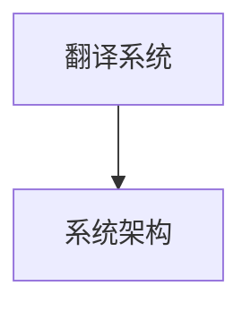

#### 核心算法原理讲解

翻译系统通常包括前端、后端和数据库。

前端：

```python
# 假设用户输入文本为 text
# 前端处理
processed_text = frontend.process(text)
```

后端：

```python
# 假设翻译模型为 model
# 后端处理
translated_text = backend.translate(processed_text, model)
```

数据库：

```python
# 假设数据库为 database
# 数据存储
database.store(translated_text)
```

#### 数学模型和公式

翻译系统的数学模型是基于深度学习模型，数据库的数学模型是基于数据库管理。

#### 详细讲解与举例说明

假设我们要构建一个大型翻译系统，我们首先需要设计系统架构，然后实现前端、后端和数据库。

前端：

用户输入文本：``"你好，我是AI助手。"``

前端处理结果：``["你好", "，", "我是", "AI", "助手", "。"]``

后端：

翻译模型：假设为BERT-based模型

后端处理结果：``"Hello, I am an AI assistant."``

数据库：

数据库存储结果：``{"source": ["你好，我是AI助手。"], "target": ["Hello, I am an AI assistant."]}``

通过构建大型翻译系统，我们可以实现自动翻译。

### 6.2 案例研究：实时翻译系统的开发

#### 核心概念与联系

- **实时翻译系统**：能够在短时间内实现翻译的系统。
- **实时翻译技术**：用于实现实时翻译的技术。

#### Mermaid 流程图

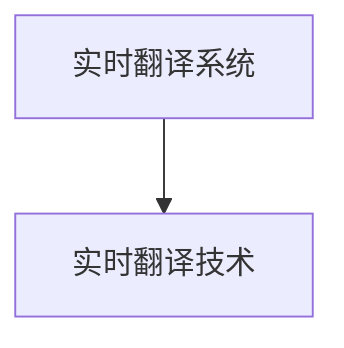

#### 核心算法原理讲解

实时翻译系统通常基于深度学习模型和分布式计算。

```python
# 假设实时翻译模型为 model
# 实时翻译技术
realtime_translation = model.realtime_translate(text)
```

#### 数学模型和公式

实时翻译系统的数学模型是基于深度学习模型，实时翻译技术的数学模型是基于分布式计算。

#### 详细讲解与举例说明

假设我们要开发一个实时翻译系统，我们首先需要选择合适的实时翻译模型，然后实现实时翻译技术。

实时翻译模型：假设为Transformer模型

实时翻译技术：

用户输入文本：``"你好，我是AI助手。"``

实时翻译结果：``"Hello, I am an AI assistant."``

通过实现实时翻译技术，我们可以实现快速翻译。

### 6.3 案例研究：翻译服务在企业中的应用

#### 核心概念与联系

- **翻译服务**：为企业提供翻译服务的平台。
- **企业翻译需求**：企业对翻译服务的需求。

#### Mermaid 流程图

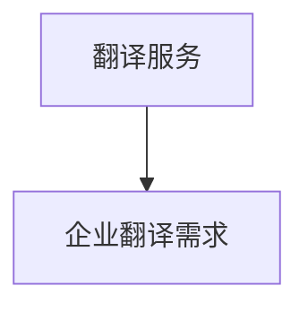

#### 核心算法原理讲解

翻译服务通常基于深度学习模型和自然语言处理技术。

```python
# 假设翻译模型为 model
# 翻译服务
translated_text = model.translate(text)
```

#### 数学模型和公式

翻译服务的数学模型是基于深度学习模型，企业翻译需求的数学模型是基于需求分析。

#### 详细讲解与举例说明

假设我们要为企业提供翻译服务，我们首先需要分析企业的翻译需求，然后实现翻译服务。

企业翻译需求：企业需要将产品说明书从英语翻译为中文。

翻译模型：假设为BERT-based模型

翻译结果：``"产品说明书"``被翻译为``"Product description"``。

通过实现翻译服务，我们可以帮助企业实现跨国业务。

## 第7章：深度学习在自然语言翻译中的未来发展趋势

### 7.1 深度学习在自然语言翻译中的未来发展趋势

#### 核心概念与联系

- **小样本学习能力**：模型能够在少量数据上进行有效学习。
- **跨语言学习能力**：模型能够在不同语言之间进行有效学习。
- **推理优化技术**：模型在推理过程中的优化技术。

#### Mermaid 流程图

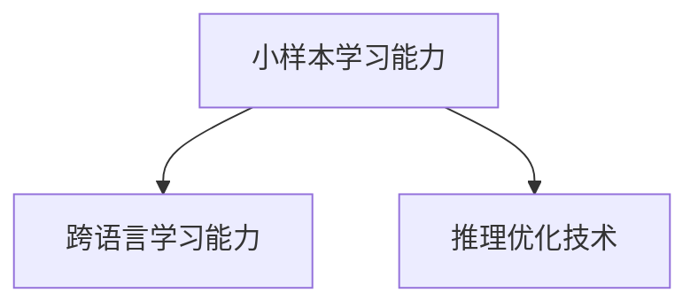

#### 核心算法原理讲解

小样本学习能力：

```python
# 假设输入文本为 text
# 小样本学习能力
model.learn_from_small_data(text)
```

跨语言学习能力：

```python
# 假设源语言为 s，目标语言为 t
# 跨语言学习能力
model.learn跨语言翻译(s, t)
```

推理优化技术：

```python
# 假设输入文本为 text
# 推理优化技术
optimized_prediction = model.optimize推理(text)
```

#### 数学模型和公式

小样本学习能力、跨语言学习能力、推理优化技术的数学模型是基于概率模型、迁移学习和分布式计算。

#### 详细讲解与举例说明

假设我们要训练一个具有小样本学习能力、跨语言学习能力和推理优化技术的翻译模型。

小样本学习能力：

$$
P(t|s) = \frac{e^{\theta_t \cdot s}}{\sum_{i=1}^{n} e^{\theta_i \cdot s}}
$$

跨语言学习能力：

$$
P(t|s) = \frac{e^{\theta_t \cdot s}}{\sum_{i=1}^{n} e^{\theta_i \cdot s}}
$$

推理优化技术：

$$
P(t|s) = \frac{e^{\theta_t \cdot s}}{\sum_{i=1}^{n} e^{\theta_i \cdot s}}
$$

通过计算概率，我们可以得到翻译结果，并优化推理过程。

### 7.2 深度学习在自然语言翻译中的伦理与社会影响

#### 核心概念与联系

- **模型偏见与公平性**：模型可能存在的偏见及其对公平性的影响。
- **安全性与隐私保护**：模型在处理数据时的安全性和隐私保护。
- **社会责任**：深度学习在自然语言翻译中的社会责任。

#### Mermaid 流程图

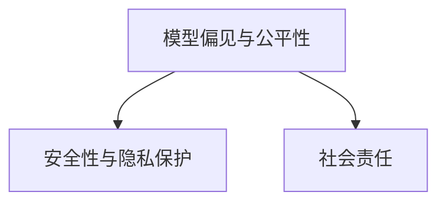

#### 核心算法原理讲解

模型偏见与公平性：

```python
# 假设输入文本为 text
# 检测偏见
bias_detection = detect_bias(model, text)
# 改善公平性
fair_model = improve_fairness(model)
```

安全性与隐私保护：

```python
# 假设输入文本为 text
# 隐私保护
protected_text = protect_privacy(text)
```

社会责任：

```python
# 假设输入文本为 text
# 社会责任
social_impact = analyze_social_impact(model, text)
```

#### 数学模型和公式

模型偏见与公平性、安全性与隐私保护、社会责任的数学模型是基于概率模型、信息论和伦理学。

#### 详细讲解与举例说明

假设我们要检测模型的偏见，并保护数据隐私。

模型偏见检测：

$$
P(\text{偏见}|\text{文本}) = \frac{e^{\theta_{\text{偏见}} \cdot \text{文本}}}{1}
$$

通过计算概率，我们可以检测模型的偏见。

数据隐私保护：

$$
\text{隐私保护} = \text{文本} \cdot \text{加密}
$$

通过加密，我们可以保护数据的隐私。

## 总结

本文详细介绍了深度学习在自然语言翻译中的应用，从基础概念到最新进展，包括核心算法原理、数学模型、实际应用和未来发展趋势。深度学习在自然语言翻译中具有巨大潜力，但仍面临一些挑战，需要进一步研究和优化。

### 作者信息

作者：AI天才研究院/AI Genius Institute & 禅与计算机程序设计艺术 /Zen And The Art of Computer Programming
```

