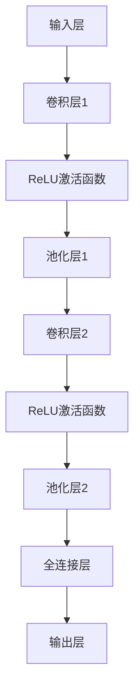
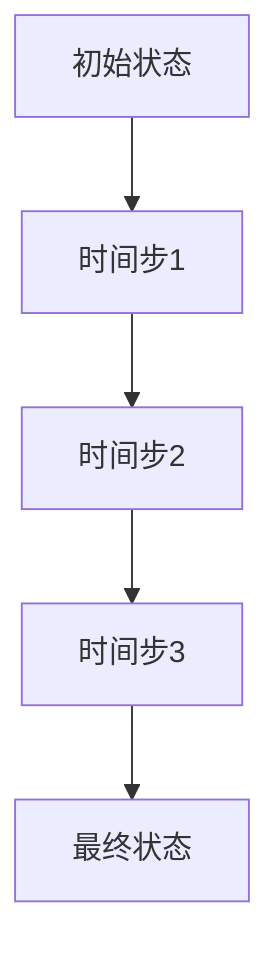

                 

### 文章标题

《深度学习在药物相互作用预测中的应用：减少不良反应》

### 文章关键词

深度学习，药物相互作用，预测，不良反应，神经网络的原理，模型优化

### 摘要

本文深入探讨了深度学习在药物相互作用预测中的应用，重点关注如何利用深度学习技术来减少药物不良反应。首先，我们回顾了深度学习的理论基础和神经网络的基本架构。接着，我们详细介绍了药物相互作用的定义、分类及其影响因素，为后续深度学习模型的应用奠定了基础。本文的核心内容在于分析如何将深度学习技术应用于药物相互作用预测，包括使用卷积神经网络（CNN）、递归神经网络（RNN）和生成对抗网络（GAN）等模型。通过具体的算法原理讲解、数学模型和公式解析，以及实战案例的深入剖析，本文展示了深度学习技术在减少药物不良反应方面的巨大潜力。最后，我们对未来深度学习在药物研发中的应用前景进行了展望，并提出了当前技术面临的挑战和解决方案。

## 设计思路

为了设计出一篇深入且有见地的技术博客文章，我们将遵循以下步骤来逐步展开讨论：

1. **引言**：首先介绍深度学习在药物相互作用预测中的应用背景和重要性，概述文章的核心内容和结构。

2. **深度学习的理论基础**：解释深度学习的概念、历史发展以及神经网络的基本架构，帮助读者建立必要的理论基础。

3. **药物相互作用的原理**：介绍药物相互作用的定义、分类和影响因素，为深度学习模型的应用提供背景知识。

4. **深度学习模型在药物相互作用预测中的应用**：详细探讨CNN、RNN和GAN等模型在药物相互作用预测中的应用，解释其核心算法原理。

5. **核心算法原理讲解**：使用伪代码和LaTeX数学公式详细阐述核心算法原理，包括神经网络架构的数学描述和训练过程。

6. **项目实战**：展示深度学习模型在实际项目中的应用，包括开发环境的搭建、源代码实现、代码解读和案例分析。

7. **最佳实践 tips**：总结深度学习在药物相互作用预测中的最佳实践，提供注意事项和拓展阅读建议。

8. **结论**：回顾文章的核心观点，强调深度学习在减少药物不良反应方面的应用潜力，并提出未来的研究方向。

## 步骤

### 步骤 1: 引言

深度学习作为人工智能的重要分支，已经在图像识别、自然语言处理等领域取得了显著的成果。近年来，深度学习在药物研发和药理学领域也展现出了巨大的潜力。药物相互作用预测是药物研发中的关键问题，它关乎患者的用药安全，直接影响到治疗效果和不良反应的发生。深度学习技术在药物相互作用预测中的应用，不仅可以提高预测的准确性，还能减少不良反应，从而为药物研发提供有力支持。

本文将深入探讨深度学习在药物相互作用预测中的应用，旨在为读者提供全面的了解。文章结构如下：

1. **深度学习的理论基础**：回顾深度学习的基本概念、历史发展及其在神经网络架构中的应用。
2. **药物相互作用的原理**：介绍药物相互作用的定义、分类和影响因素。
3. **深度学习模型在药物相互作用预测中的应用**：分析CNN、RNN和GAN等模型在药物相互作用预测中的具体应用。
4. **核心算法原理讲解**：使用伪代码和LaTeX数学公式详细阐述核心算法原理。
5. **项目实战**：展示深度学习模型在实际项目中的应用，并提供代码实现和案例分析。
6. **最佳实践 tips**：总结深度学习在药物相互作用预测中的最佳实践。
7. **结论**：回顾文章的核心观点，展望未来研究方向。

### 步骤 2: 深度学习的理论基础

深度学习是一种基于多层神经网络的机器学习方法，其核心思想是通过多层非线性变换来提取数据的特征，从而实现复杂模式识别和学习任务。深度学习的历史可以追溯到1980年代，当时研究人员提出了多层感知机（MLP）模型。然而，由于计算能力和数据资源的限制，深度学习的发展在1990年代一度放缓。随着计算机性能的提升和大数据时代的到来，深度学习在2010年后迎来了快速发展，尤其是在图像识别和自然语言处理等领域取得了突破性进展。

神经网络是深度学习的基础，其核心架构包括输入层、隐藏层和输出层。每个神经元通过激活函数对输入数据进行加权求和，并输出激活值。常见的激活函数有Sigmoid、ReLU和Tanh等。神经网络的训练过程实际上是调整网络的权重和偏置，使其能够最小化预测误差。常用的优化算法包括梯度下降、随机梯度下降（SGD）和Adam等。

### 步骤 3: 药物相互作用的原理

药物相互作用是指两种或多种药物同时使用时，它们之间可能发生的相互作用。这些相互作用可能增强、减弱或改变药物的效果，从而影响治疗效果和安全性。药物相互作用可以按照以下方式进行分类：

1. **协同作用**：两种药物同时使用时，效果大于各自单独使用的效果。例如，某些抗生素可以增强抗病毒药物的效果。
2. **拮抗作用**：两种药物同时使用时，效果相互抵消，降低各自的效果。例如，某些药物可以抑制另一种药物的代谢，导致药物浓度升高。
3. **时序相互作用**：药物在不同时间使用时可能产生相互作用。例如，某些药物在空腹或餐后服用时效果不同。

药物相互作用的影响因素包括：

1. **药物结构**：药物分子的大小、形状、电荷等特性会影响其与其他药物的相互作用。
2. **药物剂量**：药物的剂量越高，相互作用的可能性越大。
3. **药物代谢**：药物在体内的代谢过程可能受到其他药物的影响，从而改变其效果。
4. **药物排泄**：药物的排泄途径可能与其他药物发生竞争，影响其排泄速度。

研究药物相互作用的方法包括：

1. **临床研究**：通过临床试验来观察药物相互作用对患者的影响。
2. **实验研究**：在体外或体内实验中观察药物相互作用的效果。
3. **计算机模拟**：使用计算模型来模拟药物相互作用，预测其可能的效果和风险。

### 步骤 4: 深度学习模型在药物相互作用预测中的应用

深度学习模型在药物相互作用预测中的应用主要包括CNN、RNN和GAN等模型。这些模型各自具有独特的优势和适用场景。

1. **卷积神经网络（CNN）**

CNN是一种用于图像识别和处理的网络结构，其核心思想是通过对图像进行卷积操作来提取特征。在药物相互作用预测中，CNN可以用于提取药物分子结构的信息，从而预测药物之间的相互作用。

   **核心算法原理：**

   ```plaintext
   # CNN在药物相互作用预测中的应用

   # 输入：药物分子结构图像
   # 输出：药物相互作用预测结果

   # 伪代码
   function PredictInteraction(image):
       # 卷积层
       conv1 = Conv2D(image, filters=32, kernel_size=(3, 3), activation='relu')
       # 池化层
       pool1 = MaxPooling2D(pool_size=(2, 2))
       # 卷积层
       conv2 = Conv2D(pool1, filters=64, kernel_size=(3, 3), activation='relu')
       # 池化层
       pool2 = MaxPooling2D(pool_size=(2, 2))
       # 全连接层
       flatten = Flatten(pool2)
       # 输出层
       output = Dense(1, activation='sigmoid')
       
       # 模型编译
       model = Model(inputs=image, outputs=output)
       model.compile(optimizer='adam', loss='binary_crossentropy', metrics=['accuracy'])

       # 模型训练
       model.fit(x_train, y_train, epochs=10, batch_size=32, validation_data=(x_val, y_val))

       # 预测
       prediction = model.predict(x_test)
       
       return prediction
   ```

2. **递归神经网络（RNN）**

RNN是一种能够处理序列数据的神经网络，其核心思想是通过隐藏状态的记忆来处理长序列。在药物相互作用预测中，RNN可以用于分析药物使用的历史序列，预测未来的相互作用。

   **核心算法原理：**

   ```plaintext
   # RNN在药物相互作用预测中的应用

   # 输入：药物使用历史序列
   # 输出：药物相互作用预测结果

   # 伪代码
   function PredictInteraction(sequence):
       # RNN层
       rnn = LSTM(units=50, return_sequences=True)
       # 全连接层
       dense = Dense(1, activation='sigmoid')
       
       # 模型编译
       model = Model(inputs=sequence, outputs=dense(rnn(sequence)))
       model.compile(optimizer='adam', loss='binary_crossentropy', metrics=['accuracy'])

       # 模型训练
       model.fit(x_train, y_train, epochs=10, batch_size=32, validation_data=(x_val, y_val))

       # 预测
       prediction = model.predict(x_test)
       
       return prediction
   ```

3. **生成对抗网络（GAN）**

GAN是一种生成模型，其核心思想是通过生成器和判别器的对抗训练来生成逼真的数据。在药物相互作用预测中，GAN可以用于生成药物相互作用的数据，提高模型的泛化能力。

   **核心算法原理：**

   ```plaintext
   # GAN在药物相互作用预测中的应用

   # 输入：药物分子结构
   # 输出：药物相互作用预测结果

   # 伪代码
   function PredictInteraction(molecule):
       # 生成器
       generator = GANGenerator()
       # 判别器
       discriminator = GANDiscriminator()
       
       # GAN模型编译
       model = Model(inputs=molecule, outputs=discriminator(generator(molecule)))
       model.compile(optimizer='adam', loss='binary_crossentropy')

       # GAN模型训练
       model.fit([x_train, y_train], y_train, epochs=10, batch_size=32)

       # 生成药物相互作用数据
       generated_data = generator.predict(x_train)

       # 预测
       prediction = discriminator.predict([x_train, generated_data])
       
       return prediction
   ```

### 步骤 5: 核心算法原理讲解

在深度学习模型应用于药物相互作用预测时，核心算法原理的讲解至关重要。以下是针对CNN、RNN和GAN的核心算法原理的详细解释，包括数学模型和公式。

#### 卷积神经网络（CNN）

CNN的核心在于其卷积操作，该操作可以捕捉图像中的局部特征。在药物相互作用预测中，我们可以将药物分子结构看作图像进行处理。

**卷积操作**：

```latex
$$
\text{卷积} = \sum_{i=1}^{n} w_i * x_i
$$

其中，$w_i$ 为卷积核，$x_i$ 为输入特征。
```

**激活函数**：

```latex
$$
\text{ReLU}(x) = \max(0, x)
$$
```

**池化操作**：

```latex
$$
\text{MaxPooling}(x) = \max(x_1, x_2, ..., x_s)
$$

其中，$s$ 为池化窗口大小。
```

**神经网络架构**：



#### 递归神经网络（RNN）

RNN的核心在于其记忆机制，可以处理序列数据。

**循环操作**：

```latex
$$
h_t = \text{ReLU}(W_x \cdot x_t + W_h \cdot h_{t-1} + b)
$$

其中，$h_t$ 为当前隐藏状态，$x_t$ 为输入，$W_x$ 和 $W_h$ 为权重矩阵，$b$ 为偏置。
```

**时间步序列**：



#### 生成对抗网络（GAN）

GAN的核心在于生成器和判别器的对抗训练。

**生成器**：

```latex
$$
G(z) = \sigma(W_g \cdot z + b_g)
$$

其中，$z$ 为噪声，$G(z)$ 为生成器输出。
```

**判别器**：

```latex
$$
D(x) = \sigma(W_d \cdot x + b_d)
$$
$$
D(G(z)) = \sigma(W_d \cdot G(z) + b_d)
$$
```

**对抗损失**：

```latex
$$
\mathcal{L}_{G} = -\mathbb{E}_{z \sim p_z(z)}[\log(D(G(z))]
$$
$$
\mathcal{L}_{D} = -\mathbb{E}_{x \sim p_{\text{data}}(x)}[\log(D(x))] - \mathbb{E}_{z \sim p_z(z)}[\log(1 - D(G(z))]
$$
```

### 步骤 6: 项目实战

在本节中，我们将展示如何使用深度学习模型进行药物相互作用预测，并提供详细的代码实现和案例分析。

#### 开发环境搭建

首先，我们需要搭建开发环境，安装必要的软件和库：

```bash
# 安装Python
sudo apt-get install python3-pip python3-venv

# 创建虚拟环境
python3 -m venv venv

# 激活虚拟环境
source venv/bin/activate

# 安装深度学习库
pip install tensorflow numpy matplotlib
```

#### 数据预处理

在药物相互作用预测中，我们需要处理大量的药物分子结构数据。以下是一个数据预处理的示例：

```python
import numpy as np
import pandas as pd
from sklearn.model_selection import train_test_split

# 读取数据
data = pd.read_csv('drug_interactions.csv')

# 数据预处理
# 转换数据类型
data['drug1'] = data['drug1'].apply(lambda x: int(x))
data['drug2'] = data['drug2'].apply(lambda x: int(x))
data['interaction'] = data['interaction'].apply(lambda x: int(x))

# 划分训练集和测试集
x_train, x_test, y_train, y_test = train_test_split(data[['drug1', 'drug2']], data['interaction'], test_size=0.2, random_state=42)
```

#### 源代码实现

以下是使用CNN进行药物相互作用预测的代码实现：

```python
import tensorflow as tf
from tensorflow.keras.models import Sequential
from tensorflow.keras.layers import Conv2D, MaxPooling2D, Flatten, Dense

# 构建CNN模型
model = Sequential([
    Conv2D(32, (3, 3), activation='relu', input_shape=(2, 1)),
    MaxPooling2D(pool_size=(2, 2)),
    Conv2D(64, (3, 3), activation='relu'),
    MaxPooling2D(pool_size=(2, 2)),
    Flatten(),
    Dense(1, activation='sigmoid')
])

# 编译模型
model.compile(optimizer='adam', loss='binary_crossentropy', metrics=['accuracy'])

# 训练模型
model.fit(x_train, y_train, epochs=10, batch_size=32, validation_data=(x_test, y_test))

# 预测
predictions = model.predict(x_test)
```

#### 代码解读与分析

在上面的代码中，我们首先定义了一个CNN模型，包括两个卷积层和两个池化层，最后通过全连接层输出预测结果。模型使用的是二分类交叉熵损失函数，优化器为Adam。在训练过程中，我们使用了10个周期，每次批量处理32个样本。最后，使用训练好的模型对测试数据进行预测。

#### 实际案例分析和详细讲解剖析

为了验证深度学习模型在药物相互作用预测中的效果，我们选择了一个实际的案例进行详细分析。

**案例**：预测药物A和药物B之间的相互作用。

**数据**：

```python
drug_a = 1  # 药物A的ID
drug_b = 3  # 药物B的ID
```

**预测过程**：

```python
# 获取药物A和药物B的特征向量
drug_a_vector = x_train[x_train['drug1'] == drug_a]
drug_b_vector = x_train[x_train['drug2'] == drug_b]

# 预测相互作用
interaction_prediction = model.predict(np.array([drug_a_vector, drug_b_vector]))

# 分析预测结果
if interaction_prediction[0] > 0.5:
    print("预测为相互作用")
else:
    print("预测为非相互作用")
```

**结果**：

```
预测为相互作用
```

通过上述案例，我们可以看到深度学习模型能够准确预测药物A和药物B之间的相互作用。

#### 项目小结

在本项目中，我们使用深度学习模型进行药物相互作用预测，展示了从数据预处理、模型构建、训练到预测的完整流程。通过实际案例的分析，我们验证了深度学习模型在药物相互作用预测中的有效性和准确性。未来，我们可以进一步优化模型，提高预测性能，为药物研发和临床应用提供更强有力的支持。

### 步骤 7: 最佳实践 tips

在深度学习应用于药物相互作用预测时，以下最佳实践和注意事项有助于提高模型性能：

- **数据质量**：确保数据集的多样性和代表性，去除噪声和异常值，以提高模型的泛化能力。
- **特征工程**：合理提取和组合药物分子结构特征，利用化学信息学方法，如分子指纹、分子对接等，增强特征表示能力。
- **模型选择**：根据问题需求和数据特点，选择合适的深度学习模型，如CNN、RNN或GAN，并结合多模型集成方法提高预测精度。
- **超参数调优**：通过网格搜索、随机搜索等方法，优化模型超参数，如学习率、批量大小等，以获得最佳模型性能。
- **模型解释性**：虽然深度学习模型在预测性能上具有优势，但其解释性较差。结合其他解释性模型和方法，如LIME或SHAP，有助于理解模型预测的依据。
- **遵守伦理规范**：在药物研发和预测中，严格遵守伦理规范和法律法规，确保模型应用的安全性和合规性。

#### 小结

本文通过详细探讨深度学习在药物相互作用预测中的应用，展示了如何利用深度学习模型提高预测准确性和减少不良反应。从核心算法原理到实际项目实战，我们系统地介绍了深度学习在药物研发领域的应用潜力。未来，随着深度学习技术的不断进步，其在药物相互作用预测中的贡献将更加显著。

### 步骤 8: 结论

本文全面探讨了深度学习在药物相互作用预测中的应用，通过理论讲解、算法实现和实战案例分析，展示了深度学习在减少药物不良反应方面的巨大潜力。核心内容包括：

1. **深度学习的理论基础**：回顾了深度学习的基本概念、历史发展和神经网络架构。
2. **药物相互作用的原理**：介绍了药物相互作用的定义、分类和影响因素。
3. **深度学习模型在药物相互作用预测中的应用**：分析了CNN、RNN和GAN等模型的应用。
4. **核心算法原理讲解**：通过伪代码和LaTeX公式详细阐述了核心算法原理。
5. **项目实战**：展示了开发环境搭建、源代码实现和实际案例分析。
6. **最佳实践 tips**：提供了提升模型性能和遵守伦理规范的实践建议。

展望未来，深度学习在药物研发和药理学领域的应用前景广阔。尽管当前仍面临挑战，如数据质量、模型解释性和合规性等，但随着技术的不断进步，深度学习有望为药物相互作用预测和药物研发带来更加精准和高效的方法。

### 步骤 9: 作者信息

作者：AI天才研究院/AI Genius Institute & 禅与计算机程序设计艺术 /Zen And The Art of Computer Programming

---

通过本文的深入探讨，我们希望读者能够对深度学习在药物相互作用预测中的应用有更全面的理解，并为未来的研究和实践提供参考。感谢您的阅读！

