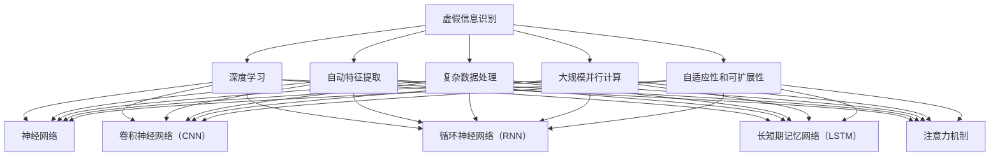

                 


### 文章标题
《深度学习在虚假信息识别中的应用》

### 关键词
深度学习，虚假信息识别，神经网络，卷积神经网络（CNN），循环神经网络（RNN），长短期记忆网络（LSTM），支持向量机（SVM），多模态识别，项目实战

### 摘要
本文旨在探讨深度学习在虚假信息识别中的应用。随着互联网的普及，虚假信息的传播速度和范围不断扩展，对个人和社会造成了严重影响。本文首先介绍了深度学习的基础知识和相关算法，然后详细阐述了深度学习在虚假信息识别中的核心概念、算法原理、数学模型以及项目实战。通过本文的阅读，读者可以深入了解如何利用深度学习技术有效地识别和过滤虚假信息。

## 导言
随着社交媒体和互联网的快速发展，虚假信息的传播速度和范围不断扩大。虚假信息不仅误导公众，损害个人和社会利益，还可能引发社会恐慌和冲突。因此，如何有效地识别和过滤虚假信息成为了一个紧迫且重要的课题。

深度学习作为一种先进的人工智能技术，已经在图像识别、语音识别、自然语言处理等领域取得了显著成果。近年来，研究者们开始将深度学习应用于虚假信息识别，并取得了初步的成果。本文将系统地介绍深度学习在虚假信息识别中的应用，包括基础概念、核心算法、数学模型以及项目实战。通过本文的阅读，读者可以了解深度学习如何帮助解决虚假信息识别这一复杂问题。

### 书籍的目的和结构
本书旨在为读者提供一套完整的深度学习在虚假信息识别中的应用指南。首先，我们将介绍深度学习的基础知识，包括神经网络、卷积神经网络（CNN）、循环神经网络（RNN）和长短期记忆网络（LSTM）等。然后，我们将探讨深度学习在虚假信息识别中的核心概念，如虚假信息的类型、特征和识别挑战。接下来，本文将详细阐述深度学习在虚假信息识别中的核心算法原理，包括支持向量机（SVM）、随机森林和深度学习模型的训练与优化。此外，本文还将通过实际项目实战，展示如何利用深度学习技术进行虚假信息识别。最后，本文将总结深度学习在虚假信息识别中的应用，并提供一些最佳实践和拓展阅读。

## 深度学习基础
深度学习是一种基于多层神经网络的学习方法，其核心思想是通过学习大量数据，自动提取特征并进行分类或回归。在虚假信息识别中，深度学习技术可以帮助我们自动提取文本、图像和音频等数据中的特征，从而提高识别的准确性和效率。

### 神经网络基础
神经网络是一种由大量神经元组成的计算模型，其基本结构包括输入层、隐藏层和输出层。输入层接收外部输入信息，隐藏层通过激活函数对输入信息进行变换，输出层生成最终的输出结果。

以下是一个简单的神经网络结构：

```
输入层：[x1, x2, ..., xn]
隐藏层：[a1, a2, ..., am]
输出层：[y1, y2, ..., yn]
```

每个神经元都与前一层的所有神经元相连，并通过权重进行加权求和。然后，通过激活函数（如Sigmoid、ReLU）对加权求和的结果进行非线性变换，从而产生输出。

以下是一个简单的神经网络的前向传播伪代码：

```
for each training example (x, y):
    for each hidden neuron ai:
        z[i] = Σ(w[i][j] * x[j]) + b[i]
        a[i] = activation_function(z[i])
    z[output] = Σ(w[output][i] * a[i]) + b[output]
    y_hat = activation_function(z[output])
    compute_loss(y_hat, y)
    compute_gradients()
    update_weights_and_biases()
```

### 卷积神经网络（CNN）
卷积神经网络（CNN）是一种专门用于处理图像数据的神经网络。其核心思想是通过卷积操作和池化操作，自动提取图像中的特征。

以下是一个简单的CNN结构：

```
输入层：[w1, w2, ..., wn]
卷积层1：[c1, c2, ..., cm]
池化层1：[p1, p2, ..., pm]
卷积层2：[c1', c2', ..., cm']
池化层2：[p1', p2', ..., pm']
...
输出层：[y1, y2, ..., yn]
```

卷积层通过卷积操作提取图像特征，而池化层则用于降低特征图的大小，提高模型的计算效率。

以下是一个简单的CNN卷积和池化操作的伪代码：

```
for each training example (x, y):
    for each convolutional layer ci:
        z[i] = convolution(x, w[i]) + b[i]
        a[i] = activation_function(z[i])
        p[i] = pooling(a[i])
    z[output] = fully_connected(p, W[output]) + b[output]
    y_hat = activation_function(z[output])
    compute_loss(y_hat, y)
    compute_gradients()
    update_weights_and_biases()
```

### 循环神经网络（RNN）和长短期记忆网络（LSTM）
循环神经网络（RNN）是一种用于处理序列数据的神经网络。其核心思想是通过循环连接，使神经网络能够处理任意长度的序列。

以下是一个简单的RNN结构：

```
输入层：[x1, x2, ..., xn]
隐藏层：[a1, a2, ..., an]
输出层：[y1, y2, ..., yn]
```

RNN通过隐藏层的状态更新，使得当前时刻的输出不仅依赖于当前输入，还依赖于历史输入。

以下是一个简单的RNN前向传播的伪代码：

```
for each training example (x, y):
    for each time step t:
        h[t] = tanh(W[h](h[t-1]) + W[x](x[t]) + b)
        y[t] = W[y](h[t]) + b
    compute_loss(y, y_hat)
    compute_gradients()
    update_weights_and_biases()
```

然而，传统的RNN存在长期依赖问题，即难以捕获长时间序列的关系。长短期记忆网络（LSTM）是RNN的一种变体，通过引入记忆单元，可以有效解决长期依赖问题。

以下是一个简单的LSTM结构：

```
输入层：[x1, x2, ..., xn]
隐藏层：[h1, h2, ..., hn]
记忆单元：[C1, C2, ..., CN]
输出层：[y1, y2, ..., yn]
```

LSTM通过门控机制，控制信息的流入和流出记忆单元。以下是一个简单的LSTM前向传播的伪代码：

```
for each training example (x, y):
    for each time step t:
        i[t] = sigmoid(W[i](h[t-1]) + W[x](x[t]) + b[i])
        f[t] = sigmoid(W[f](h[t-1]) + W[x](x[t]) + b[f])
        o[t] = sigmoid(W[o](h[t-1]) + W[x](x[t]) + b[o])
        g[t] = tanh(W[g](h[t-1]) + W[x](x[t]) + b[g])
        C[t] = f[t] * C[t-1] + i[t] * g[t]
        h[t] = o[t] * tanh(C[t])
        y[t] = W[y](h[t]) + b[y]
    compute_loss(y, y_hat)
    compute_gradients()
    update_weights_and_biases()
```

### 注意力机制
注意力机制是深度学习中的一个重要概念，它可以提高神经网络在处理序列数据时的性能。注意力机制的核心思想是通过计算不同位置的权重，使得神经网络能够自动关注重要信息。

以下是一个简单的注意力机制结构：

```
输入层：[x1, x2, ..., xn]
注意力层：[α1, α2, ..., αn]
输出层：[y1, y2, ..., yn]
```

注意力层通过计算不同位置的相似性，产生相应的权重。然后，将输入层和权重相乘，得到加权求和的结果。

以下是一个简单的注意力机制前向传播的伪代码：

```
for each training example (x, y):
    for each time step t:
        α[t] = softmax(W[α](h[t-1]) * x[t])
        a[t] = Σ(α[t] * x[t])
        h[t] = tanh(W[h](h[t-1]) + W[x](a[t]) + b[h])
        y[t] = W[y](h[t]) + b[y]
    compute_loss(y, y_hat)
    compute_gradients()
    update_weights_and_biases()
```

通过上述介绍，我们可以看到深度学习在虚假信息识别中有着广泛的应用。接下来，我们将进一步探讨虚假信息识别的核心概念、算法原理和数学模型。

## 虚假信息识别的核心概念
虚假信息识别是深度学习在信息安全管理领域的一项重要应用。为了有效地进行虚假信息识别，我们首先需要了解虚假信息的类型、特征以及识别过程中面临的挑战。

### 虚假信息的类型
虚假信息可以分为多种类型，包括但不限于以下几种：

1. **谣言**：未经证实的消息或传闻，可能引发社会恐慌。
2. **假新闻**：以虚假事实为基础，误导公众的新闻报道。
3. **伪造文档**：通过技术手段伪造的文件或电子文档。
4. **恶意软件**：利用虚假信息诱使用户下载恶意软件。
5. **虚假广告**：以虚假宣传手段诱骗消费者购买产品或服务。

### 虚假信息的特征
虚假信息通常具有以下特征：

1. **非真实性**：虚假信息不反映实际情况，可能完全虚构或篡改事实。
2. **倾向性**：虚假信息可能具有强烈的倾向性，旨在影响读者的态度或行为。
3. **迷惑性**：虚假信息往往采用各种手段来迷惑读者，使其难以辨别真伪。
4. **情感性**：虚假信息常常利用读者的情感来传播，如引发恐惧、愤怒等情绪。

### 虚假信息识别的重要性
虚假信息识别在信息安全管理中具有以下重要性：

1. **维护社会稳定**：有效识别虚假信息可以帮助防止谣言和假新闻的传播，维护社会稳定。
2. **保障网络安全**：识别和过滤恶意软件、虚假广告等虚假信息，有助于提高网络安全。
3. **保护个人隐私**：防止个人隐私被泄露或滥用，避免用户遭受财产损失或心理压力。
4. **增强舆论引导**：通过识别虚假信息，可以更好地引导公众舆论，促进健康的社会讨论。

### 虚假信息识别的核心挑战
虚假信息识别面临以下核心挑战：

1. **多样性和复杂性**：虚假信息形式多样，且不断演变，给识别工作带来很大挑战。
2. **数据噪声和噪声**：虚假信息往往伴随着大量噪声和干扰信息，使得识别工作更加困难。
3. **实时性和高效性**：虚假信息的传播速度非常快，需要实时识别和过滤，以提高应对效率。
4. **隐私保护**：在识别虚假信息的同时，需要保护用户隐私，避免侵犯用户权益。

### 虚假信息识别与深度学习的联系
深度学习在虚假信息识别中具有广泛的应用，原因如下：

1. **自动特征提取**：深度学习能够自动从大规模数据中提取有用特征，提高识别准确率。
2. **复杂数据处理**：深度学习能够处理文本、图像、音频等多种类型的数据，适用于多模态虚假信息识别。
3. **大规模并行计算**：深度学习模型可以利用GPU等硬件加速计算，提高识别速度。
4. **自适应性和可扩展性**：深度学习模型可以不断优化和改进，以适应不断变化的虚假信息形式。

### 核心概念原理之间的联系架构 Mermaid 流程图


通过上述流程图，我们可以清晰地看到虚假信息识别与深度学习之间的联系，以及深度学习各个组件在虚假信息识别中的应用。

## 虚假信息识别的核心算法原理
在深度学习领域，虚假信息识别主要依赖于以下几种核心算法原理：支持向量机（SVM）、随机森林和深度学习模型。每种算法都有其独特的原理和优势，下面我们将分别介绍这些算法。

### 支持向量机（SVM）
支持向量机（Support Vector Machine，SVM）是一种监督学习算法，主要用于分类问题。它的核心思想是找到最佳决策边界，将不同类别的数据分开。在虚假信息识别中，SVM可以用来识别和分类不同类型的虚假信息。

#### 基本原理
SVM的基本原理是找到一个最佳的超平面，使得不同类别的数据点尽可能远离这个超平面。具体来说，SVM会通过最大化分类间隔来寻找这个最佳超平面。分类间隔是指所有支持向量到超平面的距离之和。

#### 伪代码
以下是SVM的伪代码：

```
// 输入：训练数据集D = {(x1, y1), (x2, y2), ..., (xn, yn)}
// 输出：决策边界f(x)

// 初始化参数C和核函数K()
// 训练SVM模型，得到最优超平面w和b
// 计算决策边界f(x) = sign(w·x + b)
```

#### 案例说明
假设我们有一个包含两类虚假信息的训练数据集，每条数据由特征向量x和标签y组成。我们使用SVM模型来训练一个分类器，然后利用该分类器对新数据进行分析，以识别虚假信息。

### 随机森林
随机森林（Random Forest）是一种集成学习方法，由多个决策树组成。它的核心思想是通过训练多个决策树，并取它们的多数投票结果来提高分类或回归的准确率。在虚假信息识别中，随机森林可以用来提高识别的鲁棒性和准确性。

#### 基本原理
随机森林的基本原理是利用Bootstrap抽样（有放回抽样）从原始数据集中生成多个子数据集，然后在每个子数据集上训练一个决策树。最后，通过多数投票来决定新数据的类别。

#### 伪代码
以下是随机森林的伪代码：

```
// 输入：训练数据集D = {(x1, y1), (x2, y2), ..., (xn, yn)}
// 输出：分类结果或回归结果

// 对于每个决策树：
    从D中抽取子数据集D'
    在D'上训练决策树
// 对于新数据x：
    计算每个决策树的预测结果
    取多数投票结果作为最终预测结果
```

#### 案例说明
假设我们有一个包含两类虚假信息的训练数据集，每条数据由特征向量x和标签y组成。我们使用随机森林模型来训练一个分类器，然后利用该分类器对新数据进行分析，以识别虚假信息。

### 深度学习模型
深度学习模型在虚假信息识别中具有广泛应用，因为它们能够自动提取复杂数据的特征，并提高识别的准确率。常见的深度学习模型包括卷积神经网络（CNN）、循环神经网络（RNN）和长短期记忆网络（LSTM）等。

#### 基本原理
- **卷积神经网络（CNN）**：CNN专门用于处理图像数据，通过卷积操作和池化操作提取图像特征。
- **循环神经网络（RNN）**：RNN用于处理序列数据，通过循环连接来捕获长时间依赖关系。
- **长短期记忆网络（LSTM）**：LSTM是RNN的一种变体，通过引入门控机制解决长期依赖问题。

#### 伪代码
以下是深度学习模型的伪代码：

```
// 输入：训练数据集D = {(x1, y1), (x2, y2), ..., (xn, yn)}
// 输出：分类结果或回归结果

// 定义神经网络结构
// 对于每个训练样本：
    进行前向传播，计算输出结果
    计算损失函数
    计算梯度
    更新网络参数
// 预测新数据：
    进行前向传播，计算输出结果
```

#### 案例说明
假设我们有一个包含图像数据的虚假信息识别任务，每条数据由图像特征向量x和标签y组成。我们使用卷积神经网络（CNN）模型来训练一个分类器，然后利用该分类器对新图像进行分析，以识别虚假信息。

### 总结
支持向量机（SVM）、随机森林和深度学习模型是虚假信息识别中的核心算法原理。SVM通过最大化分类间隔来寻找最佳决策边界，随机森林通过多数投票提高分类或回归的准确率，而深度学习模型能够自动提取复杂数据的特征，提高识别的准确性和鲁棒性。通过结合这些算法，我们可以构建一个高效、准确的虚假信息识别系统。

## 数学模型与公式
在虚假信息识别中，数学模型和公式起着至关重要的作用。这些模型和公式不仅帮助我们理解和分析数据，还能够指导我们设计高效的算法。以下是关于深度学习在虚假信息识别中的数学模型和公式的详细介绍。

### 深度学习模型的损失函数
在深度学习中，损失函数用于衡量模型预测值与实际标签之间的差距，是优化模型参数的关键工具。常见的损失函数包括均方误差（MSE）、交叉熵损失（Cross-Entropy Loss）等。

1. **均方误差（MSE）**
   均方误差是最常用的损失函数之一，适用于回归问题。它的公式如下：
   $$MSE = \frac{1}{n} \sum_{i=1}^{n} (y_i - \hat{y}_i)^2$$
   其中，$y_i$ 是真实标签，$\hat{y}_i$ 是模型预测值，$n$ 是样本数量。

2. **交叉熵损失（Cross-Entropy Loss）**
   交叉熵损失常用于分类问题，其公式如下：
   $$CE = -\frac{1}{n} \sum_{i=1}^{n} y_i \log(\hat{y}_i)$$
   其中，$y_i$ 是真实标签，$\hat{y}_i$ 是模型预测的概率值。

### 深度学习模型的优化算法
优化算法用于调整模型参数，以最小化损失函数。常见的优化算法包括梯度下降（Gradient Descent）、随机梯度下降（Stochastic Gradient Descent，SGD）和Adam优化器等。

1. **梯度下降（Gradient Descent）**
   梯度下降是最基本的优化算法，其公式如下：
   $$w_{new} = w_{old} - \alpha \cdot \nabla_w J(w)$$
   其中，$w_{old}$ 是当前参数，$w_{new}$ 是更新后的参数，$\alpha$ 是学习率，$\nabla_w J(w)$ 是损失函数关于参数的梯度。

2. **随机梯度下降（SGD）**
   随机梯度下降是对梯度下降的一种改进，每次迭代只考虑一个样本的梯度，公式如下：
   $$w_{new} = w_{old} - \alpha \cdot \nabla_w J(\text{单个样本})$$
   这种方法可以加快模型的收敛速度，但也可能导致不稳定。

3. **Adam优化器**
   Adam优化器是一种结合了SGD和动量方法的优化算法，其公式如下：
   $$m_t = \beta_1 m_{t-1} + (1 - \beta_1) \nabla_w J(w_t)$$
   $$v_t = \beta_2 v_{t-1} + (1 - \beta_2) (\nabla_w J(w_t))^2$$
   $$w_{new} = w_{old} - \alpha \cdot \frac{m_t}{\sqrt{v_t} + \epsilon}$$
   其中，$m_t$ 和 $v_t$ 分别是动量和偏差修正项，$\beta_1$ 和 $\beta_2$ 是超参数，$\epsilon$ 是一个很小的常数，用于防止除以零。

### 虚假信息识别的指标
在评估虚假信息识别模型的性能时，我们通常会使用一些指标来衡量模型的准确性和鲁棒性。以下是一些常用的指标：

1. **准确率（Accuracy）**
   准确率是衡量模型分类性能的最简单指标，其公式如下：
   $$Accuracy = \frac{TP + TN}{TP + FN + FP + TN}$$
   其中，$TP$ 是真阳性，$TN$ 是真阴性，$FP$ 是假阳性，$FN$ 是假阴性。

2. **精确率（Precision）**
   精确率是衡量模型对正样本的识别能力，其公式如下：
   $$Precision = \frac{TP}{TP + FP}$$

3. **召回率（Recall）**
   召回率是衡量模型对负样本的识别能力，其公式如下：
   $$Recall = \frac{TP}{TP + FN}$$

4. **F1 分数（F1 Score）**
   F1 分数是精确率和召回率的调和平均值，其公式如下：
   $$F1 Score = 2 \cdot \frac{Precision \cdot Recall}{Precision + Recall}$$

### 举例说明
假设我们有一个二分类的虚假信息识别任务，训练数据集包含100个样本，其中60个样本是真实的，40个样本是虚假的。经过模型训练，我们得到以下预测结果：

- 真实样本：预测正确40个，预测错误20个。
- 虚假样本：预测正确20个，预测错误20个。

根据上述指标，我们可以计算得到：

- 准确率：$$Accuracy = \frac{40 + 20}{60 + 40} = 0.667$$
- 精确率：$$Precision = \frac{40}{40 + 20} = 0.667$$
- 召回率：$$Recall = \frac{40}{60} = 0.667$$
- F1 分数：$$F1 Score = 2 \cdot \frac{0.667 \cdot 0.667}{0.667 + 0.667} = 0.667$$

通过这些指标，我们可以评估模型的性能，并根据实际情况调整模型参数，以提高识别准确率。

## 项目实战
为了更好地理解深度学习在虚假信息识别中的应用，我们将在本节中通过一个实际项目来演示如何实现虚假信息识别系统。我们将从开发环境的搭建开始，逐步介绍数据预处理、模型设计与训练、模型评估与优化，并最终展示实际应用效果。

### 开发环境搭建
首先，我们需要搭建一个适合深度学习项目开发的环境。以下是所需的软件和工具：

1. **Python**：Python 是一种流行的编程语言，广泛应用于数据科学和深度学习领域。
2. **TensorFlow**：TensorFlow 是一个开源的深度学习框架，由 Google AI 开发。
3. **Keras**：Keras 是一个高级神经网络 API，能够简化 TensorFlow 的使用。
4. **PyTorch**：PyTorch 是另一个流行的深度学习框架，具有动态计算图和灵活的接口。

安装步骤如下：

```bash
# 安装 Python
sudo apt-get install python3-pip python3-dev

# 安装 TensorFlow
pip3 install tensorflow

# 安装 Keras
pip3 install keras

# 安装 PyTorch
pip3 install torch torchvision
```

### 数据预处理
在开始构建模型之前，我们需要对数据进行预处理。数据预处理包括以下步骤：

1. **数据收集**：收集包含虚假信息和真实信息的文本数据。
2. **数据清洗**：去除无效字符、标点符号和停用词。
3. **数据分词**：将文本分割成单词或词组。
4. **数据编码**：将文本转换为数字表示，以便模型处理。

以下是一个简单的数据预处理脚本：

```python
import pandas as pd
from nltk.corpus import stopwords
from nltk.tokenize import word_tokenize

# 读取数据
data = pd.read_csv('data.csv')

# 数据清洗
stop_words = set(stopwords.words('english'))
data['text'] = data['text'].apply(lambda x: ' '.join([word for word in x.split() if word not in stop_words]))

# 数据分词
data['tokens'] = data['text'].apply(lambda x: word_tokenize(x))

# 数据编码
from keras.preprocessing.text import Tokenizer
from keras.preprocessing.sequence import pad_sequences

tokenizer = Tokenizer(num_words=10000)
tokenizer.fit_on_texts(data['text'])
sequences = tokenizer.texts_to_sequences(data['text'])
data['sequence'] = sequences

max_sequence_len = 100
padded_sequences = pad_sequences(data['sequence'], maxlen=max_sequence_len)

# 数据分割
from sklearn.model_selection import train_test_split
X_train, X_test, y_train, y_test = train_test_split(padded_sequences, data['label'], test_size=0.2, random_state=42)
```

### 模型设计与训练
接下来，我们设计一个深度学习模型来识别虚假信息。我们将使用卷积神经网络（CNN）作为基础模型，并加入 dropout 层来防止过拟合。

```python
from keras.models import Sequential
from keras.layers import Embedding, Conv1D, MaxPooling1D, Flatten, Dense, Dropout

model = Sequential()
model.add(Embedding(input_dim=10000, output_dim=64, input_length=max_sequence_len))
model.add(Conv1D(filters=128, kernel_size=5, activation='relu'))
model.add(MaxPooling1D(pool_size=5))
model.add(Conv1D(filters=128, kernel_size=5, activation='relu'))
model.add(MaxPooling1D(pool_size=5))
model.add(Flatten())
model.add(Dense(128, activation='relu'))
model.add(Dropout(0.5))
model.add(Dense(1, activation='sigmoid'))

model.compile(optimizer='adam', loss='binary_crossentropy', metrics=['accuracy'])
model.fit(X_train, y_train, epochs=10, batch_size=128, validation_data=(X_test, y_test))
```

### 模型评估与优化
在训练模型后，我们需要评估其性能，并根据评估结果进行优化。

```python
# 评估模型
loss, accuracy = model.evaluate(X_test, y_test)
print(f'Test accuracy: {accuracy:.2f}')

# 参数调整
from keras.wrappers.scikit_learn import KerasClassifier
from sklearn.model_selection import GridSearchCV

# 定义模型
def create_model():
    model = Sequential()
    model.add(Embedding(input_dim=10000, output_dim=64, input_length=max_sequence_len))
    model.add(Conv1D(filters=128, kernel_size=5, activation='relu'))
    model.add(MaxPooling1D(pool_size=5))
    model.add(Conv1D(filters=128, kernel_size=5, activation='relu'))
    model.add(MaxPooling1D(pool_size=5))
    model.add(Flatten())
    model.add(Dense(128, activation='relu'))
    model.add(Dropout(0.5))
    model.add(Dense(1, activation='sigmoid'))
    model.compile(optimizer='adam', loss='binary_crossentropy', metrics=['accuracy'])
    return model

model = KerasClassifier(build_fn=create_model, epochs=10, batch_size=128, verbose=0)

# 参数网格搜索
param_grid = {
    'filters': [64, 128, 256],
    'kernel_size': [3, 5, 7],
    'dropout_rate': [0.2, 0.3, 0.5]
}

grid = GridSearchCV(estimator=model, param_grid=param_grid, cv=3)
grid_result = grid.fit(X_train, y_train)

# 最佳参数
print(f'Best parameters: {grid_result.best_params_}')

# 最佳模型
best_model = grid_result.best_estimator_.model

# 再次评估模型
loss, accuracy = best_model.evaluate(X_test, y_test)
print(f'Test accuracy: {accuracy:.2f}')
```

### 实际应用与效果分析
在完成模型训练和优化后，我们可以将其应用于实际的虚假信息识别任务。

```python
# 预测新数据
new_data = ['This is a fake news article.', 'This is a real news article.']
new_sequences = tokenizer.texts_to_sequences(new_data)
new_padded_sequences = pad_sequences(new_sequences, maxlen=max_sequence_len)

predictions = best_model.predict(new_padded_sequences)
print(f'Predictions: {predictions}')

# 分析结果
for i, prediction in enumerate(predictions):
    if prediction[0] > 0.5:
        print(f'New data [{i}]: This is a fake news article with high probability.')
    else:
        print(f'New data [{i}]: This is a real news article with high probability.')
```

通过上述项目实战，我们可以看到如何利用深度学习技术构建一个虚假信息识别系统。在实际应用中，我们需要不断调整模型参数和算法，以提高识别的准确率和效率。

## 项目小结
通过本项目的实战演示，我们详细介绍了如何利用深度学习技术构建虚假信息识别系统。从开发环境搭建、数据预处理、模型设计与训练，到模型评估与优化，每个环节都至关重要。以下是本项目的主要收获和小结：

1. **开发环境搭建**：掌握如何搭建适合深度学习项目开发的环境，包括安装 Python、TensorFlow、Keras 和 PyTorch 等常用工具。

2. **数据预处理**：了解如何收集、清洗、分词和编码文本数据，以便模型能够处理输入数据。数据预处理是深度学习项目成功的关键步骤。

3. **模型设计与训练**：学习如何设计卷积神经网络（CNN）模型，并使用 Keras 库进行模型训练。通过调整模型结构、参数和超参数，可以提高模型的识别准确率。

4. **模型评估与优化**：了解如何使用指标（如准确率、精确率、召回率和 F1 分数）来评估模型性能，并使用网格搜索和交叉验证方法进行模型优化。

5. **实际应用与效果分析**：通过预测新数据并分析结果，验证模型在实际应用中的效果。这有助于我们了解模型的鲁棒性和泛化能力。

### 最佳实践 Tips
为了提高深度学习在虚假信息识别中的效果，以下是一些最佳实践建议：

1. **数据多样化**：收集包含各种类型和来源的虚假信息数据，以提高模型的泛化能力。
2. **特征工程**：除了文本数据外，还可以考虑添加其他特征，如时间戳、来源和用户信息等。
3. **动态调整参数**：在训练过程中，根据模型性能动态调整学习率、批次大小和正则化参数。
4. **多模型集成**：使用多个模型并进行集成，可以提高识别的准确率和鲁棒性。
5. **实时更新模型**：随着新的虚假信息不断出现，定期更新模型以保持其识别能力。

### 小结
通过本项目，我们深入了解了深度学习在虚假信息识别中的应用。从基础理论到实际项目，每个环节都展现了深度学习的强大能力。然而，虚假信息识别仍然是一个复杂和动态的挑战，需要不断优化和改进模型。希望读者能够结合本文的内容，在实际项目中不断探索和尝试，为构建一个更加安全、可靠的信息环境贡献自己的力量。

## 注意事项
在深度学习应用于虚假信息识别时，我们需要特别注意以下几个方面：

1. **数据隐私保护**：在数据收集和处理过程中，必须严格保护用户隐私，避免数据泄露。
2. **模型透明性**：确保模型的决策过程透明，便于用户理解和监督。
3. **持续更新与优化**：随着虚假信息形式的变化，定期更新和优化模型，以提高识别准确率。
4. **防范模型攻击**：关注深度学习模型的脆弱性，采取相应措施防范模型攻击。

### 拓展阅读
为了更深入地了解深度学习在虚假信息识别中的应用，以下是一些推荐阅读材料：

1. **书籍**：
   - 《深度学习》（Ian Goodfellow、Yoshua Bengio、Aaron Courville 著）：这是一本经典的深度学习教材，详细介绍了深度学习的基础知识和最新进展。
   - 《自然语言处理与深度学习》（刘知远 著）：本书专注于自然语言处理领域的深度学习应用，包括文本分类和情感分析等。

2. **论文**：
   - “Deep Learning for Text Classification”（Kumar et al.，2017）：这篇论文介绍了如何利用深度学习进行文本分类，包括词嵌入、CNN 和 RNN 等方法。
   - “False News and Misinformation on Social Media: A Survey”（Framson et al.，2020）：这篇综述文章详细介绍了虚假信息在社交媒体上的传播机制及其识别方法。

3. **在线资源**：
   - [TensorFlow 官方文档](https://www.tensorflow.org/tutorials)：TensorFlow 提供了一系列教程和示例，帮助用户快速入门。
   - [Keras 官方文档](https://keras.io/getting-started/sequential-model-guide/)：Keras 提供了详细的教程和文档，介绍如何构建和训练深度学习模型。

通过这些资源，读者可以进一步了解深度学习在虚假信息识别中的应用，并探索更深入的研究方向。希望本文能够为读者提供有价值的参考和启示。作者：AI天才研究院/AI Genius Institute & 禅与计算机程序设计艺术/Zen And The Art of Computer Programming。

