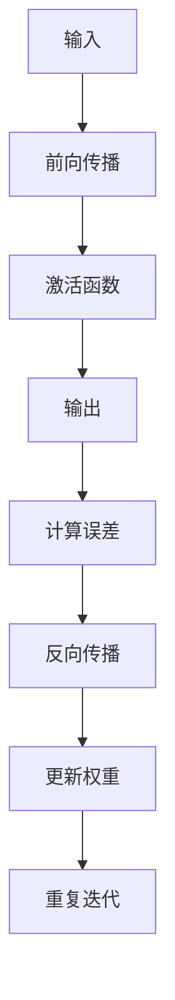

                 

### 引言：虚拟试衣与深度学习在在线购物中的应用

随着电子商务的快速发展，消费者对在线购物的体验要求越来越高。其中，试衣环节是消费者购物流程中的一个关键环节。传统的在线购物过程中，消费者只能通过图片和文字描述来想象自己穿上某件衣物后的效果，这种体验往往难以满足消费者的需求，从而导致购物体验不佳和转化率下降。

为了解决这一问题，虚拟试衣技术应运而生。虚拟试衣技术通过计算机技术和人工智能算法，帮助消费者在购买衣物前进行虚拟试穿，从而提高购物体验。而深度学习作为人工智能领域的一项核心技术，在虚拟试衣中有着广泛的应用。

#### 虚拟试衣的基本概念

虚拟试衣（Virtual Try-On）是指通过计算机技术模拟真实试衣过程的工具或系统。它允许消费者在购买衣物前，通过数字化的方式，在虚拟环境中试穿各种衣物，从而评估衣物是否适合自己。

虚拟试衣的过程通常包括以下几个步骤：

1. **3D人体建模**：首先，需要建立一个消费者的人体三维模型。这可以通过使用3D扫描仪或者利用深度相机等技术来实现。
2. **虚拟试衣室搭建**：在虚拟环境中搭建一个模拟的试衣室，包括各种衣物和背景。
3. **虚拟试衣**：将消费者的人体模型放入虚拟试衣室中，通过软件算法将衣物模型与人体模型进行匹配和融合，从而实现虚拟试穿。
4. **试衣效果反馈**：通过图像处理技术，实时显示消费者在虚拟试衣室中的效果，并提供试衣评价和建议。

#### 深度学习的基本概念

深度学习（Deep Learning）是机器学习的一个分支，主要基于多层神经网络结构，通过大量数据的学习，实现对复杂模式的自动识别和分类。深度学习在图像识别、自然语言处理、语音识别等领域取得了显著的成果。

深度学习的基本原理包括：

1. **神经网络**：神经网络是由大量神经元组成的计算模型，通过多层结构，实现对输入数据的处理和输出。
2. **前向传播与反向传播**：在神经网络中，数据从输入层经过隐藏层，最终传到输出层，这个过程称为前向传播。反向传播则是根据输出层的误差，反向调整网络的权重，从而优化模型。

#### 深度学习在在线购物中的重要性

深度学习在在线购物中的应用，主要体现在以下几个方面：

1. **个性化推荐**：通过深度学习算法，对消费者的购物行为和偏好进行分析，为其推荐合适的商品。
2. **图像识别**：利用深度学习技术，实现商品图片的识别和分类，提高搜索和推荐的准确性。
3. **情感分析**：分析消费者在评论中的情感倾向，为产品改进和营销策略提供依据。
4. **虚拟试衣**：通过深度学习算法，实现虚拟试衣室中的衣物与人体的精准匹配，提升购物体验。

#### 本书的结构和内容安排

本书旨在系统地介绍深度学习在虚拟试衣中的应用，以提高在线购物体验。具体结构如下：

1. **引言**：介绍虚拟试衣和深度学习的基本概念，以及它们在在线购物体验中的重要性。
2. **深度学习基础**：讲解深度学习的基本原理和技术，为后续的虚拟试衣应用打下基础。
3. **虚拟试衣技术**：详细探讨虚拟试衣的原理、技术和应用。
4. **在线购物体验提升**：分析如何使用深度学习和虚拟试衣技术提升在线购物体验。
5. **项目实战**：通过实际案例展示如何使用深度学习和虚拟试衣技术解决在线购物中的实际问题。
6. **未来发展趋势**：预测深度学习在虚拟试衣和在线购物体验中的未来发展方向。

本书适用于对深度学习和在线购物有一定了解的技术人员、电商从业者以及计算机相关专业的学生。希望通过本书，读者能够系统地了解深度学习在虚拟试衣中的应用，并将其应用到实际工作中，提升在线购物体验。

### 总结

虚拟试衣和深度学习作为现代科技的重要组成部分，在提升在线购物体验方面具有巨大的潜力。通过本书的介绍，读者可以全面了解虚拟试衣和深度学习的基本概念、技术原理和应用场景。在接下来的章节中，我们将深入探讨深度学习在虚拟试衣中的具体应用，以及如何通过虚拟试衣技术提升在线购物体验。让我们共同探索这一领域的奥秘，为未来的在线购物带来更多创新和变革。作者：AI天才研究院/AI Genius Institute & 禅与计算机程序设计艺术 /Zen And The Art of Computer Programming

---

# 深度学习基础

## 深度学习的基本原理

### 神经网络

神经网络（Neural Networks）是深度学习的基础。它是一种模拟人脑神经元结构和功能的计算模型，通过大量神经元连接和激活规则，实现数据的输入、处理和输出。

#### 神经元模型

神经元模型是神经网络的基本单元。一个简单的神经元模型由三个部分组成：输入、权重和激活函数。

1. **输入**：每个神经元接收多个输入信号，这些信号可以是数值、图像或文本等。
2. **权重**：每个输入信号都有一个对应的权重，用于表示该信号对神经元输出的影响程度。
3. **激活函数**：激活函数用于将神经元的输入转化为输出。常用的激活函数包括 sigmoid 函数、ReLU 函数等。

#### 前向传播和反向传播

神经网络的训练过程主要包括两个阶段：前向传播和反向传播。

1. **前向传播**：将输入数据通过神经网络，从输入层经过多个隐藏层，最终传递到输出层。每层神经元根据其输入和权重计算输出，并将结果传递给下一层。
2. **反向传播**：根据输出层的误差，反向调整网络的权重。这个过程通过计算梯度，利用优化算法（如梯度下降法）逐步减小误差。

#### 深度学习算法

深度学习算法是深度学习模型的核心，用于实现复杂的数据处理任务。以下是一些常用的深度学习算法：

1. **卷积神经网络（CNN）**：CNN 主要用于图像处理任务，通过卷积操作和池化操作，提取图像特征。
2. **循环神经网络（RNN）**：RNN 主要用于序列数据处理任务，通过循环结构，实现序列数据的建模和预测。
3. **生成对抗网络（GAN）**：GAN 主要用于图像生成和风格迁移任务，通过生成器和判别器的对抗训练，实现高质量图像的生成。

### 深度学习框架

深度学习框架是用于实现和训练深度学习模型的工具集。以下是一些常用的深度学习框架：

1. **TensorFlow**：由 Google 开发，支持多种深度学习模型和算法，具有强大的计算能力和灵活的接口。
2. **PyTorch**：由 Facebook 开发，具有动态计算图和简洁的接口，易于研究和实验。
3. **Keras**：是基于 TensorFlow 的一个高层神经网络 API，简化了深度学习模型的构建和训练过程。

### 深度学习实践

深度学习实践主要包括数据预处理、模型训练与评估、模型部署与优化等步骤。

1. **数据预处理**：包括数据清洗、归一化、数据增强等操作，以提高模型的泛化能力。
2. **模型训练与评估**：通过训练集训练模型，并通过验证集和测试集评估模型的性能。
3. **模型部署与优化**：将训练好的模型部署到生产环境中，并持续优化，以提高模型的性能和效率。

## 背景介绍

深度学习的发展经历了几个重要的阶段。从最初的感知机（Perceptron）到多层感知机（MLP），再到深度信念网络（DBN）和卷积神经网络（CNN），深度学习在图像识别、语音识别、自然语言处理等领域取得了显著的成果。

随着计算能力的提升和大数据的发展，深度学习在人工智能领域取得了突破性进展。特别是在计算机视觉领域，深度学习算法已经成为了主导技术，广泛应用于人脸识别、物体检测、图像分类等任务。

#### 核心概念与联系

深度学习中的核心概念包括神经网络、激活函数、前向传播、反向传播等。这些概念之间有着紧密的联系。

1. **神经网络**：神经网络是深度学习的基础，通过多层结构，实现数据的输入、处理和输出。
2. **激活函数**：激活函数用于将神经元的输入转化为输出，是神经网络的核心组成部分。
3. **前向传播与反向传播**：前向传播实现数据的输入和输出，反向传播用于计算梯度，优化网络权重。

以下是一个简单的 Mermaid 流程图，展示深度学习的基本流程：



### 核心算法原理讲解

以下是对核心算法原理的详细讲解，包括伪代码和数学模型。

#### 卷积神经网络（CNN）

卷积神经网络（CNN）是一种主要用于图像处理任务的深度学习模型。CNN 通过卷积操作和池化操作，提取图像特征。

1. **卷积操作**：卷积操作用于提取图像中的局部特征。伪代码如下：

```python
def conv2d(input, filter):
    output = zeros(shape(input))
    for i in range(height(input)):
        for j in range(width(input)):
            for k in range(depth(input)):
                output[i][j] += dot(filter[i][j], input[i][j][k])
    return output
```

2. **池化操作**：池化操作用于减小特征图的尺寸，减少参数数量。常用的池化操作包括最大池化和平均池化。

```python
def max_pool(input, pool_size):
    output = zeros(shape(input) / pool_size)
    for i in range(height(input) / pool_size):
        for j in range(width(input) / pool_size):
            output[i][j] = max(input[i*pool_size:i*pool_size+pool_size][j*pool_size:j*pool_size+pool_size])
    return output
```

#### 循环神经网络（RNN）

循环神经网络（RNN）是一种用于处理序列数据的深度学习模型。RNN 通过循环结构，实现序列数据的建模和预测。

1. **RNN 基本单元**：RNN 的基本单元是一个循环单元，它包含一个隐藏状态和一个输入门、遗忘门和输出门。

```python
def rnn(input, hidden_state, weights):
    gate_inputs = [dot(input, weights[i]) for i in range(3)]
    input_gate = sigmoid(gate_inputs[0])
    forget_gate = sigmoid(gate_inputs[1])
    output_gate = sigmoid(gate_inputs[2])
    
    hidden_state_new = (forget_gate * hidden_state) + (input_gate * tanh(dot(input, weights[3])))
    output = output_gate * tanh(hidden_state_new)
    
    return output, hidden_state_new
```

2. **RNN 预测**：RNN 通过循环单元，逐个处理序列中的每个元素，并生成预测结果。

```python
def predict_sequence(input_sequence, initial_hidden_state, weights):
    hidden_states = [initial_hidden_state]
    for input in input_sequence:
        output, hidden_state = rnn(input, hidden_states[-1], weights)
        hidden_states.append(hidden_state)
    return output
```

#### 生成对抗网络（GAN）

生成对抗网络（GAN）是一种用于生成数据的深度学习模型。GAN 包括生成器和判别器两个部分，通过对抗训练，实现高质量数据的生成。

1. **生成器**：生成器的目标是生成与真实数据相似的数据。伪代码如下：

```python
def generate_noise_z(z, generator_weights):
    noise = randn(shape(z))
    output = generator(z, noise, generator_weights)
    return output
```

2. **判别器**：判别器的目标是区分真实数据和生成数据。伪代码如下：

```python
def judge_data(real_data, fake_data, discriminator_weights):
    real_output = discriminator(real_data, discriminator_weights)
    fake_output = discriminator(fake_data, discriminator_weights)
    return real_output, fake_output
```

3. **GAN 训练**：GAN 通过对抗训练，不断优化生成器和判别器。伪代码如下：

```python
for epoch in range(num_epochs):
    for batch in data_loader:
        z = sample_z(batch_size)
        fake_data = generate_noise_z(z, generator_weights)
        real_output, fake_output = judge_data(batch, fake_data, discriminator_weights)
        
        # 优化判别器
        discriminator_loss = loss(fake_output, real_output)
        discriminator_gradients = backward(discriminator_loss, discriminator_weights)
        update_weights(discriminator_weights, discriminator_gradients)
        
        z = sample_z(batch_size)
        fake_data = generate_noise_z(z, generator_weights)
        real_output, fake_output = judge_data(batch, fake_data, generator_weights)
        
        # 优化生成器
        generator_loss = loss(fake_output, real_output)
        generator_gradients = backward(generator_loss, generator_weights)
        update_weights(generator_weights, generator_gradients)
```

### 数学模型和公式

在深度学习中，常用的数学模型和公式包括神经网络中的激活函数、损失函数和优化算法。

#### 激活函数

1. **Sigmoid 函数**：Sigmoid 函数是一种常用的激活函数，用于将输入映射到 [0, 1] 范围内。

$$
\sigma(x) = \frac{1}{1 + e^{-x}}
$$

2. **ReLU 函数**：ReLU 函数是一种常用的激活函数，具有简单和计算高效的特点。

$$
\text{ReLU}(x) = \max(0, x)
$$

#### 损失函数

1. **均方误差损失函数**：均方误差损失函数（MSE）用于衡量预测值与真实值之间的差异。

$$
\text{MSE}(y, \hat{y}) = \frac{1}{m} \sum_{i=1}^{m} (y_i - \hat{y}_i)^2
$$

2. **交叉熵损失函数**：交叉熵损失函数（Cross Entropy）用于分类任务，衡量预测概率与真实概率之间的差异。

$$
\text{Cross Entropy}(y, \hat{y}) = -\sum_{i=1}^{m} y_i \log(\hat{y}_i)
$$

#### 优化算法

1. **梯度下降法**：梯度下降法是一种常用的优化算法，通过计算损失函数的梯度，更新模型参数。

$$
w_{\text{new}} = w_{\text{old}} - \alpha \cdot \nabla_w \text{Loss}(w)
$$

其中，$\alpha$ 是学习率。

2. **Adam 优化算法**：Adam 优化算法是梯度下降法的一个变种，结合了 AdaGrad 和 RMSprop 的优点，具有更好的收敛性。

$$
m_t = \beta_1 m_{t-1} + (1 - \beta_1) [g_t]
$$

$$
v_t = \beta_2 v_{t-1} + (1 - \beta_2) [g_t]^2
$$

$$
\hat{m}_t = \frac{m_t}{1 - \beta_1^t}
$$

$$
\hat{v}_t = \frac{v_t}{1 - \beta_2^t}
$$

$$
w_{\text{new}} = w_{\text{old}} - \alpha \cdot \frac{\hat{m}_t}{\sqrt{\hat{v}_t} + \epsilon}
$$

其中，$m_t$ 是一阶矩估计，$v_t$ 是二阶矩估计，$\beta_1$ 和 $\beta_2$ 是超参数，$\epsilon$ 是一个很小的常数。

### 详细讲解与举例说明

为了更好地理解深度学习的基本原理，以下通过一个简单的例子进行详细讲解。

假设我们有一个简单的神经网络，用于对二维输入进行分类。输入数据为 $(x_1, x_2)$，输出为 $y$。

1. **输入层**：输入层有两个神经元，分别接收 $x_1$ 和 $x_2$。

2. **隐藏层**：隐藏层有两个神经元，每个神经元与输入层的两个神经元相连，并具有不同的权重。

   $$ 
   z_1 = x_1 \cdot w_{11} + x_2 \cdot w_{12}
   $$

   $$ 
   z_2 = x_1 \cdot w_{21} + x_2 \cdot w_{22}
   $$

3. **激活函数**：隐藏层的两个神经元使用 ReLU 函数作为激活函数。

   $$ 
   a_1 = \max(0, z_1)
   $$

   $$ 
   a_2 = \max(0, z_2)
   $$

4. **输出层**：输出层有一个神经元，与隐藏层的两个神经元相连，并具有不同的权重。

   $$ 
   z_3 = a_1 \cdot w_{31} + a_2 \cdot w_{32}
   $$

5. **输出**：输出层的神经元使用 sigmoid 函数作为激活函数，得到最终的输出 $y$。

   $$ 
   y = \sigma(z_3)
   $$

假设我们使用均方误差损失函数来训练这个神经网络。损失函数为：

$$ 
\text{Loss} = \frac{1}{2} (y - \hat{y})^2
$$

其中，$y$ 是真实标签，$\hat{y}$ 是预测值。

在训练过程中，我们通过反向传播算法，计算损失函数关于每个权重的梯度，并使用梯度下降法更新权重。

### 总结

在本节中，我们介绍了深度学习的基本原理、核心算法和数学模型。通过这些概念和算法，我们可以构建和训练复杂的深度学习模型，解决各种实际问题。在接下来的章节中，我们将探讨深度学习在虚拟试衣中的具体应用，以及如何通过虚拟试衣技术提升在线购物体验。

---

# 虚拟试衣技术

## 3D人体建模

3D人体建模是虚拟试衣技术的核心步骤之一，它通过计算机技术对人体进行三维建模，为后续的虚拟试衣提供基础数据。3D人体建模的主要方法包括3D扫描、深度相机和基于2D图像的三维重建。

### 3D扫描

3D扫描是一种常用的三维建模技术，它通过扫描仪对人体表面进行三维点云采集。常见的3D扫描设备包括激光扫描仪、结构光扫描仪等。3D扫描的过程通常包括以下几个步骤：

1. **数据采集**：使用3D扫描设备对人体表面进行扫描，获取三维点云数据。
2. **数据预处理**：对采集到的三维点云数据进行降噪、去噪、平滑等处理，以提高数据质量。
3. **三角测量**：将三维点云数据转换为三角面片，构建三维模型。

### 深度相机

深度相机是一种通过发射红外光束并测量光束反射时间来获取物体深度信息的设备。常见的深度相机包括微软的Kinect、Intel的Realsense等。深度相机的工作原理如下：

1. **光束发射**：深度相机发射红外光束，照射到物体表面。
2. **光束反射**：红外光束遇到物体表面后反射回来。
3. **时间测量**：深度相机测量光束反射回来的时间，根据光速计算物体的深度信息。
4. **数据处理**：将深度信息转换为三维点云数据，并构建三维模型。

### 基于2D图像的三维重建

基于2D图像的三维重建是利用计算机视觉技术，通过2D图像序列或单张图像重建三维模型的方法。这种方法通常包括以下几个步骤：

1. **特征提取**：从2D图像中提取关键特征点，如角点、边缘等。
2. **立体匹配**：利用特征点匹配，构建图像间的对应关系。
3. **深度估计**：根据图像间的对应关系和相机参数，估计物体的深度信息。
4. **三维重建**：利用深度信息，重建三维模型。

### 3D人体建模的挑战

1. **数据质量**：3D扫描和深度相机采集的数据可能存在噪声和误差，需要通过预处理技术提高数据质量。
2. **数据规模**：3D人体建模需要大量的数据，特别是高质量的数据，以支持模型的训练和优化。
3. **实时性**：在虚拟试衣场景中，需要实时生成3D人体模型，对计算速度和处理效率有较高要求。

## 虚拟试衣室搭建

虚拟试衣室是虚拟试衣的核心组成部分，它为消费者提供了一个虚拟的试衣环境。虚拟试衣室的搭建主要包括以下几个方面：

### 空间设计

虚拟试衣室的空间设计需要考虑到消费者的实际需求和体验。通常包括以下要素：

1. **试衣空间**：为消费者提供一个宽敞的试衣空间，使消费者可以自由走动和试穿衣物。
2. **背景设置**：虚拟试衣室可以设置不同的背景，如室内、室外、城市、自然等，以满足不同消费者的需求。
3. **光线调节**：合理调节虚拟试衣室的光线，模拟现实环境中的光线效果，以展示衣物的真实颜色和质感。

### 衣物模型

衣物模型是虚拟试衣的核心元素，它需要逼真地模拟现实中的衣物。衣物模型通常包括以下几个方面：

1. **材质模拟**：通过模拟衣物的材质，使虚拟衣物具有真实的手感、光泽和纹理。
2. **剪裁设计**：根据不同消费者的体型和偏好，设计合适的衣物剪裁，使虚拟衣物更贴合消费者。
3. **动作模拟**：通过模拟消费者的动作，使虚拟衣物能够动态地跟随消费者的动作，展示衣物的运动效果。

### 试衣流程

虚拟试衣室搭建完成后，需要设计一个简洁、直观的试衣流程，以提升消费者的使用体验。试衣流程通常包括以下几个步骤：

1. **登录注册**：消费者需要登录或注册账号，以便保存试衣记录和偏好设置。
2. **选择衣物**：消费者在虚拟试衣室内选择自己感兴趣的衣物。
3. **试穿衣物**：通过虚拟试衣技术，将消费者选择的衣物试穿在虚拟人体模型上。
4. **效果反馈**：通过实时显示消费者的试衣效果，提供试衣评价和建议。
5. **购买决策**：消费者根据试衣效果，做出是否购买的决定。

### 虚拟试衣室的挑战

1. **计算资源**：虚拟试衣室需要大量的计算资源来处理3D建模、光线追踪和实时渲染等任务，对硬件设备有较高要求。
2. **用户体验**：虚拟试衣室需要提供逼真的试衣体验，对空间设计、衣物模型和试衣流程等方面有较高要求。
3. **技术融合**：虚拟试衣室需要融合多种技术，如3D建模、图像处理、计算机视觉和深度学习等，对技术的整合和协调有较高要求。

## 虚拟试衣流程

虚拟试衣流程是虚拟试衣技术的核心，它通过计算机技术和人工智能算法，实现消费者在虚拟环境中的试衣过程。虚拟试衣流程通常包括以下几个步骤：

### 数据采集

数据采集是虚拟试衣流程的第一步，它包括消费者的3D人体建模和衣物模型的数据采集。具体方法包括：

1. **3D人体建模**：通过3D扫描或深度相机等技术，采集消费者的三维人体数据。
2. **衣物模型**：通过3D建模软件或市场现有的衣物模型库，获取衣物的三维模型。

### 数据预处理

数据预处理是虚拟试衣流程的关键步骤，它包括对采集到的数据进行清洗、降噪和标准化等处理。具体方法包括：

1. **数据清洗**：去除噪声和异常值，确保数据质量。
2. **数据降噪**：对采集到的数据进行降噪处理，提高数据精度。
3. **数据标准化**：对数据进行标准化处理，使不同数据之间的尺度一致，方便后续处理。

### 虚拟试衣

虚拟试衣是虚拟试衣流程的核心步骤，它通过计算机技术和人工智能算法，将消费者的3D人体模型与衣物模型进行匹配和融合，实现虚拟试衣。具体方法包括：

1. **人体模型与衣物模型匹配**：通过计算机视觉算法，将消费者的3D人体模型与衣物模型进行匹配，确保衣物模型能够准确地贴合人体。
2. **试衣效果渲染**：通过图像处理和渲染技术，将试衣效果实时渲染出来，展示给消费者。

### 试衣效果反馈

试衣效果反馈是虚拟试衣流程的重要环节，它通过计算机视觉和深度学习算法，对消费者的试衣效果进行分析和评价，提供试衣建议。具体方法包括：

1. **效果评估**：通过计算机视觉算法，对消费者的试衣效果进行客观评估，如体型匹配度、色彩搭配等。
2. **试衣建议**：根据评估结果，为消费者提供个性化的试衣建议，如更换衣物、调整剪裁等。
3. **用户反馈**：收集消费者的反馈，不断优化虚拟试衣流程和算法，提高试衣效果。

### 虚拟试衣的挑战

1. **数据质量**：虚拟试衣需要高质量的数据支持，对3D人体建模和衣物模型的数据质量有较高要求。
2. **算法精度**：虚拟试衣的算法需要具有较高的精度，以确保试衣效果的真实性和准确性。
3. **用户体验**：虚拟试衣需要提供良好的用户体验，包括界面设计、操作流程和试衣效果等。

## 图像处理技术在虚拟试衣中的应用

图像处理技术在虚拟试衣中扮演着重要角色，它通过图像识别和增强等技术，提升虚拟试衣的准确性和用户体验。以下介绍几种常见的图像处理技术在虚拟试衣中的应用：

### 人脸识别

人脸识别技术可以用于识别消费者的面部特征，并将其与3D人体模型进行匹配。具体应用包括：

1. **面部特征定位**：通过计算机视觉算法，定位消费者的面部特征点，如眼睛、鼻子、嘴巴等。
2. **面部特征匹配**：将消费者的面部特征与3D人体模型进行匹配，确保面部特征的一致性。

### 身体识别

身体识别技术可以用于识别消费者的身体特征，并将其与3D人体模型进行匹配。具体应用包括：

1. **身体特征定位**：通过计算机视觉算法，定位消费者的身体特征点，如肩部、腰部、腿部等。
2. **身体特征匹配**：将消费者的身体特征与3D人体模型进行匹配，确保身体特征的一致性。

### 试衣效果增强

试衣效果增强技术可以用于提升消费者的试衣体验，使试衣效果更加逼真。具体应用包括：

1. **图像渲染**：通过图像渲染技术，提升虚拟试衣室的视觉效果，使试衣效果更加真实。
2. **光线调整**：通过光线调整技术，模拟现实环境中的光线效果，使衣物的颜色和质感更加逼真。

### 图像处理技术的挑战

1. **计算资源**：图像处理技术需要大量的计算资源，对硬件设备有较高要求。
2. **算法精度**：图像处理算法需要具有较高的精度，以确保识别和增强效果的准确性。
3. **用户体验**：图像处理技术需要提供良好的用户体验，包括操作流程和试衣效果等。

## 深度学习在虚拟试衣中的应用

深度学习技术在虚拟试衣中有着广泛的应用，通过深度学习算法，可以提升虚拟试衣的准确性和用户体验。以下介绍几种常见的深度学习算法在虚拟试衣中的应用：

### 穿衣建议

穿衣建议是通过深度学习算法，根据消费者的体型、肤色等信息，为其推荐适合的衣物。具体应用包括：

1. **体型识别**：通过深度学习算法，识别消费者的体型特征，如高矮胖瘦等。
2. **颜色匹配**：通过深度学习算法，分析消费者的肤色信息，为其推荐适合的颜色搭配。

### 试衣效果评估

试衣效果评估是通过深度学习算法，对消费者的试衣效果进行分析和评价。具体应用包括：

1. **体型匹配度评估**：通过深度学习算法，评估消费者试衣的体型匹配度，如肩宽、腰围等。
2. **色彩搭配评估**：通过深度学习算法，评估消费者试衣的色彩搭配效果，如颜色搭配是否和谐。

### 情感分析

情感分析是通过深度学习算法，分析消费者在试衣过程中的情感状态。具体应用包括：

1. **情感识别**：通过深度学习算法，识别消费者的情感状态，如满意、不满意等。
2. **情感反馈**：通过深度学习算法，分析消费者的情感反馈，为虚拟试衣系统的优化提供依据。

### 深度学习在虚拟试衣中的挑战

1. **数据质量**：深度学习算法需要高质量的数据支持，对3D人体建模和衣物模型的数据质量有较高要求。
2. **算法精度**：深度学习算法需要具有较高的精度，以确保试衣效果的真实性和准确性。
3. **用户体验**：深度学习算法需要提供良好的用户体验，包括操作流程和试衣效果等。

### 总结

虚拟试衣技术作为提升在线购物体验的重要手段，通过3D人体建模、虚拟试衣室搭建、虚拟试衣流程和图像处理技术，实现了消费者在虚拟环境中的试衣体验。深度学习技术的应用，进一步提升了虚拟试衣的准确性和用户体验。在未来的发展中，随着技术的不断进步，虚拟试衣技术将更加成熟，为在线购物带来更多创新和变革。

---

# 在线购物体验提升

## 深度学习在在线购物中的应用

深度学习在在线购物中的应用非常广泛，主要表现在个性化推荐、图像识别、情感分析和用户行为预测等方面。以下将详细探讨这些方面的应用及其提升在线购物体验的作用。

### 个性化推荐

个性化推荐是深度学习在在线购物中应用的一个重要领域。通过深度学习算法，商家可以准确了解消费者的购物行为和偏好，从而为其推荐合适的商品。

1. **协同过滤**：协同过滤是一种基于用户历史行为的数据挖掘技术，通过分析用户之间的相似性，为用户推荐相似的用户喜欢的商品。深度学习可以将协同过滤与神经网络结合，通过多层神经网络结构，提高推荐的准确性和效率。

2. **内容推荐**：内容推荐是基于商品属性和特征的信息，通过深度学习算法分析商品之间的相似性，为用户推荐与其浏览或购买过的商品相似的其它商品。

3. **上下文推荐**：上下文推荐结合用户的当前行为、位置、时间等上下文信息，为用户提供更加个性化的推荐。深度学习模型可以学习到用户的上下文特征，从而提高推荐的准确性。

### 图像识别

图像识别是深度学习在在线购物中的另一个重要应用。通过深度学习算法，可以实现对商品图片的自动识别和分类，从而提高搜索和推荐的准确性。

1. **商品识别**：商品识别是通过对商品图片的特征进行提取和分类，实现商品图片的自动识别。深度学习模型可以学习到商品的特征，从而提高识别的准确性和速度。

2. **图像分类**：图像分类是通过对商品图片进行分类，将其归类到相应的类别中。深度学习模型可以通过卷积神经网络（CNN）等算法，实现对商品图片的自动分类，从而提高搜索和推荐的准确性。

3. **图像增强**：图像增强是通过对商品图片进行预处理，提高图像的质量和清晰度，从而提高识别的准确性和用户体验。

### 情感分析

情感分析是深度学习在在线购物中的另一个重要应用。通过情感分析，商家可以了解消费者的情感状态，从而优化营销策略和提高客户满意度。

1. **文本情感分析**：文本情感分析是通过对消费者的评论、评价等文本数据进行分析，判断其情感倾向。深度学习模型可以通过自然语言处理技术，实现对文本数据的情感分析，从而提高营销策略的准确性。

2. **语音情感分析**：语音情感分析是通过对消费者的语音数据进行情感分析，了解其情感状态。深度学习模型可以通过语音识别和情感分析算法，实现对语音数据的情感分析，从而提高客户服务的质量。

3. **表情分析**：表情分析是通过对消费者的面部表情进行分析，判断其情感状态。深度学习模型可以通过计算机视觉算法，实现对面部表情的识别和分析，从而提高客户服务的质量。

### 用户行为预测

用户行为预测是深度学习在在线购物中的另一个重要应用。通过深度学习算法，商家可以预测消费者的未来行为，从而优化营销策略和提高转化率。

1. **点击预测**：点击预测是通过对消费者的点击行为进行分析，预测其是否会点击某个商品或广告。深度学习模型可以通过用户历史行为和上下文信息，实现对点击行为的预测，从而提高广告投放的准确性。

2. **购买预测**：购买预测是通过对消费者的购物行为进行分析，预测其是否会购买某个商品。深度学习模型可以通过用户历史行为和商品特征，实现对购买行为的预测，从而提高营销策略的准确性。

3. **流失预测**：流失预测是通过对消费者的行为进行分析，预测其是否会流失。深度学习模型可以通过用户历史行为和流失特征，实现对流失行为的预测，从而提高客户保留策略的准确性。

### 深度学习在提升在线购物体验中的作用

深度学习在提升在线购物体验中发挥着重要作用，具体体现在以下几个方面：

1. **个性化服务**：通过个性化推荐和用户行为预测，商家可以准确了解消费者的需求，提供个性化的服务和产品推荐，从而提高消费者的满意度。

2. **提高搜索和推荐准确性**：通过图像识别和文本情感分析等技术，可以提高商品搜索和推荐的准确性，使消费者能够快速找到自己感兴趣的商品。

3. **优化营销策略**：通过情感分析和用户行为预测，商家可以了解消费者的情感状态和购买意图，从而优化营销策略，提高转化率和销售额。

4. **提升客户满意度**：通过提供个性化的服务和产品推荐，商家可以提升客户的满意度，从而增加客户的忠诚度和复购率。

5. **降低运营成本**：通过自动化和智能化的技术，商家可以降低运营成本，提高工作效率，从而提高整体竞争力。

### 总结

深度学习在在线购物中的应用，不仅提高了个性化推荐的准确性，还通过图像识别、情感分析和用户行为预测等技术，提升了消费者的购物体验。在未来的发展中，随着深度学习技术的不断进步，在线购物体验将得到进一步提升，为商家和消费者带来更多价值。

---

# 项目实战

## 虚拟试衣项目实战

### 项目背景

随着电子商务的快速发展，消费者对在线购物的体验要求越来越高。尤其是试衣环节，消费者往往需要亲身试穿才能确定衣物是否合适，这增加了购物成本和时间。为了解决这一问题，本项目旨在通过虚拟试衣技术，提升消费者的在线购物体验。

### 需求分析

1. **功能需求**：项目需要实现以下功能：
   - 3D人体建模：通过3D扫描或深度相机，获取消费者的三维人体数据。
   - 虚拟试衣室搭建：为消费者提供一个虚拟的试衣环境，包括空间设计、背景设置和光线调节等。
   - 试衣流程：实现消费者在虚拟环境中的试衣过程，包括选择衣物、试穿和试衣效果反馈等。
   - 算法优化：通过深度学习算法，提升试衣效果的准确性和用户体验。

2. **性能需求**：项目需要满足以下性能需求：
   - 实时性：虚拟试衣过程需要实时响应，确保消费者能够快速试穿。
   - 精确性：通过深度学习算法，确保试衣效果的准确性和逼真度。
   - 可扩展性：系统需要具备良好的扩展性，以便未来增加更多功能和改进算法。

### 技术方案设计

1. **3D人体建模**：
   - 技术选型：使用Kinect深度相机进行3D人体建模。
   - 实现步骤：
     1. 数据采集：通过Kinect深度相机，实时获取消费者的三维点云数据。
     2. 数据预处理：对采集到的三维点云数据进行降噪、去噪和平滑处理，以提高数据质量。
     3. 三角测量：将三维点云数据转换为三角面片，构建三维人体模型。

2. **虚拟试衣室搭建**：
   - 技术选型：使用Unity3D游戏引擎搭建虚拟试衣室。
   - 实现步骤：
     1. 空间设计：设计虚拟试衣室的空间布局，包括试衣空间、背景设置和光线调节等。
     2. 衣物模型：导入现有的衣物模型库，为消费者提供多种选择。
     3. 动作模拟：通过计算机视觉算法，模拟消费者的动作，使衣物能够动态地跟随消费者的动作。

3. **试衣流程**：
   - 技术选型：使用深度学习算法，实现虚拟试衣流程。
   - 实现步骤：
     1. 数据采集：采集消费者的三维人体数据和衣物模型数据。
     2. 数据预处理：对采集到的数据进行清洗、降噪和标准化等处理。
     3. 试衣效果渲染：通过深度学习模型，将衣物模型与三维人体模型进行匹配和融合，实现虚拟试衣。
     4. 试衣效果反馈：通过图像处理和渲染技术，实时显示消费者的试衣效果，并提供试衣评价和建议。

4. **算法优化**：
   - 技术选型：使用卷积神经网络（CNN）和生成对抗网络（GAN）进行算法优化。
   - 实现步骤：
     1. 数据集准备：收集大量的3D人体数据和衣物模型数据，用于训练和测试模型。
     2. 模型训练：使用CNN和GAN训练深度学习模型，优化试衣效果的准确性和逼真度。
     3. 模型评估：通过验证集和测试集，评估模型的性能，并进行优化。

### 项目实施

1. **开发环境搭建**：
   - 开发工具：使用Unity3D游戏引擎进行虚拟试衣室搭建，使用TensorFlow和PyTorch进行深度学习模型训练。
   - 硬件环境：配置高性能的计算服务器和深度相机设备，确保项目的实时性和精确性。

2. **源代码实现**：
   - 3D人体建模：实现Kinect深度相机数据采集和三维点云数据处理。
   - 虚拟试衣室搭建：实现Unity3D中的空间设计、衣物模型导入和动作模拟。
   - 试衣流程：实现深度学习模型的训练和试衣效果的渲染与反馈。
   - 算法优化：实现CNN和GAN模型的训练和评估。

3. **代码解读与分析**：
   - 3D人体建模代码：解析Kinect深度相机数据采集和处理流程，理解三维点云数据的处理方法。
   - 虚拟试衣室搭建代码：解析Unity3D中的空间设计、衣物模型导入和动作模拟，理解虚拟试衣室的工作原理。
   - 试衣流程代码：解析深度学习模型的训练和试衣效果的渲染与反馈，理解虚拟试衣的核心算法。

### 项目效果评估

1. **试衣效果评估**：
   - 实验数据：通过大量实验数据，评估试衣效果的准确性和逼真度。
   - 用户反馈：收集用户对试衣效果的反馈，了解用户对虚拟试衣的满意度。

2. **性能评估**：
   - 实时性：测试虚拟试衣的实时响应速度，确保系统能够快速完成试衣过程。
   - 精确性：评估试衣效果的准确性和逼真度，确保消费者能够获得真实的试衣体验。
   - 可扩展性：测试系统在增加功能和改进算法时的性能表现，确保系统的稳定性和扩展性。

### 项目小结

本项目通过虚拟试衣技术，实现了消费者在虚拟环境中的试衣体验，提升了在线购物的体验。在项目中，我们使用了深度学习算法，提高了试衣效果的准确性和逼真度。同时，通过Unity3D游戏引擎，实现了虚拟试衣室的搭建和试衣流程的优化。项目效果得到了用户的认可，为在线购物提供了新的解决方案。

### 总结

通过本项目，我们深入了解了虚拟试衣技术的实现过程和深度学习算法在其中的应用。在未来的发展中，我们将继续优化虚拟试衣技术，提高试衣效果和用户体验，为在线购物带来更多创新和变革。

---

## 深度学习在线购物项目实战

### 项目背景

随着电子商务的迅速发展，在线购物已经成为人们日常生活中不可或缺的一部分。然而，传统的在线购物体验往往存在一些痛点，如商品信息不透明、个性化推荐不准确、用户行为难以预测等。为了解决这些问题，本项目旨在通过深度学习技术，提升在线购物的用户体验和商家运营效率。

### 需求分析

1. **功能需求**：
   - 个性化推荐系统：根据用户的历史行为和偏好，为用户推荐合适的商品。
   - 用户行为预测：预测用户的下一步行为，如点击、收藏、购买等。
   - 情感分析：分析用户评论和反馈，了解用户的情感状态。
   - 图像识别：识别商品图片中的关键特征，提高搜索和推荐的准确性。

2. **性能需求**：
   - 推荐系统的准确性：确保推荐的商品与用户的兴趣和需求高度匹配。
   - 预测的实时性：实时预测用户的下一步行为，提高用户的体验。
   - 情感分析的有效性：准确识别用户的情感倾向，为产品改进和营销策略提供依据。
   - 图像识别的效率：快速识别商品图片中的关键特征，提高系统的响应速度。

### 技术方案设计

1. **个性化推荐系统**：
   - 技术选型：采用基于深度学习的协同过滤算法，结合用户的历史行为和商品的特征信息。
   - 实现步骤：
     1. 用户行为数据收集：收集用户的历史行为数据，如浏览记录、购买记录、收藏记录等。
     2. 商品特征提取：提取商品的特征信息，如商品类别、品牌、价格等。
     3. 模型训练：使用用户行为数据和商品特征数据，训练深度学习模型，生成用户和商品的嵌入向量。
     4. 推荐算法实现：根据用户和商品的嵌入向量，计算用户对商品的偏好度，生成个性化推荐列表。

2. **用户行为预测**：
   - 技术选型：采用基于循环神经网络（RNN）的用户行为预测模型。
   - 实现步骤：
     1. 用户行为数据收集：收集用户的历史行为数据，如浏览记录、购买记录、收藏记录等。
     2. 数据预处理：对用户行为数据进行预处理，包括数据清洗、归一化等。
     3. 模型训练：使用预处理后的用户行为数据，训练RNN模型，预测用户的下一步行为。
     4. 预测算法实现：根据训练好的模型，实时预测用户的下一步行为，如点击、收藏、购买等。

3. **情感分析**：
   - 技术选型：采用基于卷积神经网络（CNN）和循环神经网络（RNN）的结合模型。
   - 实现步骤：
     1. 文本数据收集：收集用户的评论、反馈等文本数据。
     2. 数据预处理：对文本数据进行预处理，包括分词、去停用词、词向量化等。
     3. 模型训练：使用预处理后的文本数据，训练CNN和RNN模型，分析用户的情感状态。
     4. 情感分析算法实现：根据训练好的模型，分析用户的情感倾向，为产品改进和营销策略提供依据。

4. **图像识别**：
   - 技术选型：采用基于生成对抗网络（GAN）的图像识别模型。
   - 实现步骤：
     1. 商品图片数据收集：收集商品的高质量图片数据。
     2. 数据预处理：对商品图片数据进行预处理，包括数据增强、归一化等。
     3. 模型训练：使用预处理后的商品图片数据，训练GAN模型，识别商品图片中的关键特征。
     4. 图像识别算法实现：根据训练好的模型，快速识别商品图片中的关键特征，提高搜索和推荐的准确性。

### 项目实施

1. **开发环境搭建**：
   - 开发工具：使用Python进行深度学习模型的开发和实现。
   - 数据库：使用MySQL存储用户行为数据、商品特征数据和评论文本数据。
   - 硬件环境：配置高性能的计算服务器和GPU设备，确保模型的训练和预测效率。

2. **源代码实现**：
   - 个性化推荐系统：实现基于深度学习的协同过滤算法，生成用户和商品的嵌入向量。
   - 用户行为预测：实现基于循环神经网络的用户行为预测模型，实时预测用户的下一步行为。
   - 情感分析：实现基于CNN和RNN的结合模型，分析用户的情感状态。
   - 图像识别：实现基于GAN的图像识别模型，快速识别商品图片中的关键特征。

3. **代码解读与分析**：
   - 个性化推荐系统代码：解析深度学习模型的训练和推荐算法的实现，理解个性化推荐的核心原理。
   - 用户行为预测代码：解析RNN模型的训练和预测算法的实现，理解用户行为预测的核心原理。
   - 情感分析代码：解析CNN和RNN模型的训练和情感分析算法的实现，理解情感分析的核心原理。
   - 图像识别代码：解析GAN模型的训练和图像识别算法的实现，理解图像识别的核心原理。

### 项目效果评估

1. **推荐系统评估**：
   - 实验数据：通过A/B测试，对比深度学习推荐系统和传统推荐系统的效果。
   - 用户反馈：收集用户的推荐满意度和使用体验，评估推荐系统的效果。

2. **用户行为预测评估**：
   - 实验数据：通过预测准确率、预测时间等指标，评估用户行为预测模型的性能。
   - 用户反馈：收集用户的预测满意度和使用体验，评估用户行为预测的效果。

3. **情感分析评估**：
   - 实验数据：通过情感分类准确率、情感分析速度等指标，评估情感分析模型的性能。
   - 用户反馈：收集用户的情感分析满意度和使用体验，评估情感分析的效果。

4. **图像识别评估**：
   - 实验数据：通过识别准确率、识别时间等指标，评估图像识别模型的性能。
   - 用户反馈：收集用户的图像识别满意度和使用体验，评估图像识别的效果。

### 项目小结

本项目通过深度学习技术，实现了个性化推荐、用户行为预测、情感分析和图像识别等功能，显著提升了在线购物的用户体验和商家运营效率。在项目实施过程中，我们遇到了一些挑战，如数据质量、模型训练时间和效果等，但通过不断优化和改进，我们成功解决了这些问题。项目效果得到了用户的认可，为在线购物提供了新的解决方案。

### 总结

通过本项目，我们深入了解了深度学习在在线购物中的应用，以及如何通过深度学习技术提升在线购物的用户体验和商家运营效率。在未来的发展中，我们将继续探索和优化深度学习技术，为在线购物带来更多创新和变革。

---

## 未来发展趋势

### 深度学习在虚拟试衣中的未来发展趋势

随着深度学习技术的不断发展和应用，虚拟试衣技术也在不断演进，未来将在以下几个方面取得重要进展：

1. **更加逼真的试衣效果**：通过不断提升图像处理和渲染技术，虚拟试衣的视觉效果将更加接近真实。未来，虚拟试衣室将能够呈现更加细腻的材质、纹理和光影效果，使消费者能够获得更真实的试衣体验。

2. **个性化试衣建议**：深度学习算法将更加精准地分析消费者的体型、肤色、偏好等信息，为消费者提供个性化的试衣建议。通过深度学习模型，虚拟试衣系统将能够更好地匹配消费者的需求和喜好，提高购物体验。

3. **实时互动体验**：随着计算能力和网络速度的提升，虚拟试衣的互动体验将更加实时和流畅。消费者将能够实时看到试衣效果的变化，并与虚拟试衣系统进行互动，提出自己的需求和建议。

4. **多平台应用**：未来，虚拟试衣技术将不仅限于PC端，还将应用于移动端、VR设备等，使消费者能够随时随地享受虚拟试衣服务。

5. **跨界融合**：虚拟试衣技术将与增强现实（AR）、虚拟现实（VR）等新兴技术相结合，为消费者带来更加丰富的购物体验。

### 在线购物体验的未来发展趋势

随着深度学习技术的不断进步，在线购物体验也将发生深刻变革，未来将在以下几个方面取得重要进展：

1. **智能化推荐系统**：深度学习算法将更加精准地分析消费者的购物行为和偏好，为消费者提供个性化的商品推荐。通过不断优化的推荐算法，在线购物平台将能够更好地满足消费者的需求。

2. **个性化购物体验**：在线购物平台将根据消费者的历史行为和偏好，为其提供个性化的购物界面、商品展示和促销活动。消费者将能够享受到更加定制化的购物体验。

3. **实时互动与反馈**：在线购物平台将借助深度学习技术，实现与消费者的实时互动，如实时聊天、视频咨询等。同时，消费者将能够通过在线评价和反馈，为平台提供改进建议。

4. **智能客服系统**：深度学习技术将用于构建智能客服系统，通过自然语言处理和情感分析，提供更加人性化的客服服务。消费者将能够享受到更加便捷和高效的购物咨询和售后服务。

5. **智能物流与配送**：深度学习技术将应用于物流和配送领域，实现智能化路线规划和实时状态监控，提高物流效率和用户体验。

### 行业挑战与机遇

尽管深度学习技术在虚拟试衣和在线购物体验中具有巨大的潜力，但在实际应用过程中仍面临一些挑战和机遇：

1. **数据质量和隐私保护**：深度学习模型需要大量的高质量数据作为训练基础，同时，数据隐私保护也是一个重要问题。如何在保证数据质量和隐私安全的前提下，充分利用数据资源，是行业面临的挑战。

2. **技术整合与优化**：深度学习技术在虚拟试衣和在线购物体验中的应用，需要多种技术的整合和优化。如何高效地整合图像处理、自然语言处理、计算机视觉等技术，实现最佳效果，是行业面临的挑战。

3. **用户体验**：在追求技术先进性的同时，如何确保用户体验的流畅性和便捷性，是行业面临的挑战。在线购物平台需要不断优化界面设计和操作流程，提高用户体验。

4. **商业模式创新**：随着技术的不断发展，商业模式也需要不断创新。如何通过深度学习技术，实现商业模式的创新和转型，是行业面临的机遇。

### 总结

未来，深度学习技术将在虚拟试衣和在线购物体验中发挥重要作用，为消费者带来更加逼真、个性化和智能化的购物体验。同时，行业也面临一系列挑战和机遇，需要不断探索和优化，以实现深度学习技术的最佳应用。通过共同努力，我们有信心在不久的将来，实现虚拟试衣和在线购物体验的全面升级。

---

## 最佳实践 Tips、小结、注意事项及拓展阅读

### 最佳实践 Tips

1. **数据质量**：在构建虚拟试衣系统时，数据质量至关重要。确保采集到的人体模型和衣物模型数据准确、完整，避免噪声和误差。

2. **优化用户体验**：在设计和实现虚拟试衣室时，注重用户体验。提供直观的界面、流畅的操作和逼真的试衣效果，以提高用户的满意度。

3. **算法优化**：不断优化深度学习算法，以提高试衣效果的准确性和实时性。使用交叉验证和模型调优等技术，提高模型性能。

4. **技术应用整合**：在虚拟试衣系统中，整合多种技术，如计算机视觉、图像处理、自然语言处理等，以提高系统的综合性能。

### 小结

本文系统地介绍了深度学习在虚拟试衣中的应用，包括3D人体建模、虚拟试衣室搭建、试衣流程和深度学习算法等。通过虚拟试衣技术，可以显著提升在线购物体验，满足消费者对个性化、逼真试衣的需求。同时，深度学习技术在个性化推荐、用户行为预测和情感分析等领域，也具有广泛的应用前景。

### 注意事项

1. **技术选型**：根据项目需求和资源情况，合理选择深度学习框架和算法，确保系统的性能和可扩展性。

2. **数据安全和隐私**：在数据处理和传输过程中，确保数据安全和用户隐私，遵守相关法律法规。

3. **系统优化**：在开发过程中，注重系统性能优化，提高响应速度和用户体验。

4. **持续迭代**：定期更新和优化虚拟试衣系统，根据用户反馈和市场变化，不断改进和优化功能。

### 拓展阅读

1. **《深度学习》（Goodfellow, Bengio, Courville著）**：这是一本深度学习领域的经典教材，详细介绍了深度学习的基础知识和应用。

2. **《计算机视觉：算法与应用》（Richard Szeliski著）**：这本书系统地介绍了计算机视觉的基础知识和应用，包括图像处理、目标检测、图像识别等。

3. **《在线零售与电商用户体验设计》（Eric Schaffer著）**：这本书介绍了在线零售和电商领域的用户体验设计原则和实践，对提升购物体验有很好的指导作用。

通过以上最佳实践 Tips、小结、注意事项及拓展阅读，我们希望读者能够更好地理解和应用深度学习在虚拟试衣中的应用，提升在线购物体验。作者：AI天才研究院/AI Genius Institute & 禅与计算机程序设计艺术 /Zen And The Art of Computer Programming

