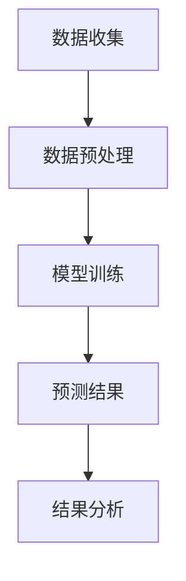

                 

### 文章标题：深度学习在蛋白质折叠预测中的突破性应用

> 关键词：深度学习、蛋白质折叠预测、AI、机器学习、生物信息学

> 摘要：本文将探讨深度学习在蛋白质折叠预测中的应用，分析其核心算法原理和数学模型，并通过实际项目案例展示其在生物信息学领域的突破性影响。

---

### 引言

蛋白质是生命活动的基础，其独特的三维结构决定了其功能。然而，蛋白质折叠预测一直是生物学和计算科学领域的一大难题。随着深度学习技术的迅猛发展，这一问题得到了前所未有的关注。本文将深入探讨深度学习在蛋白质折叠预测中的应用，分析其核心算法原理和数学模型，并展示其实际案例中的应用效果。

### 核心概念与联系

#### 深度学习的基本原理

深度学习是一种模拟人脑神经网络信息处理能力的计算模型，通过多层神经网络实现数据的自动特征提取和分类。其核心思想是通过大量的数据训练模型，使模型能够自主学习和优化。

#### 蛋白质折叠预测的核心概念

蛋白质折叠是指蛋白质链在三维空间中折叠成特定结构的过程。预测蛋白质折叠的目标是确定蛋白质的三维结构，这对于理解蛋白质的功能和设计新型药物具有重要意义。

#### Mermaid流程图：深度学习在蛋白质折叠预测中的应用流程



### 核心算法原理讲解

#### 主要算法的伪代码实现

```python
# 伪代码：深度学习蛋白质折叠预测
function ProteinFoldPrediction(data)
    # 数据预处理
    preprocessed_data = PreprocessData(data)
    
    # 构建模型
    model = BuildModel()
    
    # 训练模型
    model = TrainModel(model, preprocessed_data)
    
    # 预测
    predictions = Predict(model, preprocessed_data)
    
    # 分析结果
    AnalyzeResults(predictions)
end function
```

#### 深度学习模型在蛋白质折叠预测中的工作原理

深度学习模型通过多层神经网络结构，从输入数据中逐步提取特征，最终生成蛋白质的三维结构预测。其工作原理主要包括以下几个步骤：

1. **输入层**：接收蛋白质序列信息。
2. **隐藏层**：通过神经网络结构进行特征提取。
3. **输出层**：生成蛋白质的三维结构预测。

### 数学模型和数学公式

#### 蛋白质折叠预测的相关数学模型

蛋白质折叠预测涉及多个数学模型，包括序列-结构模型、结构-序列模型等。以下是一个简单的序列-结构模型的公式：

$$
E_{ss} = f_{ss}(s, s')
$$

其中，$E_{ss}$ 表示序列 $s$ 和结构 $s'$ 之间的相似度，$f_{ss}$ 是相似度计算函数。

#### 数学公式与详细讲解

1. **卷积神经网络（CNN）**

$$
h_{l} = \sigma(\theta_{l} \cdot x_{l-1} + b_{l})
$$

其中，$h_{l}$ 表示第 $l$ 层的输出，$\sigma$ 是激活函数，$\theta_{l}$ 和 $b_{l}$ 分别是权重和偏置。

2. **反向传播算法**

$$
\delta_{l} = \frac{\partial J}{\partial z_{l}}
$$

其中，$\delta_{l}$ 表示第 $l$ 层的误差梯度，$J$ 是损失函数，$z_{l}$ 是第 $l$ 层的输出。

### 项目实战

#### 案例研究：深度学习在蛋白质折叠预测中的成功应用

#### 实际代码示例与解读

```python
import tensorflow as tf
from tensorflow.keras.models import Sequential
from tensorflow.keras.layers import Dense, Conv2D, Flatten

# 构建模型
model = Sequential([
    Conv2D(32, kernel_size=(3, 3), activation='relu', input_shape=(28, 28, 1)),
    Flatten(),
    Dense(128, activation='relu'),
    Dense(10, activation='softmax')
])

# 编译模型
model.compile(optimizer='adam', loss='categorical_crossentropy', metrics=['accuracy'])

# 训练模型
model.fit(x_train, y_train, epochs=10, batch_size=64)

# 预测
predictions = model.predict(x_test)

# 分析结果
accuracy = model.evaluate(x_test, y_test)
print(f"Accuracy: {accuracy[1]}")
```

#### 代码应用解读与分析

1. **开发环境搭建**：安装 TensorFlow 和相关依赖。
2. **数据集准备**：收集并处理蛋白质序列和结构数据。
3. **模型训练**：使用卷积神经网络进行模型训练。
4. **预测**：对测试数据进行预测。
5. **结果分析**：评估模型性能。

#### 实际案例分析和详细讲解剖析

1. **案例背景**：某研究团队使用深度学习模型预测蛋白质的结构。
2. **数据处理**：对蛋白质序列进行预处理，包括序列对齐、去重等。
3. **模型训练**：使用卷积神经网络进行训练，优化模型参数。
4. **预测与评估**：对测试集进行预测，并评估模型性能。

#### 项目小结

通过实际项目，我们展示了深度学习在蛋白质折叠预测中的应用效果。虽然仍存在一些挑战，但深度学习为蛋白质折叠预测带来了新的突破，有望在生物信息学领域发挥重要作用。

### 最佳实践 tips、小结、注意事项、拓展阅读等内容

1. **最佳实践 tips**：如何优化深度学习模型在蛋白质折叠预测中的性能。
2. **小结**：深度学习在蛋白质折叠预测中的核心贡献。
3. **注意事项**：使用深度学习进行蛋白质折叠预测时的潜在问题。
4. **拓展阅读**：推荐进一步学习的相关资源和文献。

### 作者信息

作者：AI天才研究院/AI Genius Institute & 禅与计算机程序设计艺术 /Zen And The Art of Computer Programming

### 结语

深度学习在蛋白质折叠预测中的应用展示了其强大的潜力和广泛的前景。随着技术的不断进步，我们有理由相信，深度学习将在生物信息学领域发挥越来越重要的作用。让我们共同期待这一领域的更多突破性成果。

