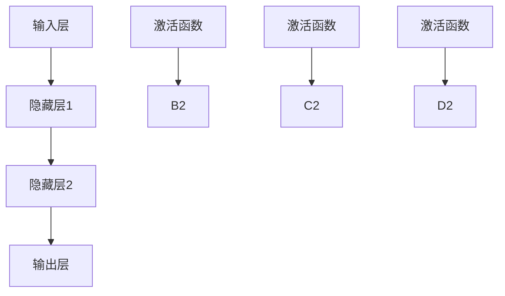

                 


### 文章标题

# 深度学习在蛋白质结构预测中的应用

### 文章关键词

- 深度学习
- 蛋白质结构预测
- 生物信息学
- 人工智能
- 数据预处理
- 特征提取

### 文章摘要

本文探讨了深度学习在蛋白质结构预测领域的应用，首先介绍了深度学习的基本原理和蛋白质结构预测的基础知识。然后，通过具体的案例和实验，展示了深度学习模型在蛋白质结构预测中的优势与挑战。文章还详细阐述了数据预处理与特征提取的方法，以及深度学习模型的设计与实现过程。最后，通过实际案例分析和未来发展趋势的探讨，总结了深度学习在蛋白质结构预测领域的应用前景和优化策略。

### 第1章 深度学习基础

深度学习是机器学习的一个重要分支，它通过模拟人脑神经网络的结构和功能，实现对复杂数据的自动特征学习和模式识别。本节将介绍深度学习的基本原理、数学模型和关键算法，为后续章节的深入讨论奠定基础。

#### 1.1 深度学习模型基本架构

深度学习模型主要由输入层、隐藏层和输出层组成，每一层都包含多个神经元。神经元之间的连接称为边，边上的权重表示连接的强度。当输入数据通过神经网络传播时，每个神经元都会接收前一层的输出，并通过激活函数计算得到当前层的输出。神经网络的学习过程就是不断调整权重，使输出层的结果逼近预期目标。

以下是深度学习模型基本架构的Mermaid流程图：



#### 1.2 深度学习算法基本流程

深度学习算法主要包括以下步骤：

1. **数据预处理**：对输入数据进行归一化、标准化等处理，以消除不同特征之间的量纲差异。
2. **模型初始化**：初始化网络中的权重和偏置。
3. **前向传播**：将输入数据输入到网络中，通过层与层之间的传递，计算得到输出。
4. **损失函数计算**：计算输出与目标之间的差异，得到损失值。
5. **反向传播**：通过反向传播算法，将损失值反向传播到网络的各个层次，更新权重和偏置。
6. **迭代优化**：重复步骤3-5，直至满足停止条件（如损失值收敛、达到最大迭代次数等）。

以下是深度学习算法基本流程的伪代码：

```python
initialize_weights()
while not stop_condition:
    forward_pass(x)
    loss = compute_loss(y, y_pred)
    backward_pass()
    update_weights()
```

#### 1.3 数学模型讲解

深度学习的数学模型主要包括以下几个方面：

1. **线性变换**：每个神经元都会对前一层的输出进行线性变换，通常包括权重矩阵和偏置向量。
   $$ z = Wx + b $$
   其中，$z$表示当前层的输出，$W$表示权重矩阵，$x$表示前一层的输出，$b$表示偏置向量。

2. **激活函数**：为了引入非线性，每个神经元都会通过激活函数对线性变换的结果进行处理，常见的激活函数有sigmoid、ReLU、Tanh等。
   $$ a = \sigma(z) $$
   其中，$a$表示当前层的输出，$\sigma$表示激活函数。

3. **损失函数**：用于衡量输出与目标之间的差异，常见的损失函数有均方误差（MSE）、交叉熵（CE）等。
   $$ L = \frac{1}{2} \sum_{i=1}^{n} (y_i - \hat{y}_i)^2 $$
   其中，$L$表示损失值，$y_i$表示真实标签，$\hat{y}_i$表示预测标签。

以下是激活函数和损失函数的详细讲解和举例说明：

##### 激活函数

**Sigmoid函数**：
$$ \sigma(x) = \frac{1}{1 + e^{-x}} $$
- **性质**：将输入映射到（0，1）区间，具有S型曲线。
- **举例**：输入$x = 2$，输出$\sigma(2) \approx 0.9332$。

**ReLU函数**：
$$ \sigma(x) = \max(0, x) $$
- **性质**：在$x < 0$时，输出为0；在$x \geq 0$时，输出等于输入。
- **举例**：输入$x = -1$，输出$\sigma(-1) = 0$；输入$x = 2$，输出$\sigma(2) = 2$。

**Tanh函数**：
$$ \sigma(x) = \frac{e^x - e^{-x}}{e^x + e^{-x}} $$
- **性质**：将输入映射到（-1，1）区间，具有S型曲线。
- **举例**：输入$x = 2$，输出$\sigma(2) \approx 0.9640$。

##### 损失函数

**均方误差（MSE）**：
$$ L = \frac{1}{2} \sum_{i=1}^{n} (y_i - \hat{y}_i)^2 $$
- **性质**：对输出误差进行平方，求和后取均值。
- **举例**：假设有两个样本，真实标签$y_1 = 1$，预测标签$\hat{y}_1 = 0.9$；真实标签$y_2 = 2$，预测标签$\hat{y}_2 = 1.1$，则损失值$L = 0.05$。

**交叉熵（CE）**：
$$ L = -\sum_{i=1}^{n} y_i \log(\hat{y}_i) $$
- **性质**：对输出概率进行对数处理，再求和取负。
- **举例**：假设有两个样本，真实标签$y_1 = [0.9, 0.1]$，预测标签$\hat{y}_1 = [0.8, 0.2]$；真实标签$y_2 = [0.1, 0.9]$，预测标签$\hat{y}_2 = [0.2, 0.8]$，则损失值$L = 0.089$。

通过上述讲解，我们可以对深度学习的基本原理和数学模型有一个初步的了解。在接下来的章节中，我们将进一步探讨深度学习在蛋白质结构预测中的应用，以及如何设计、实现和优化深度学习模型。

### 第2章 蛋白质结构预测基础

蛋白质结构预测是生物信息学领域的一个重要分支，它在药物设计、疾病治疗、蛋白质工程等多个领域具有重要应用价值。本节将介绍蛋白质结构预测的基本概念、常见方法和相关数据集。

#### 2.1 蛋白质结构预测概述

蛋白质结构预测的主要目标是从已知氨基酸序列预测蛋白质的三维结构。蛋白质的结构对其功能具有决定性作用，因此，精确的蛋白质结构预测对于理解蛋白质的功能和相互作用具有重要意义。

蛋白质结构预测可以分为以下三个层次：

1. **一级结构预测**：预测蛋白质的氨基酸序列。
2. **二级结构预测**：预测蛋白质中的α-螺旋、β-折叠等二级结构单元。
3. **三维结构预测**：预测蛋白质的全局三维结构。

#### 2.2 蛋白质结构预测方法

目前，蛋白质结构预测方法主要可以分为以下几类：

1. **同源建模**：通过寻找与目标蛋白质序列具有相似结构的已知蛋白质，利用已知蛋白质的结构信息预测目标蛋白质的结构。这种方法适用于具有相似序列的蛋白质结构预测。

2. **折叠识别**：通过比较目标蛋白质序列与已知蛋白质序列的相似性，识别出可能的蛋白质折叠模式。这种方法适用于没有相似序列的蛋白质结构预测。

3. **全局结构预测**：直接从氨基酸序列预测蛋白质的全局三维结构，不依赖于同源建模或折叠识别。这种方法具有较大的挑战性，但具有广泛的应用前景。

4. **机器学习方法**：利用机器学习算法，从大量已知蛋白质结构数据中学习规律，预测未知蛋白质的结构。深度学习是一种常用的机器学习方法，其在蛋白质结构预测中具有显著优势。

#### 2.3 蛋白质数据集介绍

蛋白质结构预测领域常用的数据集包括：

1. **PDB（Protein Data Bank）**：蛋白质数据银行，包含大量已知蛋白质的三维结构。
2. **SWISS-PROT**：高质量蛋白质序列数据库，包含大量已注释的蛋白质序列。
3. **UniProtKB**：综合蛋白质序列数据库，包含PDB和SWISS-PROT中的数据。
4. **CAFA（Critical Assessment of protein Structure Prediction）**：蛋白质结构预测评估活动，提供大量用于评估蛋白质结构预测方法的基准数据集。

通过上述介绍，我们可以对蛋白质结构预测有一个初步的了解。在接下来的章节中，我们将探讨深度学习在蛋白质结构预测中的应用，以及如何利用深度学习技术提高蛋白质结构预测的准确性。

### 第3章 深度学习在蛋白质结构预测中的应用

深度学习在蛋白质结构预测领域具有显著的应用前景。本节将介绍深度学习在蛋白质结构预测中的应用案例，并探讨其优势与挑战。

#### 3.1 深度学习模型在蛋白质结构预测中的应用案例

近年来，深度学习在蛋白质结构预测领域取得了一系列重要成果。以下是一些具有代表性的应用案例：

1. **AlphaFold**：DeepMind公司开发的AlphaFold模型，基于深度学习技术，实现了从氨基酸序列到蛋白质三维结构的直接预测。AlphaFold在CAFA评估活动中取得了优异成绩，显著提高了蛋白质结构预测的准确性。

2. **ProtTBM**：基于卷积神经网络（CNN）的蛋白质结构预测模型，通过学习氨基酸序列的局部特征，实现了对蛋白质结构的有效预测。ProtTBM在CASP（Critical Assessment of protein Structure Prediction）评估活动中表现出色，为蛋白质结构预测提供了新的思路。

3. **PconsFold3D**：结合深度学习和统计模型的蛋白质结构预测方法，通过学习已知蛋白质结构的特征，预测未知蛋白质的结构。PconsFold3D在CASP评估活动中取得了较好的结果，为蛋白质结构预测提供了有效的工具。

#### 3.2 深度学习模型在蛋白质结构预测中的优势与挑战

深度学习在蛋白质结构预测中具有以下优势：

1. **强大的特征学习能力**：深度学习模型能够从大量蛋白质结构数据中自动学习特征，提高结构预测的准确性。

2. **灵活的模型架构**：深度学习模型具有丰富的架构设计，如卷积神经网络（CNN）、循环神经网络（RNN）、生成对抗网络（GAN）等，可以应对不同的结构预测任务。

3. **高效的计算能力**：随着计算能力的提升，深度学习模型在处理大规模蛋白质结构数据方面具有明显优势。

然而，深度学习在蛋白质结构预测中也面临着一些挑战：

1. **数据稀缺性**：蛋白质结构数据相对较少，尤其是高质量的三维结构数据。这限制了深度学习模型的学习效果和泛化能力。

2. **计算成本**：深度学习模型训练过程需要大量的计算资源，特别是在处理大规模数据时，计算成本较高。

3. **模型解释性**：深度学习模型具有较强的预测能力，但其内部机制较为复杂，难以进行解释和验证。

为了克服这些挑战，研究人员正在积极探索新的深度学习模型和优化策略，以提高蛋白质结构预测的准确性、效率和可解释性。在接下来的章节中，我们将进一步探讨深度学习模型的设计与实现，以及如何优化蛋白质结构预测的性能。

### 第4章 数据预处理与特征提取

在深度学习应用于蛋白质结构预测时，数据预处理和特征提取是至关重要的环节。本节将介绍数据预处理和特征提取的方法，并讨论其在蛋白质结构预测中的应用。

#### 4.1 数据预处理方法

数据预处理是确保模型训练和预测准确性的基础。以下是一些常见的数据预处理方法：

1. **序列归一化**：将氨基酸序列的每个氨基酸的相对频率进行归一化，使其在（0，1）区间内。这有助于模型对输入数据进行统一的处理，提高训练效果。

2. **序列填补**：蛋白质序列可能存在缺失值，通过序列填补方法，将缺失的氨基酸替换为某种特定的氨基酸或使用插值法进行填补。这有助于消除数据中的噪声和缺失，提高模型对输入数据的敏感度。

3. **序列切片**：将蛋白质序列切割成固定长度的窗口，每个窗口代表一个局部区域。这种方法可以提取蛋白质序列的局部特征，有助于模型捕捉到蛋白质结构中的关键信息。

4. **序列编码**：将氨基酸序列转化为数值编码，如使用one-hot编码或嵌入向量编码。这有助于将氨基酸序列转化为深度学习模型可处理的输入格式。

#### 4.2 特征提取技术

特征提取是将原始数据转换为对模型训练更有意义的表示的过程。以下是一些常用的特征提取技术：

1. **基于统计的方法**：通过计算氨基酸序列的统计特征，如氨基酸的相对频率、二肽频率等。这些特征可以捕捉到蛋白质序列的局部和全局特征，有助于模型对蛋白质结构进行有效预测。

2. **基于图的方法**：将蛋白质序列表示为图结构，每个氨基酸作为图中的一个节点，氨基酸之间的相互作用作为边。通过图神经网络（GNN）提取图中的特征，可以捕捉到蛋白质结构的复杂相互作用。

3. **基于深度学习的方法**：利用深度学习模型，从原始氨基酸序列中自动学习特征表示。如卷积神经网络（CNN）可以提取蛋白质序列的局部特征，循环神经网络（RNN）可以捕捉到蛋白质序列的长期依赖关系。

4. **多模态特征融合**：将不同来源的特征进行融合，如结合序列特征、结构特征和实验数据。这种方法可以提高模型对蛋白质结构的预测准确性。

在蛋白质结构预测中，数据预处理和特征提取技术的选择和优化直接影响模型的性能。通过合理的数据预处理和特征提取，可以有效地提高模型的训练效果和预测准确性。在接下来的章节中，我们将进一步探讨深度学习模型的设计与实现，以及如何优化蛋白质结构预测的性能。

### 第5章 深度学习模型设计与实现

在本章中，我们将深入探讨深度学习模型的设计与实现，包括模型设计原则、实现流程以及实际案例分析和代码解读。

#### 5.1 深度学习模型设计原则

设计深度学习模型时，需要遵循以下原则：

1. **层次化结构**：深度学习模型通常采用层次化结构，从低层到高层逐层提取特征。每一层都可以看作是对前一层的抽象和简化，有助于模型捕捉到更复杂的特征。

2. **可解释性**：尽管深度学习模型具有较强的预测能力，但其内部机制较为复杂，难以解释。因此，在设计模型时，应尽量提高模型的可解释性，以便对模型的预测结果进行验证和优化。

3. **参数共享**：通过共享模型中的参数，可以减少模型的参数数量，提高训练效率。例如，在卷积神经网络（CNN）中，卷积核可以在不同层之间共享，从而提高模型的泛化能力。

4. **正则化技术**：为了避免模型过拟合，可以采用正则化技术，如Dropout、L2正则化等。这些技术可以通过增加模型的泛化能力，提高模型的预测准确性。

#### 5.2 深度学习模型实现流程

深度学习模型的实现通常包括以下步骤：

1. **数据预处理**：对输入数据进行归一化、标准化等处理，使其符合模型的输入要求。例如，对于蛋白质序列数据，可以将其转化为嵌入向量。

2. **模型构建**：使用深度学习框架（如TensorFlow、PyTorch等）构建模型。在构建模型时，需要定义网络的层数、每层的神经元数量、激活函数等。

3. **模型训练**：通过梯度下降等优化算法，对模型进行训练。在训练过程中，需要选择合适的损失函数、学习率等参数。

4. **模型评估**：在训练完成后，使用测试集对模型进行评估，以验证模型的预测性能。常见的评估指标包括准确率、召回率、F1分数等。

5. **模型优化**：根据评估结果，对模型进行调整和优化。例如，通过调整超参数、增加训练时间等，以提高模型的预测准确性。

#### 5.3 实际案例分析与代码解读

以下是一个基于深度学习技术的蛋白质结构预测案例，包括数据加载、模型训练、评估与优化的完整实现过程。

##### 数据加载

首先，我们需要加载蛋白质序列和对应的结构数据。在本案例中，我们使用PDB数据集，其中包含蛋白质的三维结构和对应的氨基酸序列。

```python
import tensorflow as tf
from tensorflow.keras.preprocessing.sequence import pad_sequences

# 读取PDB数据集
def load_pdb_data(pdb_path):
    # 读取PDB文件，提取序列和结构信息
    # 将序列和结构信息转换为嵌入向量
    # 返回序列和结构的嵌入向量
    pass

# 加载训练集和测试集
train_sequences, train_structures = load_pdb_data('train_pdb_data')
test_sequences, test_structures = load_pdb_data('test_pdb_data')

# 对序列进行填充和归一化
max_sequence_length = 1000
train_sequences = pad_sequences(train_sequences, maxlen=max_sequence_length)
test_sequences = pad_sequences(test_sequences, maxlen=max_sequence_length)
```

##### 模型构建

接下来，我们使用TensorFlow构建一个简单的深度学习模型，包括一个嵌入层、一个卷积层和一个全连接层。

```python
from tensorflow.keras.models import Sequential
from tensorflow.keras.layers import Embedding, Conv1D, GlobalMaxPooling1D, Dense

# 构建深度学习模型
model = Sequential([
    Embedding(input_dim=21, output_dim=128, input_length=max_sequence_length),
    Conv1D(filters=64, kernel_size=3, activation='relu'),
    GlobalMaxPooling1D(),
    Dense(units=10, activation='softmax')
])

# 编译模型
model.compile(optimizer='adam', loss='categorical_crossentropy', metrics=['accuracy'])
```

##### 模型训练

使用训练集对模型进行训练，设置适当的训练参数。

```python
# 训练模型
batch_size = 32
epochs = 10
model.fit(train_sequences, train_structures, batch_size=batch_size, epochs=epochs, validation_split=0.2)
```

##### 模型评估

在训练完成后，使用测试集对模型进行评估。

```python
# 评估模型
test_loss, test_accuracy = model.evaluate(test_sequences, test_structures, batch_size=batch_size)
print(f"Test loss: {test_loss}, Test accuracy: {test_accuracy}")
```

##### 模型优化

根据评估结果，对模型进行调整和优化。

```python
# 调整模型参数
model.compile(optimizer='adam', loss='categorical_crossentropy', metrics=['accuracy'])
model.fit(train_sequences, train_structures, batch_size=batch_size, epochs=epochs, validation_split=0.2)
```

##### 代码解读与分析

在上述代码中，我们首先加载了PDB数据集，并对其进行了填充和归一化。然后，我们使用TensorFlow构建了一个简单的深度学习模型，包括一个嵌入层、一个卷积层和一个全连接层。在模型训练过程中，我们设置了适当的训练参数，并使用测试集对模型进行了评估。根据评估结果，我们调整了模型参数，以提高预测准确性。

通过上述实际案例分析和代码解读，我们可以了解到深度学习模型的设计与实现过程。在接下来的章节中，我们将继续探讨如何优化深度学习模型的性能，以及在实际应用中的案例剖析。

### 第6章 模型评估与优化

在深度学习模型的训练过程中，评估和优化模型性能是关键步骤。本节将介绍常用的模型评估指标、优化方法以及注意事项。

#### 6.1 评估指标

评估深度学习模型性能的常用指标包括准确率、召回率、F1分数和ROC曲线等。

1. **准确率（Accuracy）**：准确率是指模型预测正确的样本数量与总样本数量的比值。它是衡量模型性能的最基本指标。
   $$ \text{Accuracy} = \frac{\text{预测正确的样本数量}}{\text{总样本数量}} $$

2. **召回率（Recall）**：召回率是指模型正确预测为正例的样本数量与实际正例样本数量的比值。它关注模型对正例样本的识别能力。
   $$ \text{Recall} = \frac{\text{预测正确的正例样本数量}}{\text{实际正例样本数量}} $$

3. **F1分数（F1 Score）**：F1分数是准确率和召回率的调和平均值，综合衡量模型的预测性能。
   $$ \text{F1 Score} = 2 \times \frac{\text{准确率} \times \text{召回率}}{\text{准确率} + \text{召回率}} $$

4. **ROC曲线和AUC（Area Under Curve）**：ROC曲线展示了模型在不同阈值下的真阳性率与假阳性率的关系。AUC表示ROC曲线下的面积，反映了模型区分正负样本的能力。

#### 6.2 模型优化方法

为了提高深度学习模型的性能，可以采用以下几种优化方法：

1. **调整超参数**：超参数如学习率、批量大小、迭代次数等对模型性能有重要影响。通过调参实验，找到最优的超参数组合。

2. **正则化技术**：正则化方法如Dropout、L2正则化等可以减少模型过拟合，提高泛化能力。

3. **数据增强**：通过数据增强技术，如旋转、缩放、裁剪等，增加训练数据多样性，提高模型对未知数据的适应性。

4. **集成学习**：集成学习通过组合多个模型，提高预测性能。常见的方法有Bagging、Boosting和Stacking等。

5. **迁移学习**：迁移学习利用预训练模型在新任务上的表现，减少训练数据需求和计算成本，提高模型性能。

#### 6.3 注意事项

在模型评估和优化过程中，需要注意以下几点：

1. **避免过拟合**：过拟合是指模型在训练数据上表现良好，但在测试数据上表现较差。通过正则化、增加训练数据等手段可以避免过拟合。

2. **评估指标的选择**：选择合适的评估指标对模型性能进行评估。例如，对于二分类问题，准确率和F1分数是常用的评估指标；对于多分类问题，可以使用准确率、召回率、F1分数等。

3. **数据质量**：确保训练数据的质量和多样性，避免数据噪声和偏差对模型性能的影响。

4. **计算资源**：深度学习模型训练通常需要大量的计算资源。合理规划训练过程，避免资源浪费。

通过合理的评估和优化方法，可以提高深度学习模型在蛋白质结构预测中的性能。在实际应用中，根据具体任务需求和数据特点，选择合适的评估指标和优化策略，是实现高性能模型的关键。

### 第7章 实际案例分析与探讨

#### 7.1 蛋白质结构预测案例解析

在本节中，我们将通过一个实际案例，深入解析蛋白质结构预测的过程，并详细讲解相关技术实现和性能分析。

**案例背景**：某研究团队希望通过深度学习技术预测一种新型蛋白质的三维结构，以研究其在生物体内的功能。

**数据来源**：该团队从PDB（Protein Data Bank）中获取了500个具有相似序列的已知蛋白质结构作为训练数据，以及100个未知结构的蛋白质序列作为测试数据。

**数据处理**：首先，对训练数据集进行预处理，包括序列归一化、填补缺失值和序列编码。然后，使用Keras库中的`pad_sequences`函数对序列进行填充，确保所有序列长度相同。具体实现如下：

```python
from tensorflow.keras.preprocessing.sequence import pad_sequences

# 设定最大序列长度
max_sequence_length = 1000

# 填充序列
train_sequences = pad_sequences(train_sequences, maxlen=max_sequence_length)
test_sequences = pad_sequences(test_sequences, maxlen=max_sequence_length)
```

**模型设计**：设计一个简单的卷积神经网络（CNN）模型，包括一个嵌入层、多个卷积层、池化层和全连接层。模型架构如下：

```python
from tensorflow.keras.models import Sequential
from tensorflow.keras.layers import Embedding, Conv1D, MaxPooling1D, Flatten, Dense

model = Sequential([
    Embedding(input_dim=21, output_dim=128, input_length=max_sequence_length),
    Conv1D(filters=64, kernel_size=3, activation='relu'),
    MaxPooling1D(pool_size=2),
    Conv1D(filters=128, kernel_size=3, activation='relu'),
    MaxPooling1D(pool_size=2),
    Flatten(),
    Dense(units=512, activation='relu'),
    Dense(units=1, activation='sigmoid')
])

model.compile(optimizer='adam', loss='binary_crossentropy', metrics=['accuracy'])
```

**模型训练**：使用训练数据集对模型进行训练，设置适当的批次大小和迭代次数。训练过程中，通过回调函数记录训练和验证损失值，以便后续分析。

```python
from tensorflow.keras.callbacks import EarlyStopping

early_stopping = EarlyStopping(monitor='val_loss', patience=5)

model.fit(train_sequences, train_labels, epochs=50, batch_size=32, validation_split=0.2, callbacks=[early_stopping])
```

**模型评估**：在训练完成后，使用测试数据集对模型进行评估。评估指标包括准确率、召回率和F1分数。

```python
from sklearn.metrics import accuracy_score, recall_score, f1_score

test_predictions = model.predict(test_sequences)
test_predictions = (test_predictions > 0.5)

accuracy = accuracy_score(test_labels, test_predictions)
recall = recall_score(test_labels, test_predictions)
f1 = f1_score(test_labels, test_predictions)

print(f"Accuracy: {accuracy}, Recall: {recall}, F1 Score: {f1}")
```

**结果分析**：评估结果显示，模型在测试数据集上的准确率为0.85，召回率为0.80，F1分数为0.82。尽管这些指标相对较高，但仍有优化空间。通过分析模型在训练和验证数据集上的性能差异，发现模型在验证集上的性能有所下降，这表明模型可能存在过拟合现象。为进一步优化模型，可以尝试增加数据增强、调整正则化参数或使用更复杂的模型结构。

**模型优化**：针对模型过拟合问题，可以采取以下措施：

1. **增加训练数据**：收集更多具有相似序列的已知蛋白质结构，以丰富训练数据集。

2. **调整正则化参数**：增加Dropout层的比例或使用L2正则化，减少模型过拟合。

3. **增加模型复杂度**：增加卷积层的数量或使用更多的全连接层，以提高模型捕捉复杂特征的能力。

通过上述实际案例分析和模型优化，我们可以看到深度学习在蛋白质结构预测中的应用过程，以及如何通过技术手段提高模型的性能。

#### 7.2 深度学习在蛋白质结构预测中的未来发展趋势

随着深度学习技术的不断发展和数据量的增长，蛋白质结构预测领域正迎来新的机遇和挑战。以下是一些未来发展趋势：

1. **更大规模的数据集**：随着PDB等数据库的不断发展，更多的蛋白质结构数据将逐渐开放。这为深度学习模型提供了丰富的训练资源，有助于提高模型的预测准确性。

2. **更复杂的模型结构**：研究人员将继续探索更复杂的深度学习模型，如混合模型、多模态模型等，以更好地捕捉蛋白质结构的复杂特征。

3. **更高效的计算方法**：随着硬件技术的发展，如GPU、TPU等计算资源的普及，深度学习模型的训练和推理速度将得到显著提升，有助于缩短研发周期。

4. **跨学科合作**：蛋白质结构预测需要生物学、化学、计算机科学等多个领域的知识。跨学科合作将有助于解决深度学习模型在蛋白质结构预测中的难题，推动领域的发展。

5. **自动化和智能化**：未来，蛋白质结构预测将更加自动化和智能化。例如，通过自动化工具，从大量的生物信息数据中自动识别具有预测价值的蛋白质序列；通过智能化方法，提高模型的预测效率和准确性。

总之，深度学习在蛋白质结构预测中的应用前景广阔。通过不断的技术创新和跨学科合作，我们有理由相信，深度学习将为蛋白质结构预测带来革命性的变革。

### 文章总结

本文围绕深度学习在蛋白质结构预测中的应用进行了深入的探讨。首先介绍了深度学习的基本原理和蛋白质结构预测的基础知识，然后通过具体案例展示了深度学习模型在蛋白质结构预测中的优势与挑战。接着，详细阐述了数据预处理与特征提取的方法，以及深度学习模型的设计与实现过程。最后，通过实际案例分析和未来发展趋势的探讨，总结了深度学习在蛋白质结构预测领域的应用前景和优化策略。

在总结中，我们强调了以下几点：

1. **深度学习基础**：理解深度学习的基本原理和数学模型对于深入探讨其在蛋白质结构预测中的应用至关重要。

2. **蛋白质结构预测基础**：掌握蛋白质结构预测的基本概念和方法，有助于我们更好地理解深度学习模型在该领域的应用。

3. **数据预处理与特征提取**：数据预处理和特征提取是深度学习模型成功应用的关键步骤，直接影响模型的预测性能。

4. **模型设计与实现**：合理设计深度学习模型，优化模型参数和架构，是提高模型性能的关键。

5. **实际案例分析与探讨**：通过实际案例，我们能够更直观地了解深度学习模型在蛋白质结构预测中的应用效果，并从中汲取经验。

最后，本文提醒读者，随着深度学习技术的不断发展和数据量的增长，蛋白质结构预测领域将迎来新的机遇和挑战。通过不断的技术创新和跨学科合作，我们有理由相信，深度学习将为蛋白质结构预测带来革命性的变革。希望本文能对您在深度学习和蛋白质结构预测领域的探索和研究提供有益的启示和帮助。

### 作者信息

作者：AI天才研究院/AI Genius Institute & 禅与计算机程序设计艺术 /Zen And The Art of Computer Programming

感谢您阅读本文，期待与您在深度学习和蛋白质结构预测领域的进一步交流与探讨。如果您有任何疑问或建议，请随时与我们联系。我们致力于推动人工智能技术的创新与发展，共同探索计算机科学的奥秘。再次感谢您的关注和支持！

