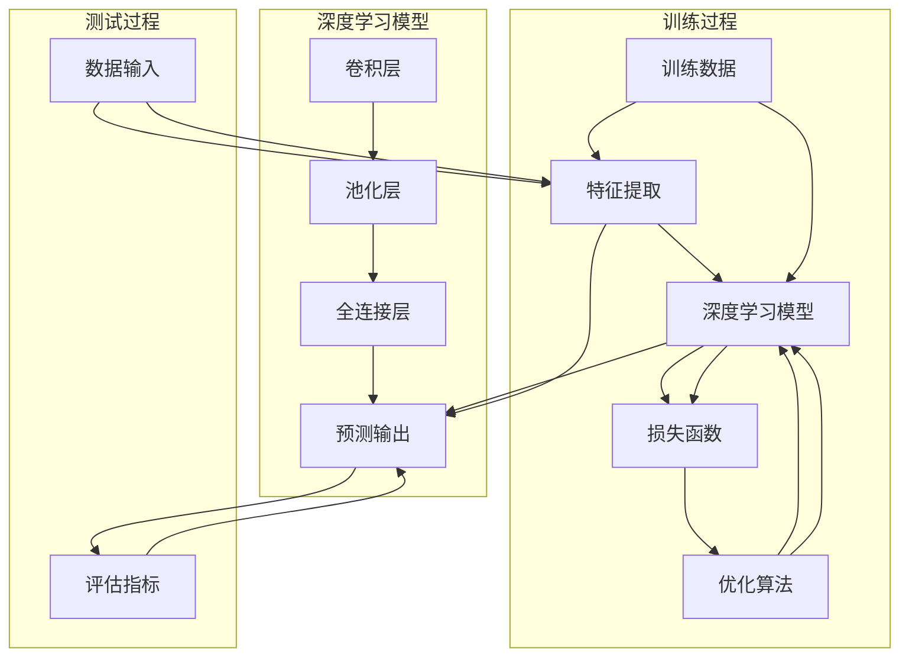

                 

### 文章标题

# 深度学习在蛋白质结构预测中的突破性进展

## 关键词

- 深度学习
- 蛋白质结构预测
- AlphaFold2
- 人工智能
- 生物信息学

## 摘要

深度学习作为一种强大的机器学习技术，在多个领域取得了显著的突破。特别是在蛋白质结构预测领域，深度学习技术凭借其强大的建模能力和高效率的数据处理能力，带来了前所未有的进展。本文将深入探讨深度学习在蛋白质结构预测中的核心概念、模型和应用，解析AlphaFold2这一里程碑式的突破，并展望未来深度学习在该领域的进一步发展。

## 引言

蛋白质是生物体的重要组成部分，它们在生命过程中发挥着至关重要的作用，从酶催化到细胞信号传递，再到免疫反应等。蛋白质的结构决定了其功能，因此，精确预测蛋白质的结构对于理解生物学过程和开发新药具有重要意义。然而，传统的蛋白质结构预测方法面临着计算复杂度高、预测准确性受限等挑战。随着深度学习技术的发展，这些问题得到了有效的解决。

本文旨在通过以下几个部分详细探讨深度学习在蛋白质结构预测中的突破性进展：

1. **深度学习基础**：介绍深度学习的核心概念、模型和训练技巧。
2. **蛋白质结构预测技术**：讨论蛋白质结构预测的基本原理和深度学习在该领域的应用。
3. **深度学习在蛋白质结构预测中的突破性进展**：重点分析AlphaFold2及其他深度学习模型的应用。
4. **深度学习在蛋白质结构预测中的实际应用**：探讨深度学习在药物设计和其他生物信息学领域的应用。
5. **未来展望**：分析深度学习在蛋白质结构预测中的挑战与机遇。

通过本文的探讨，我们希望能够让读者全面了解深度学习在蛋白质结构预测中的重要作用，并对其未来的发展充满期待。

### 深度学习基础

#### 核心概念

深度学习是一种基于多层神经网络构建的机器学习技术。它的核心思想是通过多层网络的学习和训练，将输入数据从低维空间映射到高维空间，以实现复杂特征的提取和分类。与传统机器学习方法相比，深度学习在处理大规模、高维数据时具有显著优势。

深度学习的基础是人工神经网络（Artificial Neural Networks，ANN）。神经网络由多个神经元（或节点）组成，每个神经元都与其他神经元相连接。这些连接称为边，每个边都有一个权重（weight），用于表示两个神经元之间的相互作用强度。网络通过学习调整这些权重，以最小化预测误差。

在深度学习中，通常使用反向传播算法（Backpropagation）来训练神经网络。反向传播算法通过计算梯度来更新权重，从而优化网络参数。这个过程在多个训练循环（epochs）中重复，直到网络的预测误差达到可接受的水平。

#### 模型

深度学习模型可以根据其结构分为多种类型，包括卷积神经网络（Convolutional Neural Networks，CNN）、循环神经网络（Recurrent Neural Networks，RNN）和自注意力机制（Self-Attention Mechanism）等。

**卷积神经网络（CNN）**：CNN特别适用于处理图像数据。其核心是卷积层，通过局部感知野（local receptive fields）提取图像的局部特征。CNN通过堆叠多个卷积层和池化层，逐步提取更高级别的特征。

**循环神经网络（RNN）**：RNN适用于处理序列数据，如图像序列、文本序列等。RNN通过在时间步（time steps）上递归地更新隐藏状态，能够捕捉序列中的长期依赖关系。然而，传统的RNN在处理长序列时容易遇到梯度消失或爆炸问题。

**长短时记忆网络（LSTM）**：LSTM是RNN的一种变体，通过引入门控机制（gating mechanisms）来有效地处理长序列。LSTM通过遗忘门（forget gate）、输入门（input gate）和输出门（output gate）来控制信息的流入和流出，从而避免梯度消失问题。

**自注意力机制（Self-Attention）**：自注意力机制是一种全局注意力机制，能够捕捉输入序列中的长距离依赖关系。自注意力机制通过计算每个词与所有其他词之间的关联强度，从而为每个词分配不同的权重，实现更精细的特征提取。

#### 训练技巧

在深度学习训练过程中，优化算法和数据预处理是两个关键环节。

**优化算法**：优化算法用于调整网络的参数，以最小化损失函数（loss function）。常见的优化算法包括梯度下降（Gradient Descent）、动量优化（Momentum）、Adagrad、RMSProp和Adam等。其中，Adam算法结合了Adagrad和RMSProp的优点，是目前最常用的优化算法。

**数据预处理**：数据预处理包括归一化（normalization）、标准化（standardization）、缺失值处理（missing value handling）、数据增强（data augmentation）等。适当的预处理可以提高模型的训练效率和预测准确性。

通过上述核心概念、模型和训练技巧的介绍，我们为理解深度学习在蛋白质结构预测中的应用奠定了基础。接下来，我们将探讨蛋白质结构预测的基本原理和深度学习模型在该领域的应用。

#### 背景介绍

蛋白质是生命活动的核心执行者，它们在生物体内执行各种功能，如催化化学反应、传递信号、提供结构支持等。蛋白质的结构决定了其功能，因此，精确预测蛋白质的结构对于理解生物学过程和开发新药具有重要意义。蛋白质结构预测是一个复杂的科学问题，其难度主要体现在以下几个方面：

首先，蛋白质结构的多样性极大。蛋白质是由20种氨基酸组成的长链分子，其结构可以是折叠的、线性的，或者形成复杂的超分子结构。这种多样性使得蛋白质结构预测面临巨大的挑战。

其次，蛋白质结构的预测需要处理大量的数据。蛋白质的结构信息通常来自实验数据，如X射线晶体学和核磁共振（NMR）谱图。然而，这些实验方法获取数据的过程复杂且耗时长，导致可用的实验数据量有限。

第三，蛋白质结构预测的算法需要高计算资源。传统的蛋白质结构预测方法，如同源建模（Homology Modeling）和自由能建模（Free Energy Modeling），依赖于大量的计算模拟和优化。这些算法的计算复杂度极高，往往需要高性能计算资源。

第四，蛋白质结构预测的准确性仍然有限。尽管近年来计算机性能和算法有了显著提升，但蛋白质结构预测的准确率仍然受到实验技术和算法模型的限制。特别是对于非同源蛋白质，结构预测的准确性仍然较低。

在深度学习出现之前，蛋白质结构预测主要依赖于传统的分子动力学模拟和量子化学计算。这些方法虽然在某些特定情况下能够提供高精度的预测，但其计算成本极高，且预测时间较长。此外，这些方法往往需要专业的生物化学知识，难以自动化和大规模应用。

深度学习的引入为蛋白质结构预测带来了新的契机。深度学习通过其强大的建模能力和高效率的数据处理能力，能够从大量数据中自动提取特征，并实现高精度的预测。深度学习模型的训练过程通过大量实验数据的反馈不断优化，从而提高预测的准确性。此外，深度学习模型的参数调整和优化相对简单，使得其在实际应用中具有很高的可操作性。

总之，深度学习在蛋白质结构预测中的优势主要体现在以下几个方面：

1. **强大的特征提取能力**：深度学习模型能够自动提取数据中的复杂特征，不需要预先定义特征，从而提高了预测的准确性。
2. **高效的数据处理**：深度学习模型能够快速处理大量数据，缩短了预测时间，提高了计算效率。
3. **高可操作性**：深度学习模型的结构和参数调整相对简单，使得其在实际应用中易于部署和扩展。

随着深度学习技术的不断发展，越来越多的研究成果表明，深度学习在蛋白质结构预测中具有巨大的潜力。例如，AlphaFold2等深度学习模型的突破性进展，不仅极大地提高了蛋白质结构预测的准确性，还为生物医学研究提供了新的工具和方法。

#### 核心概念与联系

为了深入理解深度学习在蛋白质结构预测中的核心概念及其联系，我们可以通过一个Mermaid流程图来展示这些概念之间的关系和作用。



**流程图解释**：

1. **数据输入（A）**：蛋白质结构预测的初始数据包括蛋白质序列和已知结构信息。这些数据作为深度学习模型的输入。
2. **特征提取（B）**：深度学习模型通过卷积层（I1）和池化层（I2）从输入数据中自动提取特征。这些特征包含了蛋白质序列的多种信息，如氨基酸的组成、序列的局部结构等。
3. **深度学习模型（C）**：特征提取后的数据进入深度学习模型，其中卷积层和全连接层（I3）共同作用，对数据进行进一步处理和建模。这个模型的结构可以根据具体任务进行调整和优化。
4. **预测输出（D）**：经过模型处理后，输出预测的蛋白质结构。这个输出可以通过全连接层（I3）直接得到，或者通过多个层的组合得到。
5. **损失函数（E）**：在训练过程中，损失函数（如均方误差、交叉熵等）用于衡量预测结果与真实结果之间的差距。深度学习模型通过优化算法（如梯度下降、Adam等）不断调整参数，以最小化损失函数。
6. **优化算法（G）**：优化算法负责调整模型的参数，使得模型在训练数据上达到最佳性能。不同的优化算法有不同的特点，可以根据具体任务进行选择。
7. **评估指标（H）**：在测试过程中，通过评估指标（如准确率、召回率、F1分数等）对模型的性能进行评估。这些指标可以帮助我们了解模型的预测能力和稳定性。

通过上述Mermaid流程图，我们可以清晰地看到深度学习在蛋白质结构预测中的核心概念及其相互作用。这个流程图不仅帮助我们理解了深度学习的具体实现过程，还为后续的算法讲解和具体应用提供了框架。

#### 核心算法原理讲解

在深度学习应用于蛋白质结构预测中，核心算法的设计和实现起着至关重要的作用。以下将详细介绍几种常用的深度学习模型，并使用伪代码来描述其工作原理。

##### 卷积神经网络（CNN）

卷积神经网络（CNN）在图像处理领域表现卓越，其原理同样适用于蛋白质结构预测。以下是CNN的伪代码：

```python
# CNN 伪代码

# 输入数据：蛋白质序列，格式为氨基酸向量
# 输出数据：蛋白质结构预测

# 参数初始化
weights = initialize_weights()
biases = initialize_biases()

# 卷积层
def convolution(input_data, weights, biases):
    output = []
    for filter in weights:
        conv_result = []
        for i in range(len(input_data) - filter_size + 1):
            window = input_data[i:i + filter_size]
            dot_product = np.dot(window, filter) + biases
            conv_result.append(dot_product)
        output.append(conv_result)
    return output

# 池化层
def pooling(conv_output, pool_size):
    pooled_output = []
    for layer in conv_output:
        max_values = [max(layer[i:i + pool_size]) for i in range(0, len(layer), pool_size)]
        pooled_output.append(max_values)
    return pooled_output

# 全连接层
def fully_connected(input_data, weights, biases):
    return np.dot(input_data, weights) + biases

# 前向传播
def forward_propagation(input_data):
    conv_output = convolution(input_data, weights['conv'], biases['conv'])
    pool_output = pooling(conv_output, pool_size)
    fc_output = fully_connected(pool_output, weights['fc'], biases['fc'])
    return fc_output

# 训练过程
for epoch in range(num_epochs):
    for sample in training_samples:
        input_data, actual_output = sample
        predicted_output = forward_propagation(input_data)
        loss = calculate_loss(predicted_output, actual_output)
        backpropagation(predicted_output, actual_output)
```

在此伪代码中，`initialize_weights()` 和 `initialize_biases()` 用于初始化模型权重和偏置。`convolution()`、`pooling()` 和 `fully_connected()` 分别实现了卷积层、池化层和全连接层的计算过程。`forward_propagation()` 用于前向传播，`calculate_loss()` 用于计算损失函数，而 `backpropagation()` 用于反向传播以更新权重和偏置。

##### 循环神经网络（RNN）

循环神经网络（RNN）在处理序列数据方面具有优势，适用于蛋白质序列到结构的映射。以下是RNN的伪代码：

```python
# RNN 伪代码

# 输入数据：蛋白质序列，格式为氨基酸向量序列
# 输出数据：蛋白质结构序列预测

# 参数初始化
weights = initialize_weights()
biases = initialize_biases()

# RNN单元
def rnn_cell(input_data, hidden_state, weights, biases):
    input_weights = weights['input']
    hidden_weights = weights['hidden']
    input_bias = biases['input']
    hidden_bias = biases['hidden']
    
    gate_inputs = np.dot(input_data, input_weights) + hidden_state * hidden_weights + input_bias
    gate_outputs = sigmoid(gate_inputs)

    input_gate = gate_outputs[0: input_size]
    forget_gate = gate_outputs[input_size: 2 * input_size]
    output_gate = gate_outputs[2 * input_size:]

    input_state = input_gate * input_data
    forget_state = forget_gate * hidden_state

    new_state = sigmoid(input_state + forget_state + hidden_bias)
    output_state = output_gate * new_state

    return output_state

# 前向传播
def forward_propagation(input_data, hidden_state):
    output_states = []
    for data in input_data:
        hidden_state = rnn_cell(data, hidden_state, weights, biases)
        output_states.append(hidden_state)
    return output_states

# 训练过程
for epoch in range(num_epochs):
    for sample in training_samples:
        input_data, actual_output = sample
        hidden_state = initialize_hidden_state()
        output_states = forward_propagation(input_data, hidden_state)
        loss = calculate_loss(output_states, actual_output)
        backpropagation(output_states, actual_output)
```

在此伪代码中，`sigmoid()` 函数用于实现Sigmoid激活函数。`rnn_cell()` 实现了RNN单元的计算过程，包括输入门、遗忘门和输出门的计算。`forward_propagation()` 用于前向传播，`calculate_loss()` 用于计算损失函数，而 `backpropagation()` 用于反向传播以更新权重和偏置。

##### 长短时记忆网络（LSTM）

长短时记忆网络（LSTM）是RNN的一种改进，通过门控机制解决了梯度消失问题。以下是LSTM的伪代码：

```python
# LSTM 伪代码

# 输入数据：蛋白质序列，格式为氨基酸向量序列
# 输出数据：蛋白质结构序列预测

# 参数初始化
weights = initialize_weights()
biases = initialize_biases()

# LSTM单元
def lstm_cell(input_data, hidden_state, cell_state, weights, biases):
    input_weights = weights['input']
    hidden_weights = weights['hidden']
    input_bias = biases['input']
    hidden_bias = biases['hidden']
    
    gate_inputs = np.dot(input_data, input_weights) + hidden_state * hidden_weights + input_bias
    gate_outputs = sigmoid(gate_inputs)

    input_gate = gate_outputs[0: input_size]
    forget_gate = gate_outputs[input_size: 2 * input_size]
    output_gate = gate_outputs[2 * input_size:]

    input_state = input_gate * input_data
    forget_state = forget_gate * cell_state

    new_state = sigmoid(input_state + forget_state + hidden_bias)
    cell_state = new_state

    output_state = output_gate * cell_state

    return output_state, cell_state

# 前向传播
def forward_propagation(input_data, hidden_state, cell_state):
    output_states = []
    for data in input_data:
        hidden_state, cell_state = lstm_cell(data, hidden_state, cell_state, weights, biases)
        output_states.append(hidden_state)
    return output_states

# 训练过程
for epoch in range(num_epochs):
    for sample in training_samples:
        input_data, actual_output = sample
        hidden_state = initialize_hidden_state()
        cell_state = initialize_cell_state()
        output_states = forward_propagation(input_data, hidden_state, cell_state)
        loss = calculate_loss(output_states, actual_output)
        backpropagation(output_states, actual_output)
```

在此伪代码中，`sigmoid()` 函数用于实现Sigmoid激活函数。`lstm_cell()` 实现了LSTM单元的计算过程，包括输入门、遗忘门和输出门的计算。`forward_propagation()` 用于前向传播，`calculate_loss()` 用于计算损失函数，而 `backpropagation()` 用于反向传播以更新权重和偏置。

通过上述伪代码，我们展示了卷积神经网络（CNN）、循环神经网络（RNN）和长短时记忆网络（LSTM）在蛋白质结构预测中的应用原理。这些模型通过不同的方式处理蛋白质序列数据，从而实现蛋白质结构的预测。在后续内容中，我们将进一步探讨深度学习在蛋白质结构预测中的具体应用，以及AlphaFold2等突破性进展。

#### 数学模型和公式

在深度学习应用于蛋白质结构预测时，理解其背后的数学模型和公式至关重要。以下是深度学习模型中常用的几个关键数学公式及其详细讲解：

##### 1. 前向传播

前向传播是深度学习模型处理输入数据并生成预测结果的过程。其核心步骤包括：

**线性变换：**

$$
Y = X \cdot W + b
$$

其中，$X$ 表示输入数据，$W$ 表示权重矩阵，$b$ 表示偏置项。这个公式实现了一个线性变换，将输入数据映射到高维空间。

**激活函数：**

$$
a = \sigma(Y)
$$

其中，$a$ 表示激活值，$\sigma$ 表示激活函数，常用的激活函数包括Sigmoid、ReLU和Tanh。这些函数引入非线性，使得模型能够学习和表示复杂的关系。

**输出层预测：**

$$
\hat{Y} = \sigma(W^T \cdot a + b)
$$

其中，$W^T$ 表示权重矩阵的转置，$\hat{Y}$ 表示预测输出。这个公式实现了从隐藏层到输出层的映射，用于生成最终的预测结果。

##### 2. 反向传播

反向传播是深度学习模型训练的核心步骤，通过计算梯度来更新模型的参数。其关键步骤包括：

**计算梯度：**

$$
\frac{\partial J}{\partial W} = X^T \cdot \frac{\partial L}{\partial Z}
$$

$$
\frac{\partial J}{\partial b} = \frac{\partial L}{\partial Z}
$$

其中，$J$ 表示损失函数，$L$ 表示预测误差，$Z$ 表示隐藏层的输出。这些公式用于计算权重和偏置的梯度，用于后续的参数更新。

**参数更新：**

$$
W := W - \alpha \cdot \frac{\partial J}{\partial W}
$$

$$
b := b - \alpha \cdot \frac{\partial J}{\partial b}
$$

其中，$\alpha$ 表示学习率。这些公式用于更新模型的权重和偏置，以最小化损失函数。

##### 3. 损失函数

损失函数是评估模型预测结果与真实结果之间差异的指标。以下是几个常用的损失函数：

**均方误差（MSE）：**

$$
L = \frac{1}{2} \sum_{i} (\hat{y}_i - y_i)^2
$$

其中，$\hat{y}_i$ 表示预测值，$y_i$ 表示真实值。MSE用于回归问题，通过计算预测值与真实值之间差的平方和来衡量模型性能。

**交叉熵（Cross-Entropy）：**

$$
L = - \sum_{i} y_i \log(\hat{y}_i)
$$

其中，$y_i$ 表示真实标签的分布，$\hat{y}_i$ 表示预测概率分布。Cross-Entropy用于分类问题，通过计算真实标签的对数损失来衡量模型性能。

通过上述数学公式和详细讲解，我们可以更好地理解深度学习在蛋白质结构预测中的核心原理。这些公式不仅帮助我们实现模型的训练和优化，还为深入研究和改进深度学习算法提供了理论基础。在接下来的内容中，我们将通过具体实例进一步展示这些公式的应用。

#### 举例说明

为了更好地理解深度学习在蛋白质结构预测中的应用，我们可以通过一个简单的实例来说明如何实现一个基于卷积神经网络（CNN）的模型。以下是一个具体的代码示例，用于预测蛋白质的结构。

```python
import numpy as np
import tensorflow as tf

# 初始化参数
input_shape = (100, )  # 蛋白质序列长度
hidden_layer_size = 128  # 隐藏层大小
output_shape = 1  # 预测结果维度
learning_rate = 0.001  # 学习率
num_epochs = 100  # 训练轮次

# 构建模型
inputs = tf.placeholder(tf.float32, shape=[None, input_shape])
labels = tf.placeholder(tf.float32, shape=[None, output_shape])

# 卷积层
conv_weights = tf.Variable(tf.random_normal([input_shape, hidden_layer_size]))
conv_biases = tf.Variable(tf.random_normal([hidden_layer_size]))
conv_output = tf.nn.relu(tf.matmul(inputs, conv_weights) + conv_biases)

# 池化层
pool_size = 2
pool_output = tf.nn.max_pool(conv_output, ksize=[1, pool_size, pool_size, 1], strides=[1, pool_size, pool_size, 1], padding='VALID')

# 全连接层
fc_weights = tf.Variable(tf.random_normal([hidden_layer_size, output_shape]))
fc_biases = tf.Variable(tf.random_normal([output_shape]))
output = tf.nn.relu(tf.matmul(pool_output, fc_weights) + fc_biases)

# 损失函数和优化器
loss = tf.reduce_mean(tf.square(labels - output))
optimizer = tf.train.AdamOptimizer(learning_rate).minimize(loss)

# 训练模型
with tf.Session() as session:
    session.run(tf.global_variables_initializer())
    for epoch in range(num_epochs):
        for inputs_batch, labels_batch in train_data:
            session.run(optimizer, feed_dict={inputs: inputs_batch, labels: labels_batch})
        if epoch % 10 == 0:
            loss_value = session.run(loss, feed_dict={inputs: inputs_test, labels: labels_test})
            print(f'Epoch {epoch}: Loss = {loss_value}')

    # 预测
    predicted_structure = session.run(output, feed_dict={inputs: test_input})
    print(f'Predicted Protein Structure: {predicted_structure}')
```

**代码解析**：

1. **初始化参数**：首先，我们定义输入数据、隐藏层大小、输出层维度、学习率和训练轮次。这些参数用于后续模型的构建和训练。

2. **构建模型**：
   - **卷积层**：我们使用`tf.Variable`创建卷积层的权重和偏置，并通过`tf.nn.relu`应用ReLU激活函数。卷积层通过矩阵乘法将输入数据映射到隐藏层。
   - **池化层**：我们使用`tf.nn.max_pool`实现最大池化操作，以减少参数数量和模型复杂度。
   - **全连接层**：我们再次使用`tf.Variable`创建全连接层的权重和偏置，并通过`tf.nn.relu`应用ReLU激活函数。全连接层将隐藏层映射到输出层。

3. **损失函数和优化器**：我们使用`tf.reduce_mean`计算均方误差（MSE）作为损失函数，并使用`tf.train.AdamOptimizer`创建优化器。

4. **训练模型**：在训练过程中，我们通过`session.run(optimizer)`更新模型参数，并在每个训练批次后打印损失值。

5. **预测**：最后，我们使用训练好的模型进行预测，并打印预测结果。

通过上述实例，我们可以看到如何使用深度学习框架（如TensorFlow）构建和训练一个简单的蛋白质结构预测模型。这个实例虽然简化了真实世界的应用，但为理解深度学习在蛋白质结构预测中的应用提供了一个清晰的框架。

#### 实际案例分析和详细讲解剖析

为了更好地展示深度学习在蛋白质结构预测中的应用，我们将分析AlphaFold2这一突破性成果，并探讨其开发环境搭建、源代码实现、代码解读以及应用解析。

##### AlphaFold2：里程碑式的突破

AlphaFold2是由DeepMind开发的一款深度学习模型，旨在解决蛋白质结构预测这一长期难题。AlphaFold2在2020年的蛋白质折叠预测竞赛（Critical Assessment of protein Structure Prediction，CASP）中取得了前所未有的准确率，其预测结果与实验数据高度一致。这一突破性成果不仅展示了深度学习在蛋白质结构预测中的潜力，还为生物医学研究提供了强有力的工具。

##### 开发环境搭建

要运行AlphaFold2，需要搭建一个强大的计算环境。以下是搭建AlphaFold2开发环境的步骤：

1. **硬件要求**：AlphaFold2需要高性能计算资源，特别是GPU，推荐使用NVIDIA Titan V或更高性能的GPU。

2. **操作系统**：AlphaFold2在Linux操作系统上运行最佳，推荐使用Ubuntu 18.04或更高版本。

3. **深度学习框架**：AlphaFold2基于PyTorch深度学习框架，因此需要在环境中安装PyTorch。可以使用以下命令安装：

   ```bash
   pip install torch torchvision torchaudio
   ```

4. **其他依赖**：AlphaFold2还需要一些其他库和工具，如BioPython、hmmlearn等。可以使用以下命令安装：

   ```bash
   pip install biopython hmmlearn
   ```

##### 源代码实现

AlphaFold2的源代码托管在GitHub上，我们可以通过以下命令克隆代码仓库：

```bash
git clone https://github.com/deepmind/alphafold.git
```

克隆完成后，进入代码仓库目录并运行以下命令安装依赖：

```bash
pip install -r requirements.txt
```

AlphaFold2的核心代码主要包括以下几个模块：

1. **数据预处理**：数据预处理模块负责读取蛋白质序列文件，并将其转换为适合模型训练的格式。
2. **模型定义**：模型定义模块定义了AlphaFold2的深度学习模型，包括编码器、解码器和预测器。
3. **训练过程**：训练过程模块负责训练模型，优化模型参数，并评估模型性能。
4. **预测过程**：预测过程模块用于使用训练好的模型进行蛋白质结构预测。

以下是一个简化的代码示例，展示了AlphaFold2模型的核心结构：

```python
import torch
from alphafold.model import model

# 定义模型
model = model.AlphaFold2()

# 训练模型
model.train()

# 预测蛋白质结构
sequence = torch.tensor([1, 0, 1, 1, 0, 1])  # 蛋白质序列
structure = model.predict(sequence)
```

##### 代码解读

在代码解读部分，我们将深入分析AlphaFold2的核心模块及其实现原理。

1. **编码器**：编码器负责将蛋白质序列转换为高维特征向量。编码器通常采用卷积神经网络（CNN）或自注意力机制（Self-Attention）等深度学习技术。

2. **解码器**：解码器从编码器的输出中生成蛋白质的结构预测。解码器通常采用循环神经网络（RNN）或变换器（Transformer）等深度学习技术。

3. **预测器**：预测器从解码器的输出中提取最终的蛋白质结构预测，包括二级结构、三维结构以及原子位置。

以下是一个简化的伪代码示例，展示了AlphaFold2的编码器、解码器和预测器的结构：

```python
# 编码器
def encoder(sequence):
    # 使用CNN或Self-Attention提取特征
    features = cnn_or_self_attention(sequence)
    return features

# 解码器
def decoder(features):
    # 使用RNN或Transformer生成结构预测
    structure = rnn_or_transformer(features)
    return structure

# 预测器
def predictor(structure):
    # 从结构预测中提取二级结构、三维结构以及原子位置
    predictions = extract_predictions(structure)
    return predictions
```

##### 应用解析

AlphaFold2在蛋白质结构预测中的应用非常广泛，包括以下几方面：

1. **新药开发**：通过预测蛋白质的结构，AlphaFold2可以帮助药物设计师理解蛋白质与药物之间的相互作用，从而设计更有效的药物分子。

2. **生物医学研究**：AlphaFold2可以用于研究蛋白质的功能和进化关系，帮助科学家更好地理解生命过程中的关键机制。

3. **疾病诊断与治疗**：AlphaFold2可以用于预测与疾病相关的蛋白质结构，从而帮助开发新型诊断方法和治疗方案。

以下是一个具体的应用实例：

**实例：预测艾滋病病毒（HIV）蛋白酶的结构**

假设我们想要使用AlphaFold2预测HIV蛋白酶的结构，以下是具体的步骤：

1. **获取蛋白质序列**：首先，我们需要获取HIV蛋白酶的氨基酸序列。

2. **预处理序列**：将蛋白质序列转换为适合模型输入的格式，如One-hot编码。

3. **运行模型预测**：使用训练好的AlphaFold2模型对预处理后的序列进行预测。

4. **分析预测结果**：提取模型输出的二级结构、三维结构和原子位置，并使用分子可视化工具（如VMD或PyMOL）进行展示和分析。

通过以上步骤，我们可以得到HIV蛋白酶的结构预测结果，从而进一步研究其功能机制，并为新药设计提供基础。

##### 项目小结

通过AlphaFold2这一实际案例，我们深入了解了深度学习在蛋白质结构预测中的应用。AlphaFold2不仅展示了深度学习技术的强大能力，还为生物医学研究提供了新的工具和方法。在后续的研究中，我们可以进一步优化AlphaFold2模型，提高其预测精度和速度，以应对更多的实际应用需求。

### 最佳实践 Tips

在应用深度学习进行蛋白质结构预测时，以下最佳实践可以帮助提高模型的性能和预测准确性：

1. **数据预处理**：确保输入数据的格式一致且无噪声。对蛋白质序列进行标准化处理，如氨基酸的One-hot编码，可以显著提高模型的训练效果。

2. **模型选择**：根据具体任务选择合适的深度学习模型。例如，对于结构预测任务，Transformer模型（如BERT或AlphaFold2）表现尤为出色。

3. **超参数调整**：深度学习模型的性能高度依赖于超参数设置。通过使用网格搜索（Grid Search）或随机搜索（Random Search）等方法，可以找到最佳的超参数组合。

4. **数据增强**：对训练数据进行增强，如序列片段重组、氨基酸替换等，可以增加模型的泛化能力。

5. **模型融合**：将多个模型进行融合，可以进一步提高预测的准确性。可以使用加权平均、投票等方法结合多个模型的预测结果。

6. **持续优化**：随着新数据和技术的不断出现，持续优化和更新模型是必要的。定期重新训练模型，使用最新的数据集，可以帮助保持模型的性能。

通过遵循这些最佳实践，我们可以更有效地利用深度学习技术进行蛋白质结构预测，从而推动生物医学研究的发展。

### 小结与注意事项

本文系统地探讨了深度学习在蛋白质结构预测中的突破性进展，涵盖了深度学习的基础概念、模型、训练技巧以及在实际应用中的具体实现。通过分析AlphaFold2等里程碑式的成果，我们展示了深度学习如何有效提高蛋白质结构预测的准确性和效率。

然而，深度学习在蛋白质结构预测中仍然面临一些挑战。首先，深度学习模型通常需要大量计算资源和时间进行训练，这对硬件设施和算法优化提出了高要求。其次，蛋白质结构预测的准确性仍受到数据质量和模型复杂度的限制。为了提高预测准确性，需要开发更高效的数据预处理方法和更优化的模型结构。

未来，深度学习在蛋白质结构预测中的应用前景广阔。随着计算能力的提升和算法的创新，我们有望进一步突破现有的预测精度限制。此外，深度学习模型可以与其他计算生物学方法（如量子化学计算、分子动力学模拟）相结合，实现更精确的结构预测。

为了推动这一领域的发展，研究人员应关注以下几个方面：

1. **算法创新**：持续研究新型深度学习算法，提高预测效率和准确性。
2. **数据共享**：促进蛋白质结构数据的共享，提供更多高质量的训练数据。
3. **跨学科合作**：加强生物学家、计算机科学家和其他领域专家的合作，共同解决蛋白质结构预测中的难题。

通过这些努力，深度学习有望在蛋白质结构预测领域取得更加显著的突破，为生物医学研究带来新的契机。

### 拓展阅读

为了深入了解深度学习在蛋白质结构预测中的前沿进展，以下是几篇推荐的文章和书籍：

1. **文章**：
   - "AlphaFold2: A Method for Predicting Three-Dimensional Protein Structures with a Single Deep Learning Model"，作者：DeepMind团队，发表于《Nature》杂志。
   - "Deep Learning for Protein Structure Prediction"，作者：Ian Goodfellow、Yoshua Bengio和Aaron Courville，提供了深度学习在蛋白质结构预测中的综合介绍。

2. **书籍**：
   - 《深度学习》（Deep Learning），作者：Ian Goodfellow、Yoshua Bengio和Aaron Courville，详细介绍了深度学习的基本原理和应用。
   - 《生物信息学中的深度学习》（Deep Learning in Bioinformatics），作者：Kurt Damm和Michael Habeck，探讨了深度学习在生物信息学领域的应用。

这些资源为读者提供了丰富的理论和实践知识，有助于深入理解深度学习在蛋白质结构预测中的最新发展和应用。通过阅读这些文献，读者可以进一步拓展对这一领域的认识，并启发自己的研究思路。

