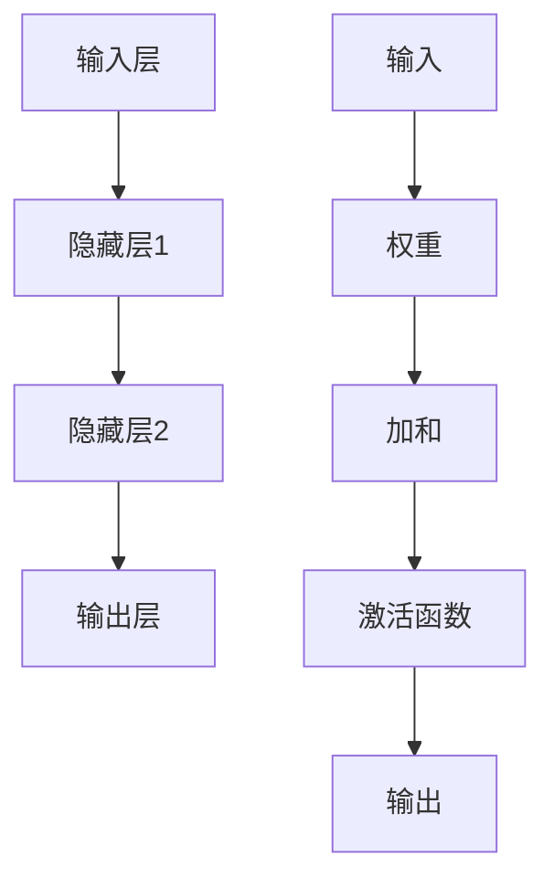
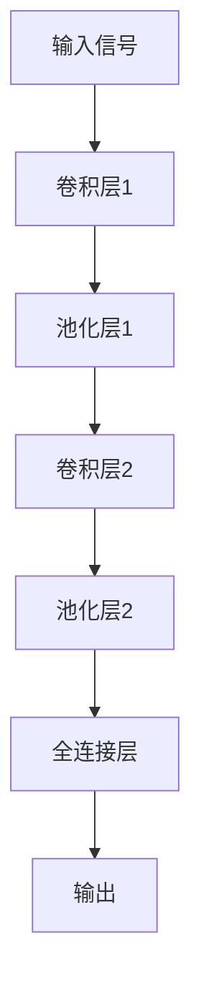
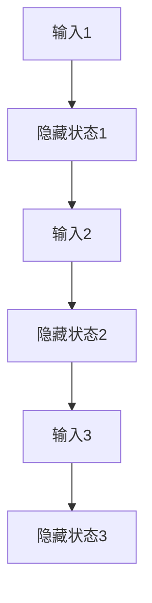
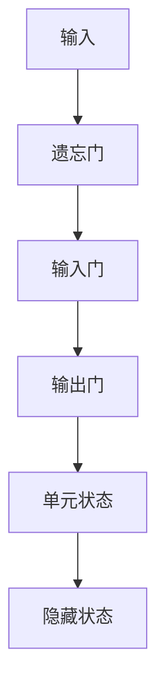
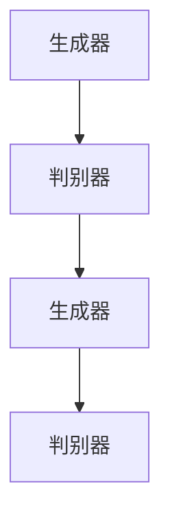
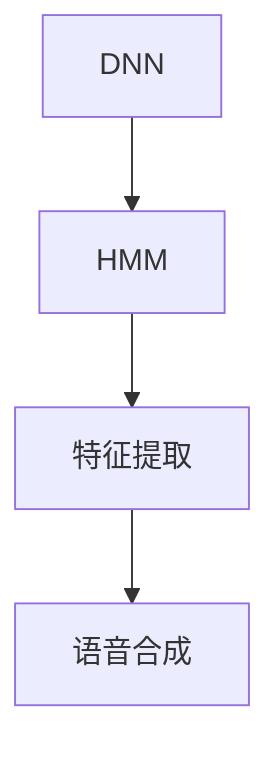
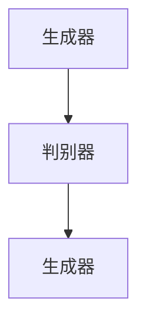
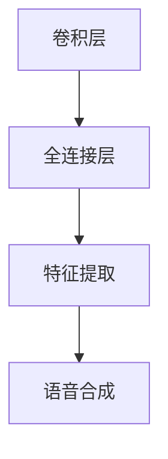

                 

### 文章标题

### 深度学习在语音合成中的自然表现

### 文章关键词

- 深度学习
- 语音合成
- 自然表现
- 文本到语音转换
- 生成对抗网络

### 文章摘要

本文旨在探讨深度学习在语音合成中的应用，以及如何实现自然流畅的语音输出。首先，我们将回顾深度学习的背景和发展，了解其在语音合成领域的应用前景。接着，我们将介绍语音信号处理与特征提取的基本原理，为后续的深度学习模型打下基础。随后，我们将深入讲解深度学习的核心算法，包括神经网络、卷积神经网络、循环神经网络和生成对抗网络等，并展示其在语音合成中的应用。此外，本文还将探讨语音合成系统的架构，以及文本到语音转换的具体实现过程。最后，我们将分析深度学习在语音合成中的自然表现，包括韵律和情感的表达，并展望其未来的发展趋势。

## 第一部分：深度学习基础

### 第1章：深度学习与语音合成概述

#### 1.1 深度学习的背景与发展

深度学习作为人工智能的重要分支，起源于上世纪80年代，并在近年来取得了飞速的发展。得益于计算能力的提升和大数据的积累，深度学习在图像识别、语音识别、自然语言处理等领域取得了显著的成果。深度学习模型通过模拟人脑的神经网络结构，实现自动特征提取和模式识别，具有强大的表达能力和泛化能力。

在语音合成领域，深度学习技术同样发挥着重要作用。传统的语音合成方法主要基于统计模型，如隐马尔可夫模型（HMM）和高斯混合模型（GMM）。这些方法在处理连续语音信号时存在一定的局限性，难以实现自然流畅的语音输出。而深度学习模型则能够更好地捕捉语音信号的复杂特征，从而提高语音合成的自然度。

#### 1.2 语音合成中的挑战与机遇

语音合成技术的目标是根据输入的文本信息生成自然、流畅、可听的语音。然而，这个目标并非易达。语音合成面临以下挑战：

1. **韵律与情感**：人类语音具有丰富的韵律和情感表达，如何模拟这些特点是一个重要挑战。语音合成系统需要考虑语音的节奏、停顿、语调等因素，使输出语音更具表现力。

2. **语音清晰度**：语音合成系统需要保证输出的语音清晰可听，避免出现模糊或失真的情况。

3. **多语言支持**：全球范围内存在众多语言，语音合成系统需要具备跨语言的能力，支持多种语言的合成。

尽管面临挑战，但深度学习为语音合成带来了新的机遇。通过大规模数据训练，深度学习模型能够更好地学习语音信号中的复杂特征，从而提高语音合成的自然度。同时，深度学习模型的可扩展性使其能够适应不同的应用场景，为语音合成领域的发展提供了强大的支持。

#### 1.3 自然表现的概念与重要性

自然表现是指语音合成系统在生成语音时能够模拟人类语音的各个方面，包括语音的节奏、情感、清晰度等。自然表现的实现是语音合成技术的重要目标，它直接影响用户体验。

首先，自然流畅的语音输出能够提高用户对语音合成系统的满意度。在应用场景中，如智能助手、语音翻译等，自然流畅的语音输出能够更好地传递信息，减少用户的困扰。

其次，自然表现有助于提高语音合成系统的实用性。在实际应用中，语音合成系统需要处理多种语言和方言，以及不同的场景和语境。只有具备自然表现的语音合成系统，才能在这些复杂环境下保持高效和准确。

最后，自然表现也是衡量语音合成技术发展水平的重要标准。随着深度学习技术的不断进步，实现更高水平自然表现的语音合成系统将成为未来发展的方向。

在下一章中，我们将详细介绍语音信号处理与特征提取的基本原理，为深入理解深度学习在语音合成中的应用打下基础。

## 第二部分：深度学习在语音合成中的应用

### 第2章：语音信号处理与特征提取

语音信号处理是语音合成系统中至关重要的一环。通过对语音信号进行处理和特征提取，我们可以提取出语音信号中的关键信息，为后续的深度学习模型提供有效的输入。

#### 2.1 语音信号的基本特性

语音信号是一种连续的声波信号，其频率范围通常在20Hz到20kHz之间。人类语音具有以下基本特性：

1. **频率特性**：语音信号的频率分布可以反映语音的音高和音色。不同的语音单元（如音素）具有不同的频率特性。

2. **时长特性**：语音信号的时长特性可以反映语音的节奏和停顿。时长特性对于语音合成中的韵律建模至关重要。

3. **幅度特性**：语音信号的幅度特性可以反映语音的强度和清晰度。过大的幅度会导致语音失真，而过小的幅度则可能导致语音模糊不清。

#### 2.2 常见语音特征提取方法

在语音合成中，常见的语音特征提取方法包括：

1. **梅尔频率倒谱系数（MFCC）**：MFCC是一种常用的语音特征提取方法，它通过将语音信号转化为梅尔频率倒谱系数，从而提取出语音的频率特性。MFCC在语音识别和语音合成中都有广泛应用。

2. **感知线性预测系数（PLP）**：PLP是基于语音信号线性预测误差的一种特征提取方法，它更接近人类听觉系统对语音的感知。PLP在语音识别和语音合成中也具有广泛的应用。

3. **短时傅里叶变换（STFT）**：STFT是一种常用的时频分析方法，它通过将语音信号转化为时频谱，从而提取出语音信号的频率和时域信息。STFT在语音信号处理中用于分析语音的频率变化和时域特征。

#### 2.3 特征提取在语音合成中的应用

在语音合成中，特征提取方法的选择直接影响合成语音的自然度和质量。以下是一些基于特征提取的语音合成方法：

1. **隐马尔可夫模型（HMM）- GMM语音合成**：在HMM-GMM语音合成方法中，首先使用HMM对语音进行建模，然后使用GMM对语音的声学特征进行建模。这种方法在语音合成中具有一定的效果，但存在一定的局限性，如难以处理长时依赖关系。

2. **深度神经网络（DNN）语音合成**：在DNN语音合成方法中，使用深度神经网络对语音信号进行建模。DNN可以通过大规模数据训练，自动提取语音信号中的复杂特征，从而提高语音合成的自然度。常见的DNN语音合成模型包括DNN-HMM、WaveNet等。

3. **基于注意力机制的自注意力模型**：自注意力机制是一种有效的序列建模方法，可以在语音合成中用于处理长时依赖关系。自注意力模型通过计算序列中不同位置之间的关联性，从而提高语音合成的自然度。

在下一章中，我们将深入探讨深度学习在语音合成中的核心算法，包括神经网络、卷积神经网络、循环神经网络和生成对抗网络等。

## 第三部分：深度学习核心算法

### 第3章：深度学习核心算法

深度学习在语音合成中的应用离不开一系列核心算法。本章将详细介绍这些算法的基本原理，并分析它们在语音合成中的应用。

#### 3.1 神经网络基础

神经网络（Neural Networks）是深度学习的基础，由大量人工神经元组成。每个神经元接受多个输入信号，并通过权重进行加权求和，最后通过激活函数产生输出。

神经网络的核心概念包括：

- **权重（Weights）**：神经网络中神经元之间的连接权重决定了输入信号的重要性。
- **激活函数（Activation Function）**：激活函数用于引入非线性，使神经网络能够对复杂数据进行建模。常见激活函数包括Sigmoid、ReLU、Tanh等。
- **前向传播（Forward Propagation）**：在前向传播过程中，输入信号从输入层传递到输出层，通过权重和激活函数计算得到最终输出。
- **反向传播（Back Propagation）**：反向传播是神经网络训练的核心步骤，通过计算输出误差，反向更新权重，以最小化损失函数。

#### 3.2 卷积神经网络（CNN）在语音处理中的应用

卷积神经网络（Convolutional Neural Networks，CNN）在图像处理中表现出色，但其在语音处理中的应用也日益受到关注。CNN通过卷积操作和池化操作，能够有效地提取语音信号中的局部特征。

- **卷积操作（Convolution）**：卷积操作通过滑动窗口在输入数据上计算局部特征，并将这些特征组合成更高层次的特征。
- **池化操作（Pooling）**：池化操作用于减少数据维度，提高计算效率。常见池化方法包括最大池化和平均池化。

在语音处理中，CNN可以用于特征提取，例如提取梅尔频率倒谱系数（MFCC）或感知线性预测系数（PLP）。通过卷积操作，CNN能够捕捉语音信号的局部特征，从而提高语音合成的自然度。

#### 3.3 循环神经网络（RNN）与长短时记忆网络（LSTM）

循环神经网络（Recurrent Neural Networks，RNN）是一种专门用于处理序列数据的神经网络。RNN通过在时间步上递归地计算输出，使其能够记住前面的输入信息。

然而，传统的RNN存在梯度消失和梯度爆炸的问题，难以处理长序列数据。为了解决这些问题，研究人员提出了长短时记忆网络（Long Short-Term Memory，LSTM）。

LSTM通过引入门控机制，能够有效地捕捉长序列数据中的长期依赖关系。LSTM的核心组件包括：

- **遗忘门（Forget Gate）**：决定哪些信息应该从单元状态中丢弃。
- **输入门（Input Gate）**：决定哪些新信息应该被存储在单元状态中。
- **输出门（Output Gate）**：决定当前单元状态应该被输出到下一个隐藏状态。

在语音合成中，LSTM可以用于建模文本到语音（Text-to-Speech，TTS）转换的过程，通过捕捉文本中的韵律和情感信息，生成自然流畅的语音。

#### 3.4 生成对抗网络（GAN）在语音合成中的应用

生成对抗网络（Generative Adversarial Networks，GAN）是一种由生成器和判别器组成的对抗性模型。生成器的目标是生成逼真的语音数据，而判别器的目标是区分真实语音和生成语音。

在语音合成中，GAN可以用于生成高质量的语音波形。生成器通过学习文本和语音波形之间的映射关系，生成逼真的语音波形；判别器则用于判断语音波形的真实性。通过对抗训练，生成器不断提高生成语音的质量，从而实现高质量的语音合成。

GAN在语音合成中的应用包括：

- **WaveNet**：WaveNet是一种基于GAN的语音合成模型，通过学习文本和语音波形之间的映射关系，生成高质量的语音波形。
- **Multi-Speaker WaveNet**：Multi-Speaker WaveNet通过引入多模态数据，如语音波形和文本，生成具有不同说话人特征的语音。

在下一章中，我们将详细探讨语音合成系统的架构，包括HMM-GMM模型、DNN-HMM模型、WaveNet模型和Convolutive DNN模型等。

### 第4章：语音合成系统的架构

语音合成系统的架构是语音合成技术的重要组成部分。不同的架构在性能、效率和实现难度上有所不同。本章将介绍几种常见的语音合成系统架构，包括HMM-GMM模型、DNN-HMM模型、WaveNet模型和Convolutive DNN模型，并分析它们的优缺点。

#### 4.1 HMM-GMM模型

HMM-GMM模型是早期的一种语音合成系统架构，它结合了隐马尔可夫模型（HMM）和高斯混合模型（GMM）的特点。HMM用于语音模型的生成，而GMM用于语音特征的建模。

- **HMM**：隐马尔可夫模型是一种统计模型，用于表示语音信号中的状态转移和观测概率。HMM通过隐含的状态序列来描述语音信号的产生过程。
  
- **GMM**：高斯混合模型是一种概率分布模型，用于表示语音信号的特征。GMM通过多个高斯分布的线性组合来模拟语音信号的特征分布。

**优点**：

- **简单易实现**：HMM-GMM模型结构相对简单，易于理解和实现。
- **效果稳定**：在处理短时语音特征时，HMM-GMM模型表现稳定。

**缺点**：

- **自然度不足**：由于HMM-GMM模型在特征提取和生成过程中缺乏非线性处理，生成的语音自然度较低。
- **难以处理长时依赖关系**：HMM-GMM模型难以捕捉语音信号中的长时依赖关系，导致语音连贯性较差。

#### 4.2 DNN-HMM模型

DNN-HMM模型将深度神经网络（DNN）引入语音合成系统，通过DNN对语音特征进行建模，从而提高语音合成的自然度和质量。

- **DNN**：深度神经网络是一种多层神经网络，通过多层非线性变换来学习输入和输出之间的复杂关系。
  
- **HMM**：隐马尔可夫模型仍然用于语音模型的生成。

**优点**：

- **自然度提高**：DNN能够捕捉语音信号中的复杂特征，生成更自然、流畅的语音。
- **特征提取能力增强**：DNN在特征提取方面具有更强的表达能力，能够提取更丰富的语音特征。

**缺点**：

- **训练难度大**：DNN模型训练过程复杂，需要大量数据和计算资源。
- **对数据依赖性强**：DNN模型对训练数据量要求较高，数据质量直接影响模型效果。

#### 4.3 WaveNet模型

WaveNet是一种基于生成对抗网络（GAN）的语音合成模型，通过生成器和判别器的对抗训练来生成高质量的语音波形。

- **生成器**：生成器的目标是生成逼真的语音波形。
- **判别器**：判别器的目标是区分真实语音和生成语音。

**优点**：

- **高质量输出**：WaveNet能够生成高质量的语音波形，语音自然度较高。
- **自适应能力**：WaveNet通过对抗训练，能够自适应地调整生成器的输出，提高生成语音的多样性和稳定性。

**缺点**：

- **训练资源消耗大**：WaveNet训练过程复杂，需要大量计算资源和时间。
- **对数据质量要求高**：WaveNet对训练数据质量要求较高，数据中的噪声和异常值会影响生成语音的质量。

#### 4.4 Convolutive DNN模型

Convolutive DNN模型是一种结合卷积神经网络（CNN）的语音合成模型，通过卷积层对语音信号进行特征提取，从而提高语音合成的自然度和质量。

- **卷积层**：卷积层用于提取语音信号中的局部特征。
- **全连接层**：全连接层用于对提取的特征进行分类和建模。

**优点**：

- **高效的特征提取**：卷积层能够高效地提取语音信号中的局部特征，提高特征提取的效率。
- **处理长时依赖关系**：卷积层能够捕捉语音信号中的长时依赖关系，提高语音合成的连贯性。

**缺点**：

- **计算复杂度高**：卷积层增加了模型的计算复杂度，训练过程相对较长。
- **对数据量要求高**：卷积层需要大量的数据来训练，数据不足会影响模型效果。

总之，不同的语音合成系统架构在性能、效率和实现难度上各有优缺点。选择合适的架构需要根据实际应用场景和需求进行权衡。

在下一章中，我们将深入探讨文本到语音（Text-to-Speech，TTS）合成的实现过程，包括数据预处理、模型训练和语音输出等步骤。

### 第5章：文本到语音（TTS）合成

文本到语音（Text-to-Speech，TTS）合成是将文本信息转化为自然、流畅的语音输出的过程。TTS系统在语音合成领域中具有重要意义，广泛应用于智能助手、语音导航、教育等领域。本章将详细介绍TTS合成的实现过程，包括数据预处理、模型训练和语音输出等步骤。

#### 5.1 TTS系统的基本流程

TTS系统的基本流程可以分为以下几步：

1. **文本预处理**：将输入的文本进行分词、词性标注等操作，将其转化为适合模型处理的格式。
2. **声学模型训练**：使用语音数据训练声学模型，该模型用于将文本转化为语音信号的特征。
3. **声码器生成语音**：使用声码器将语音信号的特征转化为语音波形。

#### 5.2 CTC损失函数与RNN-LSTM模型

循环神经网络（RNN）和长短时记忆网络（LSTM）是TTS合成中常用的模型。RNN在处理序列数据时具有递归性质，可以记住前面的输入信息，而LSTM则通过引入门控机制，能够更好地处理长序列数据。

CTC（Connectionist Temporal Classification）是一种常用于TTS合成的损失函数，它能够将文本序列直接映射到语音信号序列，无需显式地生成中间语音特征。

- **CTC损失函数**：CTC损失函数通过最小化输入文本和输出语音之间的差距，从而训练模型。CTC损失函数的核心思想是将文本序列映射到语音序列，使得输出语音能够正确地反映输入文本的内容。
  
- **RNN-LSTM模型**：RNN-LSTM模型通过在时间步上递归地计算输出，结合LSTM的门控机制，能够更好地处理长序列数据。RNN-LSTM模型将输入的文本序列映射到语音序列，从而实现TTS合成。

#### 5.3 WaveNet与Transformer模型在TTS中的应用

WaveNet和Transformer是近年来在TTS领域取得显著成果的模型。

- **WaveNet**：WaveNet是一种基于生成对抗网络（GAN）的语音合成模型，通过生成器和判别器的对抗训练，生成高质量的语音波形。WaveNet能够生成自然、流畅的语音，但在处理长序列数据和多说话人语音方面存在一定困难。

- **Transformer**：Transformer是一种基于自注意力机制的序列到序列模型，通过计算序列中不同位置之间的关联性，能够更好地处理长序列数据。Transformer在语音合成中表现出色，尤其在多说话人语音合成方面具有优势。

#### 5.4 TTS系统的性能优化

TTS系统的性能优化是提高合成语音质量的关键。以下是一些常见的优化方法：

- **数据增强**：通过增加训练数据量、数据变换等手段，提高模型的泛化能力。
- **模型压缩**：通过模型压缩技术，降低模型参数数量，提高模型推理速度。
- **端到端训练**：采用端到端训练方法，将文本预处理、声学模型训练和声码器生成语音等步骤整合在一起，提高系统整体性能。

在下一章中，我们将探讨语音识别与语音生成相结合的方法，以及如何实现实时交互系统。

### 第6章：语音识别与语音生成

语音识别（Automatic Speech Recognition，ASR）和语音生成（Voice Generation）是语音处理领域两个重要的子领域。将语音识别与语音生成相结合，可以构建出智能交互系统，实现人机对话的实时互动。本章将探讨ASR与VSG（Voice Generation）结合的方法，以及如何实现实时交互系统。

#### 6.1 ASR与VSG结合的方法

将语音识别与语音生成相结合，主要有以下几种方法：

1. **串联模型**：将ASR模型和VSG模型串联起来，首先使用ASR模型对输入语音进行识别，然后将识别结果输入到VSG模型中生成对应的语音。这种方法的主要优势是实现简单，但可能存在识别误差影响语音生成的准确性。

2. **并行模型**：将ASR模型和VSG模型并行处理，同时识别输入语音并生成对应的语音。这种方法需要协调两个模型之间的交互，以避免资源冲突。通过优化模型结构，可以提高系统的实时性和准确性。

3. **端到端模型**：采用端到端模型，将语音识别和语音生成整合到一个模型中，实现端到端的实时交互。这种方法可以有效地提高系统的整体性能，但需要解决模型训练和数据标注的挑战。

#### 6.2 CTC与Attention机制的应用

在语音识别和语音生成中，CTC（Connectionist Temporal Classification）和Attention机制是两种重要的技术。

- **CTC**：CTC损失函数可以将文本序列直接映射到语音序列，无需显式地生成中间语音特征。在语音识别中，CTC可以用于将输入语音映射到对应的文本；在语音生成中，CTC可以用于将文本映射到对应的语音。

- **Attention机制**：Attention机制可以用于捕捉语音序列和文本序列之间的关联性。在语音识别中，Attention机制可以用于将语音序列映射到对应的文本；在语音生成中，Attention机制可以用于将文本序列映射到对应的语音。

#### 6.3 实时交互系统设计

实时交互系统设计需要考虑以下几个关键点：

1. **延迟控制**：实时交互系统要求响应时间短，需要优化算法和硬件配置，降低延迟。

2. **错误处理**：在实时交互中，识别和生成的错误可能会影响用户体验。系统需要设计错误处理机制，如回溯、修正等，以提高交互的准确性和流畅性。

3. **多模态支持**：实时交互系统需要支持多种输入和输出模态，如语音、文本、图像等，以适应不同的使用场景。

4. **用户体验**：系统设计需要关注用户体验，如语音的自然度、响应速度、交互流畅性等，以提高用户满意度。

在下一章中，我们将探讨语音合成的自然表现，包括韵律和情感的表达，以及实现这些效果的挑战和解决方案。

### 第7章：语音合成的自然表现

语音合成的自然表现是衡量语音合成系统质量的重要指标。它不仅包括语音的清晰度和流畅度，还涉及到语音的韵律和情感表达。本章将深入探讨语音合成的自然表现，包括韵律建模、情感语音合成的挑战与解决方案，以及语音合成系统的评价与改进。

#### 7.1 自然语言的韵律与情感

自然语言的韵律和情感是语音合成的关键要素。韵律决定了语音的节奏、停顿和语调，而情感则反映了说话者的情绪状态。以下是对韵律和情感的基本介绍：

- **韵律**：韵律是语音中的节奏和韵律模式，包括音高、音长和音强等。韵律有助于传达信息的结构和意义。例如，语调的提升和降调可以表达疑问和陈述，而快速的语速可以传达紧张和兴奋的情绪。

- **情感**：情感是语音中表达情绪的维度，包括喜悦、悲伤、愤怒等。情感表达使语音更具表现力，能够更好地传递情感信息。例如，使用柔和的语调和缓慢的语速可以传达安慰和亲切，而使用尖锐的语调和快速的语速可以传达愤怒和紧张。

#### 7.2 语音合成的韵律建模

韵律建模是语音合成中的关键步骤，旨在生成具有自然韵律的语音。以下是一些常见的韵律建模方法：

- **基于规则的方法**：基于规则的方法通过定义一系列规则来建模语音的韵律。这些规则可以根据语音的音高、音长和音强等特征来调整语音的节奏和停顿。然而，这种方法在处理复杂语音时可能存在局限性。

- **基于数据的模型**：基于数据的模型使用大规模语音数据来学习语音的韵律特征。这些模型可以是统计模型（如HMM和GMM）或深度学习模型（如RNN和LSTM）。通过学习语音数据中的韵律模式，这些模型可以生成具有自然韵律的语音。

- **端到端的方法**：端到端的方法将语音合成的整个过程整合到一个模型中，从文本直接生成语音波形。这种方法通过端到端的学习，可以更好地捕捉语音的韵律特征，生成更自然的语音。常见的端到端方法包括WaveNet和Transformer。

#### 7.3 情感语音合成的挑战与解决方案

情感语音合成是语音合成中的一个重要领域，但同时也面临着许多挑战。以下是一些常见的挑战和解决方案：

- **情感表达的多样性**：人类语音中的情感表达非常丰富多样，包括喜悦、悲伤、愤怒、恐惧等。情感语音合成系统需要能够处理这些多样的情感表达，并在语音中准确传达。

- **情感识别的准确性**：情感语音合成需要首先识别文本中的情感信息。然而，情感识别本身就是一个具有挑战性的任务，因为情感表达往往是非显式的，并且受到说话者、语境和语音特征等多种因素的影响。

- **情感生成的自然度**：生成具有自然情感的语音是一个复杂的任务。系统需要能够在语音中准确传达情感，同时保持语音的清晰度和流畅度。

- **解决方案**：
  - **情感词典**：使用情感词典来标记文本中的情感词汇，以便在合成过程中考虑情感信息。
  - **情感增强的声码器**：使用专门的声码器来生成具有特定情感特征的语音。这些声码器可以根据情感词典中的情感词汇调整语音的音高、音长和音强等特征。
  - **端到端情感建模**：采用端到端的方法，将情感信息直接集成到语音合成的过程中。这种方法通过端到端的学习，可以更好地捕捉情感特征，并生成具有自然情感的语音。

#### 7.4 语音合成系统的评价与改进

语音合成系统的评价是评估系统性能的重要环节。以下是一些常见的评价指标和改进方法：

- **语音自然度**：语音自然度是评价语音合成系统的主要指标，包括语音的流畅度、清晰度和韵律等。可以通过主观评价和客观评价来评估语音自然度。

- **语音质量**：语音质量是评估合成语音音质的重要指标，包括语音的失真度、噪声和音质等。常用的语音质量评价指标包括主观评价（如信号噪声比SNR）和客观评价（如语音质量度量PESQ和POLQA）。

- **情感表达能力**：情感表达能力是评估系统在情感语音合成方面的性能。可以通过情感表达的准确性、自然度和多样性来评价。

- **改进方法**：
  - **数据增强**：通过数据增强技术，如重放、变换和混合等，增加训练数据量，提高模型泛化能力。
  - **多模态学习**：结合文本、语音和其他模态的信息，如情感标注、语言特征等，提高模型的情感表达能力。
  - **端到端训练**：采用端到端训练方法，将文本到语音的转换过程整合到一个模型中，提高系统整体性能。

在下一章中，我们将展望深度学习在语音合成中的未来趋势，包括个性化语音合成、多模态交互、小样本学习和迁移学习等。

### 第8章：深度学习在语音合成中的未来趋势

随着深度学习技术的不断发展和成熟，语音合成领域也在不断进步，未来趋势令人期待。本章将探讨深度学习在语音合成中的未来趋势，包括个性化语音合成、多模态交互、小样本学习和迁移学习等。

#### 8.1 个性化语音合成

个性化语音合成是指根据用户的偏好和习惯，生成与其特征相符的语音。个性化语音合成不仅可以提升用户体验，还可以应用于个性化服务、辅助交流等方面。

- **个性化特征**：个性化语音合成需要考虑用户的语音特征，如语速、语调、音量等。这些特征可以通过用户历史语音数据、语音评估数据或语音偏好调查等方式获取。

- **个性化模型训练**：基于用户的语音特征，训练个性化的语音合成模型。通过端到端训练方法，可以将用户的个性化特征直接集成到模型中，提高生成语音的个性化和自然度。

- **个性化语音合成应用**：个性化语音合成可以应用于智能助手、个性化客服、语音导航等领域。通过个性化语音合成，系统可以更好地满足用户的需求，提升用户满意度。

#### 8.2 多模态交互

多模态交互是指结合多种模态（如语音、文本、图像等）进行信息传递和互动。在语音合成领域，多模态交互可以提升系统的表达能力和交互效果。

- **多模态数据融合**：通过融合文本、语音、图像等多种模态的数据，可以更好地捕捉语义信息和情感表达。例如，在语音合成中，结合文本的情感标注和语音的情感特征，可以生成更具表现力的语音。

- **多模态模型训练**：采用多模态深度学习模型，如多模态卷积神经网络（MCCN）、多模态循环神经网络（MRNN）等，可以同时处理多种模态的数据，提高模型的表达能力。

- **多模态交互应用**：多模态交互可以应用于智能助手、语音翻译、多媒体娱乐等领域。通过多模态交互，系统可以更自然地与用户进行互动，提供更丰富的交互体验。

#### 8.3 小样本学习和迁移学习

在深度学习应用中，数据量往往是一个重要因素。小样本学习和迁移学习旨在利用少量数据进行模型训练，提高模型的泛化能力和适用性。

- **小样本学习**：小样本学习通过设计特殊的损失函数和优化算法，利用少量数据进行模型训练。在语音合成中，小样本学习可以应用于个性化语音合成和稀有语音合成等场景。

- **迁移学习**：迁移学习通过利用预训练模型，将知识从源任务迁移到目标任务。在语音合成中，可以利用预训练的语言模型或图像模型，提高语音合成的性能。

- **应用场景**：小样本学习和迁移学习可以应用于小语种语音合成、个性化语音合成、罕见语音合成等场景。通过小样本学习和迁移学习，可以降低数据获取和标注的难度，提高模型的泛化能力和适应性。

#### 8.4 伦理与隐私问题

随着深度学习在语音合成中的广泛应用，伦理和隐私问题也逐渐成为关注的焦点。

- **数据隐私**：语音合成系统需要处理大量的语音数据，如何保护用户数据隐私成为一个重要问题。需要采取加密、去标识化等技术，确保用户数据的安全。

- **公平性**：语音合成系统需要确保生成语音的公平性，避免偏见和歧视。例如，在性别、年龄、种族等方面的语音合成要避免产生不公平的偏见。

- **透明性**：深度学习模型具有一定的“黑箱”特性，需要提高模型的透明性，使用户了解模型的决策过程。通过解释性技术，如模型可视化、决策路径分析等，可以提高模型的透明性。

在深度学习在语音合成中的应用不断发展的过程中，关注伦理和隐私问题，确保技术的负责任应用，对于构建一个公平、安全、可信的语音合成生态系统具有重要意义。

### 总结

本文详细探讨了深度学习在语音合成中的应用，从深度学习的背景和发展，到语音信号处理与特征提取，再到核心算法的讲解，以及语音合成系统的架构和TTS合成的实现过程，最后讨论了语音合成的自然表现和未来趋势。深度学习技术为语音合成带来了革命性的变革，实现了更自然、流畅、高质量的语音输出。在未来的发展中，随着个性化语音合成、多模态交互、小样本学习和迁移学习等技术的应用，语音合成将继续朝着更高效、更智能的方向发展。同时，我们也需关注伦理和隐私问题，确保技术的负责任应用。

### 作者信息

作者：AI天才研究院/AI Genius Institute & 禅与计算机程序设计艺术 /Zen And The Art of Computer Programming

