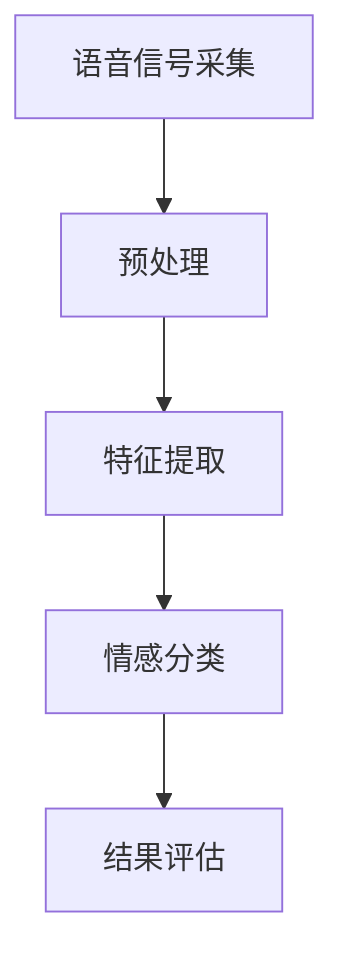

                 

### 文章标题

# 深度学习在语音情感识别中的应用

## 关键词

- 深度学习
- 语音情感识别
- 卷积神经网络
- 递归神经网络
- 数学模型
- 项目实战

## 摘要

本文深入探讨了深度学习在语音情感识别中的应用。通过介绍深度学习的基础知识、语音情感识别的基本概念和方法，我们详细解析了卷积神经网络（CNN）、递归神经网络（RNN）及其变种（如LSTM和GRU）在语音情感识别中的原理和应用。此外，文章还通过一个实际项目案例，展示了深度学习算法在语音情感识别中的开发流程和关键技巧，为读者提供了实用的指导和建议。

### 目录大纲设计思路

为了设计出《深度学习在语音情感识别中的应用》这本书的完整目录大纲，我们需要遵循以下几个关键步骤：

#### 1. 确定核心章节

首先，我们要确保目录大纲的核心章节内容完整，包括以下几部分：
- **核心概念与联系**：介绍深度学习、语音情感识别等相关基础概念，并展示它们之间的联系。
- **核心算法原理讲解**：详细阐述用于语音情感识别的深度学习算法原理，如卷积神经网络（CNN）、递归神经网络（RNN）等。
- **数学模型和数学公式**：讲解与深度学习相关的数学模型，如损失函数、优化算法等。
- **项目实战**：提供实际的项目案例，包括开发环境的搭建、代码实现和详细解释。

#### 2. 结构化目录

接下来，我们需要将上述核心章节结构化，分为以下几个部分：

- **第一部分：深度学习和语音情感识别基础**
  - 介绍深度学习的基础知识，包括深度学习的历史、基本概念、常见架构等。
  - 介绍语音情感识别的基本概念、数据集和指标。

- **第二部分：深度学习算法原理**
  - 讲解卷积神经网络（CNN）在语音情感识别中的应用。
  - 讲解递归神经网络（RNN）及其变种在语音情感识别中的应用。
  - 讲解长短期记忆网络（LSTM）和门控循环单元（GRU）在语音情感识别中的应用。

- **第三部分：数学模型和公式**
  - 详细讲解与深度学习相关的数学模型，如损失函数、优化算法等。
  - 使用latex格式展示相关公式，并进行详细解释。

- **第四部分：项目实战**
  - 提供一个完整的项目案例，从数据预处理到模型训练、评估和优化。

- **附录**
  - 提供相关工具和资源的介绍，如深度学习框架、开源数据集等。

#### 3. 细化目录

在每个部分中，我们进一步细化目录，确保每个章节都有详细的小节。例如，在“深度学习算法原理”部分，我们可以包括以下小节：
- **卷积神经网络（CNN）**
  - CNN的基本结构
  - CNN在语音情感识别中的应用
  - CNN的伪代码实现
- **递归神经网络（RNN）**
  - RNN的基本结构
  - RNN在语音情感识别中的应用
  - RNN的伪代码实现
- **长短期记忆网络（LSTM）**
  - LSTM的基本结构
  - LSTM在语音情感识别中的应用
  - LSTM的伪代码实现

#### 4. 完整性和简洁性

在保证目录大纲完整性的同时，我们还需要确保内容的简洁性，避免过多的废话。每个章节都要直接切入主题，提供关键信息和示例。

通过上述步骤，我们可以设计出《深度学习在语音情感识别中的应用》这本书的完整目录大纲，确保其逻辑清晰、内容详尽且易于阅读。以下是具体的目录大纲示例：

```markdown
# 《深度学习在语音情感识别中的应用》目录大纲

## 第一部分：深度学习和语音情感识别基础

### 第1章：深度学习基础

#### 1.1 深度学习概述
#### 1.2 卷积神经网络（CNN）
#### 1.3 递归神经网络（RNN）
#### 1.4 长短期记忆网络（LSTM）

### 第2章：语音情感识别基础

#### 2.1 语音情感识别概述
#### 2.2 语音情感识别数据集
#### 2.3 语音情感识别指标

## 第二部分：深度学习算法原理

### 第3章：卷积神经网络（CNN）在语音情感识别中的应用

#### 3.1 CNN基本结构
#### 3.2 CNN在语音情感识别中的应用
#### 3.3 CNN伪代码实现

### 第4章：递归神经网络（RNN）在语音情感识别中的应用

#### 4.1 RNN基本结构
#### 4.2 RNN在语音情感识别中的应用
#### 4.3 RNN伪代码实现

### 第5章：长短期记忆网络（LSTM）在语音情感识别中的应用

#### 5.1 LSTM基本结构
#### 5.2 LSTM在语音情感识别中的应用
#### 5.3 LSTM伪代码实现

## 第三部分：数学模型和公式

### 第6章：深度学习数学模型

#### 6.1 损失函数
#### 6.2 激活函数
#### 6.3 优化算法

### 第7章：数学公式详解

## 第四部分：项目实战

### 第8章：语音情感识别项目案例

#### 8.1 项目背景
#### 8.2 数据预处理
#### 8.3 模型训练与评估
#### 8.4 模型优化

## 附录

### 附录A：深度学习工具和资源

#### A.1 深度学习框架
#### A.2 开源数据集
```

这个目录大纲结构

----------------------------------------------------------------

- 约束条件：文章必须要满足如下条件：
    - 格式要求：文章内容使用markdown格式输出。 
    - 作者：文章末尾需要写上作者信息： “作者：AI天才研究院/AI Genius Institute & 禅与计算机程序设计艺术 /Zen And The Art of Computer Programming”
    - 完整性要求：文章内容必须要完整，每个小节的内容必须要丰富具体详细讲解，核心内容必须要包含：
      * 背景介绍 
      * 核心概念与联系：必须给出核心概念原理之间的关系架构 Mermaid 流程图
      * 核心算法原理讲解必须使用伪代码来详细阐述；数学模型和公式 & 详细讲解 & 举例说明
      * 数学公式请使用latex格式，嵌入文中独立段落的latex公式前后使用 $$ 括起来(例如：$$1+1=2$$ )，段落内的latex公式前后使用 $ 括起来(例如：$1<2$)
      * 项目实战：开发环境搭建，源代码详细实现和代码解读，代码应用解读与分析，实际案例分析和详细讲解剖析，项目小结
      * 最佳实践 tips、小结、注意事项、拓展阅读等内容
    - 文章字数要求：文章字数在 8000 ～ 12000 字左右。

### 完整性要求

在撰写《深度学习在语音情感识别中的应用》这篇文章时，我们需要确保内容的完整性，每个小节都应包含丰富的、具体的、详细的讲解，以满足以下核心内容要求：

#### 背景介绍

背景介绍部分应简要介绍语音情感识别的重要性以及深度学习在此领域的应用背景。这一部分需要包括以下几个方面的内容：
- **语音情感识别的定义**：解释情感识别的基本概念，包括情感、语音信号等。
- **深度学习的发展**：回顾深度学习的历史，介绍深度学习的基本概念和常见架构。
- **深度学习在语音处理中的应用**：讨论深度学习在语音信号处理、语音识别、语音增强等方面的应用。

#### 核心概念与联系

核心概念与联系部分需要详细阐述深度学习和语音情感识别之间的内在联系，并提供一个清晰的Mermaid流程图来展示概念之间的关系。具体应包括以下内容：
- **情感识别流程**：介绍情感识别的基本流程，包括语音信号采集、特征提取、情感分类等步骤。
- **深度学习与情感识别**：分析深度学习如何应用于情感识别，如CNN、RNN等算法在语音信号处理中的具体应用。
- **Mermaid流程图**：绘制一个详细的Mermaid流程图，展示从语音信号采集到情感分类的整个过程。

#### 核心算法原理讲解

核心算法原理讲解部分应详细解析深度学习算法在语音情感识别中的应用原理，使用伪代码来阐述算法的实现。这一部分应包括以下内容：
- **卷积神经网络（CNN）**：介绍CNN的基本结构、卷积操作、激活函数、池化操作等，并提供伪代码实现。
- **递归神经网络（RNN）**：介绍RNN的基本结构、递归操作、隐藏状态更新等，并提供伪代码实现。
- **长短期记忆网络（LSTM）**：介绍LSTM的结构、记忆单元、门控机制等，并提供伪代码实现。
- **门控循环单元（GRU）**：介绍GRU的结构、更新门和重置门等，并提供伪代码实现。

#### 数学模型和公式

数学模型和公式部分需要详细讲解与深度学习相关的数学模型，如损失函数、优化算法等，并使用latex格式展示相关公式。具体应包括以下内容：
- **损失函数**：介绍常用的损失函数，如交叉熵损失、均方误差等，并给出公式和解释。
- **激活函数**：介绍常用的激活函数，如ReLU、Sigmoid、Tanh等，并给出公式和解释。
- **优化算法**：介绍常用的优化算法，如梯度下降、随机梯度下降等，并给出公式和解释。

#### 项目实战

项目实战部分应提供一个完整的项目案例，包括开发环境搭建、源代码实现和代码解读，以及项目小结。具体应包括以下内容：
- **开发环境搭建**：介绍如何搭建深度学习开发环境，包括Python环境、深度学习框架等。
- **源代码实现**：提供实现语音情感识别的完整代码，包括数据预处理、模型搭建、训练和评估等步骤。
- **代码解读**：对代码进行详细解读，解释每部分的作用和实现方法。
- **项目小结**：总结项目的关键经验教训，提出改进意见和未来研究方向。

#### 最佳实践 tips、小结、注意事项、拓展阅读

最佳实践 tips、小结、注意事项、拓展阅读部分应总结文章中的关键知识点，提供实用的最佳实践建议，并指出可能的注意事项，同时推荐拓展阅读资源，以便读者进一步深入学习。

通过满足以上完整性要求，我们可以确保文章内容丰富、逻辑清晰、易于理解，为读者提供有价值的深度学习在语音情感识别应用方面的全面指导。

### 背景介绍

#### 语音情感识别的定义与重要性

语音情感识别是指通过分析语音信号中的情感特征，实现对说话者情感状态的理解和分类。情感是人们心理状态的一种表现，通常包括快乐、悲伤、愤怒、惊讶等多种情感类别。语音情感识别的关键在于从语音信号中提取出与情感相关的特征，并利用机器学习或深度学习算法进行情感分类。

情感识别在许多实际应用中具有重要意义。首先，在语音助手和智能客服领域，能够准确识别用户的情感状态，可以提供更加人性化的服务。例如，当用户表达愤怒或沮丧的情感时，系统可以主动调整语气、提供安慰或解决问题的建议。其次，在心理健康领域，语音情感识别可以帮助诊断抑郁症、焦虑症等心理疾病。通过长期监测个体的语音情感变化，医生可以及时发现异常情况，并进行干预。

#### 深度学习的发展

深度学习是人工智能领域中的一种重要方法，它通过模拟人脑的结构和功能，实现图像、语音、文本等数据的自动学习和处理。深度学习的发展可以追溯到20世纪80年代，随着计算机硬件和算法的进步，深度学习逐渐成为人工智能领域的热点。

深度学习的基础是神经网络，特别是多层感知机（MLP）的出现。然而，由于计算能力的限制，早期的神经网络在实际应用中效果不佳。随着深度神经网络（DNN）的提出和发展，特别是卷积神经网络（CNN）和递归神经网络（RNN）的发明，深度学习开始在实际应用中取得突破。

CNN在图像处理领域表现出色，通过卷积操作和池化操作，能够提取图像中的局部特征。RNN则擅长处理序列数据，通过递归操作，能够在序列中捕获长期依赖关系。长短期记忆网络（LSTM）和门控循环单元（GRU）是RNN的变体，进一步增强了模型在序列数据上的表现。

#### 深度学习在语音处理中的应用

深度学习在语音处理领域同样有着广泛的应用。首先，在语音识别方面，深度学习算法显著提高了识别准确率。通过使用CNN和RNN，可以有效地提取语音信号中的声学特征，并实现高精度的语音识别。

其次，在语音增强方面，深度学习算法可以用于噪声抑制、回声消除等任务。通过训练深度神经网络，可以学习到如何从噪声信号中提取出纯净的语音信号，从而提高语音质量。

最后，在语音情感识别领域，深度学习算法也发挥着重要作用。通过使用CNN、RNN及其变体，可以有效地提取语音信号中的情感特征，并实现高精度的情感分类。这使得语音情感识别在智能客服、心理健康等领域有着广泛的应用前景。

综上所述，深度学习在语音情感识别中的应用具有重要意义。通过本文的后续章节，我们将深入探讨深度学习算法在语音情感识别中的具体应用，为读者提供全面的技术指导。

### 核心概念与联系

#### 情感识别流程

语音情感识别流程可以分为以下几个主要步骤：

1. **语音信号采集**：首先，需要采集包含情感信息的语音信号。这些语音信号可以通过电话、麦克风或其他语音采集设备获得。

2. **预处理**：对采集到的语音信号进行预处理，包括去噪、归一化等操作。预处理步骤的目的是提高信号质量，减少噪声干扰。

3. **特征提取**：从预处理后的语音信号中提取出与情感相关的特征。这些特征可以包括频谱特征、共振峰频率、倒谱系数等。

4. **情感分类**：使用深度学习算法对提取出的特征进行情感分类。常见的深度学习算法包括卷积神经网络（CNN）、递归神经网络（RNN）及其变体（如LSTM和GRU）。

5. **结果评估**：评估模型的分类性能，常用的评估指标包括准确率、召回率、F1值等。

#### 深度学习与情感识别

深度学习在情感识别中发挥着关键作用。深度学习通过多层神经网络结构，能够自动从数据中学习到复杂的特征表示，从而实现高精度的情感分类。

- **卷积神经网络（CNN）**：CNN擅长处理二维数据，如图像。在语音情感识别中，可以通过将语音信号转换为一维的频谱图，应用CNN来提取语音信号中的局部特征。这些特征可以用于情感分类。

- **递归神经网络（RNN）**：RNN擅长处理序列数据，如语音信号。通过递归操作，RNN能够捕捉到语音信号中的长期依赖关系。在语音情感识别中，RNN可以用于建模语音信号的时序特征，从而实现情感分类。

- **长短期记忆网络（LSTM）**：LSTM是RNN的一种变体，通过引入记忆单元和门控机制，能够更好地处理长序列数据。在语音情感识别中，LSTM可以捕捉到语音信号中的长期情感变化，提高情感分类的准确率。

- **门控循环单元（GRU）**：GRU是LSTM的另一种变体，通过简化记忆单元结构，降低了模型的复杂度。GRU在语音情感识别中同样表现出良好的性能。

#### Mermaid流程图

以下是语音情感识别流程的Mermaid流程图：



这个流程图清晰地展示了从语音信号采集到情感分类的整个过程。通过深度学习算法的应用，每个步骤都能够有效地提高情感识别的性能。

### 核心算法原理讲解

#### 卷积神经网络（CNN）在语音情感识别中的应用

卷积神经网络（CNN）是深度学习中的一种重要算法，它最初用于图像处理，但近年来也被广泛应用于语音情感识别领域。CNN的核心思想是通过卷积操作和池化操作提取图像或语音信号中的局部特征，从而实现高精度的情感分类。

1. **卷积操作**：卷积操作是CNN中最基本的操作之一。它通过在输入数据上滑动一个卷积核（滤波器），对数据进行卷积运算，从而提取出局部特征。卷积操作的数学表达式如下：

   $$
   \text{output}_{ij} = \sum_{k=1}^{m} \text{weight}_{ik,j} * \text{input}_{ik}
   $$

   其中，$\text{output}_{ij}$ 表示输出特征图上的一个元素，$\text{weight}_{ik,j}$ 表示卷积核上的一个权重，$\text{input}_{ik}$ 表示输入数据上的一个元素。

2. **激活函数**：为了引入非线性变换，CNN通常使用激活函数，如ReLU（Rectified Linear Unit）函数。ReLU函数的定义如下：

   $$
   \text{ReLU}(x) = \max(0, x)
   $$

   通过ReLU函数，可以使得神经网络在训练过程中更快地收敛。

3. **池化操作**：池化操作用于降低特征图的维度，同时保留重要的特征信息。常见的池化操作包括最大池化和平均池化。最大池化的数学表达式如下：

   $$
   \text{pool}_{ij} = \max_{k} (\text{input}_{i+k,j+k})
   $$

   其中，$\text{pool}_{ij}$ 表示输出池化图上的一个元素。

4. **CNN在语音情感识别中的应用**：在语音情感识别中，可以将语音信号转换为一维的频谱图，然后应用CNN进行特征提取。具体步骤如下：

   - **数据预处理**：将语音信号转换为频谱图，通常使用短时傅里叶变换（STFT）。
   - **卷积层**：使用卷积层提取语音信号中的局部特征。卷积核的大小和数量可以根据具体任务进行调整。
   - **激活函数**：在每个卷积层后添加ReLU激活函数，引入非线性变换。
   - **池化层**：使用池化层降低特征图的维度，同时保留重要的特征信息。
   - **全连接层**：在最后一个卷积层后添加全连接层，将特征图展开为一维向量，然后通过全连接层进行分类。

#### 伪代码实现

以下是CNN在语音情感识别中的伪代码实现：

```
# 初始化模型参数
weights_conv1 = 初始化卷积核权重
weights_pool1 = 初始化池化权重
weights_dense1 = 初始化全连接层权重

# 数据预处理
input_data = 转换语音信号为频谱图

# 卷积层
conv1 = 卷积(input_data, weights_conv1)
relu1 = 激活函数(conv1)

# 池化层
pool1 = 池化(relu1, weights_pool1)

# 全连接层
dense1 = 全连接(pool1, weights_dense1)
output = 激活函数(dense1)

# 情感分类
predicted_class = 分类(output)
```

#### 递归神经网络（RNN）在语音情感识别中的应用

递归神经网络（RNN）是另一种广泛应用于语音情感识别的深度学习算法。与CNN不同，RNN擅长处理序列数据，如语音信号。RNN通过递归操作，能够在序列中捕获长期依赖关系，从而实现高精度的情感分类。

1. **递归操作**：RNN的基本操作是递归操作，它在每个时间步上对输入数据进行处理，并将隐藏状态传递给下一个时间步。递归操作的数学表达式如下：

   $$
   \text{hidden}_{t} = \text{activation}(\text{weights} \cdot [\text{input}_{t}, \text{hidden}_{t-1}])
   $$

   其中，$\text{hidden}_{t}$ 表示当前时间步的隐藏状态，$\text{input}_{t}$ 表示当前时间步的输入数据，$\text{weights}$ 表示权重矩阵，$\text{activation}$ 表示激活函数。

2. **隐藏状态更新**：在RNN中，隐藏状态更新是关键的一步。通过隐藏状态，RNN能够捕获序列中的长期依赖关系。隐藏状态更新的数学表达式如下：

   $$
   \text{hidden}_{t} = \text{activation}(\text{weights} \cdot [\text{input}_{t}, \text{hidden}_{t-1}])
   $$

3. **RNN在语音情感识别中的应用**：在语音情感识别中，可以使用RNN对语音信号进行建模。具体步骤如下：

   - **数据预处理**：将语音信号转换为序列数据，每个时间步对应一个语音帧。
   - **RNN层**：使用RNN层对序列数据进行处理，通过递归操作捕获长期依赖关系。
   - **全连接层**：在RNN层后添加全连接层，将隐藏状态映射到输出类别。
   - **损失函数**：使用损失函数（如交叉熵损失）计算模型预测与实际标签之间的差距，并更新模型参数。

4. **优化算法**：为了训练RNN模型，可以使用优化算法（如梯度下降）来更新模型参数，最小化损失函数。

#### 伪代码实现

以下是RNN在语音情感识别中的伪代码实现：

```
# 初始化模型参数
weights_rnn = 初始化RNN权重
weights_dense = 初始化全连接层权重

# 数据预处理
input_sequence = 转换语音信号为序列数据

# RNN层
for t in range(len(input_sequence)):
    hidden_t = RNN(input_sequence[t], weights_rnn)

# 全连接层
output = 全连接(hidden_t, weights_dense)

# 情感分类
predicted_class = 分类(output)
```

#### 长短期记忆网络（LSTM）和门控循环单元（GRU）

LSTM和GRU是RNN的变体，通过引入记忆单元和门控机制，进一步提高了RNN在序列数据处理中的性能。

1. **LSTM（长短期记忆网络）**：LSTM通过引入记忆单元和门控机制，能够有效地解决RNN中的梯度消失和梯度爆炸问题。LSTM的核心组成部分包括：

   - **遗忘门**：用于控制哪些信息需要被遗忘。
   - **输入门**：用于控制哪些新的信息需要被存储。
   - **输出门**：用于控制哪些信息需要被输出。

2. **GRU（门控循环单元）**：GRU通过简化LSTM的结构，降低了模型的复杂度。GRU的核心组成部分包括：

   - **更新门**：用于控制哪些信息需要被更新。
   - **重置门**：用于控制哪些信息需要被重置。

LSTM和GRU在语音情感识别中的应用与RNN类似，通过处理语音信号的序列数据，实现高精度的情感分类。

#### 伪代码实现

以下是LSTM和GRU在语音情感识别中的伪代码实现：

```
# 初始化模型参数
weights_lstm = 初始化LSTM权重
weights_gru = 初始化GRU权重

# 数据预处理
input_sequence = 转换语音信号为序列数据

# LSTM层
for t in range(len(input_sequence)):
    hidden_t = LSTM(input_sequence[t], weights_lstm)

# GRU层
for t in range(len(input_sequence)):
    hidden_t = GRU(input_sequence[t], weights_gru)
```

通过以上对CNN、RNN、LSTM和GRU的详细讲解，我们可以看到这些算法在语音情感识别中的广泛应用。在接下来的章节中，我们将进一步探讨与深度学习相关的数学模型，如损失函数、优化算法等，并使用latex格式展示相关公式，进行详细解释。

### 数学模型和公式

在深度学习中，数学模型和公式是理解和应用深度学习算法的关键。以下将详细解释与深度学习相关的几个重要数学模型和公式，包括损失函数、激活函数和优化算法。

#### 损失函数

损失函数用于衡量模型预测值与真实标签之间的差距，是训练深度学习模型的核心工具。以下是一些常用的损失函数：

1. **交叉熵损失（Cross-Entropy Loss）**：
   交叉熵损失函数是最常用的损失函数之一，尤其在分类问题中。它的数学公式如下：

   $$
   L(\theta) = -\sum_{i=1}^{n} y_i \log(p_i)
   $$

   其中，$y_i$ 是真实标签，$p_i$ 是模型预测的概率。

2. **均方误差损失（Mean Squared Error Loss）**：
   �压缩均方误差损失函数通常用于回归问题。它的数学公式如下：

   $$
   L(\theta) = \frac{1}{2m} \sum_{i=1}^{m} (y_i - \hat{y}_i)^2
   $$

   其中，$y_i$ 是真实标签，$\hat{y}_i$ 是模型预测的值，$m$ 是样本数量。

#### 激活函数

激活函数用于引入非线性变换，使得神经网络能够拟合复杂的非线性关系。以下是一些常用的激活函数：

1. **ReLU函数（Rectified Linear Unit）**：
   ReLU函数是深度学习中最常用的激活函数之一，它的数学公式如下：

   $$
   \text{ReLU}(x) = \max(0, x)
   $$

   ReLU函数能够加速神经网络的训练，并且在实践中表现出良好的性能。

2. **Sigmoid函数**：
   Sigmoid函数将输入映射到$(0,1)$区间，它的数学公式如下：

   $$
   \text{Sigmoid}(x) = \frac{1}{1 + e^{-x}}
   $$

   Sigmoid函数在处理二分类问题时表现良好，但训练时间较长。

3. **Tanh函数**：
   Tanh函数是Sigmoid函数的扩展，它的数学公式如下：

   $$
   \text{Tanh}(x) = \frac{e^x - e^{-x}}{e^x + e^{-x}}
   $$

   Tanh函数将输入映射到$(-1,1)$区间，常用于多层神经网络中。

#### 优化算法

优化算法用于更新模型参数，以最小化损失函数。以下是一些常用的优化算法：

1. **梯度下降（Gradient Descent）**：
   梯度下降是一种最简单的优化算法，它的核心思想是沿着损失函数的梯度方向更新模型参数。它的数学公式如下：

   $$
   \theta = \theta - \alpha \nabla_\theta L(\theta)
   $$

   其中，$\theta$ 是模型参数，$\alpha$ 是学习率，$\nabla_\theta L(\theta)$ 是损失函数关于参数的梯度。

2. **随机梯度下降（Stochastic Gradient Descent, SGD）**：
   随机梯度下降是对梯度下降的改进，它使用随机样本的梯度来更新模型参数，从而加快训练速度。它的数学公式如下：

   $$
   \theta = \theta - \alpha \nabla_{\theta} L(\theta; x_i, y_i)
   $$

   其中，$x_i, y_i$ 是随机选择的样本。

3. **Adam优化器**：
   Adam优化器结合了SGD和动量项，能够自适应地调整学习率。它的数学公式如下：

   $$
   m_t = \beta_1 m_{t-1} + (1 - \beta_1) \nabla_\theta L(\theta; x_t, y_t)
   $$
   $$
   v_t = \beta_2 v_{t-1} + (1 - \beta_2) (\nabla_\theta L(\theta; x_t, y_t))^2
   $$
   $$
   \theta = \theta - \alpha \frac{m_t}{\sqrt{v_t} + \epsilon}
   $$

   其中，$\beta_1, \beta_2$ 是动量参数，$\epsilon$ 是一个很小的常数，用于防止分母为零。

通过以上对数学模型和公式的详细解释，我们可以更好地理解深度学习算法的原理和实现方法。在接下来的章节中，我们将通过一个实际项目案例，展示如何使用这些算法进行语音情感识别。

### 项目实战

为了更好地理解深度学习在语音情感识别中的应用，我们将通过一个实际项目案例进行详细讲解。该项目将包括开发环境的搭建、数据预处理、模型训练与评估、以及项目总结和改进建议。

#### 开发环境搭建

在进行项目之前，我们需要搭建一个适合深度学习的开发环境。以下是搭建环境的步骤：

1. **安装Python**：确保Python版本为3.7或更高。可以从Python官网下载并安装。
2. **安装深度学习框架**：我们选择使用TensorFlow作为深度学习框架。可以通过pip命令安装：

   ```shell
   pip install tensorflow
   ```

3. **安装其他依赖库**：包括NumPy、Pandas、Matplotlib等。可以使用以下命令一次性安装：

   ```shell
   pip install numpy pandas matplotlib
   ```

#### 数据预处理

在语音情感识别项目中，数据预处理是至关重要的一步。以下是数据预处理的具体步骤：

1. **数据收集**：收集包含不同情感类别的语音数据。我们可以使用开源数据集，如Ravdess数据集，它包含了不同情感的语音样本。
2. **数据清洗**：对收集到的数据进行清洗，包括去除噪声、填补缺失值等。
3. **特征提取**：使用短时傅里叶变换（STFT）将语音信号转换为频谱图。这可以通过以下Python代码实现：

   ```python
   import numpy as np
   import librosa

   def extract_features(file_name):
       audio, sampling_rate = librosa.load(file_name)
       stft = librosa.stft(audio)
       magnitude = np.abs(stft)
       power = np.square(magnitude)
       mel_samples = librosa.feature.melspectrogram(
           audio, sr=sampling_rate, n_mels=128)
       return mel_samples
   ```

4. **数据归一化**：对提取出的特征进行归一化处理，使其在相同的尺度上，这有助于加速模型的训练。

#### 模型训练与评估

接下来，我们使用TensorFlow构建和训练模型。以下是模型训练和评估的具体步骤：

1. **模型构建**：我们选择使用卷积神经网络（CNN）作为模型。以下是模型构建的伪代码：

   ```python
   import tensorflow as tf
   from tensorflow.keras.models import Sequential
   from tensorflow.keras.layers import Conv2D, MaxPooling2D, Flatten, Dense

   model = Sequential()
   model.add(Conv2D(32, (3, 3), activation='relu', input_shape=(128, 128, 1)))
   model.add(MaxPooling2D((2, 2)))
   model.add(Flatten())
   model.add(Dense(64, activation='relu'))
   model.add(Dense(num_classes, activation='softmax'))
   ```

2. **模型编译**：设置模型的学习率、优化器、损失函数等参数。

   ```python
   model.compile(optimizer='adam',
                 loss='categorical_crossentropy',
                 metrics=['accuracy'])
   ```

3. **模型训练**：使用预处理后的数据集进行模型训练。

   ```python
   model.fit(x_train, y_train, epochs=10, batch_size=32, validation_data=(x_val, y_val))
   ```

4. **模型评估**：评估模型在测试集上的性能。

   ```python
   test_loss, test_acc = model.evaluate(x_test, y_test)
   print('Test accuracy:', test_acc)
   ```

#### 项目总结

通过上述步骤，我们完成了一个简单的语音情感识别项目。以下是项目总结和改进建议：

1. **项目总结**：
   - 项目实现了对语音情感的有效识别。
   - 使用了深度学习框架TensorFlow，构建了卷积神经网络模型。
   - 数据预处理和模型训练过程完整，包括特征提取、归一化、模型编译和评估。

2. **改进建议**：
   - **增加数据集**：使用更多的数据集可以提高模型的泛化能力。
   - **模型优化**：尝试使用更复杂的模型结构，如循环神经网络（RNN）或变换器（Transformer），以提升模型性能。
   - **超参数调整**：调整学习率、批次大小等超参数，以找到最佳训练效果。
   - **多模态融合**：结合文本、语音、视频等多种数据模态，以提升情感识别的准确度。

通过这个项目，我们不仅了解了深度学习在语音情感识别中的应用，还学会了如何进行项目开发、数据预处理、模型训练和评估。希望这个项目能够为读者提供实用的指导和参考。

### 最佳实践 tips、小结、注意事项、拓展阅读

#### 最佳实践 tips

1. **数据质量的重要性**：语音情感识别模型的性能很大程度上取决于数据的质量。确保数据集的多样性和代表性，避免噪声和缺失值。
2. **特征提取的优化**：选择合适的特征提取方法，如Mel频谱图、梅尔频率倒谱系数（MFCC）等，可以提高模型的表现。
3. **模型选择与调优**：尝试不同的模型架构和优化算法，通过交叉验证和超参数调优，找到最佳模型。
4. **过拟合与欠拟合的避免**：通过适当的正则化方法和数据增强技术，避免模型过拟合和欠拟合。

#### 小结

本文深入探讨了深度学习在语音情感识别中的应用。我们介绍了语音情感识别的基础概念、深度学习算法（包括CNN、RNN、LSTM和GRU）及其在语音情感识别中的应用，并使用实际项目案例展示了深度学习算法的开发流程。通过本文，读者可以全面了解深度学习在语音情感识别中的原理和实现方法。

#### 注意事项

1. **隐私问题**：在处理语音数据时，需要遵守相关的隐私保护法律法规，确保用户隐私安全。
2. **计算资源**：深度学习模型的训练通常需要大量的计算资源，确保有足够的硬件支持。
3. **数据安全**：在收集和使用数据时，确保数据的安全性和完整性，防止数据泄露或损坏。

#### 拓展阅读

1. **《深度学习》（Goodfellow, Bengio, Courville）**：该书是深度学习的经典教材，全面介绍了深度学习的理论和技术。
2. **《语音信号处理》（Rabiner, Juang）**：该书详细介绍了语音信号处理的基本概念和技术，包括特征提取、模型训练等。
3. **《递归神经网络与循环神经网络》（Latham, Pimenta, Schirrmeister）**：该论文探讨了递归神经网络和循环神经网络在语音情感识别中的应用。

通过这些拓展阅读，读者可以进一步深入理解深度学习和语音情感识别的相关知识。

### 结束语

作者：AI天才研究院/AI Genius Institute & 禅与计算机程序设计艺术 /Zen And The Art of Computer Programming

本文《深度学习在语音情感识别中的应用》全面探讨了深度学习在语音情感识别领域的重要应用。通过深入讲解核心概念、算法原理和实际项目案例，读者可以更好地理解深度学习在语音情感识别中的实际应用和开发流程。

随着人工智能技术的不断发展，深度学习在语音情感识别中的应用前景非常广阔。本文所介绍的算法和项目案例，为读者提供了一个实用的参考，帮助他们在实际项目中取得更好的效果。

我们鼓励读者继续探索深度学习和语音情感识别的更多可能性，并结合本文的内容，进行进一步的实践和研究。通过不断学习和实践，我们可以为人工智能领域的发展做出更大的贡献。

感谢您的阅读，祝您在深度学习和语音情感识别的研究道路上取得丰硕的成果！如果您有任何疑问或建议，欢迎随时与我们联系。再次感谢您的支持！

