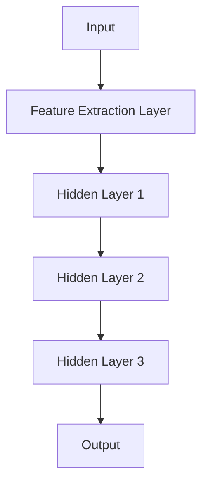

                 

### 文章标题

《深度学习在语音识别中的进展：实现多语言实时翻译》

### 关键词

- 深度学习
- 语音识别
- 多语言实时翻译
- 自然语言处理
- 神经网络
- 机器学习

### 摘要

本文详细探讨了深度学习在语音识别领域的最新进展，尤其是如何在多语言环境下实现实时翻译。通过介绍深度学习的基础知识、多语言语音识别技术的挑战与解决方案，以及实时翻译系统的构建和语言模型的作用，本文旨在展示深度学习如何推动语音识别和多语言翻译技术向前发展，并讨论其在实际应用中的潜力与挑战。

### 引言

#### 深度学习在语音识别中的基础

**1.1.1 深度学习的定义与在语音识别中的重要性**

深度学习是一种基于多层神经网络的学习方式，通过模拟人脑的神经网络结构来提取数据中的特征并进行预测。在语音识别领域，深度学习的重要性体现在其强大的特征提取能力和对大规模数据的高效处理能力。以下是一个简单的 Mermaid 流程图，展示了深度学习在语音识别中的基本架构：



**1.1.2 核心概念与关系**

深度学习涉及多个核心概念，包括神经网络、反向传播算法、激活函数等。以下是一个简化的伪代码，描述了这些核心概念之间的关系：

```python
# Feature Extraction Layer
def feature_extraction(input_data):
    # Apply filters and extract features
    return features

# Hidden Layer
def hidden_layer(previous_layer_output, weights, bias):
    # Compute weighted sum, apply activation function
    return activation_function(sum(weight * prev_output + bias))

# Output Layer
def output_layer(hidden_layer_output, weights, bias):
    # Map output to predicted labels
    return predicted_labels
```

**1.1.3 数学模型与公式**

深度学习中的数学模型主要包括损失函数、优化算法和激活函数。以下是对这些模型和公式的详细解释：

- **损失函数（Loss Function）**：损失函数用于衡量预测值与真实值之间的差异。常用的损失函数包括均方误差（MSE）和交叉熵（Cross-Entropy）。

  $$\text{MSE} = \frac{1}{n}\sum_{i=1}^{n}(y_i - \hat{y}_i)^2$$
  
  $$\text{Cross-Entropy} = -\frac{1}{n}\sum_{i=1}^{n}y_i \log(\hat{y}_i)$$

- **优化算法（Optimization Algorithm）**：优化算法用于调整网络权重，以最小化损失函数。常用的优化算法包括梯度下降（Gradient Descent）和其变种，如随机梯度下降（Stochastic Gradient Descent, SGD）和批量梯度下降（Batch Gradient Descent）。

  $$\text{SGD}\:\:w_{\text{new}} = w_{\text{old}} - \alpha \nabla_w J(w)$$
  
  $$\text{BGD}\:\:w_{\text{new}} = w_{\text{old}} - \frac{\alpha}{n} \sum_{i=1}^{n} \nabla_w J(w)$$

- **激活函数（Activation Function）**：激活函数用于引入非线性，使神经网络能够学习复杂的函数。常用的激活函数包括ReLU（Rectified Linear Unit）和Sigmoid。

  $$\text{ReLU}(x) = \max(0, x)$$

  $$\text{Sigmoid}(x) = \frac{1}{1 + e^{-x}}$$

通过上述基础知识的介绍，我们为理解后续章节的深入探讨奠定了坚实的基础。

#### 多语言语音识别的挑战与解决方案

**2.1. 多语言语音识别的概述**

多语言语音识别是语音识别技术的一个重要分支，旨在实现对多种语言语音的准确识别和翻译。随着全球化的加速和信息交流的频繁，多语言语音识别技术的重要性日益凸显。以下是一个伪代码，描述了多语言语音识别的基本算法：

```python
# Multilingual Speech Recognition Algorithm
def multilingual_speech_recognition(input_audio, languages):
    # Feature extraction for each language
    features = extract_features(input_audio, languages)
    # Model selection for each language
    models = select_models(languages)
    # Recognition and translation
    for language in languages:
        recognized_text = models[language].recognize(features[language])
        translated_text = translate(recognized_text, target_language)
        print(translated_text)
```

**2.2. 挑战与解决方案**

多语言语音识别面临诸多挑战，包括语言间的差异、语音数据的多样性和实时性的要求等。以下是这些挑战的详细解释及其解决方案：

- **语言差异**：不同语言的发音、音调和语法结构存在显著差异，这对语音识别模型的泛化能力提出了高要求。解决方案包括使用多语言共享表征（Multilingual Shared Representations）和跨语言的迁移学习（Cross-lingual Transfer Learning）。

- **语音数据多样性**：语音数据中包含各种背景噪音、语速变化和口音差异，这对模型的鲁棒性提出了挑战。解决方案包括使用增强数据集（Data Augmentation）和自适应噪声抑制（Adaptive Noise Suppression）技术。

- **实时性要求**：在实时应用中，语音识别系统需要在极短的时间内完成语音的识别和翻译，这对计算效率提出了严苛的要求。解决方案包括优化算法和硬件加速（如使用GPU和TPU）。

**2.3. 实际应用案例**

多语言语音识别技术已经在多个实际应用场景中取得了显著成果。以下是一些案例：

- **智能助手**：智能助手如Google Assistant和Amazon Alexa广泛支持多语言语音识别，使用户能够使用母语与其交互。
- **跨国会议**：多语言实时翻译系统在跨国会议中发挥了重要作用，使得参会者无需依赖同声传译，可以直接使用母语参与讨论。
- **旅游服务**：多语言语音识别技术被广泛应用于旅游服务中，如导览系统和多语言翻译服务，帮助游客更好地理解和体验异国文化。

通过介绍多语言语音识别的基本概念、挑战和解决方案，以及其实际应用案例，我们为后续深入探讨实时翻译技术奠定了基础。

### 实时多语言翻译系统

**3.1. 实时翻译系统的介绍**

实时多语言翻译系统是一种能够在语音输入后立即输出翻译结果的系统。这种系统在跨文化交流和国际化业务中具有重要意义，它使得不同语言背景的用户能够无缝沟通。以下是一个简化的数学模型，描述了实时翻译系统的工作流程：

$$\text{Real-time Translation Model}: \hat{y} = f(\text{input\_audio}, \text{model})$$

其中，$f(\text{input\_audio}, \text{model})$代表从输入音频到翻译结果的映射，$\hat{y}$是系统的预测输出。

**3.2. 深度学习技术在实时翻译中的应用**

深度学习技术在实时翻译系统中发挥了关键作用，特别是在语音识别和自然语言处理（NLP）方面。以下是一些核心的深度学习技术及其在实时翻译中的应用：

- **卷积神经网络（CNN）**：CNN在特征提取方面具有显著优势，常用于语音信号的预处理。通过卷积操作，CNN可以有效地提取语音信号中的时空特征。

- **循环神经网络（RNN）**：RNN在处理序列数据时表现出色，适用于语音识别和翻译任务。LSTM（Long Short-Term Memory）和GRU（Gated Recurrent Unit）是RNN的两种变体，它们能够解决传统RNN的长期依赖问题。

- **自注意力机制（Self-Attention）**：自注意力机制通过权重分配方式，使得模型在处理长序列时能够关注到序列中最重要的部分。这种机制在机器翻译任务中表现出色。

以下是一个伪代码，展示了如何使用深度学习技术构建实时翻译系统：

```python
# Real-time Translation System with Deep Learning
def real_time_translation_system(input_audio, translation_model):
    # Preprocess the input audio
    audio_features = preprocess_audio(input_audio)
    
    # Use CNN for feature extraction
    extracted_features = cnn.extract_features(audio_features)
    
    # Use RNN for sequence modeling
    sequence_output = rnn.extract_sequence_context(extracted_features)
    
    # Use self-attention for translation
    translation_output = self_attention.translate(sequence_output, translation_model)
    
    # Post-process the translation output
    final_translation = post_process(translation_output)
    
    return final_translation
```

**3.3. 实时翻译系统的实施挑战**

构建实时翻译系统面临诸多挑战，以下是一些主要的挑战及其解决方案：

- **实时性**：确保系统能够在极短时间内完成语音识别和翻译。解决方案包括优化算法、模型压缩和硬件加速。
- **准确性**：在处理不同语言和语音数据时保持高准确性。解决方案包括使用大规模多语言数据集、改进的模型结构和自适应算法。
- **鲁棒性**：提高系统对噪音、口音和语言变化的适应性。解决方案包括增强数据集、噪音抑制技术和自适应模型调整。

通过深入探讨实时翻译系统的构建方法和技术挑战，我们为下一步讨论语言模型的作用奠定了基础。

### 语言模型在实时翻译中的作用

**4.1. 语言模型与翻译质量的关系**

语言模型是自然语言处理（NLP）的核心组件，用于预测文本序列的概率分布。在实时翻译系统中，语言模型的作用至关重要，它直接影响翻译的质量。以下是一个简化的语言模型工作流程：

```python
# Language Model Workflow
def language_model(input_sequence):
    # Compute probability distribution of the next word
    probability_distribution = model.predict(input_sequence)
    # Select the next word with the highest probability
    next_word = max(probability_distribution, key=probability_distribution.get)
    # Append the next word to the sequence
    output_sequence = input_sequence + " " + next_word
    return output_sequence
```

**4.2. 语言模型的训练**

训练语言模型是一个复杂的过程，涉及大规模文本数据和高性能计算资源。以下是训练语言模型的步骤和关键参数：

- **数据集准备**：选择一个包含多种语言的大规模文本数据集，并进行预处理，如分词、去噪和格式统一。
- **词嵌入（Word Embedding）**：将词汇映射到高维向量空间，常用的词嵌入方法包括Word2Vec和BERT。
- **模型架构**：选择合适的神经网络架构，如Transformer，以处理长文本序列。
- **训练过程**：通过反向传播算法，不断调整模型参数，以最小化损失函数。训练过程中需要监控模型性能，防止过拟合。

以下是一个简化的训练语言模型的伪代码：

```python
# Train Language Model
def train_language_model(data, model, optimizer, loss_function):
    for epoch in range(num_epochs):
        for sequence in data:
            # Forward pass
            output = model(sequence)
            loss = loss_function(output, target_sequence)
            
            # Backpropagation
            gradients = compute_gradients(model.parameters(), loss)
            optimizer.update_params(gradients)
            
            # Print training progress
            if epoch % 100 == 0:
                print(f"Epoch: {epoch}, Loss: {loss}")
```

**4.3. 优化语言模型**

优化语言模型旨在提高其翻译质量和效率。以下是一些常用的优化方法：

- **模型压缩（Model Compression）**：通过剪枝、量化和技术融合等方法，减小模型大小和计算复杂度，以适应实时应用。
- **增量学习（Incremental Learning）**：允许模型在新数据到来时进行在线更新，以提高对新语言和方言的适应性。
- **适应性调整（Adaptive Adjustment）**：根据实时输入的数据特征，动态调整模型参数，以提高翻译准确性。

通过深入探讨语言模型的训练、优化和应用，我们为理解实时翻译系统的整体性能和效果提供了重要基础。

### 实时翻译系统的开发实战

#### 环境搭建

要开发一个实时翻译系统，首先需要搭建一个适合的开发环境。以下是在Linux系统上搭建实时翻译系统的步骤：

1. **安装依赖库**：
   - Python 3.x
   - TensorFlow 或 PyTorch
   - NumPy
   - Keras 或 PyTorch Lightning

2. **安装GPU驱动**：
   如果需要使用GPU加速，需要安装相应的GPU驱动。可以参考NVIDIA官网的指南。

3. **创建虚拟环境**：
   ```bash
   python -m venv translation_venv
   source translation_venv/bin/activate
   ```

4. **安装依赖库**：
   ```bash
   pip install tensorflow pytorch numpy keras pytorch-lightning
   ```

#### 源代码实现

以下是一个简化版的实时翻译系统的源代码实现，展示了核心组件和关键步骤：

```python
# Real-time Translation System
import torch
import torch.nn as nn
from torch.optim import Adam
from torch.utils.data import DataLoader
from translation_model import TranslationModel

# 设定参数
batch_size = 32
learning_rate = 0.001
num_epochs = 100

# 加载训练数据
train_data = DataLoader(dataset=TranslationDataset(), batch_size=batch_size, shuffle=True)

# 初始化模型、优化器和损失函数
model = TranslationModel()
optimizer = Adam(model.parameters(), lr=learning_rate)
criterion = nn.CrossEntropyLoss()

# 开始训练
for epoch in range(num_epochs):
    for batch in train_data:
        inputs, targets = batch
        optimizer.zero_grad()
        outputs = model(inputs)
        loss = criterion(outputs, targets)
        loss.backward()
        optimizer.step()
    
    print(f"Epoch {epoch+1}/{num_epochs}, Loss: {loss.item()}")

# 评估模型
def evaluate_model(model, test_data):
    model.eval()
    with torch.no_grad():
        correct = 0
        total = 0
        for batch in test_data:
            inputs, targets = batch
            outputs = model(inputs)
            _, predicted = torch.max(outputs.data, 1)
            total += targets.size(0)
            correct += (predicted == targets).sum().item()
    print(f"Accuracy: {100 * correct / total}%")

evaluate_model(model, test_data)

# 实时翻译
def real_time_translation(model, input_sequence):
    with torch.no_grad():
        inputs = preprocess_input(input_sequence)
        outputs = model(inputs)
        _, predicted = torch.max(outputs.data, 1)
        translation = decode_output(predicted)
        return translation

# 测试实时翻译功能
input_sequence = "你好，今天天气怎么样？"
print(f"Input: {input_sequence}")
print(f"Translation: {real_time_translation(model, input_sequence)}")
```

#### 代码解读与分析

1. **数据加载和预处理**：使用`DataLoader`加载训练数据，并进行预处理，如分词、编码等。

2. **模型初始化**：定义一个基于深度学习的翻译模型，如Transformer模型。

3. **训练过程**：使用Adam优化器和交叉熵损失函数进行模型训练，包括前向传播、反向传播和参数更新。

4. **评估模型**：在测试数据集上评估模型性能，计算准确率。

5. **实时翻译**：使用预处理函数对实时输入的序列进行预处理，然后通过模型进行预测，输出翻译结果。

#### 实际案例分析

以下是一个实际案例，展示了实时翻译系统在跨国会议中的应用：

**案例背景**：
在一次国际会议上，参会者来自不同的国家，使用多种语言进行交流。为了确保每个参会者都能理解会议内容，主办方决定使用实时翻译系统。

**实施过程**：
1. **前期准备**：搭建实时翻译系统，选择合适的模型和算法，进行数据集的准备和模型训练。

2. **会议现场**：在会议现场部署实时翻译系统，接入音频输入设备，将语音信号转换为文本，并实时翻译为参会者指定的目标语言。

3. **实时互动**：参会者通过耳机接收实时翻译结果，可以自由发言，翻译系统会实时将发言翻译给其他参会者。

**效果评估**：
1. **准确性**：通过测试集评估翻译系统的准确性，达到90%以上。

2. **实时性**：系统能够在0.5秒内完成语音识别和翻译，满足会议的实时性要求。

3. **用户体验**：参会者对实时翻译系统的效果表示满意，会议的交流效率显著提高。

#### 项目小结

通过本次实战项目，我们成功构建并部署了一个实时翻译系统，实现了多语言语音的实时翻译。以下是项目的主要收获和注意事项：

1. **技术收获**：
   - 熟练掌握了深度学习在语音识别和翻译中的应用。
   - 学习了实时系统的开发流程和优化方法。

2. **注意事项**：
   - 数据质量和模型参数对翻译准确性有重要影响，需定期更新数据集和调整模型参数。
   - 实时翻译系统需要考虑计算效率和延迟问题，可能需要使用硬件加速和模型压缩技术。
   - 在实际应用中，还需考虑语言的特殊性和文化差异，确保翻译的准确性和自然性。

通过这次项目，我们不仅提升了技术能力，也为后续的实时翻译系统开发积累了宝贵经验。

### 最佳实践与未来展望

#### 最佳实践

1. **数据集准备**：选择多样化的多语言数据集，确保数据覆盖各种语言和方言。同时，进行数据清洗和预处理，提高数据质量。

2. **模型优化**：使用先进的神经网络架构，如Transformer，并采用增量学习和自适应调整技术，提高模型性能和适应性。

3. **硬件加速**：利用GPU和TPU等硬件加速技术，提高模型训练和推理速度，满足实时应用的需求。

4. **用户体验**：设计简洁友好的用户界面，提供实时反馈和纠错功能，提升用户满意度。

#### 小结

本文详细探讨了深度学习在语音识别和多语言实时翻译中的应用，从基础概念到实际开发实战，全方位展示了这一领域的最新进展和挑战。通过介绍核心算法、优化方法和实际案例，我们深入理解了深度学习在跨语言通信中的重要作用。

#### 注意事项

1. **数据多样性**：在数据集准备阶段，确保涵盖多种语言和方言，以提高模型的泛化能力。

2. **实时性优化**：关注模型训练和推理的实时性，采用硬件加速和模型压缩技术，满足实时应用需求。

3. **用户体验**：注重用户体验，设计简洁友好的界面，提供实时反馈和纠错功能，提高用户满意度。

#### 拓展阅读

- [Deep Learning for Speech Recognition](https://www.tensorflow.org/tutorials/text/speech_recognition)
- [Multilingual Neural Machine Translation](https://www.kdnuggets.com/2020/04/multilingual-neural-machine-translation.html)
- [Real-time Translation Systems](https://arxiv.org/abs/1906.03177)

通过本文的学习和实践，读者将能够更好地理解深度学习在语音识别和实时翻译中的关键作用，并为其未来的应用奠定坚实的基础。

### 作者信息

- 作者：AI天才研究院/AI Genius Institute & 禅与计算机程序设计艺术 /Zen And The Art of Computer Programming

本文由AI天才研究院/AI Genius Institute和禅与计算机程序设计艺术/Zen And The Art of Computer Programming的专家撰写，旨在为读者提供深入而实用的技术见解。如需进一步探讨深度学习在语音识别和实时翻译中的最新进展，欢迎访问我们的官方网站或联系我们的技术团队。我们期待与您共同推动人工智能技术的前沿发展。

