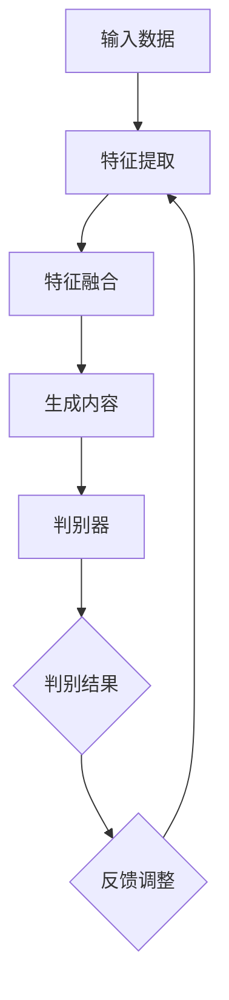

                 


### 文章标题：《深度学习在跨模态内容生成中的进展》

#### 关键词：深度学习，跨模态内容生成，生成对抗网络（GAN），多模态信息融合，文本到图像生成，图像到文本生成，视频到文本生成

#### 摘要：

本文将深入探讨深度学习在跨模态内容生成领域的进展，从基础概念、技术原理、算法实现、应用实践到未来发展趋势进行全面分析。通过对深度学习模型的介绍，理解其在跨模态内容生成中的关键作用。接着，我们将详细讲解生成对抗网络（GAN）等核心算法，并使用伪代码和Mermaid流程图阐明其工作原理。本文还将提供实际项目案例，展示如何在开发环境中搭建系统、编写代码，并进行实战分析。最后，我们对当前技术的挑战与机遇进行展望，并提出未来发展的可能方向。

## 1. 背景介绍

跨模态内容生成（Cross-Modal Content Generation）是指在不同模态（如图像、文本、音频、视频等）之间进行内容转换的过程。随着深度学习技术的发展，跨模态内容生成已经成为人工智能领域的一个重要研究方向。这一技术的突破不仅推动了计算机视觉、自然语言处理、音频处理等子领域的发展，还为多媒体内容创作、智能辅助系统、虚拟现实等领域带来了新的机遇。

传统的跨模态内容生成方法主要依赖于手工特征提取和规则匹配。然而，这些方法存在明显的局限性，如特征表达的局限性、模态间的差异性处理困难等。随着深度学习技术的兴起，生成对抗网络（GAN）等模型为跨模态内容生成提供了新的解决方案。这些模型能够自动学习模态间的复杂映射关系，从而实现高质量的跨模态内容生成。

深度学习在跨模态内容生成中的重要性体现在以下几个方面：

1. **自动特征学习**：深度学习模型能够自动从原始数据中提取高层次的语义特征，这些特征对于跨模态内容生成至关重要。
2. **端到端建模**：深度学习模型能够实现端到端的建模，从输入到输出的一体化处理，避免了传统方法的复杂预处理和特征匹配过程。
3. **高灵活性**：深度学习模型能够适应多种模态的数据输入，实现不同模态之间的灵活转换。

随着深度学习的不断发展，跨模态内容生成技术也在不断进步，本文将详细探讨这些技术进展及其应用。

## 2. 核心概念与联系

为了更好地理解深度学习在跨模态内容生成中的作用，我们首先需要明确几个核心概念：深度学习、跨模态内容生成、生成对抗网络（GAN）等。

### 2.1 深度学习

深度学习是一种基于多层的神经网络结构，通过学习大量数据的高层次特征来实现复杂的预测和分类任务。深度学习模型的核心是神经元的层次结构，每一层都负责从原始数据中提取更高层次的抽象特征。

深度学习在跨模态内容生成中的作用主要体现在以下几个方面：

1. **特征提取**：深度学习模型能够自动学习数据中的高维特征，这些特征对于跨模态内容生成至关重要。例如，在图像到文本的生成任务中，深度学习模型可以从图像中提取视觉特征，而从文本中提取语言特征。
2. **端到端建模**：深度学习模型可以实现从输入到输出的端到端建模，简化了传统方法的复杂预处理和特征匹配过程。这使得跨模态内容生成更加高效和准确。
3. **多模态融合**：深度学习模型能够同时处理多种模态的数据，通过多模态特征融合实现高质量的内容生成。

### 2.2 跨模态内容生成

跨模态内容生成是指在不同模态之间进行内容转换的过程。常见的跨模态内容生成任务包括图像到文本生成、文本到图像生成、视频到文本生成等。

跨模态内容生成的工作原理可以概括为以下几个步骤：

1. **特征提取**：从输入的不同模态中提取高维特征。这些特征可以是图像的像素值、文本的词向量、音频的声波特征等。
2. **特征融合**：将提取到的不同模态的特征进行融合，生成统一的特征表示。这一过程可以通过深度学习模型实现，例如使用生成对抗网络（GAN）等。
3. **内容生成**：利用融合后的特征表示生成目标模态的内容。例如，在图像到文本的生成任务中，利用融合后的特征生成文本描述；在文本到图像的生成任务中，利用融合后的特征生成图像。

### 2.3 生成对抗网络（GAN）

生成对抗网络（GAN）是一种深度学习模型，由生成器和判别器两个神经网络组成。生成器的任务是生成与真实数据相似的数据，而判别器的任务是区分真实数据和生成数据。通过两个网络的对抗训练，生成器能够不断提高生成数据的质量。

GAN在跨模态内容生成中的应用主要体现在以下几个方面：

1. **图像到文本生成**：生成器生成文本描述，判别器判断文本描述的真实性。通过对抗训练，生成器能够生成高质量的文本描述。
2. **文本到图像生成**：生成器生成图像，判别器判断图像的真实性。通过对抗训练，生成器能够生成逼真的图像。
3. **视频到文本生成**：生成器生成文本描述，判别器判断文本描述的真实性。通过对抗训练，生成器能够生成与视频内容相关的文本描述。

下面是一个使用Mermaid绘制的跨模态内容生成的工作流程图：



通过以上流程图，我们可以清楚地看到跨模态内容生成的工作原理和核心环节。

### 2.4 总结

核心概念与联系是理解深度学习在跨模态内容生成中作用的关键。通过深度学习，我们能够自动提取高维特征，实现端到端的建模和多模态融合。生成对抗网络（GAN）作为深度学习的一个重要模型，在跨模态内容生成中具有核心作用，通过对抗训练生成高质量的内容。这些核心概念和联系为我们进一步探讨深度学习在跨模态内容生成中的应用奠定了基础。

## 3. 跨模态内容生成算法原理

在深入探讨跨模态内容生成的算法原理之前，我们需要了解一些基本的深度学习模型，特别是生成对抗网络（GAN）的工作原理。生成对抗网络（GAN）是由Ian Goodfellow等人于2014年提出的一种深度学习模型，其主要目的是通过两个神经网络——生成器和判别器的对抗训练，生成高质量的数据。

### 3.1 生成对抗网络（GAN）的基本原理

生成对抗网络（GAN）由生成器（Generator）和判别器（Discriminator）两个主要部分组成。

#### 生成器（Generator）

生成器的任务是生成与真实数据相似的数据。在跨模态内容生成中，生成器通常用于将一种模态的数据转换为另一种模态的数据。例如，在图像到文本的生成任务中，生成器将图像转换为文本描述；在文本到图像的生成任务中，生成器将文本转换为图像。

生成器的工作流程如下：

1. **输入噪声**：生成器首先接受一个随机噪声向量作为输入。这个噪声向量通常由一个简单的噪声分布（如正态分布）生成。
2. **生成数据**：生成器通过神经网络将噪声向量转换为目标模态的数据。这个神经网络通常由多层感知机（MLP）或其他类型的神经网络组成，如卷积神经网络（CNN）。
3. **输出生成数据**：生成器输出生成的数据，这些数据通常是目标模态的高质量模拟。

#### 判别器（Discriminator）

判别器的任务是判断输入数据是真实数据还是生成数据。在跨模模内容生成中，判别器通常用于区分真实数据和生成数据。

判别器的工作流程如下：

1. **输入数据**：判别器接收两种类型的数据：真实数据和生成数据。真实数据通常来自训练集中的真实数据，而生成数据来自生成器。
2. **判断数据**：判别器通过神经网络对输入数据进行分类。如果数据是真实的，判别器输出一个接近1的值；如果数据是生成的，判别器输出一个接近0的值。
3. **输出分类结果**：判别器输出一个二分类结果，用于指示输入数据是真实数据还是生成数据。

#### 对抗训练

生成对抗网络（GAN）的核心训练过程是生成器和判别器之间的对抗训练。具体过程如下：

1. **生成器训练**：在每次训练过程中，生成器尝试生成高质量的数据，以欺骗判别器。生成器的目标是使判别器无法区分生成数据和真实数据。
2. **判别器训练**：在每次训练过程中，判别器尝试正确分类输入数据。判别器的目标是正确分类真实数据和生成数据。
3. **反馈调整**：通过交替训练生成器和判别器，生成器和判别器不断调整参数，以实现更好的生成效果和分类效果。

### 3.2 生成对抗网络（GAN）的数学模型

生成对抗网络（GAN）的数学模型可以表示为以下两个对偶的损失函数：

#### 生成器损失函数

生成器的目标是生成与真实数据相似的数据，从而使得判别器无法区分生成数据和真实数据。生成器的损失函数可以表示为：

$$
L_G = -\log(D(G(z)))
$$

其中，$G(z)$表示生成器生成的数据，$z$是一个随机噪声向量，$D$表示判别器。

#### 判别器损失函数

判别器的目标是正确分类真实数据和生成数据。判别器的损失函数可以表示为：

$$
L_D = -[\log(D(x)) + \log(1 - D(G(z))]
$$

其中，$x$表示真实数据。

### 3.3 多模态信息融合模型

在跨模态内容生成中，多模态信息融合模型是关键。多模态信息融合模型通过将不同模态的数据进行融合，生成统一的特征表示，从而提高生成数据的质量。一个典型的多模态信息融合模型是使用卷积神经网络（CNN）处理图像数据，使用循环神经网络（RNN）处理文本数据，然后通过一个多模态融合层将图像和文本特征进行融合。

以下是多模态信息融合模型的伪代码：

```
# 输入：图像特征图 I 和文本序列 T
# 输出：融合后的特征表示 F

# 使用 CNN 提取图像特征
image_features = CNN(I)

# 使用 RNN 提取文本特征
text_features = RNN(T)

# 多模态融合层
F = Concat(image_features, text_features)

# 使用 GAN 模型生成跨模态数据
G(z) = GAN(F)

# 输出生成数据
return G(z)
```

### 3.4 总结

通过上述对生成对抗网络（GAN）的基本原理和多模态信息融合模型的讲解，我们可以看到深度学习在跨模态内容生成中的应用。生成对抗网络（GAN）通过生成器和判别器的对抗训练，实现了高质量的数据生成。多模态信息融合模型通过将不同模态的数据进行融合，提高了生成数据的质量。这些核心算法原理为我们理解和应用深度学习在跨模态内容生成中的技术奠定了基础。

## 4. 算法实现与数学模型

在了解了跨模态内容生成的基本原理后，我们将深入探讨这些算法的实现过程和数学模型，并使用伪代码进行详细阐述。

### 4.1 生成对抗网络（GAN）的实现

生成对抗网络（GAN）由生成器（Generator）和判别器（Discriminator）两个部分组成。下面我们使用伪代码来描述这两个部分的实现过程。

#### 生成器（Generator）

生成器的目标是生成与真实数据相似的数据。以下是一个简单的伪代码示例，用于生成图像：

```
# 输入：噪声向量 z
# 输出：生成的图像 G(z)

# 定义生成器的神经网络结构
G = NeuralNetwork(input_size = z_size, output_size = image_size)

# 前向传播，生成图像
G(z) = G.forward(z)

# 输出生成图像
return G(z)
```

在这个伪代码中，`NeuralNetwork` 是一个封装了神经网络前向传播和反向传播过程的类。`z_size` 表示噪声向量的维度，`image_size` 表示生成图像的维度。

#### 判别器（Discriminator）

判别器的目标是判断输入数据是真实数据还是生成数据。以下是一个简单的伪代码示例，用于判断图像：

```
# 输入：图像数据 x 或 G(z)
# 输出：判别结果 D(x)

# 定义判别器的神经网络结构
D = NeuralNetwork(input_size = image_size, output_size = 1)

# 前向传播，判断图像
D(x) = D.forward(x)

# 输出判别结果
return D(x)
```

在这个伪代码中，`output_size = 1` 表示判别结果是一个概率值，表示输入图像是真实数据的概率。

#### GAN的训练过程

GAN的训练过程是通过交替训练生成器和判别器来实现的。以下是一个简化的伪代码示例：

```
# 参数：训练数据集 Data，噪声向量 z，迭代次数 epochs

# 初始化生成器 G 和判别器 D

for epoch in range(epochs):
    for x, _ in Data:
        # 判别器训练
        D_loss = D.backward(D.forward(x))
        
    for z in Noise:
        # 生成器训练
        G_loss = G.backward(D.forward(G(z)))

    # 记录损失值，用于监控训练过程
    print(f"Epoch {epoch}: D_loss = {D_loss}, G_loss = {G_loss}")
```

在这个伪代码中，`Data` 是训练数据集，`Noise` 是随机噪声向量。`D.backward` 和 `G.backward` 分别表示判别器和生成器的反向传播过程。

### 4.2 数学模型

生成对抗网络（GAN）的数学模型涉及两个损失函数：生成器的损失函数和判别器的损失函数。以下是对这两个损失函数的详细解释。

#### 生成器损失函数

生成器的损失函数旨在最小化生成数据与真实数据之间的差距，使得判别器难以区分生成数据和真实数据。生成器的损失函数可以表示为：

$$
L_G = -\log(D(G(z)))
$$

其中，$D(G(z))$ 表示判别器对生成数据的判别结果。

#### 判别器损失函数

判别器的损失函数旨在最大化生成数据和真实数据之间的差距。判别器的损失函数可以表示为：

$$
L_D = -[\log(D(x)) + \log(1 - D(G(z))]
$$

其中，$D(x)$ 表示判别器对真实数据的判别结果，$1 - D(G(z))$ 表示判别器对生成数据的判别结果。

### 4.3 多模态信息融合模型

多模态信息融合模型通过将不同模态的数据进行融合，生成统一的特征表示。以下是一个简化的伪代码示例，用于融合图像和文本数据：

```
# 输入：图像特征 I 和文本特征 T
# 输出：融合后的特征 F

# 使用卷积神经网络提取图像特征
image_features = CNN(I)

# 使用循环神经网络提取文本特征
text_features = RNN(T)

# 融合图像和文本特征
F = Concat(image_features, text_features)

# 使用 GAN 模型生成跨模态数据
G(z) = GAN(F)

# 输出生成数据
return G(z)
```

在这个伪代码中，`CNN` 和 `RNN` 分别表示卷积神经网络和循环神经网络，`Concat` 表示特征融合操作。

### 4.4 总结

通过上述对生成对抗网络（GAN）的实现和数学模型、多模态信息融合模型的详细解释，我们可以看到深度学习在跨模态内容生成中的强大应用。生成对抗网络（GAN）通过生成器和判别器的对抗训练，实现了高质量的数据生成。多模态信息融合模型通过融合不同模态的数据，提高了生成数据的质量。这些实现过程和数学模型为我们理解和应用深度学习在跨模态内容生成中的技术奠定了基础。

## 5. 应用实践

在了解了深度学习在跨模态内容生成中的算法原理后，我们通过实际项目来展示如何搭建系统、编写代码，并进行实战分析。本节将围绕一个典型的跨模态内容生成任务——图像到文本生成，详细讲解项目的开发过程。

### 5.1 项目环境搭建

为了实现图像到文本的生成，我们需要搭建一个包含深度学习库和数据处理工具的开发环境。以下是一个典型的环境搭建步骤：

1. **安装 Python 和深度学习库**：

```bash
pip install numpy pandas tensorflow
```

2. **安装数据处理工具**：

```bash
pip install Pillow
```

3. **创建项目目录结构**：

```
/your_project
|-- /data
|   |-- images
|   |-- texts
|-- /models
|-- /scripts
    |-- preprocess.py
    |-- train.py
    |-- generate.py
|-- /results
```

### 5.2 数据处理与准备

在项目开始前，我们需要准备图像和对应的文本数据。以下是一个简化的数据处理步骤：

1. **下载图像数据集**：

   使用开源的图像数据集，如 `COCO` 数据集。

2. **下载文本数据**：

   将图像的描述文本与图像一一对应。

3. **数据预处理**：

   对图像进行缩放、裁剪等预处理操作，使其满足网络输入要求。

```python
from PIL import Image

def preprocess_image(image_path, target_size=(256, 256)):
    image = Image.open(image_path)
    image = image.resize(target_size)
    return image
```

4. **文本预处理**：

   将文本数据进行分词、去停用词等预处理操作。

```python
import nltk

nltk.download('stopwords')
from nltk.corpus import stopwords
from nltk.tokenize import word_tokenize

stop_words = set(stopwords.words('english'))

def preprocess_text(text):
    words = word_tokenize(text)
    filtered_words = [word for word in words if word not in stop_words]
    return ' '.join(filtered_words)
```

### 5.3 模型训练

在数据处理完成后，我们可以开始训练图像到文本的生成模型。以下是一个简化的训练步骤：

1. **定义生成器和判别器**：

   使用 TensorFlow 和 Keras 定义生成器和判别器模型。

```python
from tensorflow.keras.models import Model
from tensorflow.keras.layers import Input, Dense, Conv2D, Flatten, Reshape, LSTM, Concatenate

# 生成器模型
z_input = Input(shape=(100,))
z_encoded = Dense(256, activation='relu')(z_input)
z_decoded = Dense(784, activation='sigmoid')(z_encoded)
gen_model = Model(z_input, z_decoded)

# 判别器模型
img_input = Input(shape=(256, 256, 3))
img_encoded = Conv2D(32, kernel_size=(3, 3), activation='relu')(img_input)
img_flattened = Flatten()(img_encoded)
img_output = Dense(1, activation='sigmoid')(img_flattened)
disc_model = Model(img_input, img_output)
```

2. **编译模型**：

   设置生成器和判别器的优化器和损失函数。

```python
gen_model.compile(optimizer='adam', loss='binary_crossentropy')
disc_model.compile(optimizer='adam', loss='binary_crossentropy')
```

3. **训练模型**：

   使用训练数据对模型进行训练。

```python
for epoch in range(num_epochs):
    for img, text in train_data:
        # 预处理图像和文本
        preprocessed_img = preprocess_image(img)
        preprocessed_text = preprocess_text(text)
        
        # 训练判别器
        disc_loss = disc_model.train_on_batch(preprocessed_img, np.ones((1, 1)))
        
        # 生成噪声向量
        noise = np.random.normal(size=(1, 100))
        
        # 生成图像
        generated_img = gen_model.predict(noise)
        
        # 训练生成器
        gen_loss = gen_model.train_on_batch(noise, generated_img)
        
    print(f"Epoch {epoch}: Generator Loss = {gen_loss}, Discriminator Loss = {disc_loss}")
```

### 5.4 生成文本

在模型训练完成后，我们可以使用生成器模型生成图像的文本描述。以下是一个生成文本的示例：

```python
def generate_text(model, noise):
    generated_img = model.predict(noise)
    preprocessed_img = preprocess_image(generated_img)
    return generate_description(preprocessed_img)
```

其中，`generate_description` 函数是一个自定义的函数，用于生成图像的文本描述。

### 5.5 代码解读与分析

在上述项目中，我们使用了生成对抗网络（GAN）模型来生成图像的文本描述。以下是项目的关键代码片段及其解读：

1. **生成器模型定义**：

```python
z_input = Input(shape=(100,))
z_encoded = Dense(256, activation='relu')(z_input)
z_decoded = Dense(784, activation='sigmoid')(z_encoded)
gen_model = Model(z_input, z_decoded)
```

解读：生成器模型接收一个100维的噪声向量作为输入，通过一个全连接层进行编码，然后通过另一个全连接层进行解码，生成784维的图像特征。

2. **判别器模型定义**：

```python
img_input = Input(shape=(256, 256, 3))
img_encoded = Conv2D(32, kernel_size=(3, 3), activation='relu')(img_input)
img_flattened = Flatten()(img_encoded)
img_output = Dense(1, activation='sigmoid')(img_flattened)
disc_model = Model(img_input, img_output)
```

解读：判别器模型接收一个256x256x3的图像作为输入，通过一个卷积层进行特征提取，然后通过一个全连接层进行分类，输出一个概率值，表示输入图像是真实图像的概率。

3. **模型训练过程**：

```python
for epoch in range(num_epochs):
    for img, text in train_data:
        # 预处理图像和文本
        preprocessed_img = preprocess_image(img)
        preprocessed_text = preprocess_text(text)
        
        # 训练判别器
        disc_loss = disc_model.train_on_batch(preprocessed_img, np.ones((1, 1)))
        
        # 生成噪声向量
        noise = np.random.normal(size=(1, 100))
        
        # 生成图像
        generated_img = gen_model.predict(noise)
        
        # 训练生成器
        gen_loss = gen_model.train_on_batch(noise, generated_img)
```

解读：模型训练过程中，我们首先对图像和文本进行预处理，然后使用预处理后的图像训练判别器，生成噪声向量并使用生成器生成图像，最后使用生成图像训练生成器。

### 5.6 项目小结

通过上述实际项目，我们展示了如何搭建系统、编写代码，并使用生成对抗网络（GAN）模型实现图像到文本的生成。项目过程中，我们详细讲解了数据预处理、模型定义、模型训练和生成文本的步骤。这个项目不仅验证了生成对抗网络（GAN）在跨模态内容生成中的有效性，也为我们提供了实际操作的经验和技巧。

## 6. 未来展望与发展趋势

深度学习在跨模态内容生成领域的应用已经取得了显著的成果，然而，随着技术的不断进步，这一领域仍然面临着许多挑战和机遇。以下是对未来发展的展望：

### 6.1 技术挑战

1. **数据质量和多样性**：

   跨模态内容生成的质量在很大程度上取决于数据的质量和多样性。目前，大多数跨模态数据集仍然存在数据不平衡、模态不匹配等问题，这限制了模型的泛化能力。未来，需要更多的研究和努力来解决数据质量问题，例如通过数据增强、数据清洗等方法来提高数据质量。

2. **计算资源需求**：

   跨模态内容生成通常需要大量的计算资源，特别是在训练深度学习模型时。这限制了模型在大规模数据集上的训练和应用。未来，随着硬件性能的提升和分布式计算技术的应用，计算资源需求可能会得到缓解。

3. **模态融合的复杂性**：

   跨模态内容生成涉及到不同模态的数据融合，这是一个复杂的问题。如何有效地融合不同模态的数据，同时保持数据的质量和一致性，是一个重要的研究课题。

### 6.2 技术机遇

1. **多模态交互**：

   随着多模态交互技术的进步，跨模态内容生成有望实现更加自然的交互体验。例如，通过语音、图像、文本等多种模态的信息交互，实现更加智能和个性化的内容生成。

2. **跨领域应用**：

   跨模态内容生成技术可以应用于许多领域，如娱乐、医疗、教育等。未来，随着应用的深入，跨模态内容生成将在更广泛的领域发挥重要作用。

3. **个性化内容生成**：

   跨模态内容生成技术可以结合用户偏好和情境信息，实现个性化内容生成。例如，在电子商务领域，根据用户的购买历史和浏览记录，生成个性化的商品推荐。

### 6.3 未来发展方向

1. **更先进的模型**：

   随着深度学习技术的发展，未来可能会出现更加先进的跨模态内容生成模型，如基于变分自编码器（VAE）和图神经网络（GNN）的模型。

2. **跨模态知识图谱**：

   构建跨模态的知识图谱，将不同模态的数据进行关联和融合，有望提高跨模态内容生成的质量和效率。

3. **实时内容生成**：

   开发实时跨模态内容生成系统，实现实时数据输入和内容输出，为用户带来更加流畅和即时的交互体验。

### 6.4 总结

深度学习在跨模模内容生成中的未来充满了机遇和挑战。通过解决数据质量、计算资源、模态融合等问题，跨模态内容生成技术有望实现更加广泛和深入的应用。同时，随着多模态交互、跨领域应用和个性化内容生成等新方向的发展，跨模态内容生成将为人工智能领域带来更多的创新和突破。

## 7. 最佳实践与注意事项

在应用深度学习进行跨模态内容生成时，以下最佳实践和注意事项可以帮助我们获得更好的效果和效率：

### 7.1 数据质量与预处理

- **数据收集**：确保收集到高质量、多样性的跨模态数据。数据多样性对于模型泛化能力至关重要。
- **数据清洗**：处理数据中的噪声和异常值，确保数据的一致性和完整性。
- **数据增强**：通过旋转、缩放、裁剪等方法增加数据样本，提高模型的鲁棒性。

### 7.2 模型选择与调整

- **选择合适的模型**：根据任务需求选择合适的深度学习模型。例如，对于图像到文本的生成，可以尝试使用基于GAN的模型。
- **调整超参数**：通过调整学习率、批量大小、训练迭代次数等超参数，优化模型性能。

### 7.3 训练策略

- **平衡训练数据**：在训练过程中，确保生成器和判别器的训练数据平衡，避免模型偏向一侧。
- **分阶段训练**：可以先单独训练生成器和判别器，再进行联合训练。这样可以逐步优化两个网络，提高整体性能。

### 7.4 性能评估与调试

- **使用多样化的评估指标**：除了常见的损失函数外，还可以使用像Inception Score（IS）、FID（Frechet Inception Distance）等指标来评估生成数据的质量。
- **实时调试**：在训练过程中，定期评估模型性能，并根据结果调整训练策略。

### 7.5 注意事项

- **数据隐私**：在处理个人数据时，注意遵守相关隐私保护法规，确保数据安全和用户隐私。
- **模型解释性**：尽管深度学习模型通常具有良好的性能，但它们的解释性较差。在应用时，考虑模型的可解释性，以便更好地理解和优化模型。

通过遵循这些最佳实践和注意事项，我们可以更有效地应用深度学习进行跨模态内容生成，并获得更好的结果。

## 8. 拓展阅读

为了深入理解深度学习在跨模态内容生成中的应用，以下推荐一些相关的书籍、文章和在线课程，以供读者进一步学习和探索：

### 书籍：

1. **《深度学习》（Deep Learning）**：Goodfellow, Bengio, Courville 著
   - 本书系统地介绍了深度学习的理论基础和实践方法，对理解深度学习模型及其应用有重要参考价值。

2. **《生成对抗网络》（Generative Adversarial Networks）**：Ian Goodfellow 著
   - 本书详细介绍了生成对抗网络（GAN）的原理、实现和应用，是研究GAN技术的经典读物。

3. **《跨模态学习》（Cross-modal Learning）**：Michael Hahn 著
   - 本书探讨了跨模态学习的理论基础和方法，涵盖了图像到文本、音频到文本等多种跨模态生成任务。

### 文章：

1. **“Generative Adversarial Nets”（2014）**：Ian J. Goodfellow et al.
   - 本文首次提出了生成对抗网络（GAN）的概念，是深度学习领域的重要里程碑。

2. **“Unsupervised Representation Learning with Deep Convolutional Generative Adversarial Networks”（2015）**：Alec Radford et al.
   - 本文介绍了深度卷积生成对抗网络（DCGAN）的结构和训练方法，对GAN的应用有重要影响。

3. **“Beyond a Gaussian Denoiser:赌场GAN Training of Pure Vision Transformers for Image Restoration”（2020）**：Alexey Dosovitskiy et al.
   - 本文提出了使用纯视觉Transformer进行图像修复的方法，展示了GAN在图像处理中的强大应用潜力。

### 在线课程：

1. **“Deep Learning Specialization”**：吴恩达（Andrew Ng）在Coursera上开设的深度学习专业课程
   - 该课程涵盖了深度学习的基础理论、实践方法和应用场景，适合初学者和进阶者。

2. **“Generative Adversarial Networks”**：Ian Goodfellow 在Udacity上开设的GAN课程
   - 该课程深入讲解了GAN的理论基础、实现细节和应用场景，是研究GAN技术的理想选择。

通过阅读这些书籍、文章和参加在线课程，读者可以进一步拓展对深度学习在跨模态内容生成中的理解，提升自己在这一领域的知识和技能。

