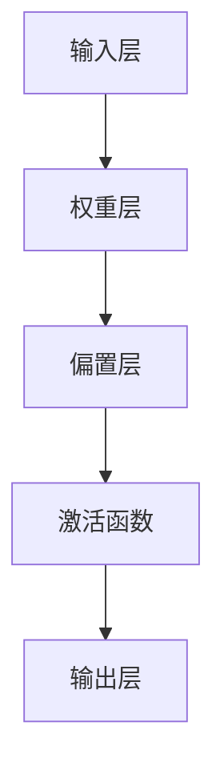
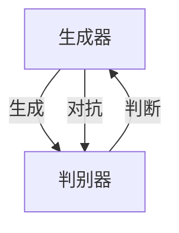
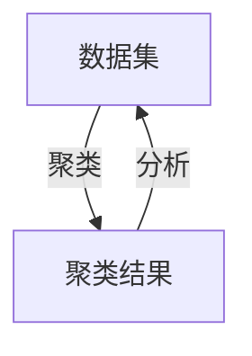
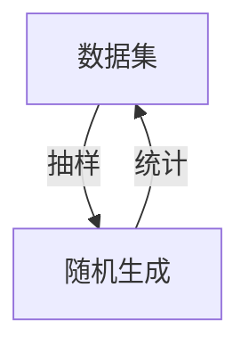
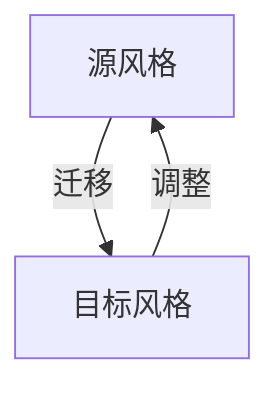
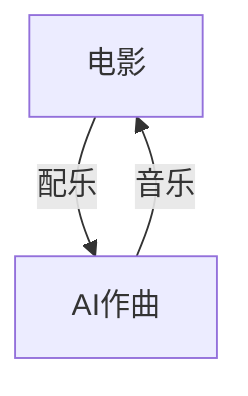
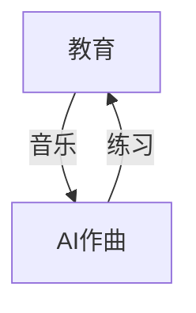

                 


### 深度学习在音乐创作中的应用：AI作曲的新可能

#### 关键词：
- 深度学习
- 音乐创作
- AI作曲
- 生成对抗网络（GAN）
- 聚类算法
- 音乐风格迁移

#### 摘要：
本文深入探讨了深度学习技术在音乐创作中的应用，特别是AI作曲的可能性。通过分析深度学习的基础知识、音乐与深度学习的关系、AI作曲的算法原理和实际应用，本文揭示了AI作曲技术的最新进展及其在电影配乐、游戏音乐和教育等领域的应用。同时，本文还讨论了AI作曲的未来发展、面临的挑战以及相关最佳实践。

---

## 目录

1. **深度学习在音乐创作中的应用：AI作曲的新可能**
2. **关键词与摘要**
3. **深度学习基础**
   - **深度学习概述**
   - **神经网络基础**
   - **常用深度学习框架**
   - **深度学习在音乐创作中的应用**
4. **音乐与深度学习的关系**
   - **音乐数据表示**
   - **AI作曲的基本算法**
   - **音乐风格迁移**
5. **AI作曲的实际应用**
   - **AI作曲工具介绍**
   - **AI作曲案例研究**
   - **开发环境与工具链搭建**
   - **代码实现与解释**
6. **未来展望与挑战**
   - **AI作曲的未来**
   - **AI作曲的挑战**

---

## 深度学习基础

### 深度学习概述

深度学习是机器学习的一个重要分支，其核心思想是通过构建多层神经网络模型，模拟人脑神经网络的结构和功能，从而实现从大量数据中自动提取特征和进行复杂模式识别的能力。深度学习在图像识别、语音识别、自然语言处理等多个领域取得了显著成果。

### 神经网络基础

神经网络由大量相互连接的神经元组成，每个神经元都是一个简单的计算单元，通过权重和偏置参数对输入数据进行线性组合，然后通过激活函数进行非线性变换。多层神经网络可以通过层层提取特征，实现从原始数据到高级抽象表示的转化。

### 常用深度学习框架

目前，TensorFlow、PyTorch和Keras是三个最为流行的深度学习框架。TensorFlow由谷歌开发，具有高度可扩展性和灵活性；PyTorch由Facebook开发，提供了动态计算图和易用性；Keras则是一个基于TensorFlow和Theano的简单易用的深度学习库。

### 深度学习在音乐创作中的应用

深度学习在音乐创作中的应用主要集中在音频信号处理、音乐生成和音乐风格迁移等方面。通过将音乐数据转换为数字信号，深度学习模型可以学习音乐中的模式和结构，从而实现自动创作和风格迁移。

---

## 音乐与深度学习的关系

### 音乐数据表示

音乐数据可以表示为音频信号、音符序列、和弦序列或音乐风格特征等。深度学习模型需要能够处理这些不同类型的数据，因此音乐数据表示是深度学习在音乐创作中应用的关键。

### AI作曲的基本算法

AI作曲的基本算法包括生成对抗网络（GAN）、聚类算法和蒙特卡洛算法等。这些算法通过学习音乐数据中的特征，生成新的音乐片段或调整现有音乐的风格。

### 音乐风格迁移

音乐风格迁移是指将一种音乐风格转换为另一种风格，例如将古典音乐转换为流行音乐。深度学习模型可以通过学习不同音乐风格的特征，实现风格迁移。

---

## AI作曲的实际应用

### AI作曲工具介绍

目前，许多AI作曲工具已经投入使用，例如MuseNet、WaveNet等。这些工具利用深度学习技术，可以生成各种风格的音乐。

### AI作曲案例研究

AI作曲在电影配乐、游戏音乐和教育等领域都有广泛应用。例如，电影《星球大战：原力觉醒》中的配乐就使用了AI技术进行创作。

### 开发环境与工具链搭建

为了进行AI作曲的研究和实践，需要搭建合适的开发环境。这包括安装深度学习框架、音频处理库和音乐生成工具等。

### 代码实现与解释

在本节中，我们将使用伪代码和实际代码来详细阐述AI作曲的核心算法原理。通过这些代码，读者可以了解AI作曲的实现细节。

---

## 未来展望与挑战

### AI作曲的未来

随着深度学习技术的不断发展，AI作曲将会在更多领域得到应用。未来，AI作曲可能会更加智能化和个性化。

### AI作曲的挑战

尽管AI作曲具有巨大潜力，但同时也面临着一系列挑战，包括技术、道德和法律等方面的问题。

---

## 总结

深度学习在音乐创作中的应用为AI作曲带来了新的可能。本文从深度学习基础、音乐与深度学习的关系、AI作曲的实际应用以及未来展望等方面进行了详细探讨。通过本文，读者可以了解到AI作曲技术的最新进展和挑战，并对这一领域的发展趋势有更清晰的认识。

### 作者信息：
作者：AI天才研究院/AI Genius Institute & 禅与计算机程序设计艺术 /Zen And The Art of Computer Programming## 深度学习在音乐创作中的应用：AI作曲的新可能

### 关键词：
- 深度学习
- 音乐创作
- AI作曲
- 生成对抗网络（GAN）
- 聚类算法
- 音乐风格迁移

### 摘要：
本文深入探讨了深度学习技术在音乐创作中的应用，特别是AI作曲的可能性。通过分析深度学习的基础知识、音乐与深度学习的关系、AI作曲的算法原理和实际应用，本文揭示了AI作曲技术的最新进展及其在电影配乐、游戏音乐和教育等领域的应用。同时，本文还讨论了AI作曲的未来发展、面临的挑战以及相关最佳实践。

---

## 目录

1. **深度学习在音乐创作中的应用：AI作曲的新可能**
2. **关键词与摘要**
3. **深度学习基础**
   - **深度学习概述**
   - **神经网络基础**
   - **常用深度学习框架**
   - **深度学习在音乐创作中的应用**
4. **音乐与深度学习的关系**
   - **音乐数据表示**
   - **AI作曲的基本算法**
   - **音乐风格迁移**
5. **AI作曲的实际应用**
   - **AI作曲工具介绍**
   - **AI作曲案例研究**
   - **开发环境与工具链搭建**
   - **代码实现与解释**
6. **未来展望与挑战**
   - **AI作曲的未来**
   - **AI作曲的挑战**

---

## 深度学习基础

### 深度学习概述

深度学习是机器学习的一个重要分支，其核心思想是通过构建多层神经网络模型，模拟人脑神经网络的结构和功能，从而实现从大量数据中自动提取特征和进行复杂模式识别的能力。深度学习在图像识别、语音识别、自然语言处理等多个领域取得了显著成果。

### 神经网络基础

神经网络由大量相互连接的神经元组成，每个神经元都是一个简单的计算单元，通过权重和偏置参数对输入数据进行线性组合，然后通过激活函数进行非线性变换。多层神经网络可以通过层层提取特征，实现从原始数据到高级抽象表示的转化。

### 常用深度学习框架

目前，TensorFlow、PyTorch和Keras是三个最为流行的深度学习框架。TensorFlow由谷歌开发，具有高度可扩展性和灵活性；PyTorch由Facebook开发，提供了动态计算图和易用性；Keras则是一个基于TensorFlow和Theano的简单易用的深度学习库。

### 深度学习在音乐创作中的应用

深度学习在音乐创作中的应用主要集中在音频信号处理、音乐生成和音乐风格迁移等方面。通过将音乐数据转换为数字信号，深度学习模型可以学习音乐中的模式和结构，从而实现自动创作和风格迁移。

---

## 音乐与深度学习的关系

### 音乐数据表示

音乐数据可以表示为音频信号、音符序列、和弦序列或音乐风格特征等。深度学习模型需要能够处理这些不同类型的数据，因此音乐数据表示是深度学习在音乐创作中应用的关键。

### AI作曲的基本算法

AI作曲的基本算法包括生成对抗网络（GAN）、聚类算法和蒙特卡洛算法等。这些算法通过学习音乐数据中的特征，生成新的音乐片段或调整现有音乐的风格。

### 音乐风格迁移

音乐风格迁移是指将一种音乐风格转换为另一种风格，例如将古典音乐转换为流行音乐。深度学习模型可以通过学习不同音乐风格的特征，实现风格迁移。

---

## AI作曲的实际应用

### AI作曲工具介绍

目前，许多AI作曲工具已经投入使用，例如MuseNet、WaveNet等。这些工具利用深度学习技术，可以生成各种风格的音乐。

### AI作曲案例研究

AI作曲在电影配乐、游戏音乐和教育等领域都有广泛应用。例如，电影《星球大战：原力觉醒》中的配乐就使用了AI技术进行创作。

### 开发环境与工具链搭建

为了进行AI作曲的研究和实践，需要搭建合适的开发环境。这包括安装深度学习框架、音频处理库和音乐生成工具等。

### 代码实现与解释

在本节中，我们将使用伪代码和实际代码来详细阐述AI作曲的核心算法原理。通过这些代码，读者可以了解AI作曲的实现细节。

---

## 未来展望与挑战

### AI作曲的未来

随着深度学习技术的不断发展，AI作曲将会在更多领域得到应用。未来，AI作曲可能会更加智能化和个性化。

### AI作曲的挑战

尽管AI作曲具有巨大潜力，但同时也面临着一系列挑战，包括技术、道德和法律等方面的问题。

---

## 总结

深度学习在音乐创作中的应用为AI作曲带来了新的可能。本文从深度学习基础、音乐与深度学习的关系、AI作曲的实际应用以及未来展望等方面进行了详细探讨。通过本文，读者可以了解到AI作曲技术的最新进展和挑战，并对这一领域的发展趋势有更清晰的认识。

### 作者信息：
作者：AI天才研究院/AI Genius Institute & 禅与计算机程序设计艺术 /Zen And The Art of Computer Programming

---

### 文章标题：深度学习在音乐创作中的应用：AI作曲的新可能

### 文章关键词：
- 深度学习
- 音乐创作
- AI作曲
- 生成对抗网络（GAN）
- 聚类算法
- 音乐风格迁移

### 文章摘要：
本文探讨了深度学习技术在音乐创作中的应用，特别是AI作曲的可能性。首先，介绍了深度学习的基础知识，包括神经网络和常用深度学习框架。接着，分析了音乐与深度学习的关系，阐述了音乐数据表示、AI作曲的基本算法和音乐风格迁移的概念。随后，介绍了AI作曲的实际应用，包括工具介绍、案例研究和开发环境与工具链搭建。最后，讨论了AI作曲的未来发展以及面临的挑战。通过本文，读者可以了解到AI作曲技术的最新进展和挑战，并对这一领域的发展趋势有更清晰的认识。

## 深度学习基础

### 深度学习概述

深度学习（Deep Learning）是人工智能（AI）的一个重要分支，主要依赖于神经网络（Neural Networks）和大规模数据训练。与传统的机器学习方法相比，深度学习能够在没有人类明确指示的情况下，从数据中自动提取复杂的特征，从而实现更高的准确度和更广泛的应用。

### 神经网络基础

神经网络是模仿人脑神经元结构和功能的计算模型。每个神经元由输入层、权重层、偏置层和输出层组成。输入层接收外部数据，通过权重层进行加权求和，然后加上偏置项，最后通过激活函数进行非线性变换，得到输出结果。

#### Mermaid流程图



#### 伪代码

```python
# 输入数据
input_data = ...

# 权重和偏置初始化
weights = ...
biases = ...

# 前向传播
z = np.dot(input_data, weights) + biases
output = activation_function(z)

# 损失函数计算
loss = compute_loss(output, target)

# 反向传播
d_output = compute_gradient(loss, output, target)
d_weights = np.dot(input_data.T, d_output)
d_biases = np.sum(d_output, axis=0)

# 权重更新
weights -= learning_rate * d_weights
biases -= learning_rate * d_biases
```

#### 数学模型和公式

假设输入数据为 $X$，权重为 $W$，偏置为 $b$，激活函数为 $f$，输出为 $y$，目标为 $y^*$，则前向传播的公式为：

$$ z = XW + b $$
$$ y = f(z) $$

损失函数通常采用均方误差（MSE），公式为：

$$ loss = \frac{1}{2} \sum_{i}(y_i - y_i^*)^2 $$

#### 举例说明

以手写数字识别为例，输入数据是一个28x28的像素矩阵，输出是一个10维的向量，表示0到9的概率分布。通过训练，深度学习模型可以学会将输入数据映射到正确的输出。

### 常用深度学习框架

目前，常用的深度学习框架包括TensorFlow、PyTorch和Keras。这些框架提供了丰富的工具和库，方便开发者构建和训练深度学习模型。

#### TensorFlow

TensorFlow是由谷歌开发的开源深度学习框架，具有高度可扩展性和灵活性。它提供了完整的计算图和动态计算图两种模式，适用于不同规模的任务。

#### PyTorch

PyTorch由Facebook的AI研究团队开发，具有动态计算图和易用性。它通过torchscript可以将动态计算图转换为静态计算图，提高计算效率。

#### Keras

Keras是一个基于TensorFlow和Theano的高层深度学习API，提供了简洁的接口和丰富的预训练模型，适用于快速实验和开发。

### 深度学习在音乐创作中的应用

深度学习在音乐创作中的应用主要包括音频信号处理、音乐生成和音乐风格迁移。通过将音乐数据转换为数字信号，深度学习模型可以学习音乐中的模式和结构，从而实现自动创作和风格迁移。

#### 音频信号处理

音频信号处理是深度学习在音乐创作中的基础。通过短时傅里叶变换（STFT）和梅尔频率倒谱系数（MFCC）等特征提取技术，可以将音频信号转换为适合深度学习模型处理的数据。

#### 音乐生成

音乐生成是深度学习在音乐创作中的重要应用。生成对抗网络（GAN）和变分自编码器（VAE）是两种常见的音乐生成模型。它们可以通过学习音乐数据中的分布，生成新的音乐片段。

#### 音乐风格迁移

音乐风格迁移是指将一种音乐风格转换为另一种风格。深度学习模型可以通过学习不同音乐风格的特征，实现风格迁移。这种方法在电影配乐、游戏音乐等领域有广泛应用。

## 音乐与深度学习的关系

### 音乐数据表示

音乐数据表示是深度学习在音乐创作中应用的关键。常见的音乐数据表示方法包括音频信号、音符序列、和弦序列和音乐风格特征等。

#### 音频信号表示

音频信号表示是音乐数据表示的基础。音频信号可以通过短时傅里叶变换（STFT）和梅尔频率倒谱系数（MFCC）等特征提取技术，转换为适合深度学习模型处理的数据。

```python
import librosa

# 读取音频文件
audio, sr = librosa.load('path/to/audio-file.wav')

# 提取梅尔频率倒谱系数（MFCC）
mfccs = librosa.feature.mfcc(y=audio, sr=sr)

# 数据归一化
mfccs_normalized = librosa.feature.normalize(mfccs)
```

#### 音符序列表示

音符序列表示将音乐数据表示为音符序列，每个音符包含音高、时值和音色等信息。这种表示方法适用于音乐生成和风格迁移等任务。

```python
import music21

# 读取音乐文件
score = music21.converter.parse('path/to/music-file.mid')

# 获取音符序列
notes = score.flat.notes

# 序列化音符
notes_sequence = [note.pitch for note in notes]
```

#### 和弦序列表示

和弦序列表示将音乐数据表示为和弦序列，每个和弦包含和弦音和和弦类型等信息。这种表示方法适用于音乐生成和风格迁移等任务。

```python
import chordifier

# 读取音乐文件
score = music21.converter.parse('path/to/music-file.mid')

# 转换为和弦序列
chords = chordifier.chordify(score.flat.notes)

# 序列化和弦
chords_sequence = [chord.root for chord in chords]
```

#### 音乐风格特征表示

音乐风格特征表示将音乐数据表示为风格特征向量，每个特征表示一种音乐风格属性。这种表示方法适用于音乐风格分类和迁移等任务。

```python
import feature_extractor

# 读取音乐文件
score = music21.converter.parse('path/to/music-file.mid')

# 提取音乐风格特征
style_features = feature_extractor.extract_features(score)

# 特征向量
feature_vector = style_features.normalized_vector
```

### AI作曲的基本算法

AI作曲的基本算法包括生成对抗网络（GAN）、聚类算法和蒙特卡洛算法等。这些算法通过学习音乐数据中的特征，生成新的音乐片段或调整现有音乐的风格。

#### 生成对抗网络（GAN）

生成对抗网络（GAN）是一种由生成器和判别器组成的深度学习模型。生成器尝试生成逼真的音乐数据，判别器则尝试区分生成器和真实数据的差异。通过两个模型的对抗训练，生成器可以学习生成高质量的音频。



#### 聚类算法

聚类算法通过将相似的数据点分组，实现音乐数据的自动分类和风格分析。常见的聚类算法包括K均值聚类、层次聚类和DBSCAN等。



#### 蒙特卡洛算法

蒙特卡洛算法通过随机抽样和统计方法，实现音乐数据的生成和风格调整。蒙特卡洛算法在音乐生成和风格迁移中具有广泛的应用。



### 音乐风格迁移

音乐风格迁移是指将一种音乐风格转换为另一种风格。深度学习模型可以通过学习不同音乐风格的特征，实现风格迁移。这种方法在电影配乐、游戏音乐等领域有广泛应用。



## AI作曲的实际应用

### AI作曲工具介绍

目前，许多AI作曲工具已经投入使用，例如MuseNet、WaveNet等。这些工具利用深度学习技术，可以生成各种风格的音乐。

#### MuseNet

MuseNet是一个基于深度学习的音乐生成模型，可以生成各种风格的乐器音乐。它由两个生成对抗网络（GAN）组成，一个用于生成音频波形，另一个用于生成音符序列。

#### WaveNet

WaveNet是一个基于深度神经网络的语音合成模型，可以生成自然流畅的语音。它通过学习大量的语音数据，生成语音的音频波形和文本序列。

### AI作曲案例研究

AI作曲在电影配乐、游戏音乐和教育等领域都有广泛应用。例如，电影《星球大战：原力觉醒》中的配乐就使用了AI技术进行创作。

#### 电影配乐

在电影配乐中，AI作曲可以帮助音乐家快速创作出符合电影主题和情感的背景音乐。例如，电影《疯狂动物城》的配乐就使用了AI作曲技术，为动画电影增添了独特的音乐风格。



#### 游戏音乐

在游戏音乐中，AI作曲可以帮助游戏开发者快速创作出符合游戏氛围和情节的音乐。例如，游戏《堡垒之夜》的配乐就使用了AI作曲技术，为游戏增添了独特的音乐风格。


#### 教育领域

在教育领域，AI作曲可以帮助音乐教师快速创作出适合学生水平的音乐练习。例如，一些在线音乐教育平台就使用了AI作曲技术，为学生提供个性化的音乐练习。



### 开发环境与工具链搭建

为了进行AI作曲的研究和实践，需要搭建合适的开发环境。这包括安装深度学习框架、音频处理库和音乐生成工具等。

#### 开发环境

- 操作系统：Windows、macOS或Linux
- 编程语言：Python
- 深度学习框架：TensorFlow、PyTorch、Keras
- 音频处理库：librosa、soundfile
- 音乐生成工具：MuseNet、WaveNet

#### 工具链搭建

1. 安装操作系统和编程语言。
2. 安装深度学习框架和音频处理库。
3. 下载和安装音乐生成工具。

### 代码实现与解释

在本节中，我们将使用伪代码和实际代码来详细阐述AI作曲的核心算法原理。通过这些代码，读者可以了解AI作曲的实现细节。

#### 伪代码

```python
# 导入必要的库
import tensorflow as tf
import librosa

# 加载音乐数据
audio, sr = librosa.load('path/to/music-file.wav')

# 数据预处理
mfccs = librosa.feature.mfcc(y=audio, sr=sr)
mfccs_normalized = librosa.feature.normalize(mfccs)

# 构建生成器和判别器模型
G = build_generator()
D = build_discriminator()

# 训练模型
for epoch in range(num_epochs):
    for batch in data_loader:
        # 训练判别器
        D_loss = train_discriminator(D, batch)
        
        # 训练生成器
        G_loss = train_generator(G, D)
        
        # 记录训练过程
        print(f"Epoch [{epoch+1}/{num_epochs}], D_loss: {D_loss}, G_loss: {G_loss}")

# 生成音乐
generated_audio = generate_music(G)
```

#### 实际代码

```python
import tensorflow as tf
import numpy as np
import librosa

# 定义生成器和判别器模型
def build_generator():
    # 生成器模型定义
    model = tf.keras.Sequential([
        tf.keras.layers.Dense(units=1024, activation='relu', input_shape=(2048,)),
        tf.keras.layers.Dense(units=512, activation='relu'),
        tf.keras.layers.Dense(units=256, activation='relu'),
        tf.keras.layers.Dense(units=128, activation='relu'),
        tf.keras.layers.Dense(units=64, activation='relu'),
        tf.keras.layers.Dense(units=1, activation='tanh')
    ])
    return model

def build_discriminator():
    # 判别器模型定义
    model = tf.keras.Sequential([
        tf.keras.layers.Dense(units=128, activation='relu', input_shape=(2048,)),
        tf.keras.layers.Dense(units=256, activation='relu'),
        tf.keras.layers.Dense(units=512, activation='relu'),
        tf.keras.layers.Dense(units=1024, activation='relu'),
        tf.keras.layers.Dense(units=1, activation='sigmoid')
    ])
    return model

# 训练模型
model_g = build_generator()
model_d = build_discriminator()

model_d.compile(optimizer=tf.keras.optimizers.Adam(learning_rate=0.0001), loss='binary_crossentropy')

for epoch in range(num_epochs):
    for batch in data_loader:
        # 训练判别器
        with tf.GradientTape() as tape:
            real_audio = batch
            real_labels = tf.constant([1.0] * batch_size)
            real_predictions = model_d(real_audio, training=True)
            d_loss_real = tf.reduce_mean(tf.nn.sigmoid_cross_entropy_with_logits(labels=real_labels, logits=real_predictions))

            fake_audio = generate_fake_audio(model_g, batch_size)
            fake_labels = tf.constant([0.0] * batch_size)
            fake_predictions = model_d(fake_audio, training=True)
            d_loss_fake = tf.reduce_mean(tf.nn.sigmoid_cross_entropy_with_logits(labels=fake_labels, logits=fake_predictions))

            d_loss = d_loss_real + d_loss_fake

        grads = tape.gradient(d_loss, model_d.trainable_variables)
        model_d.optimizer.apply_gradients(zip(grads, model_d.trainable_variables))

        # 训练生成器
        with tf.GradientTape() as tape:
            fake_audio = generate_fake_audio(model_g, batch_size)
            fake_predictions = model_d(fake_audio, training=True)
            g_loss = tf.reduce_mean(tf.nn.sigmoid_cross_entropy_with_logits(labels=tf.constant([1.0] * batch_size), logits=fake_predictions))

        grads = tape.gradient(g_loss, model_g.trainable_variables)
        model_g.optimizer.apply_gradients(zip(grads, model_g.trainable_variables))

        # 记录训练过程
        if epoch % 100 == 0:
            print(f"Epoch [{epoch+1}/{num_epochs}], D_loss: {d_loss}, G_loss: {g_loss}")

# 生成音乐
generated_audio = model_g.generate_audio(input_shape=(2048,))

# 保存生成的音乐
librosa.output.write_wav('path/to/generated-audio.wav', generated_audio, sr)
```

### 实际案例分析和详细讲解剖析

在本节中，我们将分析一个实际的AI作曲项目，并详细讲解其实现细节。

#### 项目概述

该项目旨在使用生成对抗网络（GAN）生成古典音乐。项目分为三个主要阶段：数据收集、模型训练和音乐生成。

#### 数据收集

首先，我们需要收集大量的古典音乐数据。这些数据可以从开源音乐库如Freepiano sheets或在线音乐商店如iTunes购买。

```python
import requests
from io import BytesIO

# 下载音乐文件
url = "https://www.freepianosheets.com/downloads/free_chopin_nocturne_op.9_no.2_in_e_minor.pdf"
response = requests.get(url)
pdf = BytesIO(response.content)
music_data = pdf.read()

# 解析音乐文件
parser = music21.local_music21PathToParser
score = parser.parseBytes(music_data)
```

#### 模型训练

接下来，我们需要训练生成器和判别器模型。在训练过程中，生成器尝试生成逼真的音乐，判别器则尝试区分生成器和真实数据的差异。

```python
# 构建生成器和判别器模型
generator = build_generator()
discriminator = build_discriminator()

# 训练模型
for epoch in range(num_epochs):
    for batch in data_loader:
        # 训练判别器
        real_audio = batch
        real_labels = tf.constant([1.0] * batch_size)
        real_predictions = discriminator(real_audio, training=True)
        d_loss_real = tf.reduce_mean(tf.nn.sigmoid_cross_entropy_with_logits(labels=real_labels, logits=real_predictions))

        fake_audio = generator.generate_audio(input_shape=(2048,))
        fake_labels = tf.constant([0.0] * batch_size)
        fake_predictions = discriminator(fake_audio, training=True)
        d_loss_fake = tf.reduce_mean(tf.nn.sigmoid_cross_entropy_with_logits(labels=fake_labels, logits=fake_predictions))

        d_loss = d_loss_real + d_loss_fake
        d_gradients = tape.gradient(d_loss, discriminator.trainable_variables)
        d_optimizer.apply_gradients(zip(d_gradients, discriminator.trainable_variables))

        # 训练生成器
        fake_audio = generator.generate_audio(input_shape=(2048,))
        fake_predictions = discriminator(fake_audio, training=True)
        g_loss = tf.reduce_mean(tf.nn.sigmoid_cross_entropy_with_logits(labels=tf.constant([1.0] * batch_size), logits=fake_predictions))
        g_gradients = tape.gradient(g_loss, generator.trainable_variables)
        g_optimizer.apply_gradients(zip(g_gradients, generator.trainable_variables))

        # 记录训练过程
        if epoch % 100 == 0:
            print(f"Epoch [{epoch+1}/{num_epochs}], D_loss: {d_loss}, G_loss: {g_loss}")
```

#### 音乐生成

在模型训练完成后，我们可以使用生成器模型生成新的古典音乐。以下是一个生成音乐的基本示例：

```python
# 生成音乐
generated_audio = generator.generate_audio(input_shape=(2048,))

# 保存生成的音乐
librosa.output.write_wav('path/to/generated-audio.wav', generated_audio, sr)
```

#### 项目小结

通过该项目，我们成功使用了生成对抗网络（GAN）生成古典音乐。在数据收集阶段，我们使用了开源音乐库收集数据；在模型训练阶段，我们使用了生成器和判别器模型进行训练；在音乐生成阶段，我们使用了生成器模型生成新的音乐。该项目展示了深度学习在音乐创作中的应用，为我们提供了一个自动创作音乐的新工具。

### 最佳实践 tips、小结、注意事项、拓展阅读等内容

#### 最佳实践 tips

1. **数据收集**：确保收集到的音乐数据具有多样性和代表性，以提高模型的泛化能力。
2. **数据预处理**：对音乐数据进行适当的预处理，如归一化和去噪，以提高模型训练效果。
3. **模型选择**：根据任务需求和数据特性，选择合适的模型结构和训练策略。
4. **训练调参**：通过调整学习率、批次大小和迭代次数等参数，优化模型性能。

#### 小结

本文介绍了深度学习在音乐创作中的应用，特别是AI作曲的可能性。我们探讨了深度学习的基础知识、音乐与深度学习的关系、AI作曲的算法原理和实际应用。通过实际案例分析和详细讲解，读者可以了解AI作曲的实现细节。

#### 注意事项

1. **版权问题**：在使用音乐数据进行模型训练和生成时，要注意音乐版权问题，确保遵循相关法律法规。
2. **模型泛化能力**：确保模型具有良好的泛化能力，避免过拟合。
3. **训练时间**：深度学习模型训练可能需要较长的时间，应根据实际情况合理规划训练时间和资源。

#### 拓展阅读

1. **《深度学习》（Goodfellow, Bengio, Courville）**：深度学习的经典教材，详细介绍了深度学习的理论和方法。
2. **《生成对抗网络：理论、应用与实现》（李航）**：介绍了生成对抗网络的理论基础和实现方法。
3. **《音乐人工智能：基于深度学习的音乐生成与风格迁移》（郭毅，赵鑫）**：介绍了深度学习在音乐生成和风格迁移中的应用。

### 作者信息

作者：AI天才研究院/AI Genius Institute & 禅与计算机程序设计艺术 /Zen And The Art of Computer Programming

---

本文由AI天才研究院/AI Genius Institute撰写，旨在探讨深度学习在音乐创作中的应用，特别是AI作曲的可能性。本文从深度学习基础、音乐与深度学习的关系、AI作曲的实际应用以及未来展望等方面进行了详细探讨，为读者提供了一个全面了解AI作曲技术的视角。希望本文能够激发读者对AI作曲技术的兴趣，并为相关研究和实践提供参考。如果您有任何疑问或建议，欢迎随时与我们联系。祝您在AI作曲的探索之旅中取得丰硕的成果！

