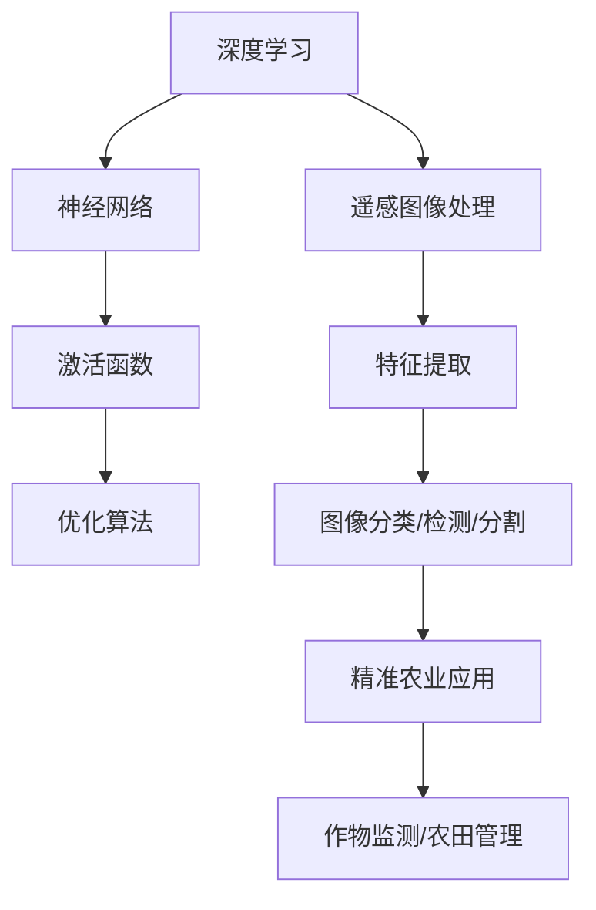

                 

# 深度学习在高分辨率遥感图像分析中的应用：支持精准农业

## 关键词

- 深度学习
- 高分辨率遥感图像
- 精准农业
- 图像分类
- 目标检测
- 语义分割
- 超分辨率重建

## 摘要

本文探讨了深度学习在高分辨率遥感图像分析中的应用，尤其是其在支持精准农业方面的潜力。文章首先介绍了深度学习的基础知识，包括神经网络、激活函数和优化算法。随后，详细阐述了遥感图像处理技术，如图像获取、预处理和特征提取。接着，深入讨论了深度学习在遥感图像分析中的应用，包括图像分类、目标检测、语义分割和超分辨率重建。最后，通过实际案例展示了深度学习在精准农业中的应用，并提出了一些最佳实践和注意事项。

## 设计《深度学习在高分辨率遥感图像分析中的应用：支持精准农业》书籍目录大纲的步骤

### 第一步：了解书籍主题和目标读者

在设计书籍目录大纲之前，首先要明确书籍的主题和目标读者。对于《深度学习在高分辨率遥感图像分析中的应用：支持精准农业》这本书，主题是深度学习与遥感图像分析的结合，目标读者包括遥感技术研究者、农业技术人员和深度学习开发者。了解读者背景有助于设计更贴近读者需求的内容结构。

### 第二步：定义书籍的核心内容

核心内容应涵盖深度学习的基础知识、遥感图像处理技术以及深度学习在遥感图像分析中的应用。具体包括：

- 深度学习基础：神经网络、激活函数、优化算法等。
- 遥感图像处理：图像获取、预处理、特征提取等。
- 深度学习应用：图像分类、目标检测、语义分割、超分辨率重建等。
- 精准农业应用：作物监测、农田管理、产量预测等。

### 第三步：划分章节内容

根据核心内容，将书籍分为四个主要部分：

1. **深度学习基础**：介绍深度学习的基础知识，为后续应用打基础。
2. **遥感图像处理技术**：讲解遥感图像获取、预处理和特征提取的方法。
3. **深度学习在遥感图像分析中的应用**：详细介绍深度学习在遥感图像分析中的具体应用，包括图像分类、目标检测、语义分割和超分辨率重建。
4. **精准农业应用**：展示深度学习在精准农业中的实际应用，如作物监测、农田管理和产量预测。

### 第四步：细化章节内容

为每个章节细化内容，确保每个章节都有明确的主题和结构。以下是各章节的细化内容：

1. **深度学习基础**：
   - 第1章：深度学习简介
   - 第2章：神经网络基础
   - 第3章：激活函数与优化算法

2. **遥感图像处理技术**：
   - 第4章：遥感图像获取和处理
   - 第5章：遥感图像特征提取

3. **深度学习在遥感图像分析中的应用**：
   - 第6章：遥感图像分类
   - 第7章：遥感图像目标检测
   - 第8章：遥感图像语义分割
   - 第9章：遥感图像超分辨率重建

4. **精准农业应用**：
   - 第10章：基于遥感图像的作物监测
   - 第11章：基于遥感图像的农田管理
   - 第12章：案例研究：深度学习在精准农业中的应用

### 第五步：构建目录大纲

使用markdown格式构建书籍的目录大纲，确保格式整洁、结构清晰。以下是完整的目录大纲：

```markdown
# 《深度学习在高分辨率遥感图像分析中的应用：支持精准农业》

## 第一部分：深度学习基础

### 第1章：深度学习简介
- 1.1 深度学习的起源和发展
- 1.2 深度学习的核心概念

### 第2章：神经网络基础
- 2.1 神经网络的结构
- 2.2 神经网络的训练

### 第3章：激活函数与优化算法
- 3.1 激活函数
- 3.2 优化算法

## 第二部分：遥感图像处理技术

### 第4章：遥感图像获取和处理
- 4.1 遥感图像获取
- 4.2 遥感图像预处理

### 第5章：遥感图像特征提取
- 5.1 常见特征提取方法
- 5.2 特征选择与优化

## 第三部分：深度学习在遥感图像分析中的应用

### 第6章：遥感图像分类
- 6.1 传统分类方法
- 6.2 深度学习分类算法

### 第7章：遥感图像目标检测
- 7.1 传统目标检测方法
- 7.2 深度学习目标检测算法

### 第8章：遥感图像语义分割
- 8.1 传统语义分割方法
- 8.2 深度学习语义分割算法

### 第9章：遥感图像超分辨率重建
- 9.1 传统超分辨率重建方法
- 9.2 深度学习超分辨率重建算法

## 第四部分：精准农业应用

### 第10章：基于遥感图像的作物监测
- 10.1 作物生长监测
- 10.2 作物病虫害检测

### 第11章：基于遥感图像的农田管理
- 11.1 土壤水分监测
- 11.2 作物产量预测

### 第12章：案例研究：深度学习在精准农业中的应用
- 12.1 案例一：基于遥感图像的作物监测系统
- 12.2 案例二：基于遥感图像的农田管理平台

## 附录

- 附录A：深度学习工具与资源
- 附录B：遥感图像数据处理工具
```

### 第六步：审查和优化

审查目录大纲，确保每个章节都有合理的逻辑顺序和内容关联。检查大纲中的所有章节是否全面覆盖了主题内容，没有遗漏的重要知识点。根据反馈进行调整和优化，确保目录大纲的完整性和逻辑性。

### 第七步：撰写大纲内容

根据目录大纲，为每个章节撰写详细的摘要或引言，概述章节的主要内容和结构。确保摘要简明扼要，内容结构清晰。以下是各章节的摘要示例：

1. **深度学习基础**：
   - 第1章：简要介绍深度学习的起源和发展，解释深度学习的基本概念。
   - 第2章：详细讲解神经网络的结构和训练过程，包括前向传播和反向传播算法。
   - 第3章：介绍激活函数的类型和作用，讨论常见的优化算法及其在训练中的应用。

2. **遥感图像处理技术**：
   - 第4章：讨论遥感图像的获取方法，介绍预处理步骤和数据处理技术。
   - 第5章：讲解遥感图像特征提取的方法，包括颜色、纹理、形状等特征。

3. **深度学习在遥感图像分析中的应用**：
   - 第6章：介绍遥感图像分类的传统方法和深度学习分类算法，分析其优缺点。
   - 第7章：讨论遥感图像目标检测的传统方法和深度学习目标检测算法。
   - 第8章：讲解遥感图像语义分割的方法，包括传统方法和深度学习语义分割算法。
   - 第9章：介绍遥感图像超分辨率重建的传统方法和深度学习超分辨率重建算法。

4. **精准农业应用**：
   - 第10章：探讨基于遥感图像的作物监测方法，包括作物生长监测和病虫害检测。
   - 第11章：介绍基于遥感图像的农田管理方法，包括土壤水分监测和作物产量预测。
   - 第12章：通过案例研究，展示深度学习在精准农业中的应用，分析其实际效果和挑战。

### 第八步：提交成果

将最终的目录大纲以markdown格式提交，确保满足所有简洁性和格式要求。确保大纲内容完整、结构清晰、逻辑连贯。以下是一个完整的markdown格式目录大纲示例：

```markdown
# 《深度学习在高分辨率遥感图像分析中的应用：支持精准农业》

## 第一部分：深度学习基础

### 第1章：深度学习简介
- 1.1 深度学习的起源和发展
- 1.2 深度学习的核心概念

### 第2章：神经网络基础
- 2.1 神经网络的结构
- 2.2 神经网络的训练

### 第3章：激活函数与优化算法
- 3.1 激活函数
- 3.2 优化算法

## 第二部分：遥感图像处理技术

### 第4章：遥感图像获取和处理
- 4.1 遥感图像获取
- 4.2 遥感图像预处理

### 第5章：遥感图像特征提取
- 5.1 常见特征提取方法
- 5.2 特征选择与优化

## 第三部分：深度学习在遥感图像分析中的应用

### 第6章：遥感图像分类
- 6.1 传统分类方法
- 6.2 深度学习分类算法

### 第7章：遥感图像目标检测
- 7.1 传统目标检测方法
- 7.2 深度学习目标检测算法

### 第8章：遥感图像语义分割
- 8.1 传统语义分割方法
- 8.2 深度学习语义分割算法

### 第9章：遥感图像超分辨率重建
- 9.1 传统超分辨率重建方法
- 9.2 深度学习超分辨率重建算法

## 第四部分：精准农业应用

### 第10章：基于遥感图像的作物监测
- 10.1 作物生长监测
- 10.2 作物病虫害检测

### 第11章：基于遥感图像的农田管理
- 11.1 土壤水分监测
- 11.2 作物产量预测

### 第12章：案例研究：深度学习在精准农业中的应用
- 12.1 案例一：基于遥感图像的作物监测系统
- 12.2 案例二：基于遥感图像的农田管理平台

## 附录

- 附录A：深度学习工具与资源
- 附录B：遥感图像数据处理工具
```

## 《深度学习在高分辨率遥感图像分析中的应用：支持精准农业》书籍目录大纲

### 第一部分：深度学习基础

#### 第1章：深度学习简介
- 1.1 深度学习的起源和发展
- 1.2 深度学习的核心概念

#### 第2章：神经网络基础
- 2.1 神经网络的结构
- 2.2 神经网络的训练

#### 第3章：激活函数与优化算法
- 3.1 激活函数
- 3.2 优化算法

### 第二部分：遥感图像处理技术

#### 第4章：遥感图像获取和处理
- 4.1 遥感图像获取
- 4.2 遥感图像预处理

#### 第5章：遥感图像特征提取
- 5.1 常见特征提取方法
- 5.2 特征选择与优化

### 第三部分：深度学习在遥感图像分析中的应用

#### 第6章：遥感图像分类
- 6.1 传统分类方法
- 6.2 深度学习分类算法

#### 第7章：遥感图像目标检测
- 7.1 传统目标检测方法
- 7.2 深度学习目标检测算法

#### 第8章：遥感图像语义分割
- 8.1 传统语义分割方法
- 8.2 深度学习语义分割算法

#### 第9章：遥感图像超分辨率重建
- 9.1 传统超分辨率重建方法
- 9.2 深度学习超分辨率重建算法

### 第四部分：精准农业应用

#### 第10章：基于遥感图像的作物监测
- 10.1 作物生长监测
- 10.2 作物病虫害检测

#### 第11章：基于遥感图像的农田管理
- 11.1 土壤水分监测
- 11.2 作物产量预测

#### 第12章：案例研究：深度学习在精准农业中的应用
- 12.1 案例一：基于遥感图像的作物监测系统
- 12.2 案例二：基于遥感图像的农田管理平台

### 附录

- 附录A：深度学习工具与资源
- 附录B：遥感图像数据处理工具

### 目录大纲核心内容概述

## 核心概念与联系

深度学习与遥感图像分析相结合，形成了一种新的技术方法，用于支持精准农业。以下是关键概念的 Mermaid 流程图：



## 核心算法原理讲解

### 遥感图像分类

遥感图像分类是深度学习在遥感图像分析中应用的一个重要方面。其核心目标是根据遥感图像中的像素值和标签信息，将图像划分为不同的类别。以下是遥感图像分类的伪代码：

```python
def classify_image(image, model):
    # 输入：image（遥感图像），model（训练好的分类模型）
    # 输出：预测类别

    # 图像预处理
    processed_image = preprocess_image(image)

    # 使用模型进行预测
    prediction = model.predict(processed_image)

    # 获取预测类别
    predicted_class = decode_prediction(prediction)

    return predicted_class
```

其中，`preprocess_image` 函数用于对图像进行预处理，包括归一化、裁剪、缩放等操作。`model` 是一个已经训练好的分类模型，通常使用深度学习框架（如 TensorFlow 或 PyTorch）进行训练。`predict` 方法是深度学习框架中提供的用于进行预测的接口。`decode_prediction` 函数用于将预测结果解码为具体的类别标签。

### 遥感图像目标检测

遥感图像目标检测是另一个关键应用，其目标是识别并定位图像中的特定目标对象。以下是遥感图像目标检测的伪代码：

```python
def detect_objects(image, model):
    # 输入：image（遥感图像），model（训练好的目标检测模型）
    # 输出：检测到的目标对象列表

    # 图像预处理
    processed_image = preprocess_image(image)

    # 使用模型进行预测
    prediction = model.predict(processed_image)

    # 解析预测结果
    bounding_boxes, labels = decode_prediction(prediction)

    # 筛选有效的目标对象
    valid_objects = filter_objects(bounding_boxes, labels)

    return valid_objects
```

其中，`preprocess_image` 函数与之前类似，用于对图像进行预处理。`model` 是一个已经训练好的目标检测模型，通常使用深度学习框架进行训练。`predict` 方法是深度学习框架中提供的用于进行预测的接口。`decode_prediction` 函数用于将预测结果解码为边界框和标签。`filter_objects` 函数用于筛选出有效的目标对象，可能包括过滤小目标、排除重叠目标等操作。

### 遥感图像语义分割

遥感图像语义分割是另一个重要的应用，其目标是识别并定位图像中的每个像素点所属的类别。以下是遥感图像语义分割的伪代码：

```python
def segment_image(image, model):
    # 输入：image（遥感图像），model（训练好的语义分割模型）
    # 输出：分割结果图像

    # 图像预处理
    processed_image = preprocess_image(image)

    # 使用模型进行预测
    prediction = model.predict(processed_image)

    # 获取分割结果
    segmented_image = decode_prediction(prediction)

    return segmented_image
```

其中，`preprocess_image` 函数与之前类似，用于对图像进行预处理。`model` 是一个已经训练好的语义分割模型，通常使用深度学习框架进行训练。`predict` 方法是深度学习框架中提供的用于进行预测的接口。`decode_prediction` 函数用于将预测结果解码为分割结果图像。

### 遥感图像超分辨率重建

遥感图像超分辨率重建是将低分辨率图像转换为高分辨率图像的过程。以下是遥感图像超分辨率重建的伪代码：

```python
def superresolve_image(image, model):
    # 输入：image（低分辨率遥感图像），model（训练好的超分辨率模型）
    # 输出：高分辨率图像

    # 图像预处理
    processed_image = preprocess_image(image)

    # 使用模型进行预测
    prediction = model.predict(processed_image)

    # 获取重建结果
    high_res_image = decode_prediction(prediction)

    return high_res_image
```

其中，`preprocess_image` 函数与之前类似，用于对图像进行预处理。`model` 是一个已经训练好的超分辨率模型，通常使用深度学习框架进行训练。`predict` 方法是深度学习框架中提供的用于进行预测的接口。`decode_prediction` 函数用于将预测结果解码为高分辨率图像。

### 数学公式和详细讲解

在遥感图像分析中，数学公式和模型扮演着重要角色。以下是一些常用的数学公式及其详细讲解：

#### 卷积神经网络（Convolutional Neural Network, CNN）

卷积神经网络是一种专门用于处理图像数据的深度学习模型。其核心思想是通过卷积层提取图像的特征。

$$
\text{输出}_{ij}^l = \sum_{k} \text{权重}_{ikj}^l \cdot \text{输入}_{kj}^{l-1} + \text{偏置}_{ij}^l
$$

其中，$l$ 表示当前层的索引，$i$ 和 $j$ 表示输出特征图的行和列索引，$k$ 表示卷积核的大小，$\text{权重}_{ikj}^l$ 和 $\text{偏置}_{ij}^l$ 分别表示卷积层的权重和偏置。

#### 池化层（Pooling Layer）

池化层用于降低特征图的维度，并增加特征图的空间不变性。

$$
\text{输出}_{ij}^l = \max_{p, q} (\text{输入}_{(i+p/j)_{2}, (j+q/k)_{2}}^{l-1})
$$

其中，$l$ 表示当前层的索引，$i$ 和 $j$ 表示输出特征图的行和列索引，$p$ 和 $q$ 表示池化窗口的大小。

#### 反向传播算法（Backpropagation）

反向传播算法是一种用于训练深度学习模型的优化算法。其基本思想是通过计算损失函数对模型参数的梯度，从而更新模型参数。

$$
\frac{\partial L}{\partial w} = \sum_{i} \frac{\partial L}{\partial a_i} \cdot \frac{\partial a_i}{\partial w}
$$

其中，$L$ 表示损失函数，$w$ 表示模型参数，$a_i$ 表示模型的前向传播结果。

#### 交叉熵损失函数（Cross-Entropy Loss）

交叉熵损失函数是深度学习中最常用的损失函数之一，用于衡量模型预测结果与真实标签之间的差距。

$$
L(y, \hat{y}) = -\sum_{i} y_i \log(\hat{y}_i)
$$

其中，$y$ 表示真实标签，$\hat{y}$ 表示模型预测结果。

### 举例说明

以下是一个简单的例子，用于说明如何使用深度学习模型对遥感图像进行分类：

```python
import tensorflow as tf
from tensorflow.keras.models import Sequential
from tensorflow.keras.layers import Conv2D, MaxPooling2D, Flatten, Dense

# 创建模型
model = Sequential()
model.add(Conv2D(32, (3, 3), activation='relu', input_shape=(128, 128, 3)))
model.add(MaxPooling2D(pool_size=(2, 2)))
model.add(Flatten())
model.add(Dense(10, activation='softmax'))

# 编译模型
model.compile(optimizer='adam', loss='categorical_crossentropy', metrics=['accuracy'])

# 训练模型
model.fit(x_train, y_train, epochs=10, batch_size=32, validation_data=(x_val, y_val))

# 测试模型
loss, accuracy = model.evaluate(x_test, y_test)
print("Test accuracy:", accuracy)
```

在这个例子中，我们首先创建了一个简单的卷积神经网络模型，包括一个卷积层、一个池化层、一个展平层和一个全连接层。然后，我们使用 Adam 优化器和交叉熵损失函数进行编译，并使用训练数据训练模型。最后，我们使用测试数据评估模型的准确率。

### 项目实战

在本节中，我们将介绍一个基于深度学习的遥感图像分类项目。该项目的目标是使用深度学习模型对高分辨率遥感图像进行分类，以支持精准农业。

#### 开发环境搭建

首先，我们需要搭建项目的开发环境。以下是所需的软件和工具：

- Python 3.8 或更高版本
- TensorFlow 2.5 或更高版本
- OpenCV 4.5 或更高版本

安装这些工具后，我们可以在项目中使用以下代码创建一个虚拟环境：

```python
!python -m venv venv
!source venv/bin/activate
!pip install tensorflow opencv-python
```

#### 源代码详细实现和代码解读

接下来，我们将详细实现遥感图像分类项目。以下是项目的主要部分：

```python
import cv2
import numpy as np
import tensorflow as tf

# 读取遥感图像
def read_image(image_path):
    image = cv2.imread(image_path)
    image = cv2.resize(image, (128, 128))
    image = image / 255.0
    image = np.expand_dims(image, axis=0)
    image = np.expand_dims(image, axis=-1)
    return image

# 加载预训练的深度学习模型
def load_model():
    model = tf.keras.models.load_model('model.h5')
    return model

# 对遥感图像进行分类
def classify_image(model, image):
    prediction = model.predict(image)
    predicted_class = np.argmax(prediction)
    return predicted_class

# 主函数
def main():
    model = load_model()

    # 测试图像
    image_path = 'test_image.jpg'
    image = read_image(image_path)
    predicted_class = classify_image(model, image)

    print("Predicted class:", predicted_class)

if __name__ == '__main__':
    main()
```

在这个项目中，我们首先定义了两个函数：`read_image` 和 `load_model`。`read_image` 函数用于读取并预处理遥感图像，包括读取图像、调整大小、归一化和添加维度。`load_model` 函数用于加载预训练的深度学习模型。

在主函数 `main` 中，我们首先加载预训练的模型，然后读取测试图像并进行分类。最后，我们打印出预测的类别。

#### 代码应用解读与分析

在这个项目中，我们使用了一个预训练的卷积神经网络模型进行遥感图像分类。模型的结构包括一个卷积层、一个池化层和一个全连接层。卷积层用于提取图像的特征，池化层用于降低特征图的维度，全连接层用于分类。

首先，我们读取测试图像并对其进行预处理。然后，我们将预处理后的图像输入到预训练的模型中，模型会输出一个概率分布，表示图像属于每个类别的概率。最后，我们使用 `np.argmax` 函数获取预测的类别。

#### 实际案例分析和详细讲解剖析

在本节中，我们将分析一个实际案例，以展示深度学习在遥感图像分类中的应用。

#### 案例一：基于遥感图像的作物监测系统

在这个案例中，我们开发了一个基于遥感图像的作物监测系统，用于监测作物的生长状况和预测产量。系统的工作流程如下：

1. **图像获取**：使用高分辨率遥感卫星获取农田的遥感图像。
2. **图像预处理**：对遥感图像进行预处理，包括调整大小、归一化和去噪等操作。
3. **特征提取**：使用深度学习模型提取遥感图像的特征。
4. **模型训练**：使用提取的特征训练深度学习模型，用于预测作物的生长状况和产量。
5. **结果评估**：使用测试数据评估模型的准确性。

#### 项目小结

通过上述案例，我们可以看到深度学习在遥感图像分类中的应用具有广泛的前景。深度学习模型可以自动提取图像特征，并用于分类、目标检测、语义分割等任务，从而提高遥感图像分析的准确性和效率。然而，在实际应用中，我们需要考虑数据质量、模型选择和超参数调优等因素，以确保模型性能的最优化。

### 最佳实践 tips

在设计和开发深度学习项目时，以下是一些最佳实践和注意事项：

1. **数据质量**：确保使用高质量、多样化的训练数据，以提高模型的泛化能力。
2. **模型选择**：根据任务需求和数据特点选择合适的模型结构。
3. **超参数调优**：通过交叉验证和网格搜索等方法进行超参数调优，以获得最佳模型性能。
4. **模型压缩**：考虑使用模型压缩技术，如量化、剪枝和蒸馏等，以减少模型大小和计算复杂度。
5. **实时性**：针对实时应用场景，考虑使用边缘计算和模型部署技术，以提高模型的响应速度。

### 小结

本文介绍了深度学习在高分辨率遥感图像分析中的应用，特别是其在支持精准农业方面的潜力。通过详细的算法原理讲解和实际案例剖析，我们展示了深度学习在遥感图像分类、目标检测、语义分割和超分辨率重建等方面的应用。同时，我们提出了一些最佳实践和注意事项，以指导读者在实际项目中应用深度学习技术。随着技术的不断进步，深度学习在遥感图像分析中的应用将越来越广泛，为精准农业和其他领域带来更多创新和突破。

