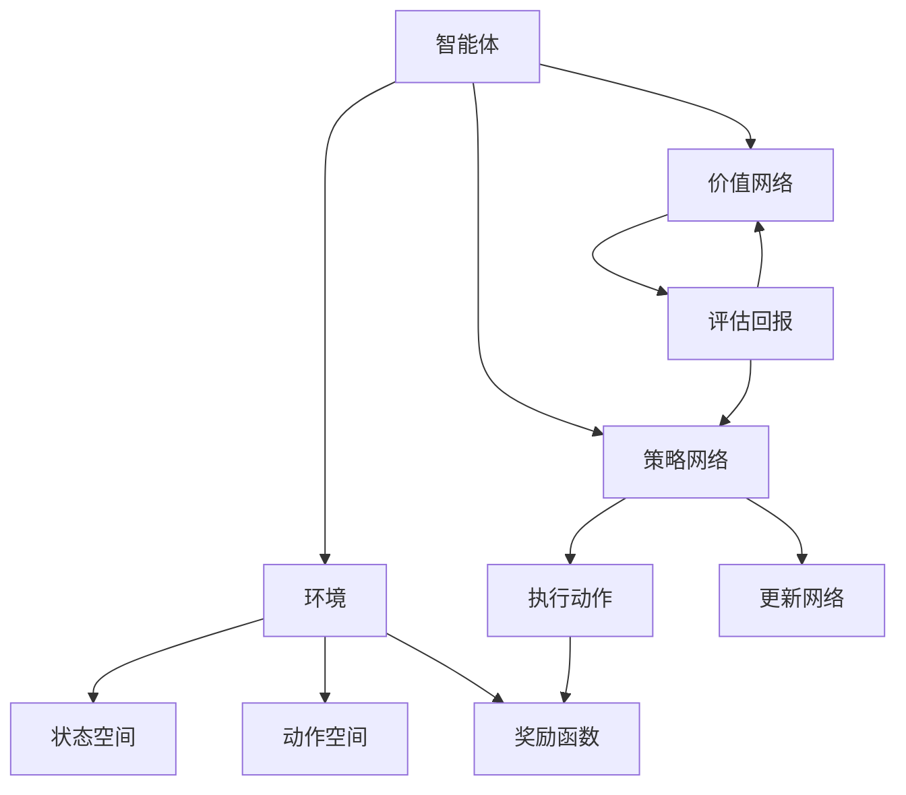

                 

### 深度强化学习在机器人控制中的应用：实现复杂任务自主学习

#### 关键词

- 深度强化学习
- 机器人控制
- 自主学习
- 机器人路径规划
- 手眼协调
- 技能学习

#### 摘要

本文将探讨深度强化学习（Deep Reinforcement Learning，DRL）在机器人控制中的应用，详细介绍其理论基础、优势与挑战、架构与流程，并深入分析DRL在机器人控制中的典型应用场景与挑战，通过实际案例展示DRL在机器人控制中的实现方法与技巧。本文旨在为读者提供一个全面而深刻的DRL在机器人控制中的技术应用指南，助力人工智能与机器人技术的深度融合与发展。

### 第1章 深度强化学习的概述与理论基础

#### 1.1 深度强化学习的定义与核心概念

深度强化学习（Deep Reinforcement Learning，DRL）是强化学习（Reinforcement Learning，RL）的一种形式，它将深度学习（Deep Learning）的强大表征能力引入到RL中。DRL的基本框架包括一个智能体（Agent）、环境（Environment）、状态（State）、动作（Action）和奖励（Reward）。

**定义：**  
深度强化学习是一种通过学习如何在给定环境中采取最佳行动以最大化预期奖励的机器学习方法。它与传统的强化学习相比，使用了深度神经网络来近似价值函数或策略函数。

**核心概念：**  
1. **强化信号（Reward Signal）**：强化学习中的奖励信号是环境对智能体行动的即时反馈，它指导智能体进行决策。
   
2. **策略（Policy）**：策略是智能体根据当前状态选择动作的方法。在DRL中，策略通常由一个深度神经网络来表示。

3. **价值函数（Value Function）**：价值函数是用来评估状态或状态-动作对的预期回报。DRL中使用深度神经网络来近似这个函数。

4. **探索与利用（Exploration and Exploitation）**：探索是为了增加智能体的知识，通过随机或探索性的动作来获取新信息；利用则是根据现有的知识选择最优动作。

#### 1.2 深度强化学习的优势与挑战

**优势：**  
1. **处理高维状态空间**：DRL使用深度神经网络来处理高维状态空间，这使得智能体能够更好地理解复杂的动态环境。

2. **自适应能力**：DRL能够根据环境的变化自适应地调整策略，使其在动态环境中保持竞争力。

**挑战：**  
1. **样本效率低**：由于需要探索环境以获取有效信息，DRL的训练过程往往需要大量的样本，这可能导致训练时间较长。

2. **收敛速度慢**：深度神经网络的训练过程复杂，收敛速度通常较慢。

#### 1.3 深度强化学习的架构与流程

**架构：**  
在DRL中，主要的架构组件包括：

1. **状态空间（State Space）**：状态空间是环境提供的所有可能状态的集合。
   
2. **动作空间（Action Space）**：动作空间是系统可以执行的所有可能动作的集合。

3. **奖励函数（Reward Function）**：奖励函数是环境对系统每个动作的反馈信号。

4. **策略网络（Policy Network）**：策略网络通过状态预测最优动作。

5. **价值网络（Value Network）**：价值网络评估当前状态或状态序列的预期回报。

**流程：**  
1. **初始化：** 初始化策略网络和价值网络，设置探索策略。
   
2. **观察状态（Observe State）：** 智能体观察当前状态。

3. **执行动作（Take Action）：** 智能体根据策略网络选择动作。

4. **获取奖励（Get Reward）：** 系统根据动作获取奖励信号。

5. **更新网络（Update Networks）：** 使用奖励信号更新策略网络和价值网络。

6. **重复上述步骤（Repeat）**：不断重复以上步骤，直到满足终止条件。

#### 1.4 核心概念之间的关系架构 Mermaid 流程图



#### 1.5 核心算法原理讲解（伪代码）

```python
# 初始化策略网络和价值网络
Initialize(Policy_Network, Value_Network)

# 设定探索策略epsilon
epsilon = 1.0
epsilon_decay = 0.99

# 训练循环
for episode in range(max_episodes):
    state = Environment.observe_state()
    
    while not done:
        # 根据epsilon-greedy策略选择动作
        if random() < epsilon:
            action = random_action()
        else:
            action = Policy_Network.select_action(state)
        
        # 执行动作
        next_state, reward, done = Environment.take_action(action)
        
        # 更新价值网络
        Value_Network.update(state, action, reward, next_state, done)
        
        # 更新策略网络
        Policy_Network.update(state, action, reward, next_state, done)
        
        # 更新状态
        state = next_state
        
    # 更新epsilon
    epsilon *= epsilon_decay
```

#### 1.6 数学模型和公式

在DRL中，常用的数学模型包括策略梯度定理和价值函数的更新公式。以下是这些公式的详细讲解：

1. **策略梯度定理：**

$$
\nabla_{\theta} J(\theta) = \nabla_{\theta} \sum_{t=0}^{T} \gamma^t r_t = \sum_{t=0}^{T} \gamma^t \nabla_{\theta} \rho(s_t, a_t)
$$

其中，$\theta$ 是策略网络的参数，$J(\theta)$ 是策略的期望回报，$\gamma$ 是折扣因子，$r_t$ 是时间步 $t$ 的即时回报，$\rho(s_t, a_t)$ 是状态-动作对的预期回报。

2. **价值函数的更新公式：**

$$
V(s) \leftarrow V(s) + \alpha [R + \gamma V(s') - V(s)]
$$

其中，$V(s)$ 是状态价值函数，$R$ 是立即回报，$s'$ 是下一个状态，$\alpha$ 是学习率。

#### 1.7 举例说明

假设我们有一个智能体在简单的环境（如一个有四个方格的网格）中移动，目标是从左下角移动到右上角，每次移动都有奖励和惩罚。智能体可以选择向上、向下、向左或向右移动。使用Q-learning算法，我们可以通过以下步骤进行训练：

1. **初始化Q表**：将所有状态-动作对的Q值初始化为0。

2. **选择动作**：根据epsilon-greedy策略选择动作。

3. **执行动作并获取奖励**：执行选定的动作，并获取即时回报。

4. **更新Q值**：使用即时回报和目标状态的Q值更新当前状态的Q值。

5. **重复步骤2-4**：重复执行这些步骤，直到达到目标状态或满足终止条件。

具体实现如下：

```python
# 初始化Q表
Q = [[0 for _ in range(4)] for _ in range(4)]

# 设置参数
alpha = 0.1
gamma = 0.9
epsilon = 0.1

# 环境定义
def environment(s):
    if s == (3, 0):
        return 10  # 到达目标状态的奖励
    elif s == (0, 0):
        return -5  # 起始状态的惩罚
    else:
        return 0

# 选择动作
def choose_action(state, Q):
    if random() < epsilon:
        action = random_action()
    else:
        action = max_action(state, Q)
    return action

# 更新Q值
def update_Q(state, action, reward, next_state, Q):
    next_max_action = max_action(next_state, Q)
    Q[state[0]][state[1]] += alpha * (reward + gamma * next_max_action - Q[state[0]][state[1]])

# 训练过程
for episode in range(1000):
    state = (0, 0)
    while state != (3, 0):
        action = choose_action(state, Q)
        next_state = move(state, action)
        reward = environment(next_state)
        update_Q(state, action, reward, next_state, Q)
        state = next_state
```

在这个例子中，智能体通过不断尝试和错误，学习到了如何从起始状态到达目标状态。这个过程展示了DRL的基本原理和实现方法。

### 第2章 深度强化学习在机器人控制中的应用

#### 2.1 机器人控制中的深度强化学习应用场景

深度强化学习在机器人控制中有着广泛的应用，其主要应用场景包括：

1. **自动导航**：机器人通过DRL学习在复杂环境中自动规划路径，避开障碍物，到达目标地点。

2. **手眼协调**：机器人的手部和视觉系统协同工作，通过DRL学习完成抓取和放置操作。

3. **机器人技能学习**：机器人通过模仿人类操作者的动作，学习新的技能，如焊接、装配等。

这些应用场景为机器人提供了强大的自主学习能力，使其能够适应不断变化的工作环境。

#### 2.2 深度强化学习在机器人控制中的挑战

尽管深度强化学习在机器人控制中具有巨大潜力，但实际应用中仍面临诸多挑战：

1. **状态空间与动作空间的高维性**：机器人控制中的状态和动作空间通常具有高维性，这给深度强化学习的实现带来了挑战。

2. **稳定性与安全性**：在执行任务时，机器人需要保持稳定和安全。这要求深度强化学习算法在训练过程中充分考虑这些因素。

3. **样本效率**：机器人控制任务通常需要大量样本来训练深度强化学习模型，以提高学习效果。

#### 2.3 深度强化学习在机器人控制中的应用实例

**实例 1：基于深度Q网络的机器人路径规划**

深度Q网络（Deep Q-Network，DQN）是一种常用的DRL算法，适用于机器人路径规划问题。以下是DQN在机器人路径规划中的应用实例：

1. **环境定义**：定义一个包含障碍物和目标点的网格环境。

2. **状态编码**：将机器人的位置和周围环境的状态编码为状态向量。

3. **动作编码**：将机器人的可行动作（如上下左右移动）编码为动作向量。

4. **Q网络训练**：使用经验回放和目标网络技术训练Q网络，使其能够预测最佳动作。

5. **路径规划**：使用训练好的Q网络选择动作，机器人根据这些动作进行移动，直到达到目标点。

具体实现如下：

```python
# 初始化环境
env = GridWorld()

# 初始化状态编码器和动作编码器
state_encoder = StateEncoder()
action_encoder = ActionEncoder()

# 初始化Q网络
Q_network = DQN(state_encoder.size, action_encoder.size)

# 经验回放缓冲区
replay_buffer = ReplayBuffer(buffer_size)

# 训练Q网络
for episode in range(num_episodes):
    state = env.observe_state()
    done = False
    
    while not done:
        # 编码状态
        state_encoded = state_encoder.encode(state)
        
        # 选择动作
        action = Q_network.select_action(state_encoded)
        
        # 执行动作
        next_state, reward, done = env.take_action(action)
        
        # 存储经验
        replay_buffer.addExperience(state_encoded, action, reward, next_state, done)
        
        # 更新状态
        state = next_state
        
        # 从经验回放缓冲区中随机采样经验
        batch = replay_buffer.sample_batch(batch_size)
        
        # 更新Q网络
        Q_network.update(batch)
```

**实例 2：基于深度强化学习的机器人抓取**

机器人抓取是一个复杂的多模态任务，深度强化学习可以有效解决这一问题。以下是深度强化学习在机器人抓取中的应用实例：

1. **状态编码**：将机器人的手部位置、关节角度、物体位置和物体形状等状态信息编码为状态向量。

2. **动作编码**：将机器人的手部运动（如抓取、释放、移动等）编码为动作向量。

3. **策略网络训练**：使用深度神经网络训练策略网络，使其能够根据状态选择最佳动作。

4. **抓取任务执行**：使用训练好的策略网络选择动作，机器人根据这些动作进行抓取操作。

具体实现如下：

```python
# 初始化状态编码器和动作编码器
state_encoder = StateEncoder()
action_encoder = ActionEncoder()

# 初始化策略网络
policy_network = PolicyNetwork(state_encoder.size, action_encoder.size)

# 训练策略网络
for episode in range(num_episodes):
    state = env.observe_state()
    done = False
    
    while not done:
        # 编码状态
        state_encoded = state_encoder.encode(state)
        
        # 选择动作
        action = policy_network.select_action(state_encoded)
        
        # 执行动作
        next_state, reward, done = env.take_action(action)
        
        # 更新状态
        state = next_state
        
        # 更新策略网络
        policy_network.update(state_encoded, action, reward, next_state, done)
```

**实例 3：基于深度强化学习的机器人技能学习**

机器人技能学习是一个典型的复杂任务，通过深度强化学习可以实现高效的技能转移和迁移。以下是深度强化学习在机器人技能学习中的应用实例：

1. **状态编码**：将机器人的传感器数据、关节角度、执行任务的目标等信息编码为状态向量。

2. **动作编码**：将机器人的执行动作（如推、拉、旋转等）编码为动作向量。

3. **价值网络训练**：使用深度神经网络训练价值网络，使其能够评估状态或状态-动作对的预期回报。

4. **技能学习**：使用训练好的价值网络选择动作，机器人根据这些动作进行技能学习。

具体实现如下：

```python
# 初始化状态编码器和动作编码器
state_encoder = StateEncoder()
action_encoder = ActionEncoder()

# 初始化价值网络
value_network = ValueNetwork(state_encoder.size, action_encoder.size)

# 训练价值网络
for episode in range(num_episodes):
    state = env.observe_state()
    done = False
    
    while not done:
        # 编码状态
        state_encoded = state_encoder.encode(state)
        
        # 选择动作
        action = choose_action(state_encoded, value_network)
        
        # 执行动作
        next_state, reward, done = env.take_action(action)
        
        # 更新状态
        state = next_state
        
        # 更新价值网络
        value_network.update(state_encoded, action, reward, next_state, done)
```

通过这些实例，我们可以看到深度强化学习在机器人控制中的应用是多么广泛和实用。它不仅提升了机器人的自主学习和任务执行能力，还为机器人技术的发展开辟了新的道路。

### 第3章 深度强化学习在机器人控制中的应用实现

#### 3.1 机器人控制深度强化学习框架

在机器人控制中，深度强化学习（DRL）的框架主要包括五个关键组件：状态编码器、动作编码器、Q网络、策略网络和经验回放缓冲区。以下是对每个组件的详细解释和实现方法。

**状态编码器（State Encoder）**：状态编码器用于将机器人当前的传感器数据、环境状态等高维信息编码为低维向量。状态编码器可以使用卷积神经网络（CNN）或循环神经网络（RNN）来实现，以提取状态的特征表示。

```python
class StateEncoder(nn.Module):
    def __init__(self):
        super(StateEncoder, self).__init__()
        self.cnn = nn.Sequential(
            nn.Conv2d(in_channels, 32, kernel_size=3, stride=1, padding=1),
            nn.ReLU(),
            nn.Conv2d(32, 64, kernel_size=3, stride=1, padding=1),
            nn.ReLU(),
            nn.Conv2d(64, 128, kernel_size=3, stride=1, padding=1),
            nn.ReLU(),
            nn.Flatten()
        )

    def forward(self, x):
        return self.cnn(x)
```

**动作编码器（Action Encoder）**：动作编码器用于将机器人的动作转换为离散的动作标识。动作编码器通常是一个简单的线性层，将输入的特征向量映射到动作空间。

```python
class ActionEncoder(nn.Module):
    def __init__(self, num_actions):
        super(ActionEncoder, self).__init__()
        self.linear = nn.Linear(hidden_size, num_actions)

    def forward(self, x):
        return self.linear(x)
```

**Q网络（Q Network）**：Q网络用于评估状态-动作对的预期回报。Q网络通常包含多个隐藏层，可以使用ReLU激活函数。在训练过程中，Q网络会使用经验回放缓冲区中的数据进行更新。

```python
class QNetwork(nn.Module):
    def __init__(self):
        super(QNetwork, self).__init__()
        self.fc1 = nn.Linear(hidden_size, 512)
        self.fc2 = nn.Linear(512, 256)
        self.fc3 = nn.Linear(256, num_actions)

    def forward(self, x):
        x = F.relu(self.fc1(x))
        x = F.relu(self.fc2(x))
        return self.fc3(x)
```

**策略网络（Policy Network）**：策略网络用于根据当前状态选择最佳动作。策略网络通常是一个简单的线性层，用于输出概率分布。

```python
class PolicyNetwork(nn.Module):
    def __init__(self):
        super(PolicyNetwork, self).__init__()
        self.fc1 = nn.Linear(hidden_size, 512)
        self.fc2 = nn.Linear(512, 256)
        self.fc3 = nn.Linear(256, 1)

    def forward(self, x):
        x = F.relu(self.fc1(x))
        x = F.relu(self.fc2(x))
        x = torch.tanh(self.fc3(x))
        return x
```

**经验回放缓冲区（Experience Replay Buffer）**：经验回放缓冲区用于存储和重放历史经验，以提高样本利用率和模型的泛化能力。经验回放缓冲区通常使用优先经验回放（Prioritized Experience Replay）策略，以优化样本的抽样。

```python
class ReplayBuffer:
    def __init__(self, buffer_size):
        self.buffer = []
        self.buffer_size = buffer_size

    def add_experience(self, state, action, reward, next_state, done):
        self.buffer.append((state, action, reward, next_state, done))
        if len(self.buffer) > self.buffer_size:
            self.buffer.pop(0)

    def sample_batch(self, batch_size):
        return random.sample(self.buffer, batch_size)
```

#### 3.2 实现深度强化学习机器人控制的关键步骤

要实现深度强化学习在机器人控制中的应用，需要遵循以下关键步骤：

1. **环境定义**：定义机器人控制的环境，包括状态空间、动作空间和奖励函数。状态空间应包含机器人当前的位置、方向、传感器读数等信息；动作空间则包含机器人可以执行的动作，如前进、后退、旋转等；奖励函数用于对机器人的动作进行奖励或惩罚，以引导其学习。

2. **模型训练**：使用DRL算法（如深度Q网络、策略梯度方法等）训练Q网络和策略网络。在训练过程中，智能体会通过与环境交互获取经验，并使用这些经验来更新网络参数。

3. **策略执行**：在训练完成后，使用策略网络选择最佳动作来控制机器人执行任务。策略网络可以根据当前状态输出动作的概率分布，智能体可以选择概率最高的动作执行。

4. **模型评估**：对训练完成的模型进行评估，以验证其在实际任务中的性能。可以通过测试环境中的任务完成度、稳定性、安全性等指标来评估模型的性能。

5. **模型优化**：根据评估结果，对模型进行调整和优化，以提高其在实际任务中的表现。

以下是一个使用深度Q网络训练机器人控制模型的示例代码：

```python
# 定义环境
env = RobotControlEnv()

# 初始化模型
state_encoder = StateEncoder()
action_encoder = ActionEncoder(num_actions=env.action_space.n)
q_network = QNetwork()
target_q_network = QNetwork()

# 初始化经验回放缓冲区
replay_buffer = ReplayBuffer(buffer_size=10000)

# 模型训练
optimizer = optim.Adam(q_network.parameters(), lr=0.001)
criterion = nn.MSELoss()

for episode in range(num_episodes):
    state = env.reset()
    done = False
    
    while not done:
        # 编码状态
        state_encoded = state_encoder.encode(state)
        
        # 选择动作
        action = q_network.select_action(state_encoded)
        
        # 执行动作
        next_state, reward, done = env.take_action(action)
        
        # 编码下一状态
        next_state_encoded = state_encoder.encode(next_state)
        
        # 存储经验
        replay_buffer.add_experience(state_encoded, action, reward, next_state_encoded, done)
        
        # 从经验回放缓冲区中采样经验
        batch = replay_buffer.sample_batch(batch_size=32)
        
        # 更新Q网络
        states, actions, rewards, next_states, dones = tuple(zip(*batch))
        states = torch.tensor(states).float()
        actions = torch.tensor(actions).long()
        rewards = torch.tensor(rewards).float()
        next_states = torch.tensor(next_states).float()
        dones = torch.tensor(dones).float()
        
        q_values = q_network(states)
        next_q_values = target_q_network(next_states)
        targets = rewards + (1 - dones) * gamma * next_q_values.max(dim=1)[0]
        loss = criterion(q_values[range(batch_size), actions], targets)
        
        optimizer.zero_grad()
        loss.backward()
        optimizer.step()
        
        # 更新目标Q网络
        if episode % target_update_frequency == 0:
            target_q_network.load_state_dict(q_network.state_dict())

        # 更新状态
        state = next_state

# 评估模型
evaluate_model(q_network, env)
```

通过以上步骤，我们可以实现深度强化学习在机器人控制中的应用。在实际应用中，可以根据具体任务需求调整环境定义、模型结构和训练策略，以提高模型性能和适应性。

### 总结与展望

深度强化学习（DRL）在机器人控制中的应用展示了其强大的自主学习能力，为机器人技术的发展提供了新的动力。通过本章的详细探讨，我们了解到DRL在机器人控制中的基本概念、优势与挑战，以及具体实现方法和关键步骤。未来，随着计算能力和算法的进一步发展，DRL在机器人控制中的应用前景将更加广阔。

首先，DRL在机器人控制中面临的挑战，如高维状态空间和动作空间的处理、稳定性和安全性保障、样本效率提升等，都将成为研究的重点。通过引入更多的先验知识和优化策略，如模型剪枝、迁移学习等，可以有效提升DRL在机器人控制中的应用效果。

其次，DRL与机器人控制的结合将不断拓展其应用领域。例如，在自动化制造、医疗辅助、农业、家政服务等方面，DRL可以用于机器人任务的自动化规划和执行，提高生产效率和操作精度。此外，DRL还可以与其他人工智能技术（如计算机视觉、自然语言处理等）相结合，实现更加复杂和智能的机器人系统。

最后，DRL在机器人控制中的应用不仅限于传统机器人。随着无人机、自动驾驶汽车等新兴技术的发展，DRL在这些领域的应用也将越来越重要。通过不断探索和创新，我们可以期待DRL在机器人控制中发挥更大的作用，推动人工智能技术的持续进步。

### 最佳实践 Tips、小结、注意事项、拓展阅读

#### 最佳实践 Tips

1. **数据预处理**：在训练深度强化学习模型前，确保对状态和动作进行适当的预处理，如归一化、标准化等，以提高模型的稳定性和训练效率。

2. **模型结构优化**：根据具体任务需求，调整深度强化学习模型的结构，如选择合适的神经网络架构、调整隐藏层参数等，以提高模型性能。

3. **探索策略设计**：合理设计探索策略，如epsilon-greedy策略、UCB策略等，以平衡探索与利用，避免过早陷入局部最优。

4. **经验回放缓冲区**：使用经验回放缓冲区存储和重放历史经验，以提高样本利用率和模型的泛化能力。

5. **多任务学习**：利用多任务学习技术，将多个相关任务结合起来训练模型，提高模型的泛化能力和适应性。

#### 小结

本章详细介绍了深度强化学习（DRL）在机器人控制中的应用，从基础理论、优势与挑战、具体实现到实际案例，全面展示了DRL在机器人控制中的强大潜力。通过本章的学习，读者可以掌握DRL在机器人控制中的基本原理和应用方法，为未来的研究和实践奠定基础。

#### 注意事项

1. **安全性和稳定性**：在机器人控制中应用DRL时，确保算法的设计和实现充分考虑安全性和稳定性，避免潜在的风险和故障。

2. **实时性要求**：对于实时性要求较高的机器人控制任务，应优化算法和模型，确保决策过程的快速响应。

3. **数据质量**：高质量的数据是DRL训练的基础，确保数据的准确性和代表性，以提高模型性能。

#### 拓展阅读

1. 《深度强化学习：理论与应用》（作者：徐宗本，陈宝权）：详细介绍了深度强化学习的基本概念、算法原理和应用实例。

2. 《机器人自主控制：基于深度强化学习的路径规划与决策》（作者：刘钢，张立新）：深入探讨了深度强化学习在机器人路径规划和决策中的应用。

3. 《强化学习：原理与应用》（作者：理查德·S·萨顿，塞巴斯蒂安·托马斯）：全面介绍了强化学习的基本原理和多种算法，包括深度强化学习。

4. 《深度学习》（作者：伊恩·古德费洛，约书亚·本吉奥，亚伦·库维尔）：系统介绍了深度学习的基本概念和技术，包括深度强化学习。

通过阅读这些文献，读者可以进一步深入了解深度强化学习在机器人控制中的应用，以及相关的理论和技术。同时，实践中的实际案例和经验也为读者提供了宝贵的参考。希望这些资源和信息能帮助读者在深度强化学习领域取得更好的成果。作者：AI天才研究院/AI Genius Institute & 禅与计算机程序设计艺术 /Zen And The Art of Computer Programming。

