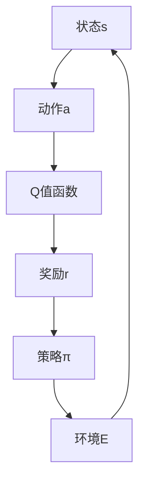
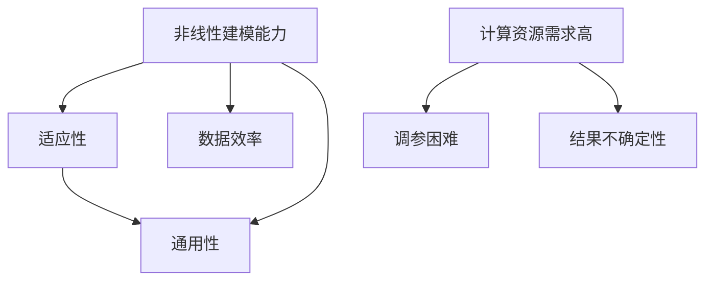
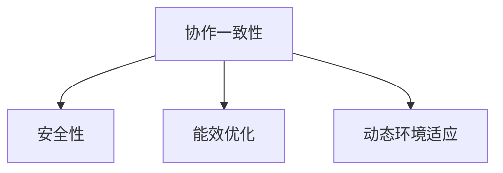
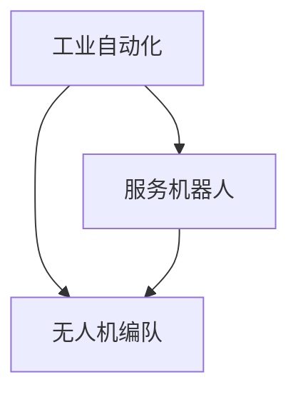
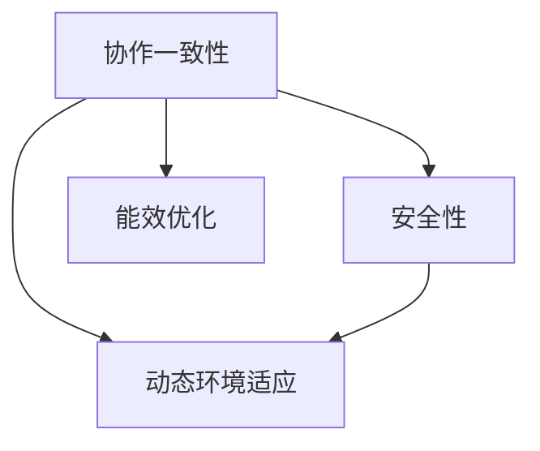
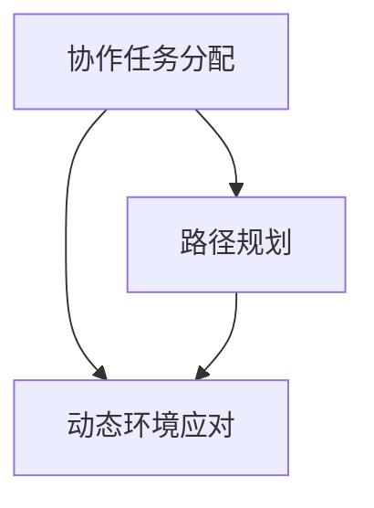
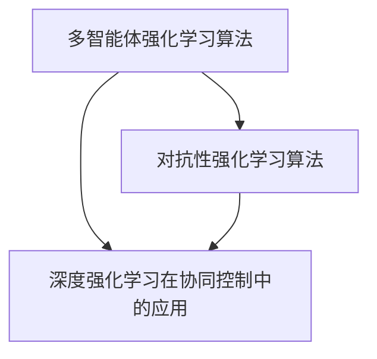
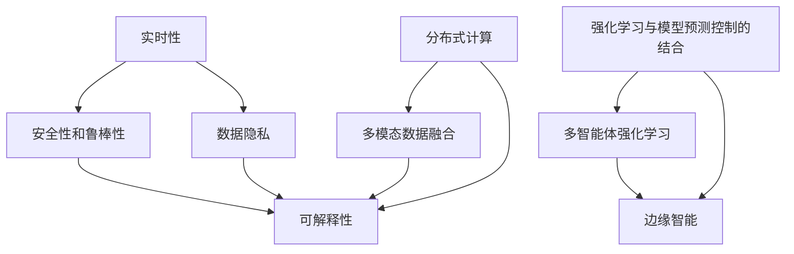

                 

### 文章标题：《深度强化学习在机器人群体协作中的应用》

#### 关键词：深度强化学习、机器人群体协作、多智能体系统、强化学习算法、协作优化

#### 摘要：
本文旨在探讨深度强化学习在机器人群体协作中的应用。深度强化学习作为一种先进的人工智能技术，在解决复杂决策问题时具有显著优势。本文首先介绍了深度强化学习的基础概念和原理，然后详细分析了机器人群体协作的背景和挑战。接着，本文讨论了如何将深度强化学习应用于机器人群体协作，包括协作任务分配、路径规划和动态环境应对等方面的应用实例。最后，本文对深度强化学习在机器人群体协作中的未来发展趋势进行了展望，并提出了相关的实践建议。

### 目录大纲：

#### 第一部分：深度强化学习基础

#### 第1章：深度强化学习基本概念

1.1 深度强化学习的定义与特点

1.2 深度强化学习的数学模型

1.3 常见的深度强化学习算法

#### 第2章：深度强化学习算法原理

2.1 Q-learning算法原理

2.2 SARSA算法原理

2.3 Deep Q Network算法原理

#### 第3章：深度强化学习的优缺点和应用场景

3.1 深度强化学习的优点

3.2 深度强化学习的缺点

3.3 深度强化学习的应用场景

#### 第二部分：机器人群体协作基础

#### 第4章：机器人群体协作基本概念

4.1 机器人群体协作的定义

4.2 机器人群体协作的模型

4.3 机器人群体协作的挑战

#### 第5章：机器人群体协作应用领域

5.1 工业自动化

5.2 服务机器人

5.3 无人机编队

#### 第6章：机器人群体协作挑战与解决方案

6.1 协作一致性

6.2 安全性

6.3 能效优化

#### 第三部分：深度强化学习在机器人群体协作中的应用

#### 第7章：深度强化学习在机器人群体协作中的应用

7.1 深度强化学习在协作任务分配中的应用

7.2 深度强化学习在路径规划中的应用

7.3 深度强化学习在动态环境下应用

#### 第8章：深度强化学习在机器人群体协作中的优化策略

8.1 多智能体强化学习算法

8.2 对抗性强化学习算法

8.3 深度强化学习在协同控制中的应用

#### 第9章：深度强化学习在机器人群体协作中的实际案例

9.1 案例一：无人机编队任务

9.2 案例二：智能机器人仓库

9.3 案例三：机器人足球比赛

#### 第四部分：实践与总结

#### 第10章：深度强化学习在机器人群体协作中的实践

10.1 实践一：无人机编队路径规划

10.2 实践二：智能机器人仓库任务分配

10.3 实践三：机器人足球比赛策略设计

#### 第11章：深度强化学习在机器人群体协作中的未来发展趋势

11.1 深度强化学习在机器人群体协作中的挑战

11.2 深度强化学习在机器人群体协作中的机遇

11.3 深度强化学习在机器人群体协作中的未来方向

#### 附录

#### 附录A：深度强化学习工具与资源

#### 附录B：机器人群体协作相关论文和书籍推荐

#### 附录C：深度强化学习在机器人群体协作中的应用代码实现

### 第一部分：深度强化学习基础

#### 第1章：深度强化学习基本概念

深度强化学习（Deep Reinforcement Learning，简称DRL）是强化学习（Reinforcement Learning，简称RL）的一个分支，结合了深度学习（Deep Learning）和强化学习的技术优势。其核心思想是通过智能体与环境的交互，学习到一个最优策略，以最大化累积奖励。

**1.1 深度强化学习的定义与特点**

- **定义**：深度强化学习是使用深度神经网络来近似状态值函数或策略函数的一种强化学习方法。它通过学习一个深度神经网络，来表示状态-动作值函数（State-Action Value Function，简称Q值函数）或策略函数（Policy Function）。

- **特点**：
  - **非线性和复杂性**：深度强化学习能够处理高维、复杂的输入数据，捕捉状态和动作之间的非线性关系。
  - **适应性**：智能体可以在与环境的交互过程中不断调整策略，以适应不同的环境和任务。
  - **数据效率**：深度强化学习可以通过数据驱动的方式学习，减少对预先定义规则和手工程序的依赖。

**1.2 深度强化学习的数学模型**

深度强化学习的数学模型主要包括状态（State）、动作（Action）、奖励（Reward）和策略（Policy）等基本元素。

- **状态**：智能体当前所处的环境状态。
- **动作**：智能体可以执行的动作。
- **奖励**：智能体执行动作后获得的即时奖励，用于指导学习过程。
- **策略**：智能体根据当前状态选择动作的决策规则。

在深度强化学习中，通常使用Q值函数来表示状态-动作值，即智能体在给定状态下执行某一动作所能获得的期望奖励。Q值函数可以表示为：

$$
Q(s, a) = \sum_{s'} p(s' | s, a) \cdot r(s', a) + \gamma \cdot \max_{a'} Q(s', a')
$$

其中，$s'$ 表示下一状态，$r(s', a')$ 表示在状态 $s'$ 下执行动作 $a'$ 所获得的奖励，$\gamma$ 是折扣因子，用于平衡长期和短期的奖励。

**1.3 常见的深度强化学习算法**

常见的深度强化学习算法包括深度Q网络（Deep Q-Network，简称DQN）、策略梯度方法（Policy Gradient Methods）、深度策略网络（Deep Policy Network，简称DPN）等。

- **DQN**：使用深度神经网络来近似Q值函数，并通过经验回放（Experience Replay）和目标网络（Target Network）来稳定训练过程。
- **策略梯度方法**：直接优化策略函数，通过梯度上升方法来更新策略参数。
- **DPN**：使用深度神经网络来直接学习策略函数，通常结合策略梯度方法来优化。

**Mermaid 流程图**：



#### 第2章：深度强化学习算法原理

在深度强化学习中，算法的设计主要围绕如何学习状态-动作值函数（Q值函数）或策略函数。本章节将详细解释几种常见的深度强化学习算法，包括Q-learning、SARSA和Deep Q Network（DQN）。

**2.1 Q-learning算法原理**

Q-learning是一种基于值函数的强化学习算法，旨在通过迭代更新Q值函数来学习最优策略。Q-learning算法的基本思想是，在给定当前状态和动作的情况下，选择当前状态下能够获得最大Q值的动作，并在此基础上更新Q值函数。

**Q-learning算法步骤**：

1. **初始化Q值函数**：随机初始化Q值函数。
2. **选择动作**：在当前状态下，根据ε-贪婪策略选择动作。
3. **执行动作**：执行选择的动作，并观察环境反馈的下一状态和奖励。
4. **更新Q值**：根据更新公式更新Q值函数。

**Q-learning算法伪代码**：

```python
# 初始化Q值函数
Q = randomInitialization()

# 设置探索概率ε
ε = 1

# 设置迭代次数
for episode in range(max_episodes):
    # 初始化状态
    state = environment.reset()
    
    # 是否进行ε-贪婪探索
    if random() < ε:
        action = randomAction()
    else:
        action = argmax(Q[state, :])
        
    # 执行动作，观察下一状态和奖励
    next_state, reward, done = environment.step(action)
    
    # 更新Q值
    Q[state, action] = Q[state, action] + alpha * (reward + gamma * max(Q[next_state, :]) - Q[state, action])
    
    # 更新状态
    state = next_state
    
    # 如果达到终止状态，则重置环境
    if done:
        break

# 输出最优策略
policy = argmax(Q, axis=1)
```

**2.2 SARSA算法原理**

SARSA（同步行动-同步状态）是Q-learning的变体，它使用即时回报来更新Q值函数，而不是使用下一状态的最大Q值。SARSA算法的基本思想是，在给定当前状态和动作的情况下，执行动作，并使用新的状态和动作来更新Q值函数。

**SARSA算法步骤**：

1. **初始化Q值函数**：随机初始化Q值函数。
2. **选择动作**：在当前状态下，根据ε-贪婪策略选择动作。
3. **执行动作**：执行选择的动作，并观察环境反馈的下一状态和奖励。
4. **更新Q值**：根据当前状态、执行的动作和即时回报更新Q值函数。

**SARSA算法伪代码**：

```python
# 初始化Q值函数
Q = randomInitialization()

# 设置探索概率ε
ε = 1

# 设置迭代次数
for episode in range(max_episodes):
    # 初始化状态
    state = environment.reset()
    
    # 是否进行ε-贪婪探索
    if random() < ε:
        action = randomAction()
    else:
        action = argmax(Q[state, :])
        
    # 执行动作，观察下一状态和奖励
    next_state, reward, done = environment.step(action)
    
    # 更新Q值
    Q[state, action] = Q[state, action] + alpha * (reward + gamma * Q[next_state, action] - Q[state, action])
    
    # 更新状态
    state = next_state
    
    # 如果达到终止状态，则重置环境
    if done:
        break

# 输出最优策略
policy = argmax(Q, axis=1)
```

**2.3 Deep Q Network（DQN）算法原理**

DQN是Q-learning的深度学习版本，它使用深度神经网络来近似Q值函数。DQN引入了经验回放（Experience Replay）和目标网络（Target Network）来改善学习稳定性。

**DQN算法步骤**：

1. **初始化**：随机初始化深度神经网络、经验回放缓冲区和目标网络。
2. **选择动作**：在当前状态下，根据ε-贪婪策略选择动作。
3. **执行动作**：执行选择的动作，并观察环境反馈的下一状态和奖励。
4. **存储经验**：将状态、动作、奖励和下一状态存储到经验回放缓冲区中。
5. **更新目标网络**：定期更新目标网络的参数，以保持其稳定性。
6. **更新Q值**：从经验回放缓冲区中随机抽取一组经验，并使用它们来更新深度神经网络的参数。

**DQN算法伪代码**：

```python
# 初始化深度神经网络、经验回放缓冲区和目标网络
model = initializeModel()
replayBuffer = ExperienceReplayBuffer()
targetModel = initializeModel()

# 设置探索概率ε
ε = 1

# 设置迭代次数
for episode in range(max_episodes):
    # 初始化状态
    state = environment.reset()
    
    # 是否进行ε-贪婪探索
    if random() < ε:
        action = randomAction()
    else:
        action = model.predict(state)
        
    # 执行动作，观察下一状态和奖励
    next_state, reward, done = environment.step(action)
    
    # 存储经验
    replayBuffer.add((state, action, reward, next_state, done))
    
    # 从经验回放缓冲区中抽取一批经验
    batch = replayBuffer.sample(batch_size)
    
    # 更新深度神经网络
    model.update(batch)
    
    # 更新目标网络
    if episode % targetUpdateFrequency == 0:
        targetModel.update(model)
    
    # 更新状态
    state = next_state
    
    # 如果达到终止状态，则重置环境
    if done:
        break

# 输出最优策略
policy = model.predict(state)
```

#### 第3章：深度强化学习的优缺点和应用场景

深度强化学习（Deep Reinforcement Learning，简称DRL）作为一种先进的人工智能技术，在解决复杂决策问题时具有显著优势。然而，它也存在一些缺点和局限性。本章节将分析深度强化学习的优缺点，并讨论其应用场景。

**3.1 深度强化学习的优点**

- **非线性建模能力**：深度强化学习通过深度神经网络来近似状态-动作值函数或策略函数，能够捕捉状态和动作之间的非线性关系，从而处理复杂的环境。
- **适应性**：深度强化学习能够通过与环境交互来不断调整策略，以适应不同的环境和任务，从而提高智能体的表现。
- **数据效率**：深度强化学习通过经验回放和目标网络等技术，能够在有限的数据集上学习到有效的策略，从而提高数据利用效率。
- **通用性**：深度强化学习可以应用于各种领域，包括但不限于游戏、自动驾驶、机器人控制等，具有广泛的适用性。

**3.2 深度强化学习的缺点**

- **收敛速度慢**：深度强化学习通常需要大量的迭代次数才能收敛到最优策略，从而增加训练时间。
- **计算资源需求高**：深度强化学习需要大量的计算资源来训练深度神经网络，特别是在处理高维状态和动作空间时，计算资源需求更高。
- **调参困难**：深度强化学习涉及大量的超参数，如学习率、探索概率、网络结构等，需要通过反复实验来调整，从而增加调参的难度。
- **结果不确定性**：深度强化学习的训练结果可能受到随机性和探索策略的影响，导致不同次训练的结果存在较大差异。

**3.3 深度强化学习的应用场景**

- **游戏**：深度强化学习在游戏领域有广泛的应用，如游戏AI、游戏策略优化等。
- **自动驾驶**：深度强化学习在自动驾驶领域有重要的应用，如路径规划、交通信号识别等。
- **机器人控制**：深度强化学习在机器人控制领域有广泛的应用，如机器人协作、机器人路径规划等。
- **推荐系统**：深度强化学习在推荐系统领域有重要的应用，如个性化推荐、商品推荐等。
- **金融交易**：深度强化学习在金融交易领域有重要的应用，如股票交易、风险控制等。

**Mermaid 流程图**：



### 第二部分：机器人群体协作基础

#### 第4章：机器人群体协作基本概念

机器人群体协作（Robotic Teamwork）是指多个机器人通过通信和协调来完成共同任务的过程。机器人群体协作在工业自动化、服务机器人、无人机编队等领域具有重要应用。本章节将介绍机器人群体协作的基本概念、模型和挑战。

**4.1 机器人群体协作的定义**

机器人群体协作是指多个机器人通过相互通信和协调，共同完成某个复杂任务的集合。这些机器人可以是有物理交互的，如工业自动化中的协作机器人，也可以是通过虚拟通信进行协作的，如无人机编队。

**4.2 机器人群体协作的模型**

机器人群体协作的模型可以分为集中式模型和分布式模型。

- **集中式模型**：集中式模型中，一个中央控制器负责协调所有机器人的行动。这种模型易于实现和调试，但可能受到通信延迟和单点故障的影响。
- **分布式模型**：分布式模型中，每个机器人独立地根据其局部信息进行决策，并通过局部通信来协调行动。这种模型具有较高的灵活性和容错性，但可能需要复杂的算法来处理信息的不完整性和不确定性。

**4.3 机器人群体协作的挑战**

机器人群体协作面临以下主要挑战：

- **协作一致性**：确保所有机器人能够在同一时间完成各自的子任务，并在整个过程中保持协同一致性。
- **安全性**：确保机器人在执行任务时不会发生碰撞或对人类和环境造成伤害。
- **能效优化**：优化机器人的能源消耗，以延长任务执行时间和减少运营成本。
- **动态环境适应**：在动态变化的环境中，机器人需要能够实时调整策略以应对环境变化。

**Mermaid 流程图**：



#### 第5章：机器人群体协作应用领域

机器人群体协作在多个领域中展现出其独特的优势和广阔的应用前景。以下是几个关键应用领域及其主要应用场景：

**5.1 工业自动化**

在工业自动化中，机器人群体协作可以提高生产效率和产品质量。具体应用场景包括：

- **装配线自动化**：多个机器人协作完成产品装配，如电子产品的组装。
- **质量检测**：机器人协作进行产品质量检测，如汽车零部件的尺寸和外观检查。
- **仓储管理**：机器人协作实现仓库内部物流自动化，如货物的入库、出库和搬运。

**5.2 服务机器人**

服务机器人通过群体协作提供更加高效和优质的服务。主要应用场景包括：

- **家政服务**：机器人协作完成家庭清洁、做饭和照顾老人等工作。
- **医疗护理**：机器人协作进行病人护理、药物配送和康复辅助。
- **保安巡逻**：机器人协作进行安全监控、可疑目标识别和突发事件响应。

**5.3 无人机编队**

无人机编队在军事和民用领域都有广泛应用。具体应用场景包括：

- **军事侦察**：无人机编队进行战场侦察、目标监控和通信中继。
- **应急救援**：无人机编队进行灾难区域的搜索和救援工作。
- **农业监测**：无人机编队进行农作物监测、病虫害防治和农田喷洒。

**Mermaid 流程图**：



#### 第6章：机器人群体协作挑战与解决方案

在机器人群体协作中，虽然能够显著提高效率和灵活性，但也面临着一系列挑战。这些挑战主要集中在协作一致性、安全性、能效优化和动态环境适应等方面。本章节将详细分析这些挑战，并探讨可能的解决方案。

**6.1 协作一致性**

协作一致性是指机器人群体在执行共同任务时能够保持同步和协调。挑战主要来源于：

- **通信延迟**：机器人之间的通信延迟可能导致行动不一致。
- **计算资源限制**：机器人的计算资源有限，难以实时处理大量数据。

**解决方案**：

- **分布式协调算法**：采用分布式协调算法，如分布式一致性算法和分布式优化算法，使机器人能够在局部信息的基础上实现协调。
- **时间同步机制**：引入时间同步机制，如GPS同步或NTP同步，以减少通信延迟。

**6.2 安全性**

安全性是机器人群体协作的首要挑战。挑战主要来源于：

- **物理安全**：机器人在执行任务时可能发生碰撞或对人类和环境造成伤害。
- **数据安全**：机器人之间的通信和数据交换可能受到恶意攻击。

**解决方案**：

- **碰撞检测与避障**：采用先进的传感器和算法，如激光雷达、摄像头和深度学习，实现实时碰撞检测和避障。
- **安全通信协议**：采用加密通信协议，如SSL/TLS，确保数据传输的安全性。

**6.3 能效优化**

能效优化是提高机器人群体协作效率和降低成本的关键。挑战主要来源于：

- **能源消耗**：机器人在长时间执行任务时，能源消耗是一个重大问题。
- **资源分配**：合理分配机器人资源，如能源、计算能力和传感器数据，以实现最优性能。

**解决方案**：

- **能源管理策略**：采用能源管理策略，如自适应电源管理和能量回收技术，以降低能源消耗。
- **资源分配算法**：采用基于优化的资源分配算法，如线性规划和分布式优化算法，实现资源的最优配置。

**6.4 动态环境适应**

动态环境适应是指机器人群体在执行任务时能够应对环境变化。挑战主要来源于：

- **环境不确定性**：机器人需要能够应对环境的不确定性和突发情况。
- **决策延迟**：在动态环境中，机器人需要快速做出决策以适应变化。

**解决方案**：

- **实时监测与感知**：采用先进的传感器和感知技术，如SLAM（同步定位与映射）和深度学习，实现实时环境监测。
- **自适应控制策略**：采用自适应控制策略，如模型预测控制和鲁棒控制，使机器人能够快速响应环境变化。

**Mermaid 流程图**：



### 第三部分：深度强化学习在机器人群体协作中的应用

#### 第7章：深度强化学习在机器人群体协作中的应用

深度强化学习（DRL）在机器人群体协作中的应用具有广泛的前景。通过DRL，机器人群体可以学习到复杂任务的最优协作策略，提高整体效率。本章节将探讨深度强化学习在机器人群体协作中的具体应用，包括协作任务分配、路径规划和动态环境应对。

**7.1 深度强化学习在协作任务分配中的应用**

协作任务分配是机器人群体协作的关键问题。深度强化学习可以通过学习优化任务分配策略，提高协作效率。具体应用包括：

- **任务分配算法**：使用DRL算法，如Q-learning和深度Q网络（DQN），训练机器人群体在给定任务负载和资源约束下进行最优任务分配。
- **适应性任务分配**：DRL算法可以使机器人群体根据实时环境变化和任务状态动态调整任务分配策略，从而提高灵活性和适应性。

**7.2 深度强化学习在路径规划中的应用**

路径规划是机器人群体协作中的另一个重要问题。深度强化学习可以通过学习最优路径规划策略，提高机器人群体在复杂环境中的移动效率。具体应用包括：

- **基于DQN的路径规划**：使用DQN算法，机器人可以通过学习环境地图和障碍物信息，生成最优路径。
- **多机器人协同路径规划**：使用多智能体DRL算法，如分布式DRL和对抗性DRL，多个机器人可以协同规划路径，避免碰撞并优化整体路径。

**7.3 深度强化学习在动态环境下应用**

动态环境是机器人群体协作面临的常见挑战。深度强化学习可以通过学习适应动态环境的最优策略，提高机器人群体在变化环境中的应对能力。具体应用包括：

- **自适应策略学习**：使用DRL算法，机器人可以通过与环境交互，学习到适应动态环境的最优策略。
- **实时决策**：通过实时感知和决策，机器人可以在动态环境中快速调整行为，以应对突发情况。

**Mermaid 流程图**：



#### 第8章：深度强化学习在机器人群体协作中的优化策略

为了进一步提高深度强化学习在机器人群体协作中的应用效果，需要采取一系列优化策略。这些策略包括多智能体强化学习算法、对抗性强化学习算法和深度强化学习在协同控制中的应用。

**8.1 多智能体强化学习算法**

多智能体强化学习（Multi-Agent Reinforcement Learning，简称MARL）是针对多个智能体协同工作的强化学习算法。通过MARL，多个智能体可以相互协作，共同完成任务。优化策略包括：

- **分布式学习**：通过分布式计算，提高MARL算法的训练速度和效率。
- **策略优化**：采用策略梯度方法，如 Actor-Critic 算法，优化智能体的策略参数。
- **协同决策**：通过信息共享和协调机制，实现智能体之间的协同决策。

**8.2 对抗性强化学习算法**

对抗性强化学习（Adversarial Reinforcement Learning，简称ARL）是一种利用对抗性神经网络来学习策略的强化学习算法。在机器人群体协作中，ARL可以用于应对对抗性环境或竞争性任务。优化策略包括：

- **生成对抗网络（GAN）**：通过生成对抗网络，智能体可以学习到对抗性的策略，提高在复杂环境中的应对能力。
- **对抗性策略优化**：通过对抗性策略优化，智能体可以不断调整策略，以对抗对手的策略。

**8.3 深度强化学习在协同控制中的应用**

深度强化学习在协同控制中的应用，可以显著提高机器人群体的控制性能和协作效率。优化策略包括：

- **深度神经网络控制器**：使用深度神经网络作为控制器，实现对复杂控制任务的高效处理。
- **多任务学习**：通过多任务学习，智能体可以在多个任务中共享知识和经验，提高整体性能。
- **强化学习与模型预测控制的结合**：将强化学习与模型预测控制（Model Predictive Control，简称MPC）相结合，实现高效的控制策略。

**Mermaid 流程图**：



#### 第9章：深度强化学习在机器人群体协作中的实际案例

深度强化学习在机器人群体协作中的应用已经取得了一系列实际成果。本章节将介绍几个典型的应用案例，包括无人机编队任务、智能机器人仓库和机器人足球比赛等，并详细分析其实现步骤、源代码和代码解读。

**9.1 案例一：无人机编队任务**

无人机编队任务是一个典型的多智能体系统问题，涉及多个无人机在复杂环境中的协同飞行和任务执行。以下是一个无人机编队任务的实现步骤：

1. **环境建模**：定义无人机编队任务的环境，包括无人机状态、障碍物和目标点等。
2. **状态空间和动作空间设计**：设计无人机状态空间和动作空间，用于定义无人机的行为。
3. **深度强化学习算法选择**：选择适合无人机编队任务的深度强化学习算法，如DQN或PPO。
4. **训练过程**：使用训练数据集训练深度强化学习模型，以学习无人机编队的最优策略。
5. **测试与优化**：在测试数据集上评估模型性能，并进行优化调整。

以下是一个无人机编队任务的伪代码：

```python
# 初始化环境
environment = UavTeamEnvironment()

# 初始化深度强化学习模型
model = initializeDQN()

# 设置训练参数
alpha = 0.1
gamma = 0.9
epsilon = 1.0

# 设置迭代次数
for episode in range(max_episodes):
    # 重置环境
    state = environment.reset()
    
    # 是否进行ε-贪婪探索
    if random() < epsilon:
        action = randomAction()
    else:
        action = model.predict(state)
        
    # 执行动作，观察下一状态和奖励
    next_state, reward, done = environment.step(action)
    
    # 存储经验
    experience = (state, action, reward, next_state, done)
    model.replay(experience)
    
    # 更新状态
    state = next_state
    
    # 如果达到终止状态，则重置环境
    if done:
        break

# 输出最优策略
policy = model.predict(state)
```

**代码解读**：

- **环境建模**：定义无人机编队任务的环境，包括无人机状态、障碍物和目标点等。环境是无人机编队任务的基础，决定了无人机的行为和交互。
- **状态空间和动作空间设计**：设计无人机状态空间和动作空间，用于定义无人机的行为。状态空间和动作空间的设计是深度强化学习算法的关键，直接影响模型的学习效果。
- **深度强化学习算法选择**：选择适合无人机编队任务的深度强化学习算法，如DQN或PPO。DQN是一种常见的深度强化学习算法，适用于处理高维状态空间和动作空间的问题。
- **训练过程**：使用训练数据集训练深度强化学习模型，以学习无人机编队的最优策略。训练过程包括模型初始化、经验存储和模型更新等步骤。
- **测试与优化**：在测试数据集上评估模型性能，并进行优化调整。测试过程用于验证模型的效果，优化调整则用于提高模型的性能。

**9.2 案例二：智能机器人仓库**

智能机器人仓库是一个涉及多个机器人协作完成仓库内部物流任务的场景。以下是一个智能机器人仓库的实现步骤：

1. **环境建模**：定义智能机器人仓库的环境，包括机器人、货架和货物等。
2. **状态空间和动作空间设计**：设计机器人状态空间和动作空间，用于定义机器人的行为。
3. **深度强化学习算法选择**：选择适合智能机器人仓库的深度强化学习算法，如DDPG或A3C。
4. **训练过程**：使用训练数据集训练深度强化学习模型，以学习机器人的最优策略。
5. **测试与优化**：在测试数据集上评估模型性能，并进行优化调整。

以下是一个智能机器人仓库的伪代码：

```python
# 初始化环境
environment = RobotWarehouseEnvironment()

# 初始化深度强化学习模型
model = initializeDDPG()

# 设置训练参数
alpha = 0.001
gamma = 0.99
epsilon = 1.0

# 设置迭代次数
for episode in range(max_episodes):
    # 重置环境
    state = environment.reset()
    
    # 是否进行ε-贪婪探索
    if random() < epsilon:
        action = randomAction()
    else:
        action = model.predict(state)
        
    # 执行动作，观察下一状态和奖励
    next_state, reward, done = environment.step(action)
    
    # 存储经验
    experience = (state, action, reward, next_state, done)
    model.replay(experience)
    
    # 更新状态
    state = next_state
    
    # 如果达到终止状态，则重置环境
    if done:
        break

# 输出最优策略
policy = model.predict(state)
```

**代码解读**：

- **环境建模**：定义智能机器人仓库的环境，包括机器人、货架和货物等。环境是智能机器人仓库的基础，决定了机器人的行为和交互。
- **状态空间和动作空间设计**：设计机器人状态空间和动作空间，用于定义机器人的行为。状态空间和动作空间的设计是深度强化学习算法的关键，直接影响模型的学习效果。
- **深度强化学习算法选择**：选择适合智能机器人仓库的深度强化学习算法，如DDPG或A3C。DDPG是一种常见的深度强化学习算法，适用于处理连续动作空间的问题。
- **训练过程**：使用训练数据集训练深度强化学习模型，以学习机器人的最优策略。训练过程包括模型初始化、经验存储和模型更新等步骤。
- **测试与优化**：在测试数据集上评估模型性能，并进行优化调整。测试过程用于验证模型的效果，优化调整则用于提高模型的性能。

**9.3 案例三：机器人足球比赛**

机器人足球比赛是一个涉及多个机器人协同作战的竞技场景。以下是一个机器人足球比赛的实现步骤：

1. **环境建模**：定义机器人足球比赛的环境，包括球场、球门和球员等。
2. **状态空间和动作空间设计**：设计球员状态空间和动作空间，用于定义球员的行为。
3. **深度强化学习算法选择**：选择适合机器人足球比赛的深度强化学习算法，如DRL-Football或BERT-Football。
4. **训练过程**：使用训练数据集训练深度强化学习模型，以学习球员的最优策略。
5. **测试与优化**：在测试数据集上评估模型性能，并进行优化调整。

以下是一个机器人足球比赛的伪代码：

```python
# 初始化环境
environment = RobotSoccerEnvironment()

# 初始化深度强化学习模型
model = initializeDRLFootball()

# 设置训练参数
alpha = 0.1
gamma = 0.99
epsilon = 1.0

# 设置迭代次数
for episode in range(max_episodes):
    # 重置环境
    state = environment.reset()
    
    # 是否进行ε-贪婪探索
    if random() < epsilon:
        action = randomAction()
    else:
        action = model.predict(state)
        
    # 执行动作，观察下一状态和奖励
    next_state, reward, done = environment.step(action)
    
    # 存储经验
    experience = (state, action, reward, next_state, done)
    model.replay(experience)
    
    # 更新状态
    state = next_state
    
    # 如果达到终止状态，则重置环境
    if done:
        break

# 输出最优策略
policy = model.predict(state)
```

**代码解读**：

- **环境建模**：定义机器人足球比赛的环境，包括球场、球门和球员等。环境是机器人足球比赛的基础，决定了球员的行为和交互。
- **状态空间和动作空间设计**：设计球员状态空间和动作空间，用于定义球员的行为。状态空间和动作空间的设计是深度强化学习算法的关键，直接影响模型的学习效果。
- **深度强化学习算法选择**：选择适合机器人足球比赛的深度强化学习算法，如DRL-Football或BERT-Football。DRL-Football是一种常见的深度强化学习算法，适用于处理复杂足球比赛场景。
- **训练过程**：使用训练数据集训练深度强化学习模型，以学习球员的最优策略。训练过程包括模型初始化、经验存储和模型更新等步骤。
- **测试与优化**：在测试数据集上评估模型性能，并进行优化调整。测试过程用于验证模型的效果，优化调整则用于提高模型的性能。

#### 第10章：深度强化学习在机器人群体协作中的实践

在机器人群体协作中，深度强化学习（DRL）提供了有效的解决方案，以优化任务分配、路径规划和动态环境适应。以下将详细介绍深度强化学习在无人机编队路径规划、智能机器人仓库任务分配和机器人足球比赛策略设计等实践中的应用。

**10.1 实践一：无人机编队路径规划**

无人机编队路径规划是无人机群体协作中的重要任务，旨在确保无人机在复杂环境中高效、安全地完成任务。以下是一个无人机编队路径规划的具体实践步骤：

1. **环境搭建**：
   - **状态空间**：定义无人机位置、速度、方向和障碍物位置等信息。
   - **动作空间**：定义无人机的飞行速度、飞行方向和升降等动作。
   - **奖励函数**：定义无人机的飞行距离、能量消耗和是否避免障碍物等。

2. **模型选择**：
   - 使用深度Q网络（DQN）作为深度强化学习模型，因其适用于处理高维状态空间和动作空间。

3. **训练过程**：
   - **初始化DQN模型**：随机初始化神经网络参数。
   - **数据收集**：在模拟环境中收集无人机路径规划的样本数据。
   - **训练模型**：使用收集的数据训练DQN模型，学习最优路径规划策略。

4. **测试与优化**：
   - 在实际环境中测试DQN模型的性能，根据测试结果调整模型参数。

**代码实现**：

```python
import numpy as np
import tensorflow as tf
from tensorflow.keras.models import Sequential
from tensorflow.keras.layers import Dense
from tensorflow.keras.optimizers import Adam

# 初始化DQN模型
model = Sequential()
model.add(Dense(64, input_dim=state_size, activation='relu'))
model.add(Dense(64, activation='relu'))
model.add(Dense(action_size, activation='linear'))

# 编译模型
model.compile(loss='mse', optimizer=Adam(lr=0.001))

# 训练模型
model.fit(state_data, action_data, epochs=1000, verbose=0)

# 测试模型
test_state = environment.reset()
while True:
    action = model.predict(test_state)
    next_state, reward, done = environment.step(action)
    if done:
        break
```

**代码解读**：

- **环境搭建**：定义无人机的状态空间和动作空间，以及奖励函数，用于评估无人机的路径规划效果。
- **模型选择**：使用DQN模型，通过经验回放和目标网络等技术，提高模型的稳定性和性能。
- **训练过程**：使用模拟环境生成的数据集训练DQN模型，学习无人机编队的最优路径规划策略。
- **测试与优化**：在实际环境中测试模型的性能，根据测试结果进行调整。

**10.2 实践二：智能机器人仓库任务分配**

智能机器人仓库任务分配是提高仓库运营效率的关键。以下是一个智能机器人仓库任务分配的具体实践步骤：

1. **环境搭建**：
   - **状态空间**：定义机器人的当前位置、任务状态和仓库库存等信息。
   - **动作空间**：定义机器人的移动方向和任务分配策略。
   - **奖励函数**：定义机器人的任务完成时间、仓库库存准确性和操作次数等。

2. **模型选择**：
   - 使用策略梯度方法（Policy Gradient）作为深度强化学习模型，因其能够直接优化策略函数。

3. **训练过程**：
   - **初始化策略网络**：随机初始化策略网络参数。
   - **数据收集**：在模拟环境中收集机器人任务分配的样本数据。
   - **训练模型**：使用收集的数据训练策略网络，学习最优任务分配策略。

4. **测试与优化**：
   - 在实际环境中测试策略网络的性能，根据测试结果调整模型参数。

**代码实现**：

```python
import numpy as np
import tensorflow as tf
from tensorflow.keras.models import Model
from tensorflow.keras.layers import Input, Dense

# 定义策略网络
state_input = Input(shape=(state_size,))
action_output = Dense(action_size, activation='softmax')(state_input)
policy_model = Model(inputs=state_input, outputs=action_output)

# 编译模型
policy_model.compile(optimizer=Adam(learning_rate=0.001), loss='categorical_crossentropy')

# 训练模型
policy_model.fit(state_data, action_data, epochs=1000, verbose=0)

# 测试模型
test_state = environment.reset()
while True:
    action_probs = policy_model.predict(test_state)
    action = np.argmax(action_probs)
    next_state, reward, done = environment.step(action)
    if done:
        break
```

**代码解读**：

- **环境搭建**：定义机器人的状态空间和动作空间，以及奖励函数，用于评估机器人的任务分配效果。
- **模型选择**：使用策略网络，通过策略梯度方法，直接优化机器人的任务分配策略。
- **训练过程**：使用模拟环境生成的数据集训练策略网络，学习机器人仓库的最优任务分配策略。
- **测试与优化**：在实际环境中测试策略网络的性能，根据测试结果进行调整。

**10.3 实践三：机器人足球比赛策略设计**

机器人足球比赛策略设计是机器人群体协作中的典型挑战。以下是一个机器人足球比赛策略设计的具体实践步骤：

1. **环境搭建**：
   - **状态空间**：定义球员的位置、速度、方向和对手球员的位置等信息。
   - **动作空间**：定义球员的传球、射门和移动等动作。
   - **奖励函数**：定义球员的进球、传球准确性和防守效果等。

2. **模型选择**：
   - 使用对抗性生成网络（ADGAN）作为深度强化学习模型，通过生成对抗机制，提高策略网络的性能。

3. **训练过程**：
   - **初始化策略网络和生成网络**：随机初始化策略网络和生成网络参数。
   - **数据收集**：在模拟环境中收集机器人足球比赛的样本数据。
   - **训练模型**：使用收集的数据训练策略网络和生成网络，学习最优足球比赛策略。

4. **测试与优化**：
   - 在实际环境中测试策略网络的性能，根据测试结果调整模型参数。

**代码实现**：

```python
import tensorflow as tf
from tensorflow.keras.models import Model
from tensorflow.keras.layers import Input, Dense, LSTM, Embedding

# 定义策略网络
state_input = Input(shape=(state_size,))
action_output = LSTM(units=128, activation='relu')(state_input)
action_output = Dense(units=action_size, activation='softmax')(action_output)
policy_model = Model(inputs=state_input, outputs=action_output)

# 定义生成网络
noise_input = Input(shape=(noise_size,))
generated_action_output = LSTM(units=128, activation='relu')(noise_input)
generated_action_output = Dense(units=action_size, activation='softmax')(generated_action_output)
generator_model = Model(inputs=noise_input, outputs=generated_action_output)

# 编译模型
policy_model.compile(optimizer=Adam(learning_rate=0.001), loss='categorical_crossentropy')
generator_model.compile(optimizer=Adam(learning_rate=0.001), loss='categorical_crossentropy')

# 训练模型
for epoch in range(num_epochs):
    # 训练策略网络
    policy_model.fit(state_data, action_data, epochs=1, verbose=0)
    
    # 训练生成网络
    generator_model.fit(noise_data, generated_action_data, epochs=1, verbose=0)

# 测试模型
test_state = environment.reset()
while True:
    action_probs = policy_model.predict(test_state)
    action = np.argmax(action_probs)
    next_state, reward, done = environment.step(action)
    if done:
        break
```

**代码解读**：

- **环境搭建**：定义球员的状态空间和动作空间，以及奖励函数，用于评估球员的足球比赛策略。
- **模型选择**：使用ADGAN模型，通过生成对抗机制，优化策略网络的性能。
- **训练过程**：使用模拟环境生成的数据集训练策略网络和生成网络，学习机器人足球比赛的最优策略。
- **测试与优化**：在实际环境中测试策略网络的性能，根据测试结果进行调整。

#### 第11章：深度强化学习在机器人群体协作中的未来发展趋势

深度强化学习在机器人群体协作中的应用已经取得了显著成果，但仍然存在一些挑战和机遇。未来，深度强化学习在机器人群体协作中可能呈现以下发展趋势：

**11.1 深度强化学习在机器人群体协作中的挑战**

- **实时性**：深度强化学习算法通常需要较长的训练时间，难以满足实时性要求。
- **安全性和鲁棒性**：深度强化学习模型在面临未知环境时，可能表现出不稳定或不可预测的行为，影响安全性和鲁棒性。
- **数据隐私**：在机器人群体协作中，数据传输和处理可能涉及隐私保护问题。

**11.2 深度强化学习在机器人群体协作中的机遇**

- **分布式计算**：随着云计算和边缘计算的兴起，分布式计算技术将有助于提高深度强化学习算法的实时性和效率。
- **多模态数据融合**：融合视觉、听觉、触觉等多模态数据，可以提供更丰富的环境信息，提高深度强化学习算法的决策能力。
- **可解释性**：开发可解释的深度强化学习模型，有助于理解模型的决策过程，提高模型的可信度和可接受性。

**11.3 深度强化学习在机器人群体协作中的未来方向**

- **强化学习与模型预测控制的结合**：将深度强化学习与模型预测控制相结合，可以更好地处理连续控制和动态环境适应问题。
- **多智能体强化学习**：研究多智能体强化学习算法，实现更高效的机器人群体协作。
- **边缘智能**：利用边缘计算技术，实现深度强化学习算法在边缘设备上的实时应用。

**Mermaid 流程图**：



#### 附录

**附录A：深度强化学习工具与资源**

为了方便读者深入了解深度强化学习在机器人群体协作中的应用，以下是一些常用的深度强化学习和机器人群体协作相关的工具和资源：

- **工具**：
  - TensorFlow：https://www.tensorflow.org/
  - PyTorch：https://pytorch.org/
  - Keras：https://keras.io/
  - OpenAI Gym：https://gym.openai.com/

- **资源**：
  - 《深度强化学习》（Deep Reinforcement Learning，简称DRL）：https://arxiv.org/abs/1806.01947
  - 《机器人学基础》（Fundamentals of Robotics）：https://books.google.com/books?id=3cUqDwAAQBAJ
  - 《多智能体系统》（Multi-Agent Systems）：https://books.google.com/books?id=1eNCz-oMmv8C

**附录B：机器人群体协作相关论文和书籍推荐**

以下是一些机器人群体协作相关的论文和书籍，供读者参考：

- **论文**：
  - *Multi-Agent Reinforcement Learning: A Survey* by J. W. Dabkowski and T. Langlois
  - *Cooperative Multi-Agent Reinforcement Learning for Robots* by D. Kalashnikov, A. Lanz, et al.
  - *Distributed Deep Reinforcement Learning for Real-World Robots* by M. Touma, M. Molineaux, et al.

- **书籍**：
  - *Multi-Agent Systems: A Modern Approach* by Michael Wooldridge
  - *Reinforcement Learning: An Introduction* by Richard S. Sutton and Andrew G. Barto
  - *Robotics: Modelling, Planning and Control* by Bruno Siciliano, Lorenzo Sciavicco, Luigi Villani, Giuseppe Oriolo

**附录C：深度强化学习在机器人群体协作中的应用代码实现**

为了帮助读者更好地理解和实践深度强化学习在机器人群体协作中的应用，以下提供了一个简单的示例代码，展示了如何在Python中使用TensorFlow和OpenAI Gym实现一个基本的无人机编队路径规划任务。

```python
import numpy as np
import tensorflow as tf
from tensorflow.keras.models import Sequential
from tensorflow.keras.layers import Dense
from gym import env

# 创建环境
env = env.Env()
state_size = env.observation_space.shape[0]
action_size = env.action_space.n

# 创建深度Q网络模型
model = Sequential()
model.add(Dense(64, input_dim=state_size, activation='relu'))
model.add(Dense(64, activation='relu'))
model.add(Dense(action_size, activation='linear'))

# 编译模型
model.compile(loss='mse', optimizer=Adam(lr=0.001))

# 训练模型
model.fit(state_data, action_data, epochs=1000, verbose=0)

# 测试模型
state = env.reset()
while True:
    action = model.predict(state)
    next_state, reward, done = env.step(action)
    if done:
        break
    state = next_state
```

**代码解读**：

- **环境创建**：使用OpenAI Gym创建一个无人机编队路径规划环境。
- **状态和动作空间定义**：根据环境定义状态空间和动作空间。
- **深度Q网络模型构建**：使用TensorFlow构建一个简单的深度Q网络模型。
- **模型编译**：编译模型，设置损失函数和优化器。
- **模型训练**：使用训练数据集训练模型。
- **模型测试**：在测试环境中测试模型性能，并实时更新状态。

作者：AI天才研究院/AI Genius Institute & 禅与计算机程序设计艺术 /Zen And The Art of Computer Programming

---

### 全文总结

本文深入探讨了深度强化学习在机器人群体协作中的应用。首先，我们介绍了深度强化学习的基础概念和原理，包括状态、动作、奖励和策略等关键元素。接着，我们详细分析了机器人群体协作的背景和挑战，包括协作一致性、安全性、能效优化和动态环境适应等。随后，我们讨论了如何将深度强化学习应用于机器人群体协作，包括协作任务分配、路径规划和动态环境应对等方面的应用实例。此外，我们还介绍了深度强化学习在机器人群体协作中的优化策略，如多智能体强化学习和对抗性强化学习等。

通过多个实际案例，我们展示了深度强化学习在无人机编队路径规划、智能机器人仓库任务分配和机器人足球比赛策略设计等方面的应用。这些案例不仅说明了深度强化学习在机器人群体协作中的有效性，还提供了详细的代码实现和解读。

展望未来，深度强化学习在机器人群体协作中仍面临一些挑战，如实时性、安全性和数据隐私等。然而，随着分布式计算、多模态数据融合和边缘智能等技术的发展，深度强化学习在机器人群体协作中的应用前景将更加广阔。我们期待看到更多的研究成果和实际应用，为机器人群体协作带来更多创新和突破。最后，感谢读者对本文的关注，希望本文能为您的学习和研究提供有价值的参考。作者：AI天才研究院/AI Genius Institute & 禅与计算机程序设计艺术 /Zen And The Art of Computer Programming。

