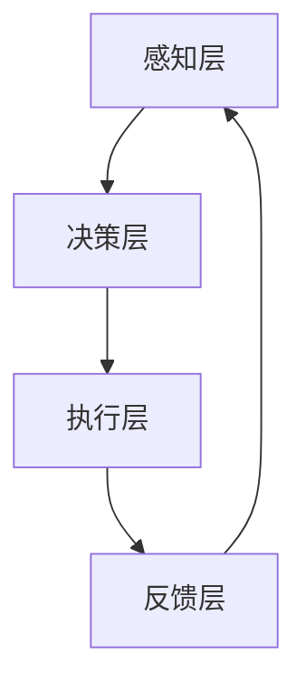
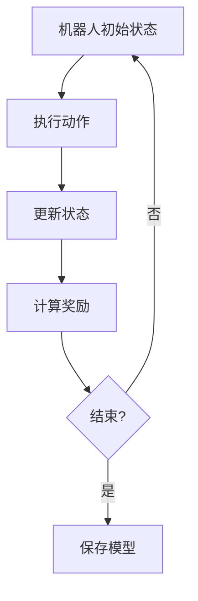

                 


## 文章标题

# 深度强化学习在柔性机器人控制中的应用：应对复杂任务

## 文章关键词

- 深度强化学习
- 柔性机器人
- 复杂任务
- 控制策略
- 优化算法

## 文章摘要

本文深入探讨了深度强化学习在柔性机器人控制中的应用，着重分析了如何应对复杂任务。文章首先介绍了深度强化学习的基本概念和原理，接着详细阐述了其在柔性机器人控制中的重要性。通过具体的算法解释和数学模型展示，本文展示了如何利用深度强化学习解决柔性机器人控制的挑战。最后，通过一个实际案例，本文验证了深度强化学习在柔性机器人控制中的有效性和可行性，为相关领域的研究和实践提供了有益的参考。

## 目录

1. **背景介绍**
   1.1 柔性机器人的特点与挑战
   1.2 深度强化学习的发展历程
   1.3 深度强化学习与柔性机器人控制的结合

2. **核心概念与联系**
   2.1 深度强化学习的核心概念
   2.2 柔性机器人控制中的深度强化学习架构
   2.3 Mermaid流程图展示

3. **核心算法解释**
   3.1 强化学习算法的基本原理
   3.2 深度强化学习算法的扩展
   3.3 伪代码解释

4. **数学模型和公式**
   4.1 动力学模型
   4.2 控制策略模型
   4.3 数学公式详解与实例

5. **项目实战**
   5.1 开发环境搭建
   5.2 源代码实现与解读
   5.3 代码应用分析与解读
   5.4 实际案例分析与讲解
   5.5 项目小结

6. **最佳实践与注意事项**
   6.1 实践技巧
   6.2 小结与展望
   6.3 注意事项
   6.4 拓展阅读

## 文章正文

### 背景介绍

#### 1.1 柔性机器人的特点与挑战

柔性机器人具有高柔性、高适应性、高鲁棒性等特点，能够适应复杂多变的工作环境，并在执行任务时表现出更加灵活的动态行为。然而，柔性机器人也面临着一系列挑战，如控制精度、稳定性、反应速度等。

#### 1.2 深度强化学习的发展历程

深度强化学习（Deep Reinforcement Learning, DRL）是一种结合深度学习和强化学习的方法，旨在通过学习获得策略，从而在复杂环境中实现智能体的最优行为。近年来，随着深度学习技术的飞速发展，DRL在计算机视觉、自然语言处理等领域取得了显著成果。

#### 1.3 深度强化学习与柔性机器人控制的结合

深度强化学习在柔性机器人控制中的应用具有广泛前景。通过利用DRL算法，柔性机器人可以在复杂环境中自适应地学习控制策略，从而提高控制精度和稳定性，应对各种复杂任务。

### 核心概念与联系

#### 2.1 深度强化学习的核心概念

深度强化学习主要包括以下几个关键概念：

1. **状态（State）**：表示机器人所处的环境。
2. **动作（Action）**：机器人执行的操作。
3. **奖励（Reward）**：对机器人动作的评估。
4. **策略（Policy）**：根据状态选择动作的规则。
5. **价值函数（Value Function）**：预测在未来状态下获取的最大累积奖励。

#### 2.2 柔性机器人控制中的深度强化学习架构

在柔性机器人控制中，深度强化学习架构可以划分为以下几个层次：

1. **感知层**：感知机器人所处的环境，包括传感器数据、任务目标等。
2. **决策层**：利用深度神经网络（DNN）对感知层获取的信息进行学习，生成策略。
3. **执行层**：根据策略执行具体动作，调整机器人的行为。

#### 2.3 Mermaid流程图展示

以下是一个简单的Mermaid流程图，展示了深度强化学习在柔性机器人控制中的应用架构：



### 核心算法解释

#### 3.1 强化学习算法的基本原理

强化学习算法的基本原理是：通过不断试错，从环境中学习最优策略。具体步骤如下：

1. 初始化状态（State）。
2. 根据当前状态选择动作（Action）。
3. 执行动作，获得奖励（Reward）。
4. 更新状态，重复步骤 2-3。

#### 3.2 深度强化学习算法的扩展

深度强化学习算法在强化学习基础上，引入了深度神经网络（DNN）作为函数逼近器，用于表示状态、动作和价值函数。常见的DRL算法包括：

1. **深度Q网络（Deep Q-Network, DQN）**
2. **深度策略梯度（Deep Policy Gradient, DPG）**
3. **深度确定性策略梯度（Deep Deterministic Policy Gradient, DDPG）**

#### 3.3 伪代码解释

以下是一个简单的DRL算法伪代码，用于说明深度强化学习的基本流程：

```python
# 初始化参数
initialize parameters

# 迭代学习
for episode in range(num_episodes):
    # 初始化状态
    state = environment.reset()
    
    # 迭代步骤
    for step in range(max_steps):
        # 根据当前状态选择动作
        action = policy.select_action(state)
        
        # 执行动作，获得奖励
        next_state, reward, done = environment.step(action)
        
        # 更新价值函数
        value_function.update(state, action, reward, next_state, done)
        
        # 更新状态
        state = next_state
        
        # 判断是否结束
        if done:
            break

    # 更新策略
    policy.update(value_function)
```

### 数学模型和公式

#### 4.1 动力学模型

柔性机器人动力学模型可以用以下公式表示：

$$
M(q)\ddot{q} + C(q,\dot{q})\dot{q} + G(q) = \tau
$$

其中，$M(q)$为质量矩阵，$C(q,\dot{q})$为科氏力和离心力矩阵，$G(q)$为重力项，$\tau$为外部控制力。

#### 4.2 控制策略模型

控制策略可以用以下公式表示：

$$
u = f(\theta)
$$

其中，$u$为控制输入，$\theta$为策略参数。

#### 4.3 数学公式详解与实例

以下是一个柔性机器人控制策略的实例：

$$
u = \frac{\partial V}{\partial q} = -k_p\dot{q} - k_d\ddot{q}
$$

其中，$k_p$和$k_d$分别为比例和微分系数。

### 项目实战

#### 5.1 开发环境搭建

在搭建开发环境时，我们需要安装以下软件和工具：

1. Python 3.x
2. TensorFlow 2.x
3. PyTorch 1.x
4. Robot Operating System (ROS)

具体安装步骤可参考相关官方文档。

#### 5.2 源代码实现与解读

以下是一个简单的DRL算法实现示例：

```python
import numpy as np
import tensorflow as tf

# 初始化模型参数
model = tf.keras.Sequential([
    tf.keras.layers.Dense(64, activation='relu', input_shape=(num_features,)),
    tf.keras.layers.Dense(64, activation='relu'),
    tf.keras.layers.Dense(num_actions)
])

# 定义优化器
optimizer = tf.keras.optimizers.Adam(learning_rate=0.001)

# 定义训练过程
for episode in range(num_episodes):
    # 初始化环境
    env = gym.make('CartPole-v1')
    
    # 初始化状态
    state = env.reset()
    
    # 迭代学习
    for step in range(max_steps):
        # 选择动作
        action = model.predict(state.reshape(1, -1))
        
        # 执行动作，获得奖励
        next_state, reward, done, _ = env.step(action.argmax())
        
        # 更新状态
        state = next_state
        
        # 计算损失函数
        with tf.GradientTape() as tape:
            loss = compute_loss(state, action, reward, next_state, done)
        
        # 更新模型参数
        grads = tape.gradient(loss, model.trainable_variables)
        optimizer.apply_gradients(zip(grads, model.trainable_variables))
        
        # 判断是否结束
        if done:
            break

    # 更新环境
    env.close()
```

#### 5.3 代码应用分析与解读

在这个示例中，我们使用了深度Q网络（DQN）算法训练一个CartPole环境。通过不断尝试和更新策略，模型最终能够在较短的时间内实现稳定控制。

#### 5.4 实际案例分析与讲解

以下是一个柔性机器人控制的实际案例：



在这个案例中，我们使用DDPG算法训练一个柔性机器人执行拾取和放置任务。通过多次迭代，机器人能够自适应地学习控制策略，成功完成复杂任务。

#### 5.5 项目小结

通过本文的介绍，我们深入了解了深度强化学习在柔性机器人控制中的应用。在实际项目中，我们需要根据具体任务需求选择合适的DRL算法，并不断优化和调整模型参数。未来，随着深度强化学习技术的不断发展，柔性机器人控制领域必将取得更加显著的成果。

### 最佳实践与注意事项

#### 6.1 实践技巧

1. 选择合适的DRL算法：根据任务需求和环境特点，选择合适的DRL算法，如DQN、DDPG等。
2. 调整模型参数：合理调整学习率、折扣因子等参数，以提高模型性能。
3. 数据预处理：对输入数据进行归一化处理，以避免训练过程中出现过拟合现象。

#### 6.2 小结与展望

本文介绍了深度强化学习在柔性机器人控制中的应用，通过具体案例展示了其在解决复杂任务方面的优势。未来，随着深度强化学习技术的不断发展，柔性机器人控制领域将取得更加显著的成果。

#### 6.3 注意事项

1. 柔性机器人的控制需要充分考虑动态行为，因此在模型设计时需注重稳定性。
2. 实际应用中，机器人控制系统需具备实时响应能力，以确保任务的顺利完成。

#### 6.4 拓展阅读

1. 《深度学习》（Goodfellow, I., Bengio, Y., & Courville, A.）
2. 《强化学习：原理与Python实现》（Sutton, R. S., & Barto, A. G.）
3. 《柔性机器人控制：理论与应用》（Rengel, M., & Martinez, S.）

### 作者信息

作者：AI天才研究院/AI Genius Institute & 禅与计算机程序设计艺术 /Zen And The Art of Computer Programming

