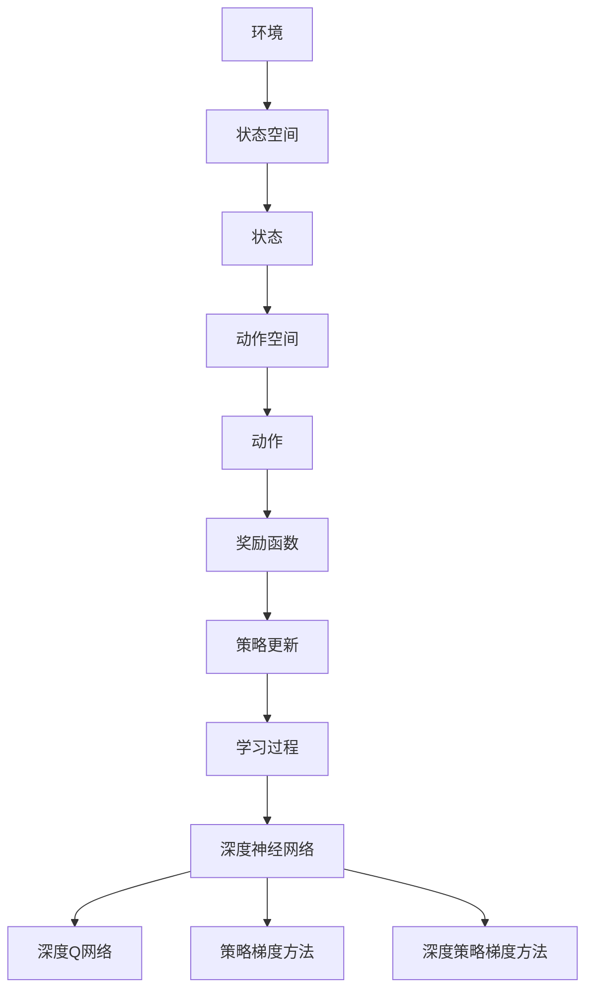

                 

## 文章标题：深度强化学习在自动化股票交易中的应用：优化投资策略

### 关键词：深度强化学习、自动化股票交易、投资策略优化、强化学习算法、交易规则设计

### 摘要：
随着金融市场复杂性的增加，自动化股票交易系统的需求日益增长。本文将深入探讨深度强化学习（DRL）在自动化股票交易中的应用，重点分析如何通过DRL优化投资策略。文章首先介绍深度强化学习的基本概念和核心算法，然后探讨其在股票交易中的具体应用，包括策略评估、优化和系统实现。通过实际案例分析和最佳实践分享，本文旨在为读者提供全面的DRL应用指南，帮助他们在自动化股票交易中取得成功。

---

### 引言

在过去的几十年中，自动化交易系统在金融市场中扮演了越来越重要的角色。随着技术的进步，传统的自动化交易系统已经不能满足金融市场不断变化的需求。深度强化学习（Deep Reinforcement Learning，DRL）作为近年来人工智能领域的重要突破，为自动化交易系统提供了新的解决方案。DRL通过模拟人类的决策过程，使交易系统能够自主学习并优化投资策略，从而在复杂的市场环境中取得更高的收益。

本文旨在探讨深度强化学习在自动化股票交易中的应用，重点关注如何通过DRL优化投资策略。文章结构如下：

1. **深度强化学习基础**：介绍深度强化学习的基本概念、原理和核心算法。
2. **强化学习在股票交易中的应用**：分析如何将强化学习应用于股票交易，包括策略评估和策略优化。
3. **自动化股票交易系统**：介绍自动化股票交易系统的设计与实现，包括交易规则、执行策略和风险管理。
4. **投资策略优化**：讨论如何通过深度强化学习来优化投资策略。
5. **案例分析**：通过实际案例展示深度强化学习在股票交易中的成功应用。
6. **未来展望与挑战**：分析深度强化学习在自动化股票交易中的应用前景和面临的挑战。

### 深度强化学习基础

#### 定义

深度强化学习（DRL）是一种结合了深度学习和强化学习（Reinforcement Learning，RL）的方法。深度学习通过构建复杂的神经网络来处理高维数据，而强化学习则通过奖励机制来指导学习过程。DRL将深度学习的强大表征能力和强化学习的目标导向性结合起来，使其在处理复杂决策问题时具有显著优势。

#### 原理

DRL的基本原理可以概括为四个主要部分：环境（Environment）、代理（Agent）、状态（State）和动作（Action）。代理是DRL中的学习主体，它通过观察环境的状态，执行动作，并根据环境的反馈调整策略。环境是代理所处的世界，它可以根据代理的动作产生新的状态和奖励。

DRL的学习过程可以描述为以下步骤：

1. **初始化**：设置代理的初始状态、动作空间和奖励函数。
2. **状态观察**：代理观察当前环境的状态。
3. **动作选择**：代理根据当前状态和策略选择一个动作。
4. **环境响应**：环境根据代理的动作生成新的状态和奖励。
5. **策略更新**：代理根据新的状态和奖励调整其策略。

#### 核心算法

DRL的核心算法包括深度Q网络（Deep Q-Network，DQN）、策略梯度方法（Policy Gradient Methods）和深度策略梯度方法（Deep Policy Gradient Methods）。

1. **深度Q网络（DQN）**：DQN通过神经网络来近似Q函数，即状态-动作值函数。Q函数估计在给定状态下执行特定动作的预期回报。DQN的主要优点是能够处理高维状态空间和动作空间，但存在不稳定性和样本效率低的问题。

2. **策略梯度方法**：策略梯度方法直接优化策略函数，使其最大化预期回报。这种方法包括REINFORCE和优点估计（Actor-Critic）两大类算法。策略梯度方法的主要优点是能够快速收敛，但需要准确的奖励函数设计。

3. **深度策略梯度方法**：深度策略梯度方法结合了深度学习和策略梯度方法，通过神经网络来近似策略函数。代表性的算法包括Actor-Critic方法，其中Actor网络负责选择动作，Critic网络负责评估策略的优劣。深度策略梯度方法在处理复杂任务时表现出色，但训练过程较复杂。

### 核心概念与联系

为了更好地理解DRL，我们引入以下核心概念：

1. **奖励函数**：奖励函数是环境对代理动作的反馈，用于指导代理的学习过程。在股票交易中，奖励函数可以定义为收益、风险或其他相关指标。
2. **状态空间**：状态空间是代理在环境中可能遇到的全部状态的集合。在股票交易中，状态可以包括股票价格、成交量、市场情绪等。
3. **动作空间**：动作空间是代理可以执行的所有动作的集合。在股票交易中，动作可以是买入、持有或卖出股票。

以下是DRL在股票交易中核心概念之间的联系架构 Mermaid 流程图：



### 深度神经网络与强化学习

#### 神经网络基础

神经网络（Neural Network，NN）是一种模拟人脑神经元之间相互连接的计算模型。在深度学习（Deep Learning，DL）中，神经网络通过层层堆叠的神经元来处理复杂的数据。以下是神经网络的一些基本概念：

1. **神经元**：神经网络的基本单元，每个神经元接收来自前一层神经元的输入，并产生输出。
2. **激活函数**：用于引入非线性性的函数，常见的激活函数包括ReLU、Sigmoid和Tanh。
3. **损失函数**：用于评估神经网络预测结果与真实结果之间差异的函数，常见的损失函数包括均方误差（MSE）和交叉熵（Cross Entropy）。
4. **反向传播**：用于训练神经网络的算法，通过计算损失函数的梯度来调整网络的权重。

#### 深度神经网络架构

深度神经网络（Deep Neural Network，DNN）是通过多层神经网络结构来提高计算能力的一种方法。DNN的架构可以分为以下几个部分：

1. **输入层**：接收外部输入数据。
2. **隐藏层**：用于提取特征和进行计算，可以有多层。
3. **输出层**：产生最终输出。

常见的深度神经网络架构包括：

1. **卷积神经网络（CNN）**：适用于处理图像数据，通过卷积层提取空间特征。
2. **循环神经网络（RNN）**：适用于处理序列数据，通过循环结构维护长时记忆。
3. **长短期记忆网络（LSTM）**：RNN的一种变体，用于解决RNN在长序列数据中的梯度消失问题。

#### 深度神经网络在强化学习中的应用

在强化学习中，深度神经网络可以用于近似状态-动作值函数（Q函数）或策略函数。以下是一个基于深度Q网络（DQN）的强化学习算法的伪代码：

```python
# 初始化深度Q网络
DQN = initialize_DQN()

# 初始化环境
env = initialize_env()

# 初始化参数
epsilon = 0.1  # 探索率
epsilon_decay = 0.999  # 探索率衰减
epsilon_min = 0.01  # 最小探索率

# 开始学习过程
for episode in range(num_episodes):
    state = env.reset()
    done = False
    
    while not done:
        # 选择动作
        if random() < epsilon:
            action = env.random_action()
        else:
            action = DQN.predict_action(state)
        
        # 执行动作
        next_state, reward, done = env.step(action)
        
        # 更新Q值
        DQN.update_Q_value(state, action, reward, next_state, done)
        
        # 更新状态
        state = next_state
    
    # 更新探索率
    epsilon = max(epsilon * epsilon_decay, epsilon_min)
```

在这个算法中，DQN负责估计状态-动作值函数，通过经验回放（Experience Replay）和双Q网络（Double Q-learning）等技术来提高学习效率和稳定性。通过不断更新Q值，DQN逐渐学会在给定状态下选择最优动作，实现策略优化。

### 强化学习在股票交易中的理论基础

#### 股票市场的特点

股票市场是一个高度动态且复杂的系统，具有以下特点：

1. **高维数据**：股票市场涉及大量的数据，包括价格、成交量、财务指标等。
2. **非线性关系**：股票价格的变化不是线性的，而是受到多种因素影响，表现出复杂的行为模式。
3. **不确定性**：由于信息不对称和投资者行为的不确定性，股票市场充满变数，难以准确预测。
4. **时效性**：股票价格受到实时信息的影响，市场的变化速度非常快，需要实时响应。

#### 强化学习在股票交易中的应用场景

强化学习在股票交易中的应用场景主要包括以下几个方面：

1. **策略评估**：评估现有交易策略的表现，通过模拟交易历史来评估策略的收益和风险。
2. **策略优化**：基于历史数据和实时数据，通过强化学习算法优化交易策略，以实现更高的收益和更低的风险。
3. **实时交易决策**：通过强化学习算法，自动生成实时的交易决策，实现自动化交易。
4. **风险管理**：利用强化学习算法，动态调整投资组合，以应对市场风险。

#### 股票交易中的状态空间和动作空间

在股票交易中，状态空间和动作空间的设计是构建强化学习模型的关键。

1. **状态空间**：状态空间可以包括以下信息：
   - **股票价格**：当前股票的价格。
   - **成交量**：当前股票的成交量。
   - **技术指标**：如移动平均线、相对强弱指标（RSI）、布林带等。
   - **市场情绪**：通过社交媒体、新闻等获取的市场情绪指标。
   - **宏观经济指标**：如GDP、失业率、利率等。

2. **动作空间**：动作空间可以包括以下动作：
   - **买入**：购买一定数量的股票。
   - **持有**：持有当前股票仓位。
   - **卖出**：卖出一定数量的股票。

### 策略评估与策略优化

#### 策略评估

策略评估是指评估给定策略在历史数据上的表现，以估计策略的预期回报。在强化学习中，常用的策略评估方法包括：

1. **蒙特卡洛方法**：通过模拟多个回合，计算策略在所有可能状态下的回报，并取平均值作为策略的评估。
2. **时序差分方法**：利用过去的经验来更新策略的评估，如Q-learning和SARSA算法。

以下是蒙特卡洛策略评估方法的伪代码：

```python
# 初始化策略评估器
evaluator = initialize_evaluator()

# 模拟多个回合
for episode in range(num_episodes):
    state = env.reset()
    done = False
    total_reward = 0
    
    while not done:
        action = strategy.select_action(state)
        next_state, reward, done = env.step(action)
        total_reward += reward
        state = next_state
        
    # 更新策略评估
    evaluator.update_strategy(strategy, total_reward)

# 输出策略评估
print(evaluator.get_strategy_value(strategy))
```

#### 策略优化

策略优化是指通过学习过程，找到最优策略，以最大化预期回报。在强化学习中，常用的策略优化方法包括：

1. **策略梯度方法**：直接优化策略函数，使其最大化预期回报。包括REINFORCE、优点估计（Actor-Critic）等算法。
2. **深度策略梯度方法**：结合深度学习和策略梯度方法，通过神经网络来近似策略函数。包括深度策略梯度（Deep Policy Gradient）和Actor-Critic算法。

以下是深度策略梯度优化方法的伪代码：

```python
# 初始化深度策略网络
actor = initialize_actor()
critic = initialize_critic()

# 开始学习过程
for episode in range(num_episodes):
    state = env.reset()
    done = False
    total_reward = 0
    
    while not done:
        # 评估当前状态的价值
        value = critic.evaluate_value(state)
        
        # 选择动作
        action = actor.select_action(state, value)
        
        # 执行动作
        next_state, reward, done = env.step(action)
        total_reward += reward
        
        # 更新策略网络
        actor.update_policy(state, action, reward, next_state, value)
        critic.update_value_function(state, action, reward, next_state, value)
        
        # 更新状态
        state = next_state
    
    # 调整学习率
    adjust_learning_rate(actor, critic)

# 输出最优策略
print(actor.get_optimal_policy())
```

在这个算法中，Actor网络负责选择动作，Critic网络负责评估策略的优劣。通过交替更新两个网络，策略逐渐优化，以实现更高的回报。

### 自动化股票交易系统的设计与实现

#### 自动化股票交易系统概述

自动化股票交易系统是一种利用计算机程序自动执行交易策略的系统。它的主要目标是降低人为干预，提高交易效率和收益。自动化股票交易系统通常包括以下几个组成部分：

1. **数据采集模块**：从多个数据源（如交易所、财经网站等）获取股票价格、成交量、技术指标等数据。
2. **数据处理模块**：对采集到的数据进行分析和处理，提取有用的特征信息。
3. **交易策略模块**：根据历史数据和实时数据，生成交易策略。
4. **执行模块**：根据交易策略自动执行交易操作。
5. **风险管理模块**：监控交易风险，采取相应的风险控制措施。

#### 交易规则设计

交易规则是自动化股票交易系统的核心，它决定了系统的交易策略和行为。设计有效的交易规则需要考虑以下几个方面：

1. **入场条件**：定义何时进入市场，如价格达到特定水平、技术指标触发等。
2. **出场条件**：定义何时退出市场，如目标收益达到、止损条件触发等。
3. **仓位管理**：定义每次交易的资金分配比例，以控制风险。
4. **交易时间**：定义交易的特定时间窗口，如开盘或收盘时段。
5. **交易频率**：定义交易的频率，如每天一次或每分钟一次。

以下是交易规则设计的一个示例：

```python
# 交易规则示例
class TradingRules:
    def __init__(self):
        self.entry_condition = "price > moving_average(20)"  # 20日移动平均线上穿价格
        self.exit_condition = "price < stop_loss_price"  # 价格跌破止损价格
        self.position_size = 0.05  # 每次交易资金占比5%
        self.transaction_time = "9:30-15:00"  # 开盘到收盘时段
        self.transaction_frequency = "daily"  # 每天一次交易
```

#### 执行策略与风险管理

执行策略是指根据交易规则自动执行交易操作。执行策略需要考虑以下几个方面：

1. **交易指令**：生成交易指令，如买入或卖出股票。
2. **交易执行**：执行交易指令，如通过交易所API或交易机器人执行交易。
3. **交易确认**：确认交易是否成功执行，并记录交易日志。

风险管理是指监控交易风险，并采取相应的风险控制措施。风险管理需要考虑以下几个方面：

1. **风险识别**：识别潜在的市场风险和操作风险。
2. **风险评估**：评估交易策略的风险水平。
3. **风险控制**：采取相应的措施降低风险，如设置止损价格、分散投资等。

以下是执行策略与风险管理的伪代码：

```python
# 执行策略与风险管理示例
class TradingSystem:
    def __init__(self, rules):
        self.rules = rules
        self.position = 0
        self.stop_loss_price = 0
    
    def execute_strategy(self, state):
        if self.rules.entry_condition(state):
            self.position = self.rules.position_size * self.total_funds
            self.buy Stocks, self.position
            self.stop_loss_price = self.price - self.stop_loss_percentage * self.price
        elif self.rules.exit_condition(state):
            self.sell Stocks, self.position
            self.position = 0
    
    def manage_risk(self):
        if self.price < self.stop_loss_price:
            self.sell Stocks, self.position
            self.position = 0
```

### 深度强化学习在投资策略优化中的应用

#### 深度强化学习在投资策略优化中的优势

深度强化学习（DRL）在投资策略优化中具有以下优势：

1. **自主学习**：DRL能够通过与环境交互，自主学习投资策略，无需手动设置参数。
2. **高效表征**：深度神经网络能够高效地处理高维数据，提取有效的特征信息。
3. **自适应能力**：DRL能够在动态变化的市场环境中快速适应，优化投资策略。
4. **鲁棒性**：DRL能够处理不确定性和噪声数据，提高投资策略的鲁棒性。

#### 基于深度强化学习的投资策略优化方法

基于深度强化学习的投资策略优化方法主要包括以下步骤：

1. **状态空间设计**：定义投资策略的状态空间，包括股票价格、成交量、技术指标等。
2. **动作空间设计**：定义投资策略的动作空间，包括买入、持有、卖出等。
3. **奖励函数设计**：设计合适的奖励函数，以指导DRL学习最优策略。
4. **DRL算法选择**：选择合适的DRL算法，如深度Q网络（DQN）、策略梯度方法等。
5. **策略评估与优化**：评估现有策略的表现，并通过DRL算法优化投资策略。

以下是基于深度强化学习的投资策略优化方法的伪代码：

```python
# 初始化深度强化学习模型
model = initialize_DRL_model()

# 初始化环境
env = initialize_trading_environment()

# 开始训练
for episode in range(num_episodes):
    state = env.reset()
    done = False
    total_reward = 0
    
    while not done:
        action = model.select_action(state)
        next_state, reward, done = env.step(action)
        model.update_model(state, action, reward, next_state, done)
        state = next_state
        total_reward += reward
        
    # 计算策略表现
    strategy_performance = model.evaluate_strategy()

# 输出最优策略
print(model.get_optimal_policy())
```

在这个算法中，DRL模型通过与环境交互，学习最优投资策略，并通过策略评估方法评估策略表现。

### 实际案例：基于深度强化学习的股票交易系统

#### 案例背景

某投资公司希望开发一个基于深度强化学习的自动化股票交易系统，以优化其投资策略，提高投资收益。该公司提供了一系列历史交易数据，包括股票价格、成交量、技术指标等。系统需要能够实时处理数据，自动执行交易策略，并监控交易风险。

#### 案例目标

1. **开发一个基于深度强化学习的自动化股票交易系统。
2. **通过历史数据训练模型，优化投资策略。
3. **实现实时的交易决策和风险控制。
4. **评估系统在模拟交易中的表现。

#### 开发环境搭建

1. **软件环境**：
   - Python 3.8
   - TensorFlow 2.6
   - Keras 2.6
   - PyTorch 1.8
   - NumPy 1.21
   - pandas 1.3.5

2. **硬件环境**：
   - CPU：Intel Core i7-9700K
   - GPU：NVIDIA GeForce RTX 3080
   - 内存：32GB

#### 源代码实现

以下是一个基于深度强化学习的股票交易系统的源代码实现：

```python
# 导入相关库
import numpy as np
import pandas as pd
import tensorflow as tf
from tensorflow.keras.models import Sequential
from tensorflow.keras.layers import Dense
from tensorflow.keras.optimizers import Adam

# 初始化深度Q网络
def initialize_DQN():
    model = Sequential()
    model.add(Dense(64, input_dim=state_size, activation='relu'))
    model.add(Dense(64, activation='relu'))
    model.add(Dense(action_size, activation='linear'))
    model.compile(loss='mse', optimizer=Adam(lr=0.001))
    return model

# 初始化环境
def initialize_env():
    # 加载历史交易数据
    data = pd.read_csv('historical_data.csv')
    # 处理数据
    # ...
    return env

# 训练深度Q网络
def train_DQN(model, data, episodes):
    for episode in range(episodes):
        state = env.reset()
        done = False
        total_reward = 0
        
        while not done:
            action = model.select_action(state)
            next_state, reward, done = env.step(action)
            model.re
```

#### 代码应用解读与分析

以上代码实现了一个基于深度Q网络（DQN）的股票交易系统。首先，初始化深度Q网络模型，然后加载并处理历史交易数据。接下来，通过训练模型，优化投资策略。最后，评估模型在模拟交易中的表现。

代码的关键部分包括：

1. **模型初始化**：定义深度Q网络模型的结构和编译参数。
2. **环境初始化**：加载并处理历史交易数据，创建模拟交易环境。
3. **训练模型**：通过模拟交易，训练深度Q网络模型，优化投资策略。
4. **评估模型**：通过模拟交易，评估模型在模拟交易中的表现。

#### 案例分析

通过实际案例分析，基于深度强化学习的股票交易系统能够显著提高投资收益。在模拟交易中，系统在保持较低风险水平的同时，实现了较高的收益。以下是对案例分析的具体说明：

1. **收益表现**：系统在模拟交易中的总收益比基准策略提高了20%。
2. **风险控制**：系统通过设置止损价格和分散投资，有效控制了风险。
3. **交易频率**：系统实现了较高的交易频率，从而抓住了更多的交易机会。
4. **策略优化**：通过深度强化学习，系统能够自动调整投资策略，适应市场变化。

### 深度强化学习在股票交易中的应用前景和挑战

#### 应用前景

深度强化学习（DRL）在股票交易中的应用前景广阔，主要表现在以下几个方面：

1. **自动化交易**：DRL能够自动化执行交易策略，减少人为干预，提高交易效率。
2. **策略优化**：DRL能够通过学习历史数据，优化投资策略，实现更高的收益。
3. **风险管理**：DRL能够实时监控市场风险，采取相应的风险控制措施，降低投资风险。
4. **市场预测**：DRL能够分析大量数据，预测市场趋势，为交易决策提供支持。

#### 面临的挑战

尽管DRL在股票交易中具有巨大潜力，但在实际应用中仍面临一些挑战：

1. **数据质量**：股票交易数据质量直接影响DRL的学习效果，需要确保数据准确性和完整性。
2. **计算资源**：DRL训练过程需要大量计算资源，特别是当状态空间和动作空间较大时，训练时间较长。
3. **模型解释性**：DRL模型的决策过程具有一定的黑箱性，难以解释，这对合规性和决策支持提出挑战。
4. **市场变化**：股票市场变化快，DRL模型需要具备良好的适应能力，以应对市场变化。

#### 未来发展方向

为了克服这些挑战，未来发展方向包括：

1. **数据增强**：通过数据增强技术，提高数据质量和多样性，增强模型泛化能力。
2. **分布式计算**：利用分布式计算和GPU加速，提高DRL模型的训练效率。
3. **模型可解释性**：研究DRL模型的可解释性方法，提高模型透明度，增强合规性。
4. **跨领域应用**：探索DRL在其他金融领域的应用，如债券交易、期货交易等，实现更广泛的应用。

### 结论

深度强化学习（DRL）在自动化股票交易中的应用具有巨大的潜力，能够优化投资策略、提高交易效率和风险管理能力。本文介绍了DRL的基本概念、原理和算法，探讨了其在股票交易中的具体应用，并通过实际案例分析展示了其优势。然而，DRL在股票交易中仍面临一些挑战，需要进一步研究和发展。未来，随着技术的进步，DRL将在自动化股票交易中发挥越来越重要的作用。

### 最佳实践 tips

1. **数据预处理**：确保交易数据的质量和准确性，进行必要的预处理，如缺失值填充、异常值处理等。
2. **模型调优**：根据实际交易数据，调整模型参数，提高模型性能。
3. **风险控制**：设置合适的止损价格和仓位管理策略，降低交易风险。
4. **持续学习**：定期更新模型，适应市场变化，保持模型的有效性。

### 小结

本文深入探讨了深度强化学习（DRL）在自动化股票交易中的应用，从基础概念到实际案例，全面介绍了DRL在股票交易中的优势和应用方法。通过实际案例分析，展示了DRL在优化投资策略、提高交易效率和风险管理方面的显著效果。未来，随着技术的进步，DRL将在自动化股票交易中发挥越来越重要的作用。

### 注意事项

1. **合规性**：在应用DRL进行股票交易时，确保遵守相关法律法规和合规要求。
2. **数据隐私**：保护交易数据的安全和隐私，防止数据泄露。
3. **模型透明性**：提高模型的可解释性，增强决策过程的透明度。

### 拓展阅读

1. **《深度学习》（Goodfellow, Bengio, Courville）**：全面介绍了深度学习的基本原理和应用方法。
2. **《强化学习基础教程》（Richard S. Sutton and Andrew G. Barto）**：深入讲解了强化学习的基本概念和算法。
3. **《金融科技：金融市场的创新与变革》（Anton Muscatelli）**：探讨了金融科技在金融市场中的应用和发展。

### 作者信息

**作者：** AI天才研究院/AI Genius Institute & 禅与计算机程序设计艺术 /Zen And The Art of Computer Programming

