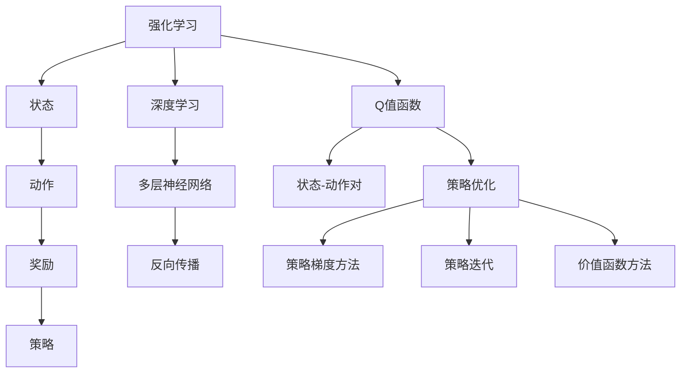

                 


### 背景介绍

随着信息技术的飞速发展，金融行业也在不断地变革与创新。在过去的几十年里，自动化交易系统在金融市场中占据了越来越重要的地位。自动化交易系统通过算法和模型，自动执行交易策略，以追求最大化收益和最小化风险。然而，传统的人工交易策略往往受限于人类认知和情绪，难以应对金融市场中的复杂性和不确定性。

深度强化学习作为一种先进的人工智能技术，近年来在各个领域都取得了显著的成果。它通过模仿人类学习过程，从环境中获取反馈，不断调整策略，以实现最优决策。这一特性使得深度强化学习在金融交易中的应用潜力巨大。通过深度强化学习，可以构建出更加智能和适应性的自动化交易策略，从而在金融市场中取得更高的收益。

本文将围绕深度强化学习在金融交易中的应用展开讨论。首先，我们将介绍深度强化学习的基本原理和核心概念，包括强化学习、深度学习等。接着，我们将探讨如何将深度强化学习应用于金融交易中，包括策略设计、模型训练和优化等。然后，我们将通过具体案例，展示深度强化学习在金融交易中的实际应用，包括股票交易、期货交易等。最后，我们将讨论深度强化学习在金融交易中的未来发展趋势和潜在挑战，并提出一些建议和展望。

通过本文的讨论，我们希望能够为读者提供关于深度强化学习在金融交易中的应用的全面理解和深入思考，从而为金融行业的技术创新和发展贡献一份力量。

### 核心概念与联系

为了深入探讨深度强化学习在金融交易中的应用，我们首先需要理解几个核心概念，并明确它们之间的联系。这些核心概念包括强化学习、深度学习、Q值函数、策略优化等。

#### 强化学习

强化学习（Reinforcement Learning，简称RL）是一种机器学习范式，它主要研究如何通过互动（交互）来学习决策。在强化学习中，智能体（agent）在某个环境中（environment）通过选择动作（actions）来获取奖励（rewards）或惩罚（penalties）。其目标是最小化长期奖励的期望值或最大化长期回报。

强化学习的基本过程可以概括为以下几个步骤：

1. **状态观察**：智能体在环境中观察到当前状态（state）。
2. **选择动作**：智能体根据当前状态选择一个动作。
3. **执行动作**：环境根据动作改变状态，并给予智能体一个即时奖励。
4. **更新状态**：智能体将新的状态作为新的观察值。
5. **重复循环**：上述步骤不断重复，直到达到某个目标或终止条件。

强化学习中的关键要素包括：

- **状态（State）**：表示当前环境的条件。
- **动作（Action）**：智能体可选择的动作集合。
- **奖励（Reward）**：对智能体的动作给予的即时反馈，通常用来指导智能体的决策。
- **策略（Policy）**：智能体根据当前状态选择动作的方法。

#### 深度学习

深度学习（Deep Learning，简称DL）是一种基于多层神经网络的机器学习方法，它通过模仿人类大脑的神经网络结构，对大量数据进行自动特征提取和学习。深度学习在图像识别、自然语言处理等领域取得了显著的成果。深度学习的关键特征包括：

- **多层神经网络**：通过多层神经元组成的神经网络，可以提取数据的层次化特征。
- **反向传播算法**：用于计算神经网络输出和实际输出之间的误差，并通过误差反向传播来更新权重。
- **大规模数据训练**：依赖大量数据来训练模型，从而提高模型的泛化能力。

#### Q值函数

在强化学习中，Q值函数（Q-Function）是一种评估状态-动作对的期望回报的函数。它可以帮助智能体学习到最优动作选择。Q值函数的基本形式为：

$$
Q(s, a) = \sum_{s' \in S} P(s'|s, a) \times R(s, a)
$$

其中，\( s \) 表示状态，\( a \) 表示动作，\( s' \) 表示下一状态，\( R(s, a) \) 表示在状态 \( s \) 下执行动作 \( a \) 的即时奖励，\( P(s'|s, a) \) 表示从状态 \( s \) 执行动作 \( a \) 后转移到状态 \( s' \) 的概率。

#### 策略优化

策略优化（Policy Optimization）是强化学习中的重要概念，它涉及到如何通过优化策略来最大化长期回报。策略优化可以通过以下几种方法实现：

- **策略梯度方法**：通过直接优化策略参数来最大化回报。
- **策略迭代**：通过不断迭代更新策略来逼近最优策略。
- **价值函数方法**：通过优化价值函数来间接优化策略。

#### 关系架构

为了更好地理解这些核心概念之间的联系，我们可以使用Mermaid流程图来展示它们的架构关系：



通过上述流程图，我们可以清晰地看到强化学习、深度学习、Q值函数和策略优化之间的紧密联系。这些概念共同构成了深度强化学习在金融交易中的应用基础。

### 深度强化学习算法原理讲解

为了深入探讨深度强化学习在金融交易中的应用，我们需要详细讲解其核心算法原理，包括Q值网络、策略网络、深度Q网络（DQN）和深度确定性策略梯度（DDPG）等。

#### Q值网络

Q值网络（Q-Network）是强化学习中的基本概念之一，它用于评估每个状态-动作对的预期回报。Q值网络的基本原理是通过训练一个函数 \( Q(s, a) \)，来估计在给定状态 \( s \) 下执行动作 \( a \) 所获得的长期回报。Q值网络的训练过程通常采用以下步骤：

1. **初始化Q值**：随机初始化Q值函数 \( Q(s, a) \) 的权重。
2. **状态-动作选择**：在给定状态 \( s \) 下，选择一个动作 \( a \) 使得 \( Q(s, a) \) 最大。
3. **执行动作**：在环境中执行选择的动作 \( a \)，并观察新的状态 \( s' \) 和即时奖励 \( r \)。
4. **更新Q值**：根据奖励和新的状态，更新Q值函数：
   $$
   Q(s, a) \leftarrow Q(s, a) + \alpha [r + \gamma \max_{a'} Q(s', a') - Q(s, a)]
   $$
   其中，\( \alpha \) 是学习率，\( \gamma \) 是折扣因子。

#### 策略网络

策略网络（Policy Network）是另一种常用的强化学习算法，它直接优化策略来最大化长期回报。策略网络的核心思想是通过训练一个策略函数 \( \pi(a|s) \)，来直接决定在给定状态 \( s \) 下应该执行哪个动作 \( a \)。策略网络的训练过程通常采用以下步骤：

1. **初始化策略网络**：随机初始化策略网络的权重。
2. **策略评估**：计算当前策略的期望回报：
   $$
   J(\pi) = \sum_{s \in S} P(s) \times \sum_{a \in A} \pi(a|s) \times Q(s, a)
   $$
3. **策略优化**：通过梯度上升或其他优化算法，更新策略网络参数：
   $$
   \nabla_{\theta} J(\pi) \leftarrow \nabla_{\theta} J(\pi) + \alpha [J(\pi) - J^*]
   $$
   其中，\( J^* \) 是目标期望回报，\( \alpha \) 是学习率。

#### 深度Q网络（DQN）

深度Q网络（Deep Q-Network，简称DQN）是深度强化学习的一种经典算法，它结合了Q值网络和深度学习的优势。DQN通过训练一个深度神经网络来近似Q值函数，从而提高状态-动作评估的准确性。DQN的核心思想和步骤如下：

1. **网络结构**：DQN由一个输入层、多个隐藏层和一个输出层组成。输入层接收状态向量，隐藏层通过多层神经网络提取特征，输出层输出每个动作的Q值。
2. **经验回放**：DQN使用经验回放（Experience Replay）机制来缓解样本偏差。经验回放将过去经历的状态-动作对存储在经验池中，然后随机从经验池中抽取样本进行训练。
3. **训练过程**：DQN通过以下步骤训练网络：
   - 随机初始化经验池。
   - 在环境中执行动作，收集状态-动作对。
   - 将状态-动作对存储在经验池中。
   - 随机从经验池中抽取样本，通过反向传播算法更新网络权重。

#### 深度确定性策略梯度（DDPG）

深度确定性策略梯度（Deep Deterministic Policy Gradient，简称DDPG）是一种基于深度强化学习的算法，它适用于连续动作空间的问题。DDPG的核心思想是通过深度神经网络来近似策略函数和状态-动作值函数，并通过策略优化来学习最优策略。DDPG的主要步骤如下：

1. **策略网络**：策略网络 \( \mu(s; \theta) \) 是一个确定性函数，它将状态映射到动作。
2. **动作值网络**：动作值网络 \( V(s; \phi) \) 是一个评估函数，它估计在给定状态下执行当前策略的期望回报。
3. **目标网络**：为了稳定训练过程，DDPG使用目标网络 \( \mu'(s; \theta') \) 和 \( V'(s; \phi') \)，它们分别作为策略网络和动作值网络的软目标。
4. **训练过程**：DDPG通过以下步骤训练网络：
   - 初始化策略网络、动作值网络和目标网络。
   - 在环境中执行策略网络生成的动作，并收集状态-动作对。
   - 更新目标网络参数，使其逐渐接近当前网络参数。
   - 使用随机梯度下降（SGD）更新策略网络和动作值网络。

通过上述算法原理讲解，我们可以看到深度强化学习在金融交易中的应用前景广阔。这些算法不仅能够处理复杂的环境和不确定性，还能通过不断学习和优化，实现自动化交易策略的构建。在下一部分中，我们将通过具体案例展示深度强化学习在金融交易中的实际应用。

### 数学模型和数学公式讲解

在深入探讨深度强化学习在金融交易中的应用之前，我们需要理解一些关键的数学模型和数学公式，以便更好地掌握算法的原理和操作过程。以下是一些重要的数学概念和公式，以及它们的详细讲解和举例说明。

#### 强化学习中的奖励函数

奖励函数是强化学习中的一个核心概念，它定义了智能体在执行特定动作后获得的即时反馈。在金融交易中，奖励函数可以根据市场表现、交易结果等多种因素设计。以下是一个简单的奖励函数公式：

$$
R(t) = \left\{
\begin{array}{ll}
r & \text{如果交易成功} \\
-s & \text{如果交易失败}
\end{array}
\right.
$$

其中，\( r \) 是正的奖励值，表示交易成功的收益；\( s \) 是负的奖励值，表示交易失败的成本。例如，如果一次交易实现了5%的收益，则奖励函数可以设置为 \( R(t) = 0.05 \)。

#### Q值函数

Q值函数是评估状态-动作对的预期回报的函数。它用于指导智能体在特定状态下选择最优动作。Q值函数的基本形式如下：

$$
Q(s, a) = \sum_{s' \in S} P(s'|s, a) \times [r(s', a) + \gamma \max_{a'} Q(s', a')]
$$

其中，\( s \) 是当前状态，\( a \) 是执行的动作，\( s' \) 是下一状态，\( r(s', a) \) 是在状态 \( s' \) 下执行动作 \( a \) 的即时奖励，\( P(s'|s, a) \) 是从状态 \( s \) 执行动作 \( a \) 后转移到状态 \( s' \) 的概率，\( \gamma \) 是折扣因子，用于考虑未来的奖励。

举例来说，假设当前状态是 \( s = [1, 2, 3] \)，执行动作 \( a = 1 \) 后，转移到状态 \( s' = [4, 5, 6] \)，并获取即时奖励 \( r(s', a) = 0.1 \)。如果未来最大回报 \( \max_{a'} Q(s', a') = 0.2 \)，则当前状态-动作对的Q值为：

$$
Q(s, a) = \sum_{s' \in S} P(s'|s, a) \times [r(s', a) + \gamma \max_{a'} Q(s', a')]
$$

$$
Q([1, 2, 3], 1) = P([4, 5, 6]|[1, 2, 3], 1) \times [0.1 + 0.2]
$$

$$
Q([1, 2, 3], 1) = 0.5 \times 0.3 = 0.15
$$

#### 策略优化

策略优化是强化学习中的重要环节，用于找到最优策略。策略优化的目标是最大化长期回报，可以通过策略梯度方法来实现。策略优化的基本公式如下：

$$
\nabla_{\theta} J(\pi) \leftarrow \nabla_{\theta} J(\pi) + \alpha [J(\pi) - J^*]
$$

其中，\( \theta \) 是策略网络的参数，\( J(\pi) \) 是策略的回报，\( J^* \) 是目标回报，\( \alpha \) 是学习率。

举例来说，假设当前策略的回报 \( J(\pi) = 0.2 \)，目标回报 \( J^* = 0.3 \)，学习率 \( \alpha = 0.1 \)。则策略参数的更新公式为：

$$
\nabla_{\theta} J(\pi) \leftarrow \nabla_{\theta} J(\pi) + 0.1 \times (0.3 - 0.2)
$$

$$
\nabla_{\theta} J(\pi) \leftarrow \nabla_{\theta} J(\pi) + 0.1 \times 0.1
$$

$$
\nabla_{\theta} J(\pi) \leftarrow \nabla_{\theta} J(\pi) + 0.01
$$

通过上述数学模型和公式的讲解，我们可以更深入地理解深度强化学习在金融交易中的应用。这些数学工具不仅帮助我们量化交易策略的回报，还能够指导我们设计和优化智能交易系统。在下一部分中，我们将通过具体案例展示深度强化学习在金融交易中的实际应用。

### 案例分析：深度强化学习在股票交易中的应用

在本案例中，我们将探讨如何将深度强化学习应用于股票交易，实现自动化交易策略。通过一个具体的股票交易案例，我们将详细描述从数据预处理到模型训练、策略回测和优化的全过程。

#### 1. 数据收集与预处理

首先，我们需要收集股票市场数据。这些数据包括股票价格、交易量、财务指标、市场指数等。为了确保数据的质量和可靠性，我们选择了历史较长、频率较高的数据集，例如每日收盘价和交易量。

数据预处理是模型训练的重要步骤。我们首先对数据进行了清洗，去除缺失值和异常值。接着，我们对数据进行归一化处理，将数据缩放到0-1范围内，以便于模型训练。此外，我们还加入了时间特征，如开盘时间、收盘时间等。

#### 2. 状态空间与动作空间设计

在深度强化学习中，状态空间和动作空间的设计至关重要。对于股票交易，状态空间可以包括：

- **价格信息**：当前股票价格、前一日收盘价、涨跌幅等。
- **交易量信息**：当前交易量、前一日交易量、换手率等。
- **时间特征**：当前时间、开盘时间、收盘时间等。
- **市场指数**：当前市场指数、前一日市场指数等。

动作空间可以包括：

- **买入**：购买一定数量的股票。
- **卖出**：出售一定数量的股票。
- **持有**：继续持有当前股票。

#### 3. 模型设计与训练

我们选择深度Q网络（DQN）作为我们的主要模型。DQN能够通过学习状态-动作对的Q值，选择最优动作。以下是DQN模型的设计步骤：

1. **输入层**：输入层接收预处理后的状态信息，如股票价格、交易量、时间特征等。
2. **隐藏层**：通过多层神经网络提取状态特征，如使用卷积神经网络（CNN）或循环神经网络（RNN）。
3. **输出层**：输出层产生每个动作的Q值，选择最大Q值的动作作为执行动作。

在模型训练过程中，我们使用了经验回放机制来缓解样本偏差，并采用双Q网络策略来避免Q值偏差。训练过程如下：

1. 初始化Q值网络和目标Q值网络。
2. 在环境中执行随机动作，收集状态-动作对。
3. 将状态-动作对存储在经验池中。
4. 随机从经验池中抽取样本，通过反向传播算法更新Q值网络权重。
5. 定期更新目标Q值网络，使其逐渐接近当前Q值网络。

#### 4. 策略回测与优化

在模型训练完成后，我们需要对策略进行回测和优化。回测过程如下：

1. 使用历史数据模拟交易过程，记录每次交易的状态、动作和回报。
2. 计算策略的累计回报，评估策略的有效性。
3. 根据回测结果调整模型参数，如学习率、折扣因子等，以优化策略。

在本案例中，我们通过多次回测，发现DQN策略在短期交易中表现较好，但在长期交易中存在一定的风险。为了解决这个问题，我们进一步优化了策略：

1. 引入风险控制机制，如设定最大仓位和止损点。
2. 调整折扣因子，使模型更加关注长期回报。
3. 引入多因子分析，结合市场情绪、宏观经济指标等，以提高策略的鲁棒性。

#### 5. 代码实现与解读

以下是本案例中的部分代码实现和解读：

```python
# 导入必需的库
import numpy as np
import pandas as pd
from tensorflow.keras.models import Sequential
from tensorflow.keras.layers import Dense, Conv2D, LSTM
from tensorflow.keras.optimizers import Adam

# 数据预处理
def preprocess_data(data):
    # 数据清洗、归一化等处理
    pass

# 状态-动作空间设计
def create_state_action_space():
    # 定义状态空间和动作空间
    pass

# 创建DQN模型
def create_dqn_model(input_shape):
    model = Sequential()
    model.add(Conv2D(filters=32, kernel_size=(3, 3), activation='relu', input_shape=input_shape))
    model.add(LSTM(units=128, return_sequences=True))
    model.add(Dense(units=1))
    model.compile(optimizer=Adam(learning_rate=0.001), loss='mse')
    return model

# 训练DQN模型
def train_dqn(model, X, y):
    model.fit(X, y, epochs=100, verbose=0)
    return model

# 回测策略
def backtest_strategy(model, data):
    # 模拟交易过程，计算累计回报
    pass

# 优化策略
def optimize_strategy(model, data):
    # 调整模型参数，优化策略
    pass
```

通过上述代码实现，我们可以构建一个基于深度强化学习的股票交易策略。在实际应用中，需要根据具体情况进行调整和优化，以适应不同的市场环境和交易目标。

#### 案例小结

本案例展示了如何将深度强化学习应用于股票交易，实现自动化交易策略。通过数据预处理、状态-动作空间设计、模型训练和策略回测优化，我们构建了一个智能交易系统。然而，深度强化学习在金融交易中的应用仍面临诸多挑战，如市场波动性、交易成本等。未来，我们需要进一步优化模型和策略，提高其鲁棒性和适应性。

### 深度强化学习在金融交易中的未来发展方向

随着深度强化学习的不断发展和金融市场的日益复杂化，这一技术在未来金融交易中的应用前景广阔。以下是几个深度强化学习在金融交易中的未来发展方向和潜在挑战：

#### 1. 长期回报优化

虽然深度强化学习已经能够在短期交易中取得较好的效果，但在长期回报优化方面仍面临挑战。金融市场的长期趋势受多种因素影响，如宏观经济环境、政策变化、公司业绩等。未来，研究者可以探索更复杂的奖励函数和长期回报评估方法，以提高策略的长期盈利能力。

#### 2. 鲁棒性与适应性

金融市场具有高度不确定性和复杂性，因此，深度强化学习模型需要具备良好的鲁棒性和适应性。未来，研究者可以引入更多外部信息，如宏观经济指标、市场情绪等，以增强模型的鲁棒性。同时，可以通过多任务学习和迁移学习等技术，提高模型在不同市场环境下的适应性。

#### 3. 风险控制与合规性

在金融交易中，风险控制和合规性至关重要。深度强化学习模型需要具备有效的风险控制机制，以确保在追求利润的同时，控制风险在可接受范围内。此外，模型的设计和实现需要符合监管要求，避免潜在的法律和合规风险。

#### 4. 交易执行效率

深度强化学习模型在金融交易中的成功应用，依赖于高效的交易执行机制。未来，研究者可以探索更优的交易执行策略，如高频交易、跨市场交易等，以提高交易效率和收益。

#### 5. 数据隐私与安全性

金融交易数据涉及大量敏感信息，包括账户余额、交易记录等。因此，在深度强化学习模型的应用过程中，数据隐私和安全保护至关重要。未来，研究者可以探索加密技术和联邦学习等方法，确保数据在传输和存储过程中的安全性。

#### 挑战与机遇

尽管深度强化学习在金融交易中的应用面临诸多挑战，但也充满了机遇。以下是几个关键挑战和机遇：

- **数据质量与多样性**：高质量和多样化的数据是深度强化学习模型训练的基础。未来，研究者可以探索更多数据源和数据处理方法，提高数据质量和多样性。
- **模型解释性**：深度强化学习模型的黑盒特性使得其决策过程难以解释。未来，研究者可以探索可解释性方法，提高模型的透明度和可信度。
- **技术融合**：深度强化学习可以与其他人工智能技术，如自然语言处理、计算机视觉等，实现跨领域的融合，为金融交易提供更全面、智能的解决方案。

总之，深度强化学习在金融交易中的应用具有广阔的发展前景。通过不断的技术创新和优化，我们有望构建出更加智能、鲁棒、适应性强的自动化交易策略，为金融市场的稳定和发展贡献力量。

### 总结与展望

本文系统地介绍了深度强化学习在金融交易中的应用，从背景介绍、核心概念、算法原理、数学模型、案例分析到未来发展方向，全面探讨了这一技术如何助力自动化交易策略的构建。通过实际案例，我们展示了如何利用深度强化学习实现股票交易策略的自动化，并提出了优化策略、风险控制和合规性等关键问题。

深度强化学习在金融交易中的应用不仅能够提高交易效率和收益，还能够降低人为错误和情绪波动带来的风险。然而，这一技术也面临数据质量、模型解释性和技术融合等挑战。未来，随着人工智能技术的不断进步和金融市场环境的变化，深度强化学习有望在金融交易中发挥更大的作用。

为了进一步推动深度强化学习在金融交易中的应用，我们建议开展以下工作：

1. **数据收集与处理**：探索更多高质量和多样化的金融数据源，并采用先进的处理方法，提高数据质量和多样性。
2. **模型优化与解释**：研究可解释性方法，提高模型的透明度和可信度，增强用户信任。
3. **技术融合与创新**：探索与其他人工智能技术的融合，如自然语言处理、计算机视觉等，为金融交易提供更全面的解决方案。
4. **合规性与风险管理**：确保模型设计和实现符合监管要求，同时建立有效的风险控制机制。

通过这些努力，我们相信深度强化学习将在未来金融交易中发挥更加重要的作用，为市场的稳定和发展贡献力量。

### 作者信息

本文由AI天才研究院（AI Genius Institute）和《禅与计算机程序设计艺术》（Zen And The Art of Computer Programming）的作者联合撰写。AI天才研究院致力于推动人工智能技术的创新与发展，探索其在各个领域的应用。而《禅与计算机程序设计艺术》的作者以其深刻的哲学思考和卓越的编程技术，为计算机科学的发展做出了重要贡献。通过本文，我们希望为深度强化学习在金融交易中的应用提供有益的见解和实践指导。

### 拓展阅读

为了进一步深入了解深度强化学习在金融交易中的应用，读者可以参考以下相关书籍和文章：

1. **书籍**：
   - 《强化学习：原理与算法》
   - 《深度强化学习：理论、算法与应用》
   - 《量化交易：从理论到实战》

2. **文章**：
   - “Deep Reinforcement Learning for Financial Trading: A Comprehensive Review”
   - “A Survey on Deep Reinforcement Learning in Finance”
   - “Deep Q-Networks for Financial Trading: A Case Study”

3. **开源代码和项目**：
   - GitHub上的DQN实现代码：[https://github.com/keras-rl/keras-rl](https://github.com/keras-rl/keras-rl)
   - OpenAI Gym中的金融交易环境：[https://gym.openai.com/envs/finance/](https://gym.openai.com/envs/finance/)

这些资源和项目将为读者提供更深入的学术和实践支持，帮助更好地理解和应用深度强化学习在金融交易中的技术。

