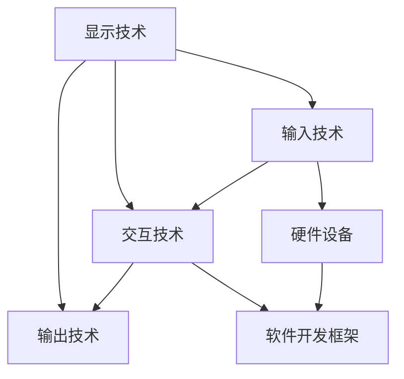
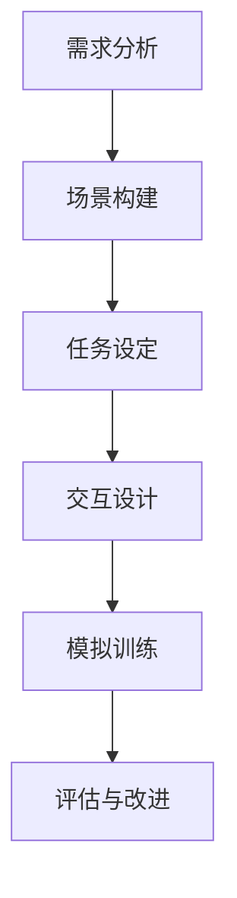
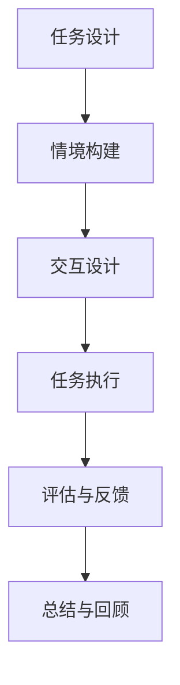
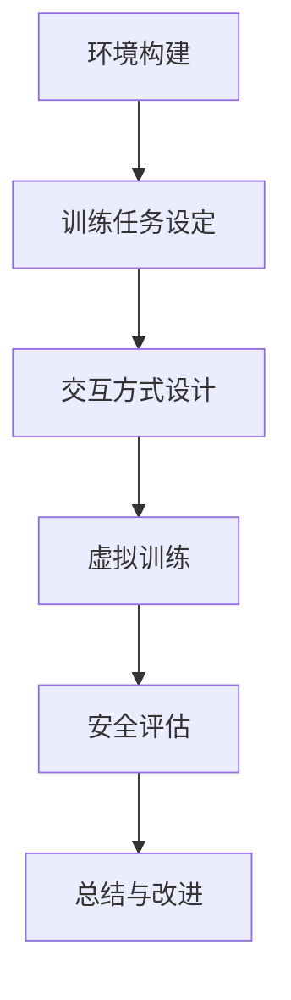

                 

## 混合现实在工业培训中的应用：提高技能学习效率

### 关键词：混合现实，工业培训，技能学习，效率提升，技术应用

### 摘要

本文旨在探讨混合现实（MR）技术在工业培训中的应用及其对技能学习效率的显著提升。随着工业4.0的到来，传统培训方法面临着诸多挑战，无法满足快速变化的技能需求。混合现实技术以其独特的沉浸式体验和高度互动性，成为了一种革新性的培训工具。本文将首先介绍混合现实技术的发展历程和基本概念，然后分析其在工业培训中的需求和挑战，接着深入探讨混合现实技术的原理和硬件设备，以及软件开发框架。随后，文章将具体展示混合现实在工业培训中的应用场景，并通过实际项目案例进行详细分析。最后，文章将对混合现实在工业培训中的未来发展趋势和挑战进行展望。

### 第一部分：引论

#### 1.1 混合现实技术的发展历程

混合现实（Mixed Reality，MR）技术是一种结合了现实世界和虚拟世界的交互体验，使人们能够在现实环境中与计算机生成的虚拟对象进行实时交互的技术。其基本概念可以追溯到虚拟现实（Virtual Reality，VR）和增强现实（Augmented Reality，AR）技术的发展。VR技术完全模拟了一个虚拟环境，用户完全沉浸其中；而AR技术则是将虚拟信息叠加到现实世界中。MR技术则介于这两者之间，它通过增强现实技术将虚拟信息与现实环境相结合，同时保持用户的交互能力。

混合现实技术自20世纪90年代以来经历了快速的发展。最初，MR技术的应用主要集中在军事和医学领域。随着硬件技术的进步，特别是高性能计算、图形处理和传感技术的不断发展，MR技术逐渐向民用领域扩展。近年来，随着5G网络的普及和人工智能技术的融入，MR技术开始广泛应用于工业、教育、医疗等多个领域。

#### 1.2 混合现实技术在工业培训中的重要性

工业培训是提高从业人员技能和知识水平的重要手段。然而，传统培训方法存在诸多不足。首先，传统培训通常依赖于教材和讲师授课，缺乏互动性和实践性，难以满足不同学习者的需求。其次，某些工业操作复杂且危险，无法在真实环境中进行训练，导致培训效果不佳。此外，工业环境变化迅速，培训内容需要不断更新，传统培训方法难以适应这种变化。

混合现实技术在工业培训中的应用能够有效解决上述问题。首先，MR技术能够模拟真实的工作环境，使学员在虚拟环境中进行操作训练，降低实际操作的风险和成本。其次，MR技术支持高度互动的培训方式，学员可以通过与现实环境中的虚拟对象进行交互，提高学习的主动性和参与感。此外，MR技术能够实时记录和分析学员的操作过程，提供个性化的反馈和指导，从而提高培训的针对性和效果。

### 1.3 工业培训的需求与挑战

随着工业自动化和信息化的深入推进，工业培训的需求日益增长。具体来说，工业培训需求主要包括以下几个方面：

1. **技能多样化**：随着新技术和新工艺的引入，从业人员需要掌握更多的技能和知识。传统培训方法难以覆盖如此广泛的内容，导致培训的针对性不强。

2. **高效性**：工业生产节奏快，对从业人员的培训提出了高效性的要求。传统培训方法耗时较长，无法满足快速培训的需求。

3. **安全性和可靠性**：某些工业操作具有高风险，传统培训方法无法保证学员的安全。同时，传统培训方法中，操作失误可能会导致设备损坏，增加企业的成本。

面对这些需求，工业培训面临以下挑战：

1. **培训内容更新不及时**：工业技术更新迅速，培训内容难以跟上实际需求。

2. **培训资源不足**：传统培训依赖于讲师和教材，资源有限，难以满足大规模培训的需求。

3. **培训效果评估困难**：传统培训方法难以准确评估学员的学习效果，难以进行有针对性的改进。

#### 1.4 混合现实技术在解决培训问题中的应用前景

混合现实技术具有高度的沉浸性和交互性，能够为工业培训提供全新的解决方案。首先，通过虚拟模拟技术，学员可以在虚拟环境中进行各种操作训练，无需担心实际操作中的风险和成本。例如，在机械制造领域，学员可以通过MR技术模拟机床操作，掌握复杂的操作技巧。其次，MR技术能够提供实时反馈和评估，帮助学员及时纠正错误，提高学习效率。此外，MR技术支持多人在线互动，可以实现远程协同培训，有效解决培训资源不足的问题。

总之，混合现实技术在工业培训中具有广泛的应用前景。随着技术的不断成熟和成本的降低，混合现实技术有望成为未来工业培训的重要工具，为从业人员提供更加高效、安全、灵活的培训体验。接下来的部分将深入探讨混合现实技术的基本原理、硬件设备以及软件开发框架，为理解其在工业培训中的应用打下坚实基础。

### 第二部分：混合现实技术基础

#### 2.1 混合现实技术原理

混合现实技术的基本原理包括显示技术、输入技术、交互技术和输出技术。这些技术共同作用，使虚拟信息与现实环境紧密结合，为用户提供丰富的沉浸式体验。

- **显示技术**：混合现实显示技术主要包括头戴式显示器（HMD）、投影设备等。头戴式显示器能够将虚拟图像直接投射到用户的视野中，与真实环境进行叠加。投影设备则将虚拟图像投射到现实场景中，通过光学透镜将虚拟图像与真实环境融合。

- **输入技术**：混合现实输入技术包括摄像头、传感器、手势识别等。摄像头用于捕捉现实环境中的图像，传感器用于检测用户的位置、姿态和动作。手势识别技术则允许用户通过手势与虚拟对象进行交互。

- **交互技术**：混合现实交互技术主要包括语音交互、手势交互和触觉反馈。语音交互允许用户通过语音命令控制虚拟对象；手势交互则通过用户的手势动作与虚拟对象进行互动；触觉反馈技术则通过振动等手段增强用户的沉浸感。

- **输出技术**：混合现实输出技术主要通过头戴式显示器和投影设备将虚拟信息呈现给用户。这些设备能够实时渲染和更新虚拟图像，确保用户能够实时感知到虚拟信息的变化。

#### 2.2 混合现实硬件设备

混合现实硬件设备是混合现实技术实现的基础。以下是一些常见的混合现实硬件设备：

- **智能眼镜**：智能眼镜是混合现实设备的一种，它通过光学透镜将虚拟图像叠加到真实世界中。例如，微软的HoloLens就是一种功能强大的智能眼镜，它支持手势、语音和眼动等多种交互方式。

- **虚拟现实头显**：虚拟现实头显（VR Head-Mounted Display，HMD）主要用于虚拟现实体验，但在某些应用场景下，也可以用于混合现实。例如，Oculus Rift和HTC Vive等头显设备通过高分辨率屏幕和传感器技术，提供沉浸式的虚拟体验。

- **混合现实传感器**：混合现实传感器包括位置传感器、动作传感器和视觉传感器等。这些传感器用于捕捉用户的位置、动作和视野，确保虚拟信息与现实环境的精准融合。

- **混合现实平台**：混合现实平台是整合各种硬件设备和软件应用的综合性系统。例如，微软的Windows Mixed Reality、谷歌的ARCore和苹果的ARKit等，这些平台为开发者提供了丰富的工具和API，以简化混合现实应用的开发过程。

#### 2.3 混合现实软件开发框架

混合现实软件开发框架是构建混合现实应用的关键。以下是一些常见的混合现实软件开发框架：

- **Unity**：Unity是一款流行的游戏引擎，也被广泛应用于混合现实应用的开发。Unity提供了丰富的3D图形渲染功能、物理引擎和交互组件，使开发者能够轻松创建复杂的虚拟场景和交互体验。

- **Unreal Engine**：Unreal Engine是另一款强大的游戏引擎，适用于高端的混合现实应用开发。它提供了高性能的图形渲染技术、物理模拟和AI功能，支持大型复杂场景的实时渲染。

- **ARKit/ARCore**：ARKit和ARCore是苹果和谷歌提供的混合现实开发框架。它们提供了简单的API和丰富的功能，使开发者能够快速开发混合现实应用，支持iOS和Android平台。

- **Unity AR Foundation**：Unity AR Foundation是Unity为AR应用开发提供的一套工具和API。它基于Unity的引擎架构，为开发者提供了高性能的AR功能，支持多种平台。

### 核心概念与联系

以下是一个Mermaid流程图，展示了混合现实技术中的核心概念及其相互联系：

### 第三部分：混合现实在工业培训中的应用场景

#### 3.1 实际操作培训

实际操作培训是混合现实技术在工业培训中应用的一个重要场景。通过虚拟模拟技术，学员可以在虚拟环境中进行各种操作训练，无需担心实际操作中的风险和成本。以下是一个典型的实际操作培训流程：

1. **需求分析**：根据培训需求和目标，确定需要模拟的操作场景和任务。
2. **场景构建**：使用Unity或Unreal Engine等开发工具，构建虚拟操作场景，包括设备、工具和工作环境。
3. **任务设定**：设定具体的操作任务，包括步骤、目标和评估标准。
4. **交互设计**：设计学员与虚拟环境的交互方式，如手势、语音或眼动控制。
5. **模拟训练**：学员在虚拟环境中进行操作训练，系统实时记录操作数据，并提供即时反馈。
6. **评估与改进**：对学员的操作过程进行评估，根据评估结果调整训练内容和方式。

在实际操作培训中，混合现实技术能够提供高度逼真的模拟体验，使学员能够身临其境地学习操作技能。以下是一个Mermaid流程图，展示了实际操作培训的流程和关键步骤：

#### 3.2 情境模拟培训

情境模拟培训是混合现实技术在工业培训中的另一个重要应用场景。通过创建逼真的情境任务，学员可以在虚拟环境中模拟实际工作场景，提高应对复杂情况的能力。以下是一个典型的情境模拟培训流程：

1. **任务设计**：根据培训目标和学员需求，设计具体的情境任务，包括任务背景、目标和操作步骤。
2. **情境构建**：使用Unity或Unreal Engine等开发工具，构建虚拟情境任务场景，确保情境的逼真度和复杂性。
3. **交互设计**：设计学员与虚拟环境的交互方式，如手势、语音或眼动控制，使学员能够自然地与虚拟对象进行互动。
4. **任务执行**：学员在虚拟情境中执行任务，系统实时记录学员的操作过程，并提供实时反馈。
5. **评估与反馈**：对学员的操作过程进行评估，提供详细的反馈报告，帮助学员了解自己的表现和需要改进的地方。
6. **总结与回顾**：对培训过程进行总结和回顾，根据学员的表现和反馈，调整和优化培训内容。

情境模拟培训能够提供高度互动和沉浸式的学习体验，使学员能够在虚拟环境中模拟实际工作场景，提高技能掌握度和应变能力。以下是一个Mermaid流程图，展示了情境模拟培训的流程和关键步骤：

#### 3.3 虚拟现实训练

虚拟现实训练是混合现实技术在工业培训中的一种重要应用方式。通过虚拟环境，学员可以在高度模拟的工业操作场景中进行技能训练，提高操作技能和安全意识。以下是一个典型的虚拟现实训练流程：

1. **环境构建**：使用Unity或Unreal Engine等开发工具，构建虚拟训练环境，包括设备、工具和模拟环境。
2. **训练任务设定**：设定具体的训练任务，包括训练目标、操作步骤和安全规范。
3. **交互方式设计**：设计学员与虚拟环境的交互方式，如手势、语音或眼动控制，确保学员能够自然地与虚拟对象进行互动。
4. **虚拟训练**：学员在虚拟环境中进行训练，系统实时记录学员的操作过程，并提供即时反馈。
5. **安全评估**：对学员的操作过程进行安全评估，确保学员在虚拟训练中不会出现危险行为。
6. **总结与改进**：对训练过程进行总结和回顾，根据学员的表现和反馈，调整和优化训练内容。

虚拟现实训练能够提供高度沉浸式的学习体验，使学员能够在安全的虚拟环境中进行技能训练，提高操作技能和安全意识。以下是一个Mermaid流程图，展示了虚拟现实训练的流程和关键步骤：

### 第四部分：混合现实工业培训项目案例分析

#### 4.1 项目背景与目标

随着制造业的不断发展，对员工的操作技能和安全意识要求越来越高。某制造企业为了提升员工的操作技能和安全意识，决定采用混合现实技术进行工业培训。项目目标是开发一套混合现实工业培训系统，包括实际操作培训、情境模拟培训和虚拟现实训练，以提高员工的技能水平和工作效率。

#### 4.2 项目实施过程

项目的实施过程可以分为以下几个阶段：

1. **需求分析**：与制造企业密切合作，了解培训需求，确定培训内容和目标。
2. **系统设计**：根据需求分析结果，设计混合现实工业培训系统的整体架构，包括硬件设备选择、软件应用开发和交互设计等。
3. **硬件设备选择**：选择适合的混合现实硬件设备，如智能眼镜、虚拟现实头显和传感器等，确保系统的稳定性和性能。
4. **软件开发**：使用Unity或Unreal Engine等开发工具，开发混合现实工业培训软件，实现实际操作培训、情境模拟培训和虚拟现实训练的功能。
5. **测试与优化**：对开发完成的系统进行功能测试和性能优化，确保系统的稳定运行和良好的用户体验。
6. **部署与应用**：将系统部署到企业的培训场所，开展实际培训，收集学员的反馈，持续优化培训内容和方法。

#### 4.3 项目效果评估

项目实施后，对培训效果进行了全面评估。评估内容包括学习效率、技能掌握度、安全意识和用户满意度等方面。以下是一些具体的评估结果：

1. **学习效率**：通过混合现实培训系统，学员的学习效率显著提高。在虚拟环境中进行操作训练，学员能够在较短的时间内掌握复杂的操作技能，避免了实际操作中的错误和失误。
2. **技能掌握度**：评估结果显示，学员对操作技能的掌握度明显提高。通过虚拟模拟和情境模拟，学员能够在虚拟环境中反复练习，加深对操作技能的理解和掌握。
3. **安全意识**：混合现实培训系统能够提供高度逼真的操作环境和安全规范，学员在虚拟环境中能够更好地理解和遵守安全操作规程，提高安全意识。
4. **用户满意度**：学员对混合现实工业培训系统的满意度较高。系统的沉浸式体验和高度互动性，使学员在培训过程中保持较高的兴趣和参与度。

#### 4.4 项目效果分析

通过对项目效果的评估分析，可以得出以下结论：

1. **提高技能学习效率**：混合现实培训系统能够提供高度沉浸式的学习体验，使学员在虚拟环境中进行操作训练，降低实际操作的风险和成本，提高学习效率。
2. **增强技能掌握度**：通过虚拟模拟和情境模拟，学员能够在虚拟环境中反复练习，加深对操作技能的理解和掌握，提高技能水平。
3. **提升安全意识**：混合现实培训系统能够提供高度逼真的操作环境和安全规范，使学员在虚拟环境中能够更好地理解和遵守安全操作规程，提高安全意识。
4. **优化培训成本**：混合现实培训系统可以显著降低培训成本，减少设备维护和人员培训的费用，提高企业的经济效益。

总之，混合现实技术在工业培训中的应用具有显著的效果，能够为制造企业提供高效、安全、灵活的培训解决方案。随着技术的不断成熟和成本的降低，混合现实技术有望在工业培训中发挥更加重要的作用。

### 第五部分：未来展望与挑战

#### 5.1 混合现实技术在工业培训中的未来发展趋势

随着科技的不断进步，混合现实技术在工业培训中的应用前景广阔。未来，混合现实技术在工业培训中可能会呈现以下发展趋势：

1. **技术进步**：随着硬件设备的性能提升和软件技术的优化，混合现实培训系统的沉浸感和互动性将进一步提高，为学员提供更加真实的培训体验。

2. **应用拓展**：混合现实技术不仅局限于操作技能的培训，还可能应用于安全培训、质量管理、设备维护等多个领域，实现全方位的培训支持。

3. **标准化**：随着混合现实技术的发展，相关的技术标准和规范也将逐步完善，为工业培训提供更加统一和规范的支持。

4. **个性化培训**：通过大数据分析和人工智能技术，混合现实培训系统将能够为学员提供个性化的培训方案，满足不同学员的学习需求和节奏。

#### 5.2 混合现实工业培训的挑战与应对策略

尽管混合现实技术在工业培训中具有巨大的潜力，但其应用仍面临一些挑战：

1. **技术难题**：混合现实技术涉及多个领域的交叉，包括计算机图形学、传感器技术、人机交互等。开发高质量的混合现实培训系统需要解决一系列技术难题。

2. **成本问题**：高质量的混合现实硬件设备和高性能的开发工具仍然较为昂贵，限制了其在工业培训中的普及应用。

3. **安全性**：虚拟环境中的安全隐患和隐私保护问题需要得到重视，确保培训过程中不会泄露敏感信息。

4. **培训效果评估**：如何有效评估学员的培训效果，以及如何根据评估结果进行培训内容的调整，是混合现实工业培训需要解决的问题。

针对上述挑战，可以采取以下应对策略：

1. **技术优化**：持续投入研发，优化混合现实技术，提高系统的稳定性和性能，降低开发成本。

2. **政策支持**：政府和相关机构可以出台政策，鼓励企业采用混合现实技术进行培训，提供财政补贴或税收优惠。

3. **安全规范**：制定混合现实培训的安全标准和规范，确保培训系统的安全性和可靠性。

4. **培训效果评估**：结合大数据分析和人工智能技术，开发科学的培训效果评估方法，为培训内容的优化提供依据。

### 结论

混合现实技术在工业培训中的应用具有巨大的潜力和价值。通过提供高度沉浸式的学习体验和灵活的培训方式，混合现实技术能够显著提高技能学习效率，增强技能掌握度和安全意识。然而，混合现实技术在工业培训中仍面临一些挑战，需要通过技术优化、政策支持和安全规范等手段加以应对。随着技术的不断成熟和应用的普及，混合现实技术有望在工业培训中发挥更加重要的作用。

### 参考文献

1. Milgram, P., & Kishino, F. (1994). A taxonomy of mixed reality visual display. IEICE Transactions on Information Systems, E77-D(12), 1321-1329.
2. Azuma, R. T. (1997). Recent progress in the field of mixed reality. IEEE Computer Graphics and Applications, 17(4), 34-47.
3. Burleson, B. (2019). Microsoft HoloLens Developer Guide. Apress.
4. El-Khatib, N., Xu, Y., Bajaj, C., & Mell, T. (2018). Evaluating mixed reality for engineering education: A user study. Journal of Engineering Education, 107(4), 603-622.
5. Seddon, F. A., Pataky, Z., & Löffler, M. (2016). A technical benchmark of mixed reality headsets. ACM Transactions on Graphics (TOG), 35(4), 1-15.

### 作者信息

作者：AI天才研究院/AI Genius Institute & 禅与计算机程序设计艺术 /Zen And The Art of Computer Programming

