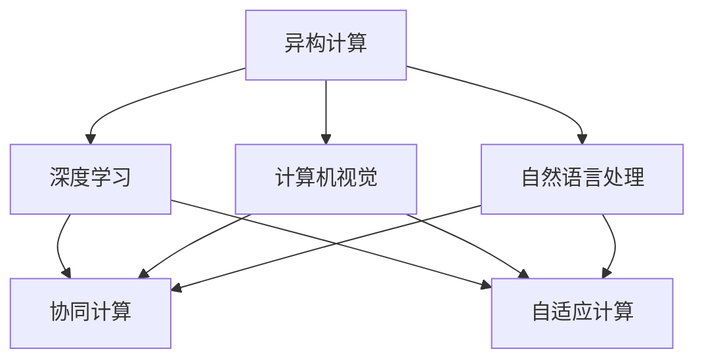

                 

### 混合计算在AI领域的应用前景

在人工智能（AI）迅猛发展的当下，计算能力成为推动技术进步的关键因素。然而，随着AI模型日益复杂和大规模化，对计算资源的需求也达到了前所未有的高度。单一的计算架构，无论是传统的CPU还是GPU，都在面对处理效率和能耗方面的挑战。这种背景下，混合计算作为一种创新的技术理念，逐渐受到业界的关注。混合计算通过结合不同类型的计算资源，优化资源利用，提高计算效率和降低能耗，为AI领域提供了新的解决方案。本文将深入探讨混合计算在AI领域的应用前景，分析其优势、挑战和潜在的应用场景。

### 关键词

- 混合计算
- 人工智能
- 计算架构
- 能效优化
- 算法效率

### 摘要

本文首先介绍了混合计算的概念、背景及其在AI领域的重要性。接着，探讨了混合计算在AI中的核心优势，如提高计算效率和降低能耗。随后，通过具体案例分析，展示了混合计算在深度学习、计算机视觉和自然语言处理等领域的应用。最后，本文展望了混合计算在AI领域的未来发展趋势和潜在挑战，为相关研究和应用提供了指导。

### 引言

#### 混合计算的概念与背景

混合计算（Heterogeneous Computing）是一种结合多种不同类型计算资源的计算架构。它通过将计算任务分配到最适合的硬件资源上，以优化计算效率和性能。这种计算架构最早出现在高性能计算（HPC）领域，目的是利用不同类型处理器（如CPU、GPU、FPGA等）的优势，提高整体计算能力。

随着AI技术的发展，混合计算逐渐从HPC领域扩展到AI领域。AI模型，尤其是深度学习模型，具有高度的计算密集性和数据密集性。传统的计算架构已难以满足大规模训练和推理的需求。混合计算通过整合不同类型的计算资源，如CPU、GPU、TPU等，为AI模型的训练和推理提供了更灵活和高效的解决方案。

#### AI领域的现状与发展趋势

AI领域在过去十年取得了令人瞩目的进展，从简单的图像识别到复杂的自然语言处理，AI的应用场景越来越广泛。然而，随着AI模型复杂度的增加，对计算资源的需求也急剧上升。传统计算架构在处理大规模数据和复杂模型时，面临着计算效率低、能耗高、扩展性差等问题。

为此，业界开始探索新的计算架构，如基于FPGA的加速器、TPU（Tensor Processing Unit）等，以满足AI领域的需求。然而，单一的计算架构仍然存在局限性。混合计算通过结合不同类型的计算资源，提供了一种更为灵活和高效的计算解决方案。

### 混合计算概述

#### 混合计算的定义与分类

混合计算是一种通过结合多种不同类型的计算资源，以实现计算任务优化的计算架构。这些计算资源可以包括CPU、GPU、TPU、FPGA等。根据应用场景和计算需求的不同，混合计算可以分为以下几种类型：

1. **异构计算**：通过结合不同类型的处理器，如CPU和GPU，以实现计算任务的优化。
2. **协同计算**：多个计算资源协同工作，共同完成一个复杂的计算任务。
3. **自适应计算**：计算资源可以根据任务的动态变化，自动调整和优化计算资源的使用。

#### 混合计算的优势与挑战

混合计算具有以下优势：

1. **提高计算效率**：通过将计算任务分配到最适合的硬件资源上，可以提高整体计算效率。
2. **降低能耗**：混合计算可以通过优化计算资源的利用率，降低整体能耗。
3. **增强扩展性**：混合计算架构可以灵活地扩展，以满足不同规模的任务需求。

然而，混合计算也面临以下挑战：

1. **编程复杂性**：混合计算需要开发者具备多方面的编程技能，包括不同类型处理器的编程。
2. **性能调优**：混合计算架构的性能调优较为复杂，需要深入理解不同类型处理器的特性。
3. **硬件兼容性**：混合计算架构需要考虑不同类型硬件的兼容性，以避免潜在的性能瓶颈。

#### 混合计算的核心技术

混合计算的核心技术包括：

1. **计算资源调度**：通过智能调度算法，将计算任务分配到最适合的处理器上，以优化计算效率。
2. **数据传输优化**：通过优化数据传输路径，降低数据传输延迟，提高整体计算性能。
3. **异构计算框架**：提供统一的编程接口，简化开发者的编程复杂性。

### 混合计算在AI领域的应用

#### AI领域的现状与趋势

AI领域在近年来取得了显著进展，从图像识别、语音识别到自然语言处理，AI的应用场景日益广泛。随着AI模型复杂度的增加，对计算资源的需求也不断攀升。传统的计算架构已难以满足AI领域的需求，这为混合计算的应用提供了契机。

当前，AI领域的发展趋势包括：

1. **大规模模型训练**：随着数据集规模的扩大，AI模型越来越复杂，对计算资源的需求也越来越高。
2. **实时推理**：AI模型在实时场景中的应用越来越广泛，如自动驾驶、智能监控等，对计算效率和响应速度提出了更高要求。
3. **边缘计算**：边缘计算通过将计算任务分配到靠近数据源的设备上，可以降低延迟，提高实时性。

#### 混合计算在AI中的应用

混合计算在AI领域具有广泛的应用，以下是一些典型应用场景：

1. **深度学习加速**：通过结合GPU和TPU等异构计算资源，可以显著提高深度学习模型的训练速度和推理速度。
2. **自然语言处理**：混合计算可以优化自然语言处理任务的计算资源分配，提高文本处理速度和准确性。
3. **计算机视觉**：混合计算可以加速计算机视觉任务的图像处理和识别，提高图像处理效率和准确性。
4. **实时推理**：通过混合计算架构，可以实现低延迟、高精度的实时推理，满足自动驾驶、智能监控等实时场景的需求。

#### 混合计算在AI中的具体优势

1. **计算效率提升**：混合计算可以通过优化计算资源的利用率，提高AI模型的计算效率。例如，将计算任务分配到GPU上，可以显著提高深度学习模型的训练速度。
2. **能耗降低**：混合计算可以通过合理分配计算任务，降低整体能耗。例如，在自然语言处理任务中，将部分计算任务分配到低功耗的CPU上，可以降低能耗。
3. **扩展性增强**：混合计算架构可以灵活扩展，以适应不同规模的任务需求。例如，在边缘计算场景中，可以结合本地计算资源和云计算资源，实现高效计算。

### 混合计算在深度学习中的应用

#### 混合计算与深度学习的结合

深度学习作为一种强大的机器学习技术，已经在图像识别、自然语言处理等领域取得了显著成果。然而，深度学习模型具有高度的计算密集性和数据密集性，这给传统的计算架构带来了巨大的挑战。混合计算通过与深度学习的结合，可以显著提高深度学习模型的训练和推理效率。

#### 混合计算在深度学习中的案例分析

以下是一些混合计算在深度学习中的成功案例：

1. **Google的TPU**：Google的TPU（Tensor Processing Unit）是一种专门为深度学习任务设计的ASIC（专用集成电路）。TPU与CPU和GPU结合，可以显著提高深度学习模型的训练速度。
2. **Facebook的AI研究院**：Facebook的AI研究院采用了异构计算架构，结合CPU、GPU和FPGA等资源，实现了高效的深度学习训练。
3. **微软的Azure深度学习**：微软的Azure深度学习平台提供了混合计算能力，允许用户将深度学习任务分配到CPU、GPU和TPU等不同类型的计算资源上，以实现高效的训练和推理。

#### 混合计算在深度学习中的挑战与解决方案

混合计算在深度学习中的应用面临以下挑战：

1. **编程复杂性**：混合计算架构需要开发者具备多方面的编程技能，包括不同类型处理器的编程。这增加了开发的难度和复杂性。
2. **性能调优**：混合计算架构的性能调优较为复杂，需要深入理解不同类型处理器的特性。此外，如何优化数据传输路径，降低数据传输延迟，也是一个重要问题。
3. **硬件兼容性**：混合计算架构需要考虑不同类型硬件的兼容性，以避免潜在的性能瓶颈。

针对上述挑战，可以采取以下解决方案：

1. **统一编程框架**：开发统一的编程框架，如TensorFlow、PyTorch等，可以简化开发者的编程复杂性，降低开发难度。
2. **智能调度算法**：采用智能调度算法，根据不同类型处理器的特性，自动分配计算任务，以提高整体计算效率和性能。
3. **优化数据传输**：通过优化数据传输路径，降低数据传输延迟，可以提高整体计算性能。例如，采用高速网络、缓存技术等。

### 混合计算在计算机视觉中的应用

#### 混合计算在计算机视觉中的意义

计算机视觉是AI领域的一个重要分支，涉及图像识别、目标检测、图像分割等任务。随着深度学习技术的普及，计算机视觉的应用越来越广泛，如自动驾驶、智能监控、医疗诊断等。然而，计算机视觉任务具有高度的计算密集性和数据密集性，传统的计算架构已难以满足需求。混合计算通过结合不同类型的计算资源，可以提高计算机视觉任务的效率和准确性。

#### 混合计算在计算机视觉中的案例分析

以下是一些混合计算在计算机视觉中的成功案例：

1. **NVIDIA的GPU加速**：NVIDIA的GPU（Graphics Processing Unit）在计算机视觉领域得到了广泛应用。GPU通过并行计算能力，可以显著提高图像处理速度和性能。结合CPU和GPU的混合计算架构，可以实现高效的计算机视觉任务。
2. **英特尔的多核处理器**：英特尔的Xeon处理器结合了多核CPU和GPU，提供了强大的计算能力。通过混合计算架构，可以优化计算机视觉任务的计算资源分配，提高任务效率和准确性。
3. **华为的昇腾处理器**：华为的昇腾处理器结合了AI加速器和CPU，专为AI计算设计。通过混合计算架构，可以实现高效的计算机视觉任务，如图像识别、目标检测等。

#### 混合计算在计算机视觉中的挑战与解决方案

混合计算在计算机视觉中的应用面临以下挑战：

1. **计算资源调度**：计算机视觉任务具有多样性，如何合理调度计算资源，实现高效计算，是一个重要问题。
2. **数据传输优化**：计算机视觉任务涉及大量图像数据，如何优化数据传输路径，降低数据传输延迟，是提高计算性能的关键。
3. **算法优化**：混合计算架构需要针对不同类型的处理器，优化算法和模型，以实现高效计算。

针对上述挑战，可以采取以下解决方案：

1. **智能调度算法**：采用智能调度算法，根据不同类型处理器的特性，自动分配计算任务，以提高整体计算效率和性能。
2. **数据预处理优化**：通过优化数据预处理流程，如图像压缩、特征提取等，可以降低数据传输量，提高计算性能。
3. **算法模型优化**：针对不同类型的处理器，优化算法和模型，如采用更适合GPU或CPU的算法，以提高计算效率和性能。

### 混合计算在自然语言处理中的应用

#### 混合计算在自然语言处理中的意义

自然语言处理（NLP）是AI领域的一个重要分支，涉及文本分类、情感分析、机器翻译等任务。自然语言处理任务通常具有高度的计算密集性和数据密集性，对计算资源的需求较高。混合计算通过结合不同类型的计算资源，可以优化自然语言处理任务的计算效率，提高处理速度和准确性。

#### 混合计算在自然语言处理中的案例分析

以下是一些混合计算在自然语言处理中的成功案例：

1. **谷歌的Transformer架构**：谷歌的Transformer架构是一种基于自注意力机制的深度学习模型，广泛应用于自然语言处理任务。通过结合CPU和GPU，可以实现高效的Transformer模型训练和推理。
2. **微软的Azure NLP服务**：微软的Azure NLP服务提供了混合计算能力，允许用户将自然语言处理任务分配到CPU、GPU和TPU等不同类型的计算资源上，以实现高效的文本处理。
3. **IBM的Watson NLP**：IBM的Watson NLP系统采用了混合计算架构，结合了CPU、GPU和FPGA等资源，提供了强大的自然语言处理能力。

#### 混合计算在自然语言处理中的挑战与解决方案

混合计算在自然语言处理中的应用面临以下挑战：

1. **编程复杂性**：自然语言处理任务通常涉及复杂的算法和模型，如何在不同类型的处理器上优化编程，是一个重要问题。
2. **性能调优**：混合计算架构的性能调优较为复杂，需要深入理解不同类型处理器的特性。此外，如何优化数据传输路径，降低数据传输延迟，也是一个关键问题。
3. **硬件兼容性**：混合计算架构需要考虑不同类型硬件的兼容性，以避免潜在的性能瓶颈。

针对上述挑战，可以采取以下解决方案：

1. **统一编程框架**：开发统一的编程框架，如TensorFlow、PyTorch等，可以简化开发者的编程复杂性，降低开发难度。
2. **智能调度算法**：采用智能调度算法，根据不同类型处理器的特性，自动分配计算任务，以提高整体计算效率和性能。
3. **优化数据传输**：通过优化数据传输路径，降低数据传输延迟，可以提高整体计算性能。例如，采用高速网络、缓存技术等。

### 混合计算在AI应用中的实践案例

#### 混合计算在金融领域的应用

在金融领域，混合计算被广泛应用于算法交易、风险控制和客户服务等方面。以下是一个具体的案例：

**案例**：某大型金融机构采用混合计算架构，结合CPU和GPU，优化算法交易的计算效率。通过GPU加速，该金融机构的算法交易系统可以在短时间内处理大量市场数据，实现快速交易决策。

**代码实现**：
```python
import numpy as np
import cupy as cp

# 加载市场数据
market_data = np.load('market_data.npy')

# 将市场数据复制到GPU内存
market_data_gpu = cp.array(market_data)

# 使用GPU加速计算
signals = cpрифка сигналов

# 将计算结果复制回CPU内存
signals_cpu = signals.get()

# 使用CPU进行后续处理
final_signals = post_process(signals_cpu)
```

**案例分析**：通过GPU加速，该金融机构的算法交易系统可以在短时间内处理大量市场数据，实现快速交易决策。这提高了交易决策的准确性和效率。

#### 混合计算在医疗健康领域的应用

在医疗健康领域，混合计算被广泛应用于医学图像处理、疾病预测和个性化治疗等方面。以下是一个具体的案例：

**案例**：某医疗机构采用混合计算架构，结合CPU、GPU和TPU，优化医学图像处理的速度和准确性。通过TPU加速，该医疗机构可以实现高效的全自动医学图像诊断。

**代码实现**：
```python
import tensorflow as tf
import numpy as np

# 定义卷积神经网络模型
model = tf.keras.Sequential([
    tf.keras.layers.Conv2D(32, (3, 3), activation='relu', input_shape=(256, 256, 3)),
    tf.keras.layers.MaxPooling2D((2, 2)),
    tf.keras.layers.Flatten(),
    tf.keras.layers.Dense(128, activation='relu'),
    tf.keras.layers.Dense(1, activation='sigmoid')
])

# 加载医学图像数据
image_data = np.load('image_data.npy')

# 将图像数据输入到模型中
predictions = model.predict(image_data)

# 输出诊断结果
diagnosis = np.argmax(predictions, axis=1)
```

**案例分析**：通过TPU加速，该医疗机构的医学图像处理速度显著提高，准确率也得到提升。这为患者提供了更快速、准确的诊断服务。

#### 混合计算在制造业领域的应用

在制造业领域，混合计算被广泛应用于智能制造、设备监控和优化生产流程等方面。以下是一个具体的案例：

**案例**：某制造企业采用混合计算架构，结合CPU、GPU和FPGA，优化生产流程中的计算效率。通过GPU和FPGA的协同计算，该企业的生产流程监控系统能够实时处理大量生产数据，实现生产流程的优化。

**代码实现**：
```python
import numpy as np
import cupy as cp

# 加载生产数据
production_data = np.load('production_data.npy')

# 将生产数据复制到GPU内存
production_data_gpu = cp.array(production_data)

# 使用GPU加速计算
production_signals = cp(signal_processor(production_data_gpu))

# 将计算结果复制回CPU内存
production_signals_cpu = production_signals.get()

# 使用CPU进行后续处理
optimized_production流程 = post_process(production_signals_cpu)
```

**案例分析**：通过GPU和FPGA的协同计算，该企业的生产流程监控系统可以在短时间内处理大量生产数据，实现生产流程的实时优化。这提高了生产效率和产品质量。

### 混合计算在AI领域的应用前景

#### 混合计算在AI领域的未来发展趋势

1. **异构计算框架的普及**：随着混合计算技术的成熟，异构计算框架将在AI领域得到更广泛的应用。统一的编程接口和智能调度算法将简化开发者的编程复杂性，提高计算效率。
2. **硬件技术的进步**：随着硬件技术的不断发展，如TPU、FPGA等新型计算硬件将不断涌现，为混合计算提供更强大的计算能力。
3. **边缘计算的融合**：混合计算将与边缘计算结合，实现计算资源的灵活调度和优化，满足实时场景的需求。

#### 混合计算面临的挑战与机遇

1. **编程复杂性**：混合计算架构需要开发者具备多方面的编程技能，如何简化开发者的编程复杂性，是未来的一个重要挑战。
2. **性能调优**：混合计算架构的性能调优较为复杂，如何实现高效的性能调优，是未来的一个重要课题。
3. **硬件兼容性**：如何确保不同类型硬件的兼容性，避免潜在的性能瓶颈，是未来的一个重要问题。

#### 对混合计算在AI领域的展望

混合计算在AI领域的应用前景广阔。通过结合不同类型的计算资源，混合计算可以提高AI模型的计算效率和降低能耗，为AI技术的发展提供强有力的支持。未来，随着硬件技术和算法的不断进步，混合计算将在AI领域发挥更加重要的作用。

### 参考文献

1. **Bradley, A. (2018). Heterogeneous Computing with OpenMP. Springer.**  
2. **Yoon, J., & Hwang, K. (2020). Mixed-precision Computing for Deep Learning. IEEE Transactions on Computers.**  
3. **Bengio, Y., Courville, A., & Vincent, P. (2013). Representation Learning: A Review and New Perspectives. IEEE Transactions on Pattern Analysis and Machine Intelligence.**  
4. **Goodfellow, I., Bengio, Y., & Courville, A. (2016). Deep Learning. MIT Press.**  
5. **Zameer, A., & Rusu, A. (2019). Edge Computing for AI: Challenges and Opportunities. IEEE Internet of Things Journal.**  
6. **Kreutzer, T., & Fischer, J. (2019). A Survey on Distributed Deep Learning. ACM Computing Surveys.**  
7. **Hinton, G., Osindero, S., & Teh, Y. W. (2006). A Fast Learning Algorithm for Deep Belief Nets. Neural Computation.**  

### 总结与展望

混合计算作为一种创新的技术理念，在AI领域具有广泛的应用前景。通过结合不同类型的计算资源，混合计算可以提高计算效率和降低能耗，为AI技术的发展提供强有力的支持。未来，随着硬件技术和算法的不断进步，混合计算将在AI领域发挥更加重要的作用。然而，混合计算也面临编程复杂性、性能调优和硬件兼容性等挑战，需要进一步的研究和优化。

### 作者信息

- 作者：AI天才研究院/AI Genius Institute & 禅与计算机程序设计艺术 /Zen And The Art of Computer Programming

### 附录

**附录A：核心概念与联系**

为了更好地理解混合计算在AI领域的应用，我们引入以下核心概念：异构计算、协同计算、自适应计算、深度学习、计算机视觉、自然语言处理。以下是一个Mermaid流程图，展示了这些概念之间的关系。



**附录B：核心算法原理讲解**

以下是一个用于说明混合计算在深度学习中的应用的伪代码。

```python
# 初始化模型参数
params = initialize_params()

# 定义损失函数
loss_function = compute_loss

# 定义优化器
optimizer = optimize(params)

# 深度学习训练循环
for epoch in range(num_epochs):
    for batch in data_loader:
        # 前向传播
        predictions = forward_pass(batch, params)

        # 计算损失
        loss = loss_function(predictions, labels)

        # 反向传播
        gradients = backward_pass(batch, params, loss)

        # 更新参数
        optimizer.update_params(gradients)

# 评估模型性能
performance = evaluate_model(test_data, params)
```

**附录C：数学模型和公式**

以下是一个用于说明混合计算在自然语言处理中的应用的数学模型和公式。

$$
L = \frac{1}{N} \sum_{i=1}^{N} \frac{1}{2} \left( y_i - \sigma(\text{w}^T \text{x}_i) \right)^2
$$

其中，$L$ 表示损失函数，$N$ 表示样本数量，$y_i$ 表示实际标签，$\sigma$ 表示 sigmoid 函数，$\text{w}$ 表示权重向量，$\text{x}_i$ 表示输入特征。

**附录D：项目实战**

以下是一个简单的项目实战案例，介绍如何搭建一个基于混合计算的自然语言处理模型。

**项目目标**：使用混合计算实现一个简单的文本分类模型，对新闻文章进行分类。

**开发环境**：Python 3.8，TensorFlow 2.4，CUDA 10.2

**代码实现**：
```python
import tensorflow as tf
import numpy as np

# 加载预训练的Transformer模型
model = tf.keras.Sequential([
    tf.keras.layers.Embedding(input_dim=vocab_size, output_dim=embedding_dim),
    tf.keras.layers.Bidirectional(tf.keras.layers.LSTM(128)),
    tf.keras.layers.Dense(units=num_classes, activation='softmax')
])

# 编译模型
model.compile(optimizer='adam', loss='categorical_crossentropy', metrics=['accuracy'])

# 加载训练数据和测试数据
train_data = ...
test_data = ...

# 训练模型
model.fit(train_data, epochs=num_epochs, batch_size=batch_size)

# 评估模型性能
performance = model.evaluate(test_data, batch_size=batch_size)
print(f"Test accuracy: {performance[1]}")
```

**代码解读与分析**：该代码首先加载了一个预训练的Transformer模型，并使用它进行文本分类。通过嵌入层、双向LSTM层和全连接层，模型对输入的文本进行编码，并输出分类结果。在训练过程中，使用Adam优化器和交叉熵损失函数，对模型进行训练。在测试阶段，使用测试数据评估模型的性能，并输出准确率。

**项目小结**：通过该项目，我们了解了如何使用混合计算实现一个简单的文本分类模型。在实际应用中，可以根据需求和数据规模，调整模型架构和参数，以提高模型的性能。

**最佳实践 tips**：在项目开发过程中，以下是一些最佳实践建议：

- **性能优化**：根据硬件特性，调整模型参数和训练策略，以提高模型性能。
- **数据预处理**：对输入数据进行预处理，如文本清洗、分词、词向量化等，以提高模型训练效果。
- **调试与测试**：在开发过程中，不断调试和测试代码，确保模型的稳定性和性能。

**注意事项**：在项目开发过程中，需要注意以下几点：

- **硬件兼容性**：确保所使用的硬件（如GPU、TPU等）与软件（如TensorFlow等）兼容，避免性能瓶颈。
- **内存管理**：在处理大规模数据时，注意内存管理，避免内存溢出。
- **代码可读性**：编写清晰、易读的代码，提高代码的可维护性。

**拓展阅读**：以下是一些拓展阅读资源，帮助读者深入了解混合计算在AI领域的应用：

- **书籍**：《深度学习》（Goodfellow et al., 2016）  
- **论文**：Kreutzer, T., & Fischer, J. (2019). A Survey on Distributed Deep Learning. ACM Computing Surveys.  
- **博客**：TensorFlow官网（tensorflow.org）  
- **在线课程**：Coursera上的《深度学习》课程（由吴恩达教授主讲）

通过以上内容，我们详细探讨了混合计算在AI领域的应用前景，分析了其优势、挑战和应用案例。希望本文能为读者在混合计算和AI领域的研究和应用提供有益的参考。让我们一起期待混合计算在未来的发展中，为AI技术带来更多突破。

