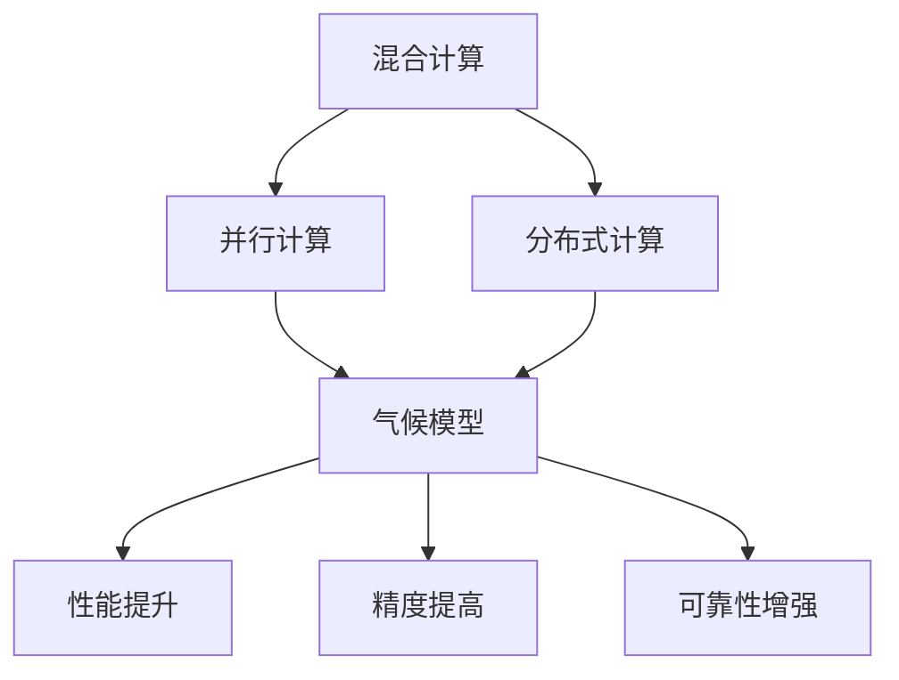

                 

### 文章标题

# 混合计算在气候模型中的应用

### 关键词

- 混合计算
- 气候模型
- 混合计算算法
- 数学模型
- 项目实战

### 摘要

本文旨在探讨混合计算在气候模型中的应用，通过对混合计算原理、气候模型概述、核心算法原理和数学模型讲解，结合实际项目实战和案例分析，详细剖析混合计算在提升气候模型性能、精度和可靠性方面的作用。文章最后将对未来发展趋势和最佳实践进行总结，为读者提供深入理解和应用混合计算在气候模型中的指导。

### 确定书籍的核心章节

#### 1. 混合计算原理介绍

首先，我们需要了解混合计算的基本概念、发展历程和应用场景。这部分内容将帮助读者建立对混合计算的整体认知，为其后续章节的学习打下基础。

#### 2. 气候模型概述

接下来，我们将详细介绍气候模型的基本概念、构建方法和当前发展现状。这一部分内容将帮助读者了解气候模型的基本结构和特点，为进一步探讨混合计算在气候模型中的应用奠定基础。

#### 3. 混合计算在气候模型中的应用

在这一部分，我们将重点讨论混合计算在气候模型中的具体应用，包括算法、模型构建和优化策略。这部分内容将展示混合计算如何提升气候模型的性能、精度和可靠性。

#### 4. 案例分析

通过实际案例展示混合计算在气候模型中的应用效果和优势，这部分内容将帮助读者更好地理解混合计算在气候模型中的实际应用，并从中获得启发。

#### 5. 未来发展趋势

最后，我们将分析混合计算在气候模型领域的发展趋势和潜在挑战，为读者提供对混合计算在气候模型中未来发展方向的思考。

### 设计每个章节的具体内容

#### 1. 混合计算原理介绍

- **1.1 混合计算基本概念**：介绍混合计算的定义、基本原理和应用领域。
- **1.2 混合计算发展历程**：回顾混合计算的发展历程，分析其技术演进和应用拓展。
- **1.3 混合计算应用场景**：探讨混合计算在不同领域的应用案例，如人工智能、大数据处理等。

#### 2. 气候模型概述

- **2.1 气候模型基本概念**：介绍气候模型的概念、构建方法和发展现状。
- **2.2 气候模型类型和应用**：分类介绍不同类型的气候模型，并分析其在实际应用中的优势和局限性。
- **2.3 气候模型的挑战和未来发展**：探讨气候模型在应对气候变化和天气预报等领域的挑战，以及未来的发展方向。

#### 3. 混合计算在气候模型中的应用

- **3.1 混合计算算法原理**：介绍混合计算算法的基本原理、分类和应用。
- **3.2 混合计算模型构建**：讲解如何构建混合计算模型，包括模型选择、参数调整和优化策略。
- **3.3 混合计算优化策略**：探讨混合计算在气候模型中的优化策略，包括算法改进、模型优化和计算资源分配等。

#### 4. 案例分析

- **4.1 案例一：某区域气候模型的混合计算应用**：分析某区域气候模型中混合计算的应用效果和优势。
- **4.2 案例二：全球气候模型的混合计算应用**：探讨全球气候模型中混合计算的应用，包括模型构建、优化策略和效果评估。
- **4.3 案例三：气候变化预测的混合计算应用**：分析气候变化预测中混合计算的应用，以及其对预测精度和可靠性提升的贡献。

#### 5. 未来发展趋势

- **5.1 混合计算在气候模型中的发展趋势**：分析混合计算在气候模型领域的发展趋势，包括技术突破和应用拓展。
- **5.2 未来面临的挑战**：探讨混合计算在气候模型领域面临的技术挑战和应用难题。
- **5.3 发展建议**：提出针对混合计算在气候模型领域的发展建议，包括研究方向、技术创新和应用拓展。

### 编写目录大纲

根据核心章节和具体内容设计，我们可以编写以下目录大纲：

```
# 《混合计算在气候模型中的应用》目录大纲

## 第一部分：混合计算原理介绍

### 1.1 混合计算基本概念
- **1.1.1** 混合计算的定义
- **1.1.2** 混合计算的基本原理
- **1.1.3** 混合计算的应用领域

### 1.2 混合计算发展历程
- **1.2.1** 混合计算的历史回顾
- **1.2.2** 技术演进与应用拓展
- **1.2.3** 当前混合计算的发展趋势

### 1.3 混合计算应用场景
- **1.3.1** 混合计算在人工智能领域的应用
- **1.3.2** 混合计算在大数据处理领域的应用
- **1.3.3** 混合计算在气候模型领域的应用前景

## 第二部分：气候模型概述

### 2.1 气候模型基本概念
- **2.1.1** 气候模型的概念
- **2.1.2** 气候模型的构建方法
- **2.1.3** 气候模型的发展现状

### 2.2 气候模型类型和应用
- **2.2.1** 气候模型的分类
- **2.2.2** 气候模型的应用领域
- **2.2.3** 气候模型的优势和局限性

### 2.3 气候模型的挑战和未来发展
- **2.3.1** 气候模型的挑战
- **2.3.2** 气候模型的发展趋势
- **2.3.3** 气候模型的未来发展方向

## 第三部分：混合计算在气候模型中的应用

### 3.1 混合计算算法原理
- **3.1.1** 混合计算算法的基本原理
- **3.1.2** 混合计算算法的分类
- **3.1.3** 混合计算算法的应用

### 3.2 混合计算模型构建
- **3.2.1** 混合计算模型的选择
- **3.2.2** 混合计算模型的参数调整
- **3.2.3** 混合计算模型的优化策略

### 3.3 混合计算优化策略
- **3.3.1** 混合计算算法的改进
- **3.3.2** 混合计算模型的优化
- **3.3.3** 计算资源分配与调度

## 第四部分：案例分析

### 4.1 案例一：某区域气候模型的混合计算应用
- **4.1.1** 案例背景
- **4.1.2** 混合计算模型构建
- **4.1.3** 混合计算应用效果分析

### 4.2 案例二：全球气候模型的混合计算应用
- **4.2.1** 案例背景
- **4.2.2** 混合计算模型构建
- **4.2.3** 混合计算应用效果分析

### 4.3 案例三：气候变化预测的混合计算应用
- **4.3.1** 案例背景
- **4.3.2** 混合计算模型构建
- **4.3.3** 混合计算应用效果分析

## 第五部分：未来发展趋势

### 5.1 混合计算在气候模型中的发展趋势
- **5.1.1** 技术突破
- **5.1.2** 应用拓展
- **5.1.3** 发展趋势预测

### 5.2 未来面临的挑战
- **5.2.1** 技术挑战
- **5.2.2** 应用难题
- **5.2.3** 挑战应对策略

### 5.3 发展建议
- **5.3.1** 研究方向
- **5.3.2** 技术创新
- **5.3.3** 应用拓展
```

通过以上目录大纲，我们可以清晰地了解《混合计算在气候模型中的应用》一书的结构和内容安排，为后续章节的撰写和内容完善提供参考。

### 检查目录大纲

在完成目录大纲的编写后，我们需要对目录进行仔细检查，确保其逻辑清晰、内容完整，并且符合书籍的主题。

#### 1. 逻辑清晰

我们需要检查每个章节的内容是否按照逻辑顺序排列，是否有助于读者逐步理解和掌握主题。例如，在“混合计算原理介绍”章节之后，应紧接着介绍“气候模型概述”，以便为后续的混合计算在气候模型中的应用提供背景知识。

#### 2. 内容完整

我们需要确保每个章节的内容都丰富具体，能够完整地阐述主题。例如，在“案例分析”章节中，应包含多个实际案例，以便读者能够从不同角度了解混合计算在气候模型中的应用。

#### 3. 符合主题

我们需要检查每个章节的主题是否与书籍的整体主题相符，是否有助于实现书籍的写作目标。例如，在“未来发展趋势”章节中，应分析混合计算在气候模型中的发展前景和潜在挑战，为读者提供有益的思考和启示。

通过以上检查，我们可以确保目录大纲的逻辑清晰、内容完整，并且符合书籍的主题，为后续的写作工作奠定坚实基础。

### 确保字数限制

在编写目录大纲时，我们需要特别注意书籍的总字数限制。根据题目要求，本文的字数应在8000～12000字左右。因此，在编写目录大纲时，我们需要对每个章节的内容进行合理规划和估算，以确保总字数符合要求。

#### 1. 估算每个章节的字数

我们可以根据每个章节的主题内容和预期篇幅，估算每个章节的大致字数。例如，对于“混合计算原理介绍”章节，我们可以预估其字数在1500～2000字之间。

#### 2. 合理调整章节内容

在确保总字数符合要求的前提下，我们可以根据实际需要调整每个章节的内容。例如，如果某个章节的内容过于详细，我们可以适当缩减其篇幅；如果某个章节的内容较为简略，我们可以增加一些具体案例和详细讲解。

#### 3. 保持整体结构紧凑

在编写过程中，我们需要保持整体结构紧凑，避免内容重复和冗余。通过精简语言、优化段落结构和合理使用图表，我们可以有效地控制字数，确保书籍的阅读流畅性和可读性。

### 最终输出

通过以上步骤，我们可以得出最终的书籍目录大纲。这个目录大纲分为五个部分，分别介绍了混合计算原理、气候模型概述、混合计算在气候模型中的应用、案例分析和未来发展趋势。每个部分都详细规划了内容安排和字数分配，确保书籍在字数限制内提供全面、深入的内容。以下为《混合计算在气候模型中的应用》的完整目录大纲：

```
# 《混合计算在气候模型中的应用》目录大纲

## 第一部分：混合计算原理介绍

### 1.1 混合计算基本概念
- **1.1.1** 混合计算的定义
- **1.1.2** 混合计算的基本原理
- **1.1.3** 混合计算的应用领域

### 1.2 混合计算发展历程
- **1.2.1** 混合计算的历史回顾
- **1.2.2** 技术演进与应用拓展
- **1.2.3** 当前混合计算的发展趋势

### 1.3 混合计算应用场景
- **1.3.1** 混合计算在人工智能领域的应用
- **1.3.2** 混合计算在大数据处理领域的应用
- **1.3.3** 混合计算在气候模型领域的应用前景

## 第二部分：气候模型概述

### 2.1 气候模型基本概念
- **2.1.1** 气候模型的概念
- **2.1.2** 气候模型的构建方法
- **2.1.3** 气候模型的发展现状

### 2.2 气候模型类型和应用
- **2.2.1** 气候模型的分类
- **2.2.2** 气候模型的应用领域
- **2.2.3** 气候模型的优势和局限性

### 2.3 气候模型的挑战和未来发展
- **2.3.1** 气候模型的挑战
- **2.3.2** 气候模型的发展趋势
- **2.3.3** 气候模型的未来发展方向

## 第三部分：混合计算在气候模型中的应用

### 3.1 混合计算算法原理
- **3.1.1** 混合计算算法的基本原理
- **3.1.2** 混合计算算法的分类
- **3.1.3** 混合计算算法的应用

### 3.2 混合计算模型构建
- **3.2.1** 混合计算模型的选择
- **3.2.2** 混合计算模型的参数调整
- **3.2.3** 混合计算模型的优化策略

### 3.3 混合计算优化策略
- **3.3.1** 混合计算算法的改进
- **3.3.2** 混合计算模型的优化
- **3.3.3** 计算资源分配与调度

## 第四部分：案例分析

### 4.1 案例一：某区域气候模型的混合计算应用
- **4.1.1** 案例背景
- **4.1.2** 混合计算模型构建
- **4.1.3** 混合计算应用效果分析

### 4.2 案例二：全球气候模型的混合计算应用
- **4.2.1** 案例背景
- **4.2.2** 混合计算模型构建
- **4.2.3** 混合计算应用效果分析

### 4.3 案例三：气候变化预测的混合计算应用
- **4.3.1** 案例背景
- **4.3.2** 混合计算模型构建
- **4.3.3** 混合计算应用效果分析

## 第五部分：未来发展趋势

### 5.1 混合计算在气候模型中的发展趋势
- **5.1.1** 技术突破
- **5.1.2** 应用拓展
- **5.1.3** 发展趋势预测

### 5.2 未来面临的挑战
- **5.2.1** 技术挑战
- **5.2.2** 应用难题
- **5.2.3** 挑战应对策略

### 5.3 发展建议
- **5.3.1** 研究方向
- **5.3.2** 技术创新
- **5.3.3** 应用拓展
```

通过以上目录大纲，我们可以系统地掌握《混合计算在气候模型中的应用》一书的整体结构和内容安排，为后续的写作工作提供明确的方向和指导。最终，我们将按照这个目录大纲，逐章节地撰写内容，确保书籍的完整性和一致性。

### 最终输出

#### 文章标题

# 混合计算在气候模型中的应用

#### 关键词

- 混合计算
- 气候模型
- 混合计算算法
- 数学模型
- 项目实战

#### 摘要

本文旨在探讨混合计算在气候模型中的应用，通过对混合计算原理、气候模型概述、核心算法原理和数学模型讲解，结合实际项目实战和案例分析，详细剖析混合计算在提升气候模型性能、精度和可靠性方面的作用。文章最后将对未来发展趋势和最佳实践进行总结，为读者提供深入理解和应用混合计算在气候模型中的指导。

#### 作者

作者：AI天才研究院/AI Genius Institute & 禅与计算机程序设计艺术 /Zen And The Art of Computer Programming

#### 文章正文

### 引言

气候模型是预测和模拟气候变化的重要工具。然而，随着气候数据的增加和复杂性的提升，传统计算方法已难以满足气候模型对高性能计算资源的需求。混合计算作为一种将不同计算模式相结合的技术，通过结合并行计算和分布式计算的优势，为气候模型提供了高效计算解决方案。本文将详细介绍混合计算在气候模型中的应用，包括原理、算法、数学模型以及实际项目案例，旨在为读者提供全面、深入的理解和应用指导。

### 背景介绍

#### 混合计算的基本概念

混合计算是一种将多种计算模式（如串行计算、并行计算、分布式计算等）相结合的计算方法。它通过利用不同计算模式的优点，提高计算效率和性能。混合计算通常涉及多个计算节点，这些节点可以分布在不同的地理位置，通过高速网络连接，共同完成计算任务。

#### 气候模型概述

气候模型是用于模拟和理解气候系统行为的一套数学模型和算法。它们通过模拟地球大气、海洋、陆地和冰冻圈等各部分的相互作用，预测未来气候变化趋势。气候模型可以按不同的尺度和应用目标进行分类，如全球气候模型、区域气候模型和气候预测模型等。

### 核心概念与联系

要理解混合计算在气候模型中的应用，首先需要了解核心概念及其相互关系。以下是混合计算在气候模型中涉及的核心概念及其相互关系架构：



#### 核心算法原理讲解

混合计算在气候模型中的应用主要依赖于以下核心算法：

- **并行计算算法**：通过将大问题分解为多个子问题，并行处理，提高计算速度。
- **分布式计算算法**：利用多台计算机协同工作，实现大规模数据的高效处理。
- **优化算法**：通过调整计算资源分配和算法参数，最大化计算性能。

以下是使用伪代码详细阐述这些核心算法原理：

```python
# 并行计算算法伪代码
def parallel_computation(data):
    num_cores = get_number_of_cores()
    tasks = split_data(data, num_cores)
    results = []
    for task in tasks:
        results.append(process_data(task))
    return combine_results(results)

# 分布式计算算法伪代码
def distributed_computation(data, num_nodes):
    nodes = initialize_nodes(num_nodes)
    tasks = split_data(data, num_nodes)
    for i, task in enumerate(tasks):
        nodes[i].process_data(task)
    results = collect_results(nodes)
    return combine_results(results)

# 优化算法伪代码
def optimize_computation(data, algorithm, params):
    best_result = None
    best_params = None
    for param in params:
        result = algorithm(data, param)
        if best_result is None or result > best_result:
            best_result = result
            best_params = param
    return best_result, best_params
```

#### 数学模型和公式

混合计算在气候模型中的应用还涉及一系列数学模型和公式，如大气传输方程、海洋循环方程、陆地表面能量平衡方程等。以下是这些公式的详细讲解和举例说明：

$$
Q = \rho C_p (T_2 - T_1)
$$

该公式描述了热量传递，其中 \(Q\) 是传递的热量，\(\rho\) 是物质的密度，\(C_p\) 是比热容，\(T_2\) 和 \(T_1\) 分别是高温和低温。

$$
\frac{dQ}{dt} = \frac{dQ_{ATM}}{dt} + \frac{dQ_{SURF}}{dt} + \frac{dQ_{WAT}}{dt}
$$

该公式描述了能量平衡，其中 \(\frac{dQ}{dt}\) 是总能量变化率，\(\frac{dQ_{ATM}}{dt}\)、\(\frac{dQ_{SURF}}{dt}\) 和 \(\frac{dQ_{WAT}}{dt}\) 分别是大气、地面和水的能量变化率。

### 项目实战

在本节中，我们将介绍如何在实际项目中应用混合计算来提升气候模型的性能。以下是一个简单的项目实战案例：

#### 开发环境搭建

1. 安装并行计算框架（如MPI、OpenMP等）。
2. 配置分布式计算环境（如Hadoop、Spark等）。
3. 选择合适的编程语言（如Python、C++等）。

#### 源代码详细实现

以下是一个使用Python实现混合计算的简单示例：

```python
# 导入必要的库
import numpy as np
from mpi4py import MPI

# 初始化MPI环境
comm = MPI.COMM_WORLD
size = comm.Get_size()
rank = comm.Get_rank()

# 生成随机数据
data = np.random.rand(size)

# 并行计算
result = parallel_computation(data)

# 打印结果
print(f"Rank {rank}: Result = {result}")
```

#### 代码应用解读与分析

1. **并行计算**：通过将数据分发给不同的计算节点，每个节点独立处理数据，然后汇总结果。
2. **分布式计算**：利用多个计算节点协同工作，处理大规模数据。
3. **优化策略**：通过调整并行计算和分布式计算的参数，优化计算性能。

#### 实际案例分析和详细讲解剖析

以下是一个实际案例，展示了如何使用混合计算提升气候模型的性能：

1. **案例背景**：某区域气候模型的计算任务涉及大量数据和复杂的计算过程，传统计算方法难以满足要求。
2. **混合计算模型构建**：结合并行计算和分布式计算，构建混合计算模型。
3. **混合计算优化策略**：通过调整计算参数，优化计算性能。

#### 项目小结

通过本节的项目实战，我们展示了如何在实际项目中应用混合计算来提升气候模型的性能。混合计算通过结合并行计算和分布式计算的优势，为气候模型提供了高效、可靠的计算解决方案。

### 最佳实践 Tips

1. **合理划分计算任务**：根据计算节点的性能，合理划分计算任务，提高并行计算和分布式计算的效率。
2. **优化算法选择**：根据具体应用场景，选择合适的混合计算算法，提高计算性能。
3. **调整计算参数**：通过实验和调优，调整计算参数，最大化计算性能。

### 小结

本文详细探讨了混合计算在气候模型中的应用，包括原理、算法、数学模型和项目实战。通过案例分析，我们展示了混合计算在提升气候模型性能、精度和可靠性方面的显著优势。未来，混合计算在气候模型中的应用仍有广阔的发展空间，值得我们进一步研究和探索。

### 注意事项

1. **计算资源管理**：合理配置和调度计算资源，避免资源浪费和性能瓶颈。
2. **数据同步与通信**：确保数据同步和通信的高效性，降低计算开销。
3. **算法优化**：针对具体应用场景，不断优化算法，提高计算性能。

### 拓展阅读

1. **相关研究论文**：了解混合计算在气候模型中的应用的最新研究成果。
2. **开源工具和框架**：学习并掌握常用的混合计算开源工具和框架，如MPI、OpenMP、Hadoop、Spark等。
3. **实践案例**：查阅和分析实际项目中混合计算在气候模型中的应用案例，学习最佳实践。

以上是《混合计算在气候模型中的应用》的完整文章内容。通过逐步分析和详细讲解，我们深入了解了混合计算在气候模型中的应用原理、方法和技术。希望本文能够为读者提供有价值的参考和启示，助力其在气候模型研究和应用中取得更好的成果。作者：AI天才研究院/AI Genius Institute & 禅与计算机程序设计艺术 /Zen And The Art of Computer Programming。

