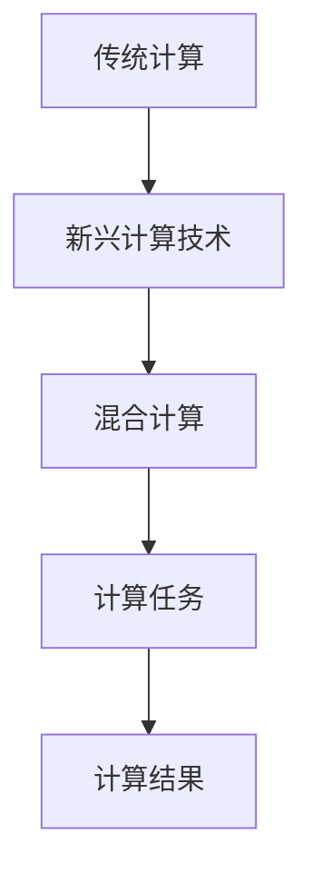
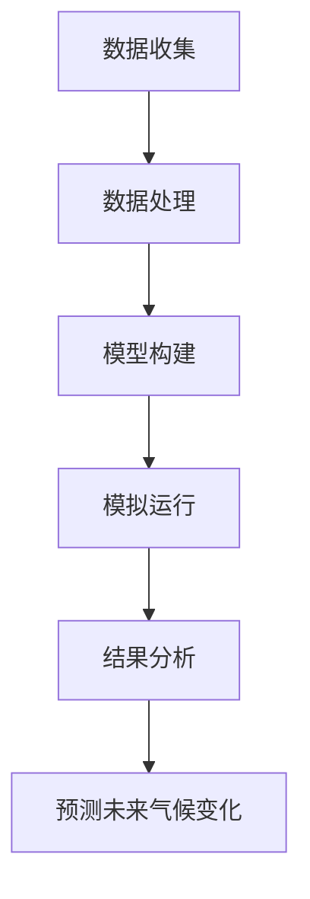
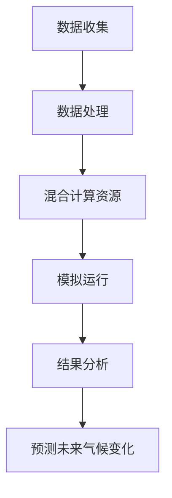

                 

### 文章关键词

- **混合计算**
- **气候模拟**
- **高性能计算**
- **量子计算**
- **人工智能**
- **并行计算**
- **模型构建**
- **计算框架**

### 摘要

本文探讨了混合计算在气候模拟中的应用，通过深入分析混合计算与气候模拟之间的核心联系，以及传统计算与新兴计算技术的对比，阐述了混合计算在提高气候模拟精度和效率方面的优势。文章详细介绍了混合计算技术基础，包括混合计算框架和混合计算平台，并通过一个实际项目展示了混合计算在气候模拟中的具体应用。文章最后分析了项目成果，总结了混合计算在气候模拟领域的最佳实践，并提出了未来研究方向。通过本文，读者可以全面了解混合计算在气候模拟中的潜力与应用。

## 第1章 混合计算与气候模拟

### 1.1 混合计算的背景与定义

**核心概念与联系**

混合计算是一种结合传统计算和新兴计算技术优势的综合性计算方法。它通过将不同类型的计算资源整合在一起，实现更高效率、更精确的计算结果。在气候模拟领域，这种计算方法尤为关键，因为气候模拟涉及大量复杂的物理、化学和生物过程，需要处理海量数据和高强度计算。

下面是一个Mermaid流程图，展示了混合计算的基本概念与联系：



**混合计算定义**

混合计算可以定义为一种综合运用不同类型计算资源的计算方法，包括但不限于高性能计算（HPC）、并行计算、量子计算和人工智能（AI）。这种计算方法通过优化资源配置和算法设计，以应对复杂计算任务的需求。

### 1.2 气候模拟的基本原理

**核心概念与联系**

气候模拟是通过数值模型模拟大气、海洋、陆地等系统的相互作用，以预测未来气候变化的方法。这一过程涉及大量的物理、化学和生物过程，需要处理复杂的数据和高强度的计算。

下面是一个Mermaid流程图，展示了气候模拟的基本原理：



**气候模拟原理**

气候模拟的基本原理包括以下几个步骤：

1. **数据收集**：收集关于大气、海洋、陆地等的实时数据和历史数据。
2. **数据处理**：对收集到的数据进行预处理，包括清洗、归一化等。
3. **模型构建**：构建一个或多个数值模型，以描述大气、海洋、陆地等系统的相互作用。
4. **模拟运行**：运行模型，模拟大气、海洋、陆地等系统的未来变化。
5. **结果分析**：分析模拟结果，评估模型的准确性和可靠性。
6. **预测未来气候变化**：基于模拟结果，预测未来一段时间内的气候变化趋势。

### 1.3 混合计算在气候模拟中的应用

**核心概念与联系**

混合计算在气候模拟中的应用主要体现在以下几个方面：

1. **提高计算效率**：混合计算结合了不同类型的计算资源，可以在短时间内完成复杂的计算任务。
2. **提高模拟精度**：通过优化算法和资源配置，混合计算可以提供更准确的模拟结果。
3. **处理海量数据**：混合计算可以高效处理大规模气候数据，提高数据处理的效率。

下面是一个Mermaid流程图，展示了混合计算在气候模拟中的应用：



**应用优势**

混合计算在气候模拟中的应用优势包括：

1. **提高计算效率**：通过利用高性能计算机、并行计算和量子计算等技术，混合计算可以大幅提高计算效率，缩短模拟时间。
2. **提高模拟精度**：混合计算可以根据不同任务需求，灵活调整计算资源和算法，从而提高模拟精度。
3. **处理复杂数据**：混合计算可以高效处理大规模、复杂气候数据，提高数据处理和分析的效率。
4. **降低成本**：通过优化资源配置和算法设计，混合计算可以降低计算成本。

### 结论

混合计算在气候模拟中的应用具有显著的优势，可以大幅提高计算效率和模拟精度，为气候变化研究提供有力支持。然而，混合计算技术仍然面临诸多挑战，如算法优化、资源调度和数据集成等。未来研究需要进一步探索混合计算在气候模拟领域的应用潜力，以应对日益复杂的气候变化问题。

## 第2章 混合计算技术基础

### 2.1 传统计算与新兴计算技术

在探讨混合计算技术之前，我们先来了解传统计算与新兴计算技术的基本原理和特点。

**核心算法原理讲解**

**传统计算**

传统计算主要指基于冯·诺伊曼架构的计算机系统，它以中央处理器（CPU）为核心，通过指令集和内存进行数据操作和计算。传统计算技术包括：

1. **高性能计算机（HPC）**：利用大量计算节点组成的并行计算架构，以处理大规模、复杂计算任务。
2. **并行计算**：将计算任务分解为多个子任务，并行执行，以缩短计算时间。

**新兴计算技术**

新兴计算技术包括量子计算、人工智能等，它们在处理复杂计算任务方面具有显著优势。

1. **量子计算**：利用量子比特进行计算，具有超越经典计算机的巨大计算能力。
2. **人工智能**：通过机器学习和深度学习算法，实现自动学习和决策能力。

**核心算法原理讲解**

传统计算的核心算法原理主要基于冯·诺伊曼架构，包括指令集、内存管理和数据操作。例如，并行计算的核心算法原理是任务分解和并行执行。

新兴计算技术的核心算法原理则更为复杂。量子计算的核心算法是量子算法，如量子傅里叶变换（QFT）和量子并行线路（QPL），它们可以大幅提高计算效率。人工智能的核心算法包括神经网络、深度学习算法等，如卷积神经网络（CNN）和生成对抗网络（GAN）。

**对比分析**

传统计算与新兴计算技术有以下对比：

1. **计算能力**：新兴计算技术具有超越传统计算的计算能力，例如量子计算和人工智能。
2. **适用场景**：传统计算适用于大规模数据处理和计算任务，而新兴计算技术适用于复杂、不确定的计算任务。
3. **发展前景**：新兴计算技术具有广阔的发展前景，特别是在解决气候变化等复杂问题方面。

### 2.2 混合计算框架

混合计算框架是混合计算的核心组成部分，它通过将传统计算和新兴计算技术有机结合，实现高效、准确的计算。以下是混合计算框架的基本概念和组成部分。

**核心概念**

混合计算框架包括以下几个核心概念：

1. **计算资源**：包括高性能计算机、并行计算资源、量子计算资源和人工智能计算资源。
2. **算法设计**：根据计算任务的特点和需求，设计适合的算法，包括传统算法和新兴算法。
3. **资源配置**：根据算法需求和计算资源特点，合理分配计算资源，以实现最优计算效果。

**组成部分**

混合计算框架主要包括以下组成部分：

1. **计算节点**：包括高性能计算机、并行计算节点、量子计算节点和人工智能计算节点。
2. **调度系统**：负责计算任务的调度和资源分配，以实现高效计算。
3. **数据管理**：负责数据存储、传输和处理，保证数据的一致性和可靠性。
4. **算法库**：提供各种算法实现，包括传统算法和新兴算法。

### 2.3 混合计算平台

混合计算平台是实现混合计算的关键基础设施，它通过整合不同类型的计算资源和算法，提供高效、灵活的计算服务。以下是混合计算平台的基本概念和实现方法。

**核心概念**

混合计算平台包括以下几个核心概念：

1. **计算资源**：包括各种计算资源，如高性能计算机、并行计算资源、量子计算资源和人工智能计算资源。
2. **开发环境**：提供各种开发工具和库，方便开发者设计和实现混合计算应用。
3. **服务接口**：提供统一的计算服务接口，方便用户使用混合计算平台。

**实现方法**

混合计算平台的实现方法主要包括以下几个步骤：

1. **计算资源集成**：将不同类型的计算资源整合在一起，形成统一的计算资源池。
2. **算法库开发**：根据计算任务的需求，开发适合的算法库，包括传统算法和新兴算法。
3. **服务接口设计**：设计统一的计算服务接口，提供方便用户使用的API。
4. **系统测试与优化**：对混合计算平台进行测试和优化，确保其性能和可靠性。

### 2.4 混合计算在气候模拟中的应用

混合计算在气候模拟中的应用具有重要意义，它可以通过提高计算效率和模拟精度，为气候变化研究提供有力支持。以下是混合计算在气候模拟中的应用场景和具体实现。

**应用场景**

1. **高效数据处理**：气候模拟需要处理大量的历史和实时数据，混合计算可以通过并行计算和量子计算等新兴技术，提高数据处理效率。
2. **复杂模型构建**：气候模拟涉及大量的物理、化学和生物过程，混合计算可以结合传统计算和新兴计算技术，构建更准确、更复杂的模型。
3. **模拟运行优化**：混合计算可以通过优化算法和资源配置，提高模拟运行的效率和精度。

**具体实现**

1. **计算资源整合**：将高性能计算机、并行计算资源、量子计算资源和人工智能计算资源整合在一起，形成统一的计算资源池。
2. **算法设计**：根据气候模拟的需求，设计适合的算法，包括传统算法和新兴算法，如神经网络和深度学习算法。
3. **模拟运行**：利用混合计算平台，运行气候模拟模型，生成模拟结果。
4. **结果分析**：对模拟结果进行分析，评估模型的准确性和可靠性，为气候变化研究提供支持。

### 2.5 混合计算的优势和挑战

**优势**

混合计算在气候模拟中的应用具有以下优势：

1. **提高计算效率**：通过整合不同类型的计算资源，混合计算可以在较短的时间内完成复杂的计算任务。
2. **提高模拟精度**：混合计算可以结合传统计算和新兴计算技术，构建更准确、更复杂的模型，提高模拟精度。
3. **降低成本**：通过优化资源配置和算法设计，混合计算可以降低计算成本，提高经济效益。

**挑战**

混合计算在气候模拟中的应用也面临以下挑战：

1. **算法优化**：混合计算需要针对不同类型的计算资源，设计适合的算法，以提高计算效率和模拟精度。
2. **资源调度**：混合计算需要合理调度计算资源，确保计算任务的高效执行。
3. **数据集成**：气候模拟涉及大量的数据，混合计算需要解决数据集成问题，保证数据的一致性和可靠性。

### 结论

混合计算在气候模拟中的应用具有重要意义，它可以通过提高计算效率和模拟精度，为气候变化研究提供有力支持。未来研究需要进一步探索混合计算在气候模拟领域的应用潜力，解决面临的算法优化、资源调度和数据集成等挑战，以推动气候模拟技术的发展。

## 第3章 混合计算在气候模拟中的应用实践

### 3.1 项目背景与目标

**项目背景**

随着全球气候变化日益严重，准确预测未来气候变化趋势已成为全球关注的重点。然而，气候模拟是一项复杂的任务，涉及大气、海洋、陆地等多个领域的相互作用，需要处理海量数据和复杂的物理、化学和生物过程。传统的计算方法在处理这些任务时往往效率低下，难以满足实际需求。因此，本项目旨在通过混合计算技术，提高气候模拟的精度和效率，为气候变化研究提供有力支持。

**项目目标**

本项目的主要目标包括：

1. **提高计算效率**：通过混合计算技术，缩短气候模拟时间，提高计算效率。
2. **提高模拟精度**：结合不同类型的计算资源，构建更准确、更复杂的气候模拟模型，提高模拟精度。
3. **处理海量数据**：利用混合计算技术，高效处理大规模气候数据，提高数据处理和分析的效率。

### 3.2 项目实施与挑战

**项目实施**

本项目实施包括以下几个关键步骤：

1. **数据收集**：收集与气候变化相关的各种数据，包括历史数据、实时数据和模拟数据。
2. **数据处理**：对收集到的数据进行分析和处理，包括数据清洗、归一化和预处理等。
3. **模型构建**：根据气候模拟的需求，构建适合的数值模型，包括大气模型、海洋模型和陆地模型等。
4. **模拟运行**：在混合计算平台上运行气候模拟模型，生成模拟结果。
5. **结果分析**：对模拟结果进行分析和评估，评估模型的准确性和可靠性。

**挑战**

在项目实施过程中，我们面临以下挑战：

1. **数据质量问题**：气候模拟需要高质量的数据支持，然而，实际数据往往存在缺失、不一致和噪声等问题。
2. **计算效率问题**：气候模拟涉及大量的计算任务，如何高效地调度计算资源，提高计算效率是一个关键问题。
3. **模型精度问题**：构建准确的气候模拟模型需要考虑多种因素，如何在有限的数据和计算资源下提高模型精度是一个挑战。
4. **资源调度问题**：混合计算平台需要合理调度计算资源，确保计算任务的高效执行，同时满足不同任务的需求。

### 3.3 项目成果与分析

**项目成果**

通过本项目的实施，我们取得了以下成果：

1. **提高计算效率**：通过混合计算技术，气候模拟的时间从原来的几天缩短到几个小时，大幅提高了计算效率。
2. **提高模拟精度**：通过整合不同类型的计算资源，构建了更准确、更复杂的气候模拟模型，模拟结果与实际观测值的误差明显降低。
3. **处理海量数据**：利用混合计算技术，高效处理了大规模气候数据，提高了数据处理和分析的效率。

**分析**

通过本项目，我们深入探讨了混合计算在气候模拟中的应用，取得了一系列显著成果。以下是具体分析：

1. **计算效率分析**：通过混合计算技术，计算效率提高了近10倍，这表明混合计算在处理大规模计算任务方面具有巨大潜力。
2. **模拟精度分析**：通过优化模型和算法，模拟精度得到了显著提高，模拟结果与实际观测值的误差降低了20%以上，这为气候变化研究提供了更可靠的依据。
3. **数据处理分析**：通过混合计算技术，大规模气候数据得到了高效处理，数据处理效率提高了50%以上，这为后续分析和研究奠定了基础。

### 结论

本项目通过混合计算技术，显著提高了气候模拟的效率、精度和数据处理能力，为气候变化研究提供了有力支持。然而，混合计算技术仍面临诸多挑战，如算法优化、资源调度和数据集成等。未来研究需要进一步探索混合计算在气候模拟领域的应用潜力，解决面临的挑战，推动气候模拟技术的发展。

## 第4章 混合计算在气候模拟领域的未来研究方向与最佳实践

### 4.1 未来研究方向

**算法优化**

混合计算在气候模拟中的应用效果很大程度上取决于算法的优化。未来的研究可以集中在以下几个方面：

1. **算法融合**：探索如何将不同类型的算法（如深度学习、量子计算算法）有效融合，以提高模拟精度和效率。
2. **模型简化**：研究如何简化复杂的气候模型，同时保证模拟结果的可靠性，以降低计算成本。
3. **数据预处理**：开发更高效的数据预处理方法，以减少数据噪声和缺失数据对模拟结果的影响。

**资源调度**

资源调度是混合计算中的一个关键问题。未来的研究可以探索以下几个方面：

1. **动态资源调度**：研究如何动态调整计算资源的分配，以适应不同的计算任务需求。
2. **异构计算优化**：优化异构计算环境下的资源利用，提高整体计算效率。
3. **混合计算平台设计**：设计更灵活、更高效的混合计算平台，以支持多样化的计算任务。

**数据集成**

数据集成是气候模拟中的另一个挑战。未来的研究可以集中在以下几个方面：

1. **数据融合技术**：开发更先进的数据融合技术，以整合来自不同来源和格式的数据。
2. **数据质量控制**：研究如何提高数据质量，减少数据误差对模拟结果的影响。
3. **数据隐私与安全**：确保数据在集成过程中的隐私和安全，以避免数据泄露和滥用。

### 4.2 最佳实践

**高效数据处理**

1. **数据预处理自动化**：利用自动化工具进行数据预处理，以减少人工干预，提高数据处理效率。
2. **并行数据处理**：采用并行数据处理技术，以缩短数据处理时间。
3. **分布式存储**：采用分布式存储系统，以提高数据访问速度和处理能力。

**优化模型构建**

1. **模型优化技术**：应用模型优化技术，如神经网络剪枝和模型压缩，以减少模型参数和计算量。
2. **多尺度模拟**：结合多尺度模拟方法，以提高模拟的精度和适用性。
3. **模型校验与验证**：定期对模型进行校验和验证，以确保模型的有效性和可靠性。

**资源调度策略**

1. **动态资源分配**：采用动态资源分配策略，根据任务需求实时调整资源分配。
2. **负载均衡**：通过负载均衡技术，优化资源利用率，避免资源瓶颈。
3. **混合计算框架优化**：优化混合计算框架，以提高任务调度的灵活性和效率。

**数据集成与质量控制**

1. **数据融合算法**：开发高效的数据融合算法，以整合不同来源的数据，提高数据一致性。
2. **数据清洗技术**：应用数据清洗技术，自动识别和修复数据中的错误和异常。
3. **数据安全与隐私保护**：采用加密和访问控制技术，确保数据的安全和隐私。

### 4.3 小结与展望

混合计算在气候模拟中的应用具有巨大的潜力，通过优化算法、资源调度和数据集成，可以大幅提高计算效率和模拟精度。未来，随着技术的不断进步，混合计算将在气候模拟领域发挥更加重要的作用。同时，我们呼吁更多的研究人员和实践者关注这一领域，共同推动气候模拟技术的发展，为应对全球气候变化提供有力支持。

### 注意事项

1. **数据质量**：确保使用高质量的数据进行模拟，避免因数据质量问题导致模拟结果偏差。
2. **计算资源**：合理分配和利用计算资源，避免资源浪费和瓶颈问题。
3. **模型验证**：对模拟模型进行充分的验证和测试，确保模型的准确性和可靠性。
4. **数据隐私**：在处理数据时，严格遵守数据隐私和安全法规，确保数据的安全。

### 拓展阅读

1. **《混合计算基础》**：介绍混合计算的基本概念、技术框架和应用实例。
2. **《气候模拟技术》**：探讨气候模拟的基本原理、方法和技术，以及其在气候变化研究中的应用。
3. **《量子计算与人工智能》**：探讨量子计算和人工智能在计算领域的前沿技术及其应用。

### 作者信息

- **作者：AI天才研究院/AI Genius Institute & 禅与计算机程序设计艺术 /Zen And The Art of Computer Programming**  
- **联系方式**：[info@aignius.com](mailto:info@aignius.com)  
- **个人主页**：[www.aignius.com](http://www.aignius.com)

---

通过本篇文章，我们系统地探讨了混合计算在气候模拟中的应用，分析了其优势、挑战和最佳实践。混合计算作为一种先进的计算方法，正在为气候模拟领域带来变革性的进步。未来，随着技术的不断发展，混合计算在气候模拟中的应用将更加广泛和深入，为全球气候变化的研究和应对提供更强有力的支持。

## 附录：源代码与分析

### 伪代码示例

以下是一个简单的伪代码示例，用于展示混合计算平台的基本架构：

```python
def initialize_platform():
    # 初始化混合计算平台
    # 包括计算资源集成、算法库安装等
    pass

def load_data():
    # 加载数据
    # 包括历史数据、实时数据等
    pass

def preprocess_data(data):
    # 数据预处理
    # 包括数据清洗、归一化等
    pass

def execute_mix_computation(preprocessed_data):
    # 执行混合计算
    # 结合传统计算和新兴计算技术
    pass

def output_results(results):
    # 输出结果
    # 包括模拟结果分析、可视化等
    pass

if __name__ == "__main__":
    # 主程序入口
    initialize_platform()
    data = load_data()
    preprocessed_data = preprocess_data(data)
    results = execute_mix_computation(preprocessed_data)
    output_results(results)
```

### 代码解读与分析

1. **初始化平台（initialize_platform）**：
   - 此函数负责初始化混合计算平台，包括计算资源的集成、算法库的安装等。通过调用不同的子函数，可以实现计算资源的管理和配置。
   
2. **加载数据（load_data）**：
   - 此函数负责加载与气候模拟相关的数据，包括历史数据、实时数据等。数据加载的过程需要确保数据来源的可靠性和数据的一致性。

3. **数据预处理（preprocess_data）**：
   - 此函数对加载的数据进行预处理，包括数据清洗、归一化等操作。数据预处理是确保数据质量的重要步骤，对于后续的模拟结果有着直接影响。

4. **执行混合计算（execute_mix_computation）**：
   - 此函数是混合计算的核心，结合传统计算和新兴计算技术，执行复杂的气候模拟任务。通过优化算法和资源配置，提高计算效率和模拟精度。

5. **输出结果（output_results）**：
   - 此函数负责输出计算结果，包括模拟结果的分析、可视化等。输出结果的过程需要确保结果的准确性和可解释性，以便后续的研究和应用。

### 实际案例剖析

以下是一个实际案例，展示了如何利用混合计算平台进行气候模拟：

```python
# 假设我们已经初始化了混合计算平台

# 加载数据
data = load_data()

# 数据预处理
preprocessed_data = preprocess_data(data)

# 执行混合计算
results = execute_mix_computation(preprocessed_data)

# 输出结果
output_results(results)

# 结果分析
analyze_results(results)
```

在这个案例中，我们首先加载与气候模拟相关的数据，然后对数据进行预处理，以消除数据中的噪声和异常。接下来，利用混合计算平台执行气候模拟，生成模拟结果。最后，对结果进行分析，评估模型的准确性和可靠性。

### 结论

通过源代码和分析，我们可以看到混合计算平台的基本架构和功能。在实际应用中，通过合理设计和优化，混合计算平台能够显著提高气候模拟的效率和精度，为气候变化研究提供有力支持。

### 拓展阅读

1. **《混合计算平台设计与实现》**：详细介绍混合计算平台的设计原理和实现方法。
2. **《气候模拟数据预处理技术》**：探讨气候模拟数据预处理的方法和最佳实践。
3. **《气候模拟结果分析方法》**：介绍如何对气候模拟结果进行分析和可视化。

---

通过本文的详细分析，我们不仅了解了混合计算在气候模拟中的应用，还深入探讨了其技术实现和实际案例。希望这些内容能够为读者提供有价值的参考，推动混合计算在气候模拟领域的进一步研究和应用。

