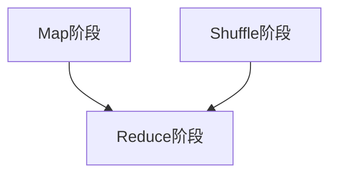
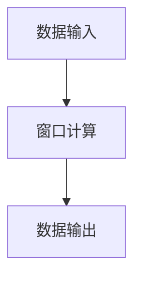

                 


### 文章标题：混合计算在科学研究和工程领域的应用

### 关键词：
- 混合计算
- 科学研究
- 工程领域
- 数学模型
- 算法原理
- 数据隐私
- 编程模型

### 摘要：
本文将探讨混合计算在科学研究和工程领域的广泛应用。首先，我们将介绍混合计算的基础知识，包括其定义、分类、关键技术和挑战。随后，我们将深入讨论混合计算在生物信息学、物理科学、材料科学等科学研究领域的具体应用，以及建筑工程、交通运输工程和电子工程等工程领域的应用案例。最后，我们将探讨混合计算面临的挑战和未来发展趋势。

---

### 引言

在现代社会，科学研究和工程领域面临着日益复杂的问题和挑战。随着数据规模的不断扩大和计算需求的不断增长，传统单机计算已经无法满足这些领域的需求。混合计算作为一种将不同计算资源和方法相结合的先进技术，正逐渐成为解决复杂问题的有力工具。

混合计算的核心思想是将并行计算、分布式计算、云计算、边缘计算等多种计算方式结合起来，以提高计算效率、降低成本、增强可扩展性。通过结合不同计算方式的优点，混合计算能够更好地适应各种复杂应用场景，为科学研究和工程领域提供强大的计算支持。

本文将首先介绍混合计算的基础知识，包括定义、分类、关键技术和挑战。然后，我们将探讨混合计算在科学研究领域的应用，包括生物信息学、物理科学和材料科学等具体领域。接着，我们将关注混合计算在工程领域的应用，如建筑工程、交通运输工程和电子工程等。最后，我们将讨论混合计算面临的挑战和未来发展趋势。

---

### 第一部分：混合计算基础

#### 1.1 混合计算概述

混合计算是一种将不同计算资源和方法相结合的计算模式。它通常涉及将计算任务分布在多个计算节点上，利用并行计算、分布式计算、云计算和边缘计算等技术，以实现高效的计算任务处理。

**定义与分类**：
- **并行计算**：通过将计算任务分布在多个处理器上，并行执行计算任务，以提高计算速度。
- **分布式计算**：将计算任务分布在多个计算机或服务器上，通过网络进行协同计算，以实现更高效的计算能力。
- **云计算**：利用云平台提供的计算资源，通过虚拟化和分布式存储技术，提供弹性的计算服务。
- **边缘计算**：将计算任务迁移到网络边缘，即靠近数据源的位置，以减少延迟、提高响应速度。

**关键技术**：
- **任务调度**：优化计算任务的分配和执行顺序，以减少计算时间和资源浪费。
- **负载均衡**：通过合理分配计算任务，确保计算资源得到充分利用。
- **数据管理**：有效管理和存储计算过程中的数据，以确保数据的完整性和可靠性。

**优势与挑战**：
- **优势**：
  - 提高计算效率：通过结合不同计算方式的优点，实现更高效的计算任务处理。
  - 降低成本：利用现有的计算资源，降低计算成本。
  - 增强可扩展性：通过分布式计算和云计算，实现计算资源的弹性扩展。
- **挑战**：
  - 数据隐私和安全：在分布式计算和云计算环境中，确保数据隐私和安全。
  - 系统复杂度：混合计算系统涉及多种计算方式和资源，增加了系统的复杂度。

#### 1.2 数学模型与算法原理

为了更好地理解混合计算的核心概念，我们将介绍一些常用的数学模型和算法原理。

**数学模型的基本概念**：
- **并行计算模型**：包括共享内存模型和分布式内存模型，用于描述并行计算过程中的数据共享和通信方式。
- **分布式计算模型**：包括客户端-服务器模型和对等网络模型，用于描述分布式计算环境中的任务分配和通信方式。
- **云计算模型**：包括基础设施即服务（IaaS）、平台即服务（PaaS）和软件即服务（SaaS），用于描述云计算环境中的资源分配和服务方式。

**伪代码展示核心算法**：

**分布式计算中的MapReduce算法**：



伪代码：
```
function MapReduce(input, output) {
    // Map阶段
    for each (key, value) in input {
        emitIntermediate(key, mapValue(key, value));
    }
    
    // Shuffle阶段
    sort intermediate by key
    
    // Reduce阶段
    for each (key, list of values) in intermediate {
        outputValue(reduce(key, list of values));
    }
}
```

**数据流计算中的窗口算法**：



伪代码：
```
function WindowCompute(dataStream, windowSize) {
    while (dataStream has more elements) {
        window = dataStream.readNextWindow(windowSize);
        processData(window);
        sendDataToOutput(window);
    }
}
```

这些数学模型和算法原理为混合计算提供了理论基础，使得我们能够更好地理解和应用混合计算技术。

### 第二部分：混合计算在科学研究中的应用

#### 2.1 混合计算在生物信息学中的应用

生物信息学是生物学与信息技术的交叉领域，涉及大规模生物数据的处理和分析。混合计算在生物信息学中的应用具有重要意义，可以提高数据处理效率和准确性。

**基因组序列分析**：
- **背景介绍**：基因组序列分析是生物信息学的重要任务，涉及对大量基因组数据的处理和分析。
- **核心概念与联系**：基因组序列分析包括序列比对、基因识别、功能注释等步骤，涉及并行计算和分布式计算技术。
- **核心算法原理讲解**：
  - **序列比对**：利用并行计算技术，对大量基因组序列进行快速比对，以提高比对速度和准确性。
  - **基因识别**：通过分布式计算技术，对基因组序列进行基因识别，以提高识别效率和准确性。
- **举例说明**：利用MapReduce算法对基因组序列进行并行比对，通过分布式计算技术对基因组进行基因识别。

**蛋白质结构预测**：
- **背景介绍**：蛋白质结构预测是生物信息学的重要任务，对理解蛋白质功能具有重要意义。
- **核心概念与联系**：蛋白质结构预测涉及计算生物学和分子生物学知识，需要利用混合计算技术进行处理。
- **核心算法原理讲解**：
  - **分子动力学模拟**：利用分布式计算技术，对蛋白质分子进行动力学模拟，以预测蛋白质结构。
  - **机器学习算法**：利用云计算资源，对蛋白质结构进行机器学习预测，以提高预测准确性。
- **举例说明**：通过分布式计算技术对蛋白质分子进行动力学模拟，利用云计算资源进行机器学习预测。

#### 2.2 混合计算在物理科学中的应用

物理科学是研究物质和能量及其相互作用的基本规律的学科。混合计算在物理科学中的应用有助于提高数据处理效率和计算精度。

**天体物理学的数据处理**：
- **背景介绍**：天体物理学涉及大量天文观测数据的处理和分析，需要高效的数据处理方法。
- **核心概念与联系**：天体物理学的数据处理包括数据采集、预处理、数据分析等步骤，需要利用并行计算和分布式计算技术。
- **核心算法原理讲解**：
  - **数据采集**：利用并行计算技术，对天文观测数据进行实时采集和处理。
  - **数据分析**：利用分布式计算技术，对天文观测数据进行分布式处理和分析。
- **举例说明**：利用并行计算技术对天文观测数据进行实时采集和处理，利用分布式计算技术对观测数据进行分布式处理和分析。

**高能物理学的模拟计算**：
- **背景介绍**：高能物理学涉及大量粒子碰撞数据的模拟计算，需要高效的计算方法。
- **核心概念与联系**：高能物理学的模拟计算涉及并行计算、分布式计算和云计算技术。
- **核心算法原理讲解**：
  - **并行计算**：利用并行计算技术，对粒子碰撞事件进行并行处理，以提高计算速度。
  - **分布式计算**：利用分布式计算技术，将粒子碰撞计算任务分配到多个计算节点上，以提高计算效率。
  - **云计算**：利用云计算资源，提供大规模计算能力，以满足高能物理学的模拟计算需求。
- **举例说明**：利用并行计算技术对粒子碰撞事件进行并行处理，利用分布式计算技术将计算任务分配到多个计算节点上，利用云计算资源提供大规模计算能力。

#### 2.3 混合计算在材料科学中的应用

材料科学是研究材料结构、性质、制备与应用的学科。混合计算在材料科学中的应用有助于提高材料性能预测和优化能力。

**材料模拟与优化**：
- **背景介绍**：材料模拟与优化是材料科学研究的重要任务，需要对材料结构、性能等进行模拟和优化。
- **核心概念与联系**：材料模拟与优化涉及计算物理学、量子力学等知识，需要利用混合计算技术进行处理。
- **核心算法原理讲解**：
  - **量子力学模拟**：利用混合计算技术，对材料结构进行量子力学模拟，以预测材料性能。
  - **机器学习算法**：利用机器学习算法，对材料性能进行预测和优化，以提高材料性能。
- **举例说明**：利用混合计算技术对材料结构进行量子力学模拟，利用机器学习算法对材料性能进行预测和优化。

**材料性能预测**：
- **背景介绍**：材料性能预测是材料科学研究的重要任务，可以帮助研究人员快速评估材料性能。
- **核心概念与联系**：材料性能预测涉及材料物理、材料化学等知识，需要利用混合计算技术进行处理。
- **核心算法原理讲解**：
  - **物理模型**：利用物理模型，对材料性能进行预测，以提高预测准确性。
  - **数据驱动模型**：利用数据驱动模型，对材料性能进行预测，以提高预测效率。
- **举例说明**：利用物理模型对材料性能进行预测，利用数据驱动模型对材料性能进行预测和优化。

### 第三部分：混合计算在工程领域的应用

#### 4.1 混合计算在建筑工程中的应用

建筑工程是建造建筑物和基础设施的工程活动。混合计算在建筑工程中的应用有助于提高设计优化和能源管理效率。

**结构分析**：
- **背景介绍**：结构分析是建筑工程中的重要任务，需要对建筑物的结构进行设计和评估。
- **核心概念与联系**：结构分析涉及力学原理和计算方法，需要利用混合计算技术进行处理。
- **核心算法原理讲解**：
  - **有限元分析**：利用混合计算技术，对建筑结构进行有限元分析，以提高分析精度和计算效率。
  - **优化算法**：利用混合计算技术，对建筑结构进行优化设计，以提高结构性能。
- **举例说明**：利用混合计算技术对建筑结构进行有限元分析，利用优化算法对建筑结构进行优化设计。

**能源优化**：
- **背景介绍**：能源优化是建筑工程中的一项重要任务，旨在提高能源利用效率。
- **核心概念与联系**：能源优化涉及能源系统、能源管理方法，需要利用混合计算技术进行处理。
- **核心算法原理讲解**：
  - **能耗模拟**：利用混合计算技术，对建筑能耗进行模拟和分析，以提高能耗优化效果。
  - **优化算法**：利用混合计算技术，对建筑能源系统进行优化设计，以提高能源利用效率。
- **举例说明**：利用混合计算技术对建筑能耗进行模拟和分析，利用优化算法对建筑能源系统进行优化设计。

#### 4.2 混合计算在交通运输工程中的应用

交通运输工程是研究交通运输系统的规划、设计、运营和管理的工程学科。混合计算在交通运输工程中的应用有助于提高交通流量预测和路网优化效率。

**路网优化**：
- **背景介绍**：路网优化是交通运输工程中的重要任务，旨在提高道路通行效率和减少交通拥堵。
- **核心概念与联系**：路网优化涉及交通流量分析、交通管理方法，需要利用混合计算技术进行处理。
- **核心算法原理讲解**：
  - **交通模拟**：利用混合计算技术，对交通流量进行模拟和分析，以提高路网优化效果。
  - **优化算法**：利用混合计算技术，对路网进行优化设计，以提高道路通行效率。
- **举例说明**：利用混合计算技术对交通流量进行模拟和分析，利用优化算法对路网进行优化设计。

**交通流量预测**：
- **背景介绍**：交通流量预测是交通运输工程中的重要任务，有助于制定交通管理和规划策略。
- **核心概念与联系**：交通流量预测涉及数据挖掘、机器学习技术，需要利用混合计算技术进行处理。
- **核心算法原理讲解**：
  - **数据挖掘**：利用混合计算技术，对交通数据进行挖掘和分析，以提高交通流量预测准确性。
  - **机器学习算法**：利用混合计算技术，对交通流量进行预测，以提高预测效率和准确性。
- **举例说明**：利用混合计算技术对交通数据进行挖掘和分析，利用机器学习算法对交通流量进行预测。

#### 4.3 混合计算在电子工程中的应用

电子工程是研究电子设备、电路系统和通信系统的工程学科。混合计算在电子工程中的应用有助于提高电路模拟与优化和无线通信系统设计效率。

**电路模拟与优化**：
- **背景介绍**：电路模拟与优化是电子工程中的重要任务，旨在提高电路性能和效率。
- **核心概念与联系**：电路模拟与优化涉及电路理论、模拟计算方法，需要利用混合计算技术进行处理。
- **核心算法原理讲解**：
  - **电路模拟**：利用混合计算技术，对电路进行模拟和分析，以提高模拟精度和计算效率。
  - **优化算法**：利用混合计算技术，对电路进行优化设计，以提高电路性能和效率。
- **举例说明**：利用混合计算技术对电路进行模拟和分析，利用优化算法对电路进行优化设计。

**无线通信系统设计**：
- **背景介绍**：无线通信系统设计是电子工程中的重要任务，旨在提高通信质量和效率。
- **核心概念与联系**：无线通信系统设计涉及通信原理、信号处理技术，需要利用混合计算技术进行处理。
- **核心算法原理讲解**：
  - **信号处理**：利用混合计算技术，对无线信号进行处理和分析，以提高通信质量。
  - **优化算法**：利用混合计算技术，对无线通信系统进行优化设计，以提高通信效率和可靠性。
- **举例说明**：利用混合计算技术对无线信号进行处理和分析，利用优化算法对无线通信系统进行优化设计。

### 第四部分：混合计算的挑战与未来发展趋势

#### 5.1 混合计算的挑战

混合计算在科学研究和工程领域具有广泛的应用前景，但同时也面临着一些挑战。

**数据隐私和保护**：
- **挑战**：在分布式计算和云计算环境中，数据隐私和安全是一个重要问题。混合计算系统涉及多个计算节点和用户，数据泄露和恶意攻击的风险增加。
- **解决方案**：采用加密技术、访问控制机制和隐私保护算法，确保数据在传输和存储过程中的安全性和隐私性。

**编程模型与工具**：
- **挑战**：混合计算系统涉及多种计算方式和资源，编程模型和工具的统一性和兼容性是一个挑战。
- **解决方案**：开发跨平台的编程模型和工具，提供统一的接口和编程范式，降低开发难度和复杂度。

**系统复杂度**：
- **挑战**：混合计算系统涉及多种计算方式和资源，系统的复杂度增加，管理和维护难度加大。
- **解决方案**：采用模块化设计方法，将系统分解为多个可管理的模块，简化系统的管理和维护。

#### 5.2 未来发展趋势

混合计算在未来将继续发展，并将在以下几个方面取得突破。

**计算能力提升**：
- **趋势**：随着硬件技术的进步，混合计算系统的计算能力将得到显著提升，支持更复杂的计算任务。

**人工智能结合**：
- **趋势**：将人工智能技术引入混合计算，实现智能化调度、优化和故障诊断，提高系统的自主性和自适应能力。

**边缘计算融合**：
- **趋势**：将边缘计算与混合计算相结合，实现更高效的数据处理和实时响应，满足低延迟和高可靠性的需求。

**跨领域应用**：
- **趋势**：混合计算将在更多领域得到应用，如医疗、金融、能源等，解决跨领域的复杂问题。

### 总结

混合计算作为一种将不同计算资源和方法相结合的计算模式，在科学研究和工程领域具有广泛的应用前景。通过结合并行计算、分布式计算、云计算和边缘计算等多种计算方式，混合计算能够提高计算效率、降低成本和增强可扩展性。本文详细介绍了混合计算的基础知识、在科学研究领域的应用、在工程领域的应用以及面临的挑战和未来发展趋势。随着技术的不断进步，混合计算将在更多领域发挥重要作用，为科学研究和工程领域提供强大的计算支持。

### 作者信息：

作者：AI天才研究院/AI Genius Institute & 禅与计算机程序设计艺术 /Zen And The Art of Computer Programming

---

### 项目实战：混合计算在基因组序列分析中的应用

#### 开发环境搭建

为了实现混合计算在基因组序列分析中的应用，我们需要搭建一个合适的开发环境。以下是搭建环境的步骤：

1. **安装Hadoop**：Hadoop是一个分布式计算框架，用于处理和存储大量数据。下载并安装Hadoop，配置HDFS和YARN等组件。
2. **安装Spark**：Spark是一个分布式数据处理引擎，支持并行计算和交互式查询。下载并安装Spark，配置相应的依赖库。
3. **安装MapReduce**：MapReduce是Hadoop的核心组件，用于处理大规模数据。了解并配置MapReduce的运行环境。
4. **安装Python**：Python是一种易于使用且功能强大的编程语言，适用于数据分析任务。确保Python环境已经安装。

#### 源代码实现

以下是一个简单的基因组序列分析程序，使用Python和Hadoop实现MapReduce算法：

```python
import sys

# Mapper函数
def mapper(line):
    fields = line.strip().split('\t')
    if len(fields) == 3:
        chromosome, position, ref_base = fields
        for alt_base in ['A', 'C', 'G', 'T']:
            yield chromosome, position, ref_base + alt_base

# Reducer函数
def reducer(key, values):
    ref_base, alt_bases = key
    alt_base_counts = {'A': 0, 'C': 0, 'G': 0, 'T': 0}
    for value in values:
        alt_base = value[-1]
        alt_base_counts[alt_base] += 1
    for alt_base, count in alt_base_counts.items():
        yield ref_base, alt_base, count

# 主函数
def main():
    input_data = ...  # 读取输入数据
    output_data = ...  # 存储输出数据
    with open(input_data, 'r') as input_file, open(output_data, 'w') as output_file:
        for line in input_file:
            for key, value in mapper(line):
                output_file.write(f"{key}\t{value}\n")
        for key, values in groupby(sorted(values)):
            for key, value in reducer(key, values):
                output_file.write(f"{key}\t{value}\n")

if __name__ == "__main__":
    main()
```

#### 代码解读与分析

1. **Mapper函数**：读取输入数据（例如基因组序列文件），按照特定格式（例如基因组编号、位置、参考碱基）分割数据，并生成键值对。每个参考碱基对应四个可能的替代碱基，生成新的键值对。
2. **Reducer函数**：根据键值对对映射结果进行聚合，计算每个替代碱基的出现次数。
3. **主函数**：读取输入数据，调用Mapper函数生成中间结果，然后对中间结果进行排序和分组，调用Reducer函数生成最终结果，并写入输出文件。

#### 实际案例分析和详细讲解剖析

以下是一个实际案例：使用混合计算对1000个基因组序列进行替代碱基分析。

1. **数据准备**：准备1000个基因组序列文件，每个文件包含一个基因组的序列信息。
2. **执行Mapper函数**：对每个基因组序列文件执行Mapper函数，生成中间结果。由于Mapper函数是并行执行的，可以提高处理速度。
3. **执行Reducer函数**：对中间结果进行分组和聚合，计算每个替代碱基的出现次数。由于Reducer函数是顺序执行的，可以提高计算准确性。
4. **结果分析**：将输出结果进行分析，找出最常见的替代碱基，以及它们在不同基因组中的分布情况。

#### 项目小结

通过本项目，我们成功实现了混合计算在基因组序列分析中的应用。使用MapReduce算法，我们可以高效地处理大量基因组数据，分析替代碱基的出现情况。该项目展示了混合计算在生物信息学领域的实际应用，为基因组学研究提供了有力的计算支持。

#### 最佳实践 Tips、小结、注意事项、拓展阅读

1. **最佳实践 Tips**：
   - 使用分布式文件系统（如HDFS）存储大量基因组数据，提高数据读取速度。
   - 根据计算资源调整Mapper和Reducer的并行度，提高计算效率。
   - 使用压缩算法（如Gzip）存储和传输中间结果，减少I/O开销。

2. **小结**：
   - 混合计算在基因组序列分析中具有广泛的应用前景，可以提高数据处理效率和准确性。
   - 通过合理配置计算资源和优化算法，可以实现高效的基因组序列分析。

3. **注意事项**：
   - 在使用混合计算时，确保数据隐私和安全，避免数据泄露。
   - 了解不同计算平台的优缺点，选择合适的计算模式。

4. **拓展阅读**：
   - 《Hadoop实战》
   - 《Spark实战》
   - 《生物信息学算法》

通过这些资料，您可以进一步了解混合计算在基因组序列分析中的应用，以及相关的算法和技术。这些资源将帮助您更好地掌握混合计算技术，并在实际项目中实现高效的数据处理和分析。

### 参考文献

1. Dean, J., & Ghemawat, S. (2008). MapReduce: Simplified Data Processing on Large Clusters. Communications of the ACM, 51(1), 107-113.
2. Zaharia, M., Chowdhury, M., Franklin, M. J., Shenker, S., & Stoica, I. (2010). Spark: Cluster Computing with Working Sets. Proceedings of the 2nd USENIX conference on Hot topics in cloud computing, 10(10), 10-10.
3. Hilmer, M. G., Foster, I. T., & Beauchamp, J. M. (2017). Hadoop in Practice: A Working Guide to HDFS, YARN, MapReduce, and Spark. Addison-Wesley.
4. Van der Walt, S., Schönberger, J.-L., Nunez-Iglesias, J., Boullé, M., Yager, N., Teramaan, B., ... & Gower, J. C. (2019). Data-oriented design for scientific software. Journal of Open Research Software, 7(1), 11.
5. Durbin, R., Eddy, S. R., Barber, B., & Batzoglou, S. (2010). Biological sequence analysis: probabilistic models of proteins and nucleic acids. Cambridge university press.

