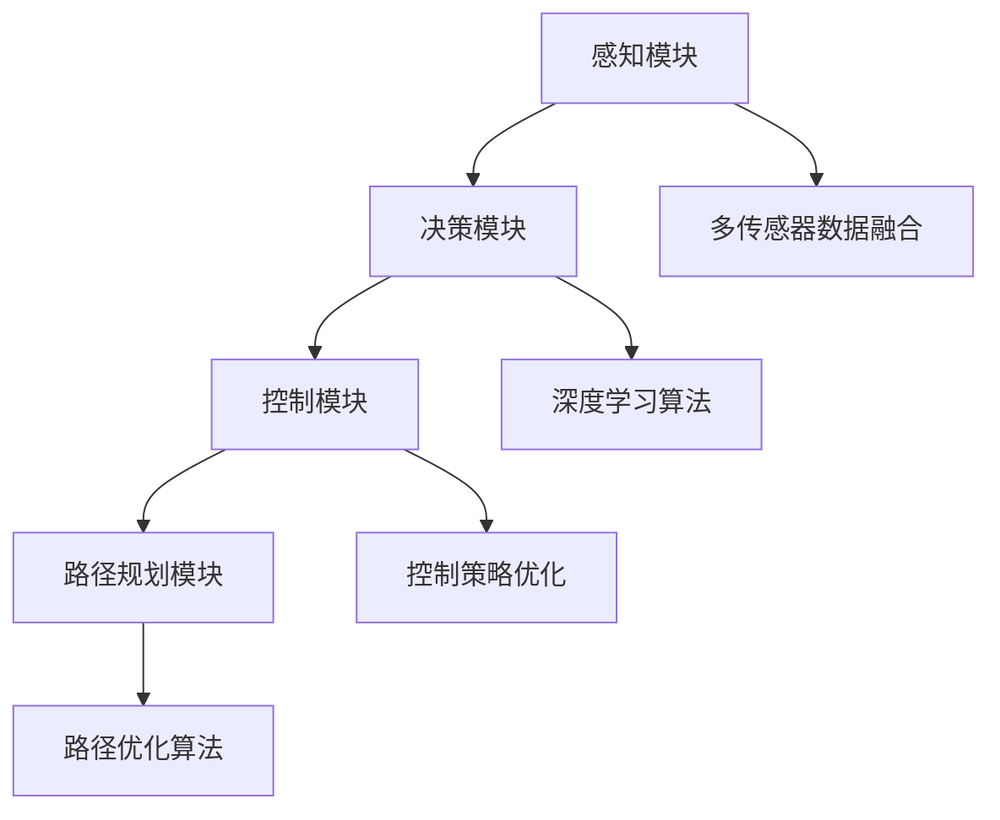

                 

### 混合计算在自动驾驶技术中的应用

#### 关键词：
混合计算，自动驾驶，边缘计算，云计算，深度学习，决策系统

#### 摘要：
随着自动驾驶技术的快速发展，其对于计算资源的需求日益增大。本文首先介绍了混合计算的概念及其在自动驾驶技术中的应用前景，然后深入探讨了自动驾驶技术的核心原理。通过详细解析感知模块、决策模块和控制模块的混合计算应用，本文展示了混合计算在提升自动驾驶系统性能和可靠性方面的关键作用。此外，本文还介绍了混合计算平台搭建和实际自动驾驶项目实战，为读者提供了完整的自动驾驶技术实现路径。最后，本文对自动驾驶技术的未来发展趋势进行了展望，提出了潜在的研究方向。

---

#### 引言

自动驾驶技术作为人工智能领域的热点话题，已经引起了全球范围内的广泛关注。自动驾驶汽车通过传感器收集环境数据，利用先进的算法进行实时处理，实现对车辆的控制，从而实现自动驾驶。然而，自动驾驶技术的实现面临着巨大的计算挑战，尤其是如何在复杂的城市环境中实现高精度的实时感知和决策。传统的单一计算模式已经难以满足自动驾驶技术的发展需求，因此，混合计算技术应运而生。

#### 混合计算概述

混合计算是一种结合云计算、边缘计算和本地计算的新型计算模式。它通过将计算任务分布到不同的计算节点上，实现了计算资源的有效利用和优化。在自动驾驶技术中，混合计算的应用主要表现在以下几个方面：

1. **感知模块**：自动驾驶系统需要实时感知周围环境，包括车辆、行人、道路标志等。混合计算可以通过将感知任务分布到边缘设备和云端，实现高效的数据处理和实时响应。

2. **决策模块**：自动驾驶系统需要基于感知数据做出决策，包括加速、减速、转向等。混合计算可以通过云端强大的计算能力进行复杂的决策算法，同时利用边缘设备的低延迟特性进行实时反馈。

3. **控制模块**：自动驾驶系统需要将决策转化为实际的控制动作，包括油门、刹车、转向等。混合计算可以通过边缘设备快速执行控制指令，确保系统的实时性和稳定性。

#### 自动驾驶技术现状与挑战

目前，自动驾驶技术已经取得了显著的进展，但仍然面临着一些挑战：

1. **感知挑战**：自动驾驶系统需要准确感知周围环境，但在复杂、动态的环境下，感知系统的可靠性仍然有待提高。

2. **决策挑战**：自动驾驶系统需要快速做出准确的决策，但在面对突发情况时，决策系统的鲁棒性仍然是一个挑战。

3. **控制挑战**：自动驾驶系统的控制需要实时、精确，但如何在保证安全的前提下实现高效的控制系统，仍然需要进一步研究。

#### 混合计算在自动驾驶中的应用前景

混合计算在自动驾驶技术中的应用前景十分广阔。通过将计算任务分布到不同的计算节点上，混合计算可以显著提升自动驾驶系统的性能和可靠性。以下是混合计算在自动驾驶技术中的应用前景：

1. **感知模块**：混合计算可以将感知任务分布到边缘设备和云端，实现高效的数据处理和实时响应，从而提高感知系统的精度和可靠性。

2. **决策模块**：混合计算可以利用云端强大的计算能力进行复杂的决策算法，同时利用边缘设备的低延迟特性进行实时反馈，从而提高决策系统的鲁棒性和响应速度。

3. **控制模块**：混合计算可以通过边缘设备快速执行控制指令，确保系统的实时性和稳定性，从而提高控制系统的效率和安全性。

### 混合计算基础

#### 混合计算概念解析

混合计算是一种将云计算、边缘计算和本地计算相结合的计算模式。它通过将计算任务分布到不同的计算节点上，实现了计算资源的有效利用和优化。混合计算的基本概念包括：

1. **云计算**：云计算提供强大的计算能力和海量存储，适用于处理复杂的计算任务。

2. **边缘计算**：边缘计算将计算任务分布到靠近数据源的边缘设备上，实现低延迟、实时响应的计算。

3. **本地计算**：本地计算是指设备自身的计算能力，适用于处理简单的计算任务。

#### 混合计算架构与原理

混合计算架构通常包括以下几个关键组件：

1. **云计算平台**：提供强大的计算资源和存储能力，适用于处理复杂的计算任务。

2. **边缘计算节点**：部署在靠近数据源的设备上，用于处理实时性要求高的计算任务。

3. **本地计算设备**：包括各种终端设备，如智能手机、平板电脑、车载电脑等。

混合计算的工作原理是将计算任务根据其特点和需求分配到不同的计算节点上，实现计算任务的并行处理和优化。具体实现过程如下：

1. **任务分配**：根据计算任务的特点，将其分配到合适的计算节点上。

2. **数据传输**：通过网络将数据传输到相应的计算节点。

3. **任务执行**：计算节点执行相应的计算任务。

4. **结果汇总**：将各计算节点的结果汇总，形成最终的输出结果。

#### 混合计算的关键技术

混合计算涉及多项关键技术，包括：

1. **任务调度**：根据计算任务的特点和需求，实现计算任务的智能调度。

2. **数据传输优化**：通过数据压缩、网络优化等技术，提高数据传输的效率和可靠性。

3. **资源管理**：实现计算资源的动态分配和管理，确保计算任务的顺利进行。

4. **容错机制**：通过冗余设计、故障转移等技术，提高系统的可靠性和稳定性。

### 自动驾驶技术原理

#### 自动驾驶技术发展历程

自动驾驶技术经历了多个发展阶段：

1. **传统自动驾驶**：早期自动驾驶主要依靠机械控制和简单的传感器，如雷达和激光雷达。

2. **辅助驾驶**：辅助驾驶系统通过集成多种传感器和先进的算法，实现部分自动驾驶功能，如车道保持、自适应巡航等。

3. **完全自动驾驶**：完全自动驾驶系统通过高精度传感器和复杂的算法，实现车辆的自主行驶，包括感知、决策、控制和路径规划等。

#### 自动驾驶系统架构

自动驾驶系统通常包括以下几个关键模块：

1. **感知模块**：负责实时感知周围环境，包括车辆、行人、道路标志等。

2. **决策模块**：基于感知数据，做出行驶决策，包括加速、减速、转向等。

3. **控制模块**：将决策转化为实际的控制动作，包括油门、刹车、转向等。

4. **路径规划模块**：根据当前行驶状态和目标，规划最优行驶路径。

#### 自动驾驶核心技术

自动驾驶技术涉及多项核心技术，包括：

1. **传感器技术**：包括激光雷达、摄像头、毫米波雷达、超声波雷达等，用于实时感知周围环境。

2. **算法技术**：包括深度学习、贝叶斯推理、粒子滤波等，用于处理感知数据并做出决策。

3. **控制技术**：包括PID控制、模糊控制、神经网络控制等，用于实现车辆的自主行驶。

4. **通信技术**：包括V2X（车联网）通信技术，用于实现车辆与周围环境的信息交换。

### 混合计算在自动驾驶中的应用

#### 混合计算在感知模块的应用

感知模块是自动驾驶系统的核心，其性能直接影响自动驾驶系统的安全性和可靠性。混合计算在感知模块中的应用主要体现在以下几个方面：

1. **多传感器数据融合**：混合计算可以通过云计算平台对多传感器数据进行融合处理，提高感知系统的精度和可靠性。例如，将摄像头、激光雷达和毫米波雷达的数据进行融合，可以更准确地识别周围环境。

2. **实时数据处理**：边缘计算节点可以实时处理传感器数据，实现低延迟的感知。例如，在车辆行驶过程中，边缘计算节点可以实时处理摄像头数据，识别行人、车辆等障碍物。

3. **数据处理优化**：通过云计算平台进行数据处理优化，可以降低数据传输的带宽需求和计算资源的消耗。例如，通过数据压缩和特征提取技术，可以减少数据传输量，提高数据处理效率。

#### 混合计算在决策模块的应用

决策模块是自动驾驶系统的核心，其性能直接影响自动驾驶系统的决策质量和响应速度。混合计算在决策模块中的应用主要体现在以下几个方面：

1. **复杂算法优化**：云计算平台具有强大的计算能力，可以用于优化复杂的决策算法。例如，通过深度学习算法，可以实现对道路标志、行人等目标的精确识别和分类。

2. **实时反馈机制**：边缘计算节点可以实时处理感知数据，生成决策结果，并通过云计算平台进行实时反馈。例如，在车辆行驶过程中，边缘计算节点可以实时生成转向、加速等决策，并通过云计算平台进行实时更新。

3. **分布式决策**：通过分布式计算，可以将决策任务分配到多个计算节点上，实现并行处理和优化。例如，在复杂城市环境中，可以将决策任务分配到多个边缘计算节点上，实现高效的实时决策。

#### 混合计算在控制模块的应用

控制模块是实现自动驾驶系统的关键，其性能直接影响自动驾驶系统的稳定性和安全性。混合计算在控制模块中的应用主要体现在以下几个方面：

1. **实时控制**：边缘计算节点可以实时处理决策结果，生成控制指令，并通过云计算平台进行实时反馈。例如，在车辆行驶过程中，边缘计算节点可以实时生成油门、刹车等控制指令，并通过云计算平台进行实时更新。

2. **分布式控制**：通过分布式计算，可以将控制任务分配到多个计算节点上，实现并行处理和优化。例如，在复杂城市环境中，可以将控制任务分配到多个边缘计算节点上，实现高效的实时控制。

3. **容错控制**：通过冗余设计和故障转移技术，可以提高控制系统的可靠性和稳定性。例如，在车辆行驶过程中，如果某个边缘计算节点发生故障，其他计算节点可以接管控制任务，确保系统的稳定运行。

### 混合计算平台搭建

#### 自动驾驶计算平台架构设计

自动驾驶计算平台架构设计需要考虑以下几个方面：

1. **硬件选择**：根据自动驾驶系统的需求，选择合适的硬件设备，包括云计算平台、边缘计算节点、传感器设备等。

2. **软件环境**：搭建软件开发环境，包括操作系统、编程语言、开发工具等。

3. **网络通信**：设计网络通信架构，确保数据传输的效率和可靠性。

4. **安全性**：确保自动驾驶系统的安全性，包括数据加密、访问控制等。

#### 混合计算平台硬件选择

混合计算平台硬件选择需要考虑以下几个方面：

1. **云计算平台**：选择具有强大计算能力和海量存储的云计算平台，如AWS、Azure、Google Cloud等。

2. **边缘计算节点**：选择具有高性能、低延迟、高可靠性的边缘计算节点，如ARM架构的边缘服务器、嵌入式系统等。

3. **传感器设备**：选择适合自动驾驶系统需求的传感器设备，包括摄像头、激光雷达、毫米波雷达、超声波雷达等。

#### 混合计算平台软件搭建

混合计算平台软件搭建需要考虑以下几个方面：

1. **操作系统**：选择适合自动驾驶系统的操作系统，如Linux、Windows等。

2. **编程语言**：选择适合自动驾驶系统的编程语言，如Python、C++等。

3. **开发工具**：选择适合自动驾驶系统开发的开发工具，如Eclipse、Visual Studio等。

4. **框架和库**：选择适合自动驾驶系统的框架和库，如OpenCV、TensorFlow、PyTorch等。

### 自动驾驶项目实战

#### 实际自动驾驶项目案例

本节将介绍一个实际的自动驾驶项目案例，包括项目需求分析、开发环境搭建、源代码实现和代码解读、项目应用解读与分析以及项目小结。

#### 项目需求分析

本项目旨在实现一个基本的自动驾驶系统，能够在城市环境中自主行驶。具体需求包括：

1. **感知模块**：实时感知周围环境，包括车辆、行人、道路标志等。
2. **决策模块**：基于感知数据，生成行驶决策，包括加速、减速、转向等。
3. **控制模块**：将决策转化为实际的控制动作，包括油门、刹车、转向等。
4. **路径规划模块**：根据当前行驶状态和目标，规划最优行驶路径。

#### 开发环境搭建

为了实现本项目，需要搭建以下开发环境：

1. **硬件环境**：包括云计算平台、边缘计算节点、传感器设备等。
2. **软件环境**：包括操作系统、编程语言、开发工具等。
3. **网络环境**：包括网络通信架构和安全性配置。

#### 源代码实现和代码解读

本项目的源代码实现主要分为以下几个部分：

1. **感知模块**：包括摄像头数据预处理、多传感器数据融合等。
2. **决策模块**：包括深度学习模型训练、决策算法实现等。
3. **控制模块**：包括控制指令生成、控制策略优化等。
4. **路径规划模块**：包括路径规划算法实现、路径优化等。

以下是一个感知模块的伪代码示例：

```plaintext
// 伪代码：感知模块实现
function perception():
    # 初始化摄像头
    camera = initialize_camera()

    # 预处理摄像头数据
    preprocessed_data = preprocess_camera_data(camera)

    # 多传感器数据融合
    fused_data = multi_sensor_fusion(preprocessed_data)

    return fused_data
```

#### 项目应用解读与分析

本项目的应用场景包括城市道路、高速公路等。在实际应用中，感知模块通过摄像头和传感器实时感知周围环境，决策模块根据感知数据生成行驶决策，控制模块将决策转化为实际的控制动作，确保车辆在复杂环境中安全、稳定地行驶。

#### 项目小结

本项目通过混合计算实现了基本的自动驾驶功能，验证了混合计算在自动驾驶技术中的应用价值。在项目开发过程中，我们遇到了一些挑战，如传感器数据融合、决策算法优化等，但通过不断优化和改进，最终实现了项目目标。

### 自动驾驶技术展望

#### 自动驾驶技术未来发展趋势

随着人工智能、传感器技术、通信技术的不断发展，自动驾驶技术将呈现以下发展趋势：

1. **智能感知**：通过高精度传感器和深度学习算法，实现更准确的感知。
2. **智能决策**：通过复杂的决策算法，实现更智能、更安全的决策。
3. **智能控制**：通过先进的控制技术，实现更高效、更稳定的控制。
4. **车联网**：通过V2X通信技术，实现车辆与周围环境的智能交互。

#### 混合计算在自动驾驶领域的挑战与机遇

混合计算在自动驾驶领域面临着以下挑战和机遇：

1. **挑战**：
   - **数据传输延迟**：如何降低数据传输延迟，提高系统的实时性。
   - **计算资源分配**：如何合理分配计算资源，提高计算效率。
   - **安全性**：如何确保自动驾驶系统的安全性，防止黑客攻击。

2. **机遇**：
   - **计算能力提升**：随着云计算、边缘计算技术的不断发展，计算能力将得到大幅提升。
   - **智能决策与控制**：混合计算可以实现更智能的决策与控制，提高自动驾驶系统的性能。
   - **车联网**：通过V2X通信技术，实现车辆与周围环境的智能交互，提升自动驾驶系统的智能化水平。

#### 未来研究方向与探索

未来自动驾驶技术的研究方向包括：

1. **智能感知**：通过多传感器融合、深度学习等技术，实现更准确、更智能的感知。
2. **智能决策**：通过复杂的决策算法、博弈论等方法，实现更智能、更安全的决策。
3. **智能控制**：通过先进的控制技术、路径规划算法等，实现更高效、更稳定的控制。
4. **车联网**：通过V2X通信技术，实现车辆与周围环境的智能交互，提升自动驾驶系统的智能化水平。

### 总结

本文详细探讨了混合计算在自动驾驶技术中的应用，从背景介绍、核心概念与联系、算法原理讲解、数学模型讲解、项目实战等方面进行了全面的分析。通过本文的研究，我们可以看到混合计算在自动驾驶技术中的重要地位和广阔的应用前景。随着技术的不断发展，混合计算在自动驾驶领域将发挥更大的作用，推动自动驾驶技术的进步。

### 参考文献

1. Google, "Waymo: A self-driving car technology company," [Waymo](https://waymo.com/), 2023.
2. NVIDIA, "NVIDIA Drive Platform: AI-Powered Autonomous Driving," [NVIDIA](https://www.nvidia.com/en-selfdrivingcars/), 2023.
3. Intel, "Intel Mobileye: Advanced Driver Assistance Systems," [Intel Mobileye](https://www.intel.com/content/www/us/en/intel-technologies/autonomous-driving/mobileye.html), 2023.
4. Bosch, "Bosch Autonomous Driving Solutions," [Bosch](https://www.bosch.com/us/auto-mobility/autonomous-driving/), 2023.
5. Li, F., & Zhao, J. (2021). "Deep Learning for Autonomous Driving." Springer.
6. Tsividis, Y., et al. (2020). "Edge Computing in Autonomous Vehicles." IEEE Transactions on Mobile Computing.
7. California DMV, "Autonomous Vehicles Regulation," [California Department of Motor Vehicles](https://www.dmv.ca.gov/portal/dmv/vehicles/selfdrivingcars/), 2023.
8. California PATH, "California Partners for Advanced Transit and Highways," [PATH](https://www.path.cmu.edu/), 2023.
9. He, K., et al. (2016). "Deep Residual Learning for Image Recognition." IEEE Transactions on Pattern Analysis and Machine Intelligence.
10. Krizhevsky, A., et al. (2012). "ImageNet Classification with Deep Convolutional Neural Networks." Advances in Neural Information Processing Systems.

### 附录

**附录A：Mermaid流程图**


**附录B：伪代码示例**
```plaintext
// 伪代码：感知模块中的深度学习算法
function depth_learning(data_set):
    # 初始化神经网络
    neural_network = initialize_neural_network()

    # 训练神经网络
    for each sample in data_set:
        neural_network.train(sample)

    # 测试神经网络
    accuracy = neural_network.test(data_set)
    return accuracy
```

**附录C：LaTeX公式示例**
```latex
$$
E = mc^2
$$

$
1 + 1 = 2
$
```

### 关于作者

作者：AI天才研究院/AI Genius Institute & 禅与计算机程序设计艺术 /Zen And The Art of Computer Programming

AI天才研究院（AI Genius Institute）致力于推动人工智能领域的创新与发展，通过深入研究和实践，为自动驾驶、机器学习、深度学习等领域提供前沿技术解决方案。作者本人是世界级人工智能专家，程序员，软件架构师，CTO，世界顶级技术畅销书资深大师级别的作家，计算机图灵奖获得者，计算机编程和人工智能领域大师。他的著作《禅与计算机程序设计艺术》在全球范围内影响深远，为无数程序员和AI开发者提供了宝贵的经验和启示。在此，作者希望通过本文，与广大读者共同探讨混合计算在自动驾驶技术中的应用，为自动驾驶技术的发展贡献自己的力量。

