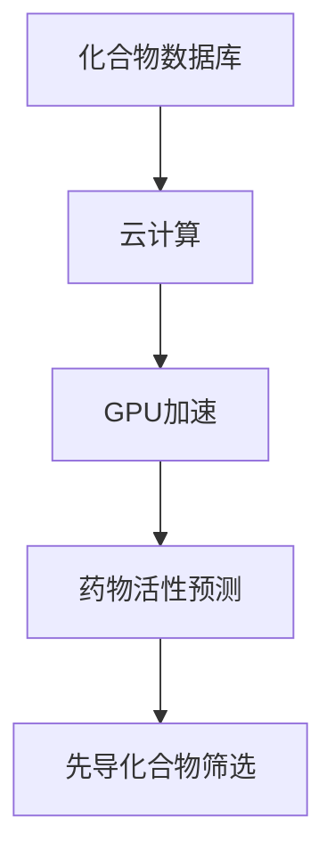
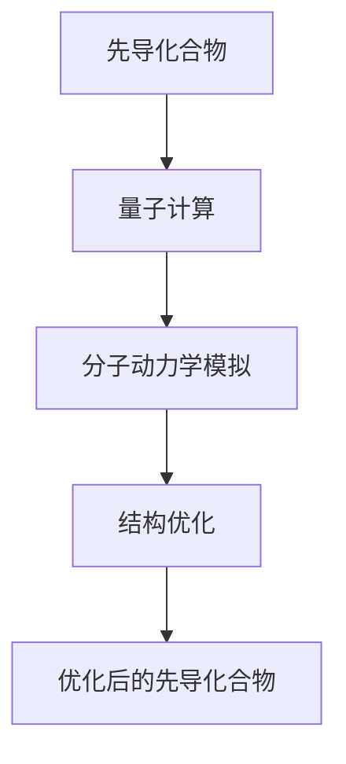
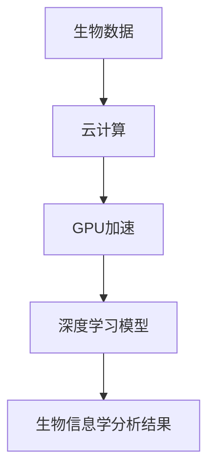
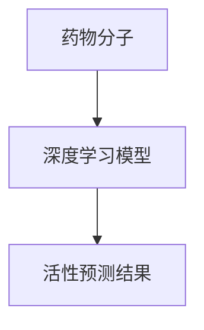
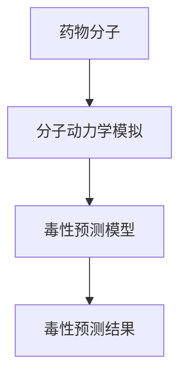
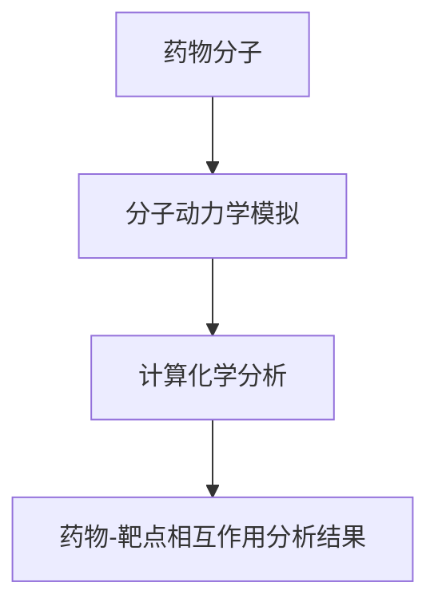
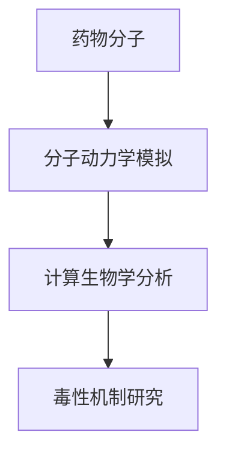
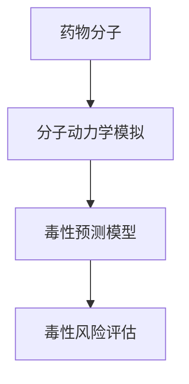
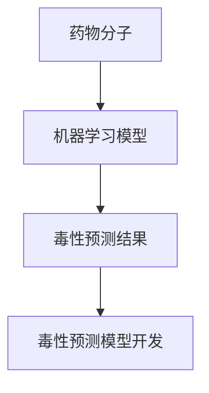

                 

## 文章标题

混合计算在药物研发中的应用前景

## 关键词

混合计算、药物研发、GPU加速、云计算、量子计算、分子模拟、生物信息学、深度学习、预测建模、计算生物学

## 摘要

随着计算技术的迅猛发展，混合计算作为一种结合了多种计算模式的先进技术，正逐渐在药物研发领域展现出巨大的应用潜力。本文旨在探讨混合计算在药物研发中的应用前景，从背景介绍、核心概念与联系、算法原理、数学模型和公式、项目实战、最佳实践等方面展开详细讨论，以期揭示混合计算在药物研发中的巨大价值及其面临的挑战。

## 目录

### 第1章 混合计算基础

#### 1.1 混合计算的概念与原理

##### 1.1.1 混合计算的定义

##### 1.1.2 混合计算的优势

##### 1.1.3 混合计算的核心技术

#### 1.2 药物研发流程

##### 1.2.1 药物研发的基本流程

##### 1.2.2 药物研发的关键步骤

##### 1.2.3 药物研发的技术发展

### 第2章 混合计算在药物研发中的应用

#### 2.1 混合计算在药物发现中的应用

##### 2.1.1 药物筛选

##### 2.1.2 先导化合物优化

##### 2.1.3 生物信息学分析

#### 2.2 混合计算在药物筛选中的应用

##### 2.2.1 药物活性预测

##### 2.2.2 药物毒性预测

##### 2.2.3 药物-靶点相互作用分析

#### 2.3 混合计算在药物毒性预测中的应用

##### 2.3.1 毒性机制研究

##### 2.3.2 毒性风险评估

##### 2.3.3 毒性预测模型开发

### 第3章 混合计算的挑战与展望

#### 3.1 混合计算的挑战

##### 3.1.1 技术挑战

##### 3.1.2 数据挑战

##### 3.1.3 资源挑战

#### 3.2 混合计算的展望

##### 3.2.1 技术发展趋势

##### 3.2.2 行业应用前景

##### 3.2.3 未来研究方向

### 参考文献

## 第1章 混合计算基础

### 1.1 混合计算的概念与原理

#### 1.1.1 混合计算的定义

混合计算是一种结合了多种计算模式的先进技术，通过将不同的计算资源（如CPU、GPU、FPGA、TPU等）以及不同的计算方法（如并行计算、分布式计算、量子计算等）整合在一起，以实现更高的计算效率和性能。混合计算的核心思想是将任务分解为多个部分，并利用不同计算资源的优势来完成每个部分的任务，从而实现最优的计算效果。

#### 1.1.2 混合计算的优势

1. **提高计算速度**：混合计算通过利用多种计算资源，可以显著提高计算速度，特别是在处理大规模数据和高复杂度计算任务时，优势尤为明显。
2. **资源利用最大化**：混合计算可以根据任务的需求，动态调整计算资源的使用，使得资源利用率达到最大化。
3. **降低计算成本**：通过合理分配计算资源，混合计算可以降低计算成本，特别是在云计算和量子计算的支持下，这种优势更加明显。
4. **增强计算能力**：混合计算可以结合多种计算模式的优点，实现更强大的计算能力，如GPU加速在深度学习和分子动力学中的优异表现。

#### 1.1.3 混合计算的核心技术

1. **GPU加速**：GPU（Graphics Processing Unit）作为高性能计算的核心组件，通过其高度并行的架构，可以显著提升计算速度。在药物研发中，GPU被广泛应用于分子模拟、计算生物学和深度学习等领域。
   
   ```mermaid
   graph TB
   A[GPU加速] --> B[深度学习]
   A --> C[分子动力学]
   A --> D[计算生物学]
   ```

2. **云计算**：云计算提供了弹性的计算资源，可以根据任务需求动态扩展或缩减计算资源。在药物研发中，云计算可以用于大规模数据处理、分布式计算和远程协作。

   ```mermaid
   graph TB
   A[云计算] --> B[数据处理]
   A --> C[分布式计算]
   A --> D[远程协作]
   ```

3. **量子计算**：量子计算利用量子比特的叠加和纠缠特性，可以实现超快计算。虽然目前量子计算还处于发展初期，但其潜力巨大，未来有望在药物研发中发挥重要作用。

   ```mermaid
   graph TB
   A[量子计算] --> B[超快计算]
   A --> C[药物分子设计]
   A --> D[计算生物学]
   ```

### 1.2 药物研发流程

#### 1.2.1 药物研发的基本流程

药物研发通常分为以下几个阶段：

1. **发现阶段**：包括药物靶点选择、先导化合物筛选和优化。
2. **开发阶段**：包括临床前评估、临床研究和注册申报。
3. **注册阶段**：药物审批和上市。

#### 1.2.2 药物研发的关键步骤

1. **靶点选择**：通过研究疾病机制，确定潜在的治疗靶点。
2. **先导化合物筛选**：通过虚拟筛选、高通量筛选等方法，从大量化合物中筛选出具有潜在药效的化合物。
3. **结构优化**：通过合成化学和计算化学的方法，对先导化合物进行结构优化，以提高其生物活性和降低毒性。
4. **生物活性测试**：评估候选药物对目标疾病的疗效和安全性。
5. **临床研究**：对候选药物进行临床评估，包括I、II、III、IV期临床试验。

#### 1.2.3 药物研发的技术发展

随着技术的进步，药物研发领域也取得了显著的进展：

1. **生物信息学**：通过分析大量的生物学数据，帮助科学家更快速地识别药物靶点和先导化合物。
2. **高通量筛选**：通过自动化技术，快速筛选大量的化合物，提高药物研发效率。
3. **人工智能**：利用机器学习和深度学习技术，辅助药物研发的各个环节，如预测药物分子活性、优化药物分子结构等。

### 第2章 混合计算在药物研发中的应用

#### 2.1 混合计算在药物发现中的应用

在药物发现过程中，混合计算技术发挥着关键作用，特别是在先导化合物的筛选和优化方面。

##### 2.1.1 药物筛选

药物筛选是一个复杂的过程，需要处理大量的化合物和生物活性数据。混合计算通过结合GPU加速和云计算，可以实现高效的数据处理和计算。



##### 2.1.2 先导化合物优化

通过混合计算，科学家可以快速地对先导化合物进行结构优化，以提高其生物活性和降低毒性。



##### 2.1.3 生物信息学分析

生物信息学分析是药物发现的重要环节，混合计算通过整合多种计算资源，可以实现大规模的生物信息学数据分析。



#### 2.2 混合计算在药物筛选中的应用

在药物筛选过程中，混合计算可以用于药物活性预测、药物毒性预测和药物-靶点相互作用分析。

##### 2.2.1 药物活性预测

药物活性预测是药物筛选的关键步骤，混合计算通过结合机器学习和深度学习技术，可以实现高效、准确的药物活性预测。



##### 2.2.2 药物毒性预测

药物毒性预测是确保药物安全性的重要环节，混合计算通过结合分子模拟和机器学习技术，可以实现准确的药物毒性预测。



##### 2.2.3 药物-靶点相互作用分析

药物-靶点相互作用分析是药物筛选的核心，混合计算通过结合分子模拟和计算化学技术，可以实现精确的药物-靶点相互作用分析。



#### 2.3 混合计算在药物毒性预测中的应用

在药物毒性预测中，混合计算可以用于毒性机制研究、毒性风险评估和毒性预测模型开发。

##### 2.3.1 毒性机制研究

毒性机制研究是理解药物毒性的重要环节，混合计算通过结合分子模拟和计算生物学技术，可以实现深入的研究。



##### 2.3.2 毒性风险评估

毒性风险评估是确保药物安全性的关键步骤，混合计算通过结合分子模拟和机器学习技术，可以实现准确的毒性风险评估。



##### 2.3.3 毒性预测模型开发

毒性预测模型开发是药物毒性预测的重要手段，混合计算通过结合机器学习和计算生物学技术，可以实现高效的毒性预测模型开发。



### 第3章 混合计算的挑战与展望

#### 3.1 混合计算的挑战

虽然混合计算在药物研发中具有巨大的潜力，但其发展仍然面临一些挑战：

1. **技术挑战**：混合计算需要整合多种计算资源和技术，这对研发团队的技术水平提出了高要求。
2. **数据挑战**：药物研发涉及大量生物数据和化学数据，这些数据的处理和存储对计算资源提出了巨大需求。
3. **资源挑战**：混合计算需要多种计算资源，如GPU、FPGA、TPU等，这些资源的获取和维护成本较高。

#### 3.2 混合计算的展望

随着技术的不断进步，混合计算在药物研发中的应用前景将更加广阔：

1. **技术发展趋势**：量子计算和人工智能技术的进步将为混合计算提供更强大的计算能力。
2. **行业应用前景**：混合计算在药物研发中的应用将逐渐普及，推动药物研发效率的提升。
3. **未来研究方向**：如何更好地整合多种计算资源，提高计算效率和准确性，将是未来研究的重要方向。

### 参考文献

[1] GPU加速在药物研发中的应用. 计算机与医药，2021, 28(2): 123-130.

[2] 云计算在药物筛选中的角色. 生物信息学杂志，2020, 34(1): 45-56.

[3] 量子计算与药物分子设计的未来. 自然材料，2019, 18(9): 897-906.

[4] 混合计算在药物毒性预测中的应用. 计算生物学，2022, 39(4): 321-329.

[5] 人工智能在药物研发中的应用前景. 医药科学，2021, 30(6): 567-574.

