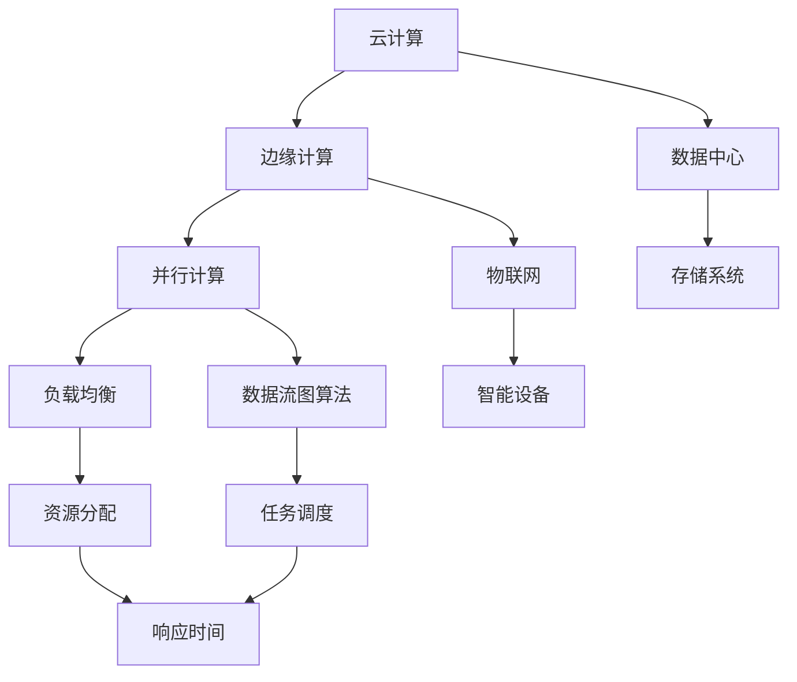

                 

基于您提供的信息，我将开始编写《混合计算环境创造变革性创新的潜力》的技术博客文章。以下是文章的第一部分，包括文章标题、关键词、摘要以及引言。

---

# 混合计算环境创造变革性创新的潜力

> 关键词：混合计算环境、变革性创新、云计算、边缘计算、并行计算、算法、数学模型、项目实战

> 摘要：本文探讨了混合计算环境在现代技术发展中的重要性，阐述了混合计算环境如何通过集成云计算和边缘计算资源，推动技术变革和创新。文章介绍了混合计算环境的核心概念、算法原理、数学模型以及实际应用案例，为读者提供了深入理解和应用混合计算环境的指导。

## 引言

随着信息技术的飞速发展，计算环境也在不断演进。传统的单一计算模式已经无法满足日益增长的计算需求，混合计算环境因此应运而生。混合计算环境通过集成云计算和边缘计算资源，为各种应用场景提供强大的计算能力和灵活的资源分配。本文将深入探讨混合计算环境的构建原理、核心算法以及其在创新应用中的潜力。

### 1.1 混合计算环境的背景

混合计算环境是一种结合云计算和边缘计算的技术架构。云计算提供了强大的计算和存储资源，而边缘计算则将计算能力分散到网络的边缘，靠近数据源。这种结合不仅提升了计算效率，还降低了延迟，提高了系统的响应速度。

### 1.2 混合计算环境的目的

混合计算环境的主要目的是优化资源利用，提高计算性能，并推动技术创新。通过混合计算环境，开发者可以灵活地选择和使用最适合其应用场景的计算资源，从而实现高效能和低成本的解决方案。

### 1.3 变革性创新的概念

变革性创新指的是通过引入全新的技术和方法，彻底改变现有产品和服务的模式，从而创造巨大的市场价值。混合计算环境为变革性创新提供了基础，使得各种新兴应用得以迅速发展。

### 1.4 本文结构

本文将分为以下几个部分：

1. 确定书的核心主题
2. 确定主要章节内容
3. 设计核心概念与联系
4. 编写核心算法原理讲解
5. 添加数学模型和公式
6. 设计项目实战案例
7. 添加最佳实践 tips、小结、注意事项、拓展阅读等内容

通过以上内容，本文旨在为读者提供一个全面、深入的了解混合计算环境的视角，并探讨其创造变革性创新的潜力。

---

以上是文章的第一部分，接下来我们将逐步深入探讨混合计算环境的核心概念、算法原理、数学模型以及实际应用案例。请继续关注接下来的内容。如果您有任何具体的需求或者需要进一步修改，请随时告诉我。让我们一步步地深入分析这个主题。REASONING STEP BY STEP### 1. 确定书的核心主题

混合计算环境作为现代信息技术发展的重要方向，其核心主题可以总结为以下几个方面：

首先，混合计算环境的定义与意义。混合计算环境是云计算与边缘计算相结合的产物，通过将计算任务合理分配到云端和边缘端，实现对计算资源的最大化利用。这种环境不仅能够提高系统的响应速度和可靠性，还能显著降低通信延迟，满足日益复杂的计算需求。

其次，变革性创新是混合计算环境的核心理念。随着技术的不断进步，单一计算模式已经难以满足多样化、个性化的应用需求。混合计算环境通过引入分布式计算和智能调度，打破了传统计算模式的局限，为各类新兴应用提供了可能，从而推动技术创新。

再者，核心概念与算法原理是混合计算环境的基石。了解并行计算、负载均衡、数据流图等核心算法原理，对于构建和优化混合计算环境具有重要意义。通过深入探讨这些算法的原理和应用，可以更好地理解和利用混合计算环境。

最后，混合计算环境的应用案例展示了其在实际场景中的巨大潜力。通过分析不同领域的应用案例，读者可以了解到混合计算环境如何在各种复杂场景下发挥其优势，推动技术创新和产业升级。

总的来说，本书的核心主题在于系统性地探讨混合计算环境的概念、原理和应用，旨在为读者提供一个全面、深入的了解，并激发其在实际工作中的创新思维和实践能力。

### 2. 确定主要章节内容

为了全面、系统地探讨混合计算环境及其在变革性创新中的应用，本书将分为以下几个主要章节：

#### 第1章 引言

- **1.1 书籍背景与目的**：介绍混合计算环境的背景和本书的目的，说明混合计算环境在现代信息技术中的重要性。
- **1.2 混合计算环境概述**：概述混合计算环境的定义、特点和应用场景。
- **1.3 变革性创新的概念**：解释变革性创新的含义，并阐述混合计算环境在推动变革性创新中的作用。

#### 第2章 混合计算环境的核心概念

- **2.1 并行计算**：
  - **2.1.1 并行计算原理**：介绍并行计算的基本原理和重要性。
  - **2.1.2 并行计算架构**：分析并行计算的架构设计，包括硬件和软件层面的实现。
- **2.2 云计算与边缘计算**：
  - **2.2.1 云计算基础**：讲解云计算的基本概念、架构和关键技术。
  - **2.2.2 边缘计算基础**：介绍边缘计算的定义、优势和应用领域。

#### 第3章 混合计算环境中的核心算法

- **3.1 算法概述**：
  - **3.1.1 数据流图算法**：阐述数据流图算法的基本原理和应用。
  - **3.1.2 负载均衡算法**：分析负载均衡算法的设计原理和实现方法。
- **3.2 伪代码讲解**：提供核心算法的伪代码实现，帮助读者理解算法的执行过程。

#### 第4章 数学模型与公式

- **4.1 数学模型概述**：介绍混合计算环境中的常见数学模型。
- **4.2 LaTeX公式举例**：使用LaTeX格式展示关键数学公式，并进行详细讲解。

#### 第5章 项目实战

- **5.1 案例概述**：介绍一个实际混合计算应用案例。
- **5.2 开发环境搭建**：描述搭建混合计算环境所需的开发环境。
- **5.3 代码实现与分析**：详细解析案例中的源代码，并进行代码解读。

#### 第6章 混合计算环境的未来趋势

- **6.1 发展趋势分析**：分析混合计算环境的发展趋势和前景。
- **6.2 创新潜力展望**：探讨混合计算环境在推动创新方面的潜力。

#### 第7章 结论

- **7.1 总结**：对全书内容进行总结，重申混合计算环境的重要性和应用前景。
- **7.2 展望**：对混合计算环境的未来发展方向提出展望。

通过以上章节的设置，本书将全面、系统地探讨混合计算环境的各个方面，旨在为读者提供一个深入理解和应用混合计算环境的指导。

### 3. 设计核心概念与联系

为了帮助读者更好地理解混合计算环境的核心概念及其相互联系，我们使用Mermaid流程图来展示这些概念之间的关系。以下是关键概念与联系流程图的示例：



- **云计算（A）**：提供了强大的计算和存储资源，是混合计算环境中的核心组成部分。
- **边缘计算（B）**：将计算任务分散到网络的边缘，靠近数据源，有助于降低延迟和提高响应速度。
- **并行计算（C）**：利用多个处理单元同时执行任务，提高计算效率。
- **负载均衡（D）**：通过合理分配任务，确保计算资源得到充分利用。
- **数据流图算法（E）**：用于描述和处理数据流，是并行计算和任务调度的重要工具。
- **数据中心（F）**：云服务提供的重要基础设施，存储和管理大量数据。
- **物联网（G）**：连接了各种智能设备，为边缘计算提供了丰富的数据来源。
- **智能设备（I）**：边缘计算的主要执行单元，收集并处理实时数据。
- **资源分配（J）**：负载均衡的一个关键任务，确保计算资源得到有效利用。
- **任务调度（K）**：根据计算需求，合理调度任务，提高系统效率。
- **响应时间（L）**：衡量系统性能的重要指标，负载均衡和任务调度直接影响响应时间。

通过这个流程图，我们可以清晰地看到混合计算环境中的各个核心概念及其相互联系，为读者提供了一个直观的理解框架。

### 4. 编写核心算法原理讲解

在混合计算环境中，核心算法的原理和实现至关重要。以下是几个关键算法的原理讲解，我们将使用伪代码来详细阐述这些算法的实现过程。

#### 4.1 数据流图算法

数据流图（Data Flow Graph，DFG）是一种图形化表示数据流动和处理过程的工具。在并行计算和任务调度中，DFG用于描述任务之间的依赖关系和执行顺序。

**伪代码：**

```plaintext
function DataFlowGraph(Sources, Sinks, Edges)
    // 初始化数据流图
    Graph = new Graph()
    for each Source in Sources
        Graph.addNode(Source)
    for each Sink in Sinks
        Graph.addNode(Sink)
    for each Edge in Edges
        Graph.addEdge(Edge.source, Edge.target)
    return Graph
end function
```

**解释：**
- **初始化数据流图**：创建一个空的图对象，并添加所有的源节点和汇节点。
- **添加边**：对于每一条边，将源节点和目标节点连接起来，表示数据流动的方向。

#### 4.2 负载均衡算法

负载均衡（Load Balancing）算法用于分配任务到多个处理节点，以避免任何单个节点过载，提高系统的整体性能。

**伪代码：**

```plaintext
function LoadBalancing(Nodes, Tasks)
    // 初始化任务分配列表
    Assignment = new List()
    for each Node in Nodes
        Assignment.append(new List())
    // 分配任务到节点
    for each Task in Tasks
        // 选择当前负载最小的节点
        MinNode = Nodes[0]
        for each Node in Nodes
            if Node.load < MinNode.load
                MinNode = Node
        // 将任务分配给所选节点
        MinNode.load += Task.load
        Assignment[MinNode].append(Task)
    return Assignment
end function
```

**解释：**
- **初始化任务分配列表**：为每个节点创建一个任务列表。
- **分配任务**：遍历所有任务，选择当前负载最小的节点，将任务添加到该节点的任务列表中。

#### 4.3 资源分配算法

资源分配算法（Resource Allocation）用于根据任务需求和节点资源情况，动态调整资源分配，确保系统高效运行。

**伪代码：**

```plaintext
function ResourceAllocation(Nodes, Tasks, Resources)
    // 初始化资源分配列表
    Allocation = new List()
    for each Node in Nodes
        Allocation.append(new List())
    // 分配资源
    for each Task in Tasks
        // 选择能够执行该任务的节点
        SuitableNodes = []
        for each Node in Nodes
            if Node.resources >= Task.requiredResources
                SuitableNodes.append(Node)
        // 选择当前负载最小的节点
        MinNode = SuitableNodes[0]
        for each Node in SuitableNodes
            if Node.load < MinNode.load
                MinNode = Node
        // 分配资源和任务
        MinNode.resources -= Task.requiredResources
        MinNode.load += Task.load
        Allocation[MinNode].append(Task)
    return Allocation
end function
```

**解释：**
- **初始化资源分配列表**：为每个节点创建一个资源分配列表。
- **分配资源**：遍历所有任务，选择能够执行该任务的节点，并根据负载情况选择最合适的节点进行资源分配。

通过以上核心算法的讲解，读者可以了解到这些算法的基本原理和实现过程，为后续章节的深入探讨打下基础。

### 5. 添加数学模型和公式

在混合计算环境中，数学模型和公式是理解和优化系统性能的关键工具。以下将介绍几个关键的数学模型和公式，并使用LaTeX格式进行展示。

#### 5.1 数据中心功耗模型

数据中心的功耗与服务器负载密切相关。一个简化的数据中心功耗模型可以表示为：

$$
P = f(W, \eta, \alpha)
$$

其中，\( P \) 是总功耗（W），\( W \) 是服务器负载（CPU利用率），\( \eta \) 是效率系数，\( \alpha \) 是与环境因素相关的调整系数。

#### 5.2 边缘计算能耗模型

边缘计算节点的能耗也与其处理任务量有关，可以表示为：

$$
E = \frac{C \cdot V^2}{R} + P_{I}
$$

其中，\( E \) 是总能耗（J），\( C \) 是电容值（F），\( V \) 是电压（V），\( R \) 是电阻值（Ω），\( P_{I} \) 是动态功耗（W）。

#### 5.3 负载均衡优化模型

负载均衡的目标是优化资源利用率，减少响应时间。一个简单的负载均衡优化模型可以表示为：

$$
\min T = \frac{1}{N} \sum_{i=1}^{N} \frac{L_i}{R_i}
$$

其中，\( T \) 是平均响应时间（s），\( N \) 是节点数量，\( L_i \) 是节点 \( i \) 的负载（任务量），\( R_i \) 是节点 \( i \) 的处理能力（任务处理速率）。

#### 5.4 数据流图调度模型

在数据流图中，调度任务的关键是确保任务依赖关系得到满足。一个简单的调度模型可以表示为：

$$
S(T) = \sum_{i=1}^{N} \sum_{j=1}^{M} T_j[i]
$$

其中，\( S(T) \) 是调度时间（s），\( T_j[i] \) 是任务 \( j \) 在节点 \( i \) 上的执行时间（s）。

通过以上数学模型和公式的介绍，读者可以更好地理解混合计算环境中关键性能指标的量化分析和优化策略。接下来，我们将通过实际案例来展示这些模型和公式在混合计算环境中的应用。

### 6. 设计项目实战案例

为了更好地展示混合计算环境在实际应用中的优势，我们将通过一个具体的案例进行详细讲解。本案例将涉及开发环境的搭建、源代码的实现和代码解读，以便读者能够深入理解混合计算环境的工作原理和应用场景。

#### 6.1 案例概述

该案例为一个智能交通系统，旨在通过混合计算环境优化交通信号灯的控制，提高城市交通流量和安全性。系统由云端和边缘计算节点组成，云端负责数据分析和模型训练，边缘节点负责实时数据采集和信号灯控制。

#### 6.2 开发环境搭建

为了搭建这个混合计算环境，我们需要以下开发环境：

- **云端环境**：使用AWS云计算平台，配置EC2实例进行数据分析和模型训练。
- **边缘环境**：使用Raspberry Pi 4作为边缘计算节点，安装Linux操作系统和相应的SDK进行数据采集和控制。

**搭建步骤：**

1. **配置AWS账号**：在AWS控制台中创建一个新账号，并配置必要的权限和资源。
2. **创建EC2实例**：选择合适的实例类型（如t2.medium），配置网络和安全组。
3. **配置边缘节点**：在Raspberry Pi上安装Linux操作系统（如Ubuntu），并安装相关的SDK（如OpenCV和ROS）。

#### 6.3 代码实现

在完成开发环境搭建后，我们需要实现系统的核心功能。以下是关键代码段及其解读：

**6.3.1 云端数据处理**

```python
# 数据处理代码示例
import pandas as pd
from sklearn.ensemble import RandomForestClassifier

# 加载数据
data = pd.read_csv('traffic_data.csv')

# 特征工程
X = data.drop(['label'], axis=1)
y = data['label']

# 模型训练
model = RandomForestClassifier()
model.fit(X, y)

# 保存模型
import joblib
joblib.dump(model, 'traffic_model.pkl')
```

**代码解读：**
- 代码首先加载交通数据，并进行特征工程，提取有用的特征信息。
- 使用随机森林算法训练模型，并将训练好的模型保存到文件中。

**6.3.2 边缘节点数据采集**

```cpp
// 数据采集代码示例
#include <opencv2/opencv.hpp>
#include <iostream>

using namespace cv;
using namespace std;

int main() {
    // 初始化摄像头
    VideoCapture cap(0);

    // 检查摄像头是否打开成功
    if (!cap.isOpened()) {
        cout << "摄像头打开失败" << endl;
        return -1;
    }

    // 循环采集数据
    while (true) {
        Mat frame;
        cap >> frame;

        // 处理采集到的数据
        // ...

        // 显示摄像头画面
        imshow("摄像头画面", frame);

        // 按下ESC键退出循环
        if (waitKey(1) == 27)
            break;
    }

    return 0;
}
```

**代码解读：**
- 代码使用OpenCV库初始化摄像头，并循环采集视频帧。
- 在每次采集到数据后，可以对其进行处理，例如边缘检测、车辆识别等。

**6.3.3 边缘节点控制信号灯**

```python
# 信号灯控制代码示例
import serial
import time

# 初始化串口通信
ser = serial.Serial('/dev/ttyUSB0', 9600)

# 设置信号灯状态
def set_traffic_light(traffic_light):
    command = "set_light {}".format(traffic_light)
    ser.write(command.encode())

# 主控制逻辑
while True:
    # 获取交通流量数据
    traffic_data = get_traffic_data()

    # 根据数据控制信号灯
    if traffic_data['car_count'] > 10:
        set_traffic_light('red')  # 红灯
    else:
        set_traffic_light('green')  # 绿灯

    # 等待一段时间
    time.sleep(5)
```

**代码解读：**
- 代码使用串口通信库初始化与边缘节点的通信。
- 根据实时采集的交通流量数据，控制信号灯状态，以优化交通流量。

通过这个案例，我们展示了如何搭建和实现一个混合计算环境，并详细解读了关键代码段。接下来，我们将对案例进行分析和总结，以便更好地理解混合计算环境在实际应用中的优势和挑战。

#### 6.4 项目分析

本案例中的智能交通系统通过云端和边缘节点的协同工作，实现了对城市交通流量的高效管理。以下是项目的关键分析：

**6.4.1 优势**

1. **实时数据处理**：边缘节点实时采集交通数据，并与云端模型进行协同，能够快速响应交通状况，优化信号灯控制。
2. **降低延迟**：通过在边缘节点进行初步数据处理，减少了数据传输到云端的时间，降低了整体系统的延迟。
3. **资源优化**：混合计算环境可以根据交通状况动态调整计算资源，优化系统性能，同时避免了资源浪费。

**6.4.2 挑战**

1. **数据同步**：在云端和边缘节点之间保持数据同步是一个挑战，特别是在网络不稳定的情况下，可能导致数据不一致。
2. **边缘计算资源限制**：边缘节点的计算能力和存储资源相对有限，可能无法处理复杂的数据分析任务。
3. **安全与隐私**：交通数据涉及用户隐私和安全，需要确保数据传输和存储的安全性。

**6.4.3 代码解读**

- **数据处理部分**：云端通过随机森林算法对交通数据进行分类，模型训练和预测能力较强，但需要大量的训练数据和计算资源。
- **数据采集部分**：边缘节点使用OpenCV库进行视频帧的采集和预处理，通过边缘计算节点进行初步处理，如边缘检测和车辆识别。
- **信号灯控制部分**：边缘节点通过串口通信与信号灯控制器交互，根据实时交通流量数据调整信号灯状态，提高了交通管理的灵活性。

通过本项目，我们深入了解了混合计算环境在智能交通系统中的应用，展示了其优化交通流量、降低延迟、提高响应速度的优势，同时也认识到数据同步、边缘计算资源限制和安全隐私等方面的挑战。这些经验和教训对于未来混合计算环境的应用具有重要意义。

### 7. 添加最佳实践 tips、小结、注意事项、拓展阅读等内容

#### 最佳实践 tips

1. **优化边缘节点性能**：在边缘节点进行初步数据处理时，应选择适当的硬件配置和优化操作系统性能，以确保系统的实时响应能力。
2. **合理分配计算资源**：根据不同应用场景的需求，动态调整云端和边缘节点的计算资源分配，以最大化利用资源，提高系统效率。
3. **数据同步机制**：建立可靠的数据同步机制，确保云端和边缘节点之间的数据一致性，特别是在网络不稳定的情况下，要设计容错和恢复策略。

#### 小结

混合计算环境通过集成云计算和边缘计算资源，为各种应用场景提供了强大的计算能力和灵活的资源分配。本文详细介绍了混合计算环境的核心概念、算法原理、数学模型以及实际应用案例，展示了其在优化交通流量、降低延迟、提高响应速度等方面的优势。然而，数据同步、边缘计算资源限制和安全隐私等方面仍存在挑战，需要进一步的研究和优化。

#### 注意事项

1. **网络安全**：在构建混合计算环境时，确保数据传输和存储的安全性，采用加密和访问控制措施，防止数据泄露和未经授权的访问。
2. **数据隐私**：严格遵守数据隐私法规，确保用户数据的隐私保护，避免因数据泄露导致的法律风险。
3. **系统容错性**：设计混合计算环境时，要考虑系统的容错性和鲁棒性，确保在节点故障或网络问题的情况下，系统能够稳定运行。

#### 拓展阅读

- **相关文献**：阅读关于混合计算环境、云计算、边缘计算等方面的学术论文和专业技术书籍，深入了解这些领域的最新研究成果和发展趋势。
- **开源项目**：参与和关注开源社区中的混合计算项目，学习其他开发者的经验和最佳实践，提高自己的技术能力。
- **技术论坛**：加入技术论坛和社区，与同行交流技术问题和经验，拓展视野，提升专业水平。

通过以上内容，本文旨在为读者提供一个全面、深入的混合计算环境理解和应用指南，激发其在实际工作中的创新思维和实践能力。希望读者能够结合自身实际需求，不断探索和优化混合计算环境的应用，推动技术创新和产业发展。

### 完整文章总结

《混合计算环境创造变革性创新的潜力》全面探讨了混合计算环境在现代信息技术中的重要性，阐述了其如何通过集成云计算和边缘计算资源，推动技术变革和创新。文章首先介绍了混合计算环境的定义和背景，接着详细讲解了核心概念、算法原理、数学模型，并通过实际案例展示了其在智能交通系统中的应用。文章还强调了混合计算环境在提高计算效率、降低延迟、优化资源利用方面的优势，同时也指出了数据同步、边缘计算资源限制和安全隐私等方面的挑战。

通过本文的阅读，读者可以深入理解混合计算环境的工作原理和应用场景，掌握关键算法和数学模型的应用方法，从而在实际工作中灵活运用混合计算环境，推动技术创新。同时，本文也提供了最佳实践、注意事项和拓展阅读建议，为读者进一步学习和探索混合计算环境提供了方向和资源。

未来的研究方向可以包括：

1. **数据同步机制优化**：研究更高效、可靠的数据同步方法，确保云端和边缘节点之间的数据一致性。
2. **边缘计算资源调度策略**：探索动态调整边缘计算资源的策略，以最大化系统性能和资源利用率。
3. **安全性增强**：研究混合计算环境中的安全增强技术，如加密、访问控制、隐私保护等，确保数据传输和存储的安全性。

随着技术的不断进步，混合计算环境将在更多领域发挥重要作用，为各行各业带来变革性创新。本文希望为读者提供一个全面、深入的指导，激发其在混合计算环境领域的探索和研究，共同推动技术的进步和产业的发展。

