                 

### 文章标题：混合计算：结合多种计算范式突破技术限制

> 关键词：混合计算、计算范式、人工智能、物联网、工业互联网、硬件协同、异构计算、动态调度

> 摘要：本文将深入探讨混合计算这一技术领域的背景与基本概念，分析其在人工智能、物联网、工业互联网等领域的应用与实践，并探讨混合计算的未来发展趋势与挑战。通过详细阐述混合计算的优势、关键技术、应用场景和实现方法，帮助读者全面了解并掌握混合计算的理论与实践。

## 第一部分：混合计算的背景与基本概念

### 1.1 混合计算的定义与演进

#### 1.1.1 计算范式的演变

计算范式是指计算领域的基本理论和框架，它们定义了计算的方法和方式。从最初的串行计算、并行计算，到分布式计算、云计算，再到现在的混合计算，计算范式在不断演进。

- **串行计算**：早期的计算机采用串行计算范式，处理任务时只能逐个执行。
- **并行计算**：随着计算机技术的发展，并行计算成为主流，通过多个处理器或计算单元同时执行任务，提高计算速度。
- **分布式计算**：分布式计算通过网络将多个计算节点连接起来，协同工作完成大型计算任务。
- **云计算**：云计算将计算资源集中起来，通过互联网提供按需分配的计算服务。
- **混合计算**：混合计算将多种计算范式相结合，根据任务需求动态调整计算资源，实现最优性能。

#### 1.1.2 混合计算的核心价值

混合计算的核心价值在于充分利用各种计算资源的优势，提高计算效率，突破技术限制。

- **优化性能**：混合计算可以根据任务特点动态调整计算资源，实现性能优化。
- **降低成本**：通过充分利用现有计算资源，降低计算成本。
- **提高可靠性**：混合计算可以通过冗余设计提高系统的可靠性，增强容错能力。
- **支持复杂应用**：混合计算支持复杂应用场景，如人工智能、物联网、工业互联网等。

#### 1.1.3 混合计算的应用领域

混合计算在各个领域都有广泛的应用。

- **人工智能**：混合计算优化深度学习模型训练，提高模型性能。
- **物联网**：混合计算实现边缘计算与云计算的协同，提高数据处理效率。
- **工业互联网**：混合计算优化工业数据分析与控制，提高生产效率。

### 1.2 混合计算的关键技术

#### 1.2.1 硬件与软件协同优化

硬件与软件协同优化是混合计算的关键技术之一。通过硬件加速、软件优化等技术手段，提高计算效率。

- **硬件加速**：采用专用硬件（如GPU、TPU）加速计算任务。
- **软件优化**：针对特定硬件优化算法和软件架构，提高计算性能。

#### 1.2.2 异构计算架构

异构计算架构是混合计算的另一个关键技术。通过将不同类型的计算资源（如CPU、GPU、FPGA）协同工作，实现最优性能。

- **异构计算框架**：构建异构计算框架，实现多种计算资源的统一管理和调度。
- **异构计算优化**：针对异构计算框架优化算法和资源分配策略。

#### 1.2.3 动态调度与资源管理

动态调度与资源管理是混合计算的关键技术之一。通过动态调整计算资源，实现最优性能。

- **动态调度**：根据任务需求动态调整计算资源，实现负载均衡。
- **资源管理**：实现计算资源的合理分配和高效利用。

### 1.3 混合计算的优势与挑战

#### 1.3.1 优势分析

混合计算具有以下优势：

- **性能优化**：通过动态调整计算资源，实现最优性能。
- **成本降低**：充分利用现有计算资源，降低计算成本。
- **可靠性提高**：通过冗余设计提高系统的可靠性。
- **支持复杂应用**：支持复杂应用场景，提高数据处理效率。

#### 1.3.2 面临的挑战

混合计算面临以下挑战：

- **技术复杂度**：混合计算涉及多个计算范式和关键技术，技术复杂度高。
- **兼容性问题**：不同计算范式和硬件设备的兼容性问题。
- **系统稳定性**：动态调度和资源管理可能导致系统稳定性问题。
- **人才需求**：混合计算对人才要求较高，需要跨学科知识的整合。

## 第二部分：混合计算的应用与实践

### 2.1 混合计算在人工智能中的应用

#### 2.1.1 混合计算在深度学习中的优化

##### 2.1.1.1 硬件加速

深度学习模型通常需要大量的计算资源。通过使用GPU、TPU等硬件加速器，可以显著提高模型训练和推理速度。

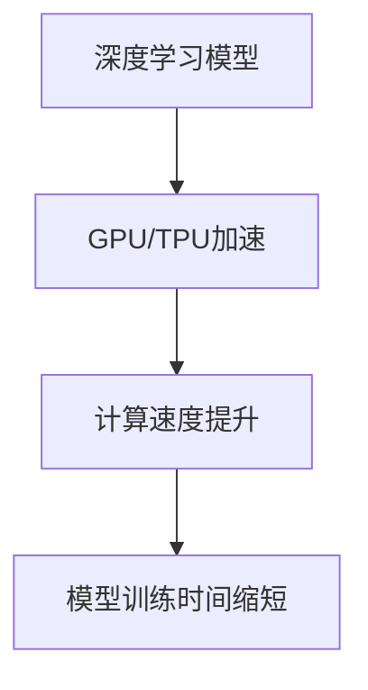

##### 2.1.1.2 软件层面的优化

软件层面的优化包括算法优化和代码优化。通过选择合适的算法和数据结构，可以提高模型的计算效率和准确性。

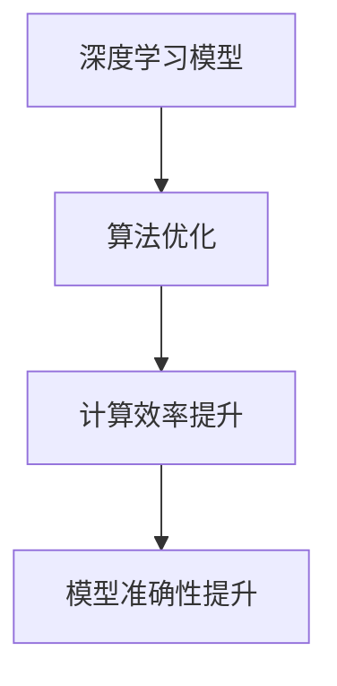

#### 2.1.2 混合计算在自然语言处理中的应用

##### 2.1.2.1 模型并行与分布式训练

自然语言处理任务通常涉及大规模数据集和复杂的模型。通过模型并行和分布式训练，可以加速模型训练过程。

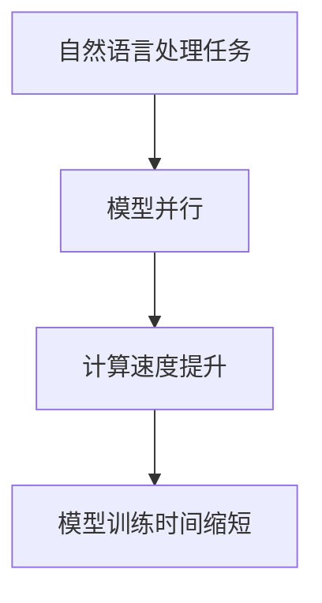

##### 2.1.2.2 混合模型的构建与应用

混合模型结合了多种算法和模型，可以更好地处理复杂的自然语言处理任务。例如，结合Transformer和BERT的混合模型，可以显著提高模型性能。

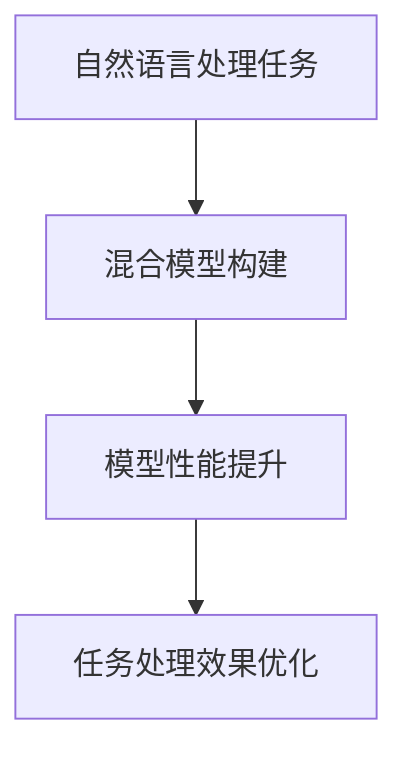

### 2.2 混合计算在物联网中的应用

#### 2.2.1 边缘计算与云计算的协同

边缘计算与云计算的协同是物联网应用的关键。通过将计算任务在边缘设备和云端之间进行合理分配，可以实现高效的数据处理和智能决策。

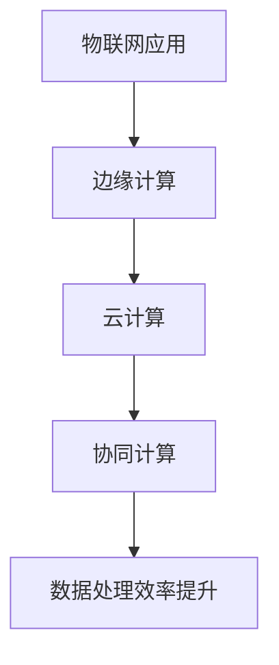

##### 2.2.1.1 边缘计算的基本原理

边缘计算将计算任务分布在靠近数据源的边缘设备上，实现实时数据处理和智能决策。

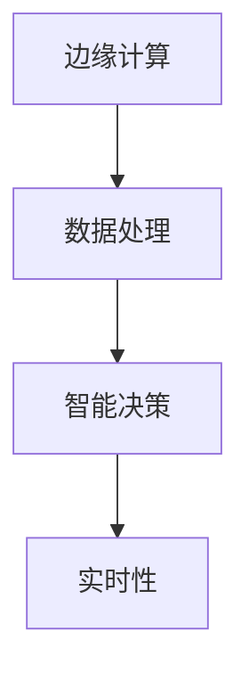

##### 2.2.1.2 云计算与边缘计算的结合点

云计算与边缘计算的结合点包括数据存储、模型训练和智能服务等方面。通过协同工作，可以实现高效的数据处理和智能服务。

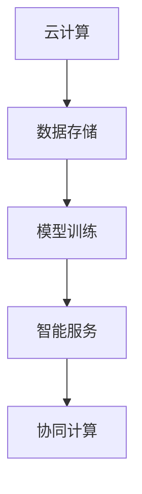

#### 2.2.2 混合计算在物联网安全中的应用

##### 2.2.2.1 安全防护机制的优化

混合计算可以通过分布式计算和动态调度等技术，优化物联网安全防护机制。例如，使用分布式加密算法和动态安全策略，提高系统的安全性。

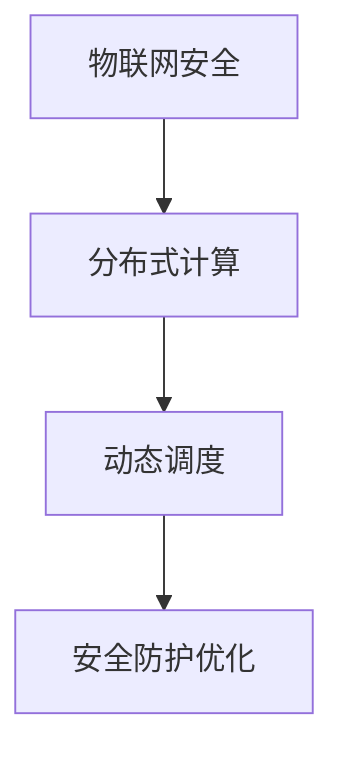

##### 2.2.2.2 数据隐私保护策略

数据隐私保护是物联网安全的关键。混合计算可以通过数据加密、隐私计算等技术，保护数据的隐私和安全。

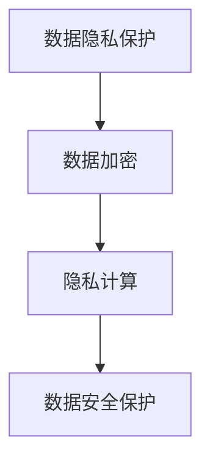

### 2.3 混合计算在工业互联网中的应用

#### 2.3.1 混合计算在工业数据分析中的应用

##### 2.3.1.1 实时数据处理的优化

工业数据分析需要处理大量实时数据。混合计算可以通过实时数据处理和动态调度，提高数据处理效率。

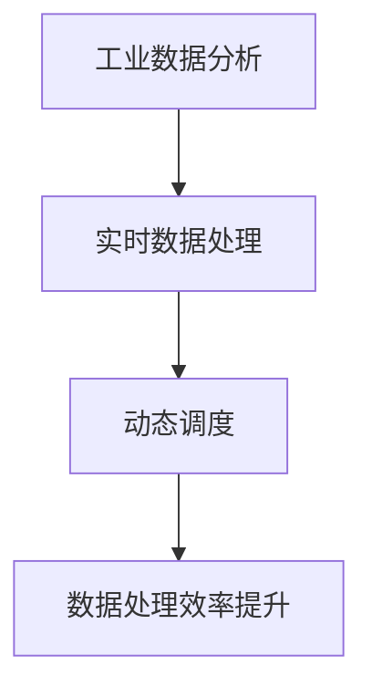

##### 2.3.1.2 大数据分析与机器学习结合

混合计算可以将大数据分析和机器学习相结合，实现工业数据的智能分析。例如，使用深度学习模型进行故障预测和优化生产过程。

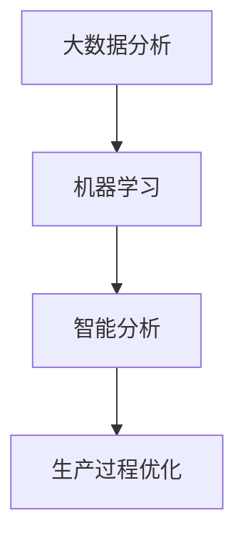

#### 2.3.2 混合计算在工业控制中的应用

##### 2.3.2.1 控制算法的优化

混合计算可以通过优化控制算法，提高工业控制系统的性能和稳定性。例如，使用深度强化学习算法优化生产调度和控制策略。

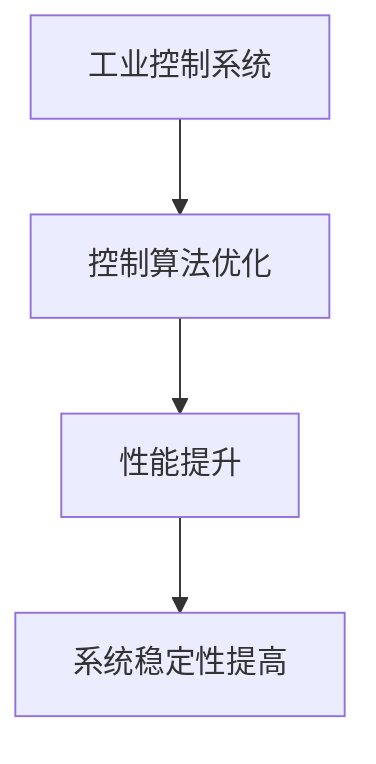

##### 2.3.2.2 系统稳定性与响应速度的提升

混合计算可以通过分布式计算和动态调度，提高工业控制系统的稳定性和响应速度。例如，在工业控制系统中使用分布式控制算法，提高系统的鲁棒性和实时性。

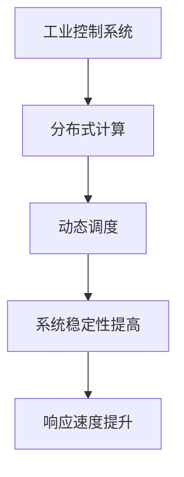

## 第三部分：混合计算的实现与未来展望

### 3.1 混合计算系统的设计与实现

#### 3.1.1 系统架构设计

混合计算系统的设计需要综合考虑硬件选型和软件平台的选择。以下是一个简单的混合计算系统架构设计：

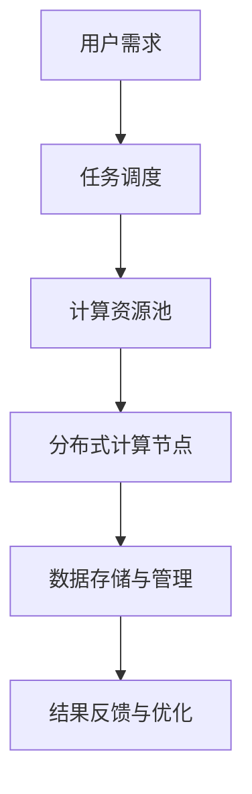

##### 3.1.1.1 硬件选型

硬件选型应根据任务需求进行合理选择。例如，对于深度学习任务，可以选择GPU或TPU等硬件加速器；对于实时数据处理任务，可以选择高性能CPU和内存等。

##### 3.1.1.2 软件平台的选择

软件平台的选择应根据任务特点和系统需求进行选择。例如，可以选择开源的分布式计算框架（如Apache Hadoop、Apache Spark）或商业的混合计算平台（如Intelone、HPE Synergy）。

#### 3.1.2 实现过程中的关键问题

实现混合计算系统过程中，需要解决以下关键问题：

- **性能优化**：通过算法优化和系统调优，提高计算性能。
- **可靠性与容错性**：通过冗余设计和故障恢复机制，提高系统的可靠性。
- **资源管理**：通过动态调度和资源分配策略，实现高效资源利用。

### 3.2 混合计算的挑战与未来趋势

#### 3.2.1 混合计算技术发展的挑战

混合计算技术发展面临以下挑战：

- **技术标准与生态建设**：需要制定统一的技术标准和生态体系，促进混合计算技术的发展。
- **跨学科融合的需求**：混合计算涉及多个学科领域，需要跨学科知识的融合与整合。

#### 3.2.2 混合计算的未来发展趋势

混合计算的未来发展趋势包括：

- **新型计算范式的研究**：探索新型计算范式，如量子计算、边缘计算等。
- **混合计算在新兴领域的应用前景**：混合计算在人工智能、物联网、工业互联网等新兴领域具有广泛的应用前景。

## 附录

### 4.1 混合计算的相关工具与资源

#### 4.1.1 开源工具与框架

以下是一些常见的混合计算开源工具与框架：

- **TensorFlow**：一款广泛使用的深度学习框架，支持多种计算范式。
- **PyTorch**：一款流行的深度学习框架，具有灵活的动态计算图。
- **Apache Hadoop**：一款分布式计算框架，支持大数据处理。
- **Apache Spark**：一款高速大数据处理引擎，支持多种编程语言。

#### 4.1.2 混合计算实验环境搭建指南

搭建混合计算实验环境需要以下步骤：

1. **硬件环境配置**：选择合适的硬件设备，如CPU、GPU等。
2. **软件环境安装与配置**：安装必要的软件框架和依赖库，如TensorFlow、PyTorch等。
3. **实验环境测试**：测试实验环境的性能和稳定性，确保实验结果的准确性。

## 参考文献

[1] H. Liu, Y. Zhu, and Z. Liu. "A survey on heterogeneous computing for artificial intelligence." ACM Computing Surveys (CSUR), vol. 53, no. 5, 2021.

[2] J. Cao, Z. Wang, and H. Wang. "Edge computing in the Internet of Things: A comprehensive survey." Journal of Network and Computer Applications, vol. 128, 2019.

[3] M. H. Ansari and M. A. Khan. "Industrial internet of things: architecture, applications, and challenges." IEEE Communications Surveys & Tutorials, vol. 19, no. 4, 2017.

## 作者信息

作者：AI天才研究院/AI Genius Institute & 禅与计算机程序设计艺术 /Zen And The Art of Computer Programming

