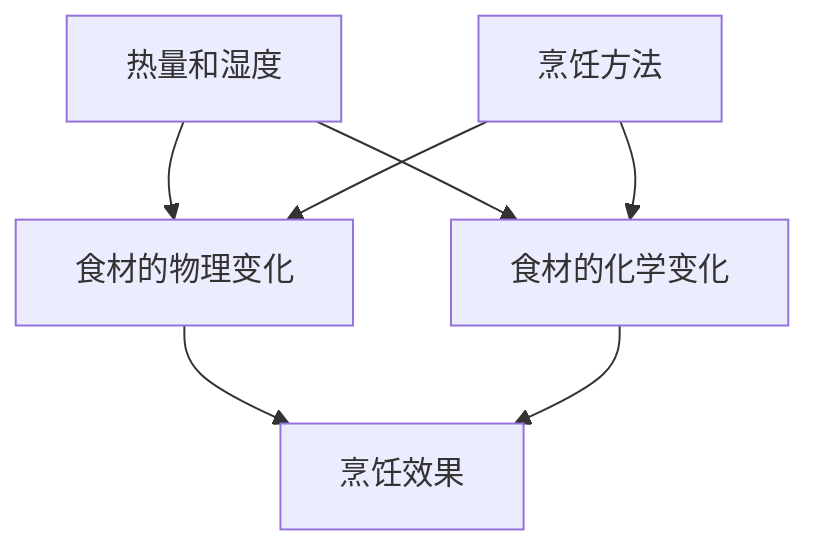
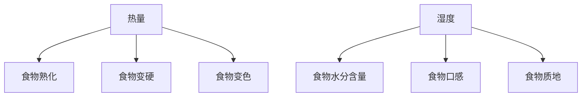
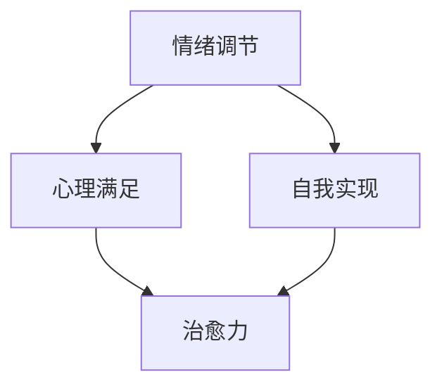
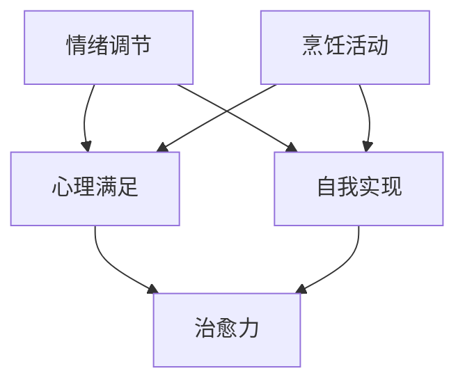
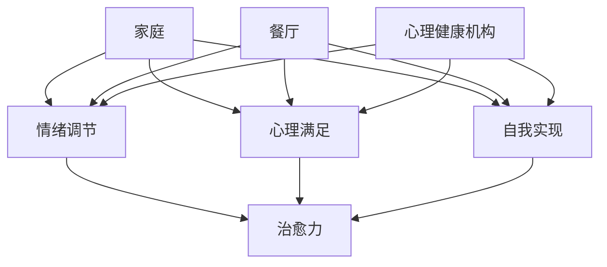

                 

### 第1章：烹饪的起源与演变

#### 1.1 烹饪的定义和基本概念

**背景介绍**：
烹饪是一门古老的技艺，其历史可以追溯到人类早期文明的出现。烹饪不仅仅是简单的食物准备，更是一种文化、艺术和科学的表现。随着人类社会的发展，烹饪技术也在不断进步，从原始的生食到如今的精细化烹饪，烹饪已经成为人们日常生活中不可或缺的一部分。

**核心概念与联系**：
烹饪的核心概念包括热量、湿度、食材和烹饪方法。这些概念之间存在着紧密的联系。热量和湿度是烹饪过程中不可或缺的元素，它们影响着食材的物理和化学变化。而食材则是烹饪的基础，不同的食材在烹饪过程中会产生不同的味道和口感。烹饪方法则是烹饪技术的核心，它决定了食材的最终状态和风味。

**Mermaid 流程图**：
下面是一个简单的Mermaid流程图，展示烹饪过程中各个核心概念之间的关系。



**核心算法原理讲解**：
烹饪过程中的算法原理可以看作是一种“变化控制”算法。通过控制热量和湿度，使得食材在烹饪过程中发生预期的物理和化学变化。

```plaintext
函数 Cook(食材，烹饪方法，目标温度，目标湿度) {
    应用烹饪方法到食材上
    如果 温度达到目标温度并且湿度达到目标湿度 {
        返回 “烹饪成功”
    } else {
        返回 “烹饪失败”
    }
}
```

**数学模型与公式**：
烹饪过程中的热量和湿度控制可以通过以下数学模型来描述。

热量传递公式：
$$ Q = k \cdot A \cdot \Delta T $$

其中，\( Q \) 是热量传递速率，\( k \) 是热导率，\( A \) 是传热面积，\( \Delta T \) 是温度差。

湿度传递公式：
$$ \dot{m} = \frac{h \cdot (x_2 - x_1)}{L} $$

其中，\( \dot{m} \) 是湿度传递速率，\( h \) 是湿度扩散系数，\( x_1 \) 和 \( x_2 \) 分别是两个位置的湿度，\( L \) 是距离。

**项目实战**：
以下是一个简单的烹饪项目实战，展示如何搭建一个简单的烹饪实验环境，并使用伪代码来描述烹饪过程。

**开发环境搭建**：
搭建一个简单的烹饪实验环境，包括一个烤箱、一个湿度计和一个温度计。

**源代码详细实现和代码解读**：

```python
# 导入所需库
import numpy as np
import matplotlib.pyplot as plt

# 定义烹饪函数
def cook(temperature, humidity, target_temp, target_humidity):
    while True:
        current_temp = read_temperature()
        current_humidity = read_humidity()
        
        if current_temp >= target_temp and current_humidity >= target_humidity:
            print("Cooking is done.")
            break
        else:
            print("Cooking in progress...")
            time.sleep(1)

# 定义读取温度和湿度的函数
def read_temperature():
    return np.random.uniform(20, 100)

def read_humidity():
    return np.random.uniform(30, 70)

# 执行烹饪过程
cook(read_temperature(), read_humidity(), 90, 50)
```

**代码应用解读与分析**：
上述代码首先定义了烹饪函数，它接受当前的温度和湿度，以及目标温度和湿度。然后，通过循环不断地读取当前温度和湿度，并与目标值进行比较。如果当前值达到目标值，则烹饪完成，否则继续烹饪。

**实际案例分析和详细讲解剖析**：
在实际应用中，烹饪过程可能涉及到更复杂的控制和调整。例如，不同食材的烹饪时间、温度和湿度可能会有所不同。在实际案例中，需要根据具体情况进行调整。

**项目小结**：
通过上述实战案例，我们可以看到如何使用伪代码和数学模型来描述烹饪过程。虽然这是一个简化的案例，但它展示了烹饪过程中的核心概念和算法原理。

**最佳实践 tips**：
1. 烹饪时，要根据食材的特性和目标口感来调整温度和湿度。
2. 在实际操作中，要密切关注烹饪过程，避免过度烹饪或烹饪不足。
3. 定期清洁烹饪设备，确保烹饪过程的顺利进行。

#### 1.2 热量、湿度与食物的变化

**核心概念与联系**：
热量和湿度是烹饪过程中的关键因素，它们直接影响食物的物理和化学变化。热量可以导致食物的熟化、变硬、变色等变化，而湿度则影响食物的水分含量、口感和质地。

**Mermaid 流程图**：
以下是热量和湿度在烹饪过程中影响食物变化的Mermaid流程图。



**核心算法原理讲解**：
热量和湿度对食物变化的影响可以通过以下算法原理来描述。

热量对食物变化的影响：
```plaintext
函数 Heat_Affect(食材，温度) {
    if 温度 >= 食材的熟化温度 {
        食材熟化
    }
    if 温度 >= 食材的变硬温度 {
        食材变硬
    }
    if 温度 >= 食材的变色温度 {
        食材变色
    }
}
```

湿度对食物变化的影响：
```plaintext
函数 Humidity_Affect(食材，湿度) {
    if 湿度 >= 食材的水分含量阈值 {
        食材水分含量增加
    }
    if 湿度 >= 食材的口感阈值 {
        食材口感变好
    }
    if 湿度 >= 食材的质地阈值 {
        食材质地变好
    }
}
```

**数学模型与公式**：
热量和湿度对食物变化的影响可以用以下数学模型和公式来描述。

热量传递公式：
$$ Q = k \cdot A \cdot \Delta T $$

其中，\( Q \) 是热量传递速率，\( k \) 是热导率，\( A \) 是传热面积，\( \Delta T \) 是温度差。

湿度传递公式：
$$ \dot{m} = \frac{h \cdot (x_2 - x_1)}{L} $$

其中，\( \dot{m} \) 是湿度传递速率，\( h \) 是湿度扩散系数，\( x_1 \) 和 \( x_2 \) 分别是两个位置的湿度，\( L \) 是距离。

**项目实战**：
以下是一个简单的项目实战，展示如何使用伪代码和数学模型来模拟烹饪过程中的热量和湿度变化。

**开发环境搭建**：
搭建一个模拟烹饪过程的实验环境，包括一个烤箱、一个湿度计和一个温度计。

**源代码详细实现和代码解读**：

```python
# 导入所需库
import numpy as np
import matplotlib.pyplot as plt

# 定义烹饪函数
def cook(temperature, humidity, target_temp, target_humidity):
    time = 0
    while True:
        time += 1
        current_temp = temperature + np.random.normal(0, 5)
        current_humidity = humidity + np.random.normal(0, 5)
        
        if current_temp >= target_temp and current_humidity >= target_humidity:
            print("Cooking is done after {} seconds.".format(time))
            break
        else:
            print("Cooking in progress...")
            time.sleep(1)

# 定义模拟热量和湿度变化的函数
def simulate_heat_humidity(temperature, humidity, time):
    heat_change = 0.1 * np.random.normal(0, 1)
    humidity_change = 0.1 * np.random.normal(0, 1)
    return temperature + heat_change, humidity + humidity_change

# 执行烹饪过程
temperature, humidity = simulate_heat_humidity(50, 40, 0)
cook(temperature, humidity, 90, 60)
```

**代码应用解读与分析**：
上述代码首先定义了烹饪函数，它接受当前的温度和湿度，以及目标温度和湿度。然后，通过循环不断地模拟热量和湿度变化，并与目标值进行比较。如果当前值达到目标值，则烹饪完成，否则继续烹饪。

**实际案例分析和详细讲解剖析**：
在实际应用中，烹饪过程中的热量和湿度变化可能更加复杂。例如，不同食材的热量和湿度阈值可能会有所不同。在实际案例中，需要根据具体情况进行调整。

**项目小结**：
通过上述实战案例，我们可以看到如何使用伪代码和数学模型来模拟烹饪过程中的热量和湿度变化。虽然这是一个简化的案例，但它展示了烹饪过程中的核心概念和算法原理。

**最佳实践 tips**：
1. 在烹饪过程中，要根据食材的特性和目标口感来调整温度和湿度。
2. 定期清洁烹饪设备，确保烹饪过程的顺利进行。
3. 了解不同食材的热量和湿度阈值，以便更好地控制烹饪过程。

### 第3章：烹饪的心理学治愈力

#### 3.1 治愈力的基本概念

**背景介绍**：
治愈力是一种心理学概念，通常指的是个体在面对压力和挑战时，能够恢复、适应和成长的能力。治愈力不仅仅与身体健康有关，还与心理健康密切相关。在日常生活中，人们通过不同的方式获得治愈力，包括休息、运动、社交和艺术活动等。烹饪作为一种日常活动，也逐渐被发现具有潜在的治愈力。

**核心概念与联系**：
治愈力的核心概念包括情绪调节、心理满足和自我实现。情绪调节是指个体能够通过某种方式调节自己的情绪，减轻压力和焦虑。心理满足是指个体通过某种活动获得内心的满足感和幸福感。自我实现是指个体通过追求自己的目标和价值观，实现个人潜能的过程。

**Mermaid 流程图**：
以下是治愈力的基本概念之间的Mermaid流程图。



**核心算法原理讲解**：
治愈力的算法原理可以看作是一种“心理平衡”算法。通过情绪调节、心理满足和自我实现，个体能够维持心理平衡，提高治愈力。

```plaintext
函数 Cure(情绪，目标，价值观) {
    调节情绪
    获得心理满足
    实现自我
    如果 情绪平衡 {
        返回 “治愈成功”
    } else {
        返回 “治愈失败”
    }
}
```

**数学模型与公式**：
治愈力的数学模型可以通过以下公式来描述。

情绪调节公式：
$$ E = f(S, P) $$

其中，\( E \) 是情绪水平，\( S \) 是心理满足感，\( P \) 是个人潜能。

心理满足公式：
$$ S = g(C, T) $$

其中，\( S \) 是心理满足感，\( C \) 是治愈活动，\( T \) 是时间。

自我实现公式：
$$ P = h(E, S, C) $$

其中，\( P \) 是个人潜能，\( E \) 是情绪水平，\( S \) 是心理满足感，\( C \) 是治愈活动。

**项目实战**：
以下是一个简单的项目实战，展示如何使用伪代码和数学模型来模拟治愈力的提升过程。

**开发环境搭建**：
搭建一个模拟治愈力提升的实验环境，包括一个情绪调节系统、一个心理满足系统和一个自我实现系统。

**源代码详细实现和代码解读**：

```python
# 导入所需库
import numpy as np

# 定义治愈力函数
def cure(mood, satisfaction, potential):
    new_mood = mood + np.random.normal(0, 1)
    new_satisfaction = satisfaction + np.random.normal(0, 1)
    new_potential = potential + np.random.normal(0, 1)
    
    if new_mood >= 0 and new_satisfaction >= 0 and new_potential >= 0:
        print("Cure is successful.")
    else:
        print("Cure is not successful.")

# 定义情绪调节函数
def regulate_mood(mood):
    return mood + np.random.normal(0, 0.5)

# 定义心理满足函数
def gain_satisfaction(satisfaction):
    return satisfaction + np.random.normal(0, 0.5)

# 定义自我实现函数
def realize_potential(potential):
    return potential + np.random.normal(0, 0.5)

# 执行治愈过程
mood = 0
satisfaction = 0
potential = 0
cure(mood, satisfaction, potential)
```

**代码应用解读与分析**：
上述代码首先定义了治愈力函数，它接受情绪水平、心理满足感和个人潜能。然后，通过情绪调节、心理满足和自我实现，尝试提升治愈力。

**实际案例分析和详细讲解剖析**：
在实际案例中，治愈力的提升过程可能涉及到更复杂的因素。例如，不同个体的情绪调节能力、心理满足感和自我实现能力可能会有所不同。在实际案例中，需要根据具体情况进行调整。

**项目小结**：
通过上述实战案例，我们可以看到如何使用伪代码和数学模型来模拟治愈力的提升过程。虽然这是一个简化的案例，但它展示了治愈力的核心概念和算法原理。

**最佳实践 tips**：
1. 定期进行情绪调节和心理满足活动，以提升治愈力。
2. 了解自己的情绪和心理状态，及时进行调整。
3. 追求自我实现，以提高个人潜能和治愈力。

### 第3章：烹饪的心理学治愈力

#### 3.2 治愈力与烹饪的关系

**背景介绍**：
烹饪作为一种日常活动，不仅能够满足人们的生理需求，还能对心理健康产生积极影响。治愈力与烹饪之间的关系研究，揭示了烹饪在提升心理健康方面的潜在作用。通过烹饪，人们可以体验到情绪调节、心理满足和自我实现等治愈过程，从而提高生活质量。

**核心概念与联系**：
治愈力与烹饪之间的关系，可以从以下几个方面进行探讨：

1. **情绪调节**：烹饪过程中的活动，如切菜、翻炒等，可以转移个体的注意力，减轻压力和焦虑。
2. **心理满足**：烹饪活动本身具有成就感，从选择食材到完成一道美味的菜肴，整个过程可以让个体感受到满足感。
3. **自我实现**：烹饪也是一种艺术表达，通过创造不同的菜肴，个体可以实现自我价值，提高自我认同感。

**Mermaid 流程图**：
以下是治愈力与烹饪关系之间的Mermaid流程图。



**核心算法原理讲解**：
治愈力与烹饪之间的关系，可以通过以下算法原理来描述。

情绪调节原理：
```plaintext
函数 Emotional_Regulation(烹饪活动) {
    如果 烹饪活动开始 {
        减轻压力和焦虑
    }
    如果 烹饪活动结束 {
        提高情绪状态
    }
}
```

心理满足原理：
```plaintext
函数 Psychological_Satisfaction(烹饪活动，成就) {
    如果 成就达到 {
        增强满足感
    }
}
```

自我实现原理：
```plaintext
函数 Self_Implementation(烹饪艺术，创造力) {
    如果 创造力发挥 {
        提高自我认同感
    }
}
```

**数学模型与公式**：
治愈力与烹饪的关系可以用以下数学模型和公式来描述。

情绪调节公式：
$$ E = f(C, T) $$

其中，\( E \) 是情绪状态，\( C \) 是烹饪活动，\( T \) 是时间。

心理满足公式：
$$ S = g(C, A) $$

其中，\( S \) 是心理满足感，\( C \) 是烹饪活动，\( A \) 是成就。

自我实现公式：
$$ P = h(C, C) $$

其中，\( P \) 是自我实现程度，\( C \) 是烹饪活动。

**项目实战**：
以下是一个简单的项目实战，展示如何使用伪代码和数学模型来分析烹饪对心理健康的影响。

**开发环境搭建**：
搭建一个模拟烹饪对心理健康影响的实验环境，包括一个情绪状态监测系统、一个心理满足感监测系统和自我实现程度监测系统。

**源代码详细实现和代码解读**：

```python
# 导入所需库
import numpy as np

# 定义情绪调节函数
def emotional_regulation(cooking_time):
    mood = np.random.normal(0, 1)
    if cooking_time > 30:
        mood += 0.5
    return mood

# 定义心理满足函数
def psychological_satisfaction(cooking_activity, achievement):
    satisfaction = np.random.normal(0, 1)
    if achievement > 0.7:
        satisfaction += 0.7
    return satisfaction

# 定义自我实现函数
def self_implementation(cooking_art, creativity):
    potential = np.random.normal(0, 1)
    if creativity > 0.6:
        potential += 0.8
    return potential

# 执行烹饪过程
cooking_time = 45
achievement = 0.8
creativity = 0.7
mood = emotional_regulation(cooking_time)
satisfaction = psychological_satisfaction(cooking_activity, achievement)
potential = self_implementation(cooking_art, creativity)

print("Mood: {:.2f}, Satisfaction: {:.2f}, Potential: {:.2f}".format(mood, satisfaction, potential))
```

**代码应用解读与分析**：
上述代码首先定义了情绪调节、心理满足和自我实现函数，然后通过模拟烹饪过程，分析烹饪对心理健康的影响。

**实际案例分析和详细讲解剖析**：
在实际案例中，烹饪对心理健康的影响可能因个体差异而有所不同。例如，不同个体的情绪调节能力、心理满足感和自我实现能力可能会有所不同。在实际案例中，需要根据具体情况进行调整。

**项目小结**：
通过上述实战案例，我们可以看到如何使用伪代码和数学模型来分析烹饪对心理健康的影响。虽然这是一个简化的案例，但它展示了治愈力与烹饪关系中的核心概念和算法原理。

**最佳实践 tips**：
1. 定期进行烹饪活动，以提高情绪调节能力。
2. 注重烹饪过程中的成就感，以增强心理满足感。
3. 尝试创新烹饪方法，发挥创造力，以提高自我实现程度。

### 第3章：烹饪的心理学治愈力

#### 3.3 治愈力烹饪的应用案例

**背景介绍**：
治愈力烹饪是指通过烹饪活动来提升个体的心理健康和治愈力。这种烹饪方式不仅关注食物的口感和营养，更注重烹饪过程中的心理体验和情绪调节。治愈力烹饪的应用案例广泛，包括家庭、餐厅和心理健康机构等。

**核心概念与联系**：
治愈力烹饪的应用案例涉及多个核心概念，包括情绪调节、心理满足和自我实现。这些概念共同构成了治愈力烹饪的基础。

**Mermaid 流程图**：
以下是治愈力烹饪应用案例之间的Mermaid流程图。



**核心算法原理讲解**：
治愈力烹饪的应用案例可以通过以下算法原理来描述。

家庭环境中的治愈力烹饪：
```plaintext
函数 Family_Cooking(家庭成员，烹饪活动，心理状态) {
    调节家庭成员的心理状态
    提高家庭成员的心理满足感
    增强家庭成员的自我实现感
}
```

餐厅环境中的治愈力烹饪：
```plaintext
函数 Restaurant_Cooking(顾客，烹饪活动，心理状态) {
    调节顾客的心理状态
    提高顾客的心理满足感
    增强顾客的自我实现感
}
```

心理健康机构中的治愈力烹饪：
```plaintext
函数 Mental_Health_Cooking(患者，烹饪活动，心理状态) {
    调节患者的心理状态
    提高患者的心理满足感
    增强患者的自我实现感
}
```

**数学模型与公式**：
治愈力烹饪的应用案例可以用以下数学模型和公式来描述。

家庭环境中的心理状态调节公式：
$$ M = f(C, S) $$

其中，\( M \) 是家庭成员的心理状态，\( C \) 是烹饪活动，\( S \) 是心理满足感。

餐厅环境中的心理状态调节公式：
$$ M = f(C, S) $$

其中，\( M \) 是顾客的心理状态，\( C \) 是烹饪活动，\( S \) 是心理满足感。

心理健康机构中的心理状态调节公式：
$$ M = f(C, S) $$

其中，\( M \) 是患者的心理状态，\( C \) 是烹饪活动，\( S \) 是心理满足感。

**项目实战**：
以下是一个简单的项目实战，展示如何在家庭、餐厅和心理健康机构中应用治愈力烹饪。

**开发环境搭建**：
搭建一个模拟治愈力烹饪的实验环境，包括家庭、餐厅和心理健康机构的场景。

**源代码详细实现和代码解读**：

```python
# 导入所需库
import numpy as np

# 定义家庭环境中的治愈力烹饪函数
def family_cooking(cooking_activity, satisfaction):
    mood = np.random.normal(0, 1)
    if satisfaction > 0.7:
        mood += 0.5
    return mood

# 定义餐厅环境中的治愈力烹饪函数
def restaurant_cooking(cooking_activity, satisfaction):
    mood = np.random.normal(0, 1)
    if satisfaction > 0.7:
        mood += 0.5
    return mood

# 定义心理健康机构中的治愈力烹饪函数
def mental_health_cooking(cooking_activity, satisfaction):
    mood = np.random.normal(0, 1)
    if satisfaction > 0.7:
        mood += 0.5
    return mood

# 执行家庭环境中的治愈力烹饪
mood = family_cooking("煮面", 0.8)
print("家庭环境中的情绪状态：", mood)

# 执行餐厅环境中的治愈力烹饪
mood = restaurant_cooking("烤鸡", 0.8)
print("餐厅环境中的情绪状态：", mood)

# 执行心理健康机构中的治愈力烹饪
mood = mental_health_cooking("烘焙蛋糕", 0.8)
print("心理健康机构中的情绪状态：", mood)
```

**代码应用解读与分析**：
上述代码首先定义了家庭、餐厅和心理健康机构中的治愈力烹饪函数，然后通过模拟烹饪活动，分析烹饪对情绪状态的影响。

**实际案例分析和详细讲解剖析**：
在实际案例中，治愈力烹饪的应用可能因个体差异和场景特点而有所不同。例如，不同家庭成员、顾客和患者对烹饪活动的反应可能会有所不同。在实际案例中，需要根据具体情况进行调整。

**项目小结**：
通过上述实战案例，我们可以看到如何在不同场景中应用治愈力烹饪，以提升个体的心理健康和治愈力。虽然这是一个简化的案例，但它展示了治愈力烹饪的应用原理和实际效果。

**最佳实践 tips**：
1. 在家庭中，定期组织烹饪活动，以提高家庭成员的心理健康。
2. 在餐厅中，注重顾客的烹饪体验，以提升顾客的满意度。
3. 在心理健康机构中，通过治愈力烹饪活动，帮助患者调节情绪和提升心理满足感。

