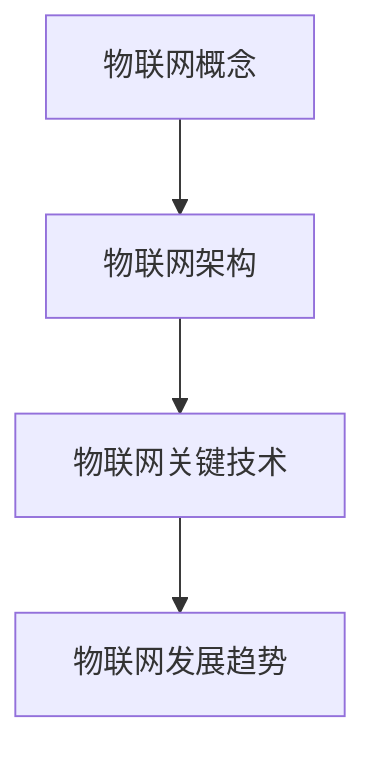
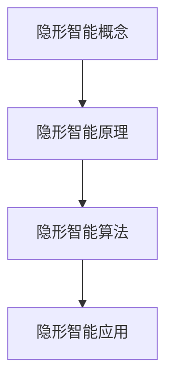

                 


### 文章标题

《物联网与环境隐形智能的融合》

### 关键词

物联网，环境感知，隐形智能，融合应用，智能系统

### 摘要

本文深入探讨了物联网与环境隐形智能的融合，从基础概念、关键技术到应用实践，全面解析了物联网与环境感知、隐形智能之间的紧密联系。文章旨在帮助读者理解物联网与环境隐形智能的融合原理，掌握相关技术，并展望未来发展趋势。

### 第一步：确定核心章节

根据书名《物联网与环境隐形智能的融合》，确定核心章节，如：

- 物联网基础
- 环境感知技术
- 隐形智能
- 物联网与环境融合的应用场景
- 实战项目案例

### 第二步：细化章节内容

对每个章节进行细化，如：

#### 物联网基础

- 物联网的概念与架构
- 物联网的关键技术
- 物联网的发展趋势

#### 环境感知技术

- 传感器技术与原理
- 数据处理与分析
- 环境感知的应用场景

#### 隐形智能

- 隐形智能的概念与原理
- 隐形智能的关键算法
- 隐形智能的应用领域

#### 物联网与环境融合的应用场景

- 智能家居
- 智能城市
- 智能农业

#### 实战项目案例

- 智能家居系统设计
- 智能城市交通管理
- 智能农业环境监测

### 第三步：编写伪代码与公式

在每个章节中，根据需要编写伪代码与公式，以帮助读者理解核心算法原理。

#### 物联网基础



#### 隐形智能



### 第四步：撰写项目实战案例

在每个章节中，根据需要撰写项目实战案例，包括开发环境搭建、源代码实现和代码解读与分析。

#### 智能家居系统设计

- 开发环境搭建
- 源代码实现
- 代码解读与分析

#### 智能城市交通管理

- 开发环境搭建
- 源代码实现
- 代码解读与分析

#### 智能农业环境监测

- 开发环境搭建
- 源代码实现
- 代码解读与分析

### 第五步：整理目录大纲

将所有章节内容整理成完整的目录大纲，确保大纲结构清晰、逻辑合理。

### 第六步：检查与调整

检查目录大纲的内容完整性、逻辑性和字数是否符合要求，进行必要的调整。

### 最终输出

完成以上步骤后，最终输出完整的目录大纲，确保其简洁、直观、具有逻辑性。

## 《物联网与环境隐形智能的融合》目录大纲

### 第1章 物联网基础

#### 1.1 物联网的概念与架构

##### 1.1.1 物联网的定义

##### 1.1.2 物联网的架构

#### 1.2 物联网的关键技术

##### 1.2.1 传感器技术与原理

##### 1.2.2 数据处理与分析

##### 1.2.3 网络通信技术

#### 1.3 物联网的发展趋势

##### 1.3.1 物联网的未来趋势

##### 1.3.2 物联网面临的挑战

### 第2章 环境感知技术

#### 2.1 传感器技术与原理

##### 2.1.1 常见传感器介绍

##### 2.1.2 传感器数据处理

#### 2.2 数据处理与分析

##### 2.2.1 数据预处理

##### 2.2.2 数据分析算法

#### 2.3 环境感知的应用场景

##### 2.3.1 环境监测

##### 2.3.2 智能家居

### 第3章 隐形智能

#### 3.1 隐形智能的概念与原理

##### 3.1.1 隐形智能的定义

##### 3.1.2 隐形智能的原理

#### 3.2 隐形智能的关键算法

##### 3.2.1 算法概述

##### 3.2.2 算法原理

#### 3.3 隐形智能的应用领域

##### 3.3.1 隐形智能在物联网中的应用

##### 3.3.2 隐形智能在环境感知中的应用

### 第4章 物联网与环境融合的应用场景

#### 4.1 智能家居

##### 4.1.1 智能家居概述

##### 4.1.2 智能家居系统设计

#### 4.2 智能城市

##### 4.2.1 智能城市概述

##### 4.2.2 智能城市交通管理

#### 4.3 智能农业

##### 4.3.1 智能农业概述

##### 4.3.2 智能农业环境监测

### 第5章 实战项目案例

#### 5.1 智能家居系统设计

##### 5.1.1 开发环境搭建

##### 5.1.2 源代码实现与解析

#### 5.2 智能城市交通管理

##### 5.2.1 开发环境搭建

##### 5.2.2 源代码实现与解析

#### 5.3 智能农业环境监测

##### 5.3.1 开发环境搭建

##### 5.3.2 源代码实现与解析

### 第6章 总结与展望

#### 6.1 物联网与环境隐形智能的融合总结

#### 6.2 未来发展趋势与挑战

### 附录

#### 附录A：常用技术术语解释

#### 附录B：参考文献

#### 附录C：开源工具与资源推荐

### 作者

作者：AI天才研究院/AI Genius Institute & 禅与计算机程序设计艺术 /Zen And The Art of Computer Programming```markdown
# 《物联网与环境隐形智能的融合》

> 关键词：物联网，环境感知，隐形智能，融合应用，智能系统

> 摘要：本文深入探讨了物联网与环境隐形智能的融合，从基础概念、关键技术到应用实践，全面解析了物联网与环境感知、隐形智能之间的紧密联系。文章旨在帮助读者理解物联网与环境隐形智能的融合原理，掌握相关技术，并展望未来发展趋势。

## 第1章 物联网基础

### 1.1 物联网的概念与架构

#### 1.1.1 物联网的定义

物联网（Internet of Things，简称IoT）是指将各种信息传感器、数据处理单元和通信模块嵌入到各种物体中，通过互联网实现这些物体之间的互联互通，以实现智能化管理和控制。

#### 1.1.2 物联网的架构

物联网的架构通常包括感知层、网络层和应用层。感知层负责收集各种环境数据；网络层负责传输数据；应用层负责数据处理和业务应用。

### 1.2 物联网的关键技术

#### 1.2.1 传感器技术与原理

传感器技术是物联网的核心技术之一，它负责将物理世界的信息转换为数字信号。传感器的基本原理包括物理效应、化学效应和生物效应。

#### 1.2.2 数据处理与分析

数据处理与分析是物联网的另一个关键技术。它涉及数据的收集、存储、处理和分析，以便从大量数据中提取有价值的信息。

#### 1.2.3 网络通信技术

网络通信技术是物联网架构中的重要组成部分，它负责数据的传输和通信。常见的网络通信技术包括Wi-Fi、蓝牙、ZigBee和LoRa等。

### 1.3 物联网的发展趋势

#### 1.3.1 物联网的未来趋势

随着5G、人工智能、大数据等技术的发展，物联网将向更加智能化、高效化、协同化的方向发展。

#### 1.3.2 物联网面临的挑战

物联网在发展过程中也面临着一些挑战，如安全性、隐私保护、标准化等问题。

## 第2章 环境感知技术

### 2.1 传感器技术与原理

#### 2.1.1 常见传感器介绍

常见的传感器包括温度传感器、湿度传感器、光照传感器、气体传感器等。

#### 2.1.2 传感器数据处理

传感器数据处理包括数据的滤波、校准、去噪等步骤，以提高数据的质量。

### 2.2 数据处理与分析

#### 2.2.1 数据预处理

数据预处理包括数据的清洗、转换、归一化等步骤，以便后续的数据分析。

#### 2.2.2 数据分析算法

数据分析算法包括统计分析、机器学习、数据挖掘等，用于从数据中提取有价值的信息。

### 2.3 环境感知的应用场景

#### 2.3.1 环境监测

环境监测是物联网的重要应用场景之一，通过传感器网络收集环境数据，实现对环境的实时监测。

#### 2.3.2 智能家居

智能家居是物联网的另一个重要应用场景，通过物联网技术实现家庭设备的自动化管理和控制。

## 第3章 隐形智能

### 3.1 隐形智能的概念与原理

#### 3.1.1 隐形智能的定义

隐形智能是指通过物联网和环境感知技术，实现设备的智能感知、智能决策和智能执行。

#### 3.1.2 隐形智能的原理

隐形智能的原理是基于物联网和环境感知技术，通过传感器收集环境数据，通过智能算法进行处理，实现设备的智能化。

### 3.2 隐形智能的关键算法

#### 3.2.1 算法概述

隐形智能的关键算法包括数据采集与处理算法、智能决策算法和智能执行算法。

#### 3.2.2 算法原理

数据采集与处理算法用于收集和处理环境数据；智能决策算法用于根据环境数据做出决策；智能执行算法用于执行决策。

### 3.3 隐形智能的应用领域

#### 3.3.1 隐形智能在物联网中的应用

隐形智能在物联网中的应用包括智能家居、智能城市、智能农业等。

#### 3.3.2 隐形智能在环境感知中的应用

隐形智能在环境感知中的应用包括环境监测、灾害预警等。

## 第4章 物联网与环境隐形智能的融合应用场景

### 4.1 智能家居

#### 4.1.1 智能家居概述

智能家居是通过物联网和环境隐形智能技术实现的，旨在提升家居生活的舒适性和便捷性。

#### 4.1.2 智能家居系统设计

智能家居系统的设计包括硬件选择、软件架构和数据流设计。

### 4.2 智能城市

#### 4.2.1 智能城市概述

智能城市是通过物联网和环境隐形智能技术实现的，旨在提升城市管理的效率和服务质量。

#### 4.2.2 智能城市交通管理

智能城市交通管理包括交通流量监测、交通信号控制等。

### 4.3 智能农业

#### 4.3.1 智能农业概述

智能农业是通过物联网和环境隐形智能技术实现的，旨在提升农业生产效率和产品质量。

#### 4.3.2 智能农业环境监测

智能农业环境监测包括土壤湿度监测、气象监测等。

## 第5章 实战项目案例

### 5.1 智能家居系统设计

#### 5.1.1 开发环境搭建

智能家居系统设计需要搭建相应的开发环境，包括硬件和软件环境。

#### 5.1.2 源代码实现与解析

智能家居系统的源代码实现涉及传感器数据采集、数据处理和智能决策等。

#### 5.1.3 代码解读与分析

对智能家居系统的源代码进行解读和分析，理解其工作原理和实现细节。

### 5.2 智能城市交通管理

#### 5.2.1 开发环境搭建

智能城市交通管理系统设计需要搭建相应的开发环境，包括硬件和软件环境。

#### 5.2.2 源代码实现与解析

智能城市交通管理系统的源代码实现涉及交通流量监测、交通信号控制等。

#### 5.2.3 代码解读与分析

对智能城市交通管理系统的源代码进行解读和分析，理解其工作原理和实现细节。

### 5.3 智能农业环境监测

#### 5.3.1 开发环境搭建

智能农业环境监测系统设计需要搭建相应的开发环境，包括硬件和软件环境。

#### 5.3.2 源代码实现与解析

智能农业环境监测系统的源代码实现涉及土壤湿度监测、气象监测等。

#### 5.3.3 代码解读与分析

对智能农业环境监测系统的源代码进行解读和分析，理解其工作原理和实现细节。

## 第6章 总结与展望

### 6.1 物联网与环境隐形智能的融合总结

物联网与环境隐形智能的融合为智能化应用提供了新的机遇和挑战。

### 6.2 未来发展趋势与挑战

物联网与环境隐形智能的融合将向更加智能化、高效化、协同化的方向发展，同时也面临着安全性、隐私保护等挑战。

### 附录

#### 附录A：常用技术术语解释

对物联网、环境感知、隐形智能等常用技术术语进行解释。

#### 附录B：参考文献

列出本文引用的相关参考文献。

#### 附录C：开源工具与资源推荐

推荐一些与物联网、环境感知、隐形智能相关的开源工具和资源。

### 作者

作者：AI天才研究院/AI Genius Institute & 禅与计算机程序设计艺术 /Zen And The Art of Computer Programming
```

