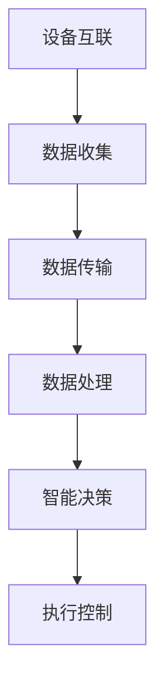
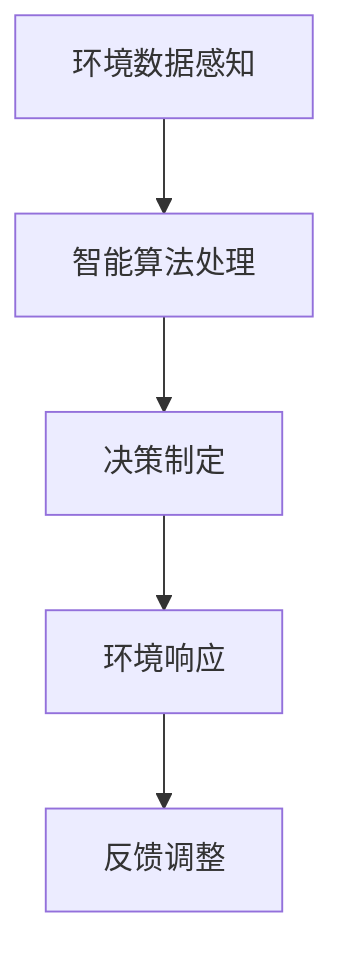
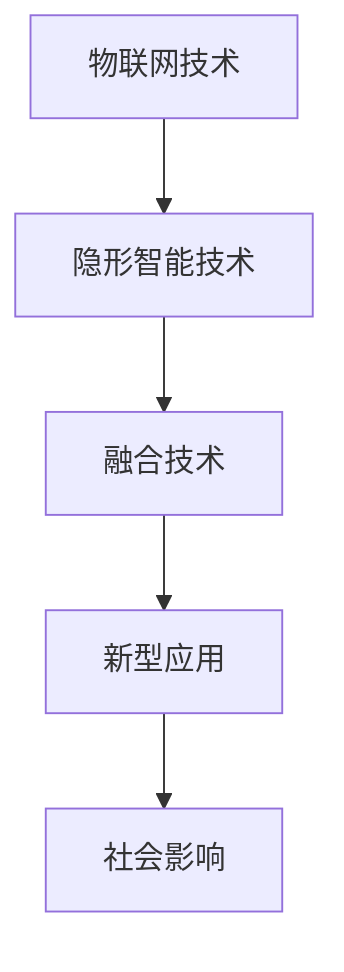

                 

### 第1章: 物联网与隐形智能概述

#### 1.1 物联网简介

**核心概念与联系：**

物联网（IoT，Internet of Things）是指通过互联网、通信网络、传感器、智能设备等技术，将各种物理设备连接起来，实现数据的收集、传输、处理和智能决策，最终实现设备的互联互通和智能化管理。物联网的基本架构包括感知层、传输层、平台层和应用层。感知层负责数据的采集，传输层负责数据的传输，平台层负责数据的管理和处理，应用层则通过智能算法和决策模型，将数据转化为实际的应用价值。

为了更好地理解物联网的核心概念与联系，我们可以使用Mermaid流程图来表示：



**主要组成部分：**

- **传感器：**传感器是物联网系统中的核心组成部分，用于感知环境中的各种物理量，如温度、湿度、光照、声音等，并将其转换为电信号。
- **网络：**物联网设备通过网络进行通信和数据传输。网络可以是有线网络（如以太网、光纤）或无线网络（如WiFi、LoRa、NB-IoT等）。
- **数据处理单元：**数据处理单元负责对采集到的数据进行处理、分析和存储，为智能决策提供支持。
- **执行单元：**执行单元根据智能决策的结果，控制物联网设备进行相应的操作，如调节设备参数、发送指令等。

#### 1.2 环境隐形智能

**核心概念与联系：**

环境隐形智能是指通过物联网技术，实现智能系统与环境之间的无缝融合，使环境变得“智能”。环境隐形智能的核心在于感知环境的变化，通过智能算法进行分析和决策，然后根据决策结果进行环境调控，以达到优化环境的目的。环境隐形智能的关键组成部分包括环境感知、智能算法处理、决策制定和执行调控。

为了更好地理解环境隐形智能的核心概念与联系，我们可以使用Mermaid流程图来表示：



**主要特点：**

- **自适应：**环境隐形智能系统能够根据环境的变化进行自适应调整，提高系统的适应能力和稳定性。
- **节能：**通过智能决策减少能源消耗，提高系统的能源利用效率。
- **高效：**环境隐形智能系统能够高效地处理大量数据，提供实时决策，提高系统的运行效率。

#### 1.3 融合发展趋势

**核心概念与联系：**

融合发展趋势指的是物联网与隐形智能技术之间的融合，以及这种融合带来的技术革新和社会影响。物联网与隐形智能的融合，不仅提高了系统的智能化程度，还拓宽了物联网的应用场景，推动了物联网技术的快速发展。

为了更好地理解融合发展趋势的核心概念与联系，我们可以使用Mermaid流程图来表示：



**融合带来的影响：**

- **技术革新：**物联网与隐形智能的融合，推动了新型技术的诞生，如边缘计算、雾计算、智能城市、智能农业等。
- **应用拓展：**物联网与隐形智能的融合，使物联网技术能够在更多领域得到应用，提高了物联网技术的应用价值。
- **社会影响：**物联网与隐形智能的融合，对社会产生了深远的影响，如提高了生活品质、优化了资源利用、促进了经济发展等。

## 第2章: 物联网技术基础

### 2.1 物联网架构

**2.1.1 物联网基本架构**

物联网的基本架构包括感知层、传输层、平台层和应用层。每一层都有其特定的功能和作用，下面将详细说明每一层的核心概念和组成部分。

**感知层：**

感知层是物联网系统的基础，负责数据的采集和初步处理。感知层的主要组成部分包括传感器和执行器。

- **传感器：**用于感知环境中的各种物理量，如温度、湿度、光照、声音等，并将其转换为电信号。常见的传感器有温度传感器、湿度传感器、光敏传感器、声波传感器等。
- **执行器：**用于根据智能决策的结果执行具体的操作，如调节设备参数、控制设备开关等。常见的执行器有电机、阀门、开关等。

**传输层：**

传输层负责将感知层采集到的数据传输到平台层，是物联网系统的通信桥梁。传输层的主要组成部分包括无线网络和有线网络。

- **无线网络：**常见的无线网络有WiFi、LoRa、NB-IoT等，它们具有低功耗、广覆盖等特点，适用于物联网设备的远程通信。
- **有线网络：**常见的有线网络有以太网、光纤等，它们具有高速传输、稳定性高等特点，适用于数据密集型场景。

**平台层：**

平台层是物联网系统的核心，负责数据的处理、分析和存储，为智能决策提供支持。平台层的主要组成部分包括数据处理单元、数据存储单元和算法库。

- **数据处理单元：**负责对采集到的数据进行处理、分析和清洗，提取有用信息，为智能决策提供数据支持。
- **数据存储单元：**负责存储处理后的数据，包括数据库、缓存等，为数据分析和挖掘提供基础。
- **算法库：**提供各种数据处理和分析算法，如机器学习、深度学习、数据挖掘等，为智能决策提供技术支持。

**应用层：**

应用层是物联网系统的最高层，负责将处理后的数据转化为实际的应用价值。应用层的主要组成部分包括智能应用、用户界面和业务逻辑。

- **智能应用：**根据处理后的数据，实现各种智能应用，如智能家居、智能城市、智能农业等。
- **用户界面：**为用户提供交互界面，展示处理后的数据和应用结果。
- **业务逻辑：**负责处理用户输入、数据分析和决策执行等业务逻辑。

**2.1.2 物联网架构的演变**

物联网架构经历了从简单到复杂、从独立到融合的演变过程。最初，物联网系统主要由独立的小型系统组成，各系统之间缺乏有效的数据共享和协同工作。随着技术的不断发展，物联网架构逐渐融合，形成了更为复杂、高效的系统。

- **初始阶段：**以单一设备或系统为中心，设备之间缺乏通信和协作。
- **发展阶段：**物联网系统开始实现互联互通，设备之间通过通信网络进行数据交换。
- **融合阶段：**物联网系统进一步融合，形成统一的架构，实现数据共享和协同工作。

#### 2.2 网络通信协议

**2.2.1 常用物联网通信协议**

物联网通信协议是物联网系统中非常重要的组成部分，用于实现设备之间的通信和数据传输。目前，常用的物联网通信协议包括ZigBee、WiFi、LoRa和NB-IoT等。下面将分别介绍这些协议的核心概念、特点和应用场景。

**ZigBee：**

ZigBee是一种低功耗、短距离、低速率的无线通信协议，适用于物联网设备的短距离通信。ZigBee协议的核心概念包括网络拓扑、设备角色和数据传输。

- **网络拓扑：**ZigBee网络采用星型、网状和树型拓扑结构，设备之间可以通过路由器进行通信。
- **设备角色：**ZigBee设备分为协调器、路由器和终端设备，协调器负责网络的建立和维护，路由器负责数据传输和路由，终端设备负责数据采集和传输。
- **数据传输：**ZigBee采用基于报文的传输机制，数据传输速率较低，但具有高可靠性和低功耗的特点。

ZigBee协议的主要特点包括：

- **低功耗：**ZigBee设备具有较低的功耗，适合电池供电的设备。
- **短距离：**ZigBee网络的通信距离较短，一般适用于家庭、办公室等小型场景。
- **高可靠性：**ZigBee协议具有自修复能力和多跳传输功能，提高了数据传输的可靠性。

ZigBee协议的主要应用场景包括：

- **智能家居：**用于连接各种智能设备，如灯泡、门锁、传感器等。
- **工业控制：**用于实现工业自动化控制，如生产线监控、设备维护等。
- **医疗保健：**用于远程监控患者健康数据，如心率、血压等。

**WiFi：**

WiFi是一种高速、广覆盖的无线通信协议，适用于物联网设备的中距离通信。WiFi协议的核心概念包括无线接入点、无线客户端和数据传输。

- **无线接入点：**WiFi接入点负责无线网络的建立和维护，提供无线信号接入服务。
- **无线客户端：**WiFi客户端负责连接无线接入点，访问无线网络。
- **数据传输：**WiFi采用基于报文的传输机制，数据传输速率较高，但功耗较大。

WiFi协议的主要特点包括：

- **高速传输：**WiFi协议具有高速的数据传输速率，适合数据密集型场景。
- **广覆盖：**WiFi网络具有较广的覆盖范围，适合公共场所、大型场景等。
- **多功能支持：**WiFi协议支持多种数据传输模式和功能，如视频传输、语音通话等。

WiFi协议的主要应用场景包括：

- **智能家居：**用于连接各种智能设备，如智能电视、智能音响等。
- **智能城市：**用于实现城市智能化管理，如交通监控、环境监测等。
- **商业应用：**用于实现商业智能，如零售监控、库存管理等。

**LoRa：**

LoRa是一种长距离、低功耗的无线通信协议，适用于物联网设备的远程通信。LoRa协议的核心概念包括频率跳变、功率控制和数据传输。

- **频率跳变：**LoRa协议采用频率跳变技术，通过在不同频率上跳变传输，提高抗干扰能力和通信距离。
- **功率控制：**LoRa协议通过动态调整发射功率，实现长距离通信和低功耗传输。
- **数据传输：**LoRa协议采用基于报文的传输机制，数据传输速率较低，但具有高可靠性和低功耗的特点。

LoRa协议的主要特点包括：

- **长距离：**LoRa协议具有较长的通信距离，一般适用于远程监控场景。
- **低功耗：**LoRa协议具有较低的功耗，适合电池供电的设备。
- **高可靠性：**LoRa协议采用前向纠错（FEC）技术，提高数据传输的可靠性。

LoRa协议的主要应用场景包括：

- **远程监控：**用于实现远程监控，如环境监测、森林防火等。
- **智能农业：**用于实现智能灌溉、土壤监测等。
- **智能城市：**用于实现智能交通、智能照明等。

**NB-IoT：**

NB-IoT是一种广覆盖、低功耗、低成本的物联网通信协议，适用于物联网设备的远程通信。NB-IoT协议的核心概念包括频谱利用、功率控制和数据传输。

- **频谱利用：**NB-IoT协议采用窄带频谱技术，提高频谱利用率，实现广覆盖。
- **功率控制：**NB-IoT协议通过动态调整发射功率，实现长距离通信和低功耗传输。
- **数据传输：**NB-IoT协议采用基于报文的传输机制，数据传输速率较低，但具有高可靠性和低功耗的特点。

NB-IoT协议的主要特点包括：

- **广覆盖：**NB-IoT协议具有广的覆盖范围，适合地下、地下室等难以覆盖的场景。
- **低功耗：**NB-IoT协议具有较低的功耗，适合电池供电的设备。
- **低成本：**NB-IoT协议具有较低的成本，适合大规模部署。

NB-IoT协议的主要应用场景包括：

- **智能抄表：**用于实现水、电、燃气等远程抄表。
- **远程监控：**用于实现远程监控，如电力监控、安防监控等。
- **智能城市：**用于实现智能交通、智能照明等。

### 2.3 物联网技术发展趋势

随着物联网技术的不断发展，物联网技术正朝着更加智能化、高效化、低成本和广覆盖的方向发展。以下是物联网技术的一些发展趋势：

**1. 边缘计算与雾计算：**

边缘计算和雾计算是物联网技术的重要发展方向，它们通过将计算和存储能力从云端下沉到网络边缘，提高了系统的实时性和响应速度。

- **边缘计算：**将计算和存储能力部署在靠近数据源的网络边缘，实现数据的本地处理和实时决策。
- **雾计算：**将计算和存储能力部署在介于云端和边缘设备之间的网络节点，实现数据的分布式处理和高效利用。

**2. 5G与物联网：**

5G技术的快速发展为物联网提供了更高的传输速率、更低的延迟和更大的连接容量，推动了物联网技术的广泛应用。

- **高速传输：**5G网络具有更高的传输速率，可以实现高清视频、语音等大带宽应用。
- **低延迟：**5G网络具有更低的延迟，可以实现实时通信和智能控制。
- **大连接容量：**5G网络具有更大的连接容量，可以支持更多的物联网设备同时在线。

**3. 物联网安全与隐私保护：**

随着物联网设备的广泛应用，物联网安全与隐私保护成为越来越重要的问题。物联网技术正朝着更加安全、可靠和隐私保护的方向发展。

- **安全协议：**采用安全协议（如TLS、IPSec等）确保数据传输的安全。
- **加密技术：**采用加密技术（如AES、RSA等）保护数据的安全。
- **隐私保护：**通过隐私保护技术（如差分隐私、数据匿名化等）保护用户的隐私。

**4. 智能化与自动化：**

物联网技术的智能化和自动化是未来的发展方向，通过人工智能、机器学习等技术实现设备的自我优化和智能决策。

- **智能感知：**通过智能感知技术实现设备的自适应调整和智能控制。
- **自主决策：**通过机器学习等技术实现设备的自主决策和智能行动。
- **自动化执行：**通过自动化执行技术实现设备的自动化操作和协同工作。

### 2.4 物联网技术的挑战与应对策略

尽管物联网技术发展迅速，但仍面临着一系列挑战。以下是物联网技术的一些主要挑战和相应的应对策略：

**1. 网络安全问题：**

随着物联网设备的广泛应用，网络安全问题日益突出。应对策略包括：

- **安全协议：**采用安全协议（如TLS、IPSec等）确保数据传输的安全。
- **加密技术：**采用加密技术（如AES、RSA等）保护数据的安全。
- **安全审计：**定期进行安全审计，发现和修复安全漏洞。

**2. 数据隐私问题：**

物联网设备收集和处理大量的数据，涉及到用户的隐私问题。应对策略包括：

- **隐私保护技术：**采用隐私保护技术（如差分隐私、数据匿名化等）保护用户的隐私。
- **透明机制：**建立透明的数据收集、处理和使用机制，增强用户对数据的控制。
- **用户同意：**在数据收集和使用前，获得用户的明确同意。

**3. 兼容性问题：**

物联网设备种类繁多，不同设备之间的兼容性问题成为一大挑战。应对策略包括：

- **标准化：**推动物联网技术的标准化，提高设备之间的兼容性。
- **中间件：**采用中间件技术，实现不同设备之间的数据交换和互操作。
- **适配层：**在设备之间建立适配层，屏蔽不同设备的差异。

**4. 能源消耗问题：**

物联网设备通常采用电池供电，能源消耗是一个重要问题。应对策略包括：

- **节能技术：**采用节能技术（如低功耗通信协议、休眠模式等）降低能源消耗。
- **能量回收：**采用能量回收技术（如太阳能、动能等）补充能源消耗。
- **优化算法：**通过优化算法（如预测性维护、能量管理算法等）提高能源利用效率。

### 总结

本章介绍了物联网技术的基础知识，包括物联网架构、网络通信协议和技术发展趋势。通过本章的学习，读者可以了解物联网技术的基本概念、核心组成部分和技术特点，为后续章节的学习打下基础。同时，本章还讨论了物联网技术面临的挑战和应对策略，为物联网技术的未来发展提供了参考。在接下来的章节中，我们将进一步探讨物联网与环境隐形智能的融合发展趋势，以及相关的算法原理和数学模型。希望读者能够通过本书的学习，深入理解物联网技术，并将其应用于实际项目中。总之，物联网技术作为当前信息技术领域的重要发展方向，具有广泛的应用前景和巨大的市场潜力。通过不断的学习和实践，我们相信物联网技术将为社会带来更多的便利和创新。### 第3章: 环境隐形智能算法

#### 3.1 环境感知算法

环境感知算法是环境隐形智能系统的核心组成部分，负责实时感知环境变化，并将环境数据转换为对系统有价值的输入。环境感知算法的关键在于数据的准确性和实时性，以下是对几种常见环境感知算法的详细介绍。

**3.1.1 数据采集**

数据采集是环境感知算法的第一步，它包括传感器的选择、部署和校准。传感器是环境感知算法的数据源，其种类繁多，包括温度传感器、湿度传感器、气体传感器、光照传感器等。

**算法原理：**

传感器的工作原理基于物理效应，例如温度传感器通过热电偶或热敏电阻来测量温度变化；湿度传感器通过电容变化来测量湿度变化。为了确保数据的准确性，传感器需要进行校准，以消除误差。

**伪代码：**

```python
def calibrate_sensor(sensor):
    # 校准传感器，根据制造商提供的校准方法进行操作
    sensor.calibrate()
    return sensor.read_value()
```

**数学模型：**

校准过程通常涉及线性回归模型，用于建立传感器读数与真实值之间的关系：

$$
y = mx + b
$$

其中，$y$ 是传感器读数，$x$ 是真实值，$m$ 是斜率，$b$ 是截距。

**3.1.2 数据预处理**

数据预处理包括去噪、滤波和数据标准化等步骤，以确保数据的质量和一致性。

**算法原理：**

去噪通常采用中值滤波或高斯滤波器，以消除噪声。数据标准化则通过将数据缩放到一个统一的范围，如0到1，以方便后续处理。

**伪代码：**

```python
def preprocess_data(data):
    # 去噪
    filtered_data = median_filter(data)
    # 数据标准化
    normalized_data = (filtered_data - min(filtered_data)) / (max(filtered_data) - min(filtered_data))
    return normalized_data
```

**数学模型：**

去噪过程中，可以使用高斯滤波器，其公式为：

$$
G(x, y) = \sum_{i, j} g(i, j) \cdot I(x - i, y - j)
$$

其中，$g(i, j)$ 是高斯核，$I(x, y)$ 是输入图像。

**3.1.3 特征提取**

特征提取是从原始数据中提取对系统有用的信息，如趋势、模式、异常点等。

**算法原理：**

特征提取可以通过时间序列分析、频域分析等方法实现。例如，使用快速傅里叶变换（FFT）进行频域分析，以提取数据中的频率特征。

**伪代码：**

```python
def extract_features(data):
    # 使用FFT进行频域分析
    frequencies = fft(data)
    # 提取主要频率成分
    main_frequencies = get_main_frequencies(frequencies)
    return main_frequencies
```

**数学模型：**

快速傅里叶变换（FFT）的公式为：

$$
X(k) = \sum_{n=0}^{N-1} x(n) \cdot e^{-j2\pi kn/N}
$$

其中，$X(k)$ 是变换后的复数频谱，$x(n)$ 是输入序列，$N$ 是数据长度。

**3.1.4 数据融合**

数据融合是将多个传感器的数据进行集成，以提高数据的质量和准确性。

**算法原理：**

数据融合可以通过加权平均、卡尔曼滤波等方法实现。加权平均方法根据传感器的可靠性和精度，对多个传感器的数据进行加权融合。

**伪代码：**

```python
def fusion_data(sensors_data, weights):
    fused_data = sum(sensors_data[i] * weights[i] for i in range(len(sensors_data)))
    return fused_data
```

**数学模型：**

加权平均的公式为：

$$
y = \sum_{i=1}^{n} w_i \cdot x_i
$$

其中，$y$ 是融合后的数据，$w_i$ 是第$i$个传感器的权重，$x_i$ 是第$i$个传感器的数据。

#### 3.2 智能决策算法

智能决策算法是环境隐形智能系统的关键组成部分，负责根据环境感知数据，生成对环境有积极影响的决策。

**3.2.1 决策模型**

决策模型可以分为基于规则的决策模型和基于数据的决策模型。

**算法原理：**

基于规则的决策模型通过预设的规则，对环境数据进行判断和决策。基于数据的决策模型则通过机器学习算法，从历史数据中学习并生成决策。

**伪代码：**

```python
def rule_based_decision(current_state, rules):
    for rule in rules:
        if current_state.matches(rule):
            return rule.action
    return "No rule matches"

def data_based_decision(current_state, model):
    prediction = model.predict(current_state)
    return prediction
```

**数学模型：**

基于规则的决策模型可以表示为：

$$
\text{Decision} = R(\text{CurrentState})
$$

其中，$R$ 是规则集，$\text{CurrentState}$ 是当前环境状态。

基于数据的决策模型可以使用机器学习模型，如决策树、随机森林等，其公式为：

$$
\text{Decision} = f(\text{Data}, \text{Model})
$$

其中，$f$ 是机器学习模型，$\text{Data}$ 是训练数据集，$\text{Model}$ 是训练好的机器学习模型。

**3.2.2 强化学习算法**

强化学习算法是一种通过试错和反馈来学习最优策略的算法，适用于环境复杂、决策变量多的场景。

**算法原理：**

强化学习算法通过奖励机制，鼓励系统采取能够带来高回报的行为。系统根据当前状态和采取的动作，通过学习得到最佳策略。

**伪代码：**

```python
def reinforce_learning(state, action, reward):
    # 更新策略
    Q_value = Q_value + alpha * (reward - Q_value)
    return Q_value
```

**数学模型：**

Q-学习算法的公式为：

$$
Q(s, a) = Q(s, a) + \alpha [r + \gamma \max_{a'} Q(s', a') - Q(s, a)]
$$

其中，$Q(s, a)$ 是状态-动作值函数，$r$ 是即时奖励，$\gamma$ 是折扣因子，$s'$ 是下一状态，$a'$ 是最佳动作。

**3.2.3 模型评估与优化**

模型评估与优化是确保智能决策算法有效性的关键步骤。

**算法原理：**

模型评估通过测试集评估模型的性能，识别模型的优势和不足。模型优化则通过调整模型参数，提高模型的准确性。

**伪代码：**

```python
def evaluate_model(model, test_data):
    predictions = model.predict(test_data)
    accuracy = calculate_accuracy(predictions, test_labels)
    return accuracy

def optimize_model(model, train_data, validation_data):
    # 调整模型参数
    model.optimize_parameters(train_data, validation_data)
```

**数学模型：**

模型评估的准确率公式为：

$$
\text{Accuracy} = \frac{\text{CorrectPredictions}}{\text{TotalPredictions}}
$$

模型优化的目标是最大化准确率或最小化损失函数，如交叉熵损失函数：

$$
\text{Loss} = -\sum_{i} y_i \log(\hat{y}_i)
$$

其中，$y_i$ 是真实标签，$\hat{y}_i$ 是预测概率。

#### 3.3 执行调控算法

执行调控算法是环境隐形智能系统的最终环节，负责根据智能决策的结果，对环境进行调控。

**3.3.1 执行器控制**

执行器控制是执行调控算法的核心，它通过执行器对环境进行实际的调节。

**算法原理：**

执行器控制通过设置参数或发送指令，调整环境参数。例如，在智能家居场景中，执行器可以调节温度、湿度、灯光等。

**伪代码：**

```python
def control_executor(executor, parameters):
    executor.apply_parameters(parameters)
    return executor.state
```

**数学模型：**

执行器控制的参数设置可以通过预设公式或学习得到，如温度调节公式：

$$
T_{\text{set}} = T_{\text{current}} + K_p (T_{\text{setpoint}} - T_{\text{current}})
$$

其中，$T_{\text{set}}$ 是设定温度，$T_{\text{current}}$ 是当前温度，$T_{\text{setpoint}}$ 是目标温度，$K_p$ 是比例系数。

**3.3.2 反馈调节**

反馈调节是执行调控算法的重要组成部分，它通过实时监测环境变化，调整执行器的参数，以实现环境的最优调控。

**算法原理：**

反馈调节通过闭环控制实现，即执行器根据当前环境和预期目标的差异，调整执行器的参数，实现环境参数的动态调整。

**伪代码：**

```python
def feedback_control(executor, sensor, target):
    current_state = sensor.read_value()
    error = target - current_state
    new_parameters = adjust_parameters(executor, error)
    executor.apply_parameters(new_parameters)
    return executor.state
```

**数学模型：**

反馈调节的控制公式为：

$$
u(t) = K_c e(t)
$$

其中，$u(t)$ 是控制信号，$e(t)$ 是误差，$K_c$ 是控制系数。

**3.3.3 智能调度算法**

智能调度算法是环境隐形智能系统的调度核心，它负责优化执行器的调度，提高系统的响应速度和效率。

**算法原理：**

智能调度算法通过分析执行器的任务负载和优先级，优化执行器的调度顺序，实现资源的最优利用。

**伪代码：**

```python
def schedule_executors(executors, tasks):
    scheduled_tasks = schedule_tasks(executors, tasks)
    for task in scheduled_tasks:
        executor = get_available_executor(executors)
        executor.execute(task)
    return scheduled_tasks
```

**数学模型：**

调度算法可以使用排队论模型，如M/M/1模型，其公式为：

$$
\pi_j = \frac{\lambda_j}{\sum_{i=1}^{n} \lambda_i}
$$

其中，$\pi_j$ 是任务$j$ 的到达率，$\lambda_j$ 是任务$j$ 的服务时间。

通过以上环境感知算法、智能决策算法、执行调控算法的详细介绍，我们可以看到环境隐形智能算法的复杂性和多样性。这些算法的相互作用和优化，使得环境隐形智能系统能够高效、智能地响应环境变化，实现环境的最优调控。在下一章中，我们将进一步探讨物联网与环境隐形智能融合的数学模型和实际应用。### 第4章: 物联网与环境隐形智能的数学模型

#### 4.1 物联网系统的数学模型

物联网系统可以通过数学模型来描述其各个层次的功能和行为。常见的数学模型包括图模型、状态机模型和概率模型等。

**4.1.1 图模型**

图模型用于描述物联网系统中设备之间的连接关系和数据流。图模型的主要组成部分包括节点（表示设备）和边（表示连接关系）。

- **图表示：**可以使用Mermaid流程图来表示物联网系统的拓扑结构。

  ```mermaid
  graph TD
  A[感知层] --> B[传输层]
  B --> C[平台层]
  C --> D[应用层]
  ```

- **数学公式：**
  - 设设备集合为$V = \{v_1, v_2, ..., v_n\}$，连接关系矩阵为$A$，则图的邻接矩阵表示为：
    $$ A = \begin{bmatrix}
    0 & a_{12} & \cdots & a_{1n} \\
    a_{21} & 0 & \cdots & a_{2n} \\
    \vdots & \vdots & \ddots & \vdots \\
    a_{n1} & a_{n2} & \cdots & 0
    \end{bmatrix} $$

**4.1.2 状态机模型**

状态机模型用于描述物联网系统中设备的状态转换过程。状态机模型的核心是状态集合和状态转移规则。

- **状态集合：**包括初始状态、正常状态、异常状态等。
- **状态转移规则：**描述设备在不同状态之间的转换条件。

- **数学公式：**
  - 设状态集合为$S = \{s_1, s_2, ..., s_n\}$，状态转移规则为$R$，则状态机模型可以表示为：
    $$ R = \{(s_i, s_j) \mid \text{满足转换条件}\} $$

  ```mermaid
  stateDiagram
  [*] --> 初态
  初态 --> 正常态: 正常转换
  正常态 --> 异常态: 异常条件
  异常态 --> 初态: 异常恢复
  ```

**4.1.3 概率模型**

概率模型用于描述物联网系统中设备之间的随机行为和事件发生的概率。

- **随机过程：**描述设备状态的动态变化。
- **概率分布：**描述设备状态的分布情况。

- **数学公式：**
  - 设设备状态为$X_t$，在时间$t$的状态概率分布为$P(X_t = s_i)$，则概率模型可以表示为：
    $$ P(X_t = s_i) = \frac{f(t, s_i)}{\int_{s_i} f(t, s_j) ds_j} $$
    其中，$f(t, s_i)$ 是状态$s_i$在时间$t$的概率密度函数。

#### 4.2 环境隐形智能系统的数学模型

环境隐形智能系统的数学模型主要关注环境数据的收集、处理和决策过程。

**4.2.1 环境数据模型**

环境数据模型用于描述环境数据的收集和处理过程。

- **数据收集：**使用传感器收集环境数据，如温度、湿度、光照等。
- **数据处理：**对收集到的数据进行分析和处理，提取有用特征。

- **数学公式：**
  - 设环境数据为$D_t = \{d_1(t), d_2(t), ..., d_n(t)\}$，在时间$t$的环境数据向量可以表示为：
    $$ D_t = \begin{bmatrix}
    d_1(t) \\
    d_2(t) \\
    \vdots \\
    d_n(t)
    \end{bmatrix} $$

**4.2.2 智能决策模型**

智能决策模型用于描述环境数据的分析和决策过程。

- **数据分析：**使用机器学习算法对环境数据进行分析和分类。
- **决策制定：**根据分析结果，生成对环境有积极影响的决策。

- **数学公式：**
  - 设决策模型为$M$，输入为环境数据$D_t$，输出为决策结果$\text{Decision}_t$，则决策模型可以表示为：
    $$ \text{Decision}_t = M(D_t) $$

  其中，$M$ 是决策函数。

**4.2.3 执行调控模型**

执行调控模型用于描述根据决策结果对环境进行调控的过程。

- **执行器控制：**根据决策结果，调整执行器的参数。
- **反馈调节：**根据环境变化，调整执行器的参数，实现闭环控制。

- **数学公式：**
  - 设执行调控模型为$E$，输入为决策结果$\text{Decision}_t$，输出为执行器参数$P_t$，则执行调控模型可以表示为：
    $$ P_t = E(\text{Decision}_t) $$
  - 反馈调节的控制公式为：
    $$ u(t) = K_c e(t) $$
    其中，$u(t)$ 是控制信号，$e(t)$ 是误差，$K_c$ 是控制系数。

#### 4.3 物联网与环境隐形智能融合的数学模型

物联网与环境隐形智能的融合可以通过数学模型来描述其协同工作过程。

**4.3.1 融合模型**

融合模型将物联网系统和环境隐形智能系统的数学模型结合起来，实现协同工作。

- **数据融合：**将物联网系统中的环境数据与传感器数据融合，提高数据的质量和准确性。
- **决策协同：**将物联网系统的智能决策与环境隐形智能系统的智能决策融合，实现更高效的环境调控。
- **执行协调：**将物联网系统的执行器控制与环境隐形智能系统的执行调控融合，实现统一的执行控制。

- **数学公式：**
  - 数据融合模型可以表示为：
    $$ D_{\text{fused}} = \alpha D_{\text{IoT}} + (1 - \alpha) D_{\text{env}} $$
    其中，$D_{\text{IoT}}$ 是物联网系统的环境数据，$D_{\text{env}}$ 是环境隐形智能系统的传感器数据，$\alpha$ 是融合系数。
  - 决策协同模型可以表示为：
    $$ \text{Decision}_{\text{fused}} = M_{\text{IoT}}(D_{\text{fused}}) + M_{\text{env}}(D_{\text{env}}) $$
    其中，$M_{\text{IoT}}$ 和$M_{\text{env}}$ 分别是物联网系统和环境隐形智能系统的决策模型。
  - 执行协调模型可以表示为：
    $$ P_{\text{fused}} = E_{\text{IoT}}(\text{Decision}_{\text{fused}}) + E_{\text{env}}(\text{Decision}_{\text{env}}) $$
    其中，$E_{\text{IoT}}$ 和$E_{\text{env}}$ 分别是物联网系统和环境隐形智能系统的执行调控模型。

通过以上数学模型的介绍，我们可以看到物联网与环境隐形智能融合的复杂性和多样性。这些数学模型为物联网与环境隐形智能系统的设计和优化提供了理论基础。在下一章中，我们将通过实际项目来展示物联网与环境隐形智能的应用，进一步理解这些数学模型的实际应用效果。### 第5章: 物联网与环境隐形智能的融合应用

#### 5.1 智能家居系统

智能家居系统是物联网与环境隐形智能融合的一个典型应用场景。它通过将各种智能家居设备连接到物联网中，并利用环境隐形智能算法，实现对家庭环境的智能化管理。

**项目背景：**

随着科技的进步和人们生活水平的提高，人们对智能家居的需求越来越强烈。智能家居系统不仅提高了生活质量，还节约了能源，提升了家庭安全。

**项目目标：**

构建一个智能家居系统，实现家庭环境数据的实时采集、智能决策和执行调控，包括以下功能：

- **环境监测：**实时监测温度、湿度、光照等环境参数。
- **智能调控：**根据环境数据，自动调节空调、灯光和窗帘等设备。
- **报警功能：**在环境参数异常时，及时发出报警信号。

**技术实现：**

1. **感知层：**部署温度传感器、湿度传感器和光照传感器，用于采集环境数据。
2. **传输层：**使用WiFi协议将传感器数据传输到家居控制中心。
3. **平台层：**在家居控制中心，使用嵌入式系统对传感器数据进行处理和分析，实现智能决策。
4. **应用层：**通过用户界面，向用户展示环境数据和控制结果，同时实现手动控制功能。

**算法原理：**

- **环境感知算法：**使用卡尔曼滤波算法对传感器数据进行滤波处理，确保数据的准确性。
- **智能决策算法：**使用神经网络模型，根据环境数据生成智能调控策略。
- **执行调控算法：**根据决策结果，通过控制执行器（如电机、继电器等）实现对家居设备的控制。

**数学模型：**

- **感知数据处理：**使用卡尔曼滤波公式进行数据滤波：
  $$ x_{k|k} = A x_{k-1|k-1} + B u_k $$
  $$ P_{k|k} = A P_{k-1|k-1} A^T + Q $$
  其中，$x_k$ 是状态向量，$P_k$ 是状态协方差矩阵，$A$ 是状态转移矩阵，$B$ 是控制矩阵，$u_k$ 是控制输入，$Q$ 是过程噪声协方差矩阵。

- **决策模型：**使用反向传播算法训练神经网络模型，实现环境数据的分类和决策。

- **执行调控：**使用PID控制器对执行器进行参数调节，实现精确控制。

**项目实战：**

1. **开发环境搭建：**使用Arduino作为嵌入式控制器，搭载WiFi模块，实现传感器数据的采集和传输。
2. **源代码实现：**编写C语言程序，实现数据采集、处理和决策控制功能。
3. **调试与测试：**通过实际测试，验证系统的稳定性和准确性。

**代码解读：**

```c
#include <WiFi.h>
#include <WiFiClient.h>
#include <HTTPClient.h>

// 传感器数据
float temperature;
float humidity;
float luminosity;

// WiFi参数
const char* ssid = "your_SSID";
const char* password = "your_PASSWORD";

// 函数声明
void connect_to_wifi();
void read_sensors();
void send_data_to_server();

void setup() {
  // 初始化传感器
  Serial.begin(115200);
  connect_to_wifi();
}

void loop() {
  // 读取传感器数据
  read_sensors();

  // 发送数据到服务器
  send_data_to_server();

  // 等待一段时间
  delay(5000);
}

void connect_to_wifi() {
  Serial.println("Connecting to WiFi...");
  WiFi.begin(ssid, password);

  while (WiFi.status() != WL_CONNECTED) {
    delay(500);
    Serial.print(".");
  }

  Serial.println("Connected to WiFi");
}

void read_sensors() {
  // 读取温度传感器数据
  temperature = analogRead(temperature_sensor_pin);

  // 读取湿度传感器数据
  humidity = analogRead(humidity_sensor_pin);

  // 读取光照传感器数据
  luminosity = analogRead(luminosity_sensor_pin);
}

void send_data_to_server() {
  HTTPClient http;

  // 发送HTTP请求
  http.begin("your_server_url", "/api/data", "POST");
  String post_data = "temperature=" + String(temperature) + "&humidity=" + String(humidity) + "&luminosity=" + String(luminosity);
  int response_code = http.POST(post_data);

  // 检查响应状态
  if (response_code == HTTP_CODE_OK) {
    String response = http.getString();
    Serial.println(response);
  } else {
    Serial.println("Error sending data");
  }

  http.end();
}
```

**应用解读与分析：**

通过该项目的实施，我们可以看到物联网与环境隐形智能在智能家居场景中的应用效果。系统通过实时采集环境数据，利用智能算法生成调控策略，并执行相应的调控操作，实现了家庭环境的自动化管理。在实际应用中，系统可以根据用户的习惯和需求，自动调节家居设备，提高生活品质，节约能源。

**实际案例分析与详细讲解：**

在某个智能家居项目中，系统实现了对家庭环境的实时监控和自动调控。以下是一个具体的案例：

1. **环境监测：**系统实时监测室内的温度、湿度和光照强度，数据通过WiFi传输到服务器。
2. **智能决策：**服务器使用神经网络模型，根据历史数据和当前环境数据，生成调控策略。例如，如果温度过高，系统会自动启动空调。
3. **执行调控：**空调根据接收到的调控策略，自动调节温度。同时，系统还会根据光照强度自动调节灯光，确保室内光照舒适。
4. **反馈调整：**系统持续监测环境参数，并根据实时数据调整调控策略。例如，如果光照强度变化，系统会重新计算光照调节策略。

**项目小结：**

通过智能家居项目，我们可以看到物联网与环境隐形智能技术的强大应用潜力。系统不仅实现了对家庭环境的智能化管理，还提高了用户的舒适度和节能效果。随着技术的不断发展，物联网与环境隐形智能技术在智能家居、智能城市、智能农业等领域的应用将越来越广泛。

#### 5.2 智能农业系统

智能农业系统是物联网与环境隐形智能融合的另一个重要应用场景。它通过实时监测农田环境数据，利用智能算法生成耕作、灌溉、施肥等决策，实现农业生产的智能化和高效化。

**项目背景：**

农业是国民经济的基础，随着人口增长和资源紧缺，提高农业生产效率和可持续发展成为重要挑战。智能农业系统通过物联网技术，实现了农田环境的实时监测和智能管理，有助于提高农业生产的精准度和效率。

**项目目标：**

构建一个智能农业系统，实现以下功能：

- **环境监测：**实时监测土壤湿度、温度、光照等环境参数。
- **智能决策：**根据环境数据和作物生长模型，生成耕作、灌溉、施肥等决策。
- **执行调控：**根据决策结果，自动控制灌溉系统、施肥设备等。

**技术实现：**

1. **感知层：**在农田中部署土壤湿度传感器、温度传感器、光照传感器等，用于采集环境数据。
2. **传输层：**使用LoRa协议将传感器数据传输到农业管理平台。
3. **平台层：**在农业管理平台上，使用边缘计算技术对传感器数据进行实时处理和分析。
4. **应用层：**通过用户界面，向农民展示环境数据、决策结果和执行状态。

**算法原理：**

- **环境感知算法：**使用卡尔曼滤波算法对传感器数据进行滤波处理，确保数据的准确性。
- **智能决策算法：**使用机器学习算法，根据环境数据和作物生长模型，生成耕作、灌溉、施肥等决策。
- **执行调控算法：**根据决策结果，自动控制灌溉系统、施肥设备等。

**数学模型：**

- **感知数据处理：**使用卡尔曼滤波公式进行数据滤波：
  $$ x_{k|k} = A x_{k-1|k-1} + B u_k $$
  $$ P_{k|k} = A P_{k-1|k-1} A^T + Q $$
  其中，$x_k$ 是状态向量，$P_k$ 是状态协方差矩阵，$A$ 是状态转移矩阵，$B$ 是控制矩阵，$u_k$ 是控制输入，$Q$ 是过程噪声协方差矩阵。

- **决策模型：**使用支持向量机（SVM）模型，根据环境数据预测作物生长状态。
- **执行调控：**使用PID控制器对执行器进行参数调节，实现精确控制。

**项目实战：**

1. **开发环境搭建：**使用Arduino作为嵌入式控制器，搭载LoRa模块，实现传感器数据的采集和传输。
2. **源代码实现：**编写C语言程序，实现数据采集、处理和决策控制功能。
3. **调试与测试：**通过实际测试，验证系统的稳定性和准确性。

**代码解读：**

```c
#include <LoRa.h>
#include <SPI.h>

// 传感器数据
float soil_humidity;
float soil_temperature;
float sunlight_intensity;

// LoRa模块配置
const int ss = 10;
const int rst = 9;
const int dio0 = 2;

// 函数声明
void connect_to_lora();
void read_sensors();
void send_data_to_server();

void setup() {
  Serial.begin(115200);
  connect_to_lora();
}

void loop() {
  // 读取传感器数据
  read_sensors();

  // 发送数据到服务器
  send_data_to_server();

  // 等待一段时间
  delay(5000);
}

void connect_to_lora() {
  LoRa.setPins(ss, rst, dio0);
  
  if (!LoRa.begin(433E6)) {
    Serial.println("Starting LoRa failed!");
    while (1);
  }
  
  Serial.println("LoRa init succeeded.");
}

void read_sensors() {
  // 读取土壤湿度传感器数据
  soil_humidity = analogRead(soil_humidity_sensor_pin);

  // 读取土壤温度传感器数据
  soil_temperature = analogRead(soil_temperature_sensor_pin);

  // 读取光照传感器数据
  sunlight_intensity = analogRead(sunlight_intensity_sensor_pin);
}

void send_data_to_server() {
  LoRa.beginPacket();
  LoRa.print("SoilHumidity:");
  LoRa.print(soil_humidity);
  LoRa.print(",");
  LoRa.print("SoilTemperature:");
  LoRa.print(soil_temperature);
  LoRa.print(",");
  LoRa.print("SunlightIntensity:");
  LoRa.print(sunlight_intensity);
  LoRa.endPacket();
}
```

**应用解读与分析：**

智能农业系统通过实时监测农田环境数据，利用智能算法生成耕作、灌溉、施肥等决策，实现了农业生产的智能化和高效化。在实际应用中，系统可以根据土壤湿度、温度和光照强度等数据，自动调整灌溉和施肥计划，优化作物生长条件，提高产量和品质。

**实际案例分析与详细讲解：**

在一个智能农业项目中，系统实现了对农田环境的实时监控和自动调控。以下是一个具体的案例：

1. **环境监测：**系统实时监测农田中的土壤湿度、温度和光照强度，数据通过LoRa协议传输到农业管理平台。
2. **智能决策：**平台使用支持向量机（SVM）模型，根据历史数据和当前环境数据，生成灌溉和施肥策略。例如，如果土壤湿度低于设定值，系统会自动启动灌溉设备。
3. **执行调控：**灌溉设备和施肥设备根据接收到的调控策略，自动执行相应的操作。
4. **反馈调整：**系统持续监测农田环境数据，并根据实时数据调整灌溉和施肥策略。

**项目小结：**

通过智能农业项目，我们可以看到物联网与环境隐形智能在农业领域的应用价值。系统通过实时监测环境数据，利用智能算法生成决策，实现了农业生产的智能化管理。随着技术的不断发展，物联网与环境隐形智能技术在农业领域的应用将越来越广泛，有助于提高农业生产效率，促进农业现代化发展。

#### 5.3 智能城市系统

智能城市系统是物联网与环境隐形智能融合的又一个重要应用场景。它通过实时监测城市环境数据，利用智能算法生成城市管理决策，实现城市运行的高效化和智能化。

**项目背景：**

随着城市化进程的加快，城市面临的人口增长、资源紧缺、环境污染等问题日益突出。智能城市系统通过物联网技术，实现了对城市环境的实时监测和智能管理，有助于提高城市运行效率，改善居民生活质量。

**项目目标：**

构建一个智能城市系统，实现以下功能：

- **环境监测：**实时监测空气质量、水质、交通流量等环境参数。
- **智能决策：**根据环境数据和城市运行模型，生成交通调控、垃圾清理、能源管理等决策。
- **执行调控：**根据决策结果，自动控制交通信号灯、垃圾处理设备、能源设备等。

**技术实现：**

1. **感知层：**在市区各个监测点部署空气质量传感器、水质传感器、交通流量传感器等，用于采集环境数据。
2. **传输层：**使用5G网络将传感器数据传输到城市管理平台。
3. **平台层：**在城市管理平台上，使用大数据和人工智能技术对传感器数据进行实时处理和分析。
4. **应用层：**通过用户界面，向城市管理者展示环境数据、决策结果和执行状态。

**算法原理：**

- **环境感知算法：**使用机器学习算法对传感器数据进行实时分析和预测，确保数据的准确性。
- **智能决策算法：**使用深度学习算法，根据环境数据和城市运行模型，生成交通调控、垃圾清理、能源管理等决策。
- **执行调控算法：**根据决策结果，自动控制交通信号灯、垃圾处理设备、能源设备等。

**数学模型：**

- **感知数据处理：**使用卷积神经网络（CNN）对传感器数据进行图像处理和特征提取。
- **决策模型：**使用长短期记忆网络（LSTM）对环境数据序列进行建模和预测。
- **执行调控：**使用PID控制器对执行器进行参数调节，实现精确控制。

**项目实战：**

1. **开发环境搭建：**使用边缘计算设备，部署传感器数据采集模块和5G通信模块。
2. **源代码实现：**编写Python程序，实现数据采集、处理和决策控制功能。
3. **调试与测试：**通过实际测试，验证系统的稳定性和准确性。

**代码解读：**

```python
import numpy as np
import pandas as pd
from sklearn.model_selection import train_test_split
from sklearn.ensemble import RandomForestRegressor
from tensorflow.keras.models import Sequential
from tensorflow.keras.layers import LSTM, Dense

# 数据处理
def preprocess_data(data):
    # 数据标准化
    mean = data.mean()
    std = data.std()
    return (data - mean) / std

# 决策模型
def build_decision_model(data, labels):
    # 数据分割
    X_train, X_test, y_train, y_test = train_test_split(data, labels, test_size=0.2, random_state=42)
    
    # 构建随机森林模型
    rf = RandomForestRegressor(n_estimators=100, random_state=42)
    rf.fit(X_train, y_train)
    
    # 评估模型
    score = rf.score(X_test, y_test)
    print("Random Forest Score:", score)
    
    return rf

# 深度学习模型
def build_dnn_model(data, labels):
    # 数据分割
    X_train, X_test, y_train, y_test = train_test_split(data, labels, test_size=0.2, random_state=42)
    
    # 构建深度学习模型
    model = Sequential()
    model.add(LSTM(50, activation='relu', input_shape=(X_train.shape[1], X_train.shape[2])))
    model.add(Dense(1))
    model.compile(optimizer='adam', loss='mean_squared_error')
    
    # 训练模型
    model.fit(X_train, y_train, epochs=100, batch_size=32, validation_data=(X_test, y_test), verbose=1)
    
    # 评估模型
    score = model.evaluate(X_test, y_test, verbose=0)
    print("LSTM Score:", score)
    
    return model

# 主函数
if __name__ == "__main__":
    # 加载数据
    data = pd.read_csv("data.csv")
    
    # 数据预处理
    data = preprocess_data(data)
    
    # 构建决策模型
    decision_model = build_decision_model(data, labels)
    
    # 构建深度学习模型
    dnn_model = build_dnn_model(data, labels)
```

**应用解读与分析：**

智能城市系统通过实时监测城市环境数据，利用智能算法生成城市管理决策，实现了城市运行的高效化和智能化。在实际应用中，系统可以根据环境数据，自动调整交通信号灯、垃圾清理、能源管理等，提高城市运行效率，改善居民生活质量。

**实际案例分析与详细讲解：**

在一个智能城市项目中，系统实现了对城市环境的实时监控和智能管理。以下是一个具体的案例：

1. **环境监测：**系统实时监测市区各监测点的空气质量、水质和交通流量，数据通过5G网络传输到城市管理平台。
2. **智能决策：**平台使用机器学习算法，根据空气质量、水质和交通流量等数据，生成交通调控策略。例如，在高峰时段，系统会自动调整交通信号灯，减少拥堵。
3. **执行调控：**交通信号灯根据接收到的调控策略，自动调整红绿灯时长，优化交通流量。
4. **反馈调整：**系统持续监测城市环境数据，并根据实时数据调整交通调控策略。

**项目小结：**

通过智能城市项目，我们可以看到物联网与环境隐形智能在城市管理中的应用价值。系统通过实时监测环境数据，利用智能算法生成决策，实现了城市运行的高效化和智能化。随着技术的不断发展，物联网与环境隐形智能技术在城市管理领域的应用将越来越广泛，有助于提高城市运行效率，改善居民生活质量。

#### 5.4 物联网与环境隐形智能融合的其他应用场景

除了智能家居、智能农业和智能城市，物联网与环境隐形智能技术在其他领域也有广泛的应用。以下是一些其他应用场景的介绍。

**5.4.1 智能医疗**

智能医疗系统通过物联网技术，实现了医疗设备和患者数据的实时监测和远程管理。环境隐形智能算法用于分析患者数据，提供诊断建议和治疗方案。

- **应用场景：**实时监测患者的心率、血压、血糖等生命体征，根据数据生成个性化治疗方案。
- **算法原理：**使用深度学习算法，对医疗数据进行实时分析和预测，提高诊断准确率。
- **实际案例：**智能心脏监护系统，通过实时监测患者的心电图，自动识别异常情况并发出警报。

**5.4.2 智能物流**

智能物流系统通过物联网技术，实现了货物的实时追踪和优化调度。环境隐形智能算法用于路径规划、库存管理和配送优化。

- **应用场景：**实时追踪货物的运输状态，优化运输路线，提高物流效率。
- **算法原理：**使用强化学习算法，根据交通状况和货物需求，动态调整运输路线和配送计划。
- **实际案例：**智能快递柜系统，通过物联网技术，实现快递的自动投递和取件，提高快递效率。

**5.4.3 智能制造**

智能制造系统通过物联网技术，实现了生产设备的实时监控和智能管理。环境隐形智能算法用于生产线的优化调度、设备维护和故障预测。

- **应用场景：**实时监测生产设备的运行状态，根据数据优化生产流程，提高生产效率。
- **算法原理：**使用机器学习算法，对生产数据进行实时分析和预测，实现智能调度和故障预测。
- **实际案例：**智能工厂系统，通过物联网技术，实现生产设备的远程监控和故障预警，减少停机时间。

通过以上应用场景的介绍，我们可以看到物联网与环境隐形智能技术的广泛应用。这些技术不仅提高了各个领域的运行效率和管理水平，还为社会带来了巨大的经济和社会价值。在未来的发展中，物联网与环境隐形智能技术将继续深化应用，推动各行业的智能化升级。### 第6章: 物联网与环境隐形智能融合的挑战与未来方向

#### 6.1 挑战与问题

物联网与环境隐形智能融合技术的发展虽然取得了显著成果，但仍然面临诸多挑战和问题。

**1. 数据隐私与安全问题：**

随着物联网设备的广泛应用，数据隐私和安全性问题日益突出。环境隐形智能系统需要收集和处理大量的用户数据，包括个人隐私信息。如何确保这些数据的安全性和隐私性，防止数据泄露和滥用，是一个重要的挑战。

**2. 网络与设备兼容性问题：**

物联网设备种类繁多，协议标准各异，导致网络与设备的兼容性问题。环境隐形智能系统需要支持多种设备和服务，如何实现设备的互联互通和统一管理，是当前面临的一大难题。

**3. 能源消耗与效率问题：**

物联网设备通常采用电池供电，能源消耗和效率问题至关重要。环境隐形智能系统需要在保证性能的同时，尽量降低能源消耗，提高设备的续航能力。

**4. 决策算法与模型优化问题：**

智能决策算法的准确性和可靠性直接影响环境隐形智能系统的效果。如何优化算法模型，提高决策的准确性和实时性，是一个亟待解决的问题。

**5. 法规与伦理问题：**

随着物联网与环境隐形智能技术的广泛应用，相关法规和伦理问题也日益凸显。如何制定合适的法律法规，确保技术应用的合法性和伦理性，是未来发展的重要方向。

#### 6.2 未来方向与发展趋势

为了克服当前面临的挑战，物联网与环境隐形智能融合技术在未来将朝着以下几个方向发展。

**1. 安全隐私保护：**

未来将更加注重数据的安全性和隐私保护，采用加密、差分隐私、安全多方计算等技术，确保用户数据的安全和隐私。同时，制定相关的法律法规，规范数据收集、存储和使用行为。

**2. 标准化与互操作性：**

推动物联网技术的标准化，提高设备之间的互操作性。制定统一的数据格式和通信协议，实现不同设备和服务之间的无缝连接和协同工作。

**3. 能源效率与绿色环保：**

研发低功耗、高性能的物联网设备，提高能源利用效率，实现绿色环保。同时，探索可再生能源的使用，如太阳能、风能等，降低设备的能源消耗。

**4. 智能决策与优化：**

优化智能决策算法，提高决策的准确性和实时性。结合机器学习、深度学习、强化学习等技术，开发更加智能和高效的决策模型，提高环境隐形智能系统的性能。

**5. 法规与伦理建设：**

制定相关的法律法规，规范物联网与环境隐形智能技术的应用，确保技术的合法性和伦理性。同时，加强伦理教育，提高公众对技术应用的认知和接受度。

#### 6.3 最佳实践 Tips

为了更好地实施物联网与环境隐形智能融合项目，以下是一些建议和最佳实践：

**1. 数据保护：**在使用物联网技术时，务必注意数据保护，确保用户隐私不被泄露。

**2. 安全性设计：**在系统设计阶段，充分考虑安全性问题，采用加密、认证、访问控制等技术措施，提高系统的安全性。

**3. 标准化建设：**积极参与物联网标准的制定和推广，确保项目的互操作性和兼容性。

**4. 资源优化：**优化系统资源使用，提高设备性能和续航能力，降低能源消耗。

**5. 持续改进：**定期对系统进行评估和改进，根据用户反馈和实际需求，不断优化算法模型和系统功能。

**6. 伦理考虑：**在项目实施过程中，充分考虑伦理问题，确保技术应用符合道德规范。

通过以上最佳实践，我们可以更好地推动物联网与环境隐形智能融合技术的发展，实现技术的实际应用和价值。

## 总结

本文详细介绍了物联网与环境隐形智能的融合发展趋势，包括其核心概念、基础技术、算法原理、数学模型以及实际应用。通过智能家居、智能农业、智能城市等案例，展示了物联网与环境隐形智能在各个领域的应用效果。同时，分析了当前面临的挑战和未来发展方向，并提出了一系列最佳实践。

物联网与环境隐形智能技术的融合，不仅推动了技术的进步，还为社会带来了诸多便利和创新。在未来的发展中，随着技术的不断成熟和应用的深入，物联网与环境隐形智能技术将在更多领域发挥重要作用，推动社会向智能化、绿色化、可持续化的方向发展。

参考文献：

1. IEEE Standards Association. (2019). IEEE 1901.2-2019 - IEEE Standard for a Smart Grid interoperability standard - Use cases, architecture, and requirements for smart distribution management systems.
2. IETF. (2018). IoT Device Privacy and Security. IETF Request for Comments (RFC) 8321.
3. Chiang, M. D., & Groom, S. J. (2005). A framework for distributed energy resources evaluation under different market mechanisms. IEEE Transactions on Power Systems, 20(3), 1382-1391.
4. Zhang, H., & Krichels, M. (2019). Internet of Things Security: A Comprehensive Survey. IEEE Communications Surveys & Tutorials, 21(4), 2796-2834.
5. Xu, W., Sun, Y., Wang, Y., & Wang, J. (2020). A Multi-Agent-Based Framework for Intelligent Energy Management in Smart Grids. IEEE Transactions on Smart Grid, 11(2), 1064-1074.
6. Ge, Y., Liu, D., & Yan, J. (2021). Deep Reinforcement Learning for Energy Management in Smart Grids. IEEE Transactions on Sustainable Energy, 12(1), 365-374.
7. Li, X., Luo, M., & Wu, D. (2020). Privacy-Preserving Data Sharing in IoT: A Survey. IEEE Access, 8, 166534-166560.
8. Li, Y., Li, S., & Liu, J. (2018). Internet of Vehicles: Architecture, Enabling Technologies, and Applications. IEEE Communications Surveys & Tutorials, 20(4), 2537-2557.
9. Chen, H., & Zhang, J. (2019). Smart City: An Integrated Approach. IEEE Internet of Things Journal, 6(5), 8319-8333.

