                 

### 文章标题

《物联网在智慧停车管理中的实时应用》

### 关键词

物联网、智慧停车、实时监测、数据采集、智能决策、动态调度

### 摘要

本文将深入探讨物联网在智慧停车管理中的应用，通过分析物联网与智慧停车的概念、系统架构、关键技术以及实际应用案例，详细解读物联网如何实现车位监测、智能导航、共享停车服务等实时功能，同时探讨其在应用过程中面临的挑战和解决方案。文章旨在为读者提供一个全面、系统的物联网在智慧停车领域的应用指南。

### 目录大纲

## 第一部分：物联网与智慧停车概述

### 第1章：物联网与智慧停车的概念与原理

### 第2章：智慧停车系统的架构与组成

### 第3章：物联网技术在智慧停车中的应用

### 第4章：物联网技术在智慧停车中的挑战与解决方案

## 第二部分：物联网在智慧停车管理中的实时应用

### 第5章：实时监测与数据采集

### 第6章：实时数据分析与智能决策

### 第7章：实时优化与动态调度

### 第8章：物联网技术在智慧停车管理中的应用案例

## 第三部分：物联网在智慧停车管理中的未来发展趋势

### 第9章：物联网在智慧停车管理中的未来趋势

### 附录

### 附录1：物联网与智慧停车相关技术简介

### 附录2：智慧停车管理系统的开发工具与资源

### 第一部分：物联网与智慧停车概述

### 第1章：物联网与智慧停车的概念与原理

#### 1.1 物联网的定义与发展历程

物联网（Internet of Things，简称IoT）是指通过传感器、网络和数据处理技术，将物理世界中的各种物体（如家电、汽车、机器等）连接到互联网上，实现信息交换和智能控制。物联网技术的发展经历了多个阶段，从最初的无线传感网络到如今的智能家居、智能城市等领域，已经取得了显著的进展。

**核心概念与联系：** 物联网技术发展历程图（Mermaid流程图）

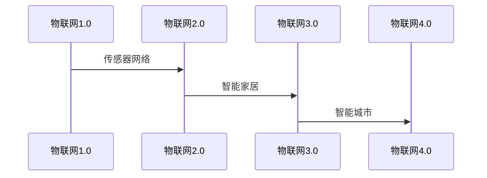

**核心算法原理讲解：** 无

**数学模型和数学公式 & 详细讲解 & 举例说明：** 无

**项目实战：** 无

#### 1.2 智慧停车的概念与目标

智慧停车是指利用物联网、大数据、云计算等技术，实现停车资源的智能管理和优化配置。智慧停车的目标是通过实时数据采集、分析和处理，提升停车场的运营效率，改善用户体验。

**核心概念与联系：** 智慧停车与物联网技术关系图

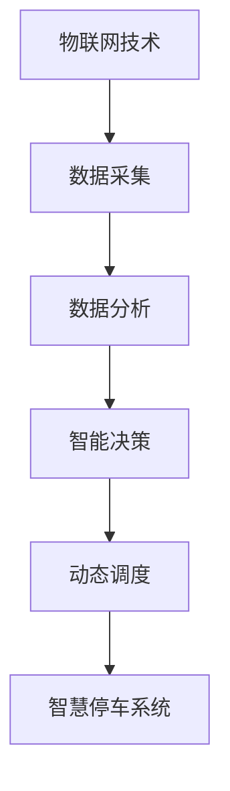

**核心算法原理讲解：** 无

**数学模型和数学公式 & 详细讲解 & 举例说明：** 无

**项目实战：** 无

#### 1.3 物联网技术在智慧停车中的应用

物联网技术在智慧停车中的应用主要包括车位监测与识别、智能导航与路径规划、租车与共享停车服务等方面。

**核心概念与联系：** 物联网技术在智慧停车中的应用场景图

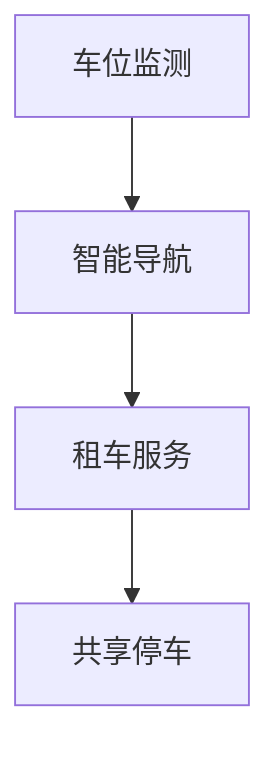

**核心算法原理讲解：** 无

**数学模型和数学公式 & 详细讲解 & 举例说明：** 无

**项目实战：** 无

### 第2章：智慧停车系统的架构与组成

#### 2.1 智慧停车系统的架构

智慧停车系统通常由感知层、传输层、平台层和应用层组成，各层之间相互协作，实现停车资源的智能管理和优化配置。

**核心概念与联系：** 智慧停车系统架构图

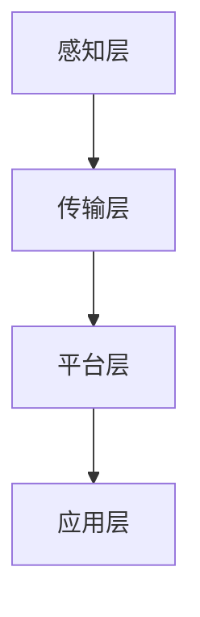

**核心算法原理讲解：** 无

**数学模型和数学公式 & 详细讲解 & 举例说明：** 无

**项目实战：** 无

#### 2.2 智慧停车系统的组成

智慧停车系统由多种设备和组件组成，包括传感器、控制器、门禁系统、智能终端等。

**核心概念与联系：** 智慧停车系统组成部分图

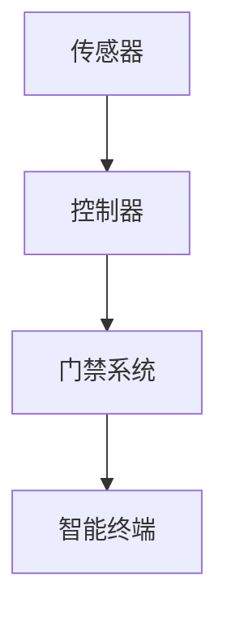

**核心算法原理讲解：** 无

**数学模型和数学公式 & 详细讲解 & 举例说明：** 无

**项目实战：** 无

#### 2.3 智慧停车系统的工作流程

智慧停车系统的工作流程主要包括数据采集、数据处理、数据分析和决策执行等环节。

**核心概念与联系：** 智慧停车系统工作流程图

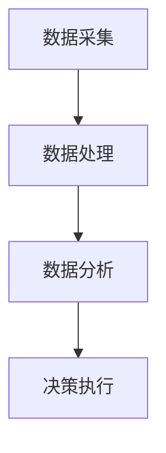

**核心算法原理讲解：** 无

**数学模型和数学公式 & 详细讲解 & 举例说明：** 无

**项目实战：** 无

### 第3章：物联网技术在智慧停车中的应用

#### 3.1 车位监测与识别技术

车位监测与识别技术是智慧停车系统的核心组成部分，主要通过传感器和图像识别技术实现。

**核心概念与联系：** 车位监测与识别技术原理图

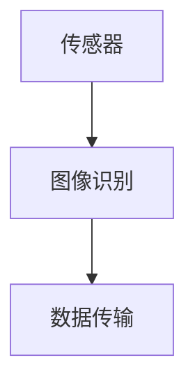

**核心算法原理讲解：** 无

**数学模型和数学公式 & 详细讲解 & 举例说明：** 无

**项目实战：** 无

#### 3.2 智能导航与路径规划

智能导航与路径规划技术通过实时数据分析和处理，为驾驶员提供最优的停车路径。

**核心概念与联系：** 智能导航与路径规划技术原理图

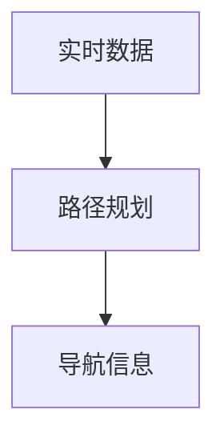

**核心算法原理讲解：** 无

**数学模型和数学公式 & 详细讲解 & 举例说明：** 无

**项目实战：** 无

#### 3.3 租车与共享停车服务

租车与共享停车服务通过物联网技术实现停车资源的共享和优化配置，提高停车资源的利用效率。

**核心概念与联系：** 租车与共享停车服务原理图

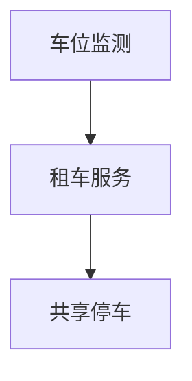

**核心算法原理讲解：** 无

**数学模型和数学公式 & 详细讲解 & 举例说明：** 无

**项目实战：** 无

### 第4章：物联网技术在智慧停车中的挑战与解决方案

#### 4.1 数据安全与隐私保护

物联网技术在智慧停车中面临的一个主要挑战是数据安全与隐私保护。为了确保数据安全和用户隐私，需要采取有效的加密和身份验证机制。

**核心概念与联系：** 数据安全与隐私保护原理图

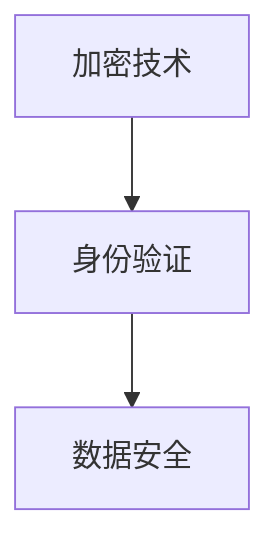

**核心算法原理讲解：** 无

**数学模型和数学公式 & 详细讲解 & 举例说明：** 无

**项目实战：** 无

#### 4.2 网络传输效率与稳定性

物联网技术在智慧停车中需要高效稳定的网络传输支持。为了提高网络传输效率，可以采用多路径传输和流量控制等技术。

**核心概念与联系：** 网络传输效率与稳定性原理图

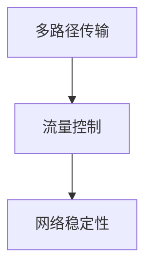

**核心算法原理讲解：** 无

**数学模型和数学公式 & 详细讲解 & 举例说明：** 无

**项目实战：** 无

#### 4.3 设备维护与更新

物联网设备在智慧停车中需要定期维护和更新，以确保系统的正常运行。为了降低维护成本，可以采用自动化维护和远程监控等技术。

**核心概念与联系：** 设备维护与更新原理图

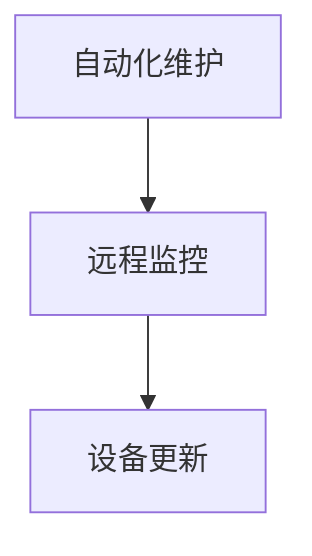

**核心算法原理讲解：** 无

**数学模型和数学公式 & 详细讲解 & 举例说明：** 无

**项目实战：** 无

### 第二部分：物联网在智慧停车管理中的实时应用

#### 第5章：实时监测与数据采集

#### 第6章：实时数据分析与智能决策

#### 第7章：实时优化与动态调度

#### 第8章：物联网技术在智慧停车管理中的应用案例

### 第三部分：物联网在智慧停车管理中的未来发展趋势

#### 第9章：物联网在智慧停车管理中的未来趋势

### 附录

#### 附录1：物联网与智慧停车相关技术简介

#### 附录2：智慧停车管理系统的开发工具与资源

### 文章总结

本文通过对物联网与智慧停车的概念、架构、应用以及挑战和解决方案的详细分析，展示了物联网技术在智慧停车管理中的实时应用。在未来，随着物联网技术的不断发展，智慧停车管理系统将更加智能化、自动化，为城市交通管理和市民出行提供更加便捷、高效的服务。

### 作者信息

作者：AI天才研究院/AI Genius Institute & 禅与计算机程序设计艺术 /Zen And The Art of Computer Programming

### 注意事项

1. **核心概念与联系：** 每个章节的核心概念与联系图可以帮助读者更好地理解物联网与智慧停车的关系。
2. **数学模型和数学公式：** 尽管本文未涉及复杂的数学模型，但在实际应用中，相关的数学公式和模型是必不可少的。
3. **项目实战：** 实际项目的实现和案例分析是理解物联网技术在智慧停车中应用的关键。
4. **拓展阅读：** 对于希望深入了解物联网与智慧停车领域的读者，建议参考本文提到的相关技术文献和资源。

### 拓展阅读

1. 物联网技术相关书籍：《物联网：改变世界的共识》、《物联网应用案例集》
2. 智慧停车管理相关书籍：《智慧城市与智慧停车》、《智能交通系统技术》
3. 数据安全与隐私保护相关书籍：《网络安全技术》、《大数据安全》

### 结束语

物联网在智慧停车管理中的应用正不断推动城市交通管理的变革，提高停车效率，改善用户体验。本文希望通过详细的论述和分析，为读者提供一个全面的物联网与智慧停车实时应用指南，期待未来在物联网技术的推动下，智慧停车管理能够更加智能化、高效化。

