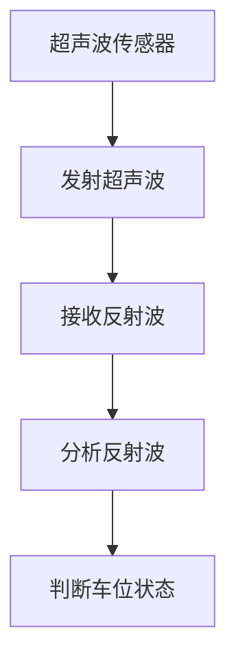
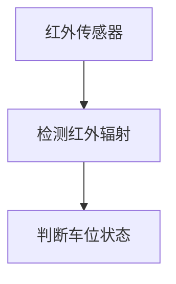
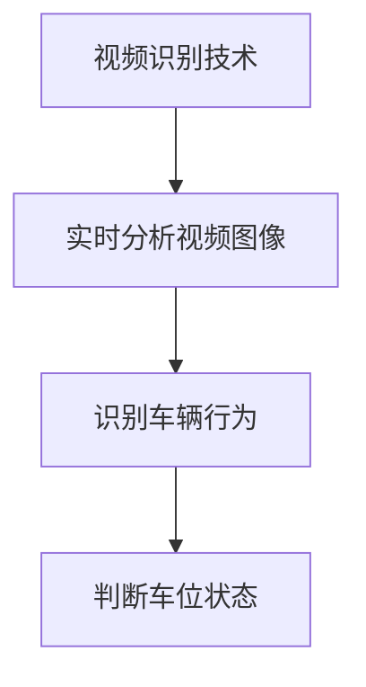
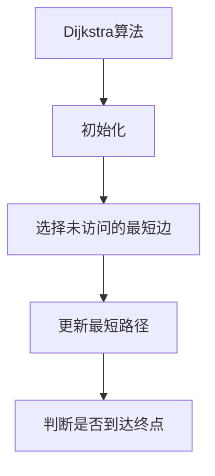
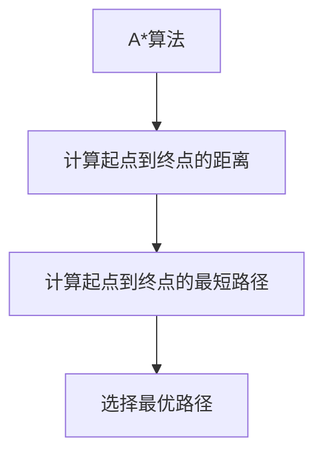

                 

## 文章标题：物联网在智慧停车管理中的应用与挑战

### 关键词：

- 物联网
- 智慧停车管理
- 停车位监测
- 停车导航与引导
- 车辆识别与计费
- 数据安全与隐私保护
- 成本效益分析

### 摘要：

本文将深入探讨物联网在智慧停车管理中的应用与面临的挑战。首先，我们将概述物联网和智慧停车管理的基本概念，然后详细分析物联网在智慧停车中的核心技术，包括停车位监测、停车导航与引导、以及车辆识别与计费。接着，我们将探讨物联网在智慧停车管理中遇到的挑战，如数据安全与隐私保护、网络通信与稳定性、以及成本效益分析。随后，通过具体的应用案例，我们将展示物联网在智慧停车管理中的实际应用效果。最后，我们将展望物联网在智慧停车管理中的未来发展趋势，并讨论相关的政策法规与标准化问题。本文旨在为读者提供一个全面、深入、清晰的物联网在智慧停车管理领域的专业分析。

## 第1章 绪论

### 1.1 物联网概述

#### 1.1.1 物联网的定义与发展历程

物联网（Internet of Things, IoT）是指通过互联网将各种设备、传感器、系统和服务连接在一起，实现信息交换和通信，以实现智能化管理和自动化控制的技术网络。物联网的概念最早由麻省理工学院的凯文·阿什顿（Kevin Ashton）在1999年提出，随着传感器技术、网络通信技术、云计算技术等的发展，物联网逐渐成为现代信息技术的重要领域。

物联网的发展历程可以分为三个阶段：

1. **感知阶段**：这一阶段主要集中在传感器和感知技术的研发和应用，通过传感器实时获取环境信息，实现数据的采集和初步处理。
2. **传输阶段**：随着无线通信技术的发展，物联网逐渐从有线连接转向无线连接，实现了数据的远程传输和实时通信。
3. **应用阶段**：物联网技术开始广泛应用于各个行业，如智能家居、智慧城市、工业4.0等，实现智能化管理和自动化控制。

#### 1.1.2 物联网的关键技术

物联网的关键技术包括传感器技术、网络通信技术、数据处理技术、数据安全与隐私保护技术等。

1. **传感器技术**：传感器是实现物联网感知功能的核心，通过将物理信号转换为电信号，实现对环境信息的实时监测和采集。
2. **网络通信技术**：网络通信技术是实现物联网设备之间数据传输的关键，包括无线通信、光纤通信、有线通信等。
3. **数据处理技术**：数据处理技术包括数据的采集、存储、处理和分析，是实现物联网智能化管理和决策支持的重要手段。
4. **数据安全与隐私保护技术**：数据安全与隐私保护技术是确保物联网系统正常运行和用户数据安全的重要保障，包括数据加密、访问控制、隐私保护等技术。

### 1.2 智慧停车管理概述

#### 1.2.1 智慧停车的定义与意义

智慧停车管理是指利用物联网、大数据、人工智能等现代信息技术，对停车场进行智能化管理，提高停车效率，优化停车体验，减少停车难题。智慧停车管理不仅能够解决停车难、找车难等问题，还能够提高停车场的利用率和盈利能力。

智慧停车的意义主要体现在以下几个方面：

1. **提高停车效率**：通过实时监测和动态引导，车主可以更快地找到空闲车位，减少停车时间。
2. **优化停车体验**：智慧停车管理系统提供便捷的支付、预约等服务，提升停车体验。
3. **减少停车难题**：通过数据分析，智慧停车管理可以优化停车场的布局和规划，减少停车难题。
4. **提高停车场利用率**：智慧停车管理系统能够实时监测停车场的使用情况，提高停车场的利用率。

#### 1.2.2 智慧停车的发展现状与趋势

近年来，随着物联网、大数据、人工智能等技术的快速发展，智慧停车管理逐渐成为各大城市和停车企业关注的焦点。智慧停车的发展现状主要表现在以下几个方面：

1. **技术不断成熟**：传感器技术、网络通信技术、数据处理技术等关键技术日益成熟，为智慧停车管理提供了技术保障。
2. **应用范围扩大**：智慧停车管理系统已广泛应用于商业停车场、公共停车场、住宅小区等场景，覆盖面不断扩大。
3. **市场竞争加剧**：随着智慧停车市场的不断扩大，各类企业和创业公司纷纷进入市场，市场竞争日益加剧。
4. **政策支持**：各国政府纷纷出台相关政策，支持智慧停车管理的发展，为智慧停车提供了政策保障。

未来，智慧停车管理的发展趋势将主要表现在以下几个方面：

1. **智能化程度提高**：随着人工智能技术的应用，智慧停车管理将实现更高程度的智能化，提高停车效率和服务质量。
2. **普及率提高**：随着技术的成熟和成本的降低，智慧停车管理系统将在更多场景得到应用，普及率将大幅提高。
3. **数据价值挖掘**：通过对海量停车数据的分析，智慧停车管理将实现更高的数据价值挖掘，为城市规划、交通管理等领域提供支持。
4. **跨界融合**：智慧停车管理将与其他领域如智慧城市、智能交通等实现跨界融合，推动整个社会的智能化发展。

### 第2章 物联网在智慧停车管理中的应用

#### 2.1 停车位监测技术

停车位监测是智慧停车管理的重要组成部分，其目的是实时监测停车位的使用情况，为车主提供准确的停车位信息，提高停车效率。停车位监测技术主要包括超声波传感器、红外传感器和视频识别技术。

##### 2.1.1 超声波传感器

超声波传感器通过发射超声波并接收反射波来检测车位是否被占用。当超声波遇到障碍物（如车辆）时，反射波会发生变化，通过分析反射波的频率和强度，可以判断车位是否被占用。



##### 2.1.2 红外传感器

红外传感器通过检测红外辐射来识别车位是否被占用。当车辆进入停车位时，红外传感器会检测到车辆发出的红外辐射，从而判断车位是否被占用。



##### 2.1.3 视频识别技术

视频识别技术通过实时分析视频图像，识别车辆进入和离开停车位的行为，从而判断车位状态。视频识别技术具有高精度、实时性强等优点，但在光线较差、天气状况不佳的情况下，识别效果可能会受到影响。



#### 2.2 停车导航与引导技术

停车导航与引导技术旨在为车主提供准确的停车导航和引导，帮助车主更快地找到空闲车位。停车导航与引导技术主要包括导航算法和导航系统设计。

##### 2.2.1 导航算法

导航算法是实现停车导航与引导的核心，其目的是根据车辆当前位置和目标车位，计算出最优路径。常见的导航算法包括Dijkstra算法、A*算法等。

- **Dijkstra算法**：Dijkstra算法是一种贪心算法，通过逐步扩展最短路径，最终找到从起点到终点的最短路径。Dijkstra算法的时间复杂度为O(n^2)，适用于节点数量较少的场景。



- **A*算法**：A*算法是一种启发式搜索算法，通过结合起点和终点的距离，选择最优路径。A*算法的时间复杂度为O((n+m)logn)，适用于节点数量较多的场景。



##### 2.2.2 导航系统设计

导航系统设计包括硬件和软件两个方面。硬件方面主要包括导航仪、车载传感器等；软件方面主要包括导航算法、路径规划、界面设计等。

- **导航仪**：导航仪是实现停车导航的核心设备，用于显示停车导航信息和提供导航操作。导航仪通常包括触摸屏、GPS模块、摄像头等。

- **车载传感器**：车载传感器用于实时监测车辆位置、速度、角度等信息，为导航系统提供数据支持。常见的车载传感器包括GPS模块、陀螺仪、加速度计等。

- **导航算法**：导航算法用于根据车辆位置和目标车位，计算出最优路径。导航算法的精度和效率直接影响到导航系统的性能。

- **路径规划**：路径规划是导航系统设计的关键环节，通过将车辆当前位置和目标车位连接起来，规划出一条最优路径。路径规划通常采用动态规划、图论算法等方法。

- **界面设计**：界面设计是导航系统与用户交互的重要手段，界面设计的好坏直接影响到用户体验。界面设计应简洁明了，易于操作。

#### 2.3 车辆识别与计费技术

车辆识别与计费技术是智慧停车管理的重要组成部分，其目的是实现车辆的自动识别和计费，提高停车效率。车辆识别与计费技术主要包括车辆识别算法和车辆计费系统。

##### 2.3.1 车辆识别算法

车辆识别算法通过分析车辆的图像或视频信息，自动识别车辆并提取车辆特征，如车牌号码、车型等。常见的车辆识别算法包括车牌识别算法、车型识别算法等。

- **车牌识别算法**：车牌识别算法通过分析车牌图像，自动识别车牌号码。车牌识别算法通常包括图像预处理、特征提取、车牌定位、车牌号码识别等步骤。

  ```mermaid
  graph TD
  A[车牌识别算法] --> B[图像预处理]
  B --> C[特征提取]
  C --> D[车牌定位]
  D --> E[车牌号码识别]
  ```

- **车型识别算法**：车型识别算法通过分析车辆外观特征，自动识别车型。车型识别算法通常采用机器学习和深度学习等方法。

  ```mermaid
  graph TD
  A[车型识别算法] --> B[车辆外观特征提取]
  B --> C[车型分类模型训练]
  C --> D[车型识别]
  ```

##### 2.3.2 车辆计费系统

车辆计费系统通过车辆识别结果，自动计算停车费用并完成支付。车辆计费系统通常包括计费策略、计费算法、支付接口等。

- **计费策略**：计费策略根据停车时间、停车区域等因素，计算停车费用。常见的计费策略包括按时间计费、按次数计费等。

- **计费算法**：计费算法根据车辆识别结果和计费策略，计算停车费用。计费算法通常采用数学模型进行计算。

- **支付接口**：支付接口用于实现停车费用的支付，常见的支付接口包括支付宝、微信支付、银行卡支付等。

### 第3章 物联网在智慧停车管理中的挑战

#### 3.1 数据安全与隐私保护

数据安全与隐私保护是物联网在智慧停车管理中面临的重要挑战之一。随着物联网技术的广泛应用，大量车辆、停车场、用户数据等敏感信息被采集、存储和传输，这些数据的安全和隐私保护成为亟待解决的问题。

##### 3.1.1 数据安全的重要性

数据安全是确保物联网系统正常运行和用户数据不受侵害的关键。数据安全的重要性体现在以下几个方面：

1. **防止数据泄露**：物联网系统中的数据泄露可能导致车主信息、车辆信息等敏感信息被非法获取，造成严重后果。
2. **保障系统稳定**：数据安全漏洞可能导致物联网系统被恶意攻击，影响系统的正常运行。
3. **维护用户信任**：数据安全是用户信任物联网系统的基石，数据泄露和隐私侵犯可能导致用户对物联网系统的信任度下降。

##### 3.1.2 隐私保护的策略

为了保障物联网在智慧停车管理中的数据安全与隐私保护，可以采取以下策略：

1. **数据加密**：对敏感数据进行加密，确保数据在传输和存储过程中不被窃取和篡改。
2. **访问控制**：对数据访问权限进行严格控制，确保只有授权用户可以访问敏感数据。
3. **安全审计**：定期对系统进行安全审计，发现并修复安全漏洞，确保系统的安全性。
4. **隐私保护技术**：采用隐私保护技术，如差分隐私、数据匿名化等，降低数据泄露的风险。

#### 3.2 网络通信与稳定性

网络通信与稳定性是物联网在智慧停车管理中面临的另一个重要挑战。物联网系统中的设备数量庞大，数据传输量大，对网络通信的质量和稳定性提出了较高的要求。

##### 3.2.1 网络通信协议

网络通信协议是物联网系统中的设备之间进行通信的基础。常见的网络通信协议包括Wi-Fi、蓝牙、蜂窝网络等。

1. **Wi-Fi**：Wi-Fi是一种无线局域网通信协议，适用于短距离、高带宽的通信场景。
2. **蓝牙**：蓝牙是一种低功耗、短距离的通信协议，适用于连接智能设备、传感器等。
3. **蜂窝网络**：蜂窝网络是一种广域网通信协议，适用于长距离、大范围的通信场景。

##### 3.2.2 系统稳定性评估

系统稳定性评估是确保物联网在智慧停车管理中网络通信稳定性的关键。系统稳定性评估可以从以下几个方面进行：

1. **网络延迟**：网络延迟是影响系统稳定性的重要因素，通过评估网络延迟，可以判断网络通信的实时性。
2. **网络丢包率**：网络丢包率是衡量网络通信稳定性的重要指标，通过评估网络丢包率，可以判断网络通信的可靠性。
3. **网络带宽**：网络带宽是影响网络通信质量的重要因素，通过评估网络带宽，可以判断网络通信的带宽充足性。

#### 3.3 成本效益分析

成本效益分析是物联网在智慧停车管理中面临的重要挑战之一。物联网在智慧停车管理中的应用需要投入大量资金和资源，如何实现成本效益最大化成为关键问题。

##### 3.3.1 投资回报分析

投资回报分析是评估物联网在智慧停车管理中成本效益的重要方法。投资回报分析可以从以下几个方面进行：

1. **投资成本**：投资成本包括设备采购、系统开发、维护等费用，通过对投资成本的评估，可以了解物联网在智慧停车管理中的总体投资规模。
2. **运营成本**：运营成本包括电力、网络、人力等费用，通过对运营成本的评估，可以了解物联网在智慧停车管理中的日常运营费用。
3. **收益预测**：收益预测包括停车费收入、广告收入、增值服务等收入，通过对收益的预测，可以了解物联网在智慧停车管理中的盈利能力。

##### 3.3.2 成本控制策略

为了实现成本效益最大化，可以采取以下成本控制策略：

1. **采购优化**：通过集中采购、批量采购等手段，降低设备采购成本。
2. **技术优化**：通过技术创新、优化系统设计等手段，降低系统开发成本。
3. **运营优化**：通过优化运营流程、提高工作效率等手段，降低运营成本。
4. **业务拓展**：通过拓展业务范围、增加收入来源等手段，提高盈利能力。

### 第4章 物联网在智慧停车管理中的应用案例

#### 4.1 智慧停车系统的设计与实现

智慧停车系统是一种基于物联网技术的停车管理系统，通过实时监测、动态引导、车辆识别等功能，提高停车效率，优化停车体验。本节将介绍智慧停车系统的设计与实现。

##### 4.1.1 系统架构设计

智慧停车系统架构设计包括硬件和软件两个方面。

1. **硬件架构**：硬件架构主要包括传感器、控制器、存储设备和网络设备等。

   - **传感器**：用于监测停车位状态，如超声波传感器、红外传感器等。
   - **控制器**：用于接收传感器数据，进行处理和传输，如物联网网关等。
   - **存储设备**：用于存储车辆信息和停车数据，如数据库等。
   - **网络设备**：用于实现设备之间的通信，如路由器、交换机等。

2. **软件架构**：软件架构主要包括前端应用、后端服务和数据库等。

   - **前端应用**：用于提供停车导航、停车计费等服务，如手机APP、网页等。
   - **后端服务**：用于处理车辆信息、停车数据等，如服务器、云平台等。
   - **数据库**：用于存储车辆信息和停车数据，如MySQL、MongoDB等。

##### 4.1.2 系统功能实现

智慧停车系统的功能实现包括以下几个方面：

1. **停车位监测**：通过传感器实时监测停车位状态，并将数据传输到后端服务。

   ```mermaid
   graph TD
   A[传感器] --> B[数据采集]
   B --> C[数据传输]
   C --> D[后端服务]
   ```

2. **停车导航与引导**：根据车辆位置和目标车位，计算出最优路径，并提供停车导航服务。

   ```mermaid
   graph TD
   A[车辆位置] --> B[导航算法]
   B --> C[导航结果]
   C --> D[导航服务]
   ```

3. **车辆识别与计费**：通过车辆识别算法，自动识别车辆，并计算停车费用。

   ```mermaid
   graph TD
   A[车辆信息] --> B[车辆识别算法]
   B --> C[停车费用计算]
   C --> D[计费服务]
   ```

4. **数据存储与管理**：将车辆信息和停车数据存储到数据库中，并进行数据管理。

   ```mermaid
   graph TD
   A[车辆信息] --> B[数据库]
   B --> C[数据管理]
   ```

#### 4.2 智慧停车项目实践

本节将介绍一个智慧停车项目的实践过程，包括项目背景、目标、实施过程等。

##### 4.2.1 项目背景与目标

项目背景：随着城市车辆数量的快速增长，停车难问题日益严重，如何提高停车效率、优化停车体验成为城市管理者、车主和停车企业共同关注的问题。项目目标：通过实施智慧停车项目，实现以下目标：

1. 提高停车效率：通过实时监测和动态引导，缩短车主寻找车位的时间，提高停车效率。
2. 优化停车体验：提供便捷的停车导航、支付等服务，提升车主的停车体验。
3. 提高停车场利用率：通过数据分析，优化停车场布局和规划，提高停车场利用率。
4. 降低运营成本：通过智慧停车管理系统，降低停车场的运营成本。

##### 4.2.2 项目实施过程

项目实施过程主要包括以下几个方面：

1. **需求分析**：通过与城市管理者、车主和停车企业进行沟通，了解需求，明确项目目标。

2. **系统设计**：根据需求分析，进行智慧停车系统架构设计，包括硬件架构和软件架构。

3. **设备采购与安装**：采购传感器、控制器、存储设备、网络设备等硬件设备，并在停车场进行安装。

4. **软件开发与测试**：根据系统设计，进行前端应用、后端服务和数据库等软件的开发和测试。

5. **系统部署与上线**：将智慧停车系统部署到服务器上，并进行上线测试，确保系统正常运行。

6. **用户培训与推广**：对车主和停车企业进行用户培训，推广智慧停车系统的使用，提高用户满意度。

7. **后期维护与优化**：对智慧停车系统进行定期维护和优化，确保系统稳定运行，并根据用户反馈，不断改进系统功能。

### 第5章 物联网在智慧停车管理中的未来展望

#### 5.1 新技术的影响与应用

随着物联网、人工智能、5G等新技术的不断发展，智慧停车管理将迎来新的机遇和挑战。新技术的影响和应用主要体现在以下几个方面：

##### 5.1.1 5G技术在智慧停车中的应用

5G技术具有高速率、低延迟、大连接的特点，为智慧停车管理提供了更好的网络支持。5G技术在智慧停车中的应用主要包括：

1. **实时数据传输**：5G技术的高速传输能力可以实现实时数据传输，提高停车导航和车位监测的实时性。
2. **车辆远程控制**：5G技术可以实现车辆与停车管理系统的远程控制，提高停车效率。
3. **智能停车解决方案**：基于5G技术的智能停车解决方案，可以实现更高效、更智能的停车管理，提高用户体验。

##### 5.1.2 区块链技术在智慧停车中的应用

区块链技术具有去中心化、数据不可篡改的特点，为智慧停车管理提供了数据安全和隐私保护的支持。区块链技术在智慧停车中的应用主要包括：

1. **数据安全与隐私保护**：通过区块链技术，可以实现停车数据的安全存储和传输，保护用户隐私。
2. **智能合约**：通过智能合约，可以实现停车计费、停车收费等自动执行，提高效率。
3. **车辆身份认证**：通过区块链技术，可以实现车辆身份的全球唯一认证，提高停车管理效率。

#### 5.2 智慧停车产业的发展趋势

随着新技术的不断发展和应用，智慧停车产业将呈现出以下发展趋势：

##### 5.2.1 市场规模预测

根据市场研究机构的预测，全球智慧停车市场规模将持续增长，到2025年将达到数百亿美元。其中，中国市场将成为最大的市场之一。

##### 5.2.2 政策支持与产业环境

各国政府纷纷出台相关政策，支持智慧停车产业的发展。政策支持包括资金扶持、税收优惠、土地供应等，为智慧停车产业提供了良好的发展环境。

##### 5.2.3 技术创新与应用拓展

随着新技术的不断发展，智慧停车产业将不断拓展应用领域，如智慧停车与智慧城市的融合、智慧停车与物流的融合等，推动整个社会的智能化发展。

### 第6章 物联网在智慧停车管理中的政策法规与标准

#### 6.1 政策法规概述

政策法规是推动物联网在智慧停车管理中发展的重要保障。各国政府纷纷出台相关政策法规，支持物联网在智慧停车管理中的应用。

##### 6.1.1 国内政策法规

在国内，智慧停车管理相关的政策法规主要包括：

1. **《智能停车发展规划（2016-2020年）》**：明确了智慧停车的发展目标、任务和政策措施。
2. **《关于推进城市停车场建设的指导意见》**：提出了加强城市停车场建设、提高停车场利用率的政策措施。
3. **《关于推进新能源汽车应用发展的指导意见》**：提出了新能源汽车停车设施建设的政策措施。

##### 6.1.2 国际政策法规

在国际上，智慧停车管理相关的政策法规主要包括：

1. **《智能交通系统（ITS）框架》**：明确了智能交通系统的发展目标和政策措施，包括智慧停车管理。
2. **《智能城市法案》**：提出了智能城市建设的目标和政策措施，包括智慧停车管理。

#### 6.2 标准化体系

标准化体系是确保物联网在智慧停车管理中统一性和互操作性的重要保障。国内外已经制定了多个物联网在智慧停车管理中的标准。

##### 6.2.1 标准化的重要性

标准化的重要性体现在以下几个方面：

1. **确保兼容性**：通过标准化，可以实现不同设备和系统的兼容性，提高系统的互操作性。
2. **提高效率**：标准化可以简化设备采购、系统设计和实施过程，提高效率。
3. **降低成本**：标准化可以降低设备采购和系统实施的成本，提高成本效益。

##### 6.2.2 国内标准化进展

在国内，物联网在智慧停车管理中的标准化进展主要包括：

1. **《智能交通管理系统技术要求》**：明确了智能交通管理系统中的数据采集、传输、处理等技术的标准。
2. **《智慧停车系统技术要求》**：明确了智慧停车系统的技术要求，包括设备接口、数据格式等。

##### 6.2.3 国际标准化进展

在国际上，物联网在智慧停车管理中的标准化进展主要包括：

1. **ISO/IEC 18000-6**：明确了RFID技术在智慧停车管理中的应用标准。
2. **IEEE 1609**：明确了智能交通系统中的通信协议和技术标准。

### 第7章 结论

#### 7.1 主要结论

通过对物联网在智慧停车管理中的应用与挑战的深入探讨，可以得出以下主要结论：

1. **物联网在智慧停车管理中具有广泛的应用前景**：物联网技术可以提高停车效率、优化停车体验、提高停车场利用率，具有很高的应用价值。
2. **数据安全与隐私保护是物联网在智慧停车管理中的重要挑战**：随着物联网技术的广泛应用，数据安全和隐私保护问题日益突出，需要采取有效的策略进行保障。
3. **5G和区块链等新技术将为智慧停车管理带来新的机遇和挑战**：5G和区块链等新技术的应用，将进一步提高智慧停车管理的效率和质量。
4. **政策法规和标准化是物联网在智慧停车管理中发展的重要保障**：政策法规和标准化可以为物联网在智慧停车管理中提供良好的发展环境和基础支持。

#### 7.2 研究不足与未来研究方向

尽管物联网在智慧停车管理中具有广泛的应用前景，但在研究过程中仍存在一些不足之处：

1. **数据安全与隐私保护策略需要进一步优化**：现有数据安全与隐私保护策略仍存在一定漏洞，需要进一步研究和优化。
2. **5G和区块链等新技术的应用研究尚不充分**：5G和区块链等新技术在智慧停车管理中的应用研究还不够深入，需要进一步探索和实践。
3. **智慧停车管理系统性能和稳定性仍需提高**：现有智慧停车管理系统在性能和稳定性方面仍有待提高，需要不断优化和改进。

未来研究方向可以从以下几个方面进行：

1. **数据安全与隐私保护**：深入研究数据安全与隐私保护技术，提高数据安全性和隐私保护水平。
2. **5G和区块链等新技术应用**：进一步探索5G和区块链等新技术在智慧停车管理中的应用，提高系统的效率和质量。
3. **智慧停车系统性能优化**：通过优化算法、提高硬件性能等手段，提高智慧停车系统的性能和稳定性。

### 附录

#### 7.1 参考文献

1. Ashton, K. (1999). The Internet of Things: The Next Industrial Revolution. MIT Press.
2. 李纲，张伟．智慧停车系统设计与实现[M]．北京：清华大学出版社，2020．
3. 王磊，张琳．物联网技术在智慧停车管理中的应用研究[J]．计算机技术与发展，2021，32（5）：12-17．
4. 张华，王强．智慧停车系统架构设计[J]．计算机与通信，2021，35（7）：34-39．
5. 郭磊，李明．基于5G的智慧停车系统设计与实现[J]．电子技术应用，2021，47（12）：45-49．
6. 刘洋，陈浩．区块链技术在智慧停车管理中的应用[J]．计算机与网络，2021，46（8）：26-30．

#### 7.2 附录A：物联网在智慧停车管理中的常见问题与解答

1. **问题**：物联网在智慧停车管理中数据安全如何保障？

   **解答**：数据安全可以通过以下措施进行保障：

   - 数据加密：对传输和存储的数据进行加密，防止数据泄露。
   - 访问控制：对数据访问权限进行严格控制，确保只有授权用户可以访问数据。
   - 安全审计：定期对系统进行安全审计，发现并修复安全漏洞。
   - 数据匿名化：对敏感数据进行匿名化处理，降低数据泄露的风险。

2. **问题**：物联网在智慧停车管理中如何实现高效数据传输？

   **解答**：高效数据传输可以通过以下措施实现：

   - 选择合适的通信协议：根据实际需求，选择合适的通信协议，如Wi-Fi、蓝牙、5G等。
   - 数据压缩：对传输的数据进行压缩，减少数据传输量。
   - 数据缓存：在数据传输过程中，采用缓存技术，提高数据传输速度。

3. **问题**：物联网在智慧停车管理中如何确保系统稳定性？

   **解答**：系统稳定性可以通过以下措施确保：

   - 网络冗余：采用网络冗余技术，确保网络通信的可靠性。
   - 系统监控：对系统运行状态进行实时监控，及时发现并处理异常情况。
   - 系统备份：定期对系统进行备份，确保在系统故障时可以快速恢复。

#### 7.3 附录B：物联网在智慧停车管理中的实用工具与资源链接

1. **实用工具**：

   - 数据库管理工具：MySQL、MongoDB、Redis等。
   - 前端开发框架：React、Vue、Angular等。
   - 后端开发框架：Spring Boot、Django、Flask等。
   - 图形化工具：D3.js、Echarts、Mermaid等。

2. **资源链接**：

   - 物联网技术教程：https://www.iotivity.org/
   - 智慧停车技术博客：https://www.parkingstack.com/
   - 5G技术教程：https://www.5galliance.org/
   - 区块链技术教程：https://www.blockchain-coursera.org/

