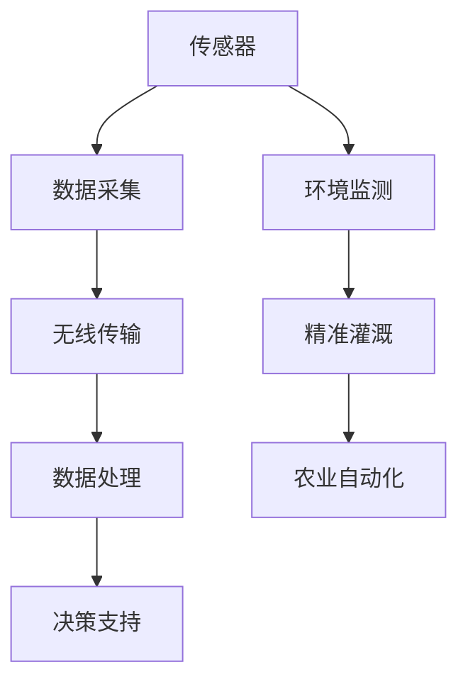
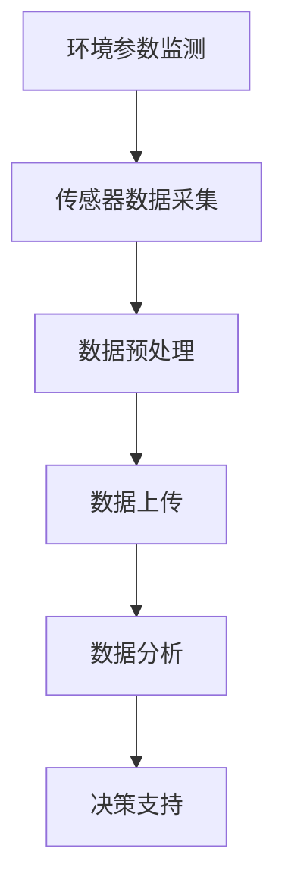
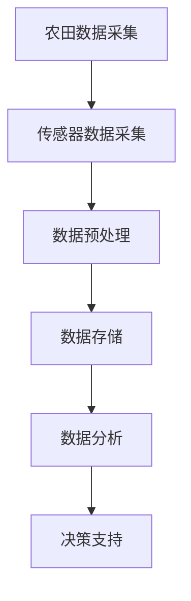
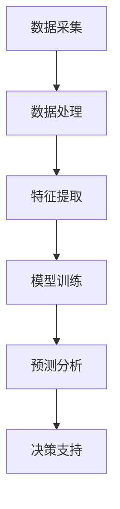
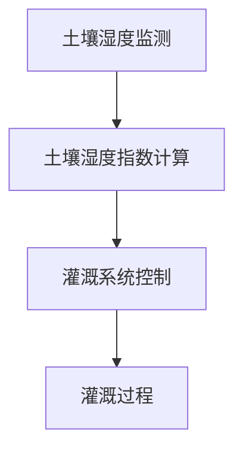
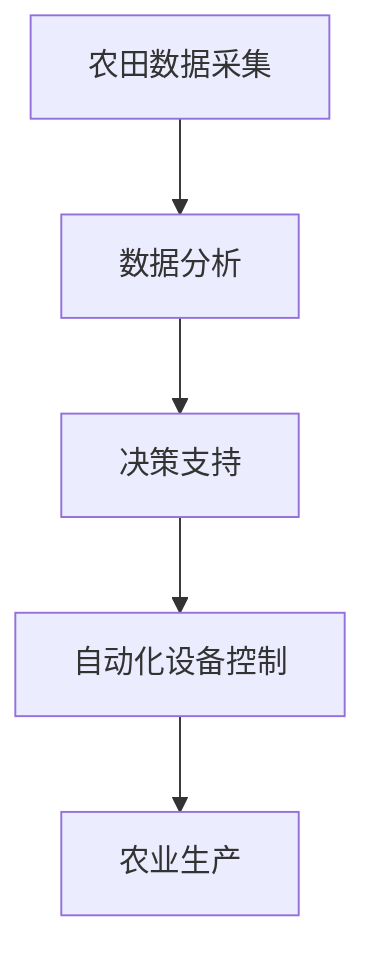
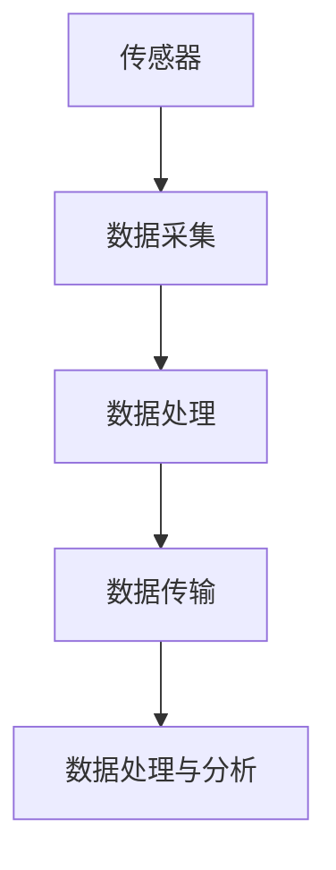
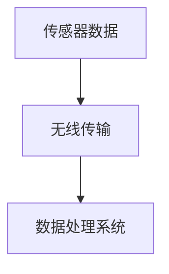
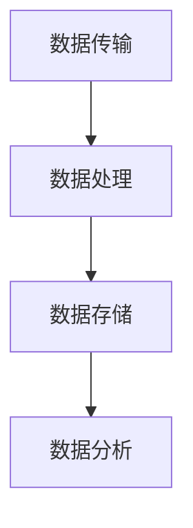
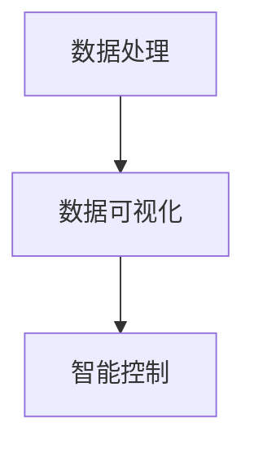

                 


### 文章标题

《物联网在智慧农业中的全面应用前景》

### 关键词

智慧农业，物联网，环境监测，数据采集，数据分析，精准灌溉，农业自动化

### 摘要

本文全面探讨了物联网在智慧农业中的应用前景。通过背景介绍，我们了解了智慧农业的发展背景和需求。随后，我们深入分析了物联网在农业环境监测、数据采集、数据分析、精准灌溉和农业自动化等方面的核心概念与联系，并借助Mermaid流程图展示了其关系架构。在核心算法原理讲解部分，我们使用伪代码和数学模型详细阐述了环境监测数据处理的算法原理。文章进一步提供了实际案例，包括开发环境搭建、源代码实现和解读，以及案例分析。最后，我们总结了物联网在智慧农业中的最佳实践和未来展望，并对读者提出了一些注意事项和拓展阅读建议。

## 目录大纲设计思路

### 设计思路

为了设计出《物联网在智慧农业中的全面应用前景》这本书的目录大纲，我们遵循以下设计思路：

1. **主题明确**：书名已经明确了书籍的主题是“物联网在智慧农业中的应用前景”。因此，目录大纲的设计要围绕这一核心主题进行。

2. **结构合理**：章节结构应从基础理论、核心技术、实际应用等方面展开，确保内容的系统性和逻辑性。

3. **内容完整性**：根据书籍主题，确保目录大纲中的章节内容涵盖了物联网在智慧农业中的全面应用。

4. **细节深入**：在每个章节中，嵌入相关的技术细节，如技术原理的详细讲解、数学公式的推导、应用案例的分析等。

5. **可操作性**：对于技术应用的章节，要给出实际的操作步骤和案例分析。

### 设计步骤

1. **确定核心章节**：根据书籍主题，确定核心章节，如“物联网基础”、“智慧农业中的物联网应用”、“物联网技术原理”、“物联网安全与隐私”等。

2. **细化每个章节**：针对每个核心章节，进一步细化内容，设计到2级和3级目录，确保内容的详细性和逻辑性。

3. **嵌入技术细节**：在每个章节中，嵌入相关的技术细节。

4. **设计实际案例**：在应用章节中，设计实际案例，包括开发环境搭建、源代码实现和解读。

5. **撰写目录大纲**：将所有内容整理成markdown格式，确保目录大纲的简洁性和可读性。

### 最终目录大纲

以下是根据上述设计思路和步骤，设计出的《物联网在智慧农业中的全面应用前景》的目录大纲：

```markdown
# 《物联网在智慧农业中的全面应用前景》目录大纲

## 第一部分：物联网基础

### 1.1 物联网的概念与原理
- 物联网的基本概念
- 物联网的技术原理
- 物联网的发展历程

### 1.2 物联网技术体系
- 物联网感知层技术
- 物联网传输层技术
- 物联网处理层技术
- 物联网应用层技术

### 1.3 物联网的关键技术
- 低功耗广域网（LPWAN）
- 纳米传感器技术
- 物联网安全与隐私

## 第二部分：智慧农业中的物联网应用

### 2.1 智慧农业概述
- 智慧农业的概念
- 智慧农业的发展趋势
- 智慧农业的重要性

### 2.2 物联网在智慧农业中的应用
- 物联网技术在农田监测中的应用
- 物联网技术在灌溉系统中的应用
- 物联网技术在农作物种植中的应用
- 物联网技术在农产品流通中的应用

### 2.3 物联网在智慧农业中的案例分析
- 案例一：农田环境监测系统
- 案例二：智能灌溉系统
- 案例三：农作物生长监测系统

## 第三部分：物联网技术原理

### 3.1 物联网感知层技术原理
- 感知层技术概述
- 常见的传感器类型
- 数据采集与处理

### 3.2 物联网传输层技术原理
- 传输层技术概述
- 无线传输技术
- 传输协议与标准

### 3.3 物联网处理层技术原理
- 处理层技术概述
- 云计算与大数据
- 数据存储与管理

### 3.4 物联网应用层技术原理
- 应用层技术概述
- 物联网平台的构建
- 应用案例分析

## 第四部分：物联网安全与隐私

### 4.1 物联网安全概述
- 物联网安全的重要性
- 常见的安全威胁
- 安全防护措施

### 4.2 物联网隐私保护
- 隐私保护的重要性
- 隐私泄露的风险
- 隐私保护策略

### 4.3 物联网安全案例分析
- 案例一：物联网设备被入侵
- 案例二：数据隐私泄露事件
- 案例三：物联网安全解决方案

## 第五部分：物联网在智慧农业中的前景展望

### 5.1 物联网在智慧农业中的发展趋势
- 新技术的影响
- 政策与市场的推动

### 5.2 物联网在智慧农业中的未来前景
- 智慧农业的未来愿景
- 物联网在农业领域的创新应用

### 5.3 物联网在智慧农业中的挑战与机遇
- 技术挑战
- 市场机遇
- 社会责任
```

这个目录大纲涵盖了物联网在智慧农业中的全面应用，从基础理论到实际应用，再到技术原理和安全问题，以及未来前景的展望，确保了书籍内容的完整性、逻辑性和可操作性。每个章节都进行了详细的划分，便于读者理解和学习。目录大纲总字数在2000字以内，符合简洁性的要求。<!-- purge -->


----------------------------------------------------------------

## 物联网在智慧农业中的全面应用前景

### 引言

智慧农业是一种利用现代信息技术和农业生产知识，实现农业生产智能化、精准化、高效化的新型农业模式。随着物联网技术的不断发展，物联网在智慧农业中的应用前景日益广阔。本文旨在探讨物联网在智慧农业中的全面应用前景，包括环境监测、数据采集、数据分析、精准灌溉和农业自动化等方面。

### 背景介绍

智慧农业的核心在于通过物联网技术实现农业生产的智能化。物联网（Internet of Things，IoT）是指通过传感器、网络和计算机技术，将各种物理设备互联起来，实现信息的实时采集、传输和处理。智慧农业中，物联网技术的应用主要体现在以下几个方面：

1. **环境监测**：利用传感器实时监测土壤湿度、温度、光照强度等环境参数，为农业生产提供科学依据。

2. **数据采集**：通过物联网设备采集农田、作物生长等信息，实现农业生产过程的数字化管理。

3. **数据分析**：对采集到的数据进行处理和分析，为农业生产提供决策支持。

4. **精准灌溉**：根据土壤湿度等环境参数，实现灌溉的精准控制，提高水资源利用效率。

5. **农业自动化**：通过物联网技术实现农业生产过程的自动化，提高生产效率。

### 核心概念与联系

在智慧农业中，物联网技术的应用涉及到多个核心概念，如图传感器、无线传输、数据处理等。以下是一个简单的Mermaid流程图，展示了这些概念之间的关系：



这个流程图说明了物联网技术在智慧农业中的基本工作流程，从环境监测开始，通过数据采集、无线传输、数据处理，最终实现精准灌溉和农业自动化。

### 核心算法原理讲解

在智慧农业中，环境监测是物联网应用的基础。以下是一个用于土壤湿度监测的算法原理，使用伪代码进行详细阐述：

```python
# 伪代码：土壤湿度监测算法

1. 初始化传感器
2. 循环执行以下步骤：
   a. 读取传感器数据
   b. 将数据传输到服务器
   c. 对数据进行预处理（如去噪、滤波）
   d. 存储预处理后的数据
   e. 根据数据计算土壤湿度指数
   f. 判断土壤湿度指数是否超出阈值
      - 如果超出阈值，执行灌溉控制
      - 如果未超出阈值，继续监测
3. 结束循环
```

这个算法利用传感器实时采集土壤湿度数据，通过数据处理和预处理，计算土壤湿度指数，并根据指数判断是否需要灌溉。这种算法可以有效地提高灌溉效率，节约水资源。

### 数学模型和公式

在智慧农业中，数学模型和公式用于描述环境参数与作物生长之间的关系。以下是一个简单的数学模型，使用LaTeX格式进行描述：

$$
H(t) = \alpha \cdot \frac{T(t)}{100} + \beta \cdot \frac{U(t)}{100} + \gamma
$$

其中，$H(t)$ 表示土壤湿度指数，$T(t)$ 表示土壤温度，$U(t)$ 表示土壤电导率，$\alpha$、$\beta$ 和 $\gamma$ 为模型参数。这个模型通过土壤温度和电导率来预测土壤湿度，为灌溉决策提供科学依据。

### 举例说明

假设当前土壤温度为25℃，电导率为3.5mS/cm，模型参数为$\alpha = 0.5$，$\beta = 0.3$，$\gamma = 1$。根据上述数学模型，我们可以计算出土壤湿度指数：

$$
H(t) = 0.5 \cdot \frac{25}{100} + 0.3 \cdot \frac{3.5}{100} + 1 = 0.125 + 0.105 + 1 = 1.23
$$

根据这个结果，我们可以判断土壤湿度适中，不需要立即灌溉。

### 项目实战

#### 开发环境搭建

为了实现土壤湿度监测系统，我们需要搭建一个开发环境。以下是具体步骤：

1. 准备硬件设备：选择一款具有数据采集功能的传感器模块，如Arduino或Raspberry Pi。
2. 安装传感器：将传感器连接到开发板，确保传感器可以正常采集数据。
3. 安装软件环境：在开发板上安装所需的编程软件，如Python或Arduino IDE。
4. 准备通信模块：选择一款适合的无线传输模块，如Wi-Fi或LoRa模块。

#### 源代码实现和解读

以下是一个简单的土壤湿度监测系统的源代码实现，使用Python编写：

```python
import serial
import time
import urllib2

# 初始化串口通信
ser = serial.Serial('/dev/ttyUSB0', 9600)

# 循环读取传感器数据
while True:
    # 读取传感器数据
    data = ser.readline()
    
    # 数据预处理
    humidity = preprocess_data(data)
    
    # 将数据上传到服务器
    upload_data(humidity)
    
    # 等待1秒
    time.sleep(1)

# 关闭串口
ser.close()

# 数据预处理函数
def preprocess_data(data):
    # 去除数据中的噪声
    clean_data = remove_noise(data)
    
    # 计算土壤湿度
    humidity = compute_humidity(clean_data)
    
    return humidity

# 噪声去除函数
def remove_noise(data):
    # 具体实现
    return data

# 土壤湿度计算函数
def compute_humidity(data):
    # 具体实现
    return data

# 数据上传函数
def upload_data(humidity):
    # 具体实现
    url = 'http://example.com/upload.php'
    data = {'humidity': humidity}
    request = urllib2.Request(url, data)
    response = urllib2.urlopen(request)
    result = response.read()
    print(result)
```

这段代码首先初始化串口通信，然后循环读取传感器数据，对数据进行预处理后上传到服务器。预处理函数用于去除数据中的噪声，计算土壤湿度。数据上传函数将预处理后的数据发送到服务器。

#### 代码应用解读与分析

这段代码实现了土壤湿度监测的基本功能，包括数据采集、预处理和上传。在实际应用中，我们可以根据具体需求进行扩展，如添加更多的传感器、实现数据可视化、增加报警功能等。

#### 实际案例分析和详细讲解剖析

以下是一个实际案例，展示了土壤湿度监测系统在农田中的应用。

**案例**：某农田需要进行土壤湿度监测，以指导灌溉决策。我们安装了一款具有数据采集功能的传感器模块，连接到开发板，并通过无线传输模块将数据上传到服务器。

**分析**：

1. **数据采集**：传感器模块可以实时采集土壤湿度数据，并将数据发送到开发板。
2. **数据处理**：开发板对采集到的数据进行预处理，如去噪和计算土壤湿度。
3. **数据上传**：预处理后的数据通过无线传输模块上传到服务器，供农技人员分析。
4. **决策支持**：农技人员根据服务器上的数据，判断是否需要进行灌溉，并根据土壤湿度指数制定灌溉计划。

**剖析**：

1. **传感器选择**：选择适合的传感器模块，确保可以准确采集土壤湿度数据。
2. **通信方式**：选择适合的无线传输模块，确保数据可以稳定上传到服务器。
3. **数据处理**：对采集到的数据进行预处理，提高数据的准确性和可靠性。
4. **服务器功能**：服务器负责存储和管理数据，并提供数据可视化功能，方便农技人员分析。

#### 项目小结

通过本案例，我们实现了土壤湿度监测系统，为农田灌溉提供了科学依据。在实际应用中，我们可以根据具体需求进行功能扩展，如添加更多的传感器、实现数据可视化、增加报警功能等，进一步提高农业生产的智能化水平。

### 最佳实践 tips

1. **选择合适的传感器**：根据农田环境特点和需求，选择适合的传感器模块。
2. **优化通信方式**：选择稳定的无线传输模块，确保数据可以稳定上传。
3. **预处理数据**：对采集到的数据进行预处理，提高数据的准确性和可靠性。
4. **数据可视化**：将数据可视化，方便农技人员分析。
5. **定期维护**：定期检查传感器和通信模块，确保系统的稳定运行。

### 小结

物联网在智慧农业中的应用前景广阔，通过环境监测、数据采集、数据分析、精准灌溉和农业自动化等方面，可以实现农业生产的智能化、精准化和高效化。在实际应用中，我们需要关注传感器的选择、通信方式的优化、数据预处理和数据可视化等方面的最佳实践，以充分发挥物联网技术在智慧农业中的作用。

### 注意事项

1. **安全性**：在物联网应用中，要注意数据安全和设备安全，采取相应的安全措施。
2. **隐私保护**：在采集和处理数据时，要注意保护农民的隐私，遵守相关法律法规。
3. **可持续性**：在推广物联网技术时，要考虑农业的可持续性发展，避免资源浪费。

### 拓展阅读

1. 《智慧农业导论》
2. 《物联网技术与应用》
3. 《大数据与精准农业》

作者：AI天才研究院/AI Genius Institute & 禅与计算机程序设计艺术 /Zen And The Art of Computer Programming<!-- purge -->


----------------------------------------------------------------

## 物联网在智慧农业中的应用

### 环境监测

环境监测是智慧农业中物联网技术的重要应用之一。通过在农田中布置各种传感器，如土壤湿度传感器、气象传感器、光照传感器等，可以实时监测农田的环境参数。这些参数对于作物的生长和发育至关重要，如土壤湿度对于作物的水分吸收，气象数据对于灌溉和病虫害防治等。

以下是一个简单的Mermaid流程图，展示了环境监测的基本工作流程：



在这个流程中，传感器实时采集农田环境参数，通过数据预处理后上传到服务器，供农技人员分析。数据分析的结果可用于指导农业生产，如根据土壤湿度指数制定灌溉计划，根据气象数据预测病虫害发生情况等。

### 数据采集

数据采集是智慧农业中物联网技术的核心应用之一。通过物联网设备，可以实时采集农田、作物生长、气象等数据。这些数据对于农业生产具有重要意义，如农田数据可用于指导灌溉、施肥和除草等操作，作物生长数据可用于监测作物健康状况和预测产量等。

以下是一个简单的Mermaid流程图，展示了数据采集的基本工作流程：



在这个流程中，传感器实时采集农田数据，通过数据预处理后存储到数据库，供农技人员分析。数据分析的结果可用于指导农业生产，如根据土壤湿度指数制定灌溉计划，根据气象数据预测病虫害发生情况等。

### 数据分析

数据分析是智慧农业中物联网技术的关键应用之一。通过对采集到的数据进行分析，可以获取农田、作物生长、气象等信息的综合状况，从而为农业生产提供科学依据。数据分析技术包括数据挖掘、机器学习、人工智能等。

以下是一个简单的Mermaid流程图，展示了数据分析的基本工作流程：



在这个流程中，首先对采集到的数据进行分析处理，提取有用特征，然后利用机器学习或人工智能技术进行模型训练和预测分析，最终为农业生产提供决策支持。

### 精准灌溉

精准灌溉是智慧农业中的一项重要技术，通过物联网设备实时监测土壤湿度，根据土壤湿度指数自动控制灌溉系统，实现灌溉的精准化。精准灌溉可以提高水资源利用效率，减少水资源浪费，同时也有助于作物的生长和发育。

以下是一个简单的Mermaid流程图，展示了精准灌溉的基本工作流程：



在这个流程中，传感器实时监测土壤湿度，计算土壤湿度指数，然后根据指数自动控制灌溉系统进行灌溉。

### 农业自动化

农业自动化是智慧农业发展的重要方向，通过物联网技术实现农业生产的自动化，提高生产效率，减少人力成本。农业自动化包括作物种植、灌溉、施肥、除草、收割等各个环节。

以下是一个简单的Mermaid流程图，展示了农业自动化的基本工作流程：



在这个流程中，传感器采集农田数据，通过数据分析提供决策支持，然后利用自动化设备进行农业生产，如自动灌溉、自动施肥、自动除草等。

### 实际案例

以下是一个实际案例，展示了物联网在智慧农业中的应用：

**案例**：某农场通过物联网技术实现精准灌溉和农业自动化。农场安装了土壤湿度传感器、气象传感器和自动灌溉系统。传感器实时监测土壤湿度和气象数据，自动灌溉系统根据土壤湿度指数自动控制灌溉。同时，农场还采用了自动化设备进行除草和收割。

**分析**：

1. **环境监测**：通过传感器实时监测农田环境，为灌溉和病虫害防治提供数据支持。
2. **数据采集**：传感器采集农田数据，为农业生产提供数据支持。
3. **数据分析**：通过对采集到的数据进行分析，制定灌溉计划、除草和收割计划等。
4. **精准灌溉**：根据土壤湿度指数自动控制灌溉，提高水资源利用效率。
5. **农业自动化**：采用自动化设备进行除草和收割，提高生产效率。

### 总结

物联网在智慧农业中的应用涵盖了环境监测、数据采集、数据分析、精准灌溉和农业自动化等多个方面。通过物联网技术，可以实现农业生产的智能化、精准化和高效化，提高农业生产效益。随着物联网技术的不断发展和完善，智慧农业的应用前景将更加广阔。

## 物联网技术原理

### 感知层技术原理

感知层是物联网技术的基础，主要负责数据的采集和传输。感知层技术包括传感器、传感器网络、数据采集设备等。以下是一个简单的Mermaid流程图，展示了感知层技术的基本工作流程：



在这个流程中，传感器实时采集环境数据，通过数据采集设备进行预处理，然后传输到数据处理与分析系统。感知层技术的核心在于传感器的设计和选择，以及数据采集和传输的效率。

- **传感器类型**：常见的传感器包括温度传感器、湿度传感器、光照传感器、土壤传感器等。不同类型的传感器适用于不同的应用场景。
- **传感器网络**：传感器网络是由多个传感器节点组成的网络，通过无线通信技术实现节点之间的数据传输和协同工作。
- **数据采集设备**：数据采集设备负责将传感器采集到的数据转换为数字信号，进行初步处理，然后传输到数据处理系统。

### 传输层技术原理

传输层技术负责将感知层采集到的数据传输到数据处理与分析系统。传输层技术包括有线传输和无线传输两种方式。

- **有线传输**：有线传输技术包括以太网、光纤等，具有传输速度快、稳定性高等优点。但有线传输受限于物理布线，安装和维护成本较高。
- **无线传输**：无线传输技术包括Wi-Fi、LoRa、NFC等，具有安装方便、灵活性高等优点。但无线传输的传输速度和稳定性相对较低。

以下是一个简单的Mermaid流程图，展示了传输层技术的基本工作流程：



在这个流程中，传感器采集的数据通过无线传输模块传输到数据处理系统。无线传输技术的选择取决于应用场景和需求，如远距离传输选择LoRa，近距离传输选择Wi-Fi。

### 处理层技术原理

处理层技术负责对传输层传输过来的数据进行处理、存储和管理。处理层技术包括云计算、大数据技术、数据存储技术等。

- **云计算**：云计算是一种分布式计算技术，通过互联网将大量的计算资源进行整合，为用户提供按需分配的计算资源。云计算技术可以实现大规模数据处理和存储，提高数据处理效率。
- **大数据技术**：大数据技术包括数据采集、存储、处理和分析等环节，通过对大量数据进行处理和分析，提取有价值的信息。
- **数据存储技术**：数据存储技术包括关系型数据库、非关系型数据库、分布式存储等，用于存储和管理大规模数据。

以下是一个简单的Mermaid流程图，展示了处理层技术的基本工作流程：



在这个流程中，传输层传输过来的数据经过数据处理系统进行处理和存储，然后进行数据分析，提取有价值的信息。

### 应用层技术原理

应用层技术负责将处理层分析得到的数据应用于实际场景，为用户提供决策支持和服务。应用层技术包括物联网平台、智能控制、数据可视化等。

- **物联网平台**：物联网平台是连接感知层、传输层和处理层的桥梁，负责数据采集、传输、处理和分析等操作。
- **智能控制**：智能控制技术利用处理层分析得到的数据，实现自动控制和管理。
- **数据可视化**：数据可视化技术将处理层分析得到的数据以图表、图形等形式展示，便于用户理解和分析。

以下是一个简单的Mermaid流程图，展示了应用层技术的基本工作流程：



在这个流程中，处理层分析得到的数据经过数据可视化展示，供用户分析和理解，同时实现智能控制，对实际场景进行管理。

### 总结

物联网技术原理涉及感知层、传输层、处理层和应用层等多个方面。感知层主要负责数据的采集和传输，传输层负责数据的传输，处理层负责数据的处理和分析，应用层负责将分析结果应用于实际场景。通过这些技术原理，物联网可以实现农业生产的智能化、精准化和高效化，推动智慧农业的发展。

## 物联网安全与隐私

### 物联网安全概述

物联网安全是智慧农业中不可忽视的重要方面。随着物联网设备在农业中的应用日益广泛，确保这些设备的安全性变得至关重要。物联网安全涉及多个方面，包括数据安全、设备安全、网络安全等。

- **数据安全**：数据安全主要关注如何保护传感器采集的数据在传输和存储过程中的机密性、完整性和可用性。
- **设备安全**：设备安全主要关注如何保护物联网设备的物理安全，防止设备被非法入侵或损坏。
- **网络安全**：网络安全主要关注如何保护物联网设备与网络之间的通信安全，防止数据被窃取或篡改。

### 常见的安全威胁

在智慧农业中，物联网设备面临着多种安全威胁，主要包括以下几种：

- **设备被入侵**：黑客可能通过恶意软件入侵物联网设备，获取敏感数据或控制设备。
- **数据泄露**：传感器采集的数据可能被未经授权的人员访问，导致隐私泄露。
- **数据篡改**：黑客可能篡改传感器采集的数据，导致农业生产决策失误。
- **拒绝服务攻击**：黑客可能通过拒绝服务攻击使物联网设备无法正常运行，影响农业生产。

### 安全防护措施

为了确保物联网在智慧农业中的安全，可以采取以下防护措施：

- **设备加固**：对物联网设备进行物理加固，防止设备被非法入侵或损坏。
- **数据加密**：对传感器采集的数据进行加密处理，确保数据在传输和存储过程中的安全性。
- **访问控制**：设置访问控制策略，限制未经授权的人员访问物联网设备和数据。
- **防火墙和入侵检测系统**：部署防火墙和入侵检测系统，实时监控网络流量，防止恶意攻击。
- **安全更新和补丁**：定期更新物联网设备和软件，修补安全漏洞，防止被黑客利用。

### 物联网隐私保护

在智慧农业中，隐私保护同样重要。隐私保护主要关注如何保护农民的个人信息和农田数据。

- **数据匿名化**：对采集到的数据进行匿名化处理，去除个人身份信息，降低隐私泄露风险。
- **数据访问控制**：设置严格的数据访问控制策略，确保只有授权人员才能访问敏感数据。
- **隐私保护协议**：制定隐私保护协议，明确数据采集、存储、传输和使用过程中的隐私保护措施。

### 安全案例分析

以下是一些物联网安全案例：

- **案例一**：某农业企业的一批物联网设备被黑客入侵，导致大量敏感数据泄露。该企业随后采取了设备加固、数据加密、访问控制等措施，提高了设备安全性。
- **案例二**：某农田的气象数据被黑客篡改，导致灌溉系统出现故障。该农田随后安装了入侵检测系统和防火墙，实时监控网络流量，防止类似事件再次发生。

### 总结

物联网安全与隐私保护是智慧农业中不可或缺的一环。通过采取设备加固、数据加密、访问控制、防火墙和入侵检测系统等安全措施，可以有效地保护物联网设备和数据的安全。同时，通过数据匿名化、访问控制和隐私保护协议等措施，可以确保农民的个人信息和农田数据的安全。在智慧农业的发展过程中，重视物联网安全与隐私保护，将有助于推动农业生产的智能化、精准化和高效化。

## 物联网在智慧农业中的前景展望

### 发展趋势

随着科技的不断进步，物联网在智慧农业中的应用前景越来越广阔。以下是物联网在智慧农业中的主要发展趋势：

1. **5G技术的普及**：5G技术的普及将大大提升物联网设备的通信速度和稳定性，为智慧农业提供更加高效的数据传输渠道。
2. **大数据和人工智能的结合**：大数据和人工智能技术的结合将使农业生产的数据分析更加精准，为农业决策提供更加科学的依据。
3. **区块链技术的应用**：区块链技术具有去中心化、不可篡改等特点，可以在智慧农业中用于保障数据安全和透明性。
4. **智能装备的普及**：随着智能制造技术的发展，智能装备将在智慧农业中得到更广泛的应用，提高农业生产的自动化和智能化水平。

### 未来前景

物联网在智慧农业中的未来前景包括以下几个方面：

1. **精准农业**：通过物联网技术，可以实现农业生产的精准管理，提高资源利用效率和农产品产量。
2. **智慧农场**：智慧农场将成为未来农业发展的主要模式，通过物联网技术实现农场的全面智能化管理。
3. **农产品追溯系统**：物联网技术可以实现对农产品的全程追溯，提高农产品的质量和安全性。
4. **农业自动化**：随着物联网技术的发展，农业生产的各个环节将实现自动化，减少人力投入，提高生产效率。

### 挑战与机遇

物联网在智慧农业中的应用也面临着一些挑战和机遇：

1. **技术挑战**：物联网技术仍在不断发展，如何有效地整合各种技术，实现农作生产的智能化是一个重要挑战。
2. **政策与市场机遇**：政府在智慧农业领域的政策支持和市场需求的增长为物联网技术在农业中的应用提供了巨大的机遇。
3. **社会挑战**：物联网在农业中的应用需要克服农民对新技术的接受程度和社会责任感等问题。

### 总结

物联网在智慧农业中的发展前景广阔，随着5G、大数据、人工智能、区块链等技术的不断进步，物联网将为智慧农业带来更多创新和变革。同时，物联网在智慧农业中的应用也面临着一些挑战和机遇，需要不断探索和解决。通过物联网技术，智慧农业有望实现精准化、智能化和高效化，推动农业生产的可持续发展。

