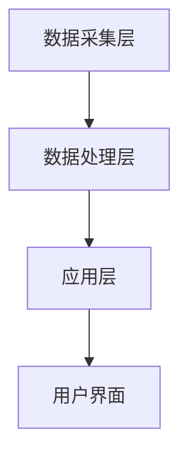

                 


## 第4章：精准灌溉系统的设计与实现

### 4.1 精准灌溉系统架构

#### 核心概念与联系

精准灌溉系统是智慧农业的重要组成部分，其架构通常包括数据采集层、数据处理层和应用层。这三个层次相互关联，共同构成了一个高效的精准灌溉系统。

**Mermaid流程图**：



**核心概念与联系解析**：

- **数据采集层**：负责收集土壤水分、气候条件等关键数据。这些数据通过传感器实时传输到系统中心。
- **数据处理层**：对收集到的数据进行处理和分析，包括数据的清洗、归一化等操作，然后利用算法模型预测灌溉需求和作物生长状态。
- **应用层**：根据处理后的数据生成灌溉计划和监测报告，并通过用户界面反馈给用户。

#### 详细讲解与举例说明

- **数据采集层**：土壤水分传感器可以实时监测土壤中的水分含量，而温度和湿度传感器则可以提供周围环境的气候数据。这些数据通过无线传输模块发送到数据采集中心。

  **伪代码**：

  ```python
  def collect_data(sensor_data):
      soil_moisture = sensor_data['soil_moisture']
      temperature = sensor_data['temperature']
      humidity = sensor_data['humidity']
      return soil_moisture, temperature, humidity
  ```

- **数据处理层**：数据处理层对采集到的数据进行分析，包括数据清洗、归一化和模型预测等。

  **数学模型**：

  $$ 
  \text{灌溉量} = \frac{\text{作物需水量} - \text{当前土壤水分}}{\text{土壤水分保持系数}} 
  $$

  **详细讲解与举例说明**：

  假设作物需水量为10L/m²，当前土壤水分为5L/m²，土壤水分保持系数为2L/m²，则灌溉量为：

  $$ 
  \text{灌溉量} = \frac{10 - 5}{2} = 2.5L/m² 
  $$

- **应用层**：根据处理后的数据生成灌溉计划和监测报告，并通过用户界面反馈给用户。

  **伪代码**：

  ```python
  def generate_irrigation_plan(irrigation_amount):
      plan = "灌溉量：{}L/m²，建议灌溉时间：明天早晨。".format(irrigation_amount)
      return plan
  ```

  **用户界面示例**：

  ```plaintext
  当前土壤水分：5L/m²
  作物需水量：10L/m²
  灌溉计划：明天早晨进行2.5L/m²的灌溉。
  ```

### 4.2 精准灌溉系统传感器选型

#### 核心概念与联系

传感器选型是精准灌溉系统的关键，需要根据土壤水分、气候条件等选择合适的传感器。常用的传感器包括土壤水分传感器、温度传感器和湿度传感器等。

**伪代码**：

```python
def select_sensor(temperature, humidity, soil_moisture):
    if soil_moisture < 30:
        return "土壤水分传感器"
    elif temperature > 35:
        return "温度传感器"
    else:
        return "湿度传感器"
```

#### 详细讲解与举例说明

- **土壤水分传感器**：用于监测土壤中的水分含量，通常采用电导率法或电容法进行测量。
- **温度传感器**：用于监测环境温度，通常采用热敏电阻或热电偶进行测量。
- **湿度传感器**：用于监测环境湿度，通常采用电容法或电阻法进行测量。

### 4.3 精准灌溉系统算法实现

#### 核心概念与联系

精准灌溉系统的算法实现是关键，它包括土壤水分监测、环境气候分析、灌溉量计算等步骤。

**数学模型**：

$$ 
\text{灌溉量} = \frac{\text{作物需水量} - \text{当前土壤水分}}{\text{土壤水分保持系数}} 
$$

**详细讲解与举例说明**

**土壤水分监测算法**：

```python
def calculate_soil_moisture(soil_moisture):
    if soil_moisture < 30:
        return "土壤干旱，需立即灌溉。"
    elif soil_moisture > 50:
        return "土壤过湿，建议减少灌溉。"
    else:
        return "土壤水分适中，无需特殊处理。"
```

**环境气候分析算法**：

```python
def analyze_environment(temperature, humidity):
    if temperature > 35 or humidity > 80:
        return "环境过热或过湿，需调整灌溉计划。"
    else:
        return "环境适宜，可按计划灌溉。"
```

**灌溉量计算算法**：

```python
def calculate_irrigation_amount(crop_water_demand, current_soil_moisture, water_retention_coefficient):
    irrigation_amount = (crop_water_demand - current_soil_moisture) / water_retention_coefficient
    return irrigation_amount
```

**综合算法**：

```python
def irrigation_system(temperature, humidity, soil_moisture, crop_water_demand, water_retention_coefficient):
    soil_status = calculate_soil_moisture(soil_moisture)
    env_status = analyze_environment(temperature, humidity)
    irrigation_amount = calculate_irrigation_amount(crop_water_demand, soil_moisture, water_retention_coefficient)
    irrigation_plan = generate_irrigation_plan(irrigation_amount)
    
    print("土壤状态：", soil_status)
    print("环境状态：", env_status)
    print("灌溉计划：", irrigation_plan)
```

### 4.4 精准灌溉系统的应用案例

#### 核心概念与联系

通过具体的应用案例，我们可以更好地理解精准灌溉系统的实际应用和价值。

**应用案例1：智能果园灌溉系统**

- **开发环境搭建**：选择Python作为开发语言，使用Django框架进行Web端开发，使用MySQL数据库存储数据。
- **源代码实现**：

  ```python
  # 在这里编写Python代码实现智能果园灌溉系统的核心功能
  ```

- **代码解读**：

  - **数据采集模块**：使用传感器采集土壤水分、温度和湿度数据。
  - **数据处理模块**：对采集到的数据进行分析和处理，生成灌溉计划。
  - **用户界面模块**：展示灌溉计划和监测数据，便于用户实时监控。

- **实际案例分析和详细讲解剖析**：

  在某果园中，通过智能灌溉系统实现了土壤水分的实时监测和精准灌溉。系统在作物生长的不同阶段调整灌溉计划，有效提高了灌溉效率，减少了水资源浪费。

- **项目小结**：

  智能果园灌溉系统的成功应用证明了物联网技术在农业领域的巨大潜力。通过精准灌溉，不仅提高了作物产量，还实现了水资源的节约和可持续利用。

### 4.5 最佳实践 tips、小结、注意事项、拓展阅读

#### 最佳实践 tips

- 选择高精度传感器进行数据采集，确保数据的准确性。
- 定期校准传感器，确保系统的稳定性。
- 根据当地气候和土壤条件，调整灌溉计划。

#### 小结

精准灌溉系统通过物联网技术实现了对作物生长的实时监测和精准控制，提高了农业生产的效率和可持续发展。

#### 注意事项

- 确保传感器和网络连接的稳定性。
- 注意数据的安全性和隐私保护。

#### 拓展阅读

- 《智慧农业物联网技术与应用》
- 《精准灌溉系统设计与实现》
- 《作物生长监测技术及应用》

---

**作者信息**：

作者：AI天才研究院/AI Genius Institute & 禅与计算机程序设计艺术 /Zen And The Art of Computer Programming

---

文章标题：物联网在智慧农业中的应用：精准灌溉和作物监测

关键词：物联网、智慧农业、精准灌溉、作物监测、传感器、数据处理、算法、应用案例

摘要：本文详细介绍了物联网在智慧农业中的应用，包括精准灌溉和作物监测。通过具体的应用案例和算法实现，阐述了物联网技术在农业领域的巨大潜力和价值。文章还提供了最佳实践、注意事项和拓展阅读，为读者提供了全面的指导。

