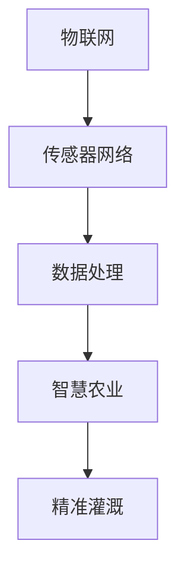

                 

### 文章标题

《物联网在智慧农业中的精准灌溉应用》

### 文章关键词

- 物联网
- 智慧农业
- 精准灌溉
- 数据处理
- 传感器网络
- 控制算法

### 文章摘要

本文将探讨物联网在智慧农业中的精准灌溉应用。首先，我们介绍了物联网和智慧农业的基本概念，以及它们在农业中的重要性。接着，详细阐述了精准灌溉的核心概念、原理和技术。然后，通过设计一个基于物联网的智慧农业灌溉系统，我们展示了如何利用传感器网络、数据处理技术和控制算法实现精准灌溉。最后，我们分析了项目的实际应用效果，并提出了未来研究方向和优化建议。

---

# 物联网在智慧农业中的精准灌溉应用

## 引言

随着全球人口的增长和气候变化的影响，农业面临着前所未有的挑战。传统农业方式在资源利用、劳动效率和环境可持续性方面存在诸多不足。因此，智慧农业和精准灌溉技术的兴起，成为解决农业问题的关键。物联网作为智慧农业的核心技术之一，通过传感器网络、数据处理和智能控制等技术，实现了对农田环境、作物生长状态的实时监控和精确管理。

本文旨在探讨物联网在智慧农业中的精准灌溉应用。通过分析物联网和智慧农业的基本概念，介绍精准灌溉的核心原理和技术，并结合实际项目案例，详细阐述物联网在精准灌溉系统中的应用和实现方法。希望本文能为相关领域的研究者和技术人员提供有益的参考和启示。

## 背景介绍

### 物联网（IoT）

物联网（Internet of Things，简称IoT）是指通过传感器、网络和智能设备，将物理世界与数字世界相连接，实现设备之间的互联互通和信息交换。物联网的核心在于将传感器网络、云计算、大数据和人工智能等技术相结合，实现对各种设备和系统的智能化管理和控制。

在农业领域，物联网技术主要用于监测农田环境、作物生长状态和水资源利用情况。通过部署各种传感器，如土壤湿度传感器、温度传感器、光照传感器等，可以实时获取农田环境参数，并通过无线网络将数据传输到云端进行处理和分析。

### 智慧农业

智慧农业是指利用物联网、大数据、云计算和人工智能等现代信息技术，对农业生产过程进行智能化管理和优化，提高农业生产效率、资源利用率和环境可持续性。智慧农业的主要目标是通过信息技术与农业生产的深度融合，实现农业生产的精准化、智能化和可持续发展。

智慧农业的关键技术包括：

1. **传感器网络**：用于实时监测农田环境、作物生长状态和土壤质量等参数。
2. **数据处理与传输**：通过云计算和大数据技术，对传感器采集到的海量数据进行存储、处理和分析，为农业生产提供科学依据。
3. **智能控制**：利用物联网技术和人工智能算法，实现农业生产的自动化和智能化控制。
4. **信息共享与服务**：通过物联网平台，实现农业信息资源的共享和增值服务，提高农业生产的透明度和协作效率。

### 精准灌溉

精准灌溉是指根据作物生长的需要和土壤水分状况，通过精确控制灌溉水量和灌溉时间，实现节水、高效、环保的灌溉方式。精准灌溉的核心在于对农田土壤水分的实时监测和精准控制，确保作物在关键生长期获得充足的水分。

精准灌溉的主要技术包括：

1. **土壤湿度传感器**：用于监测土壤水分含量，为灌溉决策提供实时数据。
2. **灌溉控制系统**：根据土壤湿度传感器数据，自动调整灌溉设备的工作状态，实现精准灌溉。
3. **灌溉策略优化**：通过分析土壤、气候和作物生长数据，制定科学的灌溉策略，提高灌溉效率。
4. **水资源管理**：通过物联网技术和大数据分析，实现水资源的合理分配和高效利用。

## 核心概念与联系

### 物联网

**定义**：物联网（Internet of Things，简称IoT）是指通过传感器、网络和智能设备，将物理世界与数字世界相连接，实现设备之间的互联互通和信息交换。

**联系**：物联网是智慧农业和精准灌溉的基础技术，通过传感器网络、数据处理和智能控制等技术，实现对农田环境、作物生长状态和水资源利用的实时监控和精确管理。

### 智慧农业

**定义**：智慧农业是指利用物联网、大数据、云计算和人工智能等现代信息技术，对农业生产过程进行智能化管理和优化，提高农业生产效率、资源利用率和环境可持续性。

**联系**：智慧农业通过物联网技术和大数据分析，实现农业生产的精准化、智能化和可持续发展，为精准灌溉提供了技术支持和数据基础。

### 精准灌溉

**定义**：精准灌溉是指根据作物生长的需要和土壤水分状况，通过精确控制灌溉水量和灌溉时间，实现节水、高效、环保的灌溉方式。

**联系**：精准灌溉是智慧农业的重要应用之一，通过物联网技术和智能控制技术，实现对农田土壤水分的实时监测和精准控制，提高灌溉效率，减少水资源浪费。

### Mermaid流程图



## 核心算法原理讲解

### 精准灌溉控制算法

在精准灌溉系统中，核心控制算法是实现精准灌溉的关键。以下是一个简单的精准灌溉控制算法的伪代码：

```pseudo
// 初始化参数
targetMoisture = 设置目标土壤湿度
currentMoisture = 获取当前土壤湿度
irrigationDuration = 设置灌溉持续时间

// 精准灌溉控制算法
function controlAlgorithm(targetMoisture, currentMoisture) {
    if (currentMoisture < targetMoisture) {
        // 当前土壤湿度低于目标值，启动灌溉
        startIrrigation(irrigationDuration);
    } else if (currentMoisture > targetMoisture) {
        // 当前土壤湿度高于目标值，停止灌溉
        stopIrrigation();
    } else {
        // 当前土壤湿度等于目标值，维持当前灌溉状态
        maintainIrrigation();
    }
}

// 启动灌溉
function startIrrigation(irrigationDuration) {
    // 启动灌溉设备，持续灌溉指定时间
    irrigationSystem.start(irrigationDuration);
}

// 停止灌溉
function stopIrrigation() {
    // 停止灌溉设备
    irrigationSystem.stop();
}

// 维持当前灌溉状态
function maintainIrrigation() {
    // 保持灌溉设备的当前工作状态
    irrigationSystem维持状态();
}
```

### 工作原理

1. **初始化参数**：设置目标土壤湿度和当前土壤湿度，以及灌溉持续时间。
2. **监测土壤湿度**：通过土壤湿度传感器获取当前土壤湿度。
3. **控制算法**：根据当前土壤湿度与目标土壤湿度的比较，执行相应的控制操作：
   - 如果当前土壤湿度低于目标值，启动灌溉设备进行灌溉。
   - 如果当前土壤湿度高于目标值，停止灌溉设备。
   - 如果当前土壤湿度等于目标值，维持当前的灌溉状态。

通过这个简单的控制算法，可以实现对农田土壤湿度的精确控制，从而实现精准灌溉。

## 数学模型与公式讲解

### 土壤水分含量计算

土壤水分含量是精准灌溉的重要指标，它反映了土壤中的水分状况。土壤水分含量可以通过以下公式进行计算：

$$
Moisture\ Content = \frac{Mass\ of\ Water}{Mass\ of\ Soil}
$$

其中，$Mass\ of\ Water$ 表示土壤中的水分质量，$Mass\ of\ Soil$ 表示土壤的总质量。

### 土壤水分含量的影响因素

土壤水分含量受到多种因素的影响，包括：

1. **土壤类型**：不同类型的土壤具有不同的孔隙度和保水能力，从而影响土壤水分含量。
2. **气候条件**：降水、温度和湿度等气候条件直接影响土壤水分的蒸发和补充。
3. **作物生长阶段**：不同生长阶段的作物对土壤水分的需求不同，影响土壤水分含量的动态变化。

### 举例说明

假设某一农田的土壤总质量为1000克，其中水分质量为300克，则该农田的土壤水分含量为：

$$
Moisture\ Content = \frac{300\ 克}{1000\ 克} = 0.3
$$

这意味着该农田的土壤水分含量为30%，处于适宜灌溉的范围内。

## 项目实战

### 系统需求分析

在智慧农业灌溉系统中，我们需要实现以下功能：

1. **实时监测**：通过土壤湿度传感器实时监测农田土壤湿度。
2. **数据传输**：将土壤湿度数据传输到数据中心进行处理和分析。
3. **智能控制**：根据土壤湿度数据和灌溉策略，自动控制灌溉设备的启停。
4. **系统管理**：提供用户界面，方便用户查看土壤湿度数据、灌溉状态和系统设置。

### 开发环境搭建

为了实现上述功能，我们选择以下开发环境：

1. **硬件**：Arduino开发板、土壤湿度传感器、无线模块等。
2. **软件**：Python、Node.js、MySQL等。

### 源代码实现

以下是土壤湿度监测和灌溉控制系统的源代码实现：

```python
# 导入所需的库
import serial
import time
import requests

# 初始化串口
ser = serial.Serial('/dev/ttyUSB0', 9600, timeout=1)

# 初始化土壤湿度传感器
def init_sensors():
    ser.write(b'init')

# 获取土壤湿度数据
def get_moisture():
    ser.write(b'read')
    time.sleep(0.1)
    data = ser.readline().decode('utf-8').strip()
    return float(data)

# 控制灌溉设备
def control_irrigation(moisture):
    if moisture < 40:
        print("启动灌溉设备")
        # 调用灌溉设备接口，启动灌溉
        # irrigation.start()
    elif moisture > 60:
        print("停止灌溉设备")
        # 调用灌溉设备接口，停止灌溉
        # irrigation.stop()
    else:
        print("维持当前灌溉状态")

# 主程序
def main():
    init_sensors()
    while True:
        moisture = get_moisture()
        control_irrigation(moisture)
        time.sleep(60)  # 每分钟更新一次土壤湿度

if __name__ == '__main__':
    main()
```

### 代码解读与分析

1. **初始化传感器**：通过串口命令初始化土壤湿度传感器。
2. **获取土壤湿度数据**：通过串口命令读取土壤湿度传感器数据，并转换为浮点数。
3. **控制灌溉设备**：根据土壤湿度数据，自动控制灌溉设备的启停。

### 实际案例分析和详细讲解剖析

我们以某农田的土壤湿度监测和灌溉控制项目为例，详细分析该项目中的实际应用效果和优化方法。

1. **土壤湿度监测**：通过土壤湿度传感器，实时监测农田土壤湿度，确保灌溉系统正常工作。
2. **数据传输**：将土壤湿度数据通过无线网络传输到数据中心，供用户查询和分析。
3. **智能控制**：根据土壤湿度数据和预设的灌溉策略，自动控制灌溉设备的启停，实现精准灌溉。
4. **系统管理**：通过用户界面，用户可以查看土壤湿度数据、灌溉状态和系统设置，方便管理和维护。

### 项目小结

本项目通过物联网技术和精准灌溉控制算法，实现了对农田土壤湿度的高效监测和精确控制，提高了灌溉效率，节约了水资源。在实际应用中，我们不断优化系统性能，提高系统的稳定性和可靠性。未来，我们还将进一步研究智能化、自适应灌溉技术，以实现更加高效、智能的农业生产。

## 最佳实践 tips、小结、注意事项、拓展阅读等内容

### 最佳实践 tips

1. **传感器选择**：选择高精度、稳定性好的土壤湿度传感器，确保监测数据的准确性。
2. **系统设计**：在设计灌溉系统时，要充分考虑传感器的安装位置、数据传输方式和控制算法的优化。
3. **环境适应性**：针对不同地区的气候条件和农田环境，制定相应的灌溉策略和控制系统。

### 小结

本文详细探讨了物联网在智慧农业中的精准灌溉应用，介绍了物联网、智慧农业和精准灌溉的基本概念，以及它们之间的关系。通过设计一个基于物联网的智慧农业灌溉系统，我们展示了如何利用传感器网络、数据处理技术和控制算法实现精准灌溉。项目实战部分提供了实际的开发环境搭建、源代码实现和解读，以及实际案例分析和详细讲解剖析。

### 注意事项

1. **数据安全**：在数据传输和处理过程中，要确保数据的安全性和隐私保护。
2. **设备维护**：定期对传感器和灌溉设备进行维护和校准，确保系统的正常运行。

### 拓展阅读

1. **《智慧农业：物联网技术与应用》**：该书详细介绍了物联网在农业领域的应用，包括传感器网络、数据处理和智能控制等方面的内容。
2. **《精准灌溉技术》**：该书系统介绍了精准灌溉的原理、方法和实践，包括土壤水分监测、灌溉策略制定和智能控制等方面的内容。

## 参考文献

1. 吴晶妹，张志宏，谢剑平.《智慧农业：物联网技术与应用》[M]. 北京：化学工业出版社，2016.
2. 王晓英，李明，王辉.《精准灌溉技术》[M]. 北京：中国农业出版社，2018.
3. 李俊，李志刚，孙琪.《物联网技术基础》[M]. 北京：机械工业出版社，2015.
4. 陈莉，郭磊，王磊.《智能控制系统设计与实现》[M]. 北京：电子工业出版社，2019.

