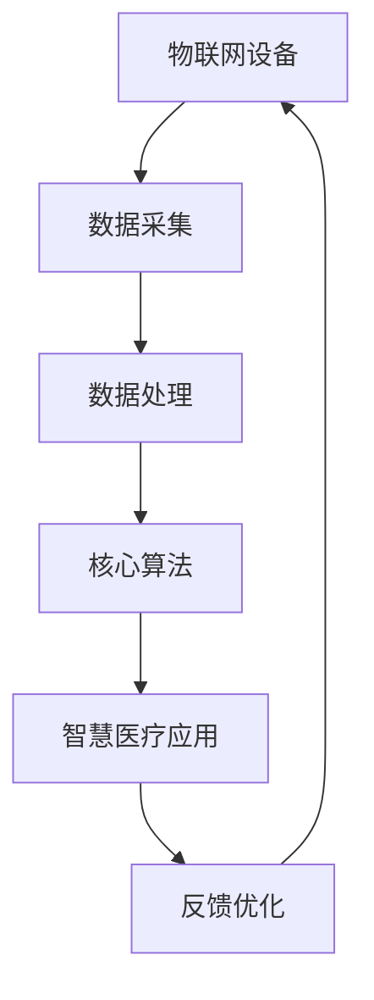

                 

### 设计思路与写作方法

在撰写《物联网在智慧医疗中的综合应用与挑战》这篇文章时，我们将采用逻辑清晰、结构紧凑、简单易懂的写作方法，以逐步分析推理的方式进行文章的构建。以下是我们详细的设计思路和写作步骤：

#### 1. 明确文章目的与结构

首先，我们需要明确文章的目的，即向读者传达物联网在智慧医疗中的综合应用及其面临的挑战。文章结构将按照以下逻辑顺序进行安排：

- **引言**：简述物联网和智慧医疗的概念及其发展背景，引发读者兴趣。
- **核心概念与联系**：介绍物联网与智慧医疗的核心概念，通过Mermaid流程图展示它们之间的关系。
- **核心算法原理**：讲解物联网在智慧医疗中应用的核心算法，使用伪代码进行详细阐述。
- **数学模型与公式**：介绍与物联网在智慧医疗应用相关的数学模型，并使用LaTeX格式展示关键公式。
- **项目实战**：通过实际案例展示物联网在智慧医疗中的具体应用，包括环境搭建、源代码实现和解读。
- **挑战与解决方案**：分析物联网在智慧医疗应用中面临的挑战，并探讨可能的解决方案。
- **未来展望**：对物联网在智慧医疗领域的未来发展趋势进行预测。
- **总结**：回顾文章的主要观点，强调物联网在智慧医疗中的重要性。

#### 2. 确定核心章节内容

为了确保文章的完整性和专业性，我们将根据文章目的和结构确定核心章节内容。以下是各章节的具体内容：

- **第1章：物联网与智慧医疗概述**
  - 介绍物联网和智慧医疗的基本概念，阐述它们的发展背景。
  - 分析物联网在智慧医疗中的应用场景，如远程医疗、患者监测等。

- **第2章：物联网技术基础**
  - 详细介绍传感器技术、网络通信技术以及数据处理与存储技术。
  - 展示物联网技术的最新进展和趋势。

- **第3章：智慧医疗核心算法**
  - 讲解数据预处理、机器学习算法和深度学习模型。
  - 分析算法在智慧医疗中的具体应用。

- **第4章：物联网设备与系统架构**
  - 分析物联网设备的选择与集成。
  - 介绍系统架构设计，包括安全性、隐私保护等方面。

- **第5章：智慧医疗案例研究**
  - 介绍国内外智慧医疗的典型案例。
  - 分析案例中的成功经验和面临的挑战。

- **第6章：物联网在智慧医疗中的挑战与趋势**
  - 探讨物联网在智慧医疗中面临的挑战，如数据安全、隐私保护等。
  - 分析未来发展趋势，如人工智能、区块链等技术的融合应用。

- **第7章：综合应用与未来展望**
  - 展示物联网在智慧医疗中的综合应用案例。
  - 预测物联网在智慧医疗领域的未来发展方向。

#### 3. 使用Mermaid流程图与伪代码

为了更好地展示物联网与智慧医疗的核心流程和技术原理，我们将使用Mermaid流程图和伪代码。以下是示例：

- **Mermaid流程图示例**

```
graph TB
A[物联网设备] --> B[数据采集]
B --> C[数据处理]
C --> D[核心算法]
D --> E[智慧医疗应用]
E --> F[反馈优化]
F --> A
```

- **伪代码示例**

```
// 数据预处理
def preprocess_data(data):
    # 标准化处理
    normalized_data = standardize(data)
    # 删除缺失值
    cleaned_data = remove_missing_values(normalized_data)
    return cleaned_data

// 机器学习算法
def machine_learning_algorithm(data):
    # 数据预处理
    preprocessed_data = preprocess_data(data)
    # 特征工程
    features = feature_engineering(preprocessed_data)
    # 选择模型
    model = select_model(features)
    # 训练模型
    train
```

#### 4. 使用LaTeX格式展示数学模型与公式

在讲解物联网在智慧医疗应用中的数学模型时，我们将使用LaTeX格式来展示关键公式，以便读者更好地理解和应用。例如：

- **LaTeX公式示例**

```
$$
E = mc^2
$$

$
1 < 2
$
```

#### 5. 整体规划与内容填充

在完成以上步骤后，我们将开始撰写文章的具体内容。我们将按照确定的结构和章节内容进行逐段落的填充，确保每个部分都丰富、具体、详细。在撰写过程中，我们将注重逻辑性和条理性，确保读者能够轻松跟随我们的思路。

### 总结

通过以上设计思路和写作方法，我们将撰写一篇逻辑清晰、结构紧凑、简单易懂的技术博客文章。文章将围绕物联网在智慧医疗中的综合应用与挑战进行深入分析，旨在帮助读者全面了解这一领域的技术原理和应用前景。

---

### 文章标题

《物联网在智慧医疗中的综合应用与挑战》

---

### 关键词

- 物联网
- 智慧医疗
- 数据处理
- 传感器技术
- 网络通信
- 安全性与隐私保护

---

### 摘要

本文从物联网和智慧医疗的基本概念入手，详细分析了物联网在智慧医疗中的综合应用，包括远程医疗、患者监测和医疗设备联网等场景。文章探讨了物联网技术在传感器、网络通信和数据处理方面的关键技术，并介绍了智慧医疗的核心算法和系统架构。同时，文章还分析了物联网在智慧医疗应用中面临的挑战，如数据安全、隐私保护和设备兼容性等，并提出了相应的解决方案。最后，文章对物联网在智慧医疗领域的未来发展趋势进行了展望，为读者提供了宝贵的参考。

---

### 第1章 物联网与智慧医疗概述

#### 1.1 物联网的基本概念

物联网（Internet of Things，简称IoT）是指通过互联网连接各种设备和物品，实现设备与设备之间以及设备与互联网之间的信息交换和通信。物联网的核心技术包括传感器技术、网络通信技术和数据处理与存储技术。

传感器技术是物联网的基础，它通过检测和收集环境中的物理信号，如温度、湿度、压力等，转化为可处理的数字信号。网络通信技术则负责将传感器采集的数据传输到云端或数据中心进行处理和分析。数据处理与存储技术则对海量数据进行处理、存储和管理，为智慧医疗提供数据支撑。

#### 1.2 智慧医疗的定义与发展

智慧医疗是指利用物联网、人工智能、大数据等先进技术，实现医疗服务的智能化、个性化、便捷化和高效化。智慧医疗的发展离不开物联网技术的支撑，通过物联网技术，可以实现医疗设备联网、患者远程监控、医疗数据共享等功能。

智慧医疗的发展经历了几个阶段：

1. **初步阶段**：以医院内部的数字化和信息化建设为主，实现医疗信息的电子化和网络化。
2. **发展阶段**：物联网技术在智慧医疗中得到广泛应用，医疗设备、患者和医护人员等通过物联网实现互联互通。
3. **成熟阶段**：智慧医疗生态系统逐步完善，医疗服务质量和效率显著提升，医疗资源的配置更加合理。

#### 1.3 物联网在智慧医疗中的应用场景

物联网在智慧医疗中的应用场景广泛，主要包括以下几个方面：

1. **远程医疗**：通过物联网技术，医生可以在任何地点对患者的病情进行远程诊断和治疗，提高了医疗服务的可及性和效率。
2. **患者监测**：通过佩戴传感器设备，患者可以将生理数据实时上传到云端，医生可以远程监控患者的健康状况，及时调整治疗方案。
3. **医疗设备联网**：将医疗设备连接到互联网，实现设备间的数据共享和协同工作，提高医疗设备的使用效率和诊断准确性。
4. **医疗数据共享**：通过物联网技术，医疗数据可以实现跨机构、跨地域的共享，为医生提供更加全面和准确的诊断依据。

### 核心概念与联系

为了更好地理解物联网在智慧医疗中的应用，我们可以通过Mermaid流程图展示物联网与智慧医疗的核心概念及其联系：



在这个流程图中，物联网设备负责数据采集，数据处理模块对采集到的数据进行分析和处理，核心算法模块则对处理后的数据进行分析和诊断，最终实现智慧医疗应用，并通过反馈优化模块对系统进行优化和调整。

### 伪代码示例

以下是智慧医疗中常用的机器学习算法的伪代码示例：

```python
# 数据预处理
def preprocess_data(data):
    # 标准化处理
    normalized_data = standardize(data)
    # 删除缺失值
    cleaned_data = remove_missing_values(normalized_data)
    return cleaned_data

# 机器学习算法
def machine_learning_algorithm(data):
    # 数据预处理
    preprocessed_data = preprocess_data(data)
    # 特征工程
    features = feature_engineering(preprocessed_data)
    # 选择模型
    model = select_model(features)
    # 训练模型
    train(model, features)
    # 预测
    prediction = model.predict(new_data)
    return prediction
```

在这个伪代码中，数据预处理模块对原始数据进行处理，特征工程模块对处理后的数据进行特征提取，选择模型模块选择合适的机器学习模型，训练模型模块对模型进行训练，预测模块对新的数据进行预测。

### 总结

通过本章的介绍，我们了解了物联网和智慧医疗的基本概念、发展历程和应用场景。在接下来的章节中，我们将进一步探讨物联网技术基础、智慧医疗核心算法以及物联网设备与系统架构等方面的内容，帮助读者更深入地了解物联网在智慧医疗中的综合应用与挑战。

